# Algoritmusok és Adatszerkezetek I

---

## 1. Részproblémára bontható algoritmusok (mohó, oszd-meg-és-uralkodj, dinamikus programozás), rendező algoritmusok, gráfalgoritmusok (szélességi- és mélységi keresés, minimális feszítőfák, legrövidebb utak)

### Mohó algoritmusok

A feladatot pontosan egy részfeladatra bontják, és azt tovább rekurzívan oldják meg. Mindig a legjobbnak tűnő megoldás irányába haladunk tovább.

**Nem minden problémára adható mohó megoldás!**

De ha létezik, akkor nagyon hatékony!

**Mohó választás**: Az adott problémát egyetlen részproblémára bontja. Ennek optimális megoldásából következik az eredeti feladat optimális megoldása is.

#### Mohó algoritmus tervezése

1. Fogalmazzuk meg a **mohó választást**.

2. Bizonyítsuk be, hogy az eredeti problémának mindig van olyan **optimális megoldása**, amely **tartalmazza a mohó választást**. Tehát hogy a mohó választás **biztonságos**.

3. Bizonyítsuk be, hogy a mohó választással olyan részprobléma keletkezik, amelynek egy **optimális megoldásához hozzávéve a mohó választást**, az eredeti probléma egy optimális megoldását kapjuk.

#### Példa: _Töredékes hátizsák feladat_

**Bemenet**: A hátizsák $S$ kapacitása, $n$ tárgy, $S_i$ tárgy súlyok, $E_i$ tárgy értékek

**Kimenet**: Mi a legnagyobb érték, ami $S$ kapacitásba belefér?

Minden tárgyból 1db van, de az darabolható.

**Algoritmus**:

- Számoljuk ki minden tárgyra az $\frac{E_i}{S_i}$ arányt

- Tegyünk bele a legnagyobb $\frac{E_i}{S_i}$-vel rendelkező, még rendelkezésre álló tárgyból annyit a zsákba, amennyi belefér

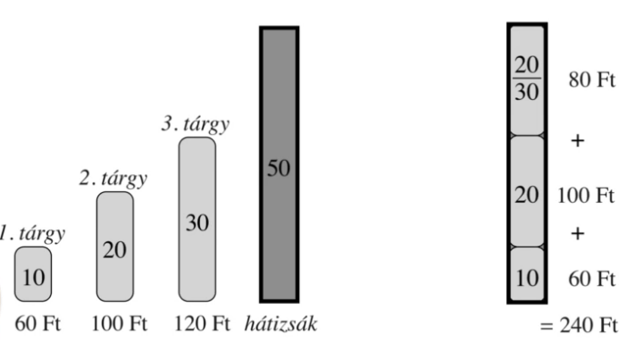

Futás a fenti példán:

- Kiszámoljuk az $\frac{E_i}{S_i}$ értékeket
  
  1. Tárgy: 6
  
  2. Tárgy: 5
  
  3. Tárgy: 4

- Végighaladunk a tárgyakon az $\frac{E_i}{S_i}$ arányok szerint
  
  - Az első tárgy teljes egészében belefér, azt beválasztjuk.
  
  - A 2. tárgy is teljes egészében belefér, azt is beválasztjuk.
  
  - A 3. tárgy már nem fér be, beválasztunk annyit, amennyi kitölti a szabad helyet. Jelen esetben a tárgy $\frac{2}{3}$-át.

> A probléma nem-törtedékes verziójára ez a mohó algoritmus nem mindig talál optimális megoldást.

> test

### Oszd-meg-és-uralkodj algoritmusok

A feladatot több **részfeladatra** bontjuk, ezek hasonlóak az eredeti feladathoz, de méretük kisebb, tehát ugyan azt a feladatot akarjuk egy kisebb bemenetre megoldani.

**Rekurzív módon** megoldjuk ezeket a részfeladatokat (azaz ezeket is kisebb részfeladatokra bontjuk egészen addig, amíg elemi feladatokig jutunk, amelyekre a megoldás triviális), majd **összevonjuk őket**, hogy az eredeti feladatra megoldást adjanak.

> A részfeladatok ne legyenek átfedőek. Bár az algoritmus ettől még működhet, de nem hatékony.

#### Lépések

1. **Felosztás**: Hogyan osztjuk fel a feladatot több kisebb részfeladatra.

2. **Uralkodás**: A feladatokat rekurzív módon megoldjuk. Ha a részfeladatok mérete elég kicsi, akkor közvetlenül meg tudjuk oldani a részfeladatot, ilyenkor nem osztjuk tovább rekurzívan.

3. **Összevonás**: A részfeladatok megoldásait összevonjuk az eredeti feladat megoldásává.

#### Példa: _Összefésülő rendezés_

1. **Felosztás**: Az $n$ elemű rendezendő sorozatot felosztja két $\frac{n}{2}$ elemű részsorozatra.

2. **Uralkodás**: A két részsorozatra rekurzívan tovább hívjuk az összefésülő rendezés eljárást. Az elemi eset az egy elemű részsorozat, hiszen az már rendezett, ilyenkor csak visszatérünk vele.

3. **Összevonás**: Összefésüli a két rendezett részsorozatot, ezzel létrehozza az eredeti sorozat rendezett változatát.

```c
          [6, 5, 3, 1, 8, 7, 2, 4]
               /             \
        [6, 5, 3, 1]    [8, 7, 2, 4]
          /                      \
  [6, 5]    [3, 1]        [8, 7]    [2, 4]
  /  \       /   \        /   \      /   \
[6]  [5]    [3]  [1]    [8]  [7]    [2]  [4]

[6]  [5]    [3]  [1]    [8]  [7]    [2]  [4]
  \  /        \  /        \  /        \  /
 [5, 6]      [1, 3]      [7, 8]      [2, 4]
      \      /                \      /
    [1, 3, 5, 6]            [2, 4, 7, 8]
          \                       /
           [1, 2, 3, 4, 5, 6, 7, 8]
```

> Az összefésülés folyamata egyszerű, csak két mutatót vezetünk a két rendezett tömbön, lépkedünk, mindig a kisebbet fűzzük egy másik, kezdetben üres tömbhöz.

#### Példa: _Felező csúcskereső algoritmus_

Vizsgáljuk meg a középső elemet. Ha csúcs, térjünk vissza vele, ha nem csúcs, akkor az egyik szomszédja nagyobb, vizsgáljuk tovább a bemenet felét ezen szomszéd irányába. Azért megyünk ebbe az irányba, mert erre biztosan van csúcs. Ezt onnan tudjuk, hogy maga ez a nagyobbik szomszéd is egy potenciális csúcs. Ha mindkét szomszédja nagyobb, akkor mindegy melyik irányba haladunk tovább, egyszerűen azzal, amiről előbb megtudtuk, hogy nagyobb.

1. **Felosztás**: $n$ elemű sorozatot felosztjuk két $\frac{n - 1}{2}$ elemű részsorozatra
2. **Uralkodás**: A megfelelő részsorozatban rekurzívan tovább keresünk csúcsot
3. **Összevonás**: Ha csúcsot találtunk, adjuk vissza

```c
// Kiindulási tömb:
[1, 3, 4, 3, 5, 1, 3]

// Középső elemet megkeressük, nem csúcs, így tovább haladunk:
[1, 3, 4, 3, 5, 1, 3]
          ^
// Középső elemet megkeressük, nem csúcs, így tovább haladunk:
[1, 3, 4][3, 5, 1, 3]
    ^
// A középső elem egy csúcs, visszaadjuk
[1, 3][4][3, 5, 1, 3]
       ^
```

Ez az algoritmus logaritmikus időigényű. Ezzel szemben az egyszerű megoldás amikor minden elemen végighaladva keresünk csúcsot, lineáris, azaz jelentősen rosszabb.

### Dinamikus programozás

Olyan feladatok esetén alkalmazzuk, amikor a **részproblémák nem függetlenek**, azaz vannak közös részproblémák.

> **Optimalizálási feladatok** tipikusan ilyenek.

A megoldott **részproblémák eredményét memorizáljuk** (mondjuk egy táblázatban), így ha azok mégegyszer elő kerülnek, nem kell újra kiszámolni, csak elővenni memóriából az eredményt.

#### Iteratív megvalósítás

- Minden részmegoldást kiszámolunk.

- Alulról-felfelé építkező megközelítés, hiszen előbb a kisebb részproblémákat oldjuk meg, amiknek az eredményét felhasználjuk az egyre nagyobb részproblémák megoldásához.

#### Rekurzív megvalósítás

- Részmegoldásokat kulcs-érték formájában tároljuk.

- Felülről lefele építkező megközelítés.

- **Csak akkor használjuk, ha nem kell minden megoldást kiszámolni!**
  
  - Ha ki kell mindent számolni, érdemesebb az iteratív megköelítést választani a függvényhívások overhead-je miatt.

#### Példa: _Pénzváltás feladat_

Adott $P_i$ érmékkel (mindből van végtelen sok) hogyan lehet a legkevesebb érmét felhasználva kifizetni $F$ forint.

```c
// Input:
P1 = 1;
P2 = 5;
P3 = 6;
F  = 9;
```

##### Rekurzív megvalósítással a futás

```c
// Egy dimenziós tömbbel dolgozunk, egyes sorokban
// az egyes hívások állapota látszódik.
// Első sor a pénzérme indexét jelöli.

0  1  2  3  4  5  6  7  8  9
0  -  -  -  -  -  -  -  -  ? // penzvalt(9) = min( penzvalt(3), penzvalt(4), penzvalt(8) ) + 1
0  -  -  ?  -  -  -  -  -  ? // penzvalt(3) = min( penzvalt(2) ) + 1
0  -  ?  ?  -  -  -  -  -  ? // penzvalt(2) = min( penzvalt(1) ) + 1
0  ?  ?  ?  -  -  -  -  -  ? // penzvalt(1) = min( penzvalt(0) ) + 1
0  1  ?  ?  -  -  -  -  -  ? // penzvalt(0)-t ismertük már, kiindulástól kezdődően el volt mentve rá a triviális 0 megoldás, így penzvaltas(1) = 0 + 1
0  1  2  ?  -  -  -  -  -  ? // penzvalt(1) visszatér, kiadja penzvalt(2) eredményét
0  1  2  3  -  -  -  -  -  ? // penzvalt(2) visszatér, kiadja penzvalt(3) eredményét
0  1  2  3  -  -  -  -  -  ? // penzvalt(3) visszatér

// penzvalt(9) jelenleg itt tart: min( 3, penzvalt(4), penzvalt(8) ) + 1
0  1  2  3  4  -  -  -  -  ? // penzvalt(4) = min( penzvalt(3) ) + 1

// penzvalt(9) jelenleg itt tart: min( 3, 4, penzvalt(8) ) + 1
0  1  2  3  4  -  -  -  ?  ? // penzvalt(8) = min( penzvalt(2) = 2, penzvaltas(3) = 3, penzvaltas(7) ) + 1
0  1  2  3  4  -  -  ?  ?  ? // penzvalt(7) = min( penzvalt(1) = 1, penzvaltas(2) = 2, penzvaltas(6) ) + 1
0  1  2  3  4  -  ?  ?  ?  ? // penzvalt(6) -> mivel ilyen érménk van, így ezt nem kell kiszámolni, tujuk, hogy penzvalt(6) = 1
0  1  2  3  4  -  1  2  ?  ? // penzvalt(6) visszatér, kiadja penzvalt(7)-et
0  1  2  3  4  -  1  2  3  ? // penzvalt(7) visszatér, kiadja penzvalt(8)-at
0  1  2  3  4  -  1  2  3  4 // penzvalt(8) visszatér, kiadja penzvalt(9)-et
```

> Bár elmondható, hogy egy esetre, az 5-re nem kellett kiszámolnunk az értéket, de ez implementáció függő volt, ha `penzvalt(6)`-ot is ugyan úgy számoltuk volna, mint a többi értéket, akkor mindent kiszámoltunk volna, ás a rekurzív függvényhívűsok overhead-je miatt egyértelműen az iteratív megközelítés lenne a jobb.

##### Iteratív megvalósítással a futás

```c
// 0-tól F-ig (9-ig) építunk egy egy dimentziós tömböt
0  1  2  3  4  5  6  7  8  9

0  ?  ?  ?  ?  ?  ?  ?  ?  ?
0  1  ?  ?  ?  ?  ?  ?  ?  ? // penzvalt[1] = min( penzvalt[0] ) + 1
0  1  2  ?  ?  ?  ?  ?  ?  ? // penzvalt[2] = min( penzvalt[1] ) + 1
0  1  2  3  ?  ?  ?  ?  ?  ? // penzvalt[3] = min( penzvalt[2] ) + 1
0  1  2  3  4  ?  ?  ?  ?  ? // penzvalt[4] = min( penzvalt[3] ) + 1
0  1  2  3  4  1  ?  ?  ?  ? // penzvalt[5] = min( penzvalt[0], penzvalt[4] ) + 1
0  1  2  3  4  1  1  ?  ?  ? // penzvalt[6] = min( penzvalt[0], penzvalt[1], penzvalt[5] ) + 1
0  1  2  3  4  1  1  2  ?  ? // penzvalt[7] = min( penzvalt[1], penzvalt[2], penzvalt[6] ) + 1
0  1  2  3  4  1  1  2  3  ? // penzvalt[8] = min( penzvalt[2], penzvalt[3], penzvalt[7] ) + 1
0  1  2  3  4  1  1  2  3  4 // penzvalt[9] = min( penzvalt[3], penzvalt[4], penzvalt[8] ) + 1
```

### Rendező algoritmusok

#### Rendezés

- **Input**: Egészek egy $n$ hosszú tömbje (egy `<a1, a2, ..., an>` sorozat)

- **Output**: $n$ hosszú, rendezett tömb (az input sorozat egy olyan `<a'1, a'2, ..., a'n>` permutációja, ahol `a'1 <= a'2 <= ... <= a'n`)

> Ez egy egyszerű eset, a gyakorlatban:
> 
> - Van valamilyen iterálható kollekciónk: `Iterálható<Objektum>`)
> 
> - Van egy függvényünk, ami megondja képt kollekció-elemről, hogy melyik a _nagyobb_: `(a: Objektum, b: Objektum) => -1 | 0 | 1`
> 
> Ezek együttesével már megfelelően absztrakt módon tudjuk használni az összehasonlító rendező algoritmusokat bármilyen esetben.

#### Beszúró rendezés

**Helyben rendező** módszer.

```ts
const beszuroRendezes = (A: number[]) => {
  for (let j = 1; j < A.length; j++) {
    const beillesztendo = A[j];
    let i = j - 1;
    for (; i >= 0 && A[i] > beillesztendo; i--) {
      A[i + 1] = A[i];
    }
    A[i + 1] = beillesztendo;
  }
  return A;
};
```

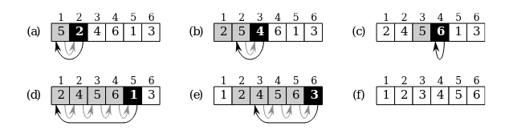

Végig haladunk a tömbön, és minden elemtől visszafelé elindulva megkeressük annak a helyét, és beszúrjuk oda. Amin áthaladtunk, az a részsorozat már rendezett lesz mindig.

| Futásidő | Tárigény ( össz ~ inputon kívül ) |
|:--------:|:---------------------------------:|
| $O(n^2)$ | $O(n)$ ~ $O(1)$                   |

Legrosszabb eset: Teljesen fordítva rendezett tömb az input: `[5, 4, 3, 2, 1]`. Ekkor minden `beillesztendo` elemre vissza kell lépkedni a tömb elejéig.

#### Kupacrendezés

```ts
const kupacRendezes = (A: number[]) => {
    maximumKupacotEpit(A); // Helyben kupacosítja
    for (let i = A.length - 1, i >= 1; i--) {
        csere(A[1], A[i]);
        kupacMeret[A]--;
        maximumKupacol(A, 1);
    }

    return A;
}
```

Az input tömböt először **maximum-kupaccá** kell alakítani. Ekkor tudjuk, hogy a legnagyobb elem a gyökérben van, így ezt berakhatjuk az éppenvizsgált pozícióra (`csere(A[1], A[i])`). Ez után már csak csökkentenünk kell a kupac méterét, hiszen nem akarjuk mégegyszer a gyökérben az `A[i]`-t. Végezetül helyre kell állítanunk a kupac-tulajdonságot egy `maximumKupacol(A, 1)` hívással. (A 2. paraméter azt mondja meg, melyik csúcsbtól lefelé szeretnénk helyreállítani, jelen esetben az 1-es, hiszen pont azt a pozíciót rontottuk el, amikor cseréltünk. Tehát az egész kupacot helyreállítjuk.)

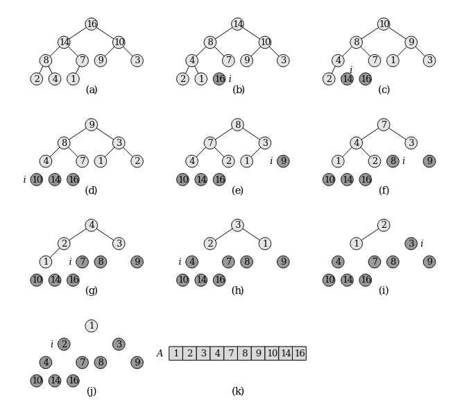

| Futásidő      | Tárigény ( össz ~ inputon kívül ) |
|:-------------:|:---------------------------------:|
| $O(n*log(n))$ | $O(n)$ ~ $O(1)$                   |

#### Gyorsrendezés

Összefésülő rendezéshez hasonlóan oszd-meg-és-uralkodj algoritmus

- **Felosztás**: Az `A[p..r]` tömböt, két (esetleg üres) `A[p..q-1]` és `A[q+1..r]` résztömbre osztjuk, hogy az `A[p..q-1]` minden eleme kisebb, vagy egyenlő `A[q]`-nál, és `A[q]` kisebb vagy egyelő `A[q+1..r]` minden eleménél. A `q` index kiszámítása része ennek a felosztó eljárásnak.

- **Uralkodás**: Az `A[p..q−1]` és `A[q+1..r]` résztömböket a gyorsrendezés rekurzív hívásával rendezzük.

- **Összevonás**: Mivel a két résztömböt helyben rendeztük, nincs szükség egyesítésre: az egész `A[p..r]` tömb rendezett.

```ts
const feloszt = (A: number[], p: number, r: number) => {
  const x = A[r];
  let i = p - 1;
  for (let j = p; j <= r - 1; j++) {
    if (A[j] <= x) {
      i++;
      [A[i], A[j]] = [A[j], A[i]];
    }
  }
  [A[r], A[i + 1]] = [A[i + 1], A[r]];
  return i + 1;
};
```

```ts
const _gyorsRendezes = (A: number[], p: number, r: number) => {
  if (p < r) {
    const q = feloszt(A, p, r);
    _gyorsRendezes(A, p, q - 1);
    _gyorsRendezes(A, q + 1, r);
  }
  return A;
};

const gyorsRendezes = (A: number[]) => _gyorsRendezes(A, 0, A.length - 1);
```

| Futásidő | Tárigény |
| -------- |:--------:|
| $O(n^2)$ | $O(n)$   |

> Fontos, hogy az eljárás teljesítménye függ attól, hogy a felosztások mennyire ideálisak. Valószívűségi alapon a vátható rekurziós mályság $O(logn)$, ami mivel egy hívás futásideje $O(n)$, így az átlagos futásidő $O(n * logn)$. A gyakorlat azt mutatja, hogy ez az algoritmus jól teljesít.

> Lehet úgy implementálni, hogy $O(logn)$ tárigénye legyen, ez egy helyben rendező, farok-rekurzív ejlárás.

#### Összehasonlító rendezések teljesítményének alsó korlátja

Minden összehasonlító rendező algoritmus legrosszabb esetben $\Omega(n * logn)$ összehasonlítást végez.

> Ez alapján pl. az összefésülő, vagy a kupac rendezés **aszimptotikusan optimális**.

> Eddigi algoritmusok mind összahasonlító rendezések voltak, a kövezkező már nem az.

Ezt döntési fával lehet bebizonyítani, aminek belső csúcsai meghatároznak két tömbelemet, amiket épp összehasonlítunk, a levelek pedig hogy az oda vezető összehasonlítások milyen sorrendhez vezettek. Nem konkrét inputra írható fel döntési fa, hanem az algoritmushoz. Így ennek a fának a legrosszabb esetben vett magassága lesz az algoritmus futásidejének felső korlátja.

#### Leszámoló rendezés

Feltételezzük, hogy az összes bemeneti elem $0$ és $k$ közé esik.

Minden lehetséges bemeneti elemhez megszámoljuk, hányszor fordul elő az inputban.

Majd ez alapján azt, hogy hány nála kisebb van.

Ez alapján már tudjuk, hogy az egyes elemeknek hova kell kerülni. Mert ha pl 5 elem van, ami kisebb, vagy egyenlő, mint 2, akkor tudjuk, hogy az 5. pozíción 2-es kell, hogy legyen.

```ts
const leszamoloRendezes = (A: number[], k: number) => {
  const C = [...new Array(k + 1)].map(() => 0)
  A.forEach(szam => {
    C[szam]++
  })
  // Itt a C-ben azon elemek száma van, aminek értéke i

  for (let i = 1; i < C.length; i++) {
    C[i] += C[i - 1]
  }
  // Itt C-ben i indexen azon elemek száma van, amik értéke kisebb, vagy egyenlő, mint i

  const B = [...new Array(A.length)] // B egy A-val egyező hosszú tömb

  for (let i = A.length - 1; i >= 0; i--) {
    B[C[A[i]] - 1] = A[i]
    C[A[i]]--
  }

  return B
}
```

| Futásidő        | Tárigény     |
|:---------------:|:------------:|
| $\Theta(k + n)$ | $\Theta(2n)$ |

> A gyakorlatban akkor használjuk, ha $k = O(n)$, mert ekkor a futásidő $\Theta(n)$

### Gráfalgoritmusok

Gráfog ábrázolása: **éllista** vagy **szomszédsági mátrix**

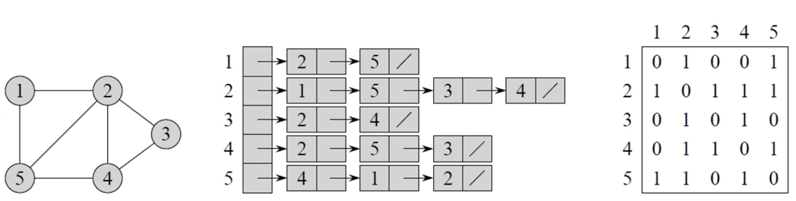

#### Szélességi keresés

Gráf bejárására szolgál.

A bejárás során kijelöl egy "szélességi fát", ami egy kiindulási csúcsból indulva mindig az adott csúcsból elérhető csúcsokat reprezentálja.

Amilyen távol van a kiindulási csúcstól egy csúcs, az olyan mélységen helyezkedik el ebben a fában.

Irányított, irányítatlan gráfog esetén is alkalmazható.

A csúcsok távolsága alapján kalad a bejárás (a kijelölt kezdeti csúcstól), minden $k$ távolságra levő csúcsot elérünk az előtt, hogy egy $k + 1$ távolságra levőt elérnénk.

Az algoritmus színezi a csúcsokat, ezek a színek a következőket jelentik:

- **fehér**: Kiindulási szín, egy ilyen színű csúcsot még nem értünk el.

- **szürke**: Elért csúcs, de még van fehér szomszédja.

- **fekete**: Elért csúcs, és már minden szomszédja is elért (vagy szürke vagy fekete).

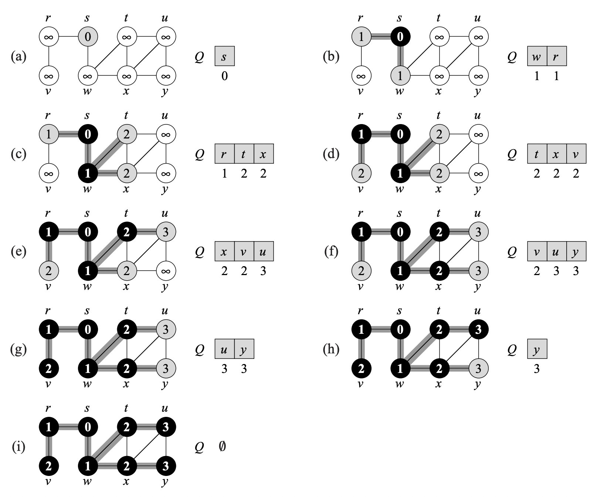

```js
// A G a gráf, s a kiindulási csúcs
szelessegiKereses(G, s) {
    for G grás minden nem s csúcsára {
        szín[csucs] = "fehér"
    }
    szín[s] = "szürke"
    d[s] = 0 // Távolság s-től
    szülő[s] = null
    Q = [] // Üres SOR
    sorba(Q, s)
    while Q nem üres {
        u = sorból(Q)
        for u minden v szomszédjára {
            if (szín[v] === "fehér") {
                szín[v] = "szürke"
                d[v] = d[u] + 1
                szülő[v] = u
                sorba(Q, v) // Tovább feldolgozzuk majd neki a szomszédjait
            }
        }
        szín[u] = "fekete" // Itt már végigmentünk minden szomszédján
    }
}
```

##### Futásidő

- Minden csúcsot egyszer érintünk csak, ez $V$ db csúcs.

- Sorba, és sorból $O(1)$, így a sorműveletek összesen $O(V).$

- Szomszédsági listákat legfeljebb egyszer vizsgáljuk meg, ezek össz hossza $\theta(E)$, így  összesen $O(E)$ időt fordítunk a szomszédsági listák vizsgálására.

- Az algoritmus elején a kezdeti értékadások ideje $O(V)$.

- Összesített futásidő: $O(E + V)$

#### Mélységi keresés

Addig megy a kivezető élek mentén, ameddig tud, majd visszafele indulva minden érintett csúcs kivezető élein addig megy mélyre, amíg lehet.

Ugyan azokat a színekez használja a csúcsok színezésére, mint a szélességi keresés.

Minden csúcshoz feljegyzi, hogy mikor (hány lépés után) érte el, és hagyta el azt.

```js
melysegiKereses(G) {
    for G minden u csúcsára {
        szín[u] = "fehér"
        szülő[u] = null
    }
    idő = 0
    for G minden u csúcsára {
        if (szín[u] === "fehér") {
            melysegiBejaras(u)
        }
    }
}

melysegiBejaras(u) {
    szín[u] = "szürke"
    idő++
    d[u] = idő // Ekkor értük el
    for u minden v szomszédjára {
        if (szín[v] === "fehér") {
            szülő[v] = u
            melysegiBejaras(v) // Azonnal már indulunk is el a talált csúcsból
        }
    }
    szín[u] = "fehete"
    ido++
    f[u] = ido // Ekkor hafytuk el
}
```

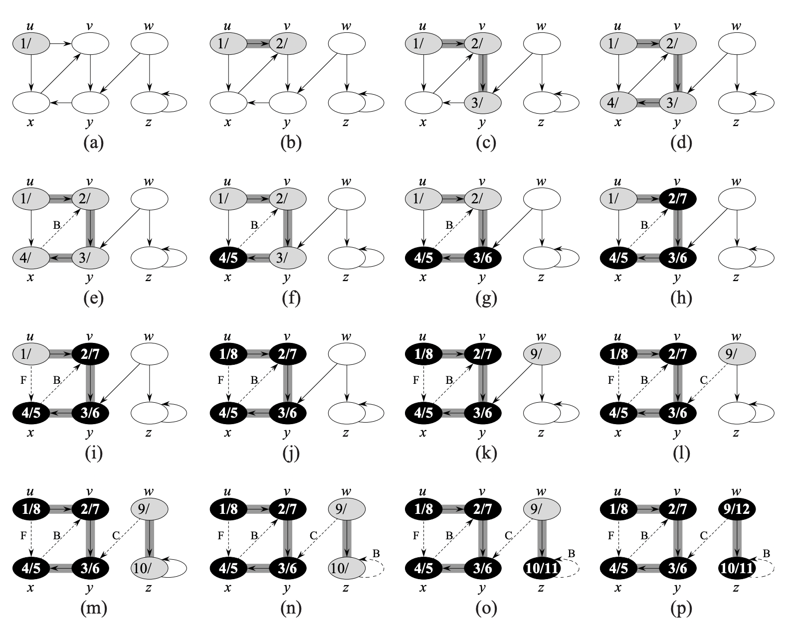

##### Futásidő

A melysegiKereses() futásideje a melysegiBejaras() hívástól eltekintve $\Theta(V)$. A melysegiBejaras() hívások össz futásideje $\Theta(E)$, mert ennyi a szomszédsági listák összesített hossza. Így a futásidő $O(E + V)$

> A futásidő azért lesz additív mingkét esetben, mert a szomszédsági listák össz hosszára tudjuk mondani, hogy $\Theta(E)$. Lehet, hogy ezt egyszerre nézzük végig, lehet, hogy eloszlatva, de **összessen** ennyi szomszédot vizsgál meg például a mélységiBejárás().

#### Minimális feszítőfák

Cél: megtalálni éleknek azon **körmentes** részhalmazát, amely élek mentén **minden csúcs összeköthető,** és az élek **összesített súlya** legyen a **lehető legkisebb**.

Az így kiválasztott élek egy fát alkotnak, ez a **feszítőfa**.

Két **mohó** algoritmus: **Prim**, **Kruskal**

##### Kruskal

A gráf csúcsait diszjunkt halmazokba sorolja. Kezdetben minden csúcs 1-1 egy elemú csúcs.

> Erre van speciális diszjunkt-halmaz adatszerkezet

Minden iterációban beveszi a legkisebb súlyú élet, aminek végpontjai különböző halmazokban vannak.

Ez által egy erdőt kezel, mit a végére egy fává alakít. Ez lesz a feszítőfa.

```js
kruskal(G, w) { // Az élsúlyokat megadó függvény
    A = 0
    for minden v csúcsra {
        halmaztKeszit(v)
    }
    for minden (u, v) élre, az élsúlyok szerin növekvő sorrendben {
        if halmaztKeres(u) != halmaztKeres(v) {
            A = A unió { (u, v) }
            egyesít(u, v)
        }
    }
}
```

`halmaztKeszit`, `halmaztKeres` és `egyesít` a diszjunkt halmazokat kezelő függvények.

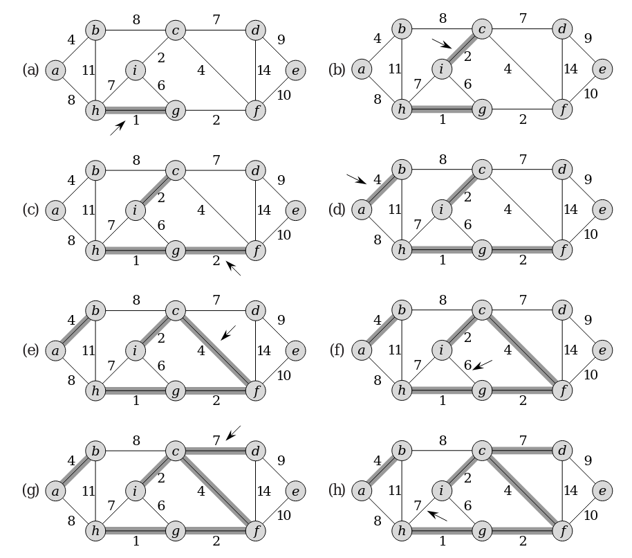

###### Futásidő

Az élek rendezése $O(E * logE)$.

A halmaz műveletek a kezdeti értékadásokkal együtt $O((V + E) * \alpha * (V)$. Ahol az $\alpha$ egy nagyon lassan növekvő függvény, a diszjunkt-halmaz adatszerkezet jasátossága. Mivek összefüggő gráf esetén $O(|E| \ge |V| + 1)$, így a diszjunkt-halmaz műveletek $O((E) * \alpha * (V))$ idejűek. $\alpha(|V|) = O(log E)$ miatt $O(E * log E)$.

Így a teljes futásidő $O(E * logE)$.

#### Prim algoritmus

A Kruskallal ellentétben folyamatosan egy darab fát kezel, ezt növeli az iterációkban.

Egy megadott kiindulási csúcsból indulva minden iterációban hozzávesszük azt a csúcsot, amit a legkisebb súlyú él köt a meglévő fához.

```js
prim(G, w, r) { // Az élsúlyokat megadó függvény
    for minden v csúcsra {
        kulcs[v] = Végtelen
        szülő[v] = null
    }
    kulcs[r] = 0
    Q = G csúcsai // Prioritási sor kulcs[] szerint minimális
    while Q nem üres {
        u = kiveszMin(Q)
        for u minden v szomszédjára {
            if v eleme Q, és w(u, v) < kulcs[v] {
                szülő[v] = u
                kulcs[v] = w(u, v)
            }
        }
    }
}
```

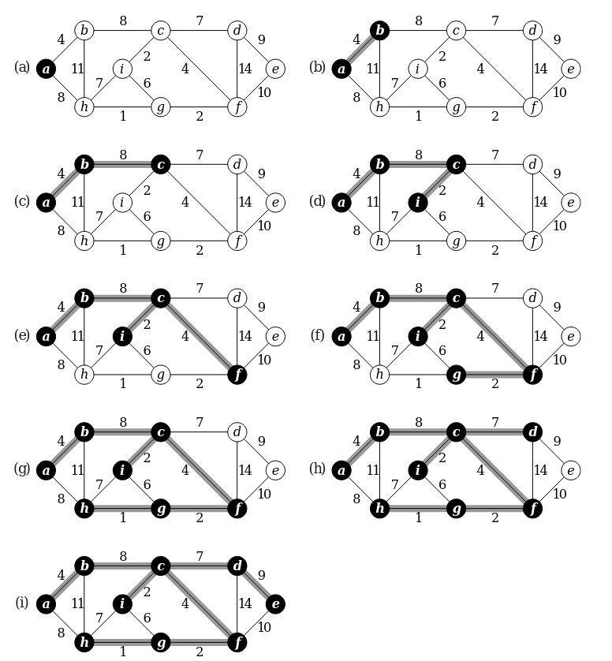

###### Futásidő

Bináris minimum kupac megvalósítással:

Kezdeti értékadások: $O(V)$

Egy db kiveszMin művelet: $O(logV)$. Összesen: $O(V * log V)$, mivel $V$-szer fut le a ciklus.

Belső for ciklus $O(E)$-szer fut, mivel szomszédsági listák hosszainak összege: $O(2|E|)$. (Ez megintcsak additív, nem kell a külső ciklussal felszorozni, mert a szomszédsági listák alapján tudjuk, hogy ennyiszer fog maximum összesen lefutni.) Ezen a cikulson belül a $Q$-hoz tartozás vizsgálata konstans idejű, ha erre fenntartunk egy jelölő bitet. A kulcs-nak való értékadás valójában egy kulcsotCsökkent művelet, ami $O(logV)$ idejű.

Agy tehát az összesített futásidő: $O(VlogV + ElogV) = O(E log V)$.

> Fibonacchi-kupaccal gyorsítható az algoritmus, ekkor a kiveszMin $O(logV)$-s, kulcsotCsökkent $O(1)$-es, teljes futásidő: $O(E + V * logV)$

#### Legrövidebb utak

Lehetséges problémák:

- **Adott csúcsból induló legrövidebb utak problémája**: Egy adott kezdőcsúcsból meg szeretnénk találni minden másik csúcshoz vezető legrövidebb utat.

- **Adott csúcsba érkező legrövidebb utak problémája**: Minden csúcsból egy adott csúcsba. Ugyan az, mint az előbbi, ha az élek irányát megfordítjuk.

- **Adott csúcspár közti legrövidebb út problémája:** Ha az elsőt megoldjuk, ezt is megoldottuk. Nem ismert olyan algoritmus, ami aszimptotikusan gyorsabban megoldaná ezt a feladatot, de az elsőt nem.

- **Összes csúcspár közti legrövidebb utak problémája**: Ez persze megoldható lenne az elsővel, ha minden csúcsból elindítjuk, de ennél léteznek gyorsabb megoldások.

**Optimális részstruktúra**: Azt jelenti jelen esetben, hogy két csúcs közti legrövidebb út magában foglalja sokszor másik két csúcs közti legrövidebb utat. Az algoritmusok ezt használják ki.

**Negatív súlyú élek**: Lehetnek, de a gráf nem tartalmazhat **negatív összsúlyú kört**. Ugyanis ekkor nem definiált a legrövidebb út, hiszen a körön mégegyszer végig haladva mindig kisebb súlyú utat kapunk.

**Kör a legrövidebb útban**: Negatív összsúlyú tehát nem lehet, mert ekkor maga a feladat nem definiált. **Pozitív összsúlyú sem lehet**, hiszen ekkor jobban járnánk, ha nem járnánk be a kört. **Nulla összsúlyúnak pedig nincsen értelme**, hogy szerepeljen legrövidebb útban, hiszen ekkor ugyan annyi az összsúly a kör megtétele nélkül is. Tehát általánosságban feltételezhetjük, hogy a **legrövoidebb út nem tartalmaz kört**.

Két függvény, amit használni fognak az algoritmusok:

```js
egyForrasKezdoertek(G, s) { // Kezdőértékek beállítása, ha egy csúcsból indul
    for minden v csúcsra {
        f[v] = Végtelen
        szülő[v] = null
    }
    d[s] = 0
}


közelít(u, v, w) { // (u, v) él alapján v távolságának frissítése (ha u-ból jőve kisebb, akkor csökkentjük)
    if d[v] > d[u] + w(u, v) {
        d[v] = d[u] + w(u, v) // A d[v] becslést csökkenti 
        szülő[v] = u
    }
}
```

##### Bellman-Ford algoritmus

**Lehetnek negatív élek**, ha van negatív összsúlyú él, azt felismeri az algoritmus, jelzi azzal, hogy hamissal tér vissza.

```js
bellmanFord(G, w, s) {
    egyForrasKezdoertek(G, s)
    for i = 1 to |V[G]| - 1 {
        for minden (u, v) élre {
            közelít(u, v, w)
        }
    }
    for minden (u, v) élre { // Itt ellenőrzi, hogy volt-e negatív kör
        if d[v] > d[u] + w(u, v) {
            return false
        }
    }
    return true
}
```

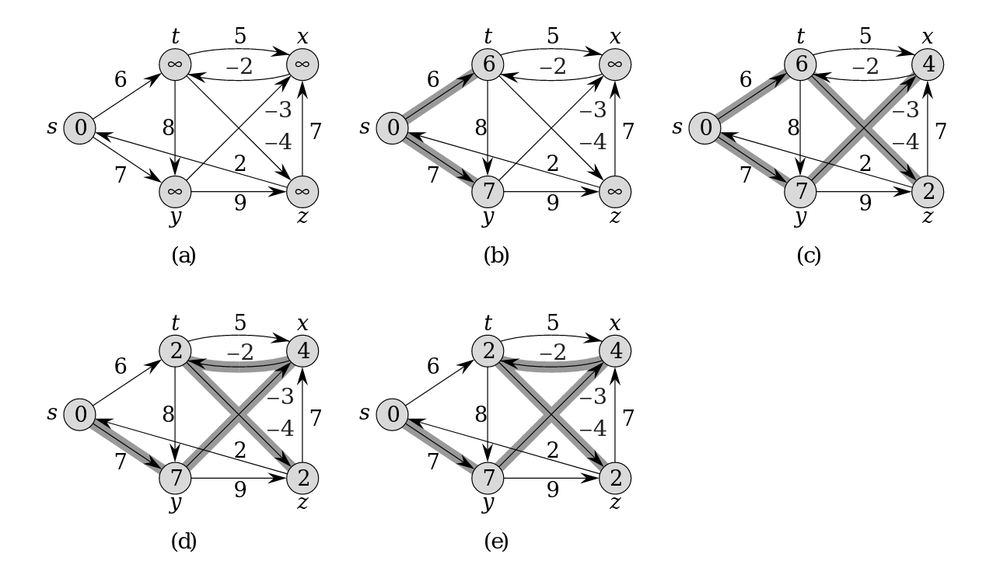

###### Futásidő

$O(V * E)$ hiszen a kezdőértékek beállítésa $\Theta(V)$, az egymásba ágyazott for ciklus $O(V * E)$, a második ciklus pedig $O(E)$.

##### Dijkstra algoritmusa

**Nemnegatív élsúlyok** esetén működik.

**S halmaz**: Azon csúcsok kerülnek bele, amikhez már meghatározta a legrövidebb utat a kezdőcsúcsból.

```js
dijkstra(G, s) {
    egyForrasKezdoertek(G, s)
    S = üresHalmaz
    Q = V[G] // Q minimum prioritási sor
    while Q nem üres {
        u = kiveszMin(Q)
        S = S unió { u }
        for u minden v szomszádjára {
            közelít(u, v, w)
        }
    }
}
```

A Q sorban azok a csúcsok vannak, amik nincsenek S-ben, tehát még nem tudjuk a hozzájuk vezető legrövidebb utat. A sort a $d$ érték szerint azaz az ismert legrövidebb út szerint indexeljük.

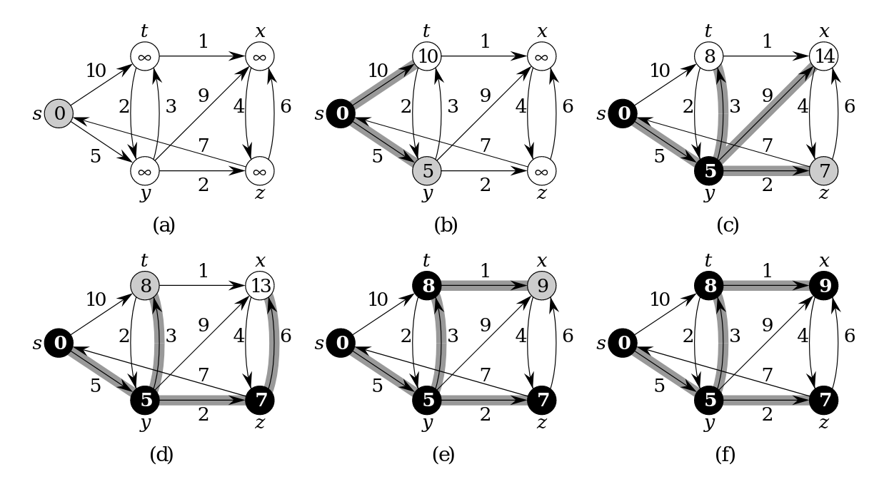

###### Futásidő

Minden csúcs pontosan egyszer kerül át az $S$ halmazba, emiatt amikor szomszédokat vizsgálunk, azt minden csúcsra egyszer tesszük meg, ezen szomszédok vizsgálata összesen $O(E)$-szer fut le, mert ennyi a szomszédsági listák össz hossza. Így a közelít, és ez által a `kulcsotCsökkent` művelet legfejlebb $O(E)$-szer hívódik meg.

Az összesített futásidő nagyban függ a **prioritási sor implementációtól**, a legegyszerűbb eset, ha egy **tömbbel implementáljuk**. Ekkor a `beszúr` és `kulcsotCsokkent` műveletek $O(1)$-esek, a `kiveszMin` pedig $O(V)$, mivel az egész tömbön végig kell menni. Így a teljes futásidő $O(V^2 + E)$.
**Ritkább gráfok esetén gyorsítható** az algoritmus **bináris kupac** implementációval, és látalánossagban gyorsítható fibonacchi kupaccal.

##### Floyd-Warshall algoritmus

**Dinamikus programozási** algoritmus legrövidebb utak **minden csúcspárra** problémára.

Lehetnek negatív élsúlyok, de negatív összsúlyú körök nem.

Az algoritmus lényege, hogy dinamikus programozással haladunk, egyre több csúcsot használunk fel, és azt figyeljük, hogy a két csúcs között vezető úton jobb eredményt érnénk-e el, ha az adott iteráció csúcsán keresztül mennénk.

Ez a következő rekurziós képlettel írható fel:

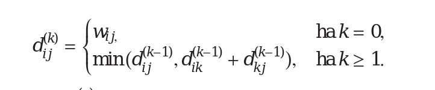

```js
floydWarshall(W) { // W szomszédsági mártix
    n = sorokSzama(W)
    D(0) = W
    for k = 1-től n-ig { // Ezt vizsgáljuk mindig majd, mint köztes csúcs
        for i = 1-től n-ig {
            for j = 1-től n-ig {
                d(k)[i, j] = min(
                    d(k - 1)[i, j],
                    d(k - 1)[i, k] + d(k - 1)[k, j]
                )
            }
        }
    }
}
```

A belső értékadás magyarázata: A k. iterációban a legrövidebb út, ami i-ből j-be vezet, az vagy a már megtalált k - 1-edik iterációbeli eredmény, vagy a az előzőz iterációbeli út i-ből k-ba, plusz k-ból j-be, azaz **felhasználjuk-e a k-t, mint egy köztesen érintett csúcsot**.

###### Futásidő

A három for ciklus határozza meg, mert annak a magja $O(1)$-es, így a futásidő $\Theta(n^3)$, ahol $n$ a sorok száma.

## 2. Elemi adatszerkezetek, bináris keresőfák, hasító táblázatok, gráfok és fák számítógépes reprezentációja

Az **adatszerkezet** adatok tárolására, és szervezésére szolgáló módszer, amely lehetővé teszi a hatékony hozzáférést és módosítést.

Algoritmushoz válasszuk ki az adatszerkezetet. Előfordulhat, hogy az algoritmus a megfelelő adatszerkezeten alapul.

**Absztrakt adatszerkezet**: műveletek által definiált adaszerkezet, nem konkrét implementáció.

**Adatszerkezetek**: Absztrakt adatszerkezetek konkrét megvalósításai. Általában egyes implementációk egyes műveleteket gyorsabban, míg másokat lassaban tudnak végrehajtani. Ez alapján kell az algoritmushoz kiválasztani a megfelelőt.

> Absztrakt adatszerkezetek olyanok, mint **interfészek**, az adatszerkezetek pedig azt implementáló **osztályok**.

### Listák

Absztrakt adatszerkezet.

Benne az adatok lineárisan követik egymást, egy kulcs többször is előfordulhat benne.

| Művelet            | Magyarázat                                                        |
| ------------------ | ----------------------------------------------------------------- |
| `ÉRTÉK(H, i)`      | `i`. pozíción (index-en) a kulcs értékének visszaadása            |
| `ÉRTÉKAD(H, i, k)` | `i`. pozíción levő értéknek a `k` érték értéküladása              |
| `KERES(H, k)`      | A `k` kulcs (érték) megkerekéke a listában, indexének visszaadása |
| `BESZÚR(H, k, i)`  | Az `i`-edik pozíctó után a `k` beszúrása                          |
| `TÖRÖL(H, k)`      | Első `k` értékű elem törlése                                      |

#### Közvetlen elérésű lista

Összefüggő memóriaterületet foglalunk le, így minden index közvetlen elérésű.

| Művelet            | Futásidő |
| ------------------ | -------- |
| `ÉRTÉK(H, i)`      | $O(1)$   |
| `ÉRTÉKAD(H, i, k)` | $O(1)$   |
| `KERES(H, k)`      | $O(n)$   |
| `BESZÚR(H, k, i)`  | $O(n)$   |
| `TÖRÖL(H, k)`      | $O(n)$   |

> Beszúrásnál újra kellhet allokálni egyel nagyobb emmóriaterületet.

> Jellemzően úgy implementáljuk, hogy definiálunk egy **kapacitást**, és amikor kell, akkor eggyivel allokálunk többet az új memóriaterületen. Illetve jellemzően azt is definiáljuk, hogy mikor kell zsugorítani a területet, azaz hány üresen maradó cella esetén (nem lyukak! az nem lehet, csak a terület végén levő üres cellák) allokáljunk kevesebb területet.

**Előnye**: O(1)-es indexelés.

**Hártánya**: Módosító műveletek lassúal, egy nagy memóriablokk kell.

#### Láncolt lista

Minden kulcs mellett tárolunk egy mutatót a következő, és egy mutatót a megelőző elemre.

**Egyszeresen láncolt lista**: csak a következőre tárolunk mutatót.

**Kétszeresen láncolt lista**: Következőre, előzőre is tárolunk mutatót.

**Ciklikus lista**: Utolsó elem rákövetkezője az első elem, első megelőzője az uolsó elem.

**Őrszem / fej**: Egy NULL elem, ami mindig a lista eleje.

| Művelet            | Futásidő |
| ------------------ | -------- |
| `ÉRTÉK(H, i)`      | $O(n)$   |
| `ÉRTÉKAD(H, i, k)` | $O(n)$   |
| `KERES(H, k)`      | $O(n)$   |
| `BESZÚR(H, k, i)`  | $O(1)$   |
| `TÖRÖL(H, k)`      | $O(1)$   |

> Beszúrás, és törlés valójában $O(n)$. Csak akkor $O(1)$, ha már a megfelelő pozíción vagyunk, azaz már tudjuk, melyik mutatókat kell átírni.

**Előnye**: Nem egy nagy összefüggő memória blokk kell.

**Hártánya**: Nem lehet gyorsan indexelni. Tárigény szempontjából rosszabb, minden kulcs mellett tárolunk legalább egy mutatót.

### Verem

Lista, amiben csak a legutoljára beszúrt elemet lehet kivenni. (**LIFO**)

Emiatt a speciális művelet végzés miatt gyorsabb, mint a sima lista.

Alkalmazásokra pl.: Függvényhívások veremben, undo-redo, böngésző előzmények.

#### Verem megvalósítás fix méretű tömbbel

Fenntartunk egy mutatót a verem tetejére, eddig van feltöltve a lefoglalt memóriaterület. (A verem alja a 0. index.)

```js
üresVerem(V) {
    return tető[V] == 0
}
```

```js
verembe(V, x) {
    tető[V]++ // Tető mutató frissítése, hiszen egyel több elem lesz
    V[tető[V]] = x
}
```

```js
veremből(V) {
    if üresVerem(V) {
        throw Error("alulcsordulás")
    } else {
        tető[V]--
        return V[tető[V] + 1] // Ez az index nincs felszabadítva, vagy átírva, egyszerűen a mutató van csökkentves
    }        
}
```

Mind a 3 művelet $O(1)$-es, hiszen csak indexeléseket, értékadásokat tartalmaznak.

> Hasonlóan a tömbbel megvalósított listához, itt is érdemes lehet kapacitást meghatározni.

### Sor

Mindig a legelőször beszúrt elemet lehet kivenni. (**FIFO**)

Lefoglalunk egy valamekkora egybefüggő memória szegmenst, de nem mindig használjuk az egészet. Két mutatót tartunk fent, a `fej` és a `vége` mutatókat, ezek jelölik, hogy éppen mekkora részét használjuk a lefoglalt területnek sorként.

```js
sorba(S, x) {
    S[vége[S]] = x // A vége egy üres pozícióra mutat alapból, ezért növeljük utólag.
    if vége[S] = hossz[S] {
        vége[S] = 1 // Ekkor "körvefordult" a sor a lefoglalt memóriaterületen.
    } else {
        vége[S]++
    }    
}
```

```js
sorból(S) {
    x = S[fej[S]] // A fej mutat a sor "elejére", azaz a legrégebben betett elemre.
    if fej[S] == hossz[S] {
        fej[S] = 1 // Ekkor "körvefordult" a sor a lefoglalt memóriaterületen.
    } else {
        fej[S]++
    }
}
```

Mind a két művelet $O(1)$-es, hiszen csak indexeléseket, értékadásokat tartalmaznak.

### Prioritási sor

Absztrakt adatszerketet.

Nem a kulcsok beszúrásának sorrendje határozza meg, mit lehet kivenni, hanem mindig a maximális (vagy minimális) kulcsú elemet tudjuk kivenni.

| Művelet         | Magyarázat                                      |
| --------------- | ----------------------------------------------- |
| `BESZÚR(H, k)`  | Új elem beszúrása a prioritási sorba            |
| `MAX(H)`        | Maximális kulcs értékének visszaadása           |
| `KIVESZ-MAX(H)` | Maximális kulcsú elem kivétele (vagy minimális) |

#### Kupac

Hatékony **prioritási sor megvalósítás**.

A kupac egy **majdnem teljes bináris fa**, amiben minden csúcs értéke legalább akkora, mint a gyerekeié, ezáltal a maximális (minimális) kulcsú elem a gyökérben van.

Majdnem teljes bináris fa alatt azt értjük, hogy a fa legmélyebb szintjén megengedett, hogy balról jobbra haladva egyszer csak már ne álljon fenn a bináris fa tulajdonság.

##### Tömbös megvalósítás

Egybefüggő memóriaterületen van a teljes kupac.

A **szülő**, a **bal gyerek**, és a **jobb gyerek** gyorsan számolható a tömb indexelésével.

```js
szülő(i) { // i indexő elem szülője
    return alsoEgeszResz(i / 2)
}
```

```js
balGyerek(i) { // i indexű elem bal gyereke
    return 2i
}
```

```js
jobbGyerek(i) { // i indexű elem jobb gyereke
    return 2i + 1
}
```

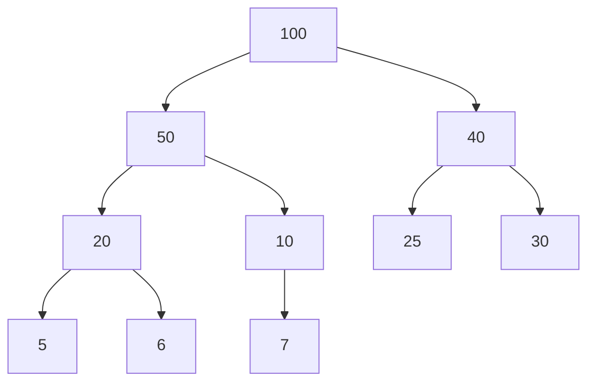

Ennek a kupacnak a tömbös reprezentációja:

```js
[100, 50, 40, 20, 10, 25, 30, 5, 6, 7]
```

###### Kupactulajdonság fenntartása

Garanálnunk kell, hogy az egyes beszúrások, kivételek után a kupacra jellemző tulajdonságok fennmaradnak.

A tulajdonság fenntartására ez a függvény fog felelni:

```js
maximumKupacol(A, i) {
    l = balGyerek(i)
    r = jobbGyerek(i)
    if l <= kupacMéret[A] és A[l] > A[i] { // l <= kupacMéret[A] ellenőrzés csak azért kell, hogy az A[l] indexelés biztonságos legyen. 
        legnagyobb = l
    } else {
        legnagyobb = i
    }
    if r <= kupacMéret[A] és A[r] > A[i] { // r <= kupacMéret[A] ellenőrzés csak azért kell, hogy az A[r] indexelés biztonságos legyen.
        legnagyobb = r
    }
    if legnagyobb != i {
        csere(A[i], A[legnagyobb])
        maximumKupacol(A, legnagyobb)
    }
}
```

Tehát a vizsgált indexű elem et összehasonlítjuk a gyerekeivel, és ha valamelyik nagyobb, akkor azzal kicseréljük, és rekurzívan meghívjuk rá a `maximumKupacol()`-t, mert lehet, az új szülőjénél/gyerekénél is nagyobb.

`maximumKupacol()` futásideje $O(logn)$, mert ennyi a majdnem teljes bináris fa mélysége, és legrosszabb esetben az egészen végig kell lépkedni.

###### Maximum lekérése

A prioritási sor `MAX(H)` függvényének megvalósítása egyszerű, csak vissza kell adnunk a tömb első elemét, ami a kupac gyökere.

```js
kupacMaximuma(A) {
    return A[1]
}
```

###### Maximum kivétele

Ilyenkor az történik, hogy a kupac utolsó elemét áthelyezzük a gyökérbe, és a gyökérből indulva helyreállítjuk a kupac tulajdonságot, "lekupacoljuk" az elemet.

```js
kupacbólKiveszMaximum(A) {
    if kupacMéret[A] < 1 {
        throw Error("kupacméter alulcsordulás")
    }
    max = A[1]
    A[1] = A[kupacMéret[A]]
    kupacMéret[A]-- // Méter csökkentése, az érték a memóriában marad, csak nem értelmezzük a kupac részeként.
    maxumimKupacol(A, 1) // Mivel beszúrtuk ide az utolsó elemet, helyre kell állítani ("lefelé kupacolni")
    return max
}
```

###### Beszúrás

Új elem beszúrása egyszerű, csak szúrjuk be a kupac végére, és onnan kiindulva végezzünk egy helyreállítást, ezzel az új elemet a helyére "felkupacolva".

```js
kupacbaBeszur(A, x) {
    kupacMéter[A]++
    A[kupacMéret[A]] = x
    maximumKupacol(A, kupacMéret[A])
}
```

###### Futásidők

| Művelet         | Futásidő    |
| --------------- | ----------- |
| `BESZÚR(H, k)`  | $O(logn)$   |
| `MAX(H)`        | $\Theta(1)$ |
| `KIVESZ-MAX(H)` | $O(logn)$   |

### Fák, és számítógépes reprezenzációjuk

#### Fa

- Összefüggő, körmentes gráf

- Bármely két csúcsát pontosan egy út köti össze

- Elsőfokú csúcsi: **levél**

- Nem levél csúcsai: **belső csúcs**

##### Bináris fa

- **Gyökeres fa**: Van egy kitűntetett gyökér csúcsa

- **Bináris fa**: Gyökeres fa, ahol minden csúcsnak legfeljebb két gyereke van.

#### Számítógépes reprezentáció

Csúcsokat, és éleket reprezentálunk.

Maga a fa objektumunk egy mutató a gyükérre.

##### Gyerek éllistás reprezentáció

```java
class Node {
    Object key;
    Node parent;
    List<Node> children; // Gyerekek éllistája
}
```

##### Első fiú - apa - testvér reprezentáció

```java
class Node {
    Object key;
    Node parent;
    Node firstChild;
    Node sibling;
}
```

##### Bináris fa reprezentációja

```java
class Node {
    Object key;
    Node parent;
    Node left;
    Node right;
}
```

> Mindegyik esetben, ha nincs Node, akkor NULL-al jelezhetjük. Pl. a gyökér szülője esetében.

### Bináris keresőfák

Absztrakt adatszerkezet a következő műveletekkel:

| Művelet                           | Magyarázat                                                                        |
| --------------------------------- | --------------------------------------------------------------------------------- |
| `KERES(T, x)`                     | Megkeresi a fában az `x` kulcsot, és visszaadja azt a csúcsot                     |
| `BESZÚR(T, x)`                    | Fába az `x` kulcs beszúrása                                                       |
| `TÖRÖL(T, x)`                     | Fából az `x` kulcsú csúcs törlése                                                 |
| `MIN(T)` / `MAX(T)`               | A fa maximális, vagy minimális kulcsú csúcsának visszaadása                       |
| `KÖVETKEZŐ(T, x)` / `ELŐZŐ(T, x)` | A fában az `x` kulcsnál egyel nagyobb, vagy egyel kisebb értékű csúcs visszaadása |

> A `T` a fa gyökerére mutató mutató.

> Cél: Minden művelet legalább $O(logn)$-es legyen

#### Bináris keresőfa tulajdonság

Egy $x$ csúcs értéke annak a bal részfájában minden csúcsnál nagyobb vagy egyenlő, jobb részfájában minden csúcsnál kisebb vagy egyenlő.

#### Keresés

A bináris fa tulajdonságot kihasználva fa keresendő kulcsot hasonlítgatjuk a bal, jobb gyerekekhez, és ennek megfelelően lépünk jobbra / balra.

```js
fábanKeres(x, k) {
    while x != NULL és k != kulcs[x] {
        if k < kulcs[x] {
            x = bal[x]
        } else {
            x = jobb[x]
        }
    }
    return x
}
```

#### Minimum / Maximum keresés

A minimum elem a "legbaloldali" elem

```js
fábanMinimum(x) {
    while bal[x] != NULL {
        x = bal[x]
    }
    return x
}
```

A maximum elem a "legjobboldali" elem

```js
fábanMaximum(x) {
    while jobb[x] != NULL {
        x = jobb[x]
    }
    return x
}
```

#### Következő / Megelőző

```js
fábanKövetkező(x) {
    if jobb[x] == NULL {
        return fábanMinimum(jobb[x])
    }
    y = szülő[x]
    while y != NULL és x == jobb[y] {
        x = y
        y = szülő[y]
    }
    return y
}
```

Azaz, ha van jobb részfája a fának, amiben keresünk, akkor annak a mimimuma a rákövetkező, ha nincs, akkor pedig addig lépkedünk fel, amíg az aktuális csúcs a szülőjének bal gyereke nem lesz, ugyanis ekkor a szülő a rákövetkező.

TODO: Hasonlóan a megelőzőre.

#### Beszúr

```js
fábaBeszúr(T, z) {
    y = null
    x = gyökér[T]
    while x != null {
        y = x
        if kulcs[z] < kulcs[x] {
            x = bal[x]
        } else {
            x = jobb[x]
        }
    }
    szülő[z] = y
    if y = null {
        gyökér[T] = z
    } else if kulcs[z] < kulcs[y] {
        bal[y] = z
    } else {
        jobb[y] = z
    }
}
```

Tehát megkeressük az új elem helyét, az által, hogy jobbra, balra lépkedünk, majd beszúrjuk a megfelelő csúcs alá jobbra, vagy balra.

#### Töröl

```js
fábólTöröl(T, z) {
    if bal[z] == null vagy jobb[z] == null {
        y = z
    } else {
        y = fábanKövetkező(z)
    }

    if bal[y] != null {
        x = bal[y]
    } else {
        x = jobb[y]
    }

    if x != null { // x akkor null, ha y = fábanKövetkező(z)
        szülő[x] = szülő[y] // "átkötés"
    }

    if szülő[y] == null {
        gyökér[T] = x // Ha gyökérbe lett kötve az y, akkor ezt is frissítjük
    } else if y == bal[szülő[y]] {
        bal[szülő[y]] = x // "átkötés"
    } else {
        jobb[szülő[y]] = x // "átkötés"
    }

    if y != x {
        kulcs[z] = kulcs[y]
    }

    return y
}
```

##### Levél törlése

Ha a kitörlendő csúcs egy levél, akkor egyszerűen kitöröljük azt, a szülőkénél a rá mutató mutatót `null`-ra állítjuk.

##### Egy gyerekes belső csúcs

Ebben az esetben a törlendő csúcs helyére bekötjük annak a részfáját ()amiből, mivel egy gyereke van, csak egy van).

##### Két gyerekes belső csúcs

Ebben az esetben a csúcs helyére kötjük annak a rákövetkezőjét. Mivel ebben az esetben van biztosan jobb gyereke, így a jobb gyerekének a minimumát fogjuk a helyére rakni (ami mivel egy levél, csak egyszerűen törölhetjük az eredeti helyéről).

#### Futásidők

Az összes művelet (`KERES`, `MAX / MIN`, `BESZÚR`, `TÖRÖL`, `KÖVETKEZŐ / ELŐZŐ`) $O(h)$-s, azaz a fa magasságával arányos. Ez alap esetben nem feltétlen olyan jó, de kiegyensúlyozott fák esetén jó, hiszen akkor $O(logn)$-es.
