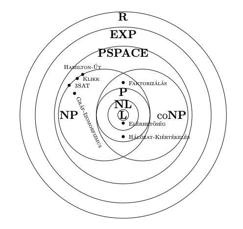

## A PSPACE osztály. PSPACE-teljes problémák. Logaritmikus tárigényű visszavezetés. NL-teljes problémák.

### A PSPACE osztály

- $SPACE(f(n))$: Az $O(f(n))$ tárban eldönthető problémák osztálya.

- $NSPACE(f(n))$: Az $O(f(n))$ tárban **nemdeterminisztikusan** eldönthető problémák osztálya.

- $TIME(f(n))$: Az $O(f(n))$ időben eldönthető problémák osztálya.

- $NTIME(f(n))$: Az $O(f(n))$ időben **nemdeterminisztikusan** eldönthető problémák osztálya.

#### Fontos összefüggés NSPACE és SPACE között

$NSPACE(f(n)) \sube SPACE(f^2(n))$

Ebből következik ez is:

$PSPACE = NPSPACE$

Hiszen a kettes hatványtól függetlenül $f(n)$ ugyan úgy csak egy **polinom**iális függvény.

> Ennek az összefüggésnek az oka, hogy a tár **újra felhasználható**. Emiatt viszonylag kevés tár is elég sok probléma eldöntésére. Az idő ezzel szemben sokkal problémásabb, nem tudjuk, hogy egy $f(n)$ időigényű nemdeterminisztikus algoritmust lehet-e $2^{O(f(n))}$-nél gyorsabban szimulálni.

#### Lineáris tárigény

Az előbb említett előny miatt elég sok probléma eldönthető $O(n)$ tárban.

Pl. **SAT**, **HAMILTON-ÚT,** és a **3-SZÍNEZÉS** mind eldönthető lineáris tárban. Csak lehetséges tanúkat kell generálni, fontos, hogy egyszerre csak egyet, ezt a tárat használjuk fel újra és újra. Ellenőrizzük a tanút, ha nem jó generáljuk a következőt.

### *Offline*, vagy *lyukszalagos* tárigény

Ha az algoritmus az inputot csak olvassa, és az outputot *stream-mód*-ban írja, akkor az input, output regisztereket nem kell beszámolni, csak a working regisztereket.

> A cél ezzel az, mert a korábbiak alapján jó lenne, ha lehetne értelme szublineáris tárigénynek. Márpedig ha pl. az inputot már beszámoljuk, akkor az már legalább lineáris.

### Az NL-osztály

- $L = SPACE(logn)$: Determinisztikusan logaritmikus tárban eldönthető problémák osztálya.

- $NL = NSPACE(logn)$: Nemdeterminisztikusan logaritmikus tárban eldönthető problémák osztálya.

#### Mit nem szabad, hogy legyen esély NL-beli algoritmust készíteni?

- Az **inputot írni**.

- $\Theta(n)$ méretű bináris tömböt felvenni.

#### Mit szabad?

- Olyan **változót létrehozni**, amibe $0$ és $n$ közti számokat írunk, hiszen ezek $logn$ tárat igényelnek.

- Nem csak $n$-ig ér számolni, hanem bármilyen **fix fokszámú polinomig**. Pl. ha $n^3$-ig számolunk, az is elfér $log^3 = 3 * logn$ biten, tehát $O(logn)$ a tárkorlátja.

- Az **input valamelyik elemére rámutatni** egy pointerrel, hiszen lényegében ez is egy $0$-tól $n$-ig értékeket felvevő változó.

#### Elérhetőség

**Determinisztikusan** Savitch tétele szerint az ELÉRHETŐSÉG eldönthető $O(log^2n)$ tárban. Ennek oka a rekurzió, hiszen egy példányunk $O(logn)$ táras, de ebből egyszerre akár $logn$ darab is lehet a memóriában.

**Nemdeterminisztikusan** bele férünk a logtárba. Ekkor "nemdeterminisztikusan bolyongunk" a gráfban, és ha $N$ lépésben elértünk a csúcsig, akkor `true` amúgy `false`. Tehát minden iterációban átlépünk nemdeterminisztikusan minden szomszédra, ha megtaláltuk a cél csúcsot, `true`, ha nem tudunk már tovább lépni, vagy lefutott mind az $N$ iteráció, akkor `false`.

Ezek alapján tehát:

$\text{ELÉRHETŐSÉG} \in \textbf{NL}$

### Logtáras visszavezetés

$P$-n belül ugye a polinomidejű visszavezetésnek nincs értelme. Hiszen ekkor az inputkonverziót végző függvényben meg tudjuk oldani a problémát, és csak visszaadni egy ismerten `true` vagy `false` inputot.

#### Definíció

Legyenek $A$ és $B$ eldöntési problémák. Ha $f$ egy olyan függvény, mely

- $A$ inputjaiból $B$ inputjait készíti,

- választartó módon: $A$ "igen" példányiból $B$ "igen" példányait, "nem" példányaiból pedig "nem" példányt,

- és logaritmikus tárban kiszámítható,

akkor $f$ egy logtáras visszavezetés $A$-ról $B$-re. Ha $A$ és $B$ közt létezik ilyen, akkor azt mondjuk, hogy $A$ logtárban visszavezethető $B$-re, jelben $A \le_L B$.
