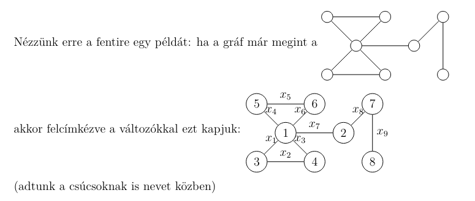
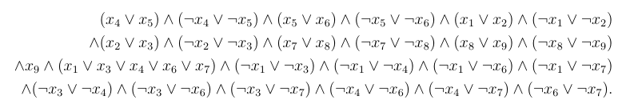
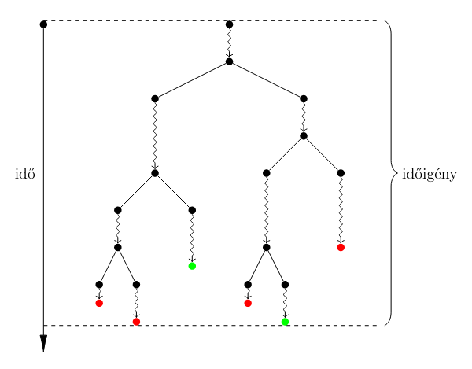
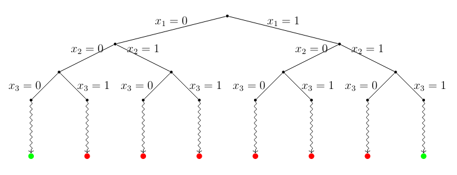
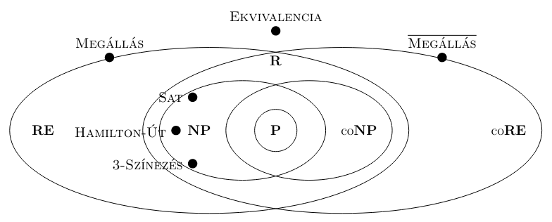
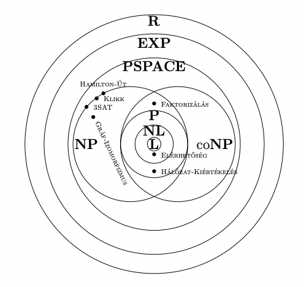
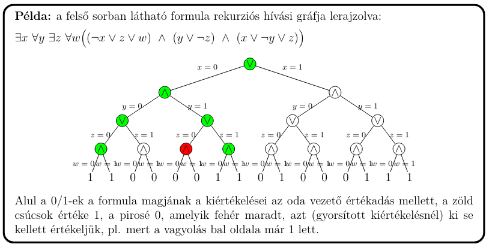

## Bonyolultságelmélet

### 1. Hatékony visszavezetés. Nemdeterminizmus. A P és NP osztályok. NP-teljes problémák.

### A P osztály

R az eldönthető problémák osztálya.

Polinomidőben eldönthető problémák osztálya.

Tehát minden olyan **eldöntési probléma** P-ben van, amire létezik $O(n^k)$ időigényű algoritmus, valamely konstans $k$-ra.

> Ezeket a problémákat tartjuk **hatékonyan megoldhatónak**.

#### Elérhetőség

P-beli probléma.

**Input**: Egy $G = (V, E)$ irányított gráf. Feltehető, hogy $V = \{ ~ 1, ..., N ~ \}$

**Output**: Vezet-e $G$-ben (irányított) út $1$-ből $N$-be?

Erre van algoritmus:

- Kiindulásnak veszünk egy $X = \{1\}$ és $Y = \{1\}$ halmazt.

- Mindig kiveszünk egy elemet $X$-ből, és annak szomszédait betesszük $X$-be, és $Y$-ba is.

- Ez által $X \cup Y$-ban lesznek az $1$-ből elérhető csúcsok.

Erre a konkrét implementációnk futásideje változó lehet, függhet például a gráf repretenzációtól, és a halmaz adatszerjezet megválasztásától. De a lényeg, hogy van-e polinom idejű algoritmus, és mivel általánosságban $O(N^3)$-el számolhatunk legrosszabb esetnek (előnytelen implementáció esetén is bele férünk), így $O(n^3)$-ös a futásideje az algoritmusnak (hiszen $N \le n$, mert biztosan kevesebb a csúcsok száma, mint a gráfot ábrázoló biteké).

#### Hatékony visszavezetés

##### Rekurzív visszavezetés

> A.K.A. Turing-visszavezetés

Az $A$ eldöntési probléma **rekurzívan visszavezethető** a $B$ eldöntési problémára, jelben $A \le_R B$, ha van olyan $f$ **rekurzív függvény**, mely $A$ inputjaiból $B$ inputjait készíti **választartó** módon, azaz minden $x$ inputra $A(x) = B(f(x))$

> Itt a _rekurzió_ azt jelenti, hogy kiszámítható, adható rá algoritmus.

Ebben az esetben ha $B$ eldönthető, akkor $A$ is eldönthető, illetve ha $A$ eldönthetetlen, akkor $B$ is eldönthetetlen.

Lényegében ez azt fejezi ki, hogy "$B$ legalább olyan nehéz, mint $A$".

**Probléma ezzel a megközelítéssel**: Ha $A$ eldönthető probléma, $B$ pedig nemtriviális, akkor $A \le_R B$.

- Tehát nehézség szempontjából nem mondtunk valójában semmit.

- Ennek oka, hogy ebben az esetben az $f$ inputkonvertáló függvényben van lehetőségünk egyszerűen az $A$ probléma megoldására, és ennek megfelelően $B$ egy _igen_, vagy _nem_ példányának visszaadására.

- Ez alapján az összes nemtriviális probléma (azaz az olyanok, amik nem minden inputra ugyan azt adják) "ugyan olyan nehéznek" tűnik.

- Probléma oka: **Túl sok erőforrást engedünk meg az inputkonverzióhoz**, annyit, ami elég magának a problémának a megoldására.

- Megoldás: Hatékony visszavezetés.

##### Hatékony visszavezetés

> A.K.A. Polinomidejű visszavezetés

Az $A$ eldöntési probléma **hatékonyan visszavezethető** a $B$ eldöntési problémára, jelben $A \le_P B$, ha van olyan $f$ **polinomidőben kiszámítható** függvény, mely $A$ inputjaiból $B$ inputjait készíti **választartó** módon.

Ekkor ha $B$ **polinomidőben** eldönthető, akkor $A$ is eldönthető **polinomidőben**, illetve ha $A$-ra nincs polinomidejű algoritmus, akkor $B$-re sincs.

##### Példa

Egy példa a hatékony visszavezetésre a $PÁROSÍTÁS \le SAT$

###### PÁROSÍTÁS

**Input**: Egy **CNF** (konjunktív normálformájú formula)

**Output**: Kielégíthető-e?

> Azaz van-e olyan értékadás, ami mellett igaz a formula?

###### SAT

**Input**: Egy $G$ gráf

**Output**: Van-e $G$-ben teljes párosítás?

> Közös csúccsal nem rendelkező élek halmaza, amik lefednek minden csúcsot.

###### Visszavezetés

Tehát a cél egy $G$ gráfból egy $\phi_G$ CNF előállítása választartó módon, polinomidőben úgy, hogy **$G$-ben pontosan akkor legyen teljes párosítás, ha $\phi_G$ kielégíthető**.

- Minden élhez rendelünk egy logikai változót.

- Akkor lesz igaz a változó, ha beválasztjuk az élt a teljes párosításba.

- A cél egy olyan CNF előállítása, amiben a következőt formalizáljuk: Minden csúcsra felítjuk, hogy pontosan egy él illeszkedik rá, majd ezeket összeéseljük. Ha így egy csúcsra sikerül megfelelő CNF-et alkotni, akkor azok összeéselése is CNF, hiszen CNF-ek éselése CNF.

- Egy csúcshoz annak formalizálása, hogy pontosan egy él fedi: legalább egy él fedi ÉS legfeljebb egy él fedi.

  - Legalább egy: Egyetlen CNF kell hozzá: $(x_1 \lor x_2 \lor ... \lor x_k)$.

  - Legfeljebb egy: Négyzetesen sok klóz kell hozzá, minden csúcspárra megkötjük, hogy "nem ez a kettő egyszerre": $\land ~ 1 \le i < j \le k ~ \neg(x_i \land x_j)$

> $x_1, ..., x_k$ az adott viszgált csúcsra illeszkedő élek.

#### Nemdeterminizmus

**Nemrealisztukus** számítási modell: Nem tudjuk hatékonyan szimulálni.

RAM gépen el lehet képzelni a következő utasításképp: `v := nd()`.

Ezzel nemdeterminisztikusan adunk értéket egy bitnek, amit úgy lehet elképzelni, mintha ezen a ponton a számítás elágazna, és az egyik szálon `v = 1`, a másikon `v = 0` értékkel számol. Egy ilyen elégazásnak konstans időben kellene történnie.

A fenti képen egy **számítási fa** van, minden elégazás egy nemdeterminisztikus bitgenerálás.

**Időigény**: A leghosszabb szál időigénye. Tehát a **számítási fa mélysége**.

**Eldöntési algoritmus** esetén a végeredmény akkor **true, ha legalább egy szál true,** akkor **false, ha minden szál false**.

##### Nemdeterminisztikus algoritmus a SAT-ra

Input formulánkban az $x_1, ..., x_k$ változók fordulnak elő.

1. Generáljunk minden $x_i$-hez egy nemdeterminisztikus bitet, így kapunk egy értékadást.

2. Ha a generált értékadás kielégíti a formulát, adjunk vissza `true`-t, egyébként `false`-t.

Példa input: $(x_1 \lor \neg x_2) \land (x_2 \lor \neg x_3) \land (\neg x_1 \lor x_3)$

Ehhez az inputhoz a számítási fa:

Ennek az algoritmusnak a nemdeterminisztikus időigénye $O(n)$, hiszen $n$ változónak adunk értéket, és a behelyettesítés, ellenőrzés is lineáris időigényű.

#### Az NP osztály

**Nemdeterminisztikus algoritmussal polinomidőben** eldönthető problémák osztálya.

A **SAT** a korábbi példa alapján például **NP-beli**.

$P \subseteq NP$ természetesen igaz, hiszen egy determinisztikusan polinom idejű algoritmus felfogható olyan nemdeterminisztikusnak, ami sosem ágazik el. $P = coP$ miatt $P \subseteq NP \cap coNP$.

Ennél többet nem tudunk, nem tudjuk, hogy $P = NP$ igaz-e. Széleskörben elfogadott sejtés, hogy nem. Hasonlóan az sem ismert, hogy $NP = coNP$ igaz-e, erről is az az elfogadtott álláspont, hogy nem.

Persze $NP \subseteq R$ is igaz, mert a nemdeterminisztikus számítás szimulálható determinisztikusan, bár ez exponenciálisan lassú.

#### NP-teljes problémák

**$C$-teljesség definíciója**: Ha $C$ problémák egy osztálya, akkor az $A$ probléma

- **$C$-nehéz**, ha minden $C$-beli probléma visszavezethető $A$-ra

- **$C$-teljes**, ha $A$ még ráadásul $C$-ben is van

##### Polinomidőben verifikálhatóság

Az $A$ probléma polinomidőben verifikálható, ha van egy olyan $R$ reláció, **inputok**, és **tanúk** között, melyre:

- Ha $R(I, T)$ az $I$ inputra és a $T$ tanúsítványra, akkor $|T| \le |I|^c$ valamilyen $c$ konstansra (azaz a tanúk "nem túl hosszúak")

- Ha kapunk egy $(I, T)$ párt, arról determinisztikusan polinomidőben el tudjuk dönteni, hogy $R(I, T)$ fennáll-e, vagy sem (azaz egy tanú könnyen ellenőrizhető)

- Pontosan akkor létezik $I$-hez olyan $T$, melyre $R(I, T)$ igaz, ha $I$ az $A$-nak egy "igen" példánya (azaz $R$ tényleg egy jó "tanúsítvány-rendszer" az $A$ problémához)

> SAT esetében pl. lineáris időben tudjuk ellenőrizni, hogy egy adott értékadás kielégíti-e a CNF-et.

**Egy probléma pontosan akkor van NP-ben, ha polinomidőben verifikálható.**

##### SAT

Cook tétele kimondja, hogy a **SAT egy NP-teljes probléma**.

Variánsok: FORMSAT, 3SAT is NP-teljes (és minden kSAT $k \ge 3$-ra), DE 2SAT P-beli, visszavezethető ugyanis az elérhetőségre.

Horn-átnevezhető formulák kielégítése is polinomidőben eldönthető.

> Horn-formula, ha minden klózban legfeljebb egy pozitív literál, Horn-átnevezhető, ha bizonyos változók komplementálásával Horn-formulává alakítható.

##### NP-teljes gráfelméleti problémák

###### Független csúcshalmaz

**Input**: Egy $G$ irányítatlan gráf, és egy $K$ szám

**Output**: Van-e $G$-ben $K$ darab **független**, azaz páronként nem szomszédos csúcs?

###### Klikk

**Input**: Egy $G$ gráf, és egy $K$ szám.

**Output**: Van-e $G$-ben $K$ darab páronként szomszédos csúcs?

###### Hamilton-út

**Input**: Egy $G$ gráf.

**Output**: Van-e $G$-ben Hamilton-út?

##### Halmazelméleti NP-teljes problémák

###### Párosítás

**Input**: Két egyforma méretű halmaz, $A$, és $B$, és egy $R \subseteq A \times B$ reláció.

**Output**: Van-e olyan $M \subseteq R$ részhalmaza a megengedett pároknak, melyben minden $A \cup B$-beli elem pontosan egyszer van fedve?

> $A$ halmaz: lányok, $B$ halmaz: fiúk, reláció: ki hajlandó kivel táncolni. Kérdés: Párokba lehet-e osztani mindenkit?

###### Hármasítás

**Input**: Két egyforma méretű halmaz, $A$, $B$, és $C$, és egy $R \subseteq A \times B \times C$ reláció.

**Output**: Van-e olyan $M \subseteq R$ részhalmaza a megengedett pároknak, melyben minden $A \cup B \cup C$-beli elem pontosan egyszer van fedve?

> Hasonló példa áll, $C$ halmaz házak, ahol táncolnak.

###### Pontos lefedés hármasokkal

**Input**: Egy $U$ $3m$ elemű halmaz, és háromelemű részhalmazainak egy $S_1, ..., S_n \subseteq U$ rendszere.

**Output**: Van-e az $S_i$-k közt $m$, amiknek uniója $U$?

###### Halmazfedés

**Input**: Egy $U$ halmaz, részhalmazainak egy $S_1, ..., S_n \subseteq U$ rendszere, és egy $K$ szám.

**Output**: Van-e az $S_i$-k közt $K$ darab, amiknek uniója $U$?

###### Halmazpakolás

**Input**: Egy $U$ halmaz, részhalmazainak egy $S_1, ..., S_n \subseteq U$ rendszere, és egy $K$ szám.

**Output**: Van-e az $S_i$-k közt $K$ darab páronként diszjunkt?

##### Számelméleti NP-teljes problémák

###### Egész értékű programozás

**Input**: Egy $Ax \le b$ egyenlőtlenség-rendszer, $A$-ban és $b$-ben egész számok szerepelnek.

**Output**: Van-e egész koordinátájú $x$ vektor, mely kielégíti az egyenlőtlenségeket?

###### Részletösszeg

**Input**: Pozitív egészek egy $a_1, ..., a_k$ sorozata, és egy $K$ célszám.

**Output**: Van-e ezeknek olyan részhalmaza, melynek összege épp $K$?

###### Partíció

**Input**: Pozitív egészek egy $a_1, ..., a_k$ sorozata.

**Output**: Van-e ezeknek egy olyan részhalmaza, melynek összege épp $\frac{\sum_{i = 1}^{k} a_i}{2}$?

###### Hátizsák

**Input**: $i$ darab tárgy, mindegyiknek egy $w_i$ súlya, és egy $c_i$ értéke, egy $W$ összkapacitás és egy $C$ célérték.

**Output**: Van-e a tárgyaknak olyan részhalmaza, melynek összsúlya legfeljebb $W$, összértéke pedig legalább $C$?

> TODO: erős-, gyenge NP-teljesség kell-e ide?

### 2. A PSPACE osztály. PSPACE-teljes problémák. Logaritmikus tárigényű visszavezetés. NL-teljes problémák.

#### A PSPACE osztály

Determinisztikusan (vagy nemdeterminisztikusan), polinomidőben megoldható problémák osztálya.

- $SPACE(f(n))$: Az $O(f(n))$ tárban eldönthető problémák osztálya.

- $NSPACE(f(n))$: Az $O(f(n))$ tárban **nemdeterminisztikusan** eldönthető problémák osztálya.

- $TIME(f(n))$: Az $O(f(n))$ időben eldönthető problémák osztálya.

- $NTIME(f(n))$: Az $O(f(n))$ időben **nemdeterminisztikusan** eldönthető problémák osztálya.

PSPACE-beli problémák még **nehezebbek, mint az NP-beliek**.

##### Fontos összefüggés NSPACE és SPACE között

$NSPACE(f(n)) \subseteq SPACE(f^2(n))$

Ebből következik ez is:

$PSPACE = NPSPACE$

Hiszen a kettes hatványtól függetlenül $f(n)$ ugyan úgy csak egy **polinom**iális függvény.

> Ennek az összefüggésnek az oka, hogy a tár **újra felhasználható**. Emiatt viszonylag kevés tár is elég sok probléma eldöntésére. Az idő ezzel szemben sokkal problémásabb, nem tudjuk, hogy egy $f(n)$ időigényű nemdeterminisztikus algoritmust lehet-e $2^{O(f(n))}$-nél gyorsabban szimulálni.

##### Lineáris tárigény

Az előbb említett előny miatt elég sok probléma eldönthető $O(n)$ tárban.

Pl. **SAT**, **HAMILTON-ÚT,** és a **3-SZÍNEZÉS** mind eldönthető lineáris tárban. Csak lehetséges tanúkat kell generálni, fontos, hogy egyszerre csak egyet, ezt a tárat használjuk fel újra és újra. Ellenőrizzük a tanút, ha nem jó generáljuk a következőt.

#### _Offline_, vagy _lyukszalagos_ tárigény

Ha az algoritmus az inputot csak olvassa, és az outputot _stream-mód_-ban írja, akkor az input, output regisztereket nem kell beszámolni, csak a working regisztereket.

> A cél ezzel az, mert a korábbiak alapján jó lenne, ha lehetne értelme szublineáris tárigénynek. Márpedig ha pl. az inputot már beszámoljuk, akkor az már legalább lineáris.

#### Az NL-osztály

- $L = SPACE(logn)$: Determinisztikusan logaritmikus tárban eldönthető problémák osztálya.

- $NL = NSPACE(logn)$: Nemdeterminisztikusan logaritmikus tárban eldönthető problémák osztálya.

Immermann-Szelepcsényi tétel szerint: $NL = coNL$

##### Mit nem szabad, hogy legyen esély NL-beli algoritmust készíteni?

- Az **inputot írni**.

- $\Theta(n)$ méretű bináris tömböt felvenni.

##### Mit szabad?

- Olyan **változót létrehozni**, amibe $0$ és $n$ közti számokat írunk, hiszen ezek $logn$ tárat igényelnek.

- Nem csak $n$-ig ér számolni, hanem bármilyen **fix fokszámú polinomig**. Pl. ha $n^3$-ig számolunk, az is elfér $log^3 = 3 * logn$ biten, tehát $O(logn)$ a tárkorlátja.

- Az **input valamelyik elemére rámutatni** egy pointerrel, hiszen lényegében ez is egy $0$-tól $n$-ig értékeket felvevő változó.

##### Elérhetőség

**Determinisztikusan** Savitch tétele szerint az ELÉRHETŐSÉG eldönthető $O(log^2n)$ tárban. Ennek oka a rekurzió, hiszen egy példányunk $O(logn)$ táras, de ebből egyszerre akár $logn$ darab is lehet a memóriában.

**Nemdeterminisztikusan** bele férünk a logtárba. Ekkor "nemdeterminisztikusan bolyongunk" a gráfban, és ha $N$ lépésben elértünk a csúcsig, akkor `true` amúgy `false`. Tehát minden iterációban átlépünk nemdeterminisztikusan minden szomszédra, ha megtaláltuk a cél csúcsot, `true`, ha nem tudunk már tovább lépni, vagy lefutott mind az $N$ iteráció, akkor `false`.

Ezek alapján tehát:

$\text{ELÉRHETŐSÉG} \in \textbf{NL}$

#### Logtáras visszavezetés

$P$-n belül ugye a polinomidejű visszavezetésnek nincs értelme. Hiszen ekkor az inputkonverziót végző függvényben meg tudjuk oldani a problémát, és csak visszaadni egy ismerten `true` vagy `false` inputot.

##### Definíció

Legyenek $A$ és $B$ eldöntési problémák. Ha $f$ egy olyan függvény, mely

- $A$ inputjaiból $B$ inputjait készíti,

- választartó módon: $A$ "igen" példányiból $B$ "igen" példányait, "nem" példányaiból pedig "nem" példányt,

- és logaritmikus tárban kiszámítható,

akkor $f$ egy logtáras visszavezetés $A$-ról $B$-re. Ha $A$ és $B$ közt létezik ilyen, akkor azt mondjuk, hogy $A$ logtárban visszavezethető $B$-re, jelben $A \le_L B$.

> $f$ biztosan lyukszalagos, hiszen szublineárisnak kell lennie.

##### Tulajdonságok

A logaritmikus tárigényű algoritmusok polinom időben megállnak, hiszen $O(logn)$ tárat $2^{O(logn)}$ féleképp lehet teleírni, minden pillanatban a program $K$ darab konstans utasítás egyikét hajtja éppen végre, így összesen $K * 2^{O(logn)}$-féle különböző konfigurációja lehet, ami polinom.

Ebből következik: $\text{Ha } A \le_L B \text{, akkor} A \le_P B$

> Azaz a logtáras visszavezetés formailag "gyengébb".

Valójában nem tudjuk, hogy ténylegesen gyengébb-e ez a visszavezetés, de azt tudjuk, hogy akkor lesz gyengébb, ha $L \ne P$.

$L = P$ pontosan akkor teljesül, ha $\le_L ~ = ~ \le_P$

Ha $f$ és $g$ logtáras függvények, akkor kompozíciójuk is az. Ez azért jó, mert akkor itt is be lehet vetni azt a trükköt, amit a polinomidejű visszavezetésnél, azaz a $C$-nehézség bizonyításához elég egy már ismert $C$-nehéz problémát visszavezetni az adott problémára. Hiszen ekkor tranzitívan minden $C$-beli probléma visszavezethető lesz az aktuális problémára is.

#### NL-teljes problémák

Legyen $L \sub C \subseteq P$ problémák egy osztálya. Azt mondjuk, hogy az $A$ probléma $C$-nehéz, ha $C$ minden eleme **logtárban** visszavezethető $A$-ra.

Ha ezen kívül $A$ még ráadásul $C$-beli is, akkor $A$ egy $C$-teljes probléma.

> Szóval ugyan az, mint $P$-n kívül, csak logtárban, mivel $P$-n belül a polinomidejű visszavezetésnek nincs értelme.

##### P-teljes problémák

- Input egy **változómentes** itéletkalkulus-beli formula, kiértékelhatő-e?

- HÁLÓZAT-KIÉRTÉKELÉS

##### NL-teljes problémák

- **ELÉRHETŐSÉG**

- **ELÉRHETŐSÉG** úgy, hogy az input irányított, **körmentes** gráf

- **ELÉRHETETLENSÉG** (mivel ez az ELÉRHETŐSÉG komplementere, igy $coNL$-teljes, így $NL$-teljes, hiszen $NL = coNL$ az Immermann-Szelepcsényi tétel szerint)

- **2SAT** (, és annak a komplementere, megintcsak az Immermann-Szelepcsényi tétel miatt)

#### PSPACE-teljes problémák

##### QSAT

**Input**: Egy $\exists x_1 \forall x_2 \exists x_3 ... \forall x_{2m}\phi$ alakú **kvantifikált ítéletlogikai** formula, melynek magja, a $\phi$ konjunktív normálformájú, **kvantormentes** formula, melyben csak az $x_1, ..., x_{2m}$ változók fordulnak elő.

**Output**: Igaz-e $\phi$?

> Ez nem első rendű logika, az $x_i$ változók csak igaz / hamis értékeket vehetnek fel.

A QSAT egy **PSPACE-teljes** probléma.

Egy QSAT-ot megoldó rekurzív algoritmus rekurziós fája:

Tárigénye $O(n^2)$, mert a rekurziókor lemásoljuk az inputot, ami $O(n)$ méretű, és a mélység $O(n)$

###### QSAT, mint kétszemélyes, zéró összegű játék

**Input**: Egy $\exists x_1 \forall x_2 \exists x_3 ... \forall x_{2m}\phi$ alakú **kvantifikált ítéletlogikai** formula, melynek magja, a $\phi$ konjunktív normálformájú, **kvantormentes** formula, melyben csak az $x_1, ..., x_{2m}$ változók fordulnak elő.

**Output**: Az első játékosnak van-e nyerő stratégiája a következő játékban?

- A játékosok sorban értéket adnak a változóknak, előbb az első játékos $x_1$-nek, majd a második $x_2$-nek, megint az első stb., végül a második $x_{2m}$-nek.

- Ha a formula értéke igaz lesz, az első játékos nyert, ha hamis, a második.

##### FÖLDRAJZI JÁTÉK

**Input**: Egy $G = (V, E)$ irányított gráf. és egy kijelölt "kezdő" csúcsa.

**Output**: Az első játékosnak van-e nyerő stratégiája a következő játékban?

- Először az első játékos kezd, lerakja az egyetlej bábuját a gráf kezdőcsúcsára.

- Ezután a második játékos lép, majd az első, stb., felváltva, mindketten a bábut az aktuális pozíciójából egy olyan csúcsba kell húzzák, ami egy lépésben elérhető, és ahol még nem volt a játék során. Aki először nem tud lépni, vesztett.

##### További PSPACE-teljes problémák

- Adott egy $M$ determinisztikus RAM program, és egy $I$ inputja. Igaz-e, hogy $M$ elfogadja $I$-t, méghozzá $O(n)$ tárat használva?

- Adott két reguláris kifejezés. Igaz-e hogy ugyan azokra a szavakra illeszkednek?

- Adott két nemdeterminisztikus automata. Ekvivalensek-e?

- $n \times n$-es SOKOBAN

- $n \times n$-es RUSH HOUR
