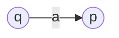
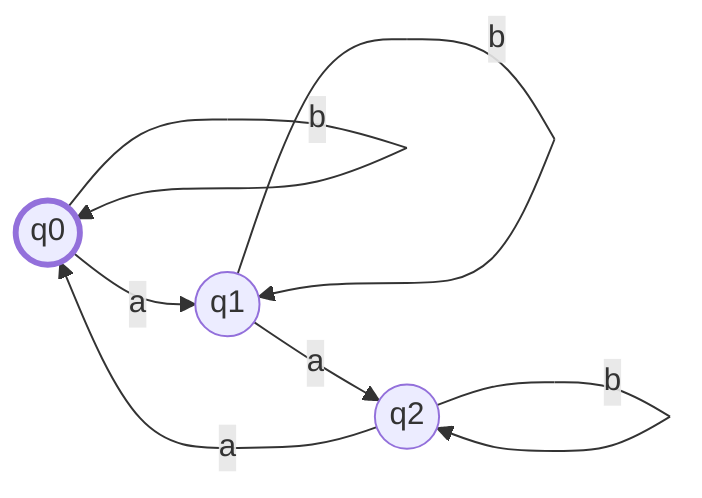
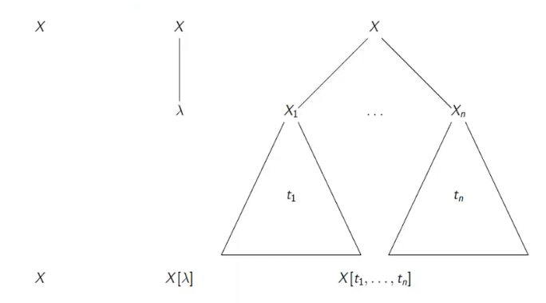

## Formális Nyelvek

### 1. Véges automata és változatai, a felismert nyelv definíciója. A reguláris nyelvtanok, a véges automaták, és a reguláris kifejezések ekvivalenciája. Reguláris nyelvekre vonatkozó pumpáló lemma, alkalmazása és következményei.

> rendszerint adok egy **példa automatát, megkérdezem h det vagy nemdet és miért**, felismeri-e ezt meg ezt a szót és miért, a képen **hogy hívják a bogyókat meg a nyilakat**, van h beadok pár **regexet h mondjál szavakat amik csak erre illeszkednek és a többire nem és miért**, van h **regexből kérem h csináljunk automatát,** van h **nd automatából determinisztikust**, van h egy **konkrét egyszerűbb nyelvet mondok és arra kéne regext vagy automatát készíteni**

#### Véges automata

Az $M = (Q, \Sigma, \delta, q_0, F)$ rendszert **determinisztikus automatának** nevezzük, ahol:

- $Q$ egy nem üres, véges halmaz, az **állapotok halmaza**

- $\Sigma$ egy ábécé, au **input ábécé**

- $q_0 \in Q$ a **kezdő állapot**

- $F \subseteq Q$ a **végállapotok halmaza**

- $\delta: Q \times \Sigma \to Q$ egy leképezés, az **átmenetfüggvény**

Példa:

- $Q = \{ ~ q_0, q_1, q_2 ~ \}$

- $\Sigma = \{ ~ a, b ~ \}$

- $F = \{ ~ q_0 ~\}$

- $\delta$
  
  - $\delta(q_0, a) = q_1$
  
  - $\delta(q_1, a) = q_2$
  
  - $\delta(q_2, a) = q_0$
  
  - $\delta(q_0, b) = q_0$
  
  - $\delta(q_1, b) = q_1$
  
  - $\delta(q_2, b) = q_2$

##### Automata megadása irányított gráfként

Gráf csúcsai az automata állapotai

Ha $\delta(q, a) = p$, akkor a $q$ csúcsból egy élet irányítunk a $p$ csúcsba, és az élet ellátjuk az $a$ címkével

> Itt az automata a $q$ állapotból az $a$ input szimbólum hatására átmegy a $p$ állapotba.

A korább példa automata megadása gráffal:

> A $q_0$ állapot jelen példában a végállapot is, amit a vastagított szél jelez.

##### Automata megadása táblázatként

Első sorban a kezdőállapot, végállapotokat meg kell jelölni (itt most csillag).

A korább példa automata megadása táblázattal:

| $\delta$ | $a$   | $b$   |
|:--------:|:-----:|:-----:|
| \* $q_0$ | $q_1$ | $q_0$ |
| $q_1$    | $q_2$ | $q_1$ |
| $q_2$    | $q_0$ | $q_2$ |

> Csillag jelzi, hogy az adott sor állapota végállapot.

##### Automata átmenetei

$M$ **konfigurációinak halmaza**: $C = Q \times \Sigma^*$

A $(q, a_1...a_n)$ **konfiguráció** azt jelenti, hogy $M$ a $q$ állapotban van ás az $a_1...a_n$ szót kapja inputként.

###### Átmeneti reláció

$(q, w), (q', w') \in C$ esetén $(q, w) \vdash_M (q', w')$, ha $w = aw'$, valamely $a \in \Sigma$-ra, és $\delta(q, a) = q'$.

> Azaz aminkor az automata átmegy $q$-ból $q'$-be, akkor az ehhez "felhasznált" szimbólumot leveszi az input szó elejéről. Pl. itt $a$ hatására ment, és $w = aw'$, így az átmenet után az input szó már csak $w'$ az $a$ nélkül. Mondhatni, hogy az $a$-t felhasználta az átmenethez.

####### Átmeneti reláció fajtái

- $(q, w) \vdash_M (q', w')$: Egy lépés

- $(q, w) \vdash^n_M (q', w'), n \ge 0$: $n$ lépés

- $(q, w) \vdash^+_M (q', w')$: Legalább egy lépés

- $(q, w) \vdash^*_M (q', w')$: Valamennyi (esetleg 0) lépés

> Az $M$ jelölés egy automatát azonosít, elhagyható, ha éppen csak 1 automatáról beszélünk, mert ilyenkor egyértelmű

> \*, és + itt is, és mindenhol ebben a tárgyban úgy működik, mint megszokott regexeknél

##### Felismert nyelv

Az $M = (Q, \Sigma, \delta, q_0, F)$ automata által felismert nyelven az $L(M) = \{ ~ w \in \Sigma^* ~ | ~ (q_0, w) \vdash^*_M (q, \epsilon) ~ \text{és} ~ q \in F ~ \}$ nyelvet értjük.

> Azaz $q_0$-ból $w$ hatására valamelyik $q \in F$ végállapotba jutunk

> $\epsilon$ az üres szó

##### Nemdeterminisztikus automata

Az $M = (Q, \Sigma, \delta, q_0, F)$ rendszert **nemdeterminisztikus automatának** nevezzük, ahol:

- $Q$ egy nem üres, véges halmaz, az **állapotok halmaza**

- $\Sigma$ egy ábécé, az **input ábécé**

- $q_0 \in Q$ a **kezdő állapot**

- $F \subseteq Q$ a **végállapotok halmaza**

- $\delta: Q \times \Sigma \to \mathcal{P}(Q)$ egy leképezés, az **átmenetfüggvény\***

> Azaz ugyan az, mint a determinisztikus, csak egy input szimbólum hatására egy állapotból többe is átmehet.

A determinisztikus automata ezen általánosítása (hiszen ez egy általánosítás, a determinisztikus automata is lényehében olyan nemdeterminisztikus ami mindig állapotoknak egy egyelemű halmazába tér át) **nem növeli meg a felismerő kapacitást**, tehát egy nyelv akkor és csak akkor ismerhető fel nemdeterminisztikus automatával, ha felismerhető determinisztikus automatával.

> Ezt "hatvány halmaz módszerrel" lehet bebizonyítani, meg kell nézni, hogy $a$ hatására milyen állapotokba tud kerülni a nemdeterminisztikus automata, és azonkah az uniója lesz egy állapot. Ez a "determinizálás", aminek a során az állapotok száma nagyban megnőhet (akár exponenciálisan).

###### Átmeneti reláció

$(q, w), (q', w') \in C$ esetén $(q, w) \vdash_M (q', w')$, ha $w = aw'$, valamely $a \in \Sigma$-ra, és $q' \in \delta(q, a)$.

###### Felismert nyelv

Az $M = (Q, \Sigma, \delta, q_0, F)$ (nemdeterminisztikus) automata által felismert nyelven az $L(M) = \{ ~ w \in \Sigma^* ~ | ~ (q_0, w) \vdash^*_M (q, \epsilon) ~ \text{valamely} ~ q \in F \text{-re} ~ \}$ nyelvet értjük.

> Azaz $q_0$-ból a $w$ hatására elérhető valamely $q \in F$ végállapot. DE! Nem baj, ha elérhetően nem-végállapotok is.

###### Teljesen definiált automata

Akkor teljesen definiált egy automat, ha minden szót végig tud olvasni.

Azaz nem tud pl. egy $\delta(q, a) = \emptyset$ átmenet miatt elakadni.

Azaz akkor teljesen definiált, ha minden $q \in Q$ és $a \in \Sigma$ esetén $\delta(q, a)$ **legalább** egy elemű.

Determinisztikus automaták teljesen definiáltak, hiszen pontosan egy állapotba léphetünk tovább.

Nemdeterminisztikus automaták pedig teljesen definiálhatóvá tehetőek "csapda" állapot bevezetésével, anélkül, hogy a felismert nyelv megváltozna.

- Felveszünk egy $q_c$ állapotot (ez a "csapda") állapot.

- $\delta(q, a) = \emptyset$ esetén legyen $\delta(q, a) = \{~ q_c ~\}$

- Legyen $\delta(q_c, a) = \{~ q_c ~\}$ minden $a \in \Sigma$-ra.

> A 3. pont az, ami miatt ez egy "csapda", nem lehet már ebből az állapotból kijönni.

##### Nemdeterminisztikus $\epsilon$-automata

Tartalmaz $\epsilon$-átmeneteket.

Az $M = (Q, \Sigma, \delta, q_0, F)$ rendszert **nemdeterminisztikus $\epsilon$-automatának** nevezzük, ahol:

- $Q$ egy nem üres, véges halmaz, az **állapotok halmaza**

- $\Sigma$ egy ábécé, az **input ábécé**

- $q_0 \in Q$ a **kezdő állapot**

- $F \subseteq Q$ a **végállapotok halmaza**

- $\delta: Q \times (\Sigma \cup \{ ~ \epsilon ~ \}) \to \mathcal{P}(Q)$ egy leképezés, az **átmenetfüggvény**

> Azaz ugyan olyan, mint a nemdeterminisztikus, csak lehet olyan átmenete, ami "nem fogyasztja" az inputot. Ez az $\epsilon$-átmenet.

**Ez sem bővíti a felismerő kapacitást**, egy nyelv akkor és csak akkor ismerhető fel nemdeterminisztikus $\epsilon$-átmenetes automatával, ha felismerhető nemdeterminisztikus automatával. $\epsilon$ automata $\epsilon$-mentesítéssel átalakítható nemdeterminisztikus automatává, ekkor az automaza a $q$ állapotból az $a$ hatására azon állapotokba megy át, amelyekre $M$ valamennyi (akár 0) $\epsilon$-átmenettel, majd egy $a$-átmenettel jut el, továbbá az automata végállapotai azon az állapotok, amikből valamennyi (akár 0) $\epsilon$-átmenettel egy $F$-beli állapotba jut.

###### Átmeneti reláció

$(q, w), (q', w') \in C$ esetén $(q, w) \vdash_M (q', w')$, ha $w = aw'$, valamely $a \in (\Sigma \cup \{ ~ \epsilon ~ \})$-ra, és $q' \in \delta(q, a)$.

> Ha $a = \epsilon$, akkor éppen $w = w'$

###### Felismert nyelv

Felismert nyelv definíciója ugyan az, mint a sima nemdeterminisztikus esetben.

#### Ekvivalencia tétel

Tetszőleges $L \subseteq \Sigma^*$ nyelv esetén a következő három állítás ekvivalens:

1. $L$ reguláris (generálható reguláris nyelvtannal).

2. $L$ felismerhető automatával.

3. $L$ reprezentálható reguláris kifejezéssel.

Ezt külön három párra lehet belátni.

##### \* Reguláris nyelvtan

Egy $G = (N, \Sigma, P, S)$ nyelvtan reguláris (vagy jobblineáris), ja $P$-ben minden szabály $A \to xB$ vagy $A \to x$ alakú.

Egy $L$ nyelvet reguláris nyelvnek hívunk, ha van olyan $G$ reguláris nyelvtan, melyre $L = L(G)$ (azaz őt generálja).

Az összes reguláris nyelvek halmazát $REG$-el jelöljük.

$REG \subset CF$

> Azaz vannak olyan környezetfüggetlen nyelvek, amik nem regulárisak.

##### \* Reguláris kifejezések

Egy $\Sigma$ ábécé feletti reguláris kifejezések halmaza a $(\Sigma \cup \{~ \emptyset, \epsilon, (, ), +, * ~\})^*$ halmaz legszűkebb olyan $U$ részhalmaza, amelyre az alábbi feltételek teljesülnek:

1. Az $\emptyset$ szimbólum eleme $U$-nak

2. Az $\epsilon$ szimbólum eleme $U$-nak

3. Minden $a \in \Sigma$-ra az $a$ szimbólum eleme $U$-nak

4. Ha $R_1, R_2 \in U$, akkor $(R_1) + (R_2), (R_1)(R_2)$ és $(R_1)^*$ is elemei $U$-nak.

> $U$-ban tehár maguk a kifejezések vannak.

Az $R$ reguláris kifejezés által meghatározott (reprezentált) nyelvet $|R|$-el jelöljük, és a következőképp definiáljuk:

- Ha $R = \emptyset$, akkor $|R| = \emptyset$ (üres nyelv)

- Ha $R = \epsilon$, akkor $|R| = \{~ \epsilon ~\}$

- Ha $R = a$, akkor $|R| = \{~ a ~\}$

- Ha:
  
  - $R = (R_1)+(R_2)$, akkor $|R| = |R_1| \cup |R_2|$
  
  - $R = (R_1)(R_2)$, akkor $|R| = |R_1||R_2|$
  
  - $R = (R_1)^*$, akkor $|R| = |R_1|^*$

##### Reprezentálható nyelvek regulárisak

> $3 \to 1$ az ekvivalencia tételben.

Ha $L \subseteq \Sigma^*$ nyelv reprezentálható reguláris kifejezéssel, akkor generálható reguláris nyelvtannal.

Ez $R$ struktúrája szerinti indukcióval belátható.

##### Reguláris nyelvek felismerhetők automatával

> $1 \to 2$ az ekvikalencia tételben.

Ha $L \subseteq \Sigma^*$ nyelv reguláris, akkor felismerhető automatával.

Ennek bizonyítását ez a két lemma képezi, ezekkel fel tudunk írni egy automatát a nyelvtanból:

- Minden $G = (N, \Sigma, P, S)$ reguláris nyelvtanhoz megadható vele ekvivalens $G' = (N', \Sigma, P', S)$ reguláris nyelvtan, úgy, hogy $P'$-ben minden szabály $A \to B, A \to aB$, vagy $A \to \epsilon$ alakú, ahol $A, B \in N$ és $a \in \Sigma$.
  
  > Ez az átalakítás EZ, csak láncolva új szabályokat kell felvenni, pl. $A \to bbB$ helyett $A \to bA_1, A_1 \to bB$

- Minden olyan $G = (N, \Sigma, P, S)$ reguláris nyelvtanhoz, melynek csak $A \to B, A \to aB$ vagy $A \to \epsilon$ alakú szabályai vannak, megadható olyan $M = (Q, \Sigma, \delta, q_0, F)$ nemdeterminisztikus $\epsilon$-automata, amelyre $L(M) = L(G)$.

> Ez is EZ, hiszen az $A \to aB$ jellegű szabályok könnyen felírjatóak automataként, $A$-ból megy $a$ hatására $B$-be

##### Automatával felismerhető nyelvek reprezentálhatók

> $2 \to 3$ az ekvivalencia tételben

Minden, automatával felismerhető nyelv reprezentálható reguláris kifejezéssel.

#### Pumpáló lemma reguláris nyelvekre

Minden $L \subseteq \Sigma^*$ reguláris nyelv esetén megadható olyan ($L$-től függő) $k > 0$ egész szám, hogy minden $w \in L$-re ha $|w| \ge k$, akkor van olyan $w = w_1w_2w_3$ felbontás, melyre $0 < |w_2|$ és $|w_1w_2| \le k$, és minden $n \ge 0$-ra, $w_1w_2^nw_3 \in L$

> Ha egy $L$ nyelvhez nem adható meg ilyen $k$, akkor az nem reguláris. Így ezen lemma segítségével bebizonyítható nyelvekről, hogy azok nem regulárisak.

> A $k$ szám az $L$-et felismerő egyik determinisztikus automata (több is felismeri) állapotainak száma.

#### A pumpáló lemma alkalmazása

A lemma arra használható, hogy nyelvekről belássuk, hogy az nem reguláris.

**Példa**: Az $L = \{~ a^nb^n ~ | ~ n \ge 0 ~\}$ nyelv nem reguláris.

**Bizonyítás**: Tegyük fel, hogy $L$ reguláris. Akkor megadható olyan $k$ szám, ami teljesíti a pumpáló lemma feltételeit.
Vegyük az $a^kb^k \in L$ szót, melynek hossza $2k \ge k$.
A pumpáló lemmában szereplő feltételek szerint létezik $a^kb^k = w_1w_2w_3$ felbontás, melyre $0 < |w_2|$, $|w_1w_2| \le k$ és minden $n \ge 0$-ra $w_1w_2^nw_3 \in L$.
Mivel $|w_1w_2| \le k$, a középső $w_2$ szó csak $a$ betűkből áll. Továbbá a $0 < |w_2|$ feltétel miatt a $w_1w_2^2w_3$, $w_1w_2^3w_3$, stb szavakban az $a$-k száma nagyobb, mint a $b$-k száma, tehát ezen szavak egyike sincs $L$-ben. Ellentmondás, tehát nem létezik ilyen $k$ szám. Akkor viszont az $L$ nyelv nem reguláris.

> Tehát az a baj ezzel a nyelvvel, hogy csak $a$-kat tudnánk bele pumpálni, de ez kivezet a nyelvből.

#### Következmények

- Egy automata nem képes számolni, hogy két betű ugyanannyiszor szerepel-e.

- Van olyan környezetfüggetlen nyelv, ami nem reguláris. Azaz $REG \subset CF$. Például ilyen az előző $L$ nyelv.

### 2. A környezetfüggetlen nyelvtan, és nyelv definíciója. Derivációk, és derivációs fák kapcsolata. Veremautomaták, és környezetfüggetlen nyelvtanok ekvivalenciája. A Bar-Hillel lemma és alkalmazása.

> mondjuk **adok egy nyelvet, arra kérem h építs veremautomatát vagy CF nyelvtant** (itt shameless self-promóként ajánlom a weblapomról a fonya alatti gyak recapomat), ott is **megkérdezgetek dolgokat h példa derivációs fát rajzolj le egyet hozzá**, esetleg azt h a **nyelvtant konvertáld veremautomatává**

#### Környezetfüggetlen nyelvtan

Egy $G = (N, \Sigma, P, S)$ négyes, ahol:

- $N$ egy ábécé, a **nemterminális ábécé**

- $\Sigma$ egy ábécé a **terminális ábécé**, amire $N \cap \Sigma = \emptyset$

- $S \in N$ a **kezdő szimbólum**

- $P$ pedig $A \to \alpha$ alakú ún. **átírási szabályok véges halmaza**, ahol $A \in N$, és $\alpha \in (N \cup \Sigma)$

##### Környezetfüggetlen nyelvek

Egy $L$ nyelvet környezetfüggetlennek hívunk, ha van olyan $G$ környezetfüggetlen nyelvtan, melyre $L = L(G)$.

Az összes környezetfüggetlen nyelvek halmazát $CF$-fel jelöljük.

Például az $\{ ~ a^nb^n ~ | ~ n \ge 0 ~ \}$ nyelv környezetfüggetlen.

##### Deriváció

Tetszőleges $\gamma, \delta \in (N \cup \Sigma)^*$ esetén $\gamma \Rightarrow_G \delta$, ha van olyan $A \to \alpha \in P$ szabály és vannak olyan $\alpha', \beta' \in (N \cup \Sigma)^*$ szavak, amelyekre fennállnak, hogy $\gamma = \alpha' A \beta', \delta = \alpha'\alpha\beta'$.

> Azaz, ha egy átírással (valamelyik P-beli szabály mentén) átvihető.

###### Fajtái

- $\gamma \Rightarrow_G \delta$: Egy lépés, közvetlen levezetés, közvetlen deriváció

- $\gamma \Rightarrow^n_G \delta, n \ge 0$: n lépés (0 lépés önmagába viszi)

- $\gamma \Rightarrow^+_G \delta$: Legalább egy lépés

- $\gamma \Rightarrow^*_G \delta$: Valamennyi (akár 0) lépés

> A $G$ alsó indexben elhagyható, ha 1 db nyelvtanról van éppen szó.

##### Generált (környezetfüggetlen) nyelv

A $G = (N, \Sigma, P, S)$ környezetfüggetlen nyelvtan által generált nyelv:

$L(G) = \{~ w \in \Sigma^* ~ | ~ S \Rightarrow^*_G w ~ \}$

> Azaz az összes olyan szó, ami $G$-ből levezethető.

#### Derivációs fák, kapcsolatuk a derivációkkal

Az $X \in (N \cup \Sigma)$ gyökerű derivációs fák halmaza a legszűkebb olyan $D_X$ halmaz, amelyre:

- Az a fa, amelynek egyetlen szögpontja (vagyis csak gyökere) az $X$, eleme $D_X$-nek.
- Ha $X \to \epsilon \in P$, akkor az a fa, amelynek gyökere $X$, a gyökerének egyetlen leszármazottja az $\epsilon$, eleme $D_X$-nek.
- Ha $X \to X_1...X_k \in P$, továbbá $t_1 \in D_{X_1}, ..., t_k \in D_{X_k}$, akkor az a fa, amelynek gyökere $X$, a gyökeréből $k$ él indul rendre a $t_1, ..., t_k$ fák gyökeréhez, eleme $D_X$-nek.

 Legyen $t$ egy $X$ gyökerű derivációs fa. Akkor $t$ magassságát $h(t)$-vel, a határát pedig $fr(t)$-vel jelöljük és az alábbi módon definiáljuk:

- Ha $t$ az egyetlen $X$ szögpontból álló fa, akkor $h(t) = 0$ és $fr(t) = X$.

- Ha $t$ gyökere $X$, aminek egyetlen leszármazottja $\epsilon$, akkor $h(t) = 1$, és $fr(t) = \epsilon$.

- Ha $t$ gyökere $X$, amiből $k$ él indul rendre a $t_1, ..., t_k$ közvetlen részfák gyökeréhez, akkor $h(t) = 1 + max\{ ~ h(t_i ~ | ~ 1 \le i \le k) ~ \}$ és $fr(t) = fr(t_1)...fr(t_k)$.

> Azaz $h(t)$ a $t$-ben levő olyan utak hosszának maximuma, amelyek $t$ gyökeréből annak valamely leveléhez vezetnek.

> Azaz $fr(t)$ azon $(N \cup \Sigma)^*$-beli szó, amelyet $t$ leveleinek balról jobbra (vagy: preorder bejárással) történő leolvasásával kapunk.

##### Az összefüggés derivációs fák, és derivációk közt

Tetszőleges $X \in (N \cup \Sigma)$ és $\alpha \in (N \cup \Sigma)^*$ esetén $X \Rightarrow^* \alpha$ akkor, és csak akkor, ha van olyan $t \in D_X$ derivációs fa, amelyre $fr(t) = \alpha$.

##### Az összefüggés következményei

- Tetszőleges $w \in \Sigma^*$ esetén $S \Rightarrow^* w$ akkor és csak akkor, ha van olyan $S$ gyökerű derivációs fa, amelynek határa $w$.

> Ez csak a korábbi tétel alkalmazása $S$-re, és egy $w$-re.

- Tetszőleges $w \in \Sigma^*$ esetén a következő állítások ekvivalensek:
  
  - $w \in L(G)$
  
  - $S \Rightarrow^* w$
  
  - $S \Rightarrow^*_l w$ (ez bal oldali deriváció, mindig a legbaloldalibb nemterminálist lehet csak helyettesíteni)
  
  - van olyan $S$ gyökerű derivációs fa, amelynek határa $w$.

##### Generált nyelv definiálása derivációs fákkal

$L(G) = \{ ~ fr(t) ~ | ~ t \in D_S, fr(t) \in \Sigma^* ~ \}$
