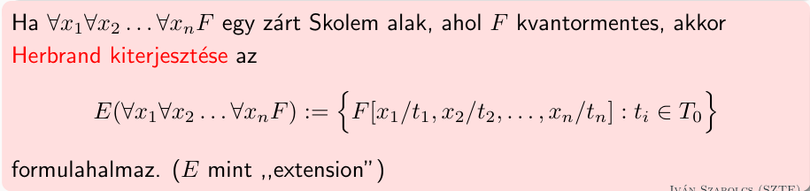
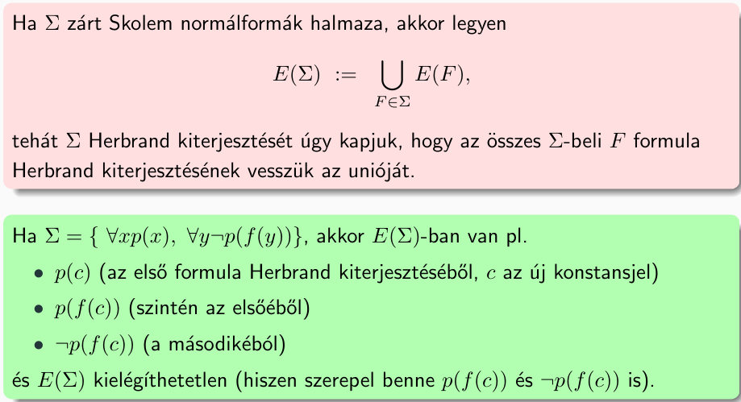
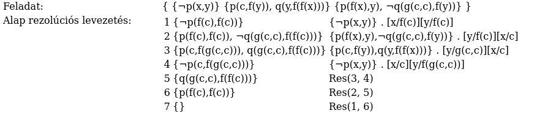
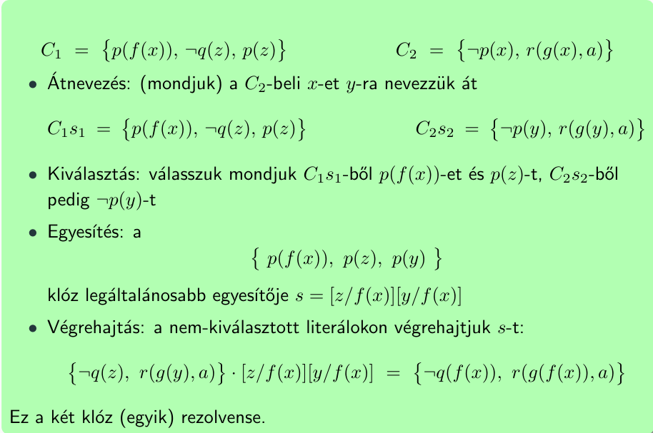
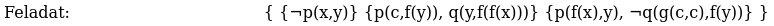
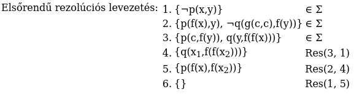

## Logika és informatikai alkalmazásai

> rendszerint azzal indítok h példát adok fel, az elsőben **hilbertes és/vagy rezolúciós következtetést**, a másodikban **elsőrendű/alap rezolúciósat**, hogy na akkor ezen induljunk el és **közben kérdezgetem a táblán levő dolgokról h azok mik** (pl a másodikban a |= jelre, p-re, f-re hogy az mi, a két kvantorra h az melyik melyik, a változókra h azok mit vehetnek fel értékül, ilyesmit); a **másodikban valszeg az input eleve nem lesz skolemben**, arra is kell majd hozni, végén lehet megkérdem h **mi ez a helyességi-teljességi tétel, mit jelent a két szó közül melyik**

### 1. Normálformák az ítéletkalkulusban, Boole-függvények teljes rendszerei. Következtető módszerek: Hilbert-kalkulus és rezolúció, ezek helyessége és teljessége.

#### Normálformák az ítéletkalkulusban

##### * Ítéletkalkulus-beli formulák

- Minden **változó**, és minden **logikai konstans** formula

- Ha $F$ formula, akkor $( \neg F )$ is formula

- Ha $F$ és $G$ formulák, akkor $(F \land G), (F \lor G), (F \leftrightarrow G)$ is formulák

- **Más formula nincs**

##### Konjunktív normálforma (CNF)

- **Literál**: CNF legkisebb eleme, lehet egy **válzotó**, vagy egy **változó negáltja**.
  
  - **Negatív literál**: Ha egy változó negáltja alkotja.
  
  - **Pozitív literál**: Ha egy nem negált változó alkotja.

- **Klóz**: Véges sok **literál diszjunkciója** (vagyolása).
  
  - **Egységklóz**: 1db változóból álló klóz.
  
  - **Üres klóz**: 0db változóból álló klóz.
    
    - Értéke minden értékadás mellett **hamis**.
    
    - Jele: $\square$

- **CNF**: **Klózok konjunkciója** (éselése).
  
  - **Üres CNF**: 0db klózt tartalmaz.
    
    - Értéke minden értékadás mellett **igaz**.
    
    - Jele: $\emptyset$

> Üres klóz az inputban jellemzően nincs, de az algoritmusok generálhatnak.

###### Minden formula ekvivalens CNF alakra hozható.

1. $\to$ és $\leftrightarrow$ konnektívák eliminálása. ($A \to B \equiv \neg A \lor B$-vel)

2. $\neg$-k bevitele változók mellé deMorgan azonosságokkal.

3. $\lor$ jelek bevitele a $\land$ jelek alá disztributivitás alkalmazásával.

> Disztributivitás szabályai:
> $F \lor (G \land H) \equiv (F \lor G) \land (F \lor H)$
> $(F \land G) \lor H \equiv (F \lor H) \land (G \lor H)$

> A "konnektíva" azt jelenti, hogy az operátor formulákat vár (köt össze), nem változókat (az a Boole-függvény).

###### CNF-ek reprezentálása

Nem stringként, hanem:

- egy klózt a benne szereplő literálok halmazaként,

- egy CNF-et pedig a klózainak halmazaként.

> Ezt azért tehetjük meg, mert sem a vagyolás, sem az éselés esetén nem számít a sorrend, illetve az érintett változók multiplicitása sem, pl. $(p \lor p) \land (q \lor q)$ ugyan az, mint $q \lor p$ (sorrend fordult, multiplicitás eltűnt).

##### Diszjunktív normálforma

Ugyan az, mint a CNF, csak nem "vagyolások éselése", hanem "éselések vagyolása".

##### Negációs normálforma

Ha $\neg$ csak változó előtt szerepel, és $\neg$-en kívül csak $\lor$ és $\land$ szerepel.

> Ilyet kapunk ha a CNF-re hozást csak a 2. lépésig csináljuk.

#### Boole-függvények teljes rendszerei

##### * Boole függvény ($n$-változós)

Bitvektort egy bitbe képező függvény: $f: \{ ~ 0, 1 ~ \}^n \to \{ ~ 0, 1 ~ \}$

$f$ egy $n$-változós függvény jelölése: $f / n$

A $\neg$ unáris, egyváltozós Boole-függvény

A többi 4 megadható 4 soros igazságtáblával.

##### * Indukált Boole-függvény

Ha az $F$ formulában csak a $\{ ~ p_1, ..., p_n ~ \}$ változók szerepelnek, akkor $F$ indukál egy $n$-változós Boole-függvényt, melyet szintén $F$-el jelölünk:

- $p_i(x_1, ..., x_n)  := x_i$ (ez **projekció** / tömbelem kiválasztás)

- $(\neg F)(x_1, ..., x_n) := \neg (F(x_1, ..., x_n))$

- $(F \lor G)(x_1, ..., x_n) := F(x_1, ..., x_n) \lor G(x_1, ..., x_n)$

- ...

> A Boole-függvénynek átadott bitvektor tulajdonképpen a formula egy értékadása. A visszaadott bit pedig a formula kiértékelésének eredménye.

##### * Boole-függvények megszorítása

Legyen $f/n$ a Boole-függvény, $n > 0$. Ha $b \in \{ ~ 0, 1 ~ \}$ igazságérték, úgy $f|_{x_n=b}$ jelöli azt az $(n - 1)$ változós Boole-függvényt, melyet úgy kapunk, hogy $f$ inputjában $x_n$ értékét rögzítjük $b$-re.

Azaz: $f|_{x_n = b}(x_1, ..., x_{n-1}) := f(x_1, ..., x_{n-1}, b)$

Például:

- $\lor |_{x_2 = 1}$ a konstans 1 függvény.

- $\land |_{x_2 = 0}$ a konstans 0 függvény.

> Bármenyik koordinátát lehet rögzíteni, nem csak az utolsót.

##### Teljes rendszerek

Boole-függvények egy $H$ rendszere teljes, vagy adekvált, ha minden $n$-változós Boole-függvény előáll

- a **projekcióból**

- és $H$ elemeiből

- alkalmas **kompozícióval**.

###### Kompozíció

Ha $f/n$ és $g_1/k, ..., g_n/k$ Boole-függvények, akkor az $f \circ \lang g_1, ..., g_n \rang$ az a $k$-változós Boole-függvény, melyre: $(f \circ \lang g_1, ..., g_n \rang)(x_1, ..., x_n) = f(g_1(x_1, ..., x_k), ..., g_n(x_1, ..., x_k))$

> Azaz egy függvényt úgy hívunk meg, hogy az inputjai függvényhívások eredményei.

##### Shannon expanzió

$f(x_1, ..., x_n) = (x_n \land f |_{x_n = 1}(x_1, ..., x_{n-1})) \lor ( \neg x_n \land f |_{x_n = 0}(x_1, ..., x_{n-1}))$

> Lényegében ezzel azt írtuk le, hogy az $x_n$ értéke mellett vagy úgy igaz a formula, hogy $x_n = 1$, vagy úgy, hogy $x_n = 0$.

Ennek a következménye: Minden Boole függvény előáll a projekciók, és a $\{ ~ \neg, \land, \lor ~ \}$ alkalmas kompozíciójaként. (Hiszen az előző összefüggésben csak ezeket használjuk fel, és ez ismételhető amíg nem kötöttünk le minden változót.)

Ezt úgy is lehet mondani, hogy a $\{ ~ \neg, \lor, \land ~ \}$ **rendszer teljes**.

Ebből az is következik, hogy minden Boole-függvény indukálható olyan formulával, melyben csak a $\{ ~ \neg, \land, \lor ~ \}$ konnektívák szerepelnek.

##### További teljes rendszerek

- $\{ ~ \neg, \land ~ \}$: Mivel $x_1 \land x_1 = \neg (\neg x_1 \lor \neg x_2)$

- $\{ ~ \to, \downarrow ~ \}$ `// Hilbert rendszere`

- $\{ ~ \text{NAND} ~ \}$

- $\{ ~ \text{NOR} ~ \}$

> A NAND-on, és NOR-on kívül nincs másik olyan $f/2$ Boole-függvény, ami egyedül is teljes rendszert alkot.

#### Hilbert rendszere

Egy input $\Sigma$ **formulahalmaz** összes következményét (és csak a következményeket) lehet vele levezetni.

Az ítéletváltozókon kívül ebben a rendszerben csak a $\to$ konnektívát, és a $\downarrow$ logikai konstanst használhatjuk.

> Minden formula ilyan alakra hozható, mert $\{ ~ \to, \downarrow ~ \}$ teljes rendszer.

##### A Hilbert rendszer axiómái

- $(F \to (G \to H)) \to ((F \to G) \to (F \to H))$

- $F \to (G \to F)$

- $((F \to \downarrow )\to \downarrow) \to F$

> Ezen a formulák **tautológiák**. Azaz minden értékadás mellett igazak.

##### Az axiómák példányai

A 3 axióma egy **példánya**: valamelyik axiómában szereplő $F, G, H$ helyére **tetszőleges formulát** írunk.

Ennek van jelölése is: Ha $F$ egy formula, melyben a $p_1, ..., p_n$ változók szerepelnek, és $F_1, ..., F_n$ formulák, akkor $F[p_1/F_1, ..., p_n/F_n]$ jelöli azt a formulát, melyet úgy kapunk $F$-ből, hogy benne minden $p_i$ helyére az $F_i$ formulát írjuk.

##### Leválasztási következtetés, avagy modus ponens

$\{ ~ F, F \to G ~ \} \vDash G$

> Ha $F$-et, és $F \to G$-t már levezettük, azaz az eredeti formulánknak ők logikai következményei, akkor felvehetjük $G$-t is, mert ő is logikai következmény.

##### Levezetés Hilbert rendszerében

Legyen $\Sigma$ formulák egy halmaza, $F$ pedig egy formula. Azt mondjuk, hogy $F$ **levezethető** $\Sigma$-ból **Hilbert rendszerében**, jelben $\Sigma \vdash F$, ha van olyan $F_1, F_1, ..., F_n$ formula-sorozat, melynek minden eleme

- $\Sigma$-beli vagy

- **axiómapéldány** vagy

- előáll két korábbiból **modus ponenssel**

és melyre $F_n = F$. (Ha $\Sigma$ üres, akkor $\emptyset \vdash F$ helyett $\vdash F$-et is írhatunk) 

###### Példa

Feladat:

$\{~(q \to p) \to r~,~r \to \downarrow ~\}~\vdash~p \to \downarrow$

**Bal oldalt**: $\Sigma$ **formulahalmaz**, ezekből akarjuk **levezetni** a **jobb oldalt**

**Ha sikerül levezetni**, akkor a jobb oldalt álló formula a $\Sigma$ logikai következménye

**Dedukciós tétel** alkalmazása:

$\{~(q \to p) \to r~,~r \to \downarrow, p ~\}~\vdash~ \downarrow$

**Lépések**:

1. $p$ : fel lehet venni, mert $\in \Sigma$

2. $p \to (q \to p)$ : Fel lehet venni, mert $Ax2[F/p, G/q]$, azaz a második axióma példánya

3. $q \to p$ : Fel lehet venni, mert az $1.$ és a $2.$ felvett formulákból leválasztási következtetéssel, más néven modus ponensel kijön

4. $(q \to p) \to r$ : $\in \Sigma$

5. $r$ : $MP(3., 4.)$

6. $r \to \downarrow$ : $\in \Sigma$

7. $\downarrow$ : $MP(5., 6.)$

Eredmény: A jobb oldali formulát ($\downarrow$) sikeresen levezettük $\Sigma$-ból, a hilbert rendszer helyessége miatt kijelenthető, hogy $\downarrow$ $\Sigma$-nak logikai következménye

> Szóval amit a lépésekkor lehet: $\Sigma$-ból felvenni, MP-elni, és axiómát példányosítani. Az axiómákba nem csak 1-1 változó kerülhet hanem összetettebb formulák is, pl $[F /p \to q]$

> Változók logikai értékeket vehetnek fel

> Dedukciós tételt nem szabad elfelejteni

> Eléggé azon múlik, hogy meg van-e a jó axióma példányosítás, lehet pl. úgy gondolkodni, mit kell példányosítani, hogy utána egy meglévővel MP-elni lehessen

> $\vdash$: Levezetés Hilbert rendszerében
> $\vDash$: Logikai következmény
> Mivel helyes, teljes, így ekvivalens, de mást jelent ettől a két jel

##### Helyesség, teljesség

###### Helyesség

Ha $\Sigma \vdash F$, akkor $\Sigma \vDash F$.

> Azaz, ha egy formulát le lehet vezetni $\Sigma$-ból Hilbert rendszerében, akkor az következménye is $\Sigma$-nak.

###### Teljesség

**Dedukciós tétel**: Tetszőleges $\Sigma$ formulahalmazra, és $F$, $G$ formulákra $\Sigma \vdash (F \to G) \Leftrightarrow \Sigma \cup \{ ~ F ~ \} \vdash G$ 

**H-konzisztens halmazok**: Egy $\Sigma$ formulahalmazt H-konzisztensnek nevezünk, ha **nem igaz**, hogy $\Sigma \vdash \downarrow$

> Csak simán az, hogy **konzisztens** formulahalmaz, az azt jelenti, hogy **kielégíthető**.

Ekvikalens állítások tetszőleges $\Sigma$ formulahalmazra:

- Van olyan $F$ formula, melyre $\Sigma \vdash F$ és $\Sigma \vdash (F \to \downarrow)$ is igaz.

- $\Sigma$ **nem** H-kozisztens.

- $\Sigma \vdash F$ minden $F$ formulára.

**Maximális H-konzisztens halmazok**: Egy $\Sigma$ formulahalmazt maximális H-konzisztensnek nevezünk, ha

- $\Sigma$ H-konzisztens, és

- minden $F \notin \Sigma$-ra $\Sigma \cup \{ ~ F ~ \}$ már nem H-konzisztens.

> Minden $\Sigma$ H-konzisztens halmazhoz van $\Sigma' \supseteq \Sigma$ maximális H-konzisztens halmaz. "A halmazt fel lehet fújni."

Ha $\Sigma$ maximális H-konzisztens halmaz, akkor tetszőleges $F$ formulára vagy $F \in \Sigma$, vagy $(F \to \downarrow ) \in \Sigma$, de nem mindkettő.

> Azaz minden **formulát, vagy a negáltját** tartalmazzák, de csak az egyiket.

Tetszőleges $\Sigma$ formulahalmaz pontosan akkor kielégíthető, ha H-konzisztens.

**A Hilbert-rendszer teljessége**:

Ha $\Sigma \vDash F$, akkor $\Sigma \vdash F$

> Azaz ha egy formula logikai következménye $\Sigma$-nak, azt le lehet vezetni Hilbert rendszerében

#### Rezolúció

##### Rezolúciós következtetés

$\{ ~ F \lor G, \neg F \lor H ~ \} \vDash G \lor H$

> Nyílván, mert ha az $F$ igaz, akkor $H$ igaz kell, hogy legyen, ha $F$ hamis, akkor $G$ igaz kell, hogy legyen.

> Emlékeztető: Logikai következmény jelentése: Bármely értékadás mellett ha a bal oldal igaz (jelen esetben bal oldalon minden igaz, mert egy halmaz áll ott), akkor a jobb is.

##### Rezolvens

Ha $C$ és $D$ klózok, $p \in C$ és $\neg p \in D$, akkor $C$ és $D$ ($p$ menti) rezolvense a $(C - \{ ~ p ~ \}) \cup (D - \{ ~ \neg p ~ \})$ klóz.

> Egy új, harmadik klóz keletkezik.

##### Rezolúciós algoritmus

**Input**: Klózok $\Sigma$ halmaza.

**Output**: Kielégíthetetlen-e $\Sigma$?

**Algoritmus**: Listát vezetünk klózokról. Egy klózt felveszünk, ha 

- $\Sigma$-beli, vagy

- két, a listán már szereplő klóz rezolvense.

Ha az $\square$ üres klóz rákerül a listára, a $\Sigma$ kielégíthetetlen.

Ha már nem tudunk új klózt felvenni és $\square$ nincs köztük, $\Sigma$ kielégíthető.

> Kielégíthető formulahalmazra nem feltétlen áll meg az algoritmus. Ezért kérdezzük inkább, hogy kielégíthetetlen-e.

> Egyszerre több literál mentén nem ér rezolválni!!

###### Példa

Feladat:

$\{ (r\to \neg t)\vee \neg t , \neg s , \neg p\to (s\vee t) \} \vDash \neg((\neg p\to \neg r)\to (t\wedge s))$

Következtetést kell csinálni

Az algoritmus alapvetően azt csinálja, hogy kap egy klóz halmazt, és ha kielégíthetetlen, ezt megmondja

Ennek megfelelően kell formalizálni a következtetést. A jobb oldal negáltját hozzá kell venni a bal oldalhoz:

$\{ (r\to \neg t)\vee \neg t , \neg s , \neg p\to (s\vee t), (\neg p\to \neg r)\to (t\wedge s) \}$

Majd ezt "összeéselni", és CNF-re kell hozni, hiszen ez a rezolúció inputja:

$\{ ~ \{\neg p, s \} ~ , ~ \{ r, t \} ~ , ~ \{ \neg r, \neg t \} ~ , ~ \{ p, s, t \} ~ , ~ \{r, s \} ~ , ~ \{\neg p, t \} ~ , ~ \{ \neg s \} ~\}$

> CNF-re hozás fent le van írva

Tehát azt akarjuk belátni, hogy a $\Sigma$ klózok halmaza, ami valójában egy CNF, kielégíthetetlen, mert ha az, akkor logikai következménye az eredetileg jobb oldalon álló formula (hiszen a negáltját hozzáéselve kielégíthetetlen a formula)

Levezetés:

1. $\{p, s, t\}$: fel lehet venni, mert $\Sigma$-beli

2. $\{ \neg p, s \}$: $\in \Sigma$

3. $\{s, t\}$: fel lehet venni, mert az $1.$ és $2.$ rezolvense $p$ mentén

4. $\{ \neg r, \neg t\}$: $\in \Sigma$

5. $\{ s, \neg r \}$: $Res(3., 4.)$

6. $\{ r, s \}$: $\in \Sigma$

7. $\{ s \}$: $Res(5., 6.)$

8. $\{ \neg s \}$: $\in \Sigma$

9. $\{ \}$: $Res(7., 8.)$

> **Egyszerre két változó mentén** rezolválni SZIGORÚAN TILOS

Eredény: Megkaptuk az üres klózt, azaz a formula kielégíthetetlen, azaz az eredeti jobb oldalon álló formula logikai következménye a bal oldalnak

###### Helyesség

Ha az algoritmus "kielégíthetetlen" válasszal áll meg, akkor az input $\Sigma$ valóban kielégíthetetlen.

###### Teljesség

Ha $\Sigma$ kielégíthetetlen, akkor az algoritmus mindig a "kielégíthetetlen" válasszal áll meg.

### 2. Normálformák az elsőrendű logikában. Egyesítési algoritmus. Következtető módszerek: Alap rezolúció, és elsőrendű rezolúció, ezek helyessége és teljessége.

#### * Elsőrendű logika alapfogalmak

Függvényjelek, predikátumjelek **aritása / rangja**: Hány változósak

**Alapterm**: Olyan term, amiben nincs változó

**Term**:

- Változók

- $f/n$ függvényjel, és $t_1, ..., t_n$ termek esetén $f(t_1, ..., t_n)$ is term

##### * Struktúra

Egy $\mathcal{A} = (A, I, \phi)$ hármas, ahol

- $A$ egy nemüres halmaz, az **univerzum**

- > A változók ebből vehetnek fel értékeket

- $\phi$ a változóknak egy "default" **értékadása**, minde $x$ változóhoz egy $\phi(x) \in A$ objektumot rendel

- $I$ az **interpretációs függvény**, ez rendel a függvény és predikárumjelekhez szemantikát, "értelmet" az adott struktúrában:
  
  - ha $f/n$ **függvényjel**, akkor $I(f)$ egy $A^n \to A$ függvény
  
  - > Objektum(ok)ból objektumot csinál
  
  - ha $p / n$ **predikátumjel**, akkor $I(p)$ egy $A^n \to \{ ~ 0, 1 ~ \}$ predikátum
  
  - > Objektum(ok)ból igazságértéket csinál

> Az $=$ bináris predikátumjelet minden struktúrában ténylegesen az egyenlőséggel kell interpretálnunk!

###### * Term kiértékelése

- Ha $t = x$ változó, akkor $\mathcal{A}(t) := \phi(x)$

- Ha $t = f(t_1, ..., t_n)$, akkor $\mathcal{A}(t) := I(f)(\mathcal{A}(t_1), ..., \mathcal{A}(t_n))$

> Emlékeztető, a term lehet egy változó, vagy egy függvény, aminek paraméterei termek.

> Egy struktúra megadásakor **elég csak azon változókat specifikálni**, amik **ténylegesen használtak** (szerepelnek a termekben).

###### * Formulák kiértékelése

$\mathcal{A}_{[x ~ \mapsto ~ a]}$: Az a struktúra, ami az $\mathcal{A}$ struktúrát úgy változtatja, hogy benne a $\phi(x) := a$ 

Ha $F$ formula, $\mathcal{A} = (A, I, \phi)$ pedig struktúra, akkor az $F$ értéke $\mathcal{A}$-ban egy igazságérték, amit $\mathcal{A}(F)$ jelöl, és az $F$ felépítése szerinti indukcióval adunk meg:

- Logikai konstansok: $\mathcal{A}(\uparrow) := 1, \mathcal{A}(\downarrow) := 0$

- Konnektívák: $\mathcal{A}(F \land G) := \mathcal{A}(F) \land \mathcal{A}(G)$, $\mathcal{A}(F \lor G) := \mathcal{A}(F) \lor \mathcal{A}(G)$, $\mathcal{A}(\neg F) := \neg \mathcal{A}(F)$, ...

- Atomi formulák: $\mathcal{A}(p(t_1, ..., t_n)) := I(p)(\mathcal{A}(t_1), ..., \mathcal{A}(t_n))$

> Azaz $\mathcal{A}$-ban elöször kiértékeljük $t_1, ..., t_n$ termeket, majd a kapott $a_1, ..., a_n$ objektumokat befejettesítjük abba a predikátumba, amit ebben a struktúrában $p$ jelöl.

- Kvantorok:
  
  - $\mathcal{A}( \exists xF)$: $1$, ha van olyan $a \in A$, melyre $\mathcal{A}_{[x \mapsto a]} (F) = 1$, különben $0$
  
  - $\mathcal{A}( \forall xF)$: $1$, ha minden $a \in A$-ra igaz, hogy $\mathcal{A}_{[x \mapsto a]}(F) = 1$, különben 0

#### Normálformák az elsőrendű logikában

##### Zárt Skolem alak

1. **Nyilak eliminálása** ($F \to G \equiv \neg F \lor G$)

2. **Kiigazítás**: Ne legyen **változónév-ütközés**

3. **Prenex alak**ra hozás: Összes **kvantor előre** kerül

> Idáig volt ekvivalens az átalakítás

1. **Skolem alak**ra hozás: Összes kvantor elöl, és mind $\forall$

2. **Lezárás**: Ne maradjon **szabad változó-előfordulás**

###### Kiigazítás

- Különböző helyeken levő kvantorok **különböző változókat kötnek** és

- Nincs olyan változó, mely **szabadon is és kötötten is** előfordul.

> Gyakorlatban annyi ez a lépés, hogy a kötött változókat átnevezzük, jellemzően indexeléssel.

> **Átnevezni csak kötött** változókat ér, szabad változót nem, akkor marad ekvivalens.

###### Prenex alak

Egy formula **Prenex alak**ú, ha $Q_1x_1Q_2x_2...Q_nx_n(F)$ alakú, ahol $F$ **kvantormentes** formula, és mindegyik $Q_I$ egy **kvantor**.

Minden formula ekvivalens Prenex alakra hozható.

Első lépésként **ki kell igazítani a formulát** (előző lépés).

- Ha egy negálást áthúzunk egy kvantoron, megfordul a kvantor: $\neg \exists xF \equiv \forall x \neg F$

- $\exists x F \lor G \equiv \exists x (F \lor G)$
  
  - Ha $x$ nem szerepel $G$-ben szabadon, ezért kell előtte kiigazírani!

###### Skolem alak

Egy formula **Skolem alakú**, ha $F = \forall x_1 \forall x_2 ... \forall x_n (F^*)$, ahol $F^*$-ben (a formula magjában) már nincs kvantor.

Skolem alak értelme: $\forall x_1 ... \forall x_n F^* \vDash F^* [x_1 / t_1, ..., x_n / t_n]$

> Tehát termeket lehet a változók helyére helyettesíteni.

A Skolem-alakra hozás **nem ekvivalens, csak s-ekvivalens**: Minden $F$ formulához konstruálható eg yolyan $F'$ Skolem alakú formula, ami pontosan akkor kielégíthatő, ha $F$ is az. Ennek jele: $F \equiv_S F'$

- Prenex alakra hozzuk a formulát

- Skolem-függvényekkel eltűntetjük a $\exists$ kvantorokat:
  
  - Minden $\exists y$-lekötött változót a formula magjában cseréljünk le egy $f(x_1, ..., x_n)$ termre, ahol:
    
    - $f$ egy teljesen új függvényszimbólum,
    
    - $x_1, ..., x_n$ pedig az $y$ előtt szereplő $\forall$-kötött változók.

###### Zárt Skolem alak

- Minden $x$ szabad előfordulás helyett egy új $c_x$ konstansjelet vezetünk be

- ezt úgy, hogy minden formulában az összes szabad $x$ helyére ugyanazt a $c_x$-et írjuk

> Ez is s-ekvivalens átalakítás

##### CNF elsőrendű logikában

- **Literál**: Atomi formula (ekkor pozitív), vagy negáltja (ekkor negatív), pl.: $p(x, c), \neg q (x, f(x), z)$

- **Klóz**: Literálok véges diszjunkciója, pl.: $q(x) \lor \neg q (x, c)$

- **CNF**: Klózok konjukciója, pl.: $(p(x) \lor \neg q(y, c)) \land \neg p(x)$

**Kvantormentes** elsőrendű logikai formulát az ítéletkalkulusban megszokott módon hozhatunk CNF-re.

#### Alap rezolúció

> Alap, mert alaptermek szerepelnek benne

Input: Elsőrendű formulák egy $\Sigma$ halmaza

Ha $\Sigma$ kielégíthetetlen, akkor az algoritmus ezt véges sok lépésben levezeti

Ha kielégíthető, akkor vagy ezt vezeti le, vagy végtelen ciklusba esik

##### Módszer

- $\Sigma$ elemeit zárt Skolem alakra hozzuk, a kapott formulák magját CNF-re.
  
  - Jelölje $\Sigma'$ a kapott klóz halmazt

- Ekkor $E(\Sigma ')$ a klózok **alap példányainak halmaza**

> Ez annyit takar, hogy a klózban a változók helyére ízlés szerint alaptermeket helyettesítünk, minden ilyennek a halmaza

- Az $E(\Sigma')$ halmazon futtatjuk az ítéletkalkulus-beli rezolúciós algoritmust

Mivel $E(\Sigma')$ általában végtelen, így az algoritmus (mondjuk)

- Egy lépésben legenerálja, és felveszi $E(\Sigma')$ egy elemét

- az eddigi klózokkal rezolvenst képez, amíg csak lehet

- ha közben megkapjuk az üres klózt, $\Sigma$ kielégíthetetlen

- különben generáljuk a következő elemet.

##### Példa:

Hasonló, mint az íréletkalkulus beli rezolúció, annyi, hogy $E(\Sigma)$-ból lehet felvenni klózokat, ami annyi tesz, hogy a $\Sigma$-beli kiválasztott klózban lehet a változókat valamilyen alaptermmel helyettesíteni.

Az alapterm változó nélküli term, függvényjelekből, konstansokból összerakva (févtelen sok lehet)

Inputnak kapott formulát majd zárt Skolem-re kell hozni előbb, és a magját CNF-re (a CNF-et már ugyan úgy kell, mint ítéletkalkulusban)

> Változók értéke mi lehet? A struktúra határozza meg, amiben $\phi$ értékes ad a változóknak $A$-ból, azaz az értékük $A$-beli objektum

##### Helyesség, és teljesség

**Helyesség**: Ha sikerül levezetni az üres klózt, akkor $\Sigma$ valóban kielégíthetetlen

**Teljesség**: Ha $\Sigma$ kielégíthetetlen, akkor ezt le tudjuk vezetni

#### Elsőrendű rezolúció

##### Elsőrendű rezolvensképzés

Két elsőrendű logikai klóz, $C_1$ és $C_2$ elsőrendű rezolvensét így kapjuk:

- Átnevezzük a klózokban a változókat úgy (legyenek a változóátnevezések $s_1$ és $s_2$), hogy a kapott $C_1 \cdot s_1$ és $C_2 \cdot s_2$ klózok ne tartalmazzanak közös változót.

- Kiválasztunk $C_1 \cdot s_1$-ből $l_1, ..., l_m$és $C_2 \cdot s_2$-ből $l_1', ..., l_n'$ literálokat, mindkettőből legalább egyet-egyet.

- Futtatjuk az egyesítési algoritmust a $C = \{ ~ l_1, ..., l_m, l_1', ..., l_n' ~ \}$ klózon.

> Emiatt az egyesítési lépés miatt a korábbi literál kiválasztást érdemes úgy csinálni, hogy csak egy féle predikátumjeleket választunk ki, és az egyik klózból csak pozitív előfordulásokat, a másikból csak negatívakat. Így lesz esély arra, hogy egyesíthető legyen.

- Ha $C$ egyesíthető az $s$ legáltalánosabb egyesítővel, akkor $s$-et végrehajtjuk a nem kiválasztott literálok halmazán: $R := ((C \cdot s_1 - \{ ~ l_1, ..., l_m ~ \}) \cup (C_2 \cdot s_2 - \{ ~ l_1', ..., l_n' ~ \})) \cdot s$

A kapott $R$ klóz a $C_1$ és $C_2$ egy elsőrendű rezolvense.

###### Példa

##### Algoritmus

**Input**: Elsőrendű klózok egy $\Sigma$ halmaza. Úgy tekintjük, mintha a $\Sigma$-beli klózok változói univerzálisan lennének kvantálva.

> Azért tekinthetjük így, mert $\forall x (F \land G) \equiv \forall F \land \forall G$

**Output**:

- Ha $\Sigma \vDash \downarrow$, akkor "kielégíthetetlen"

- Különben "kielégíthető", vagy végtelen ciklus

Listát vezetünk klózokról, egy klózt felveszünk, ha

- $\Sigma$-beli, vagy

- két, már a listán szereplő klóz rezolvense.

Ha $\square$ rákerül a listára, akkor $\Sigma$ kielégíthetetlen.

Különben, ha már nem tudunk több klózt lebezetni, $\Sigma$ kielégíthető.

> $Res(\Sigma)$ jelöli azt a halmazt, amely tartalmazza $\Sigma$ elemeit, és a belőlük egy rezolvensképzéssel levezethető klózokat.

> $Res^*(\Sigma)$ pedig a $\Sigma$-ból rezolúcióval levezethető összes klóz halmazát jelöli.

##### Példa

Zárt Skolemre, magját CNF-re kell hozni majd a formulának

$\Sigma$-ból felvenni ér

Rezolválásra példa (5. sor kifejtve):

- Nincsenek ütköző változó nevek a két klózban, nem kell átnevezni

- Egyikből ugye pozitív literál kell, másikból negatív: $\neg q(...)$ és $q(...)$

- Ezeket kell egyesíteni (negáció erre a lépésre leketül persze)
  
  - Két (vagy akár több) klózt egymás mellé helyezve el kell indulni balról jobbra
  
  - Ahol eltérés van ott fel kell jegyezni egy olyan átírási szabályt, holgy egyezzenek meg az adott pozíción
  
  - Ezt addig ismételni, míg teljesen meg nem egyeznek
  
  - Jelen esetben:
    
    - $[x_1 / g(c, c)]$, mivel balról jobbra haladva ez az első eltérés amit találunk
    
    - $[y/ f(x_2)]$

- A feljegyzett átírási szabályokat azokra literálokra, amik nem vettek részt az egyesítésben, jelen esetben $p(f(x), y)$-ra.
  
  - $p(f(x), y)[x_1/g(c, c), y/f(x_2)] = p(f(x), f(x_2))$

- Az összes literálon elvégezzük ezt ami nem volt egyesítve, és az ezekből alkozott klóz lesz a rezolvens

##### Helyesség, és teljesség

Helyesség: Ha le tudjuk vezetni a $\downarrow$-t, akkor kielégíthetetlen

Teljesség: Ha kielégíthetetlen, akkor le tudjuk vezetni a $\downarrow$-t
