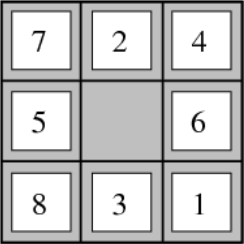
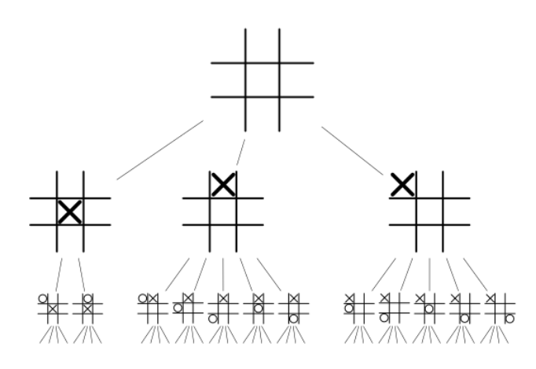
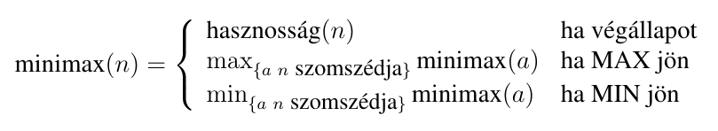
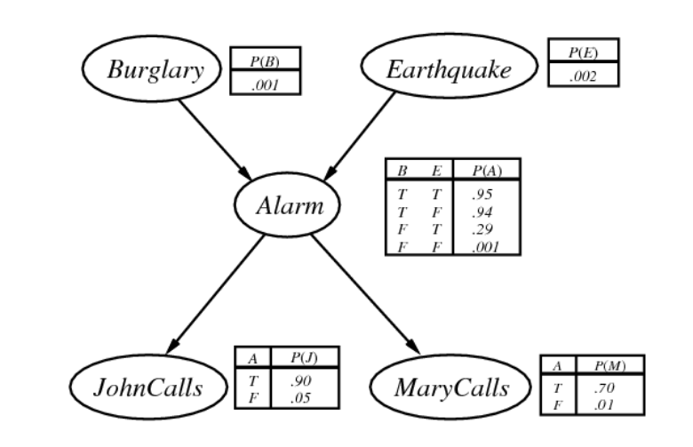

## Mesterséges Intelligencia 1.

### 1. Keresési feladat: feladatreprezentáció, vak keresés, informált keresés, heurisztikák. Kétszemélyes zéró összegű játékok: minimax, alfa-béta eljárás. Korlátozás kielégítési feladat.

#### Keresési feladat

A feladatkörnyezetről feltételezzük, hogy *diszkrét*, *statikus*, *determinisztikus*, és *teljesen megfigyelhető*.

##### Feladatreprezentáció

Következőekkel modellezzük a feladatot:

- **Lehetséges állapotok*** halmaza

- Egy **kezdőállapot**

- **Lehetséges cselekvések*** halmaza

- Egy **állapotátmenet függvény**: Minden állapothoz rendel egy **(cselekvés, állapot)** típusó, rendezett párokból álló halmazt.

- Állapotátmenet **költségvüggvénye**, amely minden lehetséges állapot-cselekvés-állapot hármashoz egy $c(x, a, y)$ valós nemnegatív költségértéket rendel

- **Célállapotok** halmaza

Ez egy gúlyozott gráfot definiál, amiben a **csúcsok az állapotok**, **élek a cselekvések**, **súlyok a költségek**.

Ez a gráf az **állapottér**

**Út**: Állapotok cselekvésekkel összekötött sorozata.

##### Vak (informálatlan) keresés

**Cél**: Adott kezdőállapotból megtalálni egy minimális költségű utat egy célállapotba.

> Ez azért nem egy triviális, legrövidebb út keresési feladat, mert az állapottér nem mindig adott teljes egészében, mert nem mindig véges.

**Megvalósítás**: **Keresőfával**, azaz a kezdőállapotból növesztünk egy fát a szomszédos állapotok hozzávételével amíg célállapotot nem találunk.

> Keresőfe nem azonos az állapottérrel! Hiszen az állapottér nem is feltétle fa.

Keresőfa egy csúcsában tárolt információ:

- Szülő

- Állapot

- Cselekvés, ami a szülőből ide vezetett

- Útköltség a kezdőállapottól eddig

- Mélység (kezdőállapoté nulla)

###### Általános, absztrakt eljárás

```
fakereses() {
    perem = { újcsúcs(kezdőállapot) }
    while perem.nemüres() {
        csúcs = perem.elsőkivesz()
        if csúcs.célállapot() {
            return csúcs
        }
        perem.beszúr(csúcs.kiterjeszt())
    }
    throw Error
}
```

> Ha olyan csúcsot szúrunk be, aminek állapota már szerepel a `perem`-ben, akkor a nagyobb költségűt felesleges benne hagyni.

- `csúcs.kiterjeszt()`: Létrehozza a csúcsból elérhető összes állapothoz tartozó keresőfa csúcsot, a mezőket megfelelően inicializálja.

- `perem`: Egy prioritási sor.

- `perem.elsökivesz()`: Ez definiálja a bejárás stratégiáját. (Lényegében a prioritási sorban a kulcsok rendezésének módja.)

###### Szélességi keresés

**FIFO** perem.

- Teljes, minden véges számú állapot érintésével elérhető állapotot véges időben elér.

- Általában nem optimális, de akkor pl. igen, ha a költség a mélység nem csökkenő függvénye.

- Időigény = Tárigény = $O(b ^{d + 1} )$
  
  > Exponenciális komplexitás miatt nem skálázódik nagy $d$-kre.

> $b$: szomszédok maximális száma.
> 
> $d$: legkisebb mélységű célállapot mélysége a keresőfában.

###### Mélységi keresés

**LIFO** perem.

- Teljes, ha a keresési fa véges mérezű. Egyébként nem.

- Nem optimális.

- Időigény: $O(b^m)$, Tárigény: $O(bm)$
  
  > Az időigény nagyon rossz, tárigény jó, mert nem exponenciális.

> $m$: keresőfa maximális mélysége.

###### Iteratívan mélyülő keresés

**Mélységi keresések** sorozata 1, 2, 3 srb. **mélységekre korlátozva**, amíg célállapotot nem találunk.

- Teljesség és optimalitás a szélességi kereséssel egyezik meg.

- Időigény: $O(b^d)$
  
  > Általában jobb, mint a szélességi

- Tárigény: $O(bd)$
  
  > Jobb, mint a mélységi

Meglepő, de igaz, hogy annak ellenére, hogy az első szinteket újra, meg újra bejárjuk, javítunk.

Ez a **legjobb informálatlan kereső**.

###### Egyenletes költségű keresés

Költség alapján rendezi a permet, először a legkisebb útiköltségű csúcsot fejtjük ki.

###### Gráflekeresés

Ha nem fa az állapottér.

Ha a kezdőállapotból több út is vezet egy állapotba, akkor a fakeresés végtelen ciklusba eshet, de legalábbis a hatékonysága drasztikusan csökken.

**Cél**: Ugyan azon állapotba vezető útak redundáns tárolásának elkerülése.

**Zárt halmaz**: Ebbe **tároljuk** a peremből **már egyszer kivett** csúcsokat.

```
gráfkereses() {
    perem = { újcsúcs(kezdőállapot) }
    zárt = { }
    while perem.nemüres() {
        csúcs = perem.elsőkivesz()
        if csúcs.célállapot() {
            return csúcs
        }
        zárt.hozzáad(csúcs)
        perem.beszúr(csúcs.kiterjeszt() - zárt)
    }
    throw Error
}
```

Mi van, ha egy zárt halmazban levő csúcshoz **találnánk jobb megoldást**?

- Egyenletes költségű kereséskor nincs ilyen eset, mert az úgy pont Djikstra algoritmusa az állapottérre.

- Mélységi keresésnél előfordulhat ilyen, ekkor át kell linkelni a zárt halmazban tárolt csúcsot a jobb út felé. 
  
  > Ez csak annyi, hogy frissítjük a szülőt, mélységet, költséget, és cselekvést?

##### Informált keresés

Az eddigi algoritmusok nem fogtak semmit arról, hogy merre haladnak tovább.

Heurisztika: Minden állapotból megbeszülni, hogy mekkora az optimális út költsége az adott állapotból egy célállapotba. Ez alapján tudjuk kiválasztani, merre érdemes haladni.

> Például útvonal-tervezési probléma esetén jó heurisztika lehet a légvonal-beli távolság.

$h(n)$: **Optimális** költség **közelítése** $n$ **állapotból** a legközelebbi **célállapotba**.

$g(n)$: **Tényleges** költség a **kezdőállapozból** $n$-be.

###### Mohó legjobb-először

A peremben rendezést $h$ alapján végezzük, a legkisebb értékű csúcsot vesszük ki.

$h(n) = 0$, ha $n$ célállapot feltételezése mellett:

- Teljes, ha a keresési fa véges mélységű

- Nem optimális

- Időigény = Tárigény = $O(b^m)$

> Jó $h$-val javítható ez a komplexitás

###### $A^*$

A peremben a rendezést $f() = h() + g()$ alapján végezzük, a legkisebb értékűt vesszük ki.

> A teljes út költségét becsüli.

**Teljesség és optimalitás**

$h$ **elfogadható** (megengedhető): Ha nem ad nagyobb értéket, mint a tényleges optimális érték, azaz **nem becsül túl**.

Fakeresés esetén ha $h$ elfogadható, és a keresési fa véges, akkor az $A^*$ optimális.

$h$ **konzisztens** (monoton): Ha $h(n) \le c(n, a, n') + h(n~)$ minden $n$-re, és $n$ minden $n'$ szomszédjára.

Gráfkeresés esetén ha $h$ konzisztens, és az állapottér véges, akkot az $A^*$ optimális.

**Hatákonyság**

Az $A^*$ optimálisan hatékony, hiszen csak azokat a csúcsokat terjeszti ki, amelyekre $f() < C^*$ ($C^*$ az optimális költség).

> Bár ezeket minden optimális algoritmusnak ki kell terjeszteni.

A tárigény általában exponenciális, de nagyon függ $h$-tól (ha $h = h^*$, akkor konstans).

Időigény szintén erősen függ $h$-tól.

###### Egyszerűsített memóriakorlátozott $A^*$

Próbáljuk meg az összes rendelkezésre álló memóriát használni, és kezeljük le, ha elfogy.

Futtassuk az $A^*$-ot amíg van memória, ha elfogyott:

- Töröljük a legrosszabb levelet a keresőfában, egyezés esetén a régebbit.

- A törölt csúcs szülőjében jegyezzük meg az innen elérhető ismert legjobb költséget (így később vissza lehet ide térni, ha minden többi útról kiderülne, hogy rosszabb)

Teljes, ha a legkisebb mélységű célállapot mélységényi csúcs belefér a memóriába egyszerre. (Tehát az oda vezető egész út.)

Hasonló költségű utak esetén előfordulhat, hogy ugrál a két út közt, így lassan talál megoldást.

###### Relaxáció

Feltételek elhagyása.

Például a 8-kirakós játék esetén


- $h_1$: Rossz helyen lévő számok, ábrán 8
  
  - Relaxáció: Minden szám egyből a helyére rakható

- $h_2$: Manhattan távolság számonként, ábrán 18
  
  - Relaxáció: Minden szám tolható a szomszédba, akkor is ha van ott másik szám

- $h_{opt}$: Optimális költségek, ábrán 26

Észervétel: $\forall n : h_1(n) \le h_2(n)$, azaz $h_2$ **dominálja** $h_1$-et.

A relaxált probléma optimális költsége $\le$ az eredeti probléma optimális költségénél, mivel az eredeti probléma állapottere része a relaxáltnak (mivel pl az hogy akkor is léphetünk szomszédba, ha foglalt, növeli az állapotteret). Tehát **elfogadható heurisztikát kapunk**.

> Konzisztens is

###### Relaxálás automatizálása

Ha formális kifejezés adja meg a lehetséges lépéseket a probléma lehetséges állapotairól, akkor automatikusan elhagyhatunk feltételeket, pl. 8-kirakó esetében formálisan:

1. Egy számot csak szomszédos pozícióra lehet mozgatni, és

2. Egy számot csak üres pozícióba lehet mozgatni

Ha elhagyjuk mindkét szabályt, akkor $h_1$-et kapjuk.

Ha csak a 2-es szabályt hagyjuk el, kkor pedig $h_2$-t.

###### Több heurisztika kombinálása

$h(n) = max(h_1(n), ..., h_k(n))$

Ha igaz, hogy minden $i$-re $h_i$ konzisztens, akkor $h$ is konzisztens.

#### Kétszemélyes zéró összegű játékok

##### Kétszemélyes, lépésváltásos, determinisztikus, zéró-összegű játék

- Lehetséges állapotok halmaza
  
  - Legális játékállások

- Egy kezdőállapot

- Lehetséges cselekvések halmaza

- Állapotátmenet függvény

- Célállapotok

- Hasznosségfüggvény: Célállapozhoz hasznosságot rendel

Ez a **játékgráf** (jellemzően nem fa)

Két **ágens** van, felváltva lépnek.

- **MAX játékos**: Maximalizálni akarja a hasznosság függvényt.

- **MIN játékos**: Minimalizálni akarja a hasznosság függvényt.

> Konvenció: MAX kezd

Első célállapot elérésekor a játéknak vége.

Zéró összegű játék: Modellünkben MIN minimalizálja a hasznosságot, lényegében maximalizálja a negatív hasznosságot. Így lényegében a MIN játékis hasznosságfüggvénye a MAX játékosénak -1-szerese, innen az elnevezés, mert a kettő összege nulla.

Példa az amőba játék játékgráfjára



##### Minimax algoritmus

Tökéletesen racionális hipotézis: Tfh. mindkét játékos a teljes játékgráfot ismeri, tetszőlegesen komplex számításokat tud elvégezni, és nem hibázik.

Stratégia: Minden állapotra meghatározza, hogy melyik lépést kell választani.

Minmax a következőeket számolja minden $n$ csúcsra:



```c
maxErtek(n) {
    if végállapot(n) return hasznosság(n)
    max = -végtelen
    for a in n szomszédai {
        max = max(max, minÉrték(a)) // Itt a MIN játékos lép!
    }
    return max
}
```

```c
minErtek(n) {
    if végállapot(n) return hasznosság(n)
    min = végtelen
    for a in n szomszédai {
        min = min(min, maxÉrték(a)) // Itt a MAX játékos lép!
    }
    return min
}
```

 Az eljárás `maxErtek(kezdőállapot)` hívással indul, hiszen a MAX játékos kezd.

Ha van a játékgráfban köt, akkor nem terminál. Ez a gyakorlatban azért nem probléma, mert csak adott mélységig futtatjuk.

> Sok játék esetén a szabályok kizárják a végtelenségig futó köröket.

A minmax érték az optimális hasznosság, amit az adott állapotból el lehet érni, ha az ellenfél tökéletesen racionális.

##### Alfa-béta vágás

Ha tudjuk, hogy MAX egy adott csúcs rekurzív kiértékelése közben talált olyan stratégiát, amellyel ki tud kényszeríteni pl. 10 értékű hasznosságot az adott csúcsban, akkot a csúcs további kiértékelése közben nem kell vizsgálni olyan állapotokat, amelyekben MIN ki tud kényszerítani $\le$ 10 hasznosságot, hiszen tudjuk, hogy MAX sosem fogja ide engedni a játékot.

Új paraméterek:

- **Alfa**: **MAX-nak** már felfedeztünk egy olyan stratégiát, amely **alfa** hasznosságot biztosít egy olyan állapotból indulva, ami a keresőfában az $n$ állapotból a gyökér felé vezetű úton van.

- **Béta**: **MIN-nek** már felfedeztünk egy olyan stratégiát, amely **béta** hasznosságot biztosít egy olyan állapotból indulva, ami a keresőfában az n állapotból a gyökér felé vezetű úton van.

Számítás a `maxÉrték(kezdőállapot, -végtelen, végtelen)` hívással indul.

```
maxErtek(n, alfa, beta) {
    if végállapot(n) return hasznosság(n)
    max = -végtelen
    for a in n szomszédai {
        max = max(max, minÉrték(a, alfa, beta)) // Itt a MIN játékos lép!
        if max >= beta return max // Vágás!
        alfa = max(max, alfa)
    }
    return max
}
```

```
mixErtek(n, alfa, beta) {
    if végállapot(n) return hasznosság(n)
    min = végtelen
    for a in n szomszédai {
        min = min(min, maxÉrték(a, alfa, beta)) // Itt a MIN játékos lép!
        if alfa >= min return min // Vágás!
        beta = min(min, beta)
    }
    return min
}
```

Ha mindig a legjobb lépést vesszük, akkor $O(b^{m / 2})$, amúgy $O(b^m)$.

> Gyakorlatban használhatunk rendezési heurisztikákat, amik sokszor közel kerülnek az optimális esethez. 

#### Korlátozás kielégítési feladat

**Lehetséges állapotok halmaza**: $\mathcal{D} = \mathcal{D}_1 \times ... \times \mathcal{D}_n$, ahol $\mathcal{D}_i$ az $i$. változó lehetséges értékei, azaz a feladat állapotai az $n$ db változó lehetséges értékkombinációi.

**Célállapotok**: A megengedett állapotok, amelyek definíciója a következő: Adottak $C_1, ..., C_m$ korlátozások, $C_i \subseteq \mathcal{D}$. A megengedett vagy konzisztens állapotok halmaza a $C_1 \cap ... \cap C_m$. (Ezek minden korlátozást kielégítenek)

> Gyakran egy $C_i$ korlátozás egy változóra vagy változópárra fejez ki megszorítást

**Kényszergráf**: A feladatban szereplő változók és a korlátozások által definiált gráf. Ugye ez változó párokra értendő, de ha esetleg több változót érintenek a korlátozások, az is felírható olyan korlátokkal, amik kettőt érintenek.

##### Inkrementális kereső algoritmusok

A probléma éllapottárbeli keresésként értelmezve:

- Minden változóhoz felveszünk egy új "ismeretlen" értéket. Jelölje ezt "?". a kezdeti állapot: $(?, ..., ?)$.

- Az állapotátmenet függvény rendeljen hozzá minden állapothoz olyan állapotokat, amelyekben egyel kevesebb ? van, és amelyek megengedettek.

- A költség minden állapotátmenetre legyen konstans.

> Mélységi keresés jó választás lehet, mert a keresőfa mélysége kicsi.

Informált kereséssel: próbáljunk nehezen kielégíthatő változókat kifejteni előbb:

- Amelyikhez a legkevesebb megengedett lépés maradt

- Amelyre a legtöbb korlátozás vonatkozik

A választott változó megengedett lépéseiből kezdjük azzal, amelyik a legkevésbé korlátozza a következő lehetséges lépések számát.

##### Optimalizáló algoritmusok, lokális keresők

Egy másik lehetséges megközelítés **optimalizálási problémát definiálni**:

- A **célfüggvényt** definiáljuk pl. úgy, hogy legyen a megsértett korlátozások száma. Ha eleve tartozott célfüggvény a feladathoz, össze kell kombonálni vele.

- Az **operátorokat** definiálhatjuk sokféleképpen, pl. valamely változó értékének megváltoztatásaként.

### 2. Teljes együttes eloszlás tömör reprezentációja, Bayes hálók. Gépi tanulás: felügyelt tanulás problémája, döntési fák, naiv Bayes módszer, modellillesztés, mesterséges neuronhálók, k-legközelebbi szomszéd módszere.

#### * Alapfogalmak

##### Véletlen változók

Van **neve**, és **lehetséges értékei**, azaz **domainje**.

**Elemi kijelentés**: $A$ értékének egy korlátozását fejezik ki (pl. $A = d$, ahol $d \in D_A$)

> Itt $A$ egy véletlen változó, $D_A$ domainnel.

**Véletlen változók típusai**:

- **Logikai**: A domain ekkor $\{ ~ igaz, hamis ~ \}$.
  
  - Pl. "Fogfájás=igaz", vagy csak simán "fogfájás" (és negáltja $\neg$fogfájás) egy elemi kijelentés.

- **Diszkrét**: Megszámlálható domain, pl. idő, ahol a domain $\{ ~ nap, esö, felhö, hó ~ \}$.
  
  - Pl. "Idő=nap", vagy csak simán "nap".

- **Folytonos**: Pl.: $X$ véletlen változó, $D \subseteq \mathbb{R}$
  
  - Pl. $X \le 3.2$ Egy elemi kijelentés

**Komplex kijelentések**: Elemi kijelentésekből képezzük a szokásos logikai operátorokkal.

**Elemi esemény**: Minden véletlen változóhoz értéket rendel: Ha $A_1, ..., A_n$ véletlen változókat definiálunk a $D_1, ..., D_n$ domainekkel, akkor az elemi események halmaza a $D_1 \times ... \times D_n$ halmaz.

**Valószínűség**: Egy függvény, amely egy kijelentéshez egy valós számot rendel.

> Véletlen változók: nagy betűk
> Kijelentések, és a változók értékei: kis betűk

$P(a)$ az $a$ kijelentés valószínűsége.

$P(A)$: $A$ tetszőleges értékére érvényes az adott állítás / képlet.

A $P$ függvény a **valószínűségi eloszlás**, amely minden lehetséges kijelentéshez valószínűséget rendel.

$P(A, B) = P(A \land B)$

###### Feltételes valószínűség

$P(a | b) = P(a \land b) / P(b)$ (feltéve, hogy $P(b) > 0$)

> **Jelentése**: *Az $a$ kijelentés **feltételes valószívűsége**, feltéve, hogy az összes tudásunk $b$ ($b$ is egy kijelentés)*

**Szorzatszabály**: $P(a \land b) = P(a | b)P(b) = P(b | a)P(a)$

##### Teljes együttes eloszlás

Az **összes elemi esemény valószínűségét** megadja.

Ebből kiszámolható **bármely kijelentés valószínűsége**.

Továbbiakhoz feltesszük, hogy az **összes változó diszkrét**.

###### Példa

Legyenek a véletlen változók `Luk`, `Fogfájás`, `Beakad`, mind logikai típusú. Ekkor a teljes együttes eloszlást egy táblázat tartalmazza:

| `Luk` | `Fogfájás` | `Beakad` | $P()$ |
|:-----:|:----------:|:--------:|:-----:|
| nem   | nem        | nem      | 0.576 |
| nem   | nem        | igen     | 0.144 |
| nem   | igen       | nem      | 0.064 |
| nem   | igen       | igen     | 0.016 |
| igen  | nem        | nem      | 0.008 |
| igen  | nem        | igen     | 0.072 |
| igen  | igen       | nem      | 0.012 |
| igen  | igen       | igen     | 0.108 |

#### * Függetlenség

Az $a$ és $b$ kijelentések függetlenek akkor, és csak akkor, ha $P(a \land b) = P(a) P(b)$.

Az $A$ és $B$ véletlen változók függetlenek akkor, és csak akkor, ha $P(A, B) = P(A)P(B)$, vagy ekvivalensen $P(A|B) = P(A)$, illetve $P(B|A) = P(B)$

Azaz két változó független, ha az egyik sem tartalmaz információt a másikról.

#### * Feltételes függetlenség

Az $a$ és $b$ **kijelentések** feltételesen függetlenek $c$ feltételével akkor, és csak akkor, ha $P(a \land b | c) = P(a | b)P(b|c)$. Ekkor $a$ és $b$ nem feltétlenül független abszolút értelemben.

Tipikus eset, ha $a$ és $b$ közös **oka** $c$.

$A$ és $B$ **véletlen változók** feltételesen függetlenek $C$ feltevésével akkor, és csak akkor, ha $P(A, B | C) = P(A | C) P(B|C)$, vagy ekvivalensen $P(A | B, C) = P(A | C)$, illetve $P(B | A, C) = P(B|C)$.

Egy lehetséges elérhető tömörítés:

$P(A, B, C) = P(A, B |C)P(C) = P(A|C)P(B|C)P(C)$

> Első egyenlőség: **Szorzatszabály**
> 
> Második egyenlőség: Feltételes függetlenség **feltevése**

> $P(A|C), P(B|C), P(C)$ táblázatok méreteinek összege sokkal kisebb lehet, mint az eredeti $P(A, B, C)$

Ha $A$ feltevése mellett $B_1, ..., B_n$ kölcsönösen függetlenek, azaz

$$
P(B_1, ..., B_n | A) = \prod_{i=1}^n P(B_i | A)
$$

Ez a naiv Bayes modell alakja. Itt $O(n)$ tömörítés érhető el, hiszen

$$
P(B_1, ..., B_n | A) = P(A) \prod_{i=1}^n P(B_i | A)
$$


#### Teljes együttes eloszlás tömör reprezentációja

> Feltételes függetlenséggel tudjuk tömöríteni a teljes együttes eloszlás reprezentációját

##### Láncszabály

Legyen $X_1, ..., X_n$ a féletlen változók egy tetszőleges felsorolása, ekkor a láncszabály:

$$
P(X_1, ..., X_n) = P(X_1 | X_2, ..., X_n) P(X_2, ..., X_n) = \\
P(X_1 | X_2, ..., X_n) P(X_2 | X_3, ..., X_n) P(X_3 | X_4, ..., X_n) ... P(X_n) = \\
\prod_{i = 1}^n P(X_i | X_{i + )}, ..., X_n)
$$

Minden $P(X_i | X_{i + }, ..., X_n)$ tényezőre az $\{ ~ X_{i + 1}, ..., X_n ~ \}$ változókból vegyünk egy $Szülök(X_i)$ részhalmazt, melyre igaz, hogy $P(X_i | X_{i + 1}, ...X_n) = P(X_i | Szülök(X_i))$, és a $Szülök(X_i)$ halmaz minimális, azaz belőle több elem nem hagyható el, különben a fenti tulajdonság sérül.

Ez a tömörítési lépés, és annál jobb, minél kisebb a $Szülök(X_i)$ halmaz.

Ekkor persze:

$$
P(X_1, ..., X_n) = \prod_{i = 1}^n P(X_i | Szülök(X_i))
$$

Ez a teljes együttes eloszlás tömörített reprezentációja.

#### Bayes-hálók

**Teljes együttes eloszlás tömörítése** alapján egy **gráfot definiál**, ami egy tömör, és intuitív reprezentációt tesz lehetővé.

A teljes együttes eloszlás tömörítésekor bevezetett $Szülök(X_i)$ jelölés már a gráf struktúrára utal, amelyben a csúcsok az $X_i$ véletlen változók, és az $(Y, X_i)$ irányított él akkor és csak akkor van behúzva, ha $Y \in Szülök(X_i)$. A gráfban minden $X_i$ változóhoz tartozik egy $P(X_i | Szülök(X_i))$ eloszlás.

Ez egy irányított, körmentes gráfot alkot.

##### Példa



Egy konkrét lehetséges világ valószínűsége pl.:

$$
P(B \land \neg E \land A \land J \land \neg M) = \\
= P(B)P(\neg E)P(A | B, \neg E)P(J|A)P(\neg M | A) = \\
= 0.001 * (1 - 0.002) * 0.94 * 0.9 * (1 - 0.7)
$$

Ha egy Bayes-hálóban $X$-ből $Y$ csúcsba vezet él, akkor $Y$ és $X$ nem független.

DE nem igaz, hogy ha $X$ és $Y$ nem független, akkor van köztük él.

Egy eloszláshoz **sok különböző Bayes háló** adható.

##### Bayes-háló konstruálása

**Gyakorlatban** sokszor egy szakértő definiálja a változókat, és a hatásokat a változók között, és ennek a tudásnak a segítségével kitöltjük a változóhoz tartozó feltételes eloszlásokat. Ekkor adott az intuitív reprezentáció, ami definiál egy teljes együttes eloszlást, és ezt felhasználjuk valószínűségi következtetésekre.

**Elméleti** szempontból bármely adott együttes elosztásra konstruálható Bayes háló a láncszabállyal.

FONTOS! A láncszabály alkalmazásakor használt, rögzített változósorrendtől függ a Bayes háló.

##### Függetlenség, és Bayes hálók

Függetlenséggel kapcsolatos információk kiolvasása a hálóból.

Ha $Y$ nem leszármazottja $X$-nek, akkor: $P(X | Szülök(X), Y) = P(X | Szülök(X))$

Bármely $Y$ váltzóra igaz: $P(X | \text{Markov-takaró}(X), Y) = P(X | \text{Markov-takaró}(X))$

> **Markov-takaró(X)**: Az a halmaz, amely $X$ szülőinek, $X$ gyerekeinek, és $X$ gyerekei szülőinek az uniója.

##### Folytonos változók

##### Valószínűségi következtetés

> Többi alfejezet nem hiszem, hogy kell?
