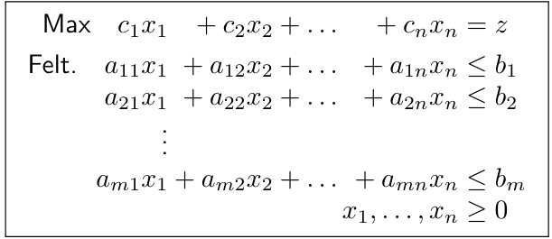
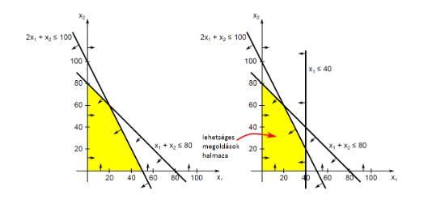
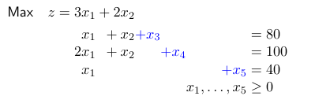
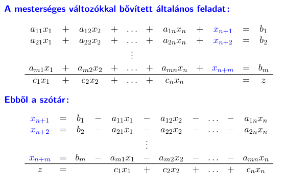
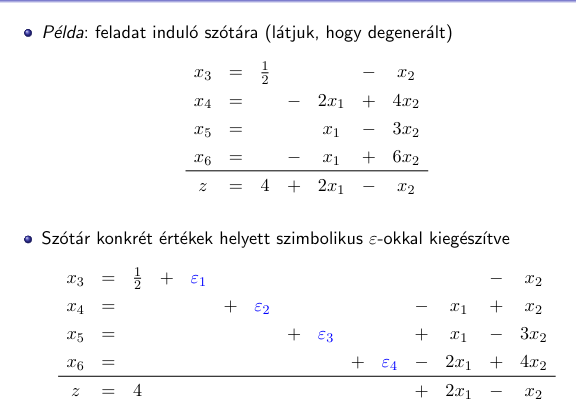
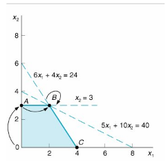
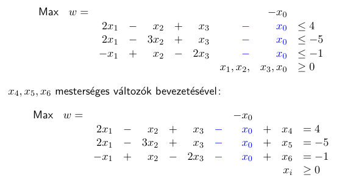
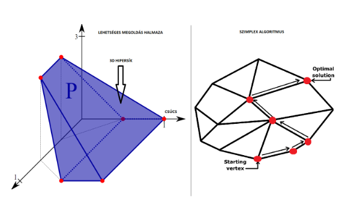

## Operációkutatás

### 1. LP alapfeladat, példa, szimplex algoritmus, az LP geometriája, generálóelem választási szabályok, kétfázisú szimplex módszer, speciális esetek (ciklizáció-degeneráció, nem korlátos feladat, nincs lehetséges megoldás)

#### Alapfogalmak

- **Döntési változók**: $x_1, x_2, ..., x_i, ...$

- **Változók értelmezési tartománya**: $x_1, x_2 \ge 0$

- **Cél**: min / max probléma

- **Célfüggvény** (max / min): $2x_1 + 5x_2$

- **Korlátozások** (egyenletek, egyenlőtlenségek): $3x_1 + 2x_2 \le 10$

#### LP alapfeladat

- **Lineáris programozási feladat**: Keressük meg adott lineáris $\mathbb{R}^n$ értelmezési tartományú függvény (célfüggvény) szélsőértékét (minimumát, vagy maximumát) értelmezési tartományának adott lineáris korlátokkal (feltételekkel) meghatározott részében.

- **Lehetséges megoldás**: Olyan $p = (p_1, ..., p_n) \in \mathbb{R}^n$ vektor, hogy $p_i$-t $x_i$-be helyettesítve ($\forall i = 1, ..., n$) kielégíti a feladat feltételrendszerét.

- **Lehetséges megoldási tartomány**: Az összes lehetséges megoldás (vektor) halmaza.

- **Optimális megoldás**: Olyan lehetséges megoldás, ahol a célfüggvény felveszi a minimumát / maximumát.

##### Általános alak tömören

$$
\sum_{j = 1}^n a_{ij}x_j \le b_i  ~ ~ ~ ~ ~ ~ i = 1, 2, ..., m\\
x_j \ge 0 ~ ~ ~ ~ ~ ~ j = 1, 2, ..., n \\
--------- \\
\max \sum_{j=1}^n c_i x_i = z
$$

> **Standard alakban** minden feltétel $\le$ maximalizálás esetén, $\ge$ minimalizálás esetén. Illetve minden változó nemnegatív.

#### Példa

Játékgyártó cék kétféle terméket gyárt:

- **Katonákat**
  
  - \$10 anyagköltség
  
  - \$14 munkadíj
  
  - 1 óra fafaragás
  
  - 2 óra lakkozás-festés
  
  - Eladási ár: \$27

- **Vonatokat**
  
  - \$9 anyagköltség
  
  - \$10 munkadíj
  
  - 1 óra fafaragás
  
  - 1 óra lakkozás-festés
  
  - Eladási ár: \$21

**Erőforrások**:

- Fafaragó műhely: 80 munkaóra

- Lakkozás-festés: 100 munkaóra

**Extra megkötés**: A cég legfeljebb 40 katonát akar gyártani.

##### LP feladat

$$
\max z = 3x_1 + 2x_2 \\
x_1 + x_2 \le 80 \\
2x_1 + x_2 \le 100 \\
x_1 \le 40 \\
x_1, x_2 \ge 0
$$

Lehetséges megoldás: $x = (20, 20)$

> Azaz 20 katona, 20 vonat

Optimális megoldás: $x^* = (20. 60)$

Optimum értéke: $z^* = 180$ (Célfüggvénybe helyettesítve: $3 * 20 + 2 * 60$)

> Azaz \$180 profiot érhet el a cég

#### Egy lineáris program felírása

1. Válasszuk meg a **döntési változókat**

2. Határozzuk meg a **célt**, és a **célfüggvényt** (lineáris függvény)

3. Írjuk fel a **korlátozó feltételeket** (lineáris egyenlőtlenségek)

4. Határozzuk meg a **változók értelmezési tartományát** (előjel feltételek)

#### LP feladat megoldása

**Csúcs** (extremális) **pont**: Két egyenes metszéspontja, ha a korlátozó feltételek által meghatározott lehetséges megoldások halmazát az alábbi módon ábrázoljuk:

**Tétel**: Ha egy LP feladatnak van optimális megoldása, akkor olyan optimális megoldása is van, ami a lehetséges megoldási tartomány csúcspontja.

> **Ötlet**: Keressük meg a csúcspontokat, értékeljük ki az összes helyen, és vegyük a maximumot.
> 
> Ezzel az a probléma, hogy **sok ilyen csúcspont lehet**.

##### Mesterséges változók

Annak érdekében, hogy az egyenlőtlenségeket egyenlőségekre cserélhessük, mesterséges változókat adunk az egyenlőtlenséges bal oldalaihoz:

##### Szótár

Az az egyenl**et**rendszer, amiben a mesterséges változókat kifejeztük:

- **Bázisváltozók**: A szótár feltétel egyenleteinek bal oldalán álló változók

- **Nembázis változók**: A szótár feltételeinek jobb oldalán álló változók

- **Szótár bázismegoldása**: Olyan $x$ vektor, amelyben a nembázis változók értéke nulla, (ezért) a bázisváltozók értékei az őket tartalmazó egyenletek jobb oldali konstansai.

- **Lehetséges (feasible) bázismegoldás**: Olyan bázismegoldás, ami egyben lehetséges megoldás is, azaz a szótárra teljesül, hogy $b_i \ge 0$, $i = 1, 2, ..., m$ a bázismegoldásban.

#### Szimplex algoritmus

Adott **standard alakú LP feladat**, hozzá **szótár**.

T.h.f. $b_1 \ge 0, ..., b_m \ge 0$, azaz a szótár bázismegoldása lehetséges megoldás.

> Ez a feltétel nem része a szimplexnek, negatív jobb oldalú feltételekről később.

Az algoritmus **iteratív optimum keresés**.

Ismételt áttérés más szótárakra a következő feltételek mellett:

1. Minden iteráció szótára ekvivalens az előző iterációéval

2. Minden iteráció szótárának a bázismegoldásán a célfüggvény értéke nagyobb, vagy egyenlő, mint az előző iterációén

3. Minden iteráció bázismegoldása lehetséges megoldás

**Pivot lépés**: Új szótár megadása egy bázis és nembázis változó szerepének felcserélésével.

- **Belépőváltozó**: A szimplex algoritmus egy iterációjának belépőváltozója az a nembázis változó, ami a következő szótárra áttérés hatására bázisváltizóvá válik

- **Kilépőváltozó**: A szimplex algoritmus egy iterációjának kilépőváltozója az a bázisváltozó, ami a következő szótárra áttérés hatására nembázis változóvá válik

**Szótárak ekvivalenciája**: Két szótár ekvivalens, ha az általuk leírt egyenletrendszer összes lehetséges megoldásai és a hozzájuk tartozó célfüggvényértékek rendre megegyeznek

**Tétel**: A pivot lépés előtti és az utána előálló új szótár ekvivalensek.

- Egyenleteket átrendezni ekvivalens átalakítás

- Egy egyenlethez egy másik konstans-szorosát hozzáadni ekvivalens átalakítás

##### Hányadosteszt

Így döntjük el, hogy melyik egyenletből fejezzük ki a belépőváltozót.

A legszűkebb korlátot adó egyenletből fejezzük ki a belépő változót.

Azon előfordulások közül, ahol a belépő változó negatív előjelű együtthatóval szerepel, kiválasztjuk azt ahol a ($b_{i} / |a_{ij}|$) a legkisebb.

> Ami pozitív együtthetóval szerepel, az nem ad korlátot a változóra!

##### Optimális bázismegoldás

Honnan tudjuk, hogy az aktuális bázismegoldás optimális?

**Tétel**: Ha egy szótárban nincs pozitív $c_j = (j = 1, 2, ..., n+m)$ célfüggvény együttható és negatív $b_i (i = 1, 2, ... ,m)$ konstans a feltételes egyenleteiben, akkor a szótár bázismegoldása optimális megoldás.

##### Az algoritmus

**Input**: Egy lehetséges induló szótár

**Output**:

- $x^* = (x_1^*, ..., x_n^*)$ optimális bázismegoldás

> Azaz a szótár bázismegoldása lehetséges megoldás

- $z^*$ a célfüggvény optimuma

Lépések:

1. A szótárban $c_j \le 0$ minden $j = 1, 2, ... , n$-re?
   
   1. **Igen**: Az aktuális bázismegoldás **optimális**, az algoritmus megáll
   
   2. **Nem**: Folytatás 2. ponttal

2. Válasszunk a nembázis változók közül belépőváltozónak valamelyik $x_k$-t, amelyre $c_k > 0$ (pozitív célfüggvény együttható)

3. $-a_{ik} \ge 0$ minden $i = 1, 2, ..., m$-re?
   
   1. Igen: Az LP feladat nem korlátos, az algoritmus megáll
   
   2. Nem: Folytatás 4. ponttal

4. Legyen $l$ valamely index, amelyre $-a_{lk} < 0$ és $\left|\frac{b_l}{a_{lk}} \right|$ minimális
   
   > Ez a **hányadosteszt**

5. Hajtsunk végre egy pivot lépést úgy, hogy $x_k$ legyen a belépőváltozó, és az $l$. feltétel bázisváltozója legyen a kilépő

##### Generálóelem választási szabályok (Pivot szabályok)

Olyan szabály, ami egyértelművé teszi, hogy a szimplex algoritmusban mely változók legyenek a belépő-, és a kilépőváltozók, ha több változó is teljesíti az alapfeltételeket.

###### Klasszikus Szimplex algoritmus pivot szabálya

- Lehetséges belépő változók közül válasszuk a legnagyobb $c_k$ értékűt, több ilyen esetén azok közül a legkisebb indexűt

- Lehetséges kilépő változók közül (hányadosteszt!) válasszuk a legkisebb $l$ indexűt.

###### Bland szabály

- Lehetséges belépő véltozók közül **legkisebb indexűt**, ÉS

- Lehetséges kilépő változók közül **legkisebb indexűt** választjuk

**Tétel**: Ezzel a szabállyal az algoritmus véget ér, azaz a ciklizáció elkerülhető.

###### Lexikografikus szabály

Ciklizáció oka a degeneráció, azaz bázisváltozó 0 értékűvé válása a bázismegoldásban.

- **Adjunk** hozzá kezdő szótár minden feltételének jobb oldalához egy pozitív $\epsilon_i$ **konstanst**

- Minden feltételre legyenek ezek **különböző nagyságrendűek** a következőképpen: $0 < \epsilon_1 \ll \epsilon_2 \ll ... \ll \epsilon_m$

- Így a szimplex algoritmus során biztosan **nem ütik ki egymást**

- **Nem lesznek degenerált bázismegoldások**, így nincs ciklizáció

- Az utolsó, optimális szótárból elhagyjuk az $\epsilon$-okat

- Lehetséges belépőváltozók közül válasszuk a **legnagyobb** $c_k$ **értékűt**, több ilyen esetén azok közül a **legkisebb indexűt**

- Lehetséges kilépőváltozók közül válasszuk azt, amelynek $l$ indexű egyenletére az együtthatókból álló vektor **lexikografikusan a legkisebb**

**Tétel**: Ezzel a szabállyal az algoritmus véget ér, azaz a ciklizáció elkerülhető.

##### Speciális esetek

###### Nem korlátos LP feladat

Ha az LP feladat maximalizálandó (minimalizálandó), és célfüggvénye tetszőlegesen nagy (kicsi) értéket felvehet a lehetséges megoldások halmazán, akkor a feladatot nem korlátosnak nevezzük.

**Tétel**: Ha egy szótárban van olyan pozitív $c_j ( j = 1, 2, ..., n+m)$ célfüggvény együttható, hogy minden $-a_{ij} (i=1, 2, ..., m)$ együttható nemnegatív, akkor az LP feladat, amihez a szótár tartozik, nem korlátos.

###### Ciklizáció

**Degenerált iterációs lépés**: Olyan szimplex iteráció, amelyben nem változik a bázismegoldás.

**Degenerált bázismegoldás**: Olyan bázismegoldás, amelyben egy vagy több bázisváltozó értéke $0$.

**Ciklizáció**: Ha a szimplex algoritmus valamely iterációja után egy korábbi iteráció szótárát kapjuk meg, akkot azt ciklizációnak nevezzük.

**Tétel**: Ha a szimplex algoritmus nem áll meg, akkor ciklizál.

A ciklizáció **elkerülhető** megfelelő pivot szabály alkalmazásával.

Ciklizáció szemléletesen: **több** korlátozó feltételhez tartozó egyenes **megy át ugyan azon a ponton**:

#### Kétfázisú szimplex algoritmus

Ha egy **szótárban** minden $b_i \ge 0 (i = 1, 2, ..., m)$, akkor mehet a szimplex algoritmus.

Ellenkező esetben vezessünk be egy új mesterséges változót ($x_0$) és tekintsük a következő segédfeladatot:

Vegyük a legnegatívabb jobboldalú egyenletet (2-es), és fejezzük ki $x_0$-t ebből, a többiből a mesterséges változókat.

**Tétel**: A standard feladatnak akkor, és csak akkor létezik lehetséges megoldása, ha $w = 0$ a hozzá felírt segédfeladat optimuma.

Ha a segédfeladatot megoldjuk a szimplex algoritmussal és annak optimuma $w = 0$, akkor a megoldás legutolsó szótárából könnyen felírhatunk egy olyan szótárat, amely:

- Az eredeti feladat szótára

- Bázismegoldása lehetséges megoldás is egyben

A szótár felírásának lépései:

- Ha $x_0 = 0$ szerepel a feltételek között, akkor elhagyjuk

- Ha $x_0$ bázisváltozó, akkor az egyenleténak jobb oldalán levő nem $0$ együtthatójú változók valamelyikét belépőváltozónak, $x_0$-t kilépőváltozónak tekintve végrehajtunk egy pivot lépést

- Elhagyjuk $x_0$ megmaradt előfordulásait

- A célfüggvény egyenletét lecseréljük az eredeti célfüggvényre, amit átírunk az aktuális bázisváltozónak megfelelően

Az így megkapott lehetséges szótárból kiindulva indítjuk a szimplex algoritmust.

#### LP és konvex geometria

Az olyan fogalmaknak, mint bázismegoldás, lineáris feltétel, lehetséges megoldások halmaza, megfeleltethető egy-egy geometriai objektum.

$R^n$: $n$ dimenziós lineáris tér a valós számok felett, elemei az $n$ elemű valós vektorok.

$E^n$: $n$ dimenziós euklideszi tér, olyan lineáris tér, amelyben értelmezett egy belső szorzat, és egy távolság függvény a következő módon:

- $\langle x, y \rangle = x^T y =x_1y_1 + x_2y_2 + ... + x_ny_n$

- $||x|| = \sqrt{\langle x, y \rangle}$ norma

- $d(x, y) = ||x - y||_2 = \sqrt{(x_1 - y_1)^2 + (x_2 - y_2)^2 + ... + (x_n - y_n )^2}$

Korlátozások által kijelölt csúcsok a térben:

A **lineáris feltételek** zárt féltereket ($\le$) és síkokat ($=$) határoznak meg

A **lehetséges megoldások halmaza** ezen félterek és síkok metszete

**Poliéder**: Zárt, véges sok csúcsponttal rendelkező ponthalmaz

**A lehetséges megoldások halmaza egy konvex poliéder.**

Bázismegoldások = poliéder csúcsok.

**Ciklizáció**: az adott csúcsban ragadunk.

> Oka, hogy a csúcspont leírására használt síkokat cserélgetjük.

### 2. Primál-duál feladatpár, dualitási komplementaritási tételek, egész értékű feladatok és jellemzőik, a branch and bound módszer, a hátizsák feladat
