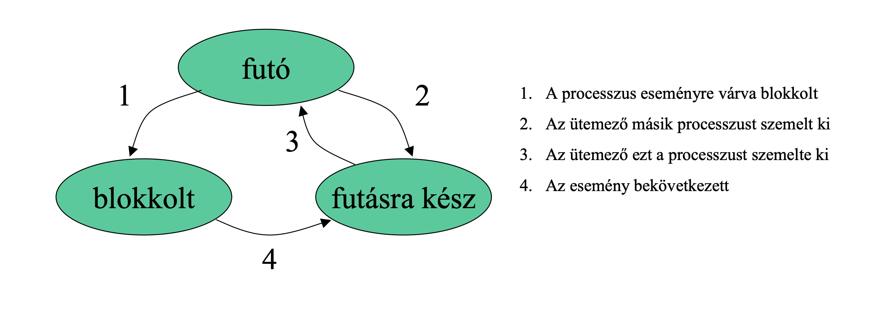

## Operációs rendszerek

### 1. Processzusok, szálak/fonalak, processzus létrehozása/befejezése, processzusok állapotai, processzus leírása. Ütemezési stratégiák és algoritmusok kötegelt, interaktív és valós idejű rendszereknél, ütemezési algoritmusok céljai. Kontextus-csere.

#### Alapfogalmak

- **Processzus**: Egy végrehajtás alatt álló program. Minden processzushoz tarozik egy saját címtartomány. Beleértve az utasításszámláló, a regiszterek és a változók aktuális értékét is.

- **Szálak (thread)**: Processzusok egymással összefüggő erőforrások egy csoportosítása. A processzus címtartománya tartalmazza a program kódját, adatait és más erőforrásait.

#### Processzusok létrehozása
Négy fő esemény, amely okozhatja egy processzus létrehozását:
- **A rendszer inicializálása**
    A felhasználóval tartják a kapcsolatot: előtérben futnak.
    Nincsenek bizonyos felhasználóhoz rendelve: háttérben futnak, démonok (daemon).
- **A processzus által meghívott processzust létrehozó rendszerhívás végrehajtása**
    Kooperatív folyamatok, egymással együttműködő de amúgy független processzzusok.
- **A felhasználó egy processzus létrehozását kéri**
    Interaktív rendszerekben
- **Kötegelt feladat kezdeményezése**
    Amennyiben rendelkezésra áll erőforrás.

#### Processzusok befejezése
Processzusok befejeződnek, rendszerint a következő körülmények között:
- **Szabályok kilépés** (önkéntes):
    A fordítóprogram végzett a feladatával, majd végrehajt egy rendszerhívást, amellyel közli az operációs rendszer felé, hogy elkészült (MINIX 3-ban az *`exit`* hívás), vagypédául képernyőorientált programok esetén (pl.: szövegszerkeztő) rendelkezik olyan billentyű kombinációval amellyel a felhasználó közölheti a processzussal, hogy mentse a munkafájlt és fejezze be a futását.
- **Kilépés hiba miatt** (önkéntes):
    Esetlegesen egy hibás programsor miatt. Példa egy illegális utasítás végrehajtása, nem létező memória címre hivatkozás, nullával való osztás.
- **Kilépés végzetes hiba miatt** (önkéntelen):
    Végzetes hiba lehet, ha a felhasználó a *`cc foo.cc`* parancsot kiadva szeretné fordítani a *`foo.cc`* programot, de nem létezik ilyen nevű fájlt. A fordítóprogram egyszerűen kilép.
- **Egy másik processzus megsemmisíti** (önkéntelen):
    Olyan rendszerhívás végrehajtása, amely közli az operációs rendszerrel, hogy semmisítsen meg egy másik processzust (MINIX 3-ban *`kill`* hívás). A megsemmisítőnek természetesen rendelkeznie kell a megfelelő jogosultságokkal.

#### Processzusok állapotai

- **Futó:** Végrehajtás alatt áll, a CPU-t használja.
- **Blokkolt:** Logikailag nem lehet folytatni. Bizonyos külső esemény bekövetkezéséig nem képes futni.
- **Futásra kész:** Elivileg készen áll, futásra képes. Ideiglenesen leállították, hogy egy másik processzus futhasson.

Minden processzus aktuális állapotáról információt kell tárolni, amelyet az operációs rendszer táblázatban tárol el.
- Utasításszámláló
- Veremmutató
- Lefoglalt memória
- Megnyitott fájlok állapota
- Egyéb

#### Processzus leírása

#### Kontextus-csere

#### Ütemezés

#### Ütmezés kötegelt rendszerekben
- **Sorrendi ütemezés:**
    Nem megszakítható, olyan sorrendben osztja a CPU-t, ahogy a processzusok azt kérik. Addig fut amíg nem blokkolódik. A sor elején lépő processzus kapja a CPU-t, amikor egy blokkolt újra futáskész a sor végére kerül. könnyen megérthető, pártatlan.
- **Legrövidebb feladatot először:**
    Nem megszakítható, feltételezi, hogy ismerjük a futásidőket. Akkor kell használni, ha több egyformán fontos fealdat van. Csak akkor optimális ha mindegyik feladat egyszerre rendelkezésre áll.
- **Legrövidebb maradék idejű következzen:**
    Megszakítható, mindig azt a processzust választja az ütemező, amelynek legkevesebb a befejeződésig még a hátralévő ideje, új processzus esetén ha kevesebb időt igényel az új processzus, akkor lecseréljük az új processzusra. Az új, rövid feladatok jó kiszolgálsban részesülnek.
- **Háromszintű ütemezés:**
    - Bebocsátó ütemezés:
        Megfelelő keveréketállít elő a CPU és I/O igényes processzusokból, a rövid feladatokat előbb beengedi, de a hosszabbaknak várakozniuk kell.
    - Memóriaütemező:
        Sok processzus esetén azok nem férnek el a memóriában, kikell őket tenni merevlemezre. Köröltekintőnek kell lennie.
        Döntési szempontok:
            - *Mennyi idő telt el a processzus lemezre vitele óta?*
            - *Mennyi CPU időt használt fel processzus nemrégiben?*
            - *Melyen nagy a processzus?*
            - *Mennyire fontos?*

#### Ütmezés interaktív rendszerekben
- **Round robin ütemezés:**
    Processzusoknak időintervallum van osztva amely alatt elngedélyezett a futásuk. Az időintervallum végén futó processzusok átadják a CPU-t és az idő előtt befejezett vagy blokkolt processzusok is. Listát vezet a futtatható processzusokról és az időszelet felhasználása után a lista végére kerül a processzus.
- **Prioritás ütemezés:**
    Minden processzushoz prioritást rendelünk, a legmagasabb prioritású, futáskész kapja meg a CPU-t.
- **Többszörös sorok:**
- **Garantált ütemezés:**
- **Sorsjáték ütemezés:**
- **Arányos ütemezés:**

#### Ütmezés valósidejű rendszerekben

#### Ütmezési algolimusok céljai

### 2. Processzusok kommunikációja, versenyhelyzetek, kölcsönös kizárás. Konkurens és kooperatív processzusok. Kritikus szekciók és megvalósítási módszereik: kölcsönös kizárás tevékeny várakozással (megszakítások tiltása, változók zárolása, szigorú váltogatás, Peterson megoldása, TSL utasítás). Altatás és ébresztés: termelő-fogyasztó probléma, szemaforok, mutex-ek, monitorok, Üzenet, adás, vétel. Írók és olvasók problémája. Sorompók.