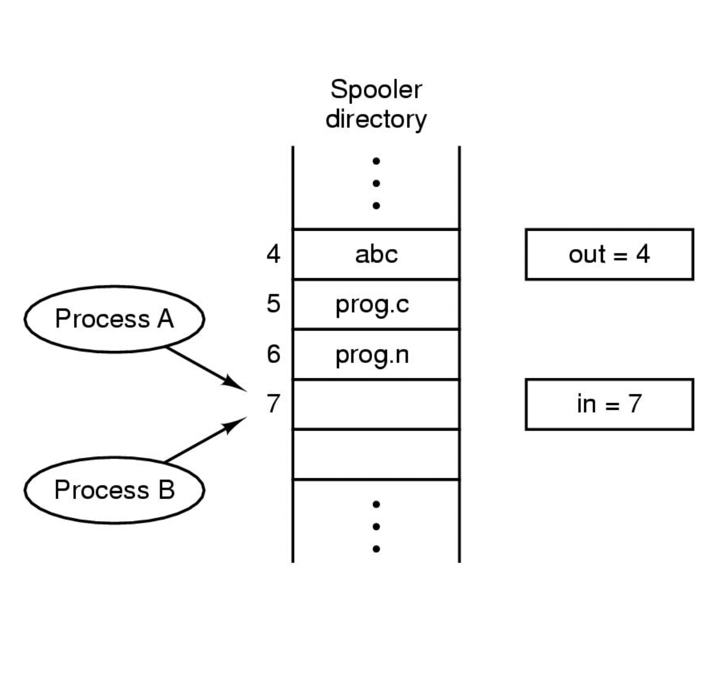
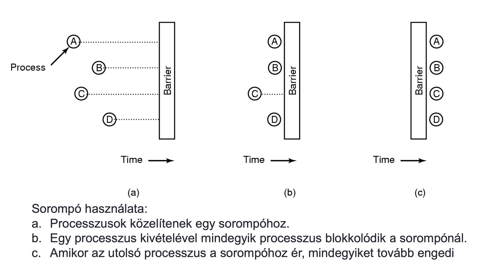

## Operációs rendszerek

### 1. Processzusok, szálak/fonalak, processzus létrehozása/befejezése, processzusok állapotai, processzus leírása. Ütemezési stratégiák és algoritmusok kötegelt, interaktív és valós idejű rendszereknél, ütemezési algoritmusok céljai. Kontextus-csere.

#### Alapfogalmak

- **Processzus**: Egy végrehajtás alatt álló program. Minden processzushoz tarozik egy saját címtartomány. Beleértve az utasításszámláló, a regiszterek és a változók aktuális értékét is.

- **Szálak (thread)**: Processzusok egymással összefüggő erőforrások egy csoportosítása. A processzus címtartománya tartalmazza a program kódját, adatait és más erőforrásait.

#### Processzusok létrehozása

Négy fő esemény, amely okozhatja egy processzus létrehozását:

- **A rendszer inicializálása**
  
  > A felhasználóval tartják a kapcsolatot: előtérben futnak.
  > Nincsenek bizonyos felhasználóhoz rendelve: háttérben futnak, démonok (daemon).

- **A processzus által meghívott processzust létrehozó rendszerhívás végrehajtása**
  
  > Kooperatív folyamatok, egymással együttműködő de amúgy független processzusok.

- **A felhasználó egy processzus létrehozását kéri**
  
  > Interaktív rendszerekben.

- **Kötegelt feladat kezdeményezése**
  
  > Amennyiben rendelkezésra áll erőforrás.

#### Processzusok befejezése

Processzusok befejeződnek, rendszerint a következő körülmények között:

- **Szabályos kilépés** (önkéntes)
  
  > A fordítóprogram végzett a feladatával, majd végrehajt egy rendszerhívást, amellyel közli az operációs rendszer felé, hogy elkészült (MINIX 3-ban az *`exit`* hívás), vagy például képernyőorientált programok esetén (pl.: szövegszerkeztő) rendelkezik olyan billentyű kombinációval amellyel a felhasználó közölheti a processzussal, hogy mentse a munkafájlt és fejezze be a futását.

- **Kilépés hiba miatt** (önkéntes)
  
  > Esetlegesen egy hibás programsor miatt. Példa egy illegális utasítás végrehajtása, nem létező memória címre hivatkozás, nullával való osztás.

- **Kilépés végzetes hiba miatt** (önkéntelen)
  
  > Végzetes hiba lehet, ha a felhasználó a *`cc foo.cc`* parancsot kiadva szeretné fordítani a *`foo.cc`* programot, de nem létezik ilyen nevű fájlt. A fordítóprogram egyszerűen kilép.

- **Egy másik processzus megsemmisíti** (önkéntelen)
  
  > Olyan rendszerhívás végrehajtása, amely közli az operációs rendszerrel, hogy semmisítsen meg egy másik processzust (MINIX 3-ban *`kill`* hívás). A megsemmisítőnek természetesen rendelkeznie kell a megfelelő jogosultságokkal.

#### Processzusok állapotai

- **Futó:** Végrehajtás alatt áll, a CPU-t használja.
- **Blokkolt:** Logikailag nem lehet folytatni. Bizonyos külső esemény bekövetkezéséig nem képes futni.
- **Futásra kész:** Elivileg készen áll, futásra képes. Ideiglenesen leállították, hogy egy másik processzus futhasson.

> Minden processzus aktuális állapotáról információt kell tárolni, amelyet az operációs rendszer táblázatban tárol el.

- Utasításszámláló
- Veremmutató
- Lefoglalt memória
- Megnyitott fájlok állapota
- Egyéb

#### Kontextus-csere

Több egyidejűleg létező processzus és egy CPU esetén a CPU váltakozva hajtja végre a processzusokat. A CPU átvált P1 processzusról a P2 processzusra, P1 állapotát a CPU regisztereiből el kell menteni az erre fenntartott memóriaterületre, P2 korábban elmentett állapotát helyre kell állítani a CPU regisztereiben.

#### Ütemezés

Amikor több processzus képes futni, viszont csak egy processzor áll rendelkezésre, akkor az operációs rendszernek el kell döntenie, hogy mely fusson először. Az operációs rendszer azon részét, amelyik ezt a döntést meghozza, `ütemezőnek` (scheduler) nevezzük, az erre a célra használt algoritmus pedig az `ütemezési algoritmus`.

#### Ütmezés kötegelt rendszerekben

Nincsenek felhasználók, emiatt nem megszakítható ütemezési algoritmusok, vagy minden processzus számára hosszú időintervallumokat engedélyező, megszakítható alkoritmusok használata gyakran elfogadható. Így csökken a processzusváltások száma és nő a teljesítmény.

- **Sorrendi ütemezés**
  
  > Nem megszakítható, olyan sorrendben osztja a CPU-t, ahogy a processzusok azt kérik. Addig fut amíg nem blokkolódik. A sor elején lépő processzus kapja a CPU-t, amikor egy blokkolt újra futáskész a sor végére kerül. könnyen megérthető, pártatlan.

- **Legrövidebb feladatot először**
  
  > Nem megszakítható, feltételezi, hogy ismerjük a futásidőket. Akkor kell használni, ha több egyformán fontos fealdat van. Csak akkor optimális ha mindegyik feladat egyszerre rendelkezésre áll.

- **Legrövidebb maradék idejű következzen**
  
  > Megszakítható, mindig azt a processzust választja az ütemező, amelynek legkevesebb a befejeződésig még a hátralévő ideje, új processzus esetén ha kevesebb időt igényel az új processzus, akkor lecseréljük az új processzusra. Az új, rövid feladatok jó kiszolgálásban részesülnek.

- **Háromszintű ütemezés:**
  
  > - **Bebocsátó ütemező:**
  >   
  >       Megfelelő keveréket állít elő a CPU és I/O igényes processzusokból, a rövid feladatokat előbb beengedi, de a hosszabbaknak várakozniuk kell.
  > 
  > - **Memóriaütemező:**
  >   
  >       Sok processzus esetén azok nem férnek el a memóriában, ki kell őket tenni merevlemezre. Körültekintőnek kell lennie.
  >       Döntési szempontok:
  >           - *Mennyi idő telt el a processzus lemezre vitele óta?*
  >           - *Mennyi CPU időt használt fel processzus nemrégiben?*
  >           - *Melyen nagy a processzus?*
  >           - *Mennyire fontos?*
  > 
  > - **CPU-ütemező:**
  >   
  >       Valójában kiválasztja, hogy a futásrakész processzusok közül melyik fusson következőnek.

#### Ütmezés interaktív rendszerekben

Az időnkénti megszakítás nélkülözhetetlen, nehogy valamely processzus kisajátítsa a CPU-t, ezzel megakadályozva a többit a futásban. Tehát megszakítások ütemezésre van szükség.

- **Round robin ütemezés**
  
  > Processzusoknak időintervallum van osztva amely alatt engedélyezett a futásuk. Az időintervallum végén futó processzusok átadják a CPU-t és az idő előtt befejezett vagy blokkolt processzusok is. Listát vezet a futtatható processzusokról és az időszelet felhasználása után a lista végére kerül a processzus.

- **Prioritás ütemezés**
  
  > Minden processzushoz prioritást rendelünk, a legmagasabb prioritású, futáskész kapja meg a CPU-t. Annak megekőzése érdekében, hogy a magas prioritásuak végtelen ideig fussanak, minden óraütemben csökkenti a futó processzus prioritását. Amikor a második legfontosabb lesz akkor kontextus csere. Maximális időszeletet rendelünk a processzusokhoz, és amikor lejár az idő, akkor a második processzus a prioritási sorban kapja a CPU-t.
  > 
  > - **Statikus:** Adott rendszerben adott felhasználókra automatikusan adott prioritású processzusok jönnek létre (Unix rendszerben a *`nice`* utasítással csökkenthetjük a prioritást)
  > - **Dinamikus:** Erősen I/O műveleteket végző processzusok esetén, azonnal meg kelllene kapniuk a CPU-t, lehetővé tenni számára a következő I/O művelet megkezdését, majd másik proszesszus fog futni.
  
  > Érdemes a processzusokat prioritási osztályokba sorolni, és osztályokon belül a Round robin ütemezést alkalmazni.

- **Többszörös sorok**
  
  > Lassú a kontextus csere végrehajtása. Prioritási osztályok felállítása, úgy hogy a legmagasabb osztályban egy időszeletig futnak, a következőben kettőig, a következő osztályban négy időszeletig és így tovább. Ha elhasználja az időszeletet akkor egy osztállyal lejjebb kerül, így egyre kevesebb gyakorisággal fog futni.

- **Legrövidebb processzus következzen**

Interaktív processzusok általában a következő sémát követik:

1. Várakozás utasításra

2. Utasítás végrehajtása

3. GOTO 1.
   
   > Kötegelt rendszerben ez minimális válaszidőt ad, viszont párhuzamos processzusoknál nehéz meghatározni, hogy melyik a legrövidebb. Becslés végrehajtása múltbéli viselkedés alapján. Becslés aktualizálása súlyozott átlag számolásával:
   > 
   > $$
   > 𝑎𝑇_0+(1−𝑎)𝑇_1
   > $$
   > 
   > Ahol *`T`* a becsült idő és az *`a`* megválasztásával megválaszthatjuk, hogy a processzus gyorsan elfelejtse-e a régi futásokat, vagy sokáig emlékezzen rájuk. Az a = 1/2 választással a következő egymás utáni becsléseket kapjuk:
   > 
   > $$
   > 𝑇_0, \space 𝑇_0/2+𝑇_1/2, \space 𝑇_0/4+𝑇_1/4+T_2/2, \space 𝑇_0/8+𝑇_1/8+T_2/8+T_3/2,
   > $$
   > 
   > Öregedéssel számolva: vesszük a mért érték és az előző becslés súlyozott átlagát.
- **Garantált ütemezés**
  
  > Ígéret tétele a felhasználónak a teljesítménnyel kapcsolatbanés ezt be is tartjuk. ( Példa: *n* felhasználó esetén a CPU *1/n*-ed részét kapod ). A betartáshoz nyomon kell követni hogy a CPU mennyi időt kapott a létrehozása óta, ezután kiszámítja mindegyikhez a neki járó mennyiséget.

- **Sorsjáték ütemezés**
  
  > Alapötlet, hogy minden processzusnak sorsjegyet adunk a különböző erőforrásokhoz, mintpédául CPU idő. A fontosabb processzusok többlet sorsjegyet kapnak, hogy növeljék a nyerési esélyeiket. Kooperatív processzusok átadhatják egymásnak a sorsjegyeket. Nagyon jó a válaszidő.

- **Arányos ütemezés**
  
  > Ebben a modellben minden felhasználó kap valamekkora hányadot a CPU-ból. Két felhasználó esetén ez 50%-50% attól függetlenül, hogy hány processzust futtatnak.

#### Ütmezés valósidejű rendszerekben

Nem mindig van szükség megszakításos ütemezésre, mivel a processzusok eleve nem futnak sokáig. Csak a szóban forgó alkalmazás érdekeit szem előtt tartó programok futnak.

Jellemzően egy vagy több külső fizikai eszköz ingert küld a számítógép felé, amire annak megfelelően reagálnia kell egy adott időn belül.

- **Szigorú valósidejű rendszerek:** Abszolút határidők vannak, kötelező betartani.
- **Toleráns valósidejű rendszerek:** Egy-egy határidő elmulasztása nem kívánatos, de azért tolerálható.

> A valós idejű viselkedés eléréséhez a programot több processzusra osztjuk, ezek viselkedése ismert/megjósolható, és rövid életűek. Az ütemező feladata, hogy a processzusokat úgy ütemezze, hogy a határidők be legyenek tartva.

Eseményeket két csoportba sorolhatjuk:

- **Periodikusak:** Rendszeres intervallumként fordulnak elő.
- **Aperiodikusak:** Megjósolhatatlan az előfordulásuk.

> A valós idejű ütemezési algoritmusok dinamikusak vagy statikusak lehetnek.

### 2. Processzusok kommunikációja, versenyhelyzetek, kölcsönös kizárás. Konkurens és kooperatív processzusok. Kritikus szekciók és megvalósítási módszereik: kölcsönös kizárás tevékeny várakozással (megszakítások tiltása, változók zárolása, szigorú váltogatás, Peterson megoldása, TSL utasítás). Altatás és ébresztés: termelő-fogyasztó probléma, szemaforok, mutex-ek, monitorok, Üzenet, adás, vétel. Írók és olvasók problémája. Sorompók.

#### Processzusok kommunikációja

A processzusoknak szükségük vannak a kommunikációra, és előnyös ha ez nem magszakításokkal történik. (InterProcess Communication [IPC])

#### Versenyhelyzetek

Kooperatív processzusok közös tárolóterületen dolgoznak, ahol mindegyik írhat és olvashat is.
Általános probléma a `háttérnyomtatás`, ahol egy kliens beteszi a nyomtatandó fájl nevét egy háttérkatalógusba majd a nyomtató démon folyamatosan ellenőrzi, hogy kell-e nyomtatni. Ha kell akkor kinyomtatja majd törli a nevét a katalógusból.

Két megosztott változó van, az *`in`* és az *`out`*. Az *`in`* a katalógus következő szabad helyére mutat és az *`out`* a következő nyomtatandó állományra.
Legroszabb esetben `A` olvassa az *`in`* értékét és eltárolja egy lokális változóban, majd egy kontextus csere történik. `B` eltárolja az állományt és az *`in`*-t frissíti az új értekkel majd `A` folytatja a futását és felülírja a korábbi rekesz tartalmát (kitörli a `B` által beírt állomány nevét) és frissíti az *`in`* értékét.

> Ez egy versenyhelyzet, mivel megosztott adatok esetén a végeredmény attól függ, hogy ki mikor fut.

#### Kritikus szekciók

Ahol a program versenyhelyzetbe kerül.
Cél a versenyhelyzet elkerülése, meg kell tiltani, hogy egy időben egynél több processzus hozzáférjen a megosztott adatokhoz.
Ha két processzus soha nincs egyszerre a kritikus szekciójában a versenyhelyzet elkerülhető.

> Szükséges feltételek a kooperatív processzusok megfelelő együttműködéséhez: 
> 
> 1. Ne legyen két processzus egyszerre a saját kritikus szekciójában
> 2. Semmilyen előfeltétel ne legyen a sebességekről vagy a CPU-k számáról
> 3. Egyetlen, a kritikus szekcióján kívül futó processzus sem blokkolhat más processzusokat
> 4. Egyetlen processzusnak se kelljen örökké várni arra, hogy belépjen a kritikus szekciójába

#### Kölcsönös kizárás

Egy módszer amely biztosítja, hogy ha egy processzus használ valamely megosztott változót vagy fájlt, akkor a többi processzus tartózkodjon ettől a tevékenységtől.

#### Kölcsönös kizárás tevékeny várakozással

- **Megszakítások tiltása** 
  Minden processzus letiltja az összes megszakítást a kritikus szekcióba lépés után, majd újra engedélyezi mielőtt elhagyja azt. Ha nem fordulhat elő óramegszakítás akkor a CPU nem fog másik processzura váltani.
  
  > Gyakran hasznos technika az operációs rendszeren belül de nem megfelelő a felhasználói processzusok számára mint általános kölcsönös kizárási mechanizmus.(Mivel mi van akkor, ha nem engedélyezi azokat újból, vagy több processzoros rendszernél csak az adott CPU-ravonatkozik a megszakítás tiltása)

- **Változók zárolása:**
  Egy szoftvermegoldás, megosztott változó, kezdeti értéke 0. Mielőtt egy processzus belépne a saját kritikus szekciójába először megvizsgálja ezt a változót, ha 0 akkor belép és 1-re állítja. Ha már 1 akkor a processzus addig vár, amíg az 0 nem lesz. Így a 0 azt jelenti, hogy egyetlen processzus sincs a saját kritikus szekciójában, az 1 meg hogy valamely processzus a saját kritikus szekciójában van.
  
  > Sajnos ez a módszer ugyan azt a végzetes hibát rejti magában mint a háttérnyomtatás. (Mi van ha az egyik processzus elolvassa a zárolásváltozót és épp akkor történik kontextus csere mielőt betudná állítani azt 1 értékre)

- **Szigorú váltogatás:**
  Folyamatosan tesztel, hogy lássa mikor léphet be a kritikus szekciójába.
  Azt amikor folyamatosan tesztelünk egy változót egy bizonyos érték megjelenéséig, `tevékeny várakozás`-nak nevezzük. Ez általában nem megfelelő megoldás mivel pazarolja a CPU-t.
  
  > Bár ez az algoritmus elkerül minden versenyt, mégsem tekinthető komoly jelöltnek a probléma megoldására mivel megsérti a 3.feltételt miszerint: A processzus blokkolja másik processzus kritikus szekcióba való lépését a kritikus szekción kívül.

- **Peterson megoldása:**
  Két C eljárás, kritikus szekcióba lépés előtt **`enter_region`** hívás, kritikus szekció elhagyása után **`leave_region`** hívása.
  
  > Ez egy udvarias megoldás mivel maga elé engedi a másik processzust.

- **TSL utasítás:**
  
  Hardveres segítséget igényel. Általában többprocesszoros gépeknél alkalmazandó. TSL RX,LOCK utasítás van. (Test and Set Lock)
  Beolvassa a LOCK memória szót az RX regiszterbe, nem nulla értéket ír a memória címre
  A memória elérés más CPU-knak tiltva van a művelet befejezéséig
  
  A TSL utasítás alkalmazásához egy **`LOCK`** megosztottváltozót használunk, ezzel összehangolva a megosztott memória elérést. Amikor a **`LOCK`** 0 akkor bármelyik processzus beállíthatja azt 1-re a TSL utasítás használatával és ezután írhatja, olvashatja a megosztott memóriát. Ha megtette a processzus visszaállítja a **`LOCK`** értékét 0-ra.
  
  > Párban kell használni az eljárásokat, mivel ha valaki csal, akkor a kölcsönös kizárás meghiúsul.

#### Altatás és ébresztés

Processzusok közötti kommunikációs primitív amelyek a CPU idő pazarlása helyett blokkolnak, amikor nem megengedett, hogy kritikus szekcióba lépjenek. **`sleep`** és **`wakeup`** pár.
A **`sleep`** egy rendszerhívás amely a hívót blokkolja (felfüggeszti) mindaddig amíg egy másik processzus fel nem ébreszti.
A **`wakeup`** hívásnak egy paramétere van, maga a processzus amit felkell ébreszteni.

#### Termelő-fogyasztó probléma

Termelő mely adatokat helyez el a tárolóban és a fogyasztó amely azokat kiveszi, szükség van egy **`count`** változóra amit a termelő megvizsgál, hogy maxmimális-e az értéke, (azaz a tároló tele van-e) ha igen akkor a termelő elalszik, ha nem akkor beletesz egy elemet a tárolóba és növeli a **`count`** értékét. A fogyasztó szintúgy ellenőrzi **`count`** értékét és ha 0 elalszik, ellenkező estben pedig kiveszi az elemet a tárolóból.
Probléma a még nem alvó processzusnak küldött ébresztőjel elveszik. Megoldás: ébresztőt váró bit hozzáadása.

#### Szemaforok

Egész változókban kell számolni az ébresztéseket a későbbi felhasználás érdekében. A szemafor értéke lehet 0 ha nincs elmentett ébresztésés lehet pozitív ha egy vagy több ébresztés függőben van. Ez a két művelet a **`down`** és az **`up`**.
A **`down`** művelet megvizsgálja hogy a szemafor értéke nagyobb-e mint 0. Ha igen csökkenti az értékét (azaz elhasznál egy ébresztést) és azonnal folytatja. Ha az értéke 0 akkor a processzust elaltatja mielőtt a **`down`** befejeződne.
az **`up`** rendszerhívás a megadott szemafor értékét növeli. Ha egy vagy több processzus aludna már ezen a szemaforon akkor egyet kiválasztva  a rendszer megengedi annak hogy befejezze a **`down`** műveletét.

#### Mutex-ek

A szemafor egy egyszerűsített változata. A mutexek csak bizonyos erőforrások vagy kódrészek kölcsönös kizárásának kezelésére alkalmasak.
Két állapota lehet: `zárolt` és `nem zárolt`.
Például ha egy processzus hozzá szeretne jutni a kritikus szekciójához akkor meghívja a `mutex_lock` eljárást. Ha a mutex nem zárolt akkor az eljárás sikeres és beléphet a kritikus szekcióba. Másik esetben pedig a hívó blokkolódik amíg a kritikus szekcióban lévő processzus nem hívja a `mutex_unlock` eljárást.

#### Monitorok /nem érthető/

Magasabb szintű szinkronizációs primitívek használatának javaslata amelyeket monitoroknak nevezték el.

- Eljárások, változók és adatszerkezetek együttese
- Speciális modulba/csomagba vannak összegyűjtve
- A processzusok bármikor hívhatják a monitorban lévő eljárásokat, nem érhetik el a belső adatszerkezeteit
- Objektumorientált nyelvekben is használt szabály
- Minden időpillanatban csak egy processzus lehet aktív egy monitorban
- Könnyű módszer a kölcsönös kizárás eléréséhez
- Nem elegendő, szükség van olyan módszerre, amellyel egy processzust blokkolhatunk, ha nem tud tovább haladni
- Megoldás állapot változók bevezetése (nem számlálók)

Szükség van egy szabályra, hogy mi történjen a **`signal`** után?

> Az újonnan felébresztett processzust hagyjuk futni, de a másikat felfüggesztjük

#### Üzenet

Két primitívet használ, hasonlítanak a szemaforokra, de nem monitorok
**`send(cél)`** és **`receive(forrás)`** (rendszerhívások)

**Tervezési kérdések az üzenetküldési rendszereknél:**

> Hálózatba kötött gépeken futó processzusok kommunikációja
> Az üzenet elveszhet a hálózaton

> A küldő és fogadó ugyanazon a gépen található
> Lassabb, mint a többi eddigi eszköz

Levelesláda adatszerkezet

> Adott számú üzenet tárolására alkalmas
> Ha tele van a levelesláda küldő felfüggesztődik

Ideiglenes tárolás elhagyása

> Ha **`receive`** előtt **`send`**-et hajtunk végre
> Küldő blokkolódik, amíg a **`receive`** végrehajtódik

> Ha a **`send`** előtt **`receive`** hajtódik végre
> Fogadó blokkolódik, amíg a **`send`** blokkolódik

> Randevúnak nevezzük ezt a stratégiát, könnyebb megvalósítani, de kevésbé rugalmas

#### Írók és olvasók problémája

Adatbázis elérést modellező probléma. Pédául egy légitársaság helyfoglaló rendszere. A modellben léteznek olvasó processzusok amelyek olvassák az adatbázist akár egyidejűleg is és író processzusok amelyek ha írják az adatbázist, akkor más processzusoknak nem szabad elérniük azt. A kérdés az, hogy hogyan programozzuk az írókat és olvasókat?

> **Egyik megoldás:** Az első olvasó aki hozzáfér az adatbázishoz végrehajt egy **`down`**-t a **`db`** szemaforon és a következő olvasók csak az **`rc`** számlálót növelik. Ha egy olvasó kilép, akkor csökkenti az **`rc`** számlálót, majd az utolsó kilépő végrehajt egy **`up`**-ot a **`db`** szemaforon lehetővé téve az írónak, (ha van ilyen) hogy belépjen.
> Ezzel a probléma hogy mivel nem baj, ha több olvasó lép be, ezért ha sorozatosan érkeznek olvasók, azok bebocsájtást nyernek, viszont egy író felfüggesztődik. Abban az esetben, ha mondjuk 2mp-ként érkezik egy olvasó és ezek munkája 5mp-ig tart, akkor az író soha sem lesz beengedve.

> **Masik megoldás:** Ha érkezik egy olvasó, viszont egy író már vár, akkor az olvasó felfüggesztődik. Így az írónak csak azokat az olvasókat kell megvárnia hogy végezzenek amelyek előtte érkeztek.
> Ennek a megoldásnak a hátránya, hogy kevesebb párhuzamosságot enged meg, ezáltal a hatékonyság csökken.

> Courtois és társai rámutattak egy megoldásra amely az írónak ad elsőbbséget. *( lásd: Courtois et al., 1971 )*

#### Sorompók

Könyvtári eljárás, fázisokra osztjuk az alkalmazást
**Szabály:** Egyetlen processzus sem mehet tovább a következő fázisra, amíg az összes processzus nem áll készen

> Sorompó elhelyezése mindegyik fázis végére és amikor egy processzus a sorompóhoz ér, akkor addig blokkolódik ameddig az összes processzus el nem éri a sorompót, majd a sorompó az utolsó processzus beérkezése után elengedi a azokat

