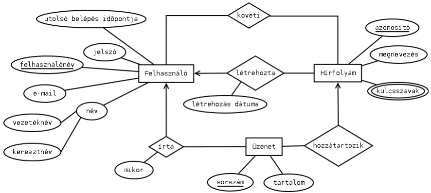

## Adatbázisok

### 1. Adatbázis-tervezés: A relációs adatmodell fogalma. Az egyed-kapcsolat diagram és leképezése relációs modellre, kulcsok fajtái. Funkcionális függőség, a normalizálás célja, normálformák.

> **_<mark>Emlékeztető</mark>_**
> 
> **_Alapfogalmak_**
> 
> **Adatbázis** (DB = database): adott formátum és rendszer szerint tárolt adatok együttese
> 
> **Adatbázisséma:** az adatbázis struktúrájának leírása
> 
> **Adatbázis-kezelő rendszer** (DBMS = Database Management System): az adatbázist kezelő szoftver
> 
> - Főbb feladatai:
>   
>   - adatstruktúrák definiálása (adatbázisséma)
>   
>   - adatok aktualizálása (adatfelvitel, törlés, módosítás) és
>     lekérdezése
>   
>   - nagy mennyiségű adat hosszú idejű, biztonságos tárolása
>   
>   - több felhasználó egyidejű kiszolgálása, jogosultságok
>     szabályozása
>   
>   - több feladat egyidejű végrehajtása, tranzakciók kezelése
> 
> **Rekord** (= feljegyzés): az adatbázis alapvető
> adategysége
> 
> **Egyed-kapcsolat modell fogalmai**
> 
> **Egyed (entitás):** a valós világ egy objektuma, melyről az
> adatbázisban információt szeretnénk tárolni
> 
> **Tulajdonság (attribútum):** az egyed egy jellemzője
> 
> **Összetett attribútum:** maga is attribútumokkal rendelkezik (általában egy struktúra, aminek adattagjai külön-külön elemi típusú értékekre
> képződnek le)
> 
> - Jelölés: a struktúrát alkotó adattagokat újabb
>   ellipszisekkel kötjük az összetett attribútumhoz
> 
> **Többértékű attribútum:** halmaz vagy lista adattípusra képződik le (előbbinél nem számít a sorrend, utóbbinál viszont igen)
> 
> - Jelölés: kettős ellipszis
> 
> **Gyenge entitás:** az attribútumai nem határozzák meg egyértelműen
> 
> - Jele: kettős téglalap
> 
> **Meghatározó kapcsolat:** gyenge entitást határoz meg
> 
> - Jele: kettős rombusz
> 
> 
> 
> **Specializáló kapcsolat**: olyan kapcsolat, amely hierarchiát jelöl az egyedek között. Például egy helyiség lehet számítógépes terem vagy mosdó is.
> 
> 
> 
> **Kulcs:** olyan (minimális) attribútumhalmaz, amely már egyértelműen meghatározza az egyedet

#### A relációs adatmodell fogalma

- az adatokat és a köztük lévő kapcsolatokat is kétdimenziós táblákban tárolja; az azonos sorban álló egyedek alkotnak egy relációt
- az erre a modellre épülő adatbáziskezelőket RDBMS-nek (Relational DBMS) nevezzük
- lekérdező nyelvük az SQL (Structured Query Language)
- napjainkban is széles körben használt modell

**Adattábla:** sorokból (rekordokból) és oszlopokból áll. Egy sor annyi mezőből áll, ahány oszlopa van a táblának.

**Attribútum:** egy tulajdonság, névvel és értéktartománnyal (a Z attribútum értéktartománya dom(Z))

**Értéktartomány megadása:** típus, hossz, (korlátozó feltételek)

- A relációs modellben az értéktartomány csak atomi értékekből állhat!

**Relációséma:** egy névvel ellátott attribútumhalmaz

- Jelölések:
  
  - $R(A_1,...,A_n)$
  
  - $R(A)$, ahol $A = {A_1,...,A_n}$
  
  - $R.A_1$ az $R$ séma $A_1$ attribútuma

- Példa:
  
  - Ügyfél (ügyfélkód, ügyfél neve)
  
  - dom(ügyfélkód): 10 jegyű egész számok halmaza
  
  - dom(ügyfél neve): legfeljebb 200 karakter hosszú sztringek halmaza

**Reláció (adattábla)** az $R(A_1,...,A_n)$ relációs séma felett: $T \subseteq dom(A_1) × ... × dom(A_n)$.

$T$ elemei $(a_1,...,a_n)$ alakúak, ahol $a_i \in dom(A_i)(i=1,...,n).$

Az _Ügyfél(ügyfélkód, ügyfél neve)_ relációs séma feletti relációs séma feletti
adattábla: $T \subseteq dom(ügyfélkód) × dom(ügyfél neve):$

**Miért hívják relációnak az adattáblát?**
Magyarázat: a matematikai relációfogalom

- $\Z$: természetes számok halmaza

- $\Z × \Z$: az összes _(a, b)_ párok halmaza

**Relációjel:** pl. $\lt$

- A "kisebb" reláció definíciója:
  
  - $K  \subseteq \Z × \Z$, ahol $K$ azon _(a, b)_ párok halmaza, amelyekre $a \lt b$
    
    - Példa: _(2, 3)_ $ \in K $, de *(5,2)* $ \notin K$

- Általánosítás: $K \in A×B×C$, ahol $K$ azon _(a, b, c)_ hármasok halmaza, amelyekre valamilyen feltétel teljesül

**Megjegyzések**

- Az adattábla sorok halmaza, ezért a relációs modellben a tábla minden sora különböző, és a soroknak nincs kitüntetett sorrendje.

- Elvileg a tábla oszlopainak sincs kitüntetett sorrendje

- Az RDBMS-ek (Relational Database Management System) általában megengednek azonos sorokat is, és a soroknak ill. oszlopoknak szükségképpen van egy tárolási sorrendje.

**Elnevezések**

- Relációséma: a tábla felépítési sémája.

- Reláció vagy adattábla vagy tábla: az adatokat tartalmazza.

- Sor, oszlop.

- Rekord: a tábla egy sora.

- Mező: a séma egy attribútuma, vagy egy bejegyzés a táblában.

- NULL: definiálatlan mezőérték.

- Relációs adatbázis: táblák együttese.

**Relációsémák és táblák**

- Ügyfél (ügyfélkód, ügyfélnév)

- Számla (számlaszám, számla neve)

- Rendelkezik (ügyfélkód, számlaszám)

_A sémák között a közös attribútumok biztosítják a kapcsolatot._

**<mark>Kulcsok</mark>**

- **Szuperkulcs (superkey):** olyan attribútumhalmaz, amely egyértelműen azonosítja a tábla sorait.

- Pontosabban: Egy $R(A)$ relációsémában $K \ ( \subseteq A)$ szuperkulcs, ha bármely $R$ feletti $T$ tábla bármely két sora $K$-n különbözik.

- **Kulcs (key):** $K (\subseteq A)$ kulcs, ha minimális szuperkulcs, vagyis egyetlen valódi részhalmaza sem szuperkulcs.
  
  - Például az Ügyfél (ügyfélkód, ügyfél neve) sémában
    
    - {ügyfélkód} szuperkulcs és kulcs is
    
    - {ügyfélkód, ügyfél neve} szuperkulcs de nem kulcs
    
    - {ügyfél neve} nem szuperkulcs (és nem kulcs)

- **Egyszerű kulcs:** ha egyetlen attribútumból áll.

- **Összetett kulcs:** ha több attribútumból áll.
  
  - Példák:
    
    - Ügyfél (ügyfélkód, ügyfél neve) -> Egyszerű kulcs: {ügyfélkód}
    
    - Rendelkezik (ügyfélkód, számlaszám) -> Összetett kulcs: {ügyfélkód, számlaszám}

- Megjegyzések
  
  - A teljes $A$ attribútumhalmaz mindig szuperkulcs.
  
  - A kulcs valójában egy feltétel előírása a relációsémára.
  
  - A kulcs a séma tulajdonsága, nem a tábláé.
  
  - Egy sémában több kulcs lehet.

- **Elsődleges kulcs (primary key):** Ha csak egy kulcs van, az lesz az elsődleges kulcs.
  Ha több kulcs van, egyet önkényesen kiválasztunk.
  Jele: aláhúzás.
  
  - Például:
    
    - Felhasználó (<u>felhasználónév</u>, név, e-mail, jelszó, belépés)
      Kulcsok: {felhasználónév}, {e-mail}
      Elsődleges kulcs: {felhasználónév}

- Fontos különbség:
  
  - Relációs modell: a tábla minden sora különböző,
    ezért mindig van kulcs.
  
  - Konkrét RDBMS: ha azonos sorokat is megengedünk, akkor nincs kulcs!
    
    - Példa (itt megengedhető hogy ne legyen kulcs):
      
      - Vásárlás (dátum, terméknév, mennyiség)
        2011.09.04. |banán| 4.0
        2011.09.05. |alma | 3.0
        2011.09.05. |szilva | 1.5
        2011.09.05. |alma | 3.0

- **Külső kulcs (idegen kulcs, foreign key):**
  
  - Egy relációséma attribútumainak valamely részhalmaza külső kulcs, ha egy másik séma elsődleges kulcsára hivatkozik.
  
  - Jelölés: dőlt betű, vagy a hivatkozott kulcsra mutató nyíl
  
  - A külső kulcs valójában egy feltétel előírása a relációsémákra.
  
  - Hivatkozási integritás: A külső kulcs értéke a hivatkozott táblában előforduló kulcsérték vagy NULL lehet
  
  - Példa:
    
    - Ügyfél (ügyfélkód, ügyfélnév)
      Számla (számlaszám, számla neve)
      Rendelkezik (ügyfélkód, számlaszám)
      
      

**<mark>Relációs adatbázis séma:</mark>** relációsémák + kulcs feltételek (elsődleges kulcsok, külső kulcsok)

- Példa: egészségügyi adatbázis
  
  - Beteg (<u>betegId</u>, betegnév, lakcím)
  
  - Orvos (<u>orvosId</u>, orvosnév, osztály, kórház)
  
  - Kezelés (<u>kezelésId</u>, megnevezés, kategória)
  
  - Ellátás (<u>_betegId_</u>, <u>_orvosId_</u>, <u>_kezelésId_</u>, <u>dátum</u>, költség)

**<mark>Indexelés</mark>**

- Index: kiegészítő adatstruktúra. Célja:
  
  - rendezés,
  
  - keresések gyorsítása (pl. külső kulcs).

- Indexkulcs: valamely $L \subseteq A$ attribútumhalmaz.
  
  - Megegyezhet a tényleges kulccsal, de más is lehet.

- „Indextábla”: Index (indexkulcs, rekordsorszám)

- Egy táblához több index is létrehozható, de a sok index lassabb műköséshez vezet
  
  

#### E-K modellből relációs modell

**Egyedek leképezése**

- Szabály: a relációséma neve az egyed neve, attribútumai az egyed
  attribútumai, elsődleges kulcsa az egyed kulcs-attribútuma(i).

- Megfeleltetés: egyedtípus -> relációséma,
  egyedpéldány -> tábla egy sora, egyedhalmaz -> teljes tábla

- Attribútumok értéktartománya meghatározandó

- Kulcs-feltétel ellenőrzendő! Van-e több kulcs?

FELHASZNÁLÓ(<u>felhasználónév</u>, jelszó, email, név, utolsó
belépés időpontja)
ÜZENET(<u>sorszám</u>, tartalom)
HÍRFOLYAM(<u>azonosító</u>, megnevezés, kulcsszavak)

**Gyenge egyedek leképezése**

- Szabály: a gyenge egyed relációsémáját bővíteni kell a
  meghatározó kapcsolat(ok)ban szereplő egyed(ek) kulcsával.

- Tfh. egy dolgozónak nincs két ugyanolyan konfigurációjú laptopja!
  
  - LAPTOP<u>_(személyi szám_</u>, CPU, RAM, HDD, SSD)

**Összetett attribútumok leképezése**

- Szabály: az összetett attribútumot a komponenseivel helyettesítjük
  (egy lépésben megtehető).

**Többértékű attribútumok leképezése**

1. <u>megoldás:</u> hosszú string
   
   
   
   Hátrány: Lassú keresés

2. <u>megoldás:</u> sorok többszörözése
   
   
   
   Hátrány: egyedi azonosítás elvesztése + redundancia

3. <u>megoldás:</u> új tábla felvétele
   
   
   
   Ha a kulcsszavak sorrendje is számít, akkor az új tábla ezzel bővíthető!

4. <u>megoldás:</u> Az ismétlődő kulcsszavak elkerülése (kapcsoló tábla felvétele)
   
   
   
   

**Kapcsolatok leképezése**

1. Új séma felvétele: $Kapcsolat(K_1,…, K_n, A_1,…, A_m)$
2. Konszolidáció: Ha az új séma kulcsa megegyezik valamelyik $E_i$ kulcsával, akkor azzal összevonható

**Kapcsolatok leképezési szabálya, összefoglalás**

- 1:1 kapcsolat esetén a kapcsolat sémája bármelyik egyed sémájába beolvasztható.

- 1:N kapcsolat esetén a kapcsolat sémája az N oldali egyed sémájába beolvasztható.

- Végezhető egy lépésben.

- N:M vagy többágú kapcsolat esetén a kapcsolat sémája egyik egyed sémájába sem olvasztható be.

**Önmagával kapcsolódó entitás**

**Specializáló kapcsolatok leképezése**

1. <u>megoldás:</u> főtípus és minden altípus külön sémában (minden egyedpéldány csak egy táblában szerepel)

Hátrány: kereséskor több táblát is vizsgálni kell, kombinált altípusokhoz új tábla kell

2. <u>megoldás:</u> minden altípus külön sémában a fő típus kulcsattribútumaival (egy egyedpéldány több táblában szerepelhet)

Hátrány: kereséskor több táblát is vizsgálni kell

3. <u>megoldás:</u> egy közös tábla
   
   
   
   Hátrány: NULL értékek (tárpazarló + tényleges jelentésük elvész)

4. <u>megoldás:</u> egy közös tábla típusjelzéssel

Hátrány: NULL értékek (tárpazarló)

#### Adatbázis normalizálása

**Cél:** Redundancia kiszűrése az adatbázisból, aktualizálási anomáliák elkerülése érdekében.

1. Redundancia felderítése a relációsémák vizsgálatával.
2. Redundancia megszüntetése a sémák felbontásával (normalizálás).

#### **Funkcionális függés**

- Adott $R(A_1,...,A_n)$ relációséma, $P$, $Q \subseteq \{A_1,...,A_n\}$

- $P$-től funkcionálisan függ $Q$, ha bármely $R$ feletti $T$
  tábla esetén valahányszor két sor megegyezik $P$-n,
  akkor megegyezik $Q$-n is

- Jelölés: $P \rarr Q$

- Példa:
  
  - Adott a következő tábla:
    
    
  
  - Ha tudjuk az Employee number oszlop értéket, akkor megtudhatjuk a hozzá tartozó Employee Name, Salary és City értékeket is. Ez alapján mondhatjuk hogy Employee Name, Salary és City funkcionálisan függenek az Employee number oszloptól. Jelölése:
    
    {Employee number} $\rarr$ {Employee Name, Salary, City}

**Elnevezések:**

- $P \rarr Q$ **triviális**, ha $Q \subseteq P$ (vagyis ha $Q$ elemei egyben $P$ elemei is)

- Ellenkező esetben $P \rarr Q$ **nemtriviális**.

- $P \rarr Q$ **teljesen nemtriviális**, ha $Q \cap P = \empty $ (vagyis ha nincsenek közös elemeik)

**Példa:**

- SZÁMLA (<u>cikkszám</u>, megnevezés, egységár, mennyiség, összeg)
  
  - összeg = egységár \* mennyiség
  
  - Függőségek:
    
    - {cikkszám} $\rarr$ {megnevezés, egységár, mennyiség}
    
    - {egységár, mennyiség} $\rarr$ {összeg}

- DOLGOZÓ (<u>adószám</u>, név, beosztás, fizetés)
  
  - Itt {beosztás} $\rarr$ {fizetés} függés **nem áll fenn!**

**Megjegyzések:**

- A funkcionális függés a séma tulajdonsága (nem a tábláé).
  
  > _séma:_ az adat struktúráját írja le (gyakorlatilag egy tervrajz)
  > 
  > _tábla:_ az adatok, oszlopok és sorok szerint rendezetten, a séma szerint meghatározva

- „Funkcionális” jelentése: ha $P \rarr Q$, akkor létezik egy $dom(P) \rarr dom(Q)$ függvény. Például: {egységár, mennyiség} $\rarr$ {összeg} kiszámítható, de
  {felhasználónév} $\rarr$ {email} nem számítható.

- **Állítás:** $K (\subseteq A)$ akkor és csak akkor szuperkulcs, ha $K \rarr A$

- **Relációséma új definíciója:** $R = (A, F)$, ahol $A = \{A_1 ,...,A_n\}$ attribútumhalmaz, és $F =\{f_1,...,f_m\}$ az $A$-n definiált funkcionális függőségek halmaza $(f_i : Pi \rarr Q_i , i = 1,...,m)$.

- **Adattábla (reláció) R felett**: $T \subseteq dom(A_1) × ... × dom(A_n)$,amely eleget tesz az $F$-beli függőségeknek.

**Példa:**

**Egyszerű szabályok**

- **Szétvágási szabály:**
  
  
  
  - Példa: {felhasználónév} $\to$ {email, név} ezért {felhasználónév} $\to$ {email} és {felhasználónév} $\to$ {név}

- **Egyesítési szabály:**
  
  

- **Vigyázat!** Ha $\{B_1,...,B_k\} \rarr X$, ebből nem következik, hogy $B_1 \rarr X, ..., B_k \rarr X$ !
  
  - Példa: Fuvar (gkvez, rendszám, indul, érkezik)
    
    - {rendszám, indul} $\rarr$ {gkvez}, de ebből nem következik, hogy
      $\{rendszám\} \rarr \{gkvez\}$ és $\{indul\} \rarr \{gkvez\}$

**Armstrong-axiómák**

1. Reflexivitás: Ha $Y \subseteq X, akkor X \rarr Y$

2. Bővítés: Ha $X \rarr Y$, akkor $X \cup Z \rarr Y \cup Z$

3. Tranzitivitás: Ha $X \rarr Y$ és $Y \rarr Z$, akkor $X \rarr Z$

Állítás: Az Armstrong-axiómák segítségével egy adott függőségi halmazból következő bármely függőség formálisan levezethető. (Levezetésen az axiómák véges sokszori alkalmazását értjük a formális logika szabályai szerint.)

**Kulcsok meghatározása**

- K ($\subseteq$ A) akkor és csak akkor szuperkulcs, ha K $\rarr$ A
  
  - A függések alapján meg lehet-e határozni?

**Attribútumhalmaz lezártja**

- Legyen $R(A,F)$ relációséma, és $X \subset A$

- Az $X$ attribútumhalmaz lezártja ($X^+$) az összes $X$-től függő attribútum

**Példa $X^+$ meghatározására**

**Állítás:** Legyen $R(A, F)$ relációséma. Egy $K (\subseteq A)$ attribútumhalmaz akkor és csak akkor szuperkulcs, ha $K^+ = A$.

- Kulcs meghatározása: Először legyen $K = A$, ez mindig
  szuperkulcs. $K$-ból sorra elhagyunk attribútumokat, és
  mindig ellenőrizzük, hogy $K^+ = A$ teljesül-e.

- Példa kulcs meghatározására:
  
  

**Függéshalmaz lezártjának meghatározása**

- Függéshalmaz lezártja: az összes F-ből levezethető függés halmaza. Jelölése $F^+$.

- Algoritmus F+ meghatározására:
  
  1. Vegyük az A attribútumhalmaz összes részhalmazát.
  2. Minden X részhalmazhoz állítsuk elő $X^+$-t.
  3. Valamennyi $Y \subseteq X^+$-ra az $X\subseteq Y$ függőséget felvesszük $F^+$-ba.

#### Felbontás (dekompozíció)

- Ha egy reláció nem megfelelő normálformában van, akkor a reláció dekompozíciójára van szükség
  
  - Veszteségmentes felbontás (másnéven hűséges felbontás)
    
    - ha reláció dekompozíciójánál nem vesztettünk információt
    
    - garantálja hogy dekompozíció után a relációk természetes összecsatolása ugyanazt a relációt fogja eredményezni (másképp: $T =T_1 \Join T_2$, ahol $T$ az eredeti tábla, $T_1$ és $T_2$ a dekompozíció ererdményei)
      
      
      
      
  
  - Függőségőrző felbontás
    
    

- Heath tétele:
  
  - $R(B, C, D)$, ahol $B$, $C$ és $D$ diszjunkt attribútumhalmazok
  
  - Ha $C \rarr D$, akkor az $R_1(B, C)$, $R_2(C, D)$ felbontás hűséges.

#### Normalizálás

##### 1. normálforma (1NF)

- Egy relációséma 1NF-ben van, ha az attribútumok értéktartománya csak egyszerű (atomi) adatokból áll (nem tartalmaz például listát vagy struktúrát)
  
  - Ennek teljesülését már a relációséma definíciójánál feltételeztük.
  
  - Az 1NF-re hozást az E-K modell $\rarr$ relációs modell leképezésnél megvalósítottuk.

- Definíciók
  
  - Adott $R = (A,F)$, $X,Y \subseteq A$, és $X \rarr Y$
    
    - $X$-től teljesen függ $Y$, ha bármely attribútumot elhagyva a függőség már nem teljesül
    
    - Egy attribútum elsődleges attribútum ha szerepel a relációséma valamely kulcsában, ellenkező esetben másodlagos attribútum

##### 2. normálforma (2NF)

- Egy $R = (A, F)$ relációséma 2NF-ben van, ha minden másodlagos attribútum teljesen függ bármely kulcstól.

- Következmények:
  
  - Ha minden kulcs egy attribútumból áll, akkor a séma 2NF-ben van, Például:
    
    - FELHASZNÁLÓ(<u>felhasználónév</u>, jelszó, email, vezetéknév, keresztnév, utolsó belépés időpontja)
    
    - Kulcsok: {felhasználónév} {email}
    
    - egyelemű kulcsok, ebből következik hogy ha elemet hagynánk el belőlük, akkor üreshalmazt kapnánk, ami már nem azonosítja be egyértelműen a másodlagos (vagyis nem kulcs) attribútumokat
  
  - Ha a sémában nincs másodlagos attribútum, akkor 2NF-ben van. Például:
    
    - FUVAR(gkvez, <u>rendszám</u>, <u>indul</u>, érkezik)
    
    - Kulcsok: {gkvez, indul}, {gkvez, érkezik}, {rendszám, indul}, {rendszám, érkezik}

- A séma nincs 2NF-ben, ha egy kulcs részhalmazától függ (egy vagy több másodlagos attribútum)

- 2NF-re hozás: a sémát felbontjuk Heath tétele szerint, a normálformát sértő függőség mentén
  
  
  
  
  
  

##### 3. normálforma (3NF)

- $X,Z \subseteq A$ és $X \rarr Z$
  
  - $X$-től tranzitívan függ $Z$,ha van olyan $Y (\subseteq A)$, amelyre $X\rarr Y$ és $Y\rarr Z$,
    de $X$ nem függ $Y$-tól, és az $Y\rarr Z$ függés teljesen nemtriviális (vagyis $Y \cap Z$ üres). Ellenkező esetben $X$-től közvetlenül függ $Z$.

- Egy $R = (A, F)$ relációséma 3NF-ben van, ha minden másodlagos attribútuma közvetlenül függ bármely kulcstól.
  
  - Következmény: Ha a sémában nincs másodlagos attribútum,
    akkor 3NF-ben van.

Nem tranzitív függés, mivel a felhasználónév függ az emailtől.

- A séma nincs 3NF-ben, ha egy vagy több másodlagos attribútum tranzitívan függ valamely kulcstól

- 3NF-re hozás: ha a $K \rarr Y \rarr Z$ tranzitív függés fennáll, akkor a sémát felbonthatjuk Heath tétele szerint az $Y \rarr Z$ függés mentén.

- Példa:
  
  - DOLGOZÓ(<u>adószám</u>, TAJ szám, dolgozó neve, projektkód, projekt neve)
  
  - Egy dolgozó csak egy projekten dolgozhat. Ha többen dolgoznak ugyanazon a projekten, akkor a projekt neve ismétlődik.
  
  - Kulcsok: {adószám}, {TAJ szám}
  
  - A séma 2NF-ben van (csak egyszerű kulcs van benne).
  
  - Tranzitív függés: {adószám} $\rarr$ {projektkód} $\rarr$ {projekt neve}
  
  - Felbontás Heath-tétele alapján:
    
    - C = {projektkód}
    
    - D = {projekt neve}
    
    - B = {adószám, TAJ szám, dolgozó neve}
  
  - Felbontás után:
    
    - DOLGOZÓ(<u>adószám</u>, TAJ szám, dolgozó neve, projektkód)
    
    - PROJEKT(<u>projektkód</u>, projekt neve)

- **Állítás:** Ha egy relációséma 3NF-ben van, akkor 2NF-ben is van.

##### Boyce-Codd normálforma (BCNF)

- Egy relációséma BCNF-ben van, ha bármely nemtriviális $L \rarr Z$ függés esetén L szuperkulcs.
  
  - Vagyis: A sémában csak kulcstól való függés van, ezen kívül nincs „kóbor függés”.

- A séma nincs BCNF-ben, ha van benne olyan nemtriviális függés, amelynek bal oldalán nem szuperkulcs áll.

- BCNF-re hozás: a sémát felbontjuk Heath tétele szerint, a normálformát sértő függőség mentén.

- Példa:
  
  - DOLGOZÓ(<u>adószám</u>, TAJ szám, <u>projektkód</u>)
  
  - Egy dolgozó több projekten dolgozhat. Ha valaki több projekten dolgozik, akkor a TAJ szám ismétlődik.
  
  - Kulcsok: {adószám, projektkód}, {TAJ szám, projektkód}
  
  - A séma 3NF-ben van (nincs másodlagos attribútum).
  
  - BCNF-et sértő függés:{adószám} $\rarr$ {TAJ szám} (adószám nem szuperkulcs)
  
  - Felbontás Heath-tétele alapján:
    
    - C = {adószám}
    
    - D = {TAJ szám}
    
    - B = {projektkód}
  
  - Felbontás után:
    
    - DOLGOZÓ(<u>adószám</u>, TAJ szám)
    
    - PROJEKT(<u>adószám</u>, <u>projektkód</u>)

- **Állítás:** Ha egy relációséma BCNF-ben van, akkor 3NF-ben is van.

##### 4. normálforma (4NF)

- Példa: Rendelhet (<u>nagyker</u>, <u>kisker</u>, <u>áru</u>), BCNF-ben van.

- $K,L \subseteq A$, és legyen $M=A \setminus(K \cup L)$
  
  - $K$-tól többértékűen függ $L$ ($K \rarr \rarr L$), ha bármely $R$ feletti $T$ tábla esetén ha két sor megegyezik $K$-n, akkor a kombinációjuk is szerepel a táblában
  
  - Példa:
    
    - nagyker $\rarr \rarr kisker$
    
    - viszont kisker $\rarr \rarr nagyker$ már nem igaz, mert például (N2, K2) és (K2, A2), de (N2, K2, A2) már nem teljesül!

**Fagin tétele**

- A Rendelhet tábla 4NF felbontása:
  
  

- **Állítás:** Ha egy relációséma 4NF-ben van, akkor hűséges
  felbontással nem lehet redundanciát megszüntetni.

### 2. Az SQL adatbázisnyelv: Az adatdefiníciós nyelv (DDL) és az adatmanipulációs nyelv (DML). Relációsémák definiálása, megszorítások típusai és létrehozásuk. Adatmanipulációs lehetőségek és lekérdezések.

#### Az SQL nyelv

**SQL** = Structured Query Language (= strukturált lekérdező nyelv). A relációs adatbáziskezelés szabványos nyelve. Nem algoritmikus nyelv, de algoritmikus nyelvekbe beépíthető (beágyazott SQL).

**Általános jellemzők**

- Az SQL utasításait két fő csoportba szokták sorolni:
  
  - DDL (= Data Definition Language): adatstruktúra definiáló utasítások.
  
  - DML (= Data Manipulation Language): adatokon műveletet végző utasítások

**Szintaxis**

- Kisbetű és nagybetű a nyelv alapszavaiban egyenértékű

- Utasítások sorfolytonosan írhatók, lezárás pontosvesszővel

- Változó nincs, csak tábla- és oszlopnevekre lehet hivatkozni. Kifejezésben hivatkozás egy tábla adott oszlopára: tábla.oszlop (ha a tábla egyértelmű, akkor elhagyható)

- Alias név: név AS másodnév (egyes implementációkban AS elhagyható).

- Szövegkonstans: 'szöveg'

- Dátum: DATE '1968-05-12'. Egyes rendszerek az SQL szabványtól eltérő konvenciót alkalmaznak, például 13-NOV-94 (Oracle)

- Idő: TIME '15:31:02.5' (óra, perc, másodperc)

- Stringek konkatenációja: + vagy ||

- Relációjelek: =, <=, >=, !=, <>

- Logikai műveletek: AND, OR, NOT. Az SQL rendszerek "háromértékű logikát"
  használnak, vagyis a TRUE és FALSE mellett a NULL (definiálatlan) érték is felléphet. Ha egy kifejezés valamelyik eleme NULL, akkor a kifejezés értéke is NULL lesz.
  
  - Az SQL-szabvány szerint egy logikai kifejezés értéke ISMERETLEN (UNKNOWN), ha benne NULL érték szerepel.

- Az utasítások szintaxisának leírásánál az elhagyható részleteket szögletes zárójellel
  jelöljük.

#### Relációsémák definiálása (DDL)

- Relációséma létrehozására a CREATE TABLE utasítás szolgál, amely egyben egy üres
  táblát is létrehoz a sémához. Az attribútumok definiálása mellett a kulcsok és külső kulcsok megadására is lehetőséget nyújt:
  
  - CREATE TABLE táblanév
    ( oszlopnév adattípus [feltétel],
    ... ...,
    oszlopnév adattípus [feltétel]
    [, táblaFeltételek]
    );

- Az adattípusok (rendszerenként eltérők lehetnek):
  
  - _CHAR(n):_ n hosszúságú karaktersorozat
  
  - _VARCHAR(n):_ legfeljebb n hosszúságú karaktersorozat
  
  - _INTEGER:_ egész szám (röviden INT)
  
  - _REAL:_ valós (lebegőpontos) szám, másnéven FLOAT
  
  - _DECIMAL(n[,d]):_ n jegyű decimális szám, ebből d tizedesjegy
  
  - _DATE:_ dátum (év, hó, nap)
  
  - _TIME:_ idő (óra, perc, másodperc)

- Az adattípushoz "DEFAULT érték" megadásával alapértelmezett érték definiálható. Ha ilyet nem adunk meg, az alapértelmezett érték NULL

- Feltételek (egy adott oszlopra vonatkoznak):
  
  - PRIMARY KEY: elsődleges kulcs (csak egy lehet)
  
  - UNIQUE: kulcs (több is lehet)
  
  - REFERENCES tábla(oszlop) [ON-feltételek]: külső kulcs

- Táblafeltételek (az egész táblára vonatkoznak):
  
  - PRIMARY KEY (oszloplista): elsődleges kulcs
  
  - UNIQUE (oszloplista): kulcs
  
  - FOREIGN KEY (oszloplista) REFERENCES tábla(oszloplista) [ON-feltételek]: külső kulcs

- Ha a (külső) kulcs több oszlopból áll, akkor csak táblafeltétel formájában adható meg.

- A PRIMARY KEY (elsődleges kulcs) és UNIQUE (kulcs) közötti különbségek:
  
  - Egy sémában csak egy elsődleges kulcs, de tetszőleges számú további kulcs lehet
  
  - Külső kulcs általában a másik tábla elsődleges kulcsára hivatkozik.
  
  - Egyes DBMS-ek az elsődleges kulcshoz automatikusan indexet hoznak létre.

- A CREATE TABLE utasítással tulajdonképpen egy R = (A, F) relációsémát adunk meg,
  ahol F megadására szolgálnak a kulcsfeltételek. Ha a relációséma BCNF-ben van, akkor ezzel az összes függés megadható, hiszen ekkor csak szuperkulcstól lehet nemtriviális függés

- Példa (az alábbi relációséma SQL-ben való létrehozása):
  
  - Osztály (<u>osztálykód</u>, osztálynév, vezAdószám)
  
  - Dolgozó (<u>adószám</u>, név, lakcím, _osztálykód_)
    
    

- A tábla módosításakor a definiált kulcsfeltételek automatikusan ellenőrzésre kerülnek. PRIMARY KEY és UNIQUE esetén ez azt jelenti, hogy a rendszer nem enged olyan módosítást illetve új sor felvételét, amely egy már meglévő kulccsal ütközne.

- REFERENCES (külső kulcs hivatkozás) esetén ON-feltételek megadásával
  szabályozhatjuk a rendszer viselkedését (jelölje T1 a hivatkozó és T2 a hivatkozott táblát):
  
  - _Alapértelmezés_ (ha nincs ON-feltétel): T1-ben nem megengedett olyan beszúrás és módosítás, amely T2-ben nem létező kulcs értékre hivatkozna, továbbá T2-ben nem megengedett olyan kulcs módosítása vagy sor törlése, amelyre T1 hivatkozik.
  
  - **ON UPDATE CASCADE:** ha T2 egy sorában változik a kulcs értéke, akkor a rá való T1-beli hivatkozások is megfelelően módosulnak (módosítás továbbgyűrűzése).
  
  - **ON DELETE CASCADE:** Ha T2-ben törlünk egy sort, akkor T1-ben is törlődnek a rá hivatkozó sorok (törlés továbbgyűrűzése).
  
  - **ON UPDATE SET NULL:** ha T2 egy sorában változik a kulcs értéke, akkor T1-ben a rá való külső kulcs hivatkozások értéke NULL lesz.
  
  - **ON DELETE SET NULL:** ha T2-ben törlünk egy sort, akkor T1-ben a rá való külső
    kulcs hivatkozások értéke NULL lesz.

- A kulcsfeltételek ellenőrzése csak indexekkel oldható meg hatékonyan.

- Relációséma törlése:
  
  - **DROP TABLE táblanév;**
  
  - Hatására a séma és a hozzá tartozó adattábla törlődik.

- Relációséma módosítása:
  
  - **ALTER TABLE táblanév
    [ADD (újelem, ..., újelem)]
    [MODIFY (módosítás, ..., módosítás)]
    [DROP (oszlop, ..., oszlop)];**
  
  - Az ALTER TABLE utasítás szintaxisa és szemantikája rendszerenként eltérő, például oszlopok törlését nem minden rendszer engedi meg.

> **Indexek létrehozása**
> 
> - Az indexek kezelése nem része az SQL2 szabványnak, de valamilyen formában minden RDBMS támogatja
> 
> - Index létrehozása:
>   
>   - **CREATE [UNIQUE] INDEX indexnév ON tábla(oszloplista);**
>   
>   - A megadott tábla felsorolt oszlopaira, mint indexkulcsra generál indexet.
>   
>   - Ha UNIQUE szerepel, akkor a tábla nem tartalmazhat két azonos indexkulcsú rekordot
> 
> - Index törlése:
>   
>   - **DROP INDEX indexnév;**
> 
> - Példák:
>   
>   - CREATE INDEX DolgInd1 ON Dolgozó(név);
>     CREATE INDEX DolgInd2 ON Dolgozó(osztálykód,név);
>   
>   - Az első példa egyszerű indexkulcsot tartalmaz, amely a dolgozók név szerinti keresését, illetve rendezését támogatja. A második példában szereplő összetett indexkulcs az osztálykód szerinti, osztályon belül pedig név szerinti keresést/rendezést segíti, mivel a rendszerek
>     általában az osztálykód és név attribútumok konkatenációjával képezik az indexkulcsot. Ez a megoldás viszont a pusztán név szerinti keresést nem támogatja.

#### Adattábla aktualizálása (DML)

- A táblába új sor felvétele:
  
  - **INSERT INTO táblanév [(oszloplista)] VALUES (értéklista);**
  
  - Ha oszloplista nem szerepel, akkor valamennyi oszlop értéket kap a
    CREATE TABLE-ben megadott sorrendben. Egyébként csak az oszloplistában megadott mezők kapnak értéket, a többi mező értéke NULL lesz.
  
  - Példa:
    
    - INSERT INTO Dolgozó (név, adószám)
      VALUES ('Tóth Aladár', 1111);
  
  - A táblába adatokat tölthetünk át másik táblából is, ha a VALUES(értéklista) helyére egy lekérdezést írunk

- Sor(ok) módosítása:
  
  - **UPDATE táblanév
    SET oszlop = kifejezés, ..., oszlop = kifejezés
    [ WHERE feltétel ];**
  
  - Az értékadás minden olyan soron végrehajtódik, amely eleget tesz a
    WHERE feltételnek. Ha WHERE feltétel nem szerepel, akkor az értékadás az összes sorra megtörténik.
  
  - Példa:
    
    - UPDATE Dolgozó
      SET lakcím = 'Szeged, Rózsa u. 5.'
      WHERE név = 'Kovács József';

- Sor(ok) törlése:
  
  - **DELETE FROM táblanév
    [ WHERE feltétel ];**
  
  - Hatására azok a sorok törlődnek, amelyek eleget tesznek a WHERE
    feltételnek. Ha a WHERE feltételt elhagyjuk, akkor az összes sor törlődik (de a séma megmarad).
  
  - Példa:
    
    - DELETE FROM Dolgozó
      WHERE név = 'Kovács József';

#### Lekérdezés (DML)

- Lekérdezésre a SELECT utasítás szolgál, amely egy vagy több adattáblából egy eredménytáblát állít elő.

- Az eredménytábla a képernyőn listázásra kerül, vagy más módon
  használható fel. (Egyetlen SELECT akár egy komplex felhasználói programot helyettesíthet!)

- A "SELECT DISTINCT $A_1$,...,$A_n$ FROM $T_1$,...,$T_m$ WHERE feltétel" utasítás egyenértékű a következő relációs algebrai kifejezéssel:
  
  - $E=\pi_{A1,...An}(\sigma_{feltétel}(T_1 × ... × T_m))$
  
  - Vagyis, a felsorolt táblák Descartes-szorzatából szelektáljuk a feltételnek eleget tévő sorokat, majd ezekből projekcióval választjuk ki az E eredménytábla oszlopait.
  
  - A DISTINCT opciót akkor kell kiírni, ha az eredménytáblában az azonos sorokból csak egyet kívánunk megtartani.

- Ha oszloplista helyére \* karaktert írunk, ez valamennyi oszlop felsorolásával
  egyenértékű. A SELECT legegyszerűbb változatával adattábla listázását érhetjük el:
  
  - SELECT \* FROM T;
  
  **A relációs algebra műveleteinek megvalósítása:**

- Projekció
  
  - SELECT [DISTINCT] $A_1$,...,$A_n$ FROM T;
  
  - Pl.: SELECT DISTINCT szerző, cím FROM Könyv;

- Szelekció
  
  - SELECT \* FROM T WHERE feltétel;
  
  - Pl.: SELECT \* FROM Könyv WHERE kivétel < 2013.01.01;

- Descartes-szorzat: $T_1$ x $T_2$
  
  - SELECT \* FROM T1,T2;

- Természetes összekapcsolás
  
  - Állítsuk elő például az Áru (cikkszám, megnevezés) és Vásárlás (cikkszám, mennyiség) táblák természetes összekapcsolását:
    
    - SELECT Áru.cikkszám, megnevezés, mennyiség
      FROM Áru, Vásárlás
      WHERE Áru.cikkszám = Vásárlás.cikkszám;
    
    - A fentivel egyenértékű, szintén gyakran használt szintaxis:
      
      - SELECT Áru.cikkszám, megnevezés, mennyiség
        FROM Áru INNER JOIN Vásárlás ON Áru.cikkszám = Vásárlás.cikkszám;
  
  - Megjegyzés: A fenti példákban a SELECT után nem elegendő csak „cikkszám”-ot írni, annak ellenére, hogy esetünkben „Áru.cikkszám = Vásárlás.cikkszám”, tehát mindegy, melyik cikkszámot választja a rendszer. Általában, ha egy lekérdezésben több azonos oszlopnév szerepel, az SQL rendszerek megkövetelik a táblanév megadását

- Külső összekapcsolás
  
  - Az SQL szabvány szerint a LEFT, RIGHT vagy FULL OUTER JOIN kulcsszavakkal
    adható meg külső összekapcsolás
  
  - Például:
    
    - SELECT Áru.cikkszám, megnevezés, mennyiség
      FROM Áru LEFT OUTER JOIN Vásárlás
      ON Áru.cikkszám = Vásárlás.cikkszám;

- Théta join
  
  - SELECT \* FROM T1,T2 WHERE feltétel;

- Unió
  
  - (SELECT _ FROM T1)
    UNION
    (SELECT _ FROM T2);
  
  - A két SELECT eredménytáblája kompatibilis kell hogy legyen

- Metszet
  
  - (SELECT _ FROM T1)
    INTERSECT
    (SELECT _ FROM T2);
  
  - A két SELECT eredménytáblája kompatibilis kell hogy legyen

- Különbség
  
  - (SELECT _ FROM T1)
    EXCEPT
    (SELECT _ FROM T2);
  
  - A két SELECT eredménytáblája kompatibilis kell, hogy legyen. Egyes rendszereknél EXCEPT helyett MINUS használatos.

**Alias nevek**

- A SELECT után megadott oszloplista valójában nem csak oszlopneveket, hanem
  tetszőleges kifejezéseket is tartalmazhat, és az eredménytábla oszlopainak elnevezésére alias neveket adhatunk meg

- Például:
  
  - SELECT név AS áru, egységár\*mennyiség AS érték FROM Raktár;

**Függvények**

- Például:
  
  - Abszolút érték
    
    - ABS(n)
  
  - Konverzió kisbetűsre
    
    - LOWER(char)
  
  - stb...

**Összesítő függvények**

- Egy oszlop értékeiből egyetlen értéket hoznak létre (például átlag). Általános alakjuk:
  
  - függvénynév ( [DISTINCT] oszlopnév )

- Ha DISTINCT szerepel, akkor az oszlopban szereplő azonos értékeket csak egyszer kell figyelembe venni. A számításnál a NULL értékek figyelmen kívül maradnak. Az egyes függvények:
  
  - AVG: átlagérték.
  
  - SUM: összeg.
  
  - MAX: maximális érték.
  
  - MIN: minimális érték.
  
  - COUNT: elemek száma. Ennél a függvénynél oszlopnév helyére \* is írható, amely valamennyi oszlopot együtt jelenti.

- Példa:
  
  - SELECT AVG(fizetés) FROM Dolgozó;
  
  - Az eredménytábla egyetlen elemből áll, amely az átlagfizetést adja.

**Csoportosítás (GROUP BY, HAVING)**

- Ha a tábla sorait csoportonként szeretnénk összesíteni, akkor a SELECT utasítás a
  **GROUP BY oszloplista**
  alparanccsal bővítendő.
  
  - Egy csoportba azok a sorok tartoznak, melyeknél oszloplista értéke
    azonos.
  
  - Az eredménytáblában egy csoportból egy rekord lesz
  
  - Példa:
    
    - SELECT osztkód, AVG(fizetés) FROM Dolgozó
      GROUP BY osztkód;
    
    - A Dolgozó táblából osztályonként az átlagfizetést számoljuk

- **Csoportosítási szabály**: A SELECT után összesítő függvényen kívül csak olyan
  oszlopnév tüntethető fel, amely a GROUP BY-ban is szerepel.
  
  - Hibás például az alábbi lekérdezés, amely azt szeretné megtudni, hogy az egyes osztályokon kinek a legnagyobb a fizetése:
    
    - SELECT osztkód, név, MAX(fizetés) AS maxfiz FROM Dolgozó GROUP BY osztkód;
    
    - A hiba oka: név nem szerepelhet a SELECT után, mert a GROUP BY után sem szerepel.

- A GROUP BY által képezett csoportok közül válogathatunk a
  **HAVING feltétel**
  alparancs segítségével: csak a feltételnek eleget tevő csoportok kerülnek összesítésre az eredménytáblába.
  
  - Példa. Azon osztályok listája, ahol az átlagfizetés > 180 000 Ft:
    
    - SELECT osztkód, AVG(fizetés) FROM Dolgozó
      GROUP BY osztkód
      HAVING AVG(fizetés) > 180000;

- Az eredménytábla rendezése:
  
  - Bár a relációs modell nem definiálja a rekordok sorrendjét, a gyakorlatban rendszerint valamilyen rendezettségben kívánjuk látni az eredményt
  
  - Erre szolgál az
    **ORDER BY oszlopnév [DESC], ..., oszlopnév [DESC]**
    alparancs, amely a SELECT utasítás végére helyezhető, és az eredménytáblának a megadott oszlopok szerinti rendezését írja elő
  
  - Az oszlopnév után írt ASC (ascending) növekvő, DESC (descending) csökkenő sorrendben való rendezést jelent. (Alapértelmezés szerint a rendezés
    növekvő sorrendben történik, ezért ASC kiírása fölösleges)
  
  - Példa:
    
    - SELECT osztkód, név, fizetés FROM Dolgozó
      ORDER BY osztkód, fizetés DESC;

**A SELECT utasítás általános alakja**

- A SELECT utasítás az alábbi alparancsokból állhat az alábbi sorrendben (a szögletes
  zárójelben szereplő részek elhagyhatók):
  
  - SELECT [DISTINCT] oszloplista projekció
    FROM táblanévlista Descartes-szorzat
    [WHERE feltétel] szelekció
    [GROUP BY oszloplista] csoportonként összevonás
    [HAVING feltétel] csoport-szelekció
    [ORDER BY oszloplista]; rendezés

**Alkérdések**

- Ha egy SELECT utasítás WHERE vagy HAVING feltételében olyan logikai kifejezés
  szerepel, amely SELECT utasítást tartalmaz, ezt alkérdésnek vagy belső SELECT-nek is nevezik. Általában, valamely SQL utasítás belsejében szereplő SELECT utasítást alkérdésnek nevezzük.

- Példa. Az alábbi utasítás azon dolgozók listáját adja, amelyek fizetése kisebb, mint
  az átlagfizetés:
  
  - SELECT név, fizetés FROM Dolgozó
    WHERE fizetés < ( SELECT AVG(fizetés) FROM dolgozó );

- Nem csak a logikai kifejezés tartalmazhat alkérdést, hanem az INSERT utasítás is:
  
  - **INSERT INTO táblanév [(oszloplista)] SELECT ... ;**
  
  - A SELECT annyi oszlopot kell hogy kiválasszon, amennyit oszloplista tartalmaz. A többi oszlop NULL értéket vesz fel.
  
  - Példa. Tegyük fel, hogy a Raktár (cikkszám, név, egységár, mennyiség) táblából
    egy Készlet (áru, érték) táblát szeretnénk létrehozni, amely az áruféleség megnevezését és az aktuálisan tárolt mennyiség értékét tartalmazza. Ez a következőképp lehetséges:
    
    - CREATE TABLE Készlet
      ( áru CHAR(20),
      érték INTEGER
      );
      INSERT INTO Készlet
      SELECT név, egységár\*mennyiség FROM Raktár;

**Nézettáblák (virtuális táblák)**

- Egy adatbázisban általában kétféle adatra van szükségünk:
  
  - alapadatok: tartalmukat aktualizáló műveletekkel módosítjuk
  
  - származtatott adatok: az alapadatokból generálhatók.

- Származtatott adattáblát például INSERT ... SELECT segítségével is létrehozhatunk
  (lásd az előző pontot), ekkor viszont az nem követi automatikusan az alapadatok módosulását, ha pedig minden aktualizáló műveletnél újragenerálnánk, az rendkívül lassú lenne. A problémát a nézettábla oldja meg.

- A nézettábla (virtuális tábla, view) nem tárol adatokat. Tulajdonképpen egy
  transzformációs formula, amelyet úgy képzelhetünk el, mint ha ennek segítségével a tárolt táblák adatait látnánk egy speciális szűrőn, „optikán” keresztül.

- Nézettáblák alkalmazási lehetőségei:
  
  - Származtatott adattáblák létrehozása, amelyek a törzsadatok módosításakor
    automatikusan módosulnak (pl. összegzőtáblák).
  
  - Bizonyos adatok elrejtése egyes felhasználók elől (adatbiztonság vagy egyszerűsítés céljából)

- Nézettábla létrehozása:
  
  - CREATE VIEW táblanév [(oszloplista)] AS alkérdés;

- A SELECT utasítás eredménytáblája alkotja a nézettáblát. "Oszloplista" megadásával a nézettábla oszlopainak új nevet adhatunk. A CREATE VIEW végrehajtásakor a rendszer csak letárolja a nézettábla definícióját, és majd csak a rá való hivatkozáskor generálja a szükséges adatokat. Ebből adódóan a nézettábla tartalma mindig aktuális.

- A nézettáblák általában ugyanúgy használhatók, mint a tárolt adattáblák, vagyis ahol egy SQL parancsban táblanév adható meg, ott rendszerint nézettábla neve is szerepelhet.

- Példa. Származtatott adatok kezelése. A Raktár (cikkszám, név, egységár,
  mennyiség) táblából létrehozott nézettábla:
  
  - CREATE VIEW Készlet (áru, érték) AS
    SELECT név, egységár\*mennyiség FROM Raktár;

- Ha a nézettábla tartalmát módosítjuk, akkor a módosítás a megfelelő tárolt táblákon hajtódik végre – és természetesen megjelenik a nézettáblában is

#### Aktív elemek (megszorítások, triggerek)

- Aktív elem: olyan programrész, amely bizonyos szituációban automatikusan
  végrehajtódik. Ennek speciális esete a megszorítás, ami bizonyos feltételek ellenőrzését jelenti bizonyos helyzetekben.

**Attribútumok megszorításai**

- A CREATE TABLE-ben valamely attribútum deklarációja után adhatók meg.

- Kulcs feltételek: a CREATE TABLE utasításban adhatók meg a PRIMARY KEY,
  UNIQUE, REFERENCES kulcsszavakkal. Aktualizálási műveleteknél a megfelelő feltétel automatikus ellenőrzését váltják ki.

- További megszorítások:
  
  - NOT NULL
    
    - Adott attribútum értéke nem lehet NULL. Hatására a rendszer megakadályoz minden olyan műveletet, amely az adott attribútum NULL értékét eredményezné. Adatbevitelnél például ez azt jelenti, hogy az attribútum értékét kötelező megadni
  
  - CHECK (feltétel)
    
    - Az adott attribútum módosítását a rendszer csak akkor engedi meg, ha a feltétel teljesül.
    
    - Példa: A dolgozók nemét is nyilvántartjuk (F=férfi, N=nő):
      
      - CREATE TABLE Dolgozó
        ( adószám DECIMAL(10) PRIMARY KEY,
        név CHAR(30) NOT NULL,
        nem CHAR(1) CHECK (nem IN ('F', 'N')),
        lakcím CHAR(40),
        osztkód CHAR(3) REFERENCES Osztály(osztkód)
        );

- Értéktartomány definiálása:
  
  - **CREATE DOMAIN név típus [DEFAULT érték] [CHECK (feltétel)];**
  
  - Értéktartomány módosítása ALTER DOMAIN, törlése DROP DOMAIN utasítással
    történik.
  
  - Példa. A nemekhez tartozó konstansértékek definiálása:
    
    - CREATE DOMAIN NemÉrték CHAR(1) CHECK (VALUE IN ('F', 'N'));
      CREATE TABLE Dolgozó
      ( adószám DECIMAL(10) PRIMARY KEY,
      név CHAR(30),
      nem NemÉrték,
      lakcím CHAR(40)
      );

**Táblára vonatkozó megszorítások**

- A CREATE TABLE végére, a táblaFeltételeknél helyezendők el.

- Kulcs feltételek:
  PRIMARY KEY, UNIQUE, FOREIGN KEY kulcsszavakkal. Ha a CHECK feltétel egyszerre
  több attribútumot érint, akkor szintén a táblaFeltételeknél helyezendő el.

- Példa. Biztonsági ellenőrzésként megköveteljük, hogy a könyvek kölcsönzésénél a
  kivétel dátuma előzze meg a visszahozási határidőt:
  
  - CREATE TABLE Könyv
    ( könyvszám DECIMAL(6) PRIMARY KEY,
    szerző CHAR(30),
    cím CHAR(30),
    kivétel DATE,
    vissza DATE,
    CHECK (kivétel < vissza)
    );

**Általános megszorítások**

- Több táblára (általában, a teljes adatbázissémára) vonatkozhatnak. Megadásuk:
  
  - **CREATE ASSERTION név CHECK (feltétel);**
  
  - A feltételben szereplő táblák bármelyikének módosításakor a feltétel ellenőrzésre kerül.

- Példa. A Dolgozó(adószám, név, fizetés, osztálykód) és Osztály(osztálykód,
  osztálynév, vezAdószám) táblák esetén megköveteljük, hogy a vezetők fizetése legalább 100 000 Ft legyen:
  
  - CREATE ASSERTION VezetőFizetés
    CHECK (NOT EXISTS
    (SELECT \* FROM Dolgozó, Osztály
    WHERE Dolgozó.adószám = Osztály.vezAdószám
    AND fizetés < 100000));

- Az önálló megszorítás törlése:
  
  - **DROP ASSERTION név;**

**Triggerek**

- A trigger egy aktualizálási művelet esetén végrehajtandó programrészletet definiál.

- Megadása:
  
  - **CREATE TRIGGER név
    { BEFORE | AFTER | INSTEAD OF }
    { DELETE | INSERT | UPDATE [OF oszlopok] }
    ON tábla
    [ REFERENCING [OLD AS régi] [NEW AS új]
    [ FOR EACH ROW ]
    [WHEN (feltétel)] programblokk;**
    
    - Jelölés: a fenti szintaxis leírásban { x | y } azt jelenti, hogy x és y egyike választható.
    
    - **név**: a trigger neve.
      **BEFORE, AFTER, INSTEAD OF**: az aktualizálási művelet előtt, után, vagy helyette lép működésbe a trigger.
      **DELETE, INSERT, UPDATE OF**: az aktualizálási művelet neve.
      ON tábla: ezen tábla aktualizálásakor lép működésbe a trigger.
      **REFERENCING**: lehetővé teszi, hogy a tábla aktuális sorának aktualizálás előtti és utáni állapotára névvel hivatkozzunk.
      **FOR EACH ROW**: ha megadjuk, akkor a trigger a tábla minden egyes sorára lefut, amelyet az aktualizálási művelet érint (sor szintű trigger). Ha nem adjuk meg, akkor egy aktualizálási művelet esetén csak egyszer fut le a trigger (utasítás szintű trigger).
      **WHEN feltétel**: a megadott feltétel teljesülése esetén hajtódik végre a trigger.
      **programblokk**: egy vagy több SQL utasításból álló, vagy valamely programozási nyelven írt blokk.
