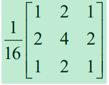
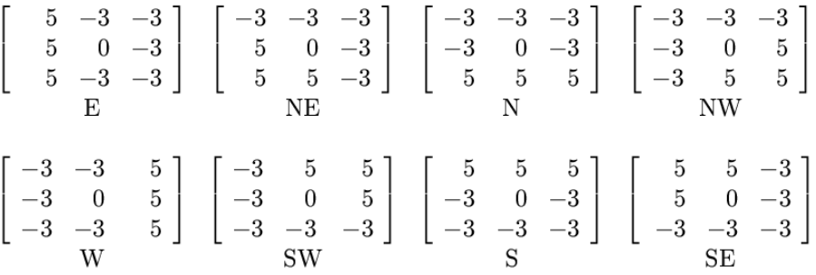
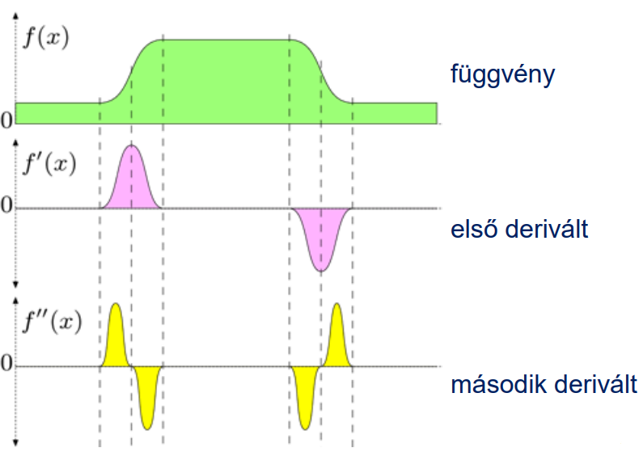
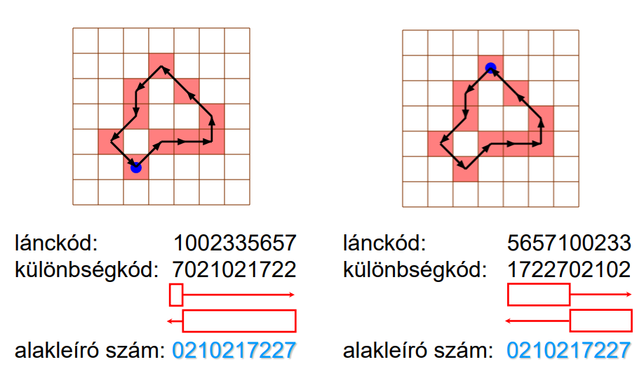
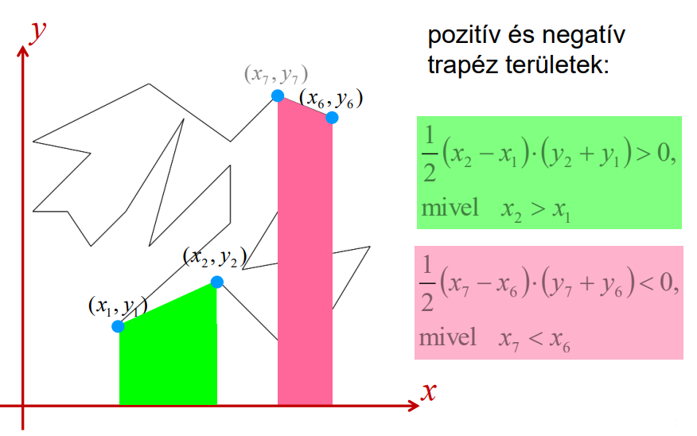
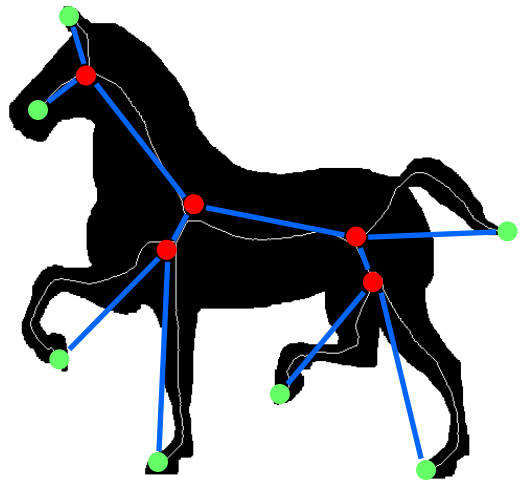
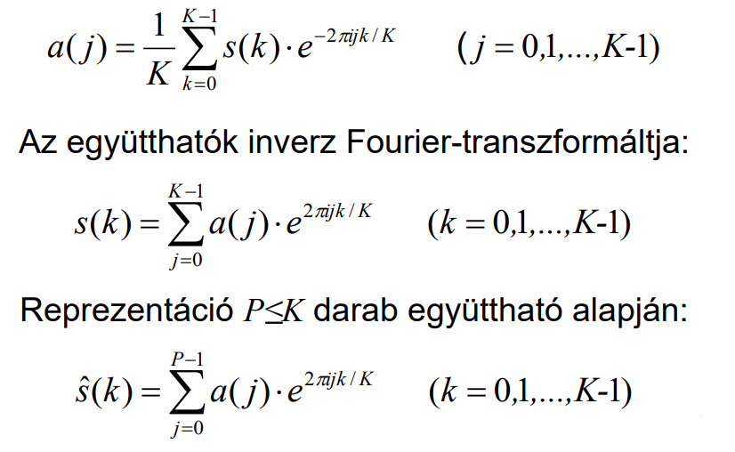

## Digitális képfeldolgozás

### 1. Simítás/szűrés képtérben (átlagoló szűrők, Gauss simítás és mediánszűrés); élek detektálása (gradiens-operátorokkal és Marr-Hildreth módszerrel).

> **Konvolúció**
> 
> 
> 
> Lényege, hogy van egy kernel (a képen "Convolution filter", egy mátrix), amit végigléptetünk egy nála nagyobb mátrixon. Minden egyes pozícióban a kernelben lévő számokat összeszorozzuk az "alattuk" lévő számokkal, a szorzatokat szummázzuk, utána ezt az eredményt egy harmadik (vagy a forrás mátrixal egyenlő méretű, vagy nem, attól függ mekkora méretű képet akarunk visszakapni) célmátrixba írjuk. Így a forrsáképen való végighaladás után kitöltődik az egész célmátrix.
> 
> (maszk=kernel)

#### Átlagoló szűrés

- **Zaj:** a képpont-intenzitások nemkívánatos változása

- Az átlagoló szűrés egy olyan technika, amit képek simítására, másszóval zajtalanítására használnak

- Lényege, hogy minden egyes pixelt a környezete (ebbe beleszámít a helyettesíteni kívánt pixel is) átlagával helyettesítünk

- Ezt egy olyan konvolúciós szűréssel éri el, ahol a kernel (vagy konvolúciós maszk) egy olyan mátrix, ahol az elemek összege mindig 1
  
  - Példák konvolúciós maszkokra:
    
    

- Pálda átlag szűrésre:
  
  

- Az átlag-szűrő hatása és tulajdonságai
  
  - a képpontok felveszik a környezetük átlagát
  
  - a szűrt kép intenzitásértékei a kiindulási kép intenzitástartományában maradnak
  
  - lineáris operátor (mivel a is konvolúció az)
  
  - haszna: csökkenti a zajt
  
  - kára: gyengíti az éleket, homályossá teszi a képet

- Szűrés a környezet súlyozott átlagával
  
  - Átlagolás: a környezetbe eső valamennyi pont intenzitása egyforma súllyal esik a latba.
    
    
  
  - Súlyozott átlag: a környezet intenzitásaihoz (általában a távolsággal arányosan csökkenő) súlyokat rendelünk
  
  - 

#### Medián szűrés

- Az [ a_1, a_2, …, a_2n+1 ] (páratlan elemszámú) szám-tömb mediánja a nagyság szerint rendezett tömb középső, (n+1)-dik eleme

- Az átlagoló szűréshez hasonlóan zajszűrésre használatos, viszont jobban megőrzi a fontosabb részleteket

- Ennél a szűrésnél is egy meghatározott méretű környezet van figyelembe véve, de itt nem a szomszédos pixelek átlagával, hanem a mediánjával helyettesíti az egyes pixeleket

- Illusztrálva:
  
  

- Alkalmazása:
  
  

- A medián-szűrés hatása
  
  - Megszünteti az egyedi (és a „kis” kiterjedésű) kiugrásokat
  
  - „Jobban” megőrzi az éleket, mint az átlagolás
  
  - „Nagy” kiterjedésű zajfoltoknál jel-elnyomó.

#### Gauss simítás

> **Pascal háromszög**
> 
> 

- Szintén zajszűrésre használatos

- A Gauss simítás alkalmazása egy képre nem más, mint konvolválni a képet a Gauss függvénnyel
  
  - A maszk egy ("harang alakú") Gauss görbét fog reprezentálni

- 1 dimenziós Gauss függvény
  
  - σ a szórást jelöli
    
    

- 2 dimenziós Gauss függvény
  
  

- Diszkrét közelítése a Pascal háromszög segítségével (attól függ hogy melyik szintjéből kell kiindulnunk, hogy mekkora maszkot akarunk)
  
  
  
  

- Példa Gauss szűrésre 3x3-as maszkkal:
  
  

#### Éldetektálás

> **Tangens függvény**
> 
> 
> 
> **Első rendű derivált**
> 
> Geometriai jelentése: az érintő iránytangense.
> 
> Elárulja, hogy a függvény hol nő és hol csökken és hogy milyen mértékben.
> 
> A derivált (meredekség):
> 
> - pozitív, ha a függvény nő,
> - negatív, ha csökken

**Éldetektálás Gradiens operátorokkal**

- A képen ott található él, ahol a kép-függvény valamely irány mentén hirtelen változik.
  
  
  
  

- Tipikus élprofilok
  
  

- Az első deriváltat felhasználhatjuk éldetektálásra: ahol kiemelkedőbb lokális maximuma (vagy minimuma) van az első deriváltnak, ott jó esélyel él található. A lokális minimumok miatt abszolútértéket szokás venni, így csak a maximumokra kell odafigyelni
  
  

- 2 dimenziós képnél parciális derivált használata: változások detektálása az _x_ és _y_ koordináta mentén
  
  - a két érték alapján tudjuk hogy hol vannak élek
    
    
  
  - Gradiens nagysága:
    
    
  
  - Gradiens iránya:
    
    

- Diszkrét gradiens operátorok:
  
  - Roberts operátor
    
    - a maszkelemek összege 0
    
    - könnyen számítható, de zajérzékeny
      
      
  
  - Prewitt operátor
    
    - a maszkelemek összege 0
      
      
  
  - Sobel operátor
    
    - a maszkelemek összege 0
    
    - simító hatással bír
      
      
  
  - Frei-Chen (izotropikus) operátor
    
    - a maszkelemek összege 0
      
      

- Gradiens maszk tervezése (x-irányban)
  
  
  
  - Feltételek:

$$
\text{1. Szimmeteria: } a_{1j} =a_{3j} \text{ (j=1,2,3)} \\
\text{2. Antiszimmetria: } a_{i1}=-a_{i3},\ a_{i1}>0\ \text{és }
a_{i2}=0\ \text{(i=1,2,3)}\\
\text{3. Nem reagál konstans régióra: } \sum_{i=1}^{3}\sum_{j=1}^{3}
a_{ij}=0\ \text{(Az elemek összege 0)}
$$

- 8-irányban élt kereső gradiens operátorok
  
  - Prewitt compass operátor
    
    
  
  - Robinson-3 compass operátor
    
    
  
  - Robinson-5 compass operátor
    
    
  
  - Kirsch compass operátor
    
    

**Laplace éldetektálás**

- Másodrendű derivált: az első rendű deriváltal szemben a nullán való áthaladás helyén lesz az él, nem a lokális maximumnál vagy minimumnál
  
  

- Kétváltozós függvény Laplace operátora: az _x_ szerinti és _y_ szerinti másdorendű deriváltak összege (a képen látható ahogy az összegből tényleg megkapjuk az összes élt)
  
  
  
  

- A Laplace operátor egy lineáris differenciál-operátor a másodrendű derivált közelítésére (a gradiens operátor önmagával vett belső szorzata)
  
  - Tulajdonságai:
    
    - forgásinvariáns
    
    - egyetlen maszkkal számítható
    
    - csak a magnitúdó számítható
    
    - duplán érzékelhet éleket
    
    - zajérzékeny
    
    

- Egy diszkrét Laplace operátor (A maszkelemek összege 0):
  
  

- A másodrendű derivált érzékeny a zajra -> hajtunk végre először Gauss simítást a képen

- Az Laplace operátor és a Gauss operátor is lineáris -> megspórolhatunk egy konvolúciót azzal, ha a Gauss operátoron alkalmazzuk a Laplace transzformációt, amiből egy új konvolúciós maszkot kapunk
  
  
  
  - A Gauss függvény Laplace transzformáltja (LoG – Laplacian of Gaussian)
  
  - "fordított sombrero"
    
    

- A LoG egy diszkrét közelítése:
  
  

**Marr-Hildreth éldetektor**

Lényege:

1. Konvolváljuk a képet egy (vagy több) alkalmas LoG függvénnyel.

2. Keressünk (közös) nulla-átmeneteket.
   
   (Nulla-átmenet ott van, ahol az adott pont egy „kis” (pl. 2x2-es vagy 3x3-as)
   környezetében pozitív és negatív értékek is előfordulnak.)
- Példa:
  
  - σ a szórást jelöli
    
    

- Nagyon lapos nulla átmeneteknél "fantom" élt is detektálhat
  
  

### 2. Alakreprezentáció, határ- és régió-alapú alakleíró jellemzők, Fourier leírás.

**Alakzat:** pontok összefüggő rendszere

A moduláris gépi látás általános modellje:

- Az alakreprezentáció módszerei:
  
  - az objektumot körülvevő **határ** leírása
  
  - az objektum által elfoglalt **régió** leírása
  
  - **transzformációs** megközelítés

#### Határvonal alapú tulajdonságok

- lánckód, alakleíró szám

- kerület, terület, kompaktság, cirkularitás,

- közelítés poligonnal,

- parametrikus kontúr, határvonal leíró
  függvény,

- meredekségi hisztogram,

- görbület, energia

- strukturális leírás

##### **Lánckód (chain code)**

- Az alakzat határpontjait követi, láncolja az óramutató járásával ellentétes irányban.

- **Határpont:** az alakzatnak olyan pontja, melynek van az alakzathoz nem tartozó 8-, ill. 4-szomszédja (4, ill. 8 irány esetén).

- Az elemi elmozdulások kódjai:
  
  

- Példa 8-as lánckódra:
  
  

**_<u>Normalizált lánckód</u>_**

Különböző kezdőpontok választása a lánckód ciklikusan permutált változatait eredményezi.

**Különbségkód:** a lánckód első deriváltja, a szomszédos elemek közötti elmozdulások száma.

**Normalizálás:** addig permutáljuk ciklikusan a különbségkódot, amíg a legkisebb értékű kódot (a legkisebb 4-es, ill. 8-as számrendszerbeli számot) kapjuk.

**Alakleíró szám:** a normalizált különbségkód (nem függ a kezdőpont választásától).

Normalizálás:

- Az első ábránál (lánckód: 1002335657):
  
  - Különbségkód:
    
    - ha a 8-irányos iránytűn az óramutató járásával ellentétesen haladunk, akkor 1-től 0-ig 7 lépésben tudunk eljutni (a lánckód első két elembéből számoljuk a különbségkód első elemét)
    
    - második számjegye a 0 és 0 közti távolság, vagyis 0
    
    - harmadik számjegye 0 és 2 távolsága, ami 2 (még mindig az iránytűn, óramutató járásának ellentétesen)
    
    - ez így megy végig, utolsó szám az elsőhöz lesz hasonlítva
  
  - Alakleíró szám: úgy kell rendezni a különbségkódot hogy a lehető legkisebb számot adják
    
    - mivel a 2 alakzat megegyezik, ezért mindkettő esetben ugyanaz lesz az alakleíró szám
    - invariáns a forgatásra is, ha a forgatási szög k·π/2

**A lánckód tulajdonságai**

- Előnyök (a mátrixos reprezentációval szemben):
  
  - kompakt (tömör),
  
  - eltolás-invariáns,
  
  - gyors algoritmus,
  
  - gyorsan rekonstruálható belőle az alakzat

- Hátrányok:
  
  - nem forgás-invariáns,
  
  - nem skála-invariáns
  
  - a pontosság legfeljebb pixelnyi lehet,
  
  - érzékeny a zajra

**Kerület számítása 8-as lánckódból**

##### Poligonok

**Egyszerű poligon területe:**

- trapéz területek számítása (negatívak és pozitívak)

**Kompaktság:** kompaktság = (kerület)^2 / terület

- Pl:
  
  

**Cirkularitás (körszerűség):** cirkularitás = 1 / kompaktság = terület / (kerület)^2

- maximális a körre: 1/(4π) ≈ 0.08

**Közelítés poligonnal**

**Leírás egyváltozós függvényekkel (signatures)**

- Pl. a súlypontnak a határtól vett távolságát a szög függvényében fejezi ki.

- Függ az alakzat méretétől és a határon vett kezdőpont megválasztásától, ezért a jellemző normalizálásra szorul.

**Csillag-szerű objektum**

- Van olyan pontja, amelyből induló tetszőleges irányú sugár a határt
  egyetlen pontban metszi.

- Az ilyen pont a csillag-szerű objektum magjához tartozik.

- 

**Strukturális leírás**

**Leírás generatív nyelvtanokkal**

Pl:

**Leírás összefűzött primitívekkel**

#### Régió alapú alakleírás

- befoglaló téglalap, rektangularitás

- főtengely, melléktengely, átmérő,
  excentricitás, főtengely szöge

- konvex burok, konvex kiegészítés,
  konkávitási fa, partícionált határ,

- vetületek, törés-költség

- topológiai leírások, Euler-szám,
  szomszédsági fa,

- váz,

- momentumok, invariáns momentumok

**Befoglalóló téglalap**

**Rektangularitás (téglalap-szerűség)**

- az alakzat területének és a minimális befoglaló téglalap területének a hányadosa

**Fő- és melléktengely**

- főtengely: az alakzaton belül haladó leghosszabb egyenes szakasz

- melléktengely: az alakzaton belüli, a főtengelyre merőleges leghosszabb egyenes szakasz
  
  

**Átmérő**

**Excentricitás:** a fő- és a melléktengely hosszaránya (főtengely/melléktengely)

**Főtengely szöge (az alakzat iránya):** a főtengely és az x-tengely által bezárt szög

**Konvex burok:** az alakzatot tartalmazó minimális konvex alakzat

**Konvex kiegészítés:** a konvex burok és az alakzat különbsége

**Konkávitási fa:**

- A fa gyökere a kiindulási alakzat, az első szinten a konvex különbség alakzatai helyezkednek el, melyekre a faépítést rekurzív módon folytatjuk.

- A fa elágazási pontjaiban lévő alakzatok nem konvexek, míg minden levélalakzat
  konvex.
  
  

**Partícionált határ**

- a határ partícionálható aszerint, hogy hol kezdődik, ill. fejeződik be a konvex kiegészítés valamely komponense
  
  

**Vetületek**

**Törés költség (break cost):** A törés költség meghatározásánál az egyik vetületet (pl. a függőlegeset) vesszük figyelembe. Ekkor egy oszlop költsége a benne található olyan egyesek száma, melyekhez az előző oszlop ugyanazon sorában is egyes található.

Pl.:

**Topológiai leírás**

- **Bináris kép:** kétféle érték (1: fekete, alakzat, komponens; 0: fehér, lyuk, háttér)

- **Komponens:** maximálisan összefüggő fekete halmaz (bármely két pontja összeköthető a halmazon belüli 4-, ill. 8 úttal) régió

- **Üreg:** a komplemens/negált kép egy véges komponense

**Euler-féle szám:** (komponensek száma) - (üregek száma)

**Euler szám poligonhálózatokra**

- lapok (face) száma: #F

- élek (edge) száma: #E

- csúcsok (vertex) száma: #V

- régiók, objektumok száma: #O

- üregek (cavity) száma: #C

- Euler szám: #F - #E + #V = #O - #C
  
  

**Összefüggőségi fa**

- A bináris képekhez rendelt irányított gráf, ahol:
  
  - minden egyes szögpont megfelel a kép egy (fehér vagy fekete) komponensének
  
  - a gráf tartalmazza az (X,Y) élet, ha az Xkomponens „körülveszi” a vele szomszédos Y komponenst.
  
  

**Az Euler-szám és az összefüggőségi fa**

- Nem kódolják a képeket, mivel számos képnek megegyezik az Euler száma és/vagy az összefüggőségi fája.

**Váz (skeleton):** A váz egy gyakran alkalmazott régió-alapú alakleíró jellemző, mely leírja az objektumok általános formáját.

- A váz meghatározásai:
  
  1. A váz a középtengely transzformáció (Medial Axis Transform, MAT) eredménye: a vázat az objektum azon pontjai alkotják, melyekre kettő vagy több legközelebbi határpont található.
     
     
  
  2. Préritűz-hasonlat: Az objektum határát (minden pontjában) egyidejűleg felgyújtjuk. A váz azokból a pontokból áll, ahol a tűzfrontok találkoznak és kioltják egymást. (Feltételezzük, hogy a tűzfrontok minden irányban egyenletes sebességgel, vagyis izotropikusan terjednek.)
     
     
  
  3. A vázat az objektumba beírható maximális (nyílt) hipergömbök középpontjai alkotják. Egy beírható hipergömb maximális, ha őt nem tartalmazza egyetlen másik beírható hipergömb sem. A beírható maximális (nyílt) hipergömbök egyesítése a kiindulási objektum egy lefedőrendszerét adja.
     
     

- Belső- és külső váz
  
  

- A váz:
  
  - Reprezentálja az objektum
    
    - általános formáját
    
    - topológiai szerkezetét és a
    
    - lokális objektum szimmetriákat
  
  - Invariáns
    
    - az eltolásra,
    
    - az elforgatásra és az
    
    - uniform skálázásra
  
  - Egyszerűbb szerkezet („vékony”, csökkenti a dimenziót).

- Váz gráf:
  
  

**Momentumok**

- Az alakjellemzésben a momentumok előnye:
  
  - számok,
  
  - többszintű képekre is értelmezettek,
  
  - invariánsak (a fontosabb geometriai transzformációkra).
  
  

**Súlypont**

**Centrális momentumok**

**Excentricitás**

**Főtengely szöge**

**Normalizált centrális momentumok**

**Invariáns momentumok és a geometriai transzformációk**

##### Transzformáción alapuló alakleírás

Transzformáljuk a határ K darab mintavételezett pontjából (mint komplex s(k) számokból) képzett s vektort. Az eredményül kapott a vektor (komplex a(k) együtthatók) adják a Fourier leírást. Az alakzat rekonstrukciójához az inverz Fourier-transzformációt kell végrehajtani.

A határpontok Fourier-transzformáltja:

Példa a Fourier leírásra:

- minél kevesebb Fourier deszkriptort használunk, annál kevésbé lesz pontos az inverz Fourier transzformációból előállított rekonstrukció

