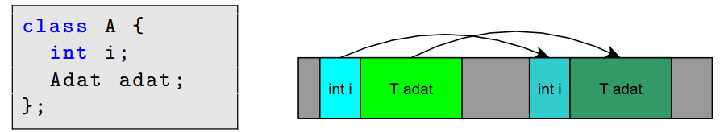
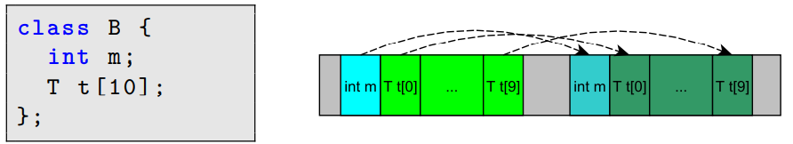
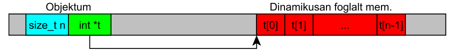
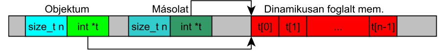
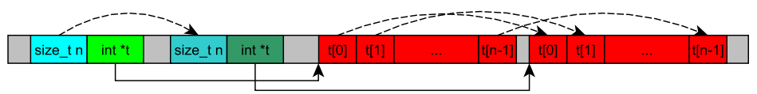

## Programozás 1 & 2

### 1. Objektum orientált paradigma, és annak megvalósítása a JAVA és C++ nyelvekben. Az absztrakt adattípus, az osztály. AZ egységbe zárás, az információ elrejtés, az öröklődés, az újrafelhasználás, és a polimorfizmus. A polimorfizmus feloldásának módszere.

#### Objektumorientáltág fogalma

Az **objektumorientált programozás** az objektumok fogalmán alapuló programozási paradigma. Az objektumok egységbe foglalják az adatokat és a hozzájuk tartozó műveleteket. Az adatokat ismerik mezők, attribútumok, tulajdonságok néven, a műveleteket metódusokként szokták emlegetni. Az objektum által tartalmazott adatokon általában az objektum metódusai végeznek műveletet. A legtöbb objektumorientált nyelv osztály alapú, azaz az objektumok osztályok példányai, és típusuk az osztály.

###### _`JAVA`_ nyelvben egy osztály deklaráció:

```java
public class Ember {
    String nev;
    int kor;
    boolean ferfi;

    public void koszon(){
        System.out.println("Szia! " + nev + " vagyok és " + kor + " éves, mellesleg " + (ferfi ? "férfi." : "nő."));
    }
}
```

> Az adott osztály tagjainak meg lehet adni a láthatóságát
> **`public:`** _mindenhonnan látható_ > **`protected:`** _a csomag, az osztály és az azokból származtatott gyermekosztályok látják_ > **`private:`** _csak maga az osztály látja_

###### _`C++`_ nyelvben egy osztály deklaráció:

```C++
class Kutya {
    int szul_ev; // adattag (attributum)
private:
    string szin, nev; // adattag (attributum)
public:
    void eszik() { // metodus (tagfuggveny)
        /* ... */
    }
    void elkeresztel(string s); // metodus deklaracio
}; // pontosvesszo!
```

> Az adott osztály tagjainak meg lehet adni a láthatóságát
> **`public:`** _Mindenki számára korlátozás nélkül elérhető_ > **`protected:`** _Csak az adott osztályból és a leszármazott osztályból érhető el_ > **`private:`** _Csak az adott osztályból érhető el_

#### Az absztrakt adattípus

Az adattípus leírásának legmagasabb szintje, amelyben az adattípust úgy specifikáljuk, hogy az adatok ábrázolására és a műveletek implementációjára semmilyen előírást nem adunk. Lehetőleg matematikai fogalmakat használva írjuk
le az adattípust (halmazok és ezeken értelmezett műveletek).

**Absztrakció:** Elvonatkoztatás. Segítségével privát implementációkat rejthetünk el egy nyilvános interfész mögé.

> Példa: java.util csomagban List interfész és az interfészt implementáló ArrayList, illetve LinkedList osztályok. Az absztrakció lehetővé teszi, hogy
> mindkét osztály példányait ugyanazon List interfész műveletein keresztül
> kezeljük.

#### Az osztály

Az osztály egy felhasználói típus, amelynek alapján példányok (objektumok) hozhatók létre. Az osztály alapvetően adat és metódus (művelet) definíciókat tartalmaz.

Az objektumok típusa, a **`class`** kulcsszóval definiáljuk.

Az osztály egyben egy absztrakt adattípus is

- Adatok és a rajtuk végzett műveletek egységbezárása
  _(encapsulation)_

**Osztály:** tulajdonság + viselkedés

Tulajdonság = **attribútumok** _(adattagok, mezők)_
Viselkedés = **operációk** _(metódusok, tagfüggvények)_

Új, egy osztályba tartozó objektumokhoz típus hozzárendelése: **`class`** kulcsszóval. Pl.:

```C++
class Alakzat { /* az osztály törzse */ }
// ...
Alakzat a = new Alakzat ();
```

Ez így önmagában még nem sok mindenre jó, testre kell szabni.

- Attribútum hozzáadása

- Operációk hozzáadása

> Osztály attribútuma (mezője, adattagja) lehet másik osztály típusú (referenciát tárol), létre kell hozni **`new`**-val _(inicializálás)_
> 
> ```C++
> class Alakzat {
>     int szin;
>     float terulet;
>     Koordinata xy;
> }
> ```

> Az operációk funkcionalitást biztosítanak az objektumoknak, meghatározzák, hogy milyen üzeneteket fogadhat.
> 
> - Részei: név, paraméterek, visszatérési típus, törzs
> 
> ```C++
> visszateresiTipus operacioNev( /* paraméter lista */ ) {
>     /* metódus törzs */
> }
> ```
> 
> Csak osztályoknak lehetnek operációi (metódusai).

#### Az egységbe zárás _`Encapsulation`_

Az adatok és a metódusok osztályba való összezárását jelenti. Tulajdonképpen az objektum egységbezárja az állapotot (adattagok értékei) a viselkedésmóddal (műveletekkel).

**Következmény:** az objektum állapotát csak a műveletein keresztül
módosíthatjuk.

#### Az információ elrejtés

Az objektum elrejti az adatait és bizonyos műveleteit. Ez azt jelenti, hogy nem tudjuk pontosan, hogy egy objektumban hogyan vannak az adatok ábrázolva, sőt a műveletek implementációit sem ismerjük. Az információk elrejtése az objektum biztonságát szolgálja, amelyeket csak a ellenőrzött műveleteken keresztül érhetünk
el.

#### Az öröklődés

> Olyan osztályok között értelmezett viszony, amely segítségével egy általánosabb típusból (ősosztály) egy sajátosabb típust tudunk létrehozni (utódosztály). Az utódosztály adatokat és műveleteket (viselkedésmódot) örököl, kiegészíti ezeket saját adatokkal és műveletekkel, illetve felülírhat bizonyos műveleteket. A kód újrafelhasználásának egyik módja. Megkülönböztetünk egyszeres és többszörös
> örökítést.

Osztályok közötti kapcsolat (reláció), ahol egy osztály megosztja a
struktúráját és/vagy a viselkedését egy vagy több másik osztállyal

A származtatott osztály örököl az ősosztály(ok)tól

Az attribútumokat és operációkat a lehető legfelsőbb szinten kell
definiálni

> A származtatott (gyerek) osztály mindent örököl az őstől (relációkat
> is) és kiegészítheti ezeket sajátokkal

A származtatott osztály egy örökölt operáció saját implementációját
is nyújthatja: polimorfizmus _(felüldefiniálás, overriding)_

Az öröklődés relációnak nincs neve, multiplicitása

> Tipikus öröklődési szintek száma: 3-5

Az újrafelhasználhatóság egyik alapeszköze

Öröklődés feltárása:

- általánosítás

- specializálás


###### Java

```java
public class SzulinapiTorta extends Torta {
    private int gyertyakSzama;

    public SzulinapiTorta(int szelet, String iz, int gyertyakSzama) {
        super(szelet, iz);
        this.gyertyakSzama = gyertyakSzama;
    }

    public void kivansagotTeljesit() {
        System.out.println("Kívánságod teljesült!");
    }

    public void info() {
        System.out.println("Ez a szülinapi torta " + this.getIz() + " ízű, és "
                + this.szelet + " szeletes." + this.gyertyakSzama
                + " db gyertya van rajta");
    }

}
```

A `super` kulcsszóval érhető el az ős konstruktora

`extends` kulcsszóval érhető el az öröklődés

###### C++

```c++
class PhD_hallgato : public Hallgato {
  unsigned oktatott_oraszam;
public:
  PhD_hallgato(const std::string nev, unsigned felvett_oraszam, unsigned oktatott_oraszam) :
    Hallgato(nev, felvett_oraszam),
    oktatott_oraszam(oktatott_oraszam) {}

  unsigned get_oktatott_oraszam() const { return oktatott_oraszam; }

  void orat_tart() const {
      std::cout << "Orat tart a PhD_hallgato" << std::endl;
  }
};
```

> Öröklősésnek is van láthatósága: Azt mondja meg, mi legyen a minimum láthatósága az örökölt adattagoknak / metódusoknak. Pl. ha az ősben private volt, de `private` az öröklődés, ugyan az az adattag a leszármazottban `private` láthatósággal lesz jelen.

###### Többszörös öröklődés

> Példa: a kétéltű jármű egy motorgépjármű (ami egy jármű) és egyben
> egy vízi jármű is (ami ugyancsak egy jármű)


Problémák adódhatnak, például:

- név ütközések

- többszörösen örökölt operációk, attribútumok

Megoldható: C++ virtuális öröklődés

Kevésbé karbantartható kódhoz vezet

Csak akkor szabad használni, ha tényleg szükséges, de akkor is csak
nagy odafigyeléssel

> Java-ban nincs rá lehetőség

**C++ példa többszörös öröklődésre:**

```c++
class Vizijarmu
{
public:
  const int max_merules;
  Vizijarmu(int m) : max_merules(m){};
};

class Legijarmu
{
public:
  const int max_magassag;
  Legijarmu(int m) : max_magassag(m){};
};

class Hidroplan : public Vizijarmu, public Legijarmu
{
public:
  Hidroplan(int me, int ma) : Vizijarmu(me), Legijarmu(ma){}; // konstr . inic . listaban a konstruktorok meg van hivva
};
```

#### Az újrafelhasználás

A objektum-orientált programozás egyik alapelve az újrafelhasználás.

Aggregáció, kompozíció

- Rész-egész kapcsolat

- Az újrafelhasználás során „módosítás nélkül” felhasználunk egy már meglévő típus

- „C-ben is létezett”

#### Polimorfizmus **`Többalakúság`**

Egy típuselméleti fogalom, amely szerint egy ősosztály típusú változó hivatkozhat ugyanazon közös ősosztályból származó _(vagy ugyanazon interfészt megvalósító)_ osztályok példányaira.

A polimorfizmus lehet **statikus** és **dinamikus**.

**statikus polimorfizmus:** metódusok túlterhelése, függvénysablonok, osztálysablonok. Satikus, fordításidejű kötés.

**dinamikus polimorfizmus:** metódusok felülírása. Dinamikus, futásidejű kötés.

```C++
class Alakzat {
    public void rajzolj() {/*A*/}
}
class Haromszog extends Alakzat {
    public void rajzolj() {/*H*/}
}
class Negyzet extends Alakzat {
    public void rajzolj() {/*N*/}
}
class Kor extends Alakzat {
    public void rajzolj() {/*K*/}
}
```

```C++
public class AlakzatPelda {

    static void csinald(Alakzat a) {
    // ...
        a.rajzolj();
    }


    public static void main(String[] args) {
        Kor k = new Kor();
        Haromszog h = new Haromszog ();
        Negyzet n = new Negyzet();

        csinald(k);
        csinald(h);
        csinald(n);
     }
}
```

#### A polimorfizmus feloldásának módszere

**Kései kötés**: Futásidőben dől el, melyik metódust kell meghívni, nem statikusan fordításkor (statikus kötés).

Ilyenkor a virtuális függvény táblából lookup-olja a nyelv, hogy melyik metódust kell meghívni (persze csak ha megfelelően virtual az ősben a metódus, és a leszármazott signature-je megegyezik), felismeri, hogy az átadott paraméter egy leszármazott, és a VFT (virtual function table)-ből megszerzi a helyes függvény pointert.

### 2. Objektumok életciklusa, létrehozás, inicializálás, másolás, megszüntetés. Dinamikus, lokális, és statikus objektumok létrehozása. A statikus adattagok és metódusok, valamint szerepük a programozásban. Operáció, és operátor overloading JAVA és C++ nyelvekben. Kivételkezelés.

#### Objektumok életciklusa, létrehozás, inicializálás, másolás, megszüntetés

<mark>_C++_</mark>

**Osztályok példányosítása**

- Az osztályok példányosításával objektumokat hozhatunk létre, aminek adattagjai vannak

- Általában ezeket az adattagokat inicializálni kell az objektum létrejöttekor

- Hasonlóan az objektum megszűnésekor is lehetnek olyan műveletek, amelyeket végre kell hajtani (például memória felszabadítása)

- Az osztálynak definiálhatunk **konstruktort**, amely az osztály példányosításakor fut le
  
  - A neve meg kell egyezzen az osztály nevével
  
  - Nem lehet visszatérési típusa
  
  - Nem hívható közvetlenül, automatikusan hívódik
  
  - Nem lehet `const`, `static`
  
  - Megadhatjuk a láthatóságát
  
  - Lehetnek paraméterei
  
  - Lehet több konstruktor is
    
    - Operator overloading

- A paraméter nélküli konstruktort default konstruktornak hívják
  
  - Ha nem adunk meg, akkor a fordító generál default-ot

```cpp
class Complex {
    double real , imag ;
    public :
        // default constructor
        Complex () {
            real = 0;
            imag = 0;
        }
        // parameteres konstruktor
        Complex ( double real , double imag ) {
            this - > real = real ;
            this - > imag = imag ;
        }
};
int main () {
    Complex c0 ; // a default konstruktor hivodik
    Complex c (3 , 2) ; // a parameteres konstruktor hivodik
}
```

- Az adattagokat a konstruktor inicializáló listában kell (lehet)
  inicializálni
  
  - A paraméter lista után kettőspont (:)
  
  - Majd az adattagok felsorolva és zárójelben az értékük, a felsorolást vesszővel kell elválasztani
  
  - Az adattagok abban a sorrendben kapnak értéket, ahogy az osztályban definiálva vannak

```cpp
class Kutya {
    string nev ;
    const int szul_ev ;
public :
    Kutya ( const string& nev , int szul_ev ) :
        nev ( nev ) , szul_ev ( szul_ev ) {
    }
};
```

- Delegating konstruktor: Az egyik konstruktorból meg lehet hívni a másikat

```cpp
class Complex {
    double real , imag ;
public :
    Complex () : Complex (0 , 0) {
    }
    Complex ( double real , double imag ) :
        real ( real ) , imag ( imag ) {
        /* hosszu , bonyolult algoritmus */
    }
};
```

- Lehet privát is a kontruktor

- Dinamikus példányosítás (`new`) esetében is automatikusan hívódik a megfelelő konstruktor

**Destruktor**

- A destruktor az objektum megszűnésekor fut le, automatikusan hívódik

- Neve meg kell egyezzen az osztály nevével, csak egy tilde van előtte

- Nincs visszatérési típusa

- Nincsenek paraméterei

- Csak egy destruktor lehet (ha nem írunk akkor a fordító automatikusan generál)

- Láthatóságát ugyanúgy lehet szabályozni

```cpp
class Kutya {
    string nev ;
public :
    Kutya ( const string & nev ) : nev ( nev ) {
        cout << " Constructor : " << nev << endl ;
    }

    ~ Kutya () {
        cout << " Destructor : " << nev << endl ;
    }
};
```

- Törlés (`delete`) esetében automatikusan hívódik a destruktor
  
  ```cpp
  delete kutya;
  ```

**Obektum életciklusa**

- Amikor egy osztályt példányosítunk, akkor létrejön egy objektum, és lefoglalódik annyi memória, amennyi az objektum tárolásához szükséges
  
  - A memóriafoglalás automatikus
    
    - (Kivétel az` operator new ( size_t size , void∗ ptr )` - lefoglalja a memóriát, de nem hívja meg az osztály konstruktorát)

- A memória lefoglalása után megtörténik az objektum inicializálása

- A megfelelő konstruktor meghívódik
  
  ```cpp
  class Ember {
      int ev ; // 1. erteket kap
      string nev ; // 2. meghivodik a megfelelo konstruktor
  public :
      Ember (int ev , string nev ) : ev ( ev ) , nev ( nev ) {
          // 3. vegrehajtodik a konstruktor torzse
      }
  };
  ```

- Objektum megszűnése
  
  - Ugyanazok a lépések játszódnak le, csak „visszafele”
    
    - Destruktor lefutása
    
    - Objektum megszűnése (adattagok megszűnése létrehozással ellentétes sorrendben, azok destruktora is meghívódik)
    
    - Memória felszabadul

**Objektum másolása**

- A fordító által készített „másolás” az objektumot másolja le
  
  - Az adott memóriaterületet másolja

- Két adattag (ahol az Adat „másolható”)
  
  

- Nem dinamikusan foglalt tömb (T „másolható”)
  
  

- A fordító által készített „másolás” az objektumot másolja le, nem ismeri az osztály logikáját
  
  

- A Tomb példa esetében nem elég lemásolni az adattagokat, mert akkor a dinamikusan foglalt memória terület közös lesz
  
  
  
  - Ha az egyik tömbjét írjuk, akkor a másik is változi
  
  - Ha az egyik Tomb objektum megszűnik, akkor felszabadítja az általa foglalt memóriát

- Ha az objektum „külső erőforrást” is használ, amit az objektum allokált, akkor a másolatnak is biztosítani kell ezt az erőforrást (A Tomb esetében minden objektumnak saját dinamikusan foglalt memóriaterülettel kell rendelkeznie)

- Erőforrást (pl. memóriát) nekünk kell lefoglalni, ha kell felszabadítani is
  
  

- Megoldás: másoló konstruktor és értékadó operátor
  
  - céljuk megegyezik, érdemes együtt kezelni őket
  
  - ha az egyik megvalósítjuk, valósítsuk meg a másikat is

- Példa másoló konstruktor és értékadó operátorra:

```cpp
class Tomb {
    int * t ;
    size_t n ;
public : // Tomb ( size_t n); ~ Tomb (); int& operator []( int i)
    Tomb(const Tomb& o) : t(new int[o.n]), n(o.n) {
        for (int i = 0; i < n; i++)
            t[i] = o.t[i];
        }
    }

    Tomb& operator=(const Tomb& o) {
        if (this == &o) // t1 = t1; miatt kell !!!
            return *this;
        delete[] t; //objektum altal mar foglalt memoria felszabaditasa
        t = new int[o.n];
        n = o.n;
        for (int i = 0; i < n; i++)
            t[i] = o.t[i];
        return *this;
    }
};
```

_<mark>Java</mark>_

> **Memória felosztása**
> 
> Regiszterek: processzoron belül, gyors
> 
> Stack: stack pointeren keresztül direkt elérésű memória a RAM-ban
> 
> Heap: általános célú memória a RAM-on belül
> 
> Static / Constant storage: konstans értékek helye valamint maga a kód
> 
> Non-RAM storage: programon kívüli adatok

**Objektumok életciklusa**

- Objektumok tárolási helye:
  
  - stack: automatikus és gyors, de nem mindig megfelelő
  
  - static: statikus, nem flexibilis de gyors
  
  - heap: dinamikus, futás-közbeni, lassúbb

- Felszabadítás
  
  - stack: automatikus
  
  - static: automatikus
  
  - heap: Javaban ez is automatikus

- Javaban az objektumok mindig a heap-ben keletkeznek (kivéve a primitív típusokat)

- Létre kell őket hozni (`new `kulcsszóval)

- Felszabadítás
  
  - automatikus: garbage collector (szemétgyűjtő)
  
  - biztonságos, könnyebb a kezelés, de sokkal lassúbb

- Objektum létrehozása szintén **konstruktor**ral
  
  - neve = az osztály neve
  
  - garantált inicializálás objektum létrejöttekor
  
  - nincs visszatérése érték, de paraméterek lehetnek

```java
class Alakzat {
    /* attribútumok */
    ...
    Alakzat() {
        /* inicializáló kód */
        szin = 0;
        terulet = 0f;
        xy = new Koordinata(0, 0);
    }
}
```

- A `new` operátor
  
  - `new <OsztályNév>(<argumentumlista>)`
  
  - Létrehoz egy új OsztályNév osztályú objektumot
  
  - lefoglalja számára a szükséges memóriát
  
  - meghívja az osztálynak a konstruktorát
  
  - visszaadja az új objektumra mutató referenciát

- Az objektum osztályát utólag megváltoztatni nem lehet

- A garbage collector nem minden takarítást tud elvégezni
  
  - `new `nélküli memóriafoglalás (pl. natív metódus által (pl C kód hívása, nem JVM-be fut))
  
  - Segítség: `finalise()`
    
    - takarítás előtt hívódik
    
    - nem destruktor!!

- Kiszámíthatatlan hogy a szemétgyűjtő mikor hívódik, a mindig végrehetandó feladatokat ne a `finalise()` - ba tegyük

**Objektum másolása**

- objektum referenciáknál csak referenciamásolás (igazi objektum másolás: `clone() `metódussal)

- DE, a `clone()` metódus csak sekély (shallow) másolatot csinál, mély (deep) másoláshoz itt is copy construktor megadása a célszerű

#### Dinamikus, lokális és statikus objektumok létrehozása.

_<mark>C++</mark>_

**Dinamikus objektumok**

- a `new` kulcsszóval hozhatunk létre dinamikus objektumot, majd a `delete` kulcsszóval szabadíthatjuk fel

**Lokális objektumok**

- Ha egy függvény (metódus, operátor, ...) valamelyik blokkján belül hozunk létre objektumot, akkor a létrehozástól a blokk végéig fog élni (Dinamikus (`new`) és statikusan (`static`) különbözik)

**Statikus objektumok**

- A blokk elhagyásakor sem szűnik meg az értéke
  
  - Második hívásnál is ugyanazt az objektumot használom
  
  - Nem úgy viselkedik, mint a lokális változók

- Az „első használatkor” jön létre
  
  - Automatikusan történik a memória foglalás és inicializálás

- A program futásának végén szűnik meg (destruktor meghívódik)

- A static memória területen jön létre (a veremtől (stack) és a kupactól (heap) eltérő)

- Statikus globális scope-ban található objektum mást jelent

_<mark>Java</mark>_

**Dinamikus objetumok**

- `new` kulcsszóval kerül létrhozásra, felszabadítása automatikus (garbage collector)

**Lokális objektumok**

- Hasonlóan mint `C++`-nál, a lokálisan létrehozott objektum a blokk végéig fog élni

**Statikus objektumok**

- Az osztályoknak létezhetnek statikus adattagjai, amik objektumok is lehetnek

- Ez az osztály példányosítása nélkül is elérhető, mivel nem az objektumokhoz, hanem magához az osztályhoz tartozik

#### Statikus adattagok és metódusok

_<mark>C++</mark>_

**Statikus adattagok**

- A statikus memória területen tárolódik

- Csak egy darab van belőle

- Az objektumok osztoznak rajta, példányosítás nélkül is elérhető

**Statikus metódusok**

- Csak a statikus tagokat használhatja

- Nem hivatkozhat a `this`-re

- Nem lehet virtuális vagy konstans (`const`)

_<mark>Java</mark>_

**Statikus adattagok**

- ugyanaz mint `C++`-nál

- egy darab él belőle és a statikus memóriaterületen tárolódik

- az egyes objektumok osztoznak rajta

**Statikus metódusok**

- csak a többi osztálytagot látja

- nem hivatkozhat `this`-re

- meghívható anélkül, hogy az osztályából objektumot hoznánk létre

- Kezdetben még nincsenek objektumok, így csak statikus metódusokat
  hívhatunk, ezért statikus a `main` is
  
  - `public static void main(String[] args)`

- Statikus metódust nem lehet felüldefiniálni

#### Operáció és operátor overloading

_<mark>C++</mark>_

**Operator overloading**

- Lehetőségünk van az operátorokat is kiterjeszteni osztályra

- A bináris operátor egyik operandusa az adott osztály

- Az unáris operátort az adott objektumra alkalmazzu

- Pre és poszt inkrementális operátor
  
  - Pre inkrementális: `Compl& operator++()`
  
  - Poszt inkrementális: `Compl operator++(int)`
  
  - A poszt inkrementális operátornak van egy `int` paramétere

- A konverziós operátort is ki lehet terjeszteni
  
  - Azt mondjuk meg, hogy az adott típusunkat hogyan konvertáljuk másik típussá
  
  - Az operátornak „nincs visszatérési típusa” (Értelemszerűen az a típus, amire konvertálni akarunk)
  
  - Deklaráláskor az `explicit` kulcsszót használhatjuk ha nem akarjuk hogy váratlan konvertálás történjen

```cpp
//explicit kulcsszo hasznalata
class Compl {
    double real , imag ;
public :
    Compl ( double r , double i ) : real ( r ) , imag ( i ) { }
    explicit Compl ( double r ) : Compl (r , 0) { }
    explicit operator double () const { return real ; }
};
```

```cpp
//pelda a '+' operator kiterjesztesere
class Compl {
    double real , imag ;
public :
    Compl ( double r , double i ) : real ( r ) , imag ( i ) {
    }
    Compl operator +( const Compl & c ) const {
        Compl res ( real + c . real , imag + c . imag ) ;
        return res ;
    }
    Compl operator +( int i ) const {
        Compl res ( real + i , imag ) ;
        return res ;
    }
};
```

_<mark>Java</mark>_

**Operator overloading**

- Jelenleg a `Java` nem támogatja

#### Kivételkezelés

_<mark>C++</mark>_

**Kivételkezelés**

- A program futása során történhetnek kivételes események, futási
  hibák, amik a normál működést akadályozzák, például
  
  - Megszakad a hálózati kapcsolat
  
  - Elfogy a memória, merevlemezen a hely
  
  - Nincs írási jogunk egy mappára

- C++-ban megjelent a magasszzintű kivételkezelési mechanizmus

- Kivételkezelés kulcsszavai
  
  - `throw`: segítségével dobhatunk kivételt
  
  - `try`: védett régió: a blokk, amiben keletkezhet kivétel
  
  - `catch`: kivételt kezelő kódrészlet; több is lehet belőle
  
  - `noexcept`: függvény fejlécében jelezhetjük, hogy a függvény dobhat-e
    kivételt (a `noexcept` kulcsszó azt jelzi hogy nem)
  
  - `throw ( )`: függvény fejlécében jelezhetjük, hogy a függvény milyen
    típusú kivételeket dobhat

- Különválik a tényleges kód és a hibakezelés

- Kivétel osztályokból is készíthető hierarchia, öröklődés, stb.

- Különböző kivétel osztályok vannak, sajátot is írhatunk

- Egymás utáni catch ágakkal többféle kivételt is dobhatunk, ezzel többféle hibát lekezelhetünk különböző módokon (több `catch` ág használata)

- Próbáljunk minél specifikusabb kivételeket elkapni

- `nothrow` kulcsszó: használhatjuk ha például nem akarunk minden memóriafoglalást `try-catch` blokkba kapnim és helyette csak egy `nullptr`-t akarunk visszakapni sikertelen foglaláskor

- Konstruktornak is lehet `catch `ága, hogyha a konstruktor inicializáló listába keletkező kivételeket akarjuk kezelni (destruktornak is ugyanígy)

- Függvény blokkja helyett használhatunk `try` blokkot, aminek lehet több `catch `ága

```cpp
int foo (int n ) try {
    ++ n ;
    throw 5;
} catch (int) {
        ++ n ; // n lathato ebben a blokkban is !!!
        return n ;
} catch (...) {
        // hibakezeles
        // visszateres nelkul nem def . viselkedes
}
```

_<mark>Java</mark>_

**Kivételkezelés**

- A `Java` hibakezelése a `C++`-én alapul

- ugyanúgy try-catch blokkokat használhatunk

- Kivétel dobásakor a heap-en jön létre az objektum

- az aktuális programvégrehajtás megáll és a kivétel objektum referenciája „eldobódik”

- a kivételkezelő mechanizmus veszi át az irányítást és a hívási veremben keres egy megfelelő kivételkezelőt, amely lekezeli a hibát és ott folytatja a program végrehajtását

```java
try {
    // "normál kód", amelyben kivétel keletkezhet
    // (védett régió)
} catch (ExceptionType1 e1) {
    // hibakezelő kód az e1 kivételre
} catch (ExceptionType2 e2) {
    // hibakezelő kód az e2 kivételre
    throw e2; // tovább is lehet dobni
} catch (Exception e) {
    // hibakezelő kód az összes (megmaradt) kivételre
} finally {
    // végül (mindig lefut)
}
```

- Java-ban meg kell adni, hogy egy metódus milyen kivételeket dobhat a throws kulcsszóval (ez része a metódus-deklarációnak)

- Ősosztály: Throwable, két leszármazottja van:
  
  - Error: általában nem kell vele foglalkozni (fordítási időbeni- és
    rendszer hibákat képvisel)
  
  - Exception: a Java programozó számára ez az „ősosztály”

- `try-with-resources`
  
  - Lehetőség van egy-egy erőforrás létrehozására a try statementben közvetlen
  
  - Tipikusan valamilyen külső erőforrás (pl. fájl) kezelésekor használatos, amelyet le kell zárni használat után
  
  - catch és finally blokkok csak ezután hívódnak meg

```java
static String beolvas(String path) throws IOException {
    try (BufferedReader br = new BufferedReader (new FileReader (path))) {
        return br.readLine();
    }
}
```

### 3. JAVA és C++ programok fordítása és futtatása. Parancssori paraméterek, fordítási opciók, nagyobb projektek fordítása. Absztrakt-, interfész-, és generikus osztályok, virtuális eljárások. A virtuális eljárások megvalósítása, szerepe, használata.

#### Java program fordítása és futtatása

Java program futtatásához szükség van JVM-re, ami a Java Virtual Machine. A Java forrás ugyanis egy köztes kódra fordul, ami architektúra függetlenül (de Java verziótól függő lehet) a JVM futtat.

Ezek ellenére a JIT compilerrel lefordítható a Java forrás natív gépi kódra.

Fordítás: `javac HelloWorld.java`

Ennek outputja `HelloWorld.class` file, ezt futtatni a `java HelloWorld.class` paranccsal lehet.

> Itt a JVM futtat (`java` parancs)

> JIT compilation automatikusan történik a gyakran használt kód elemekre.

##### Nagyobb projektek fordítása

Sok file, összetett projekt struktúra esetén nem jó megoldás simán a `javac` paranccsal fordítani

Ekkor érdemes használni egy build rendszert, pl.: **maven**, vagy **grandle**

Érdemes alkalmas fejlesztői környezetet is választani, gyakran a build rendszerek a fejlesztői környezetek felületéről kezelhetőek. Pl. IntelliJ esetén.

> - **mvn clean:** Cleans the project and removes all files generated by the previous build.
> - **mvn compile:** Compiles source code of the project.
> - **mvn test-compile:** Compiles the test source code.
> - **mvn test:** Runs tests for the project.
> - **mvn package:** Creates JAR or WAR file for the project to convert it into a distributable format.
> - **mvn install:** Deploys the packaged JAR/ WAR file to the local repository.
> - **mvn deploy:** Copies the packaged JAR/ WAR file to the remote repository after compiling, running tests and building the project.
> 
> `pom-xml`-ben projekt adatai, dependencyk

##### Fordítási (és futtatási) opciók

`javac`:

- `-g`: Debugging információk generálása

- `-nowarn`: Warning üzenetek kikapcsolása

- `-verbose`: Információt logol a compiler tevékenységeiről

- `-Werror`: Fordítási folyamat terminálása, ha egy warning történik

- `javac -version`

> https://docs.oracle.com/en/java/javase/13/docs/specs/man/javac.html

`java`

- `-version`

- `-jar filenév`: Futtat egy `.jar` fileba enkapszulált Java programot

- `-verbose:class` egyek class-ok betöltéséről logol információkat

- `-verbose:gc` Garbage Collection eventekről logol információkat

- Opciók megadása után felsorolhatjuk a programunk parancssori paramétereit

> https://docs.oracle.com/en/java/javase/13/docs/specs/man/java.html
> 
> https://docs.oracle.com/en/java/javase/13/docs/specs/man/java.html#overview-of-java-options

##### Parancssori paraméterek

```java
public class HelloWorld {
    public static void main(String[] args) {
        // args-ban
    }
}
```

> Argumentumok száma: `args.length`

Más nyelvekkel ellentétben a **0. indexű argumentum nem a futtatott file neve**, hanem ténylegesen az első argumentum

#### C++ program fordítása és futtatása

Java-val ellentétben nem egy virtuális gép kódjára fordul, hanem natív gépi kódra.

Fordítás: `g++ main.cpp`

Output: `a.out` bináris, ezt futtathatjuk: `./a.out`

##### Nagyobb projektek fordítása

Nagyobb projektek esetén ugyan az a helyzet, mint Java-nál, nem ideális egy `g++` parancshoz felsorolni a linkelendő egységeket.

Használjunk egy build rendszert, mint a Visual Studio-é, vagy `make`-et.

##### Fordítási opciók

`-o`: Kimeneti file nevének specifikálása

`-Wall`: Minden warning mutatása

`-lm`: Matematikai függvénykönyvtárak linkelése

> Preprocesszor $\to$ Fordítás assemblyre $\to$ Fordítás gépi kódra (assembler) $\to$ Linker (szerkesztés, futtatható állomány előállítása az egységekből)

##### Parancssori paraméterek

```cpp
int main(int argc, char* argv[]) {
  // ...
  return 0;
}
```

`argc`: Argumentumok száma

`argv`: Argumentumok tömbje

> 0. indexen a file neve áll!

#### Java absztrakt-, interfész-, generikus osztályok

##### Absztrakt osztályok

Amikor egy osztályban nem feltétlen szükséges implementálni egy metódust, csak az azt öröklő osztályokban.

Ekkor megjelölhetjük a metódust, mint `abstract` metódus. Viszont ekkor maga az egész osztály is `abstract` kell, hogy legyen.

> Minden osztály `abstract`, ha van legalább egy `abstract` metódusa, de nem kell, hogy legyen, egy osztály `abstract` metódus nélkül is lehet `abstract`.

Ekkor ezt az `abstract` **metódust nem implementáljuk**, és ez az **osztály nem példányosítható** (azaz nem lehet meghívni a konstruktorát).

> De az őt öröklő osztályok konstruktorából meg lehet hívni (`super`), így lehet konstruktora, közös logikákat lehet bele szervezni.

`abstract` metódus nem lehet:

- `private`: Mivel ha nem érik el a gyerekek, akkor nem is tudják felülírni. Csak esetleg egy ugyan olyan signature-jű metódust létrehozni, de nem lesz override.

- `final`: Mivel a `final` metódusok nem overridolhatók.

###### Példa

```java
abstract class Hangszer {
    abstract public void szolj(Hang h);
}
```

A _hangszer_ mint olyan egy absztrakt fogalom, nem tud egy adott hangon _szólni_. Viszont mondjuk a belőle öröklő cselló már tud cselló hangon szólni:

```java
public class Csello extends Hangszer {
    @Override
    public void szolj() {
        System.out.println("csellohang");
    }
}
```

> Az `@override` annotáció segít olvasni a kódot, illetve ha valójában nem is egy override a metódus, akkor szól a linter / fordító.

##### Interfészek

Akkor használjuk, ha minden metódus `abstract`.

`class` helyett `interface` kulcsszó

Megkötések:

- Nem lehet konstruktora

- Metódusok impliciten `public abstract`-ok.

- Adattagok impliciten `public static final`-ök.
  
  - `public`: Mivel nem példányosítható, valószínűleg ezt szeretnénk, bár a `protected` is elképzelhető.
  
  - `static`: Mivel nem példányosíthatóak, nem lehet őket objektumhoz (példányhoz) kötni, csak osztályhoz.
  
  - `final`: Mivel nincs konstruktor, mindenképpen legyenek inicializálva.

Leírja, milyen módon lehet használni az őt implementáló osztályokat. De csak a működés lehetőségeit írja elő, az implementáció az öröklő osztályokban van.

> Visszafelé kompatibilitási okok miatt lehetséges az interface-ben törzset is adni (implementációt) az osztályoknak, de ez csak akkor jelentős, ha meglévő ködbázisokban használt interfacen akarunk módosítani (nem biztos, hogy az új metódust implementálják a másik kódbázis osztályai). Ez a `default` kulcsszóval lehetséges a metódus signaturejében.

###### Példa

```java
interface Hangszer {
    void szolj(Hang h); // impliciten public és abstract
}
class Zongora implements Hangszer {
    public void szolj(Hang h) {
        System.out.println("zongorahang");
    }
}
```

##### Generikus osztályok

Generikus: **típus paraméter**

Szintaxis:

- `interface InterfeszNev<T> {...}`
- `class OsztalyNev<T> {...}`
- `<T> T fuggvenyNev(T p);`

Használatkor hasonlóan kacsacsőrök között tudjuk megadni a konkrét típust, amit alkalmazni szeretnénk:

```java
OsztalyNev<Long> i = new OsztalyNev<Long>(new Long(1));
```

> Csak referenciatípus lehet, primitív, pl. `int` nem. (De `Integer` igen)

###### Példa

```java
class Generikus<E> {
  private E x;
  public Generikus(E x) {
    this.x = x;
  }
  public E getX() {
    return x;
  }
  public void setX(E x) {
    this.x = x;
  }
}
class GenMetodus {
  public String toString() {
    return "GenMetodus";
  }
  <T> T f(T p) {return p;}
}
class GenericsPelda {
  public static void main(String[] args) {
    //Generikus<long> a1 = new Generikus<long>(1);  // forditasi hiba
    Generikus<Long> a1 = new Generikus<Long>(new Long(1));
    Generikus<String> a2 = new Generikus<String>("egy");
    GenMetodus b = new GenMetodus();
    Generikus<GenMetodus> a3 = new Generikus<GenMetodus>(b);
    System.out.println(b.f("valami"));
    System.out.println(b.f(9));
  }
}
```

###### Példa beépített generikus osztállyal

```java
List<String> strings = new ArrayList<>();

//... add String instances to the strings list...

for (String aString : strings) {
    System.out.println(aString);
}
```

#### C++ virtuális metódusok, absztrakt osztályok, templatek

##### Virtuális metódusok

Alapvetően (`virtual` kulcsszó nélkül) C++-ban nem valósul meg polimorfikusság. Hiába egyezik meg a metódus signature-je teljesen az ősével, ha egy függvény az ős szerint vár paramétert, az az ős-beli metódust fogja meghívni.

> Ennek az az oka, hogy ilyenkor statikus kötés történik, a fordító azt látja, hogy `Hangszer`-t vár a metódus, így statikusan aként adja át a `Csello` példányt is.

> Ekkor fordítási időben eldől a típus.

Ez virtualizációval módosítható.

Az ősben azokat a metódusokat, amelyeket felül szeretnénk definiálni egy leszármazottban, meg kell jelölni `virtua` kulcsszóval. Ezek a metódusok már polimorfikusak lesznek.

> Ekkor csak futási időben dől el a típus.

`override` kulcsszó: hasonló a Java-féle annotációhoz, jelzi, ha egy metódus valójában nem is override (nincs neki vitruális megfelelője az ős osztályban).

`final`: Ha a leszármazottban meg akarjuk akadályozni, hogy az ő leszármazottja megint csak felülírja a metódust.

> A `fina` értelmezett osztályokra is, ilyen osztályból nem lehet örökölni.

**Virtuális destruktor**: Figyelni kell rá, ha objektumot törlünk őstípus alapján (polimorfikusan), akkor legyen virtual a destruktor!

##### Absztrakt osztályok

Ha egy osztály rendelkezik **pure virtual** metódussal, akkor az absztrakt, és nem lehet példányosítani.

A leszármazott köteles implementálni az örökölt pure virtual metódusokat, különben ő is absztrakt lesz.

```cpp
// An abstract class
class Test
{
    // Data members of class
public:
    // Pure Virtual Function
    virtual void show() = 0;

   /* Other members */
};
```

Az `= 0` jelzi, hogy nem sime virtual, hanem pure virtual metódus.

##### Templatek

Mint a Java generikusok.

```c++
template <typename T> // typename T vagy class T ugyanaz
class Example {
  T t;
 public:
  Example(const T& t) : t (t) { }
    bool is_empty() const {
    return t.empty();
  }
};

int main () {
  Example<int> ot(5);
  // cout << ot.is_empty() << endl; -> HIBA LENNE !
  Example<string> pelda("pelda");
  cout << pelda.is_empty() << endl;
}
```

Template osztályokat a fordító többszöt "példányosítja" (többet hoz lérte).

Minden típushoz, amivel használjuk, generál egyet.

> Emiatt csak használatkor derül ki, hogy lehet-e azzal a típussal használni.

Template-ben lehet nem-típus paraméter is:

```c++
template <typename T, unsigned N>
class Tomb {
  T t [N];
  /* ... */
};

int main () {
  Tomb <int, 5> tomb;
}
```
