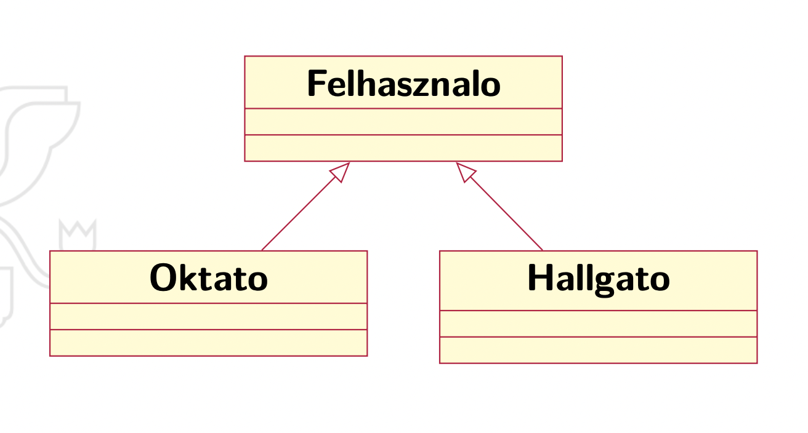
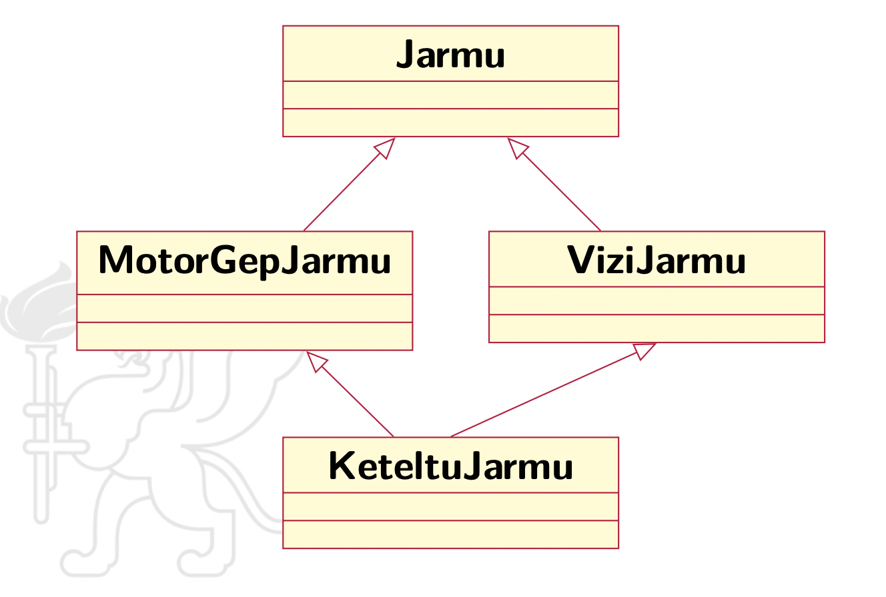

## Programozás 1 & 2

### 1. Objektum orientált paradigma, és annak megvalósítása a JAVA és C++ nyelvekben. Az absztrakt adattípus, az osztály. AZ egységbe zárás, az információ elrejtés, az öröklődés, az újrafelhasználás, és a polimorfizmus. A polimorfizmus feloldásának módszere.

#### Objektumorientáltág fogalma

Az **objektumorientált programozás** az objektumok fogalmán alapuló programozási paradigma. Az objektumok egységbe foglalják az adatokat és a hozzájuk tartozó műveleteket. Az adatokat ismerik mezők, attribútumok, tulajdonságok néven, a műveleteket metódusokként szokták emlegetni. Az objektum által tartalmazott adatokon általában az objektum metódusai végeznek műveletet. A legtöbb objektumorientált nyelv osztály alapú, azaz az objektumok osztályok példányai, és típusuk az osztály.

###### *`JAVA`* nyelvben egy osztály deklaráció:

```java
class Alakzat {
    int szin;
    float terulet;
    Koordinata xy;
}
```

###### *`C++`* nyelvben egy osztály deklaráció:

```C++
class Kutya {
    int szul_ev; // adattag (attributum)
private:
    string szin, nev; // adattag (attributum)
public:
    void eszik() { // metodus (tagfuggveny)
        /* ... */
    }
    void elkeresztel(string s); // metodus deklaracio
}; // pontosvesszo!
```

> Az adott osztály tagjainak meg lehet adni a láthatóságát
> **`public:`** *Mindenki számára korlátozás nélkül elérhető*
> **`protected:`** *Csak az adott osztályból és a leszármazott osztályból érhető el*
> **`private:`** *Csak az adott osztályból érhető el*

#### Az absztrakt adattípus

Az adattípus leírásának legmagasabb szintje, amelyben az adattípust úgy specifikáljuk, hogy az adatok ábrázolására és a műveletek implementációjára semmilyen előírást nem adunk. Lehetőleg matematikai fogalmakat használva írjuk
le az adattípust (halmazok és ezeken értelmezett műveletek).

**Absztrakció:** Elvonatkoztatás. Segítségével privát implementációkat rejthetünk el egy nyilvános interfész mögé.

> Példa: java.util csomagban List interfész és az interfészt implementáló ArrayList, illetve LinkedList osztályok. Az absztrakció lehetővé teszi, hogy
> mindkét osztály példányait ugyanazon List interfész műveletein keresztül
> kezeljük.

#### Az osztály

Az osztály egy felhasználói típus, amelynek alapján példányok (objektumok) hozhatók létre. Az osztály alapvetően adat és metódus (művelet) definíciókat tartalmaz.

Az objektumok típusa, a **`class`** kulcsszóval definiáljuk.

Az osztály egyben egy absztrakt adattípus is

- Adatok és a rajtuk végzett műveletek egységbezárása
  *(encapsulation)*
  

**Osztály:** tulajdonság + viselkedés

Tulajdonság = **attribútumok** *(adattagok, mezők)*
Viselkedés = **operációk** *(metódusok, tagfüggvények)*

Új, egy osztályba tartozó objektumokhoz típus hozzárendelése: **`class`** kulcsszóval. Pl.:

```C++
class Alakzat { /* az osztály törzse */ }
// ...
Alakzat a = new Alakzat ();
```

Ez így önmagában még nem sok mindenre jó, testre kell szabni.

- Attribútum hozzáadása
  
- Operációk hozzáadása
  

> Osztály attribútuma (mezője, adattagja) lehet másik osztály típusú (referenciát tárol), létre kell hozni **`new`**-val *(inicializálás)*
> 
> ```C++
> class Alakzat {
>     int szin;
>     float terulet;
>     Koordinata xy;
> }
> ```

> Az operációk funkcionalitást biztosítanak az objektumoknak, meghatározzák, hogy milyen üzeneteket fogadhat.
> 
> - Részei: név, paraméterek, visszatérési típus, törzs
>   
> 
> ```C++
> visszateresiTipus operacioNev( /* paraméter lista */ ) {
>     /* metódus törzs */
> }
> ```
> 
> Csak osztályoknak lehetnek operációi (metódusai).

#### Az egységbe zárás *`Encapsulation`*

Az adatok és a metódusok osztályba való összezárását jelenti. Tulajdonképpen az objektum egységbezárja az állapotot (adattagok értékei) a viselkedésmóddal (műveletekkel).

**Következmény:** az objektum állapotát csak a műveletein keresztül
módosíthatjuk.

#### Az információ elrejtés

Az objektum elrejti az adatait és bizonyos műveleteit. Ez azt jelenti, hogy nem tudjuk pontosan, hogy egy objektumban hogyan vannak az adatok ábrázolva, sőt a műveletek implementációit sem ismerjük. Az információk elrejtése az objektum biztonságát szolgálja, amelyeket csak a ellenőrzött műveleteken keresztül érhetünk
el.

#### Az öröklődés

> Olyan osztályok között értelmezett viszony, amely segítségével egy általánosabb típusból (ősosztály) egy sajátosabb típust tudunk létrehozni (utódosztály). Az utódosztály adatokat és műveleteket (viselkedésmódot) örököl, kiegészíti ezeket saját adatokkal és műveletekkel, illetve felülírhat bizonyos műveleteket. A kód újrafelhasználásának egyik módja. Megkülönböztetünk egyszeres és többszörös
> örökítést.

Osztályok közötti kapcsolat (reláció), ahol egy osztály megosztja a
struktúráját és/vagy a viselkedését egy vagy több másik osztállyal

A származtatott osztály örököl az ősosztály(ok)tól

Az attribútumokat és operációkat a lehető legfelsőbb szinten kell
definiálni

> A származtatott (gyerek) osztály mindent örököl az őstől (relációkat
> is) és kiegészítheti ezeket sajátokkal

A származtatott osztály egy örökölt operáció saját implementációját
is nyújthatja: polimorfizmus *(felüldefiniálás, overriding)*

Az öröklődés relációnak nincs neve, multiplicitása

> Tipikus öröklődési szintek száma: 3-5

Az újrafelhasználhatóság egyik alapeszköze

Öröklődés feltárása:

- általánosítás
  
- specializálás
  


###### Többszörös öröklődés

> Példa: a kétéltű jármű egy motorgépjármű (ami egy jármű) és egyben
> egy vízi jármű is (ami ugyancsak egy jármű)



Problémák adódhatnak, például:

- név ütközések
  
- többszörösen örökölt operációk, attribútumok
  

Megoldható: C++ virtuális öröklődés

Kevésbé karbantartható kódhoz vezet

Csak akkor szabad használni, ha tényleg szükséges, de akkor is csak
nagy odafigyeléssel

> Java-ban nincs rá lehetőség

#### Az újrafelhasználás

A objektum-orientált programozás egyik alapelve az újrafelhasználás.

Aggregáció, kompozíció

- Rész-egész kapcsolat
  
- Az újrafelhasználás során „módosítás nélkül” felhasználunk egy már meglévő típus
  
- „C-ben is létezett”
  

#### Polimorfizmus **`Többalakúság`**

Egy típuselméleti fogalom, amely szerint egy ősosztály típusú változó hivatkozhat ugyanazon közös ősosztályból származó *(vagy ugyanazon interfészt megvalósító)* osztályok példányaira.

A polimorfizmus lehet **statikus** és **dinamikus**.

**statikus polimorfizmus:** metódusok túlterhelése, függvénysablonok, osztálysablonok. Satikus, fordításidejű kötés.

**dinamikus polimorfizmus:** metódusok felülírása. Dinamikus, futásidejű kötés.

```C++
class Alakzat {
    public void rajzolj() {/*A*/}
}
class Haromszog extends Alakzat { 
    public void rajzolj() {/*H*/}
}
class Negyzet extends Alakzat { 
    public void rajzolj() {/*N*/}
}
class Kor extends Alakzat { 
    public void rajzolj() {/*K*/}
}
```

```C++
public class AlakzatPelda { 

    static void csinald(Alakzat a) {
    // ...
        a.rajzolj(); 
    }
 
 
    public static void main(String[] args) {
        Kor k = new Kor();
        Haromszog h = new Haromszog ();
        Negyzet n = new Negyzet();

        csinald(k);
        csinald(h);
        csinald(n);
     } 
}
```

#### A polimorfizmus feloldásának módszere

FOGGALMAM SINCS

### 2. Objektumok életciklusa, létrehozás, inicializálás, másolás, megszüntetés. Dinamikus, lokális, és statikus objektumok létrehozása. A statikus adattagok és metódusok, valamint szerepük a programozásban. Operáció, és operátor overloading JAVA és C++ nyelvekben. Kivételkezelés.

TODO

### 3. JAVA és C++ programok fordítása és futtatása. Parancssori paraméterek, fordítási opciók, nagyobb projektek fordítása. Absztrakt-, interfész-, és generikus osztályok, virtuális eljárások. A virtuális eljárások megvalósítása, szerepe, használata.

#### Java program fordítása és futtatása

Java program futtatásához szükség van JVM-re, ami a Java Virtual Machine. A Java forrás ugyanis egy köztes kódra fordul, ami architektúra függetlenül (de Java verziótól függő lehet) a JVM futtat.

Ezek ellenére a JIT compilerrel lefordítható a Java forrás natív gépi kódra.

Fordítás: `javac HelloWorld.java`

Ennek outputja `HelloWorld.class` file, ezt futtatni a `java HelloWorld.class` paranccsal lehet.

> Itt a JVM futtat (`java` parancs)

> JIT compilation automatikusan történik a gyakran használt kód elemekre.

##### Nagyobb projektek fordítása

Sok file, összetett projekt struktúra esetén nem jó megoldás simán a `javac` paranccsal fordítani

Ekkor érdemes használni egy build rendszert, pl.: **maven**, vagy **grandle**

Érdemes alkalmas fejlesztői környezetet is választani, gyakran a build rendszerek a fejlesztői környezetek felületéről kezelhetőek. Pl. IntelliJ esetén.

> - **mvn clean:** Cleans the project and removes all files generated by the previous build.
> - **mvn compile:** Compiles source code of the project.
> - **mvn test-compile:** Compiles the test source code.
> - **mvn test:** Runs tests for the project.
> - **mvn package:** Creates JAR or WAR file for the project to convert it into a distributable format.
> - **mvn install:** Deploys the packaged JAR/ WAR file to the local repository.
> - **mvn deploy:** Copies the packaged JAR/ WAR file to the remote repository after compiling, running tests and building the project.
> 
> `pom-xml`-ben projekt adatai, dependencyk

##### Fordítási (és futtatási) opciók

`javac`:

- `-g`: Debugging információk generálása

- `-nowarn`: Warning üzenetek kikapcsolása

- `-verbose`: Információt logol a compiler tevékenységeiről

- `-Werror`: Fordítási folyamat terminálása, ha egy warning történik

- `javac -version`

> https://docs.oracle.com/en/java/javase/13/docs/specs/man/javac.html

`java`

- `-version`

- `-jar filenév`: Futtat egy `.jar` fileba enkapszulált Java programot

- `-verbose:class` egyek class-ok betöltéséről logol információkat

- `-verbose:gc` Garbage Collection eventekről logol információkat

- Opciók megadása után felsorolhatjuk a programunk parancssori paramétereit

> https://docs.oracle.com/en/java/javase/13/docs/specs/man/java.html
> 
> https://docs.oracle.com/en/java/javase/13/docs/specs/man/java.html#overview-of-java-options

##### Parancssori paraméterek

```java
public class HelloWorld {
    public static void main(String[] args) {
        // args-ban
    }
}
```

> Argumentumok száma: `args.length`

Más nyelvekkel ellentétben a **0. indexű argumentum nem a futtatott file neve**, hanem ténylegesen az első argumentum

#### C++ program fordítása és futtatása

Java-val ellentétben nem egy virtuális gép kódjára fordul, hanem natív gépi kódra.

Fordítás: `g++ main.cpp`

Output: `a.out` bináris, ezt futtathatjuk: `./a.out`

##### Nagyobb projektek fordítása

Nagyobb projektek esetén ugyan az a helyzet, mint Java-nál, nem ideális egy `g++` parancshoz felsorolni a linkelendő egységeket.

Használjunk egy build rendszert, mint a Visual Studio-é, vagy `make`-et.

##### Fordítási opciók

`-o`: Kimeneti file nevének specifikálása

`-Wall`: Minden warning mutatása

`-lm`: Matematikai függvénykönyvtárak linkelése

> Preprocesszor $\to$ Fordítás assemblyre $\to$ Fordítás gépi kódra (assembler) $\to$ Linker (szerkesztés, futtatható állomány előállítása az egységekből)

##### Parancssori paraméterek

```cpp
int main(int argc, char* argv[]) {
  // ...
  return 0;
}
```

`argc`: Argumentumok száma

`argv`: Argumentumok tömbje

> 0. indexen a file neve áll!

#### Java absztrakt-, interfész-, generikus osztályok

##### Absztrakt osztályok

Amikor egy osztályban nem feltétlen szükséges implementálni egy metódust, csak az azt öröklő osztályokban.

Ekkor megjelölhetjük a metódust, mint `abstract` metódus. Viszont ekkor maga az egész osztály is `abstract` kell, hogy legyen.

> Minden osztály `abstract`, ha van legalább egy `abstract` metódusa, de nem kell, hogy legyen, egy osztály `abstract` metódus nélkül is lehet `abstract`.

Ekkor ezt az `abstract` **metódust nem implementáljuk**, és ez az **osztály nem példányosítható** (azaz nem lehet meghívni a konstruktorát).

> De az őt öröklő osztályok konstruktorából meg lehet hívni (`super`), így lehet konstruktora, közös logikákat lehet bele szervezni.

`abstract` metódus nem lehet:

- `private`: Mivel ha nem érik el a gyerekek, akkor nem is tudják felülírni. Csak esetleg egy ugyan olyan signature-jű metódust létrehozni, de nem lesz override.

- `final`: Mivel a `final` metódusok nem overridolhatók.

###### Példa

```java
abstract class Hangszer {
    abstract public void szolj(Hang h);
}
```

A *hangszer* mint olyan egy absztrakt fogalom, nem tud egy adott hangon *szólni*. Viszont mondjuk a belőle öröklő cselló már tud cselló hangon szólni:

```java
public class Csello extends Hangszer {
    @Override
    public void szolj() {
        System.out.println("csellohang");
    }
}
```

> Az `@override` annotáció segít olvasni a kódot, illetve ha valójában nem is egy override a metódus, akkor szól a linter / fordító.

##### Interfészek

Akkor használjuk, ha minden metódus `abstract`.

`class` helyett `interface` kulcsszó

Megkötések:

- Nem lehet konstruktora

- Metódusok impliciten `public abstract`-ok.

- Adattagok impliciten `public static final`-ök.
  
  - `public`: Mivel nem példányosítható, valószínűleg ezt szeretnénk, bár a `protected` is elképzelhető.
  
  - `static`: Mivel nem példányosíthatóak, nem lehet őket objektumhoz (példányhoz) kötni, csak osztályhoz.
  
  - `final`: Mivel nincs konstruktor, mindenképpen legyenek inicializálva.

Leírja, milyen módon lehet használni az őt implementáló osztályokat. De csak a működés lehetőségeit írja elő, az implementáció az öröklő osztályokban van.

> Visszafelé kompatibilitási okok miatt lehetséges az interface-ben törzset is adni (implementációt) az osztályoknak, de ez csak akkor jelentős, ha meglévő ködbázisokban használt interfacen akarunk módosítani (nem biztos, hogy az új metódust implementálják a másik kódbázis osztályai). Ez a `default` kulcsszóval lehetséges a metódus signaturejében.

###### Példa

```java
interface Hangszer {
    void szolj(Hang h); // impliciten public és abstract
}
class Zongora implements Hangszer {
    public void szolj(Hang h) {
        System.out.println("zongorahang");
    }
}
```

##### Generikus osztályok

Generikus: **típus paraméter**

Szintaxis:

- `interface InterfeszNev<T> {...}`
- `class OsztalyNev<T> {...}`
- `<T> T fuggvenyNev(T p);`

Használatkor hasonlóan kacsacsőrök között tudjuk megadni a konkrét típust, amit alkalmazni szeretnénk:

```java
OsztalyNev<Long> i = new OsztalyNev<Long>(new Long(1));
```

> Csak referenciatípus lehet, primitív, pl. `int` nem. (De `Integer` igen)

###### Példa

```java
class Generikus<E> {
  private E x;
  public Generikus(E x) {
    this.x = x;
  }
  public E getX() {
    return x;
  }
  public void setX(E x) {
    this.x = x;
  }
}
class GenMetodus {
  public String toString() {
    return "GenMetodus";
  }
  <T> T f(T p) {return p;}
}
class GenericsPelda {
  public static void main(String[] args) {
    //Generikus<long> a1 = new Generikus<long>(1);  // forditasi hiba
    Generikus<Long> a1 = new Generikus<Long>(new Long(1));
    Generikus<String> a2 = new Generikus<String>("egy");
    GenMetodus b = new GenMetodus();
    Generikus<GenMetodus> a3 = new Generikus<GenMetodus>(b);
    System.out.println(b.f("valami"));
    System.out.println(b.f(9));
  }
}
```

###### Példa beépített generikus osztállyal

```java
List<String> strings = new ArrayList<>();

//... add String instances to the strings list...

for (String aString : strings) {
    System.out.println(aString);
}
```

#### C++ virtuális metódusok, absztrakt osztályok, templatek

##### Virtuális metódusok

Alapvetően (`virtual` kulcsszó nélkül) C++-ban nem valósul meg polimorfikusság. Hiába egyezik meg a metódus signature-je teljesen az ősével, ha egy függvény az ős szerint vár paramétert, az az ős-beli metódust fogja meghívni.

> Ennek az az oka, hogy ilyenkor statikus kötés történik, a fordító azt látja, hogy `Hangszer`-t vár a metódus, így statikusan aként adja át a `Csello` példányt is.

> Ekkor fordítási időben eldől a típus.

Ez virtualizációval módosítható.

Az ősben azokat a metódusokat, amelyeket felül szeretnénk definiálni egy leszármazottban, meg kell jelölni `virtua` kulcsszóval. Ezek a metódusok már polimorfikusak lesznek.

> Ekkor csak futási időben dől el a típus.

`override` kulcsszó: hasonló a Java-féle annotációhoz, jelzi, ha egy metódus valójában nem is override (nincs neki vitruális megfelelője az ős osztályban).

`final`: Ha a leszármazottban meg akarjuk akadályozni, hogy az ő leszármazottja megint csak felülírja a metódust.

> A `fina` értelmezett osztályokra is, ilyen osztályból nem lehet örökölni.

**Virtuális destruktor**: Figyelni kell rá, ha objektumot törlünk őstípus alapján (polimorfikusan), akkor legyen virtual a destruktor!

##### Absztrakt osztályok

Ha egy osztály rendelkezik **pure virtual** metódussal, akkor az absztrakt, és nem lehet példányosítani.

A leszármazott köteles implementálni az örökölt pure virtual metódusokat, különben ő is absztrakt lesz.

```cpp
// An abstract class
class Test
{   
    // Data members of class
public:
    // Pure Virtual Function
    virtual void show() = 0;

   /* Other members */
};
```

Az `= 0` jelzi, hogy nem sime virtual, hanem pure virtual metódus.

##### Templatek

Mint a Java generikusok.

```c++
template <typename T> // typename T vagy class T ugyanaz
class Example {
  T t;
 public:
  Example(const T& t) : t (t) { }
    bool is_empty() const {
    return t.empty();
  }
};

int main () {
  Example<int> ot(5);
  // cout << ot.is_empty() << endl; -> HIBA LENNE !
  Example<string> pelda("pelda");
  cout << pelda.is_empty() << endl;
}
```

Template osztályokat a fordító többszöt "példányosítja" (többet hoz lérte).

Minden típushoz, amivel használjuk, generál egyet.

> Emiatt csak használatkor derül ki, hogy lehet-e azzal a típussal használni.

Template-ben lehet nem-típus paraméter is:

```c++
template <typename T, unsigned N>
class Tomb {
  T t [N];
  /* ... */
};

int main () {
  Tomb <int, 5> tomb;
}
```


