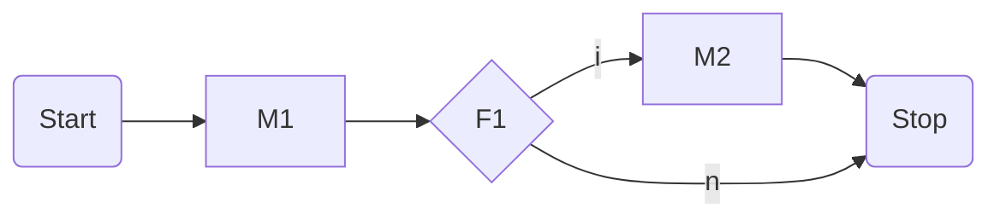
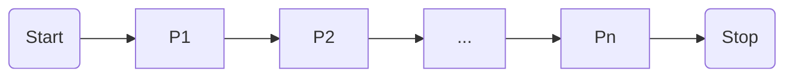
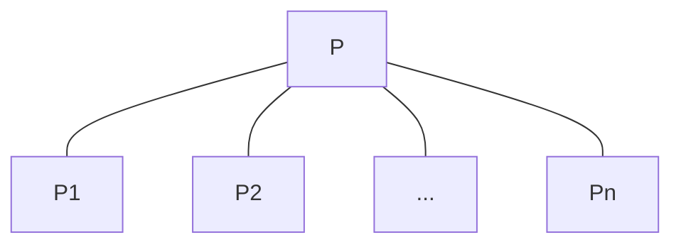
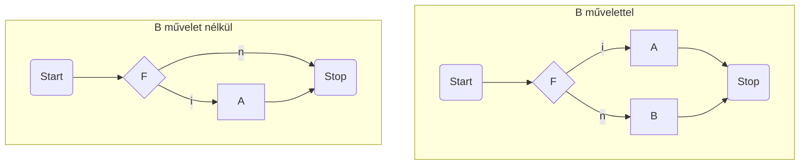

## Programozás alapjai

### 1. Algoritmusok vezérlési szerkezetei és megvalósításuk C programozási nyelven. A szekvenciális, iterációs, elágazásos, és az eljárás vezérlés.

#### Vezérlési módok

Segítségükkel azt fejezzük ki, hogy egyszerűbb műveletekből hogyan építhetünk fel összetettebb műveleteket és ennek milyen lesz a vezérlése, azaz milyen sorrendben kell végrehajtani az őt felépítő utasításokat.

Négy fő vezérlési módot különböztetünk meg:

- **Szekvenciális**: Véges sok művelet rögzített sorrendben egymás után történő végrehajtása

- **Szelekciós**: Véges sok művelet közül adott feltétel alapján valamelyik végrehajtása

- **Ismétléses**: Adott műveletet adott feltétel szerinti ismételt végrehajtása

- **Eljárás**: Adott művelet alkalmazása adott argumentumokra, ami az argumentumok értékének meghatározott változását eredményezi

> Ezek nyelv független fogalmak, amikor egy imperatív programozási nyelvet el akarunk sajátítani, a legfontosabb annak megismerése, hogy ezeket a vezérlési módokat milyen utasításokkal tudjuk (ha tudjuk) megvalósítani.

#### Algoritmusok leírása

Több féle képpen meg tudjuk adni egy algoritmus vezérlését, azaz azt az előírást, amely az algoritmus minden lépéséra kijelöli, hogy a lépés végrehajtása után melyik lépés végrehajtása következik.

- **Természetes nyelvi leírás**: Legegyszerűbb megközelítés, szövegesen, mindatokba foglalva írja le az algoritmust. Nagyon távol áll egy gépi megvalósítástól.

- **Pszeudo kód**: Egy programozási nyelv szerű struktúrált nyelv, de sokkal szabadabb, mint egy valódi programozási nyelv, nem kell minden részletet definiálni.

- **Folyamatábra**: Grafikus, kevésbé struktúrált gráf reprezentációja a végrehajtásnak, amely a működési folyamatra koncentrál

- **Szerkezeti ábra**: Szintén grafikus, strukturált leítása az algoritmus felépítésének leírására, amely leírja a működési folyamatot is

#### Folyamatábra

Akkor használjuk, ha csak a kész algoritmus működését szeretnénk leírni, és a szerkezete kevésbé fontos.

Az algoritmus egyes lépéseit egy gráf csúcspontjaiban definiáljuk, amely pontokat irányított nyilakkal kötjük össze, ezzel kijelölve a végrehajtás irányát.

Közel áll az assembly nyelvhez.

##### Szintaxis

Legyenek $M = \{ ~ M_1, ..., M_k ~ \}$ műveletek, és $F = \{ ~ F_1, ..., F_l ~ \}$ feltételek.

Az $(M, F)$ feletti folyamatábra olyan irányított gráf, amelyre teljesül a következő 5 feltétel:

- Van egy olyan pontja, ami a **Start** művelettel van címkézve, és ebbe a pontba nem vezet él.

- Van egy olyan pontja, ami a **Stop** művelettel van címkézve, és ebből nem indul ki él.

- Minden pontja vagy egy $M$-beli művelet, vagy egy $F$-beli feltétel a **Start** és **Stop** pontokon kívül.

- Ha egy pont
  
  - $M$-beli művelettel van címkézve, akkor belőle egy él indul ki
  
  - $F$-beli feltétellel van címkézve, akkor belőle két él indul ki, és ezek az **i** (igen), illetve **n** (nem) címkéket viselik.

- A gráf minden pontja elérhető a **Start** címkéjű pontból.

##### Szemantika

Egy folyamatábrát a következőképpen kell értelmezni:

- A végrehajtást a **Start** pontból kell kezdeni.

- Az összetett utasítás akkor ér véget, ha elértük a **Stop** pontot, azaz a vezérlést megkapja a **Stop** pont.

- A gráf egy pontjának a végrehajtását attól függően definiáljuk, hogy az $M$-beli utasítással, vagy $F$-beli címkével van címkézve.
  
  - Ha a pontban $M$-beli művelet van, akkor a művelet végrehajtódik és a 
    vezérlés a gráf azon pontjára kerül, amelybe a pontból kiinduló él 
    vezet.
  
  - Ha a pont $F$-beli feltétellel van címkézve, akkor kiértékelődik a 
    feltétel. Ha az értéke igaz, akkor az a pont kap vezérlést. amelybe az **i** (igen) 
    címkéjű él vezet, egyébként az a pont kapja meg a vezérlést, amelybe az **n** (nem) címkéjű él vezet.

##### Példa



1. **Start** pontból a vezérlés rákerül az $M_1$ utasítást tartalmazó blokkra.

2. $M_1$ végrehajtása után az $F_1$ feltétel kiártákelése történik.
   
   - Ha a feltétel igaz volt, akkor végrehajtjuk az $M_2$ utasítást

3. Akár végre hajtottuk az $M_2$ utasítást, akár nem, ezen a ponton eljutunk a **Stop** csúcsig

#### Szekvenciális vezérlés

Szekvenciális vezérlésről akkor beszélünk, amikor a $P$ probléma 
megoldását úgy kapjuk, hogy a problémát $P_1, ..., P_n$ részproblémákra 
bontjuk, majd az ezekre adott megoldásokat (részalgoritmusokat) sorban, 
egymás után végrehajtjuk.

$P_1, ... , P_n$ lehetnek elemi műveletek, de lehetnek összetettek is, 
amiket utána tovább kell bontani.

##### Folyamatábra



##### Szerkezeti ábra

Itt az látszódik, hogy a $P$ problémának a megoldását a $P_1, ..., P_n$ problémák megoldásával kapjuk. A sorrendiséget csak a felsorolás sorrendje jelzi.



##### C-ben

```c
{
    P1;
    ...
    P2;
}
```

#### Szelekciós vezérlés

A kiválasztás módjától függően megkülönböztetünk pár altípust:

- Egyszerű szelekciós vezérlés

- Többszörös szelekciós vezérlés

- Esetkiválasztásos szelekció

- A fentiek kiegészítve **egyébként** ágakkal

##### Egyszerű szelekciós vezérlés

Egyetlen művelet, és egyetlen feltétel van.

> Maga a művelet persze lehet összetett.

Legyen $F$ egy logikai kifejezés, $A$ pedig tetszőleges művelet. 
Az $F$ feltételből és az $A$ műveletből képzett **egyszerű szelekciós vezérlés** a következő vezérlési előírást jelenti:

1. Értékeljük ki az $F$ feltételt és folytassuk a 2. lépéssel

2. Ha $F$ értéke igaz, akkor hajtsuk végre az $A$ műveletet, és fejezzük be az összetett művelet végrehajtását

3. Egyébként ha $F$ értéke hamis, akkor fejezzük be az összetett művelet végrehajtását

A vezérlés bővíthető úgy, hogy a 3. pontban üres művelet helyett egy B műveletet hajtunk végre. Ekkor az alábbiak szerint módosíthatjuk a vezérlés megadását:

Legyen $F$ egy logikai kifejezés, $A$ **és** $B$ pedig tetszőleges művelet. 
Az $F$ feltételből és az $A$ **és** $B$ műveletből képzett egyszerű szelekciós vezérlés a következő vezérlési előírást jelenti:

1. Értékeljük ki az $F$ feltételt és folytassuk a 2. lépéssel

2. Ha $F$ értéke igaz, akkor hajtsuk végre az $A$ műveletet, és fejezzük be az összetett művelet végrehajtását

3. Egyébként ha $F$ értéke hamis, akkor **hajtsuk végre a $B$ műveletet**, majd fejezzük be az összetett művelet végrehajtását




### 2. Egyszerű adattípusok: egész, valós, logikai és karakter típusok és kifejezések. Az egyszerű típusok reprezentációja, számábrázolási tartományuk, pontosságuk, memória igényük, és műveleteik. Az összetett adattípusok és a típusképzések, valamint megvalósításuk C nyelven. A pointer, a tömb, a rekord, és az unió típus. Az egyes típusok szerepe, használata.
