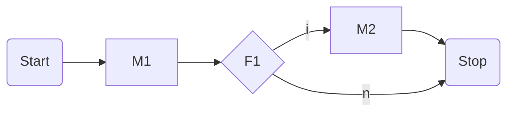
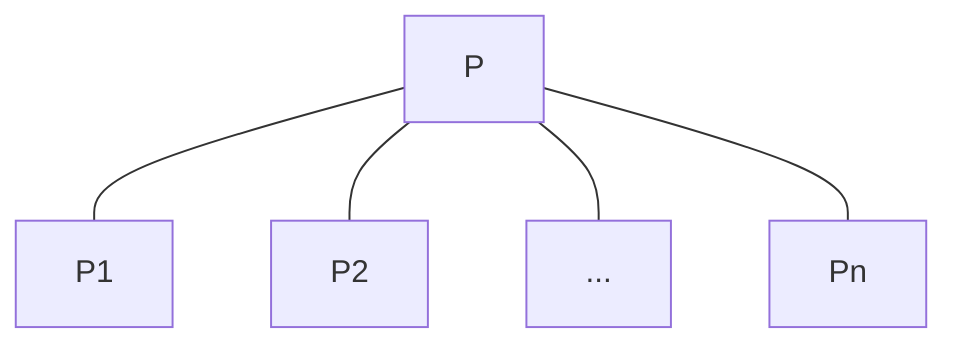
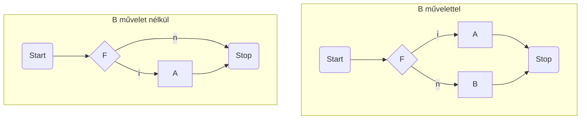

## Programozás alapjai

### 1. Algoritmusok vezérlési szerkezetei és megvalósításuk C programozási nyelven. A szekvenciális, iterációs, elágazásos, és az eljárás vezérlés.

#### Vezérlési módok

Segítségükkel azt fejezzük ki, hogy egyszerűbb műveletekből hogyan építhetünk fel összetettebb műveleteket és ennek milyen lesz a vezérlése, azaz milyen sorrendben kell végrehajtani az őt felépítő utasításokat.

Négy fő vezérlési módot különböztetünk meg:

- **Szekvenciális**: Véges sok művelet rögzített sorrendben egymás után történő végrehajtása

- **Szelekciós**: Véges sok művelet közül adott feltétel alapján valamelyik végrehajtása

- **Ismétléses**: Adott műveletet adott feltétel szerinti ismételt végrehajtása

- **Eljárás**: Adott művelet alkalmazása adott argumentumokra, ami az argumentumok értékének meghatározott változását eredményezi

> Ezek nyelv független fogalmak, amikor egy imperatív programozási nyelvet el akarunk sajátítani, a legfontosabb annak megismerése, hogy ezeket a vezérlési módokat milyen utasításokkal tudjuk (ha tudjuk) megvalósítani.

#### Algoritmusok leírása

Több féle képpen meg tudjuk adni egy algoritmus vezérlését, azaz azt az előírást, amely az algoritmus minden lépéséra kijelöli, hogy a lépés végrehajtása után melyik lépés végrehajtása következik.

- **Természetes nyelvi leírás**: Legegyszerűbb megközelítés, szövegesen, mindatokba foglalva írja le az algoritmust. Nagyon távol áll egy gépi megvalósítástól.

- **Pszeudo kód**: Egy programozási nyelv szerű struktúrált nyelv, de sokkal szabadabb, mint egy valódi programozási nyelv, nem kell minden részletet definiálni.

- **Folyamatábra**: Grafikus, kevésbé struktúrált gráf reprezentációja a végrehajtásnak, amely a működési folyamatra koncentrál

- **Szerkezeti ábra**: Szintén grafikus, strukturált leítása az algoritmus felépítésének leírására, amely leírja a működési folyamatot is

#### Folyamatábra

Akkor használjuk, ha csak a kész algoritmus működését szeretnénk leírni, és a szerkezete kevésbé fontos.

Az algoritmus egyes lépéseit egy gráf csúcspontjaiban definiáljuk, amely pontokat irányított nyilakkal kötjük össze, ezzel kijelölve a végrehajtás irányát.

Közel áll az assembly nyelvhez.

##### Szintaxis

Legyenek $M = \{ ~ M_1, ..., M_k ~ \}$ műveletek, és $F = \{ ~ F_1, ..., F_l ~ \}$ feltételek.

Az $(M, F)$ feletti folyamatábra olyan irányított gráf, amelyre teljesül a következő 5 feltétel:

- Van egy olyan pontja, ami a **Start** művelettel van címkézve, és ebbe a pontba nem vezet él.

- Van egy olyan pontja, ami a **Stop** művelettel van címkézve, és ebből nem indul ki él.

- Minden pontja vagy egy $M$-beli művelet, vagy egy $F$-beli feltétel a **Start** és **Stop** pontokon kívül.

- Ha egy pont
  
  - $M$-beli művelettel van címkézve, akkor belőle egy él indul ki
  
  - $F$-beli feltétellel van címkézve, akkor belőle két él indul ki, és ezek az **i** (igen), illetve **n** (nem) címkéket viselik.

- A gráf minden pontja elérhető a **Start** címkéjű pontból.

##### Szemantika

Egy folyamatábrát a következőképpen kell értelmezni:

- A végrehajtást a **Start** pontból kell kezdeni.

- Az összetett utasítás akkor ér véget, ha elértük a **Stop** pontot, azaz a vezérlést megkapja a **Stop** pont.

- A gráf egy pontjának a végrehajtását attól függően definiáljuk, hogy az $M$-beli utasítással, vagy $F$-beli címkével van címkézve.
  
  - Ha a pontban $M$-beli művelet van, akkor a művelet végrehajtódik és a 
    vezérlés a gráf azon pontjára kerül, amelybe a pontból kiinduló él 
    vezet.
  
  - Ha a pont $F$-beli feltétellel van címkézve, akkor kiértékelődik a 
    feltétel. Ha az értéke igaz, akkor az a pont kap vezérlést. amelybe az **i** (igen) 
    címkéjű él vezet, egyébként az a pont kapja meg a vezérlést, amelybe az **n** (nem) címkéjű él vezet.

##### Példa



1. **Start** pontból a vezérlés rákerül az $M_1$ utasítást tartalmazó blokkra.

2. $M_1$ végrehajtása után az $F_1$ feltétel kiártákelése történik.
   
   - Ha a feltétel igaz volt, akkor végrehajtjuk az $M_2$ utasítást

3. Akár végre hajtottuk az $M_2$ utasítást, akár nem, ezen a ponton eljutunk a **Stop** csúcsig

#### Szekvenciális vezérlés

Szekvenciális vezérlésről akkor beszélünk, amikor a $P$ probléma 
megoldását úgy kapjuk, hogy a problémát $P_1, ..., P_n$ részproblémákra 
bontjuk, majd az ezekre adott megoldásokat (részalgoritmusokat) sorban, 
egymás után végrehajtjuk.

$P_1, ... , P_n$ lehetnek elemi műveletek, de lehetnek összetettek is, 
amiket utána tovább kell bontani.

##### Folyamatábra


##### Szerkezeti ábra

Itt az látszódik, hogy a $P$ problémának a megoldását a $P_1, ..., P_n$ problémák megoldásával kapjuk. A sorrendiséget csak a felsorolás sorrendje jelzi.



##### C-ben

```c
{
    P1;
    ...
    P2;
}
```

#### Szelekciós vezérlés

A kiválasztás módjától függően megkülönböztetünk pár altípust:

- Egyszerű szelekciós vezérlés

- Többszörös szelekciós vezérlés

- Esetkiválasztásos szelekció

- A fentiek kiegészítve **egyébként** ágakkal

##### Egyszerű szelekciós vezérlés

Egyetlen művelet, és egyetlen feltétel van.

> Maga a művelet persze lehet összetett.

Legyen $F$ egy logikai kifejezés, $A$ pedig tetszőleges művelet. 
Az $F$ feltételből és az $A$ műveletből képzett **egyszerű szelekciós vezérlés** a következő vezérlési előírást jelenti:

1. Értékeljük ki az $F$ feltételt és folytassuk a 2. lépéssel

2. Ha $F$ értéke igaz, akkor hajtsuk végre az $A$ műveletet, és fejezzük be az összetett művelet végrehajtását

3. Egyébként ha $F$ értéke hamis, akkor fejezzük be az összetett művelet végrehajtását

A vezérlés bővíthető úgy, hogy a 3. pontban üres művelet helyett egy B műveletet hajtunk végre. (`else` ág, minimélis módosításokkal felírható hasonló definíció)

###### Folyamatábra



###### Szerkezeti ábra


###### C-ben

```c
if(F) {
    A;
}
```

```c
if(F) {
    A;
} else {
    B;
}
```

> Feltételes kifejezés (ternary): `a ? b : c`
> 
> A C nyelv egyetlen 3 operandusú művelete.

##### Többszörös szelekciós vezérlés

Több feltétel, több művelettel.

Legyenek $F_i$ logikai kifejezések, $A_i$ pedig tetszőleges műveletek $1 \le i \le n$-re (azaz mind feltételből, mint $A$ műveletből van $n$ darab). Az $F_i$ feltételekből és $A_i$ műveletekből képzett többszörös szelekciós vezérlés a következő vezérlési előírást jelenti:

1. Az $F_i$ feltételek sorban történő kiértékelésével adjunk választ a következő kérdésre: van-e olyan $i$ $(1 \le i \le n)$, amelyre teljesül, hogy az $F_i$ feltétel igaz és az összes $F_j$ $(1 \le j < i)$ feltétel hamis? (Azaz keressük az első $F_i$ feltételt, ami **igaz**.)

2. Ha van ilyen $i$, akkor hajtsuk végre az $A_i$ műveletet és fejezzük be az összetett művelet végrehajtását.

3. Egyébként, vagyis ha minden $F_i$ feltétel hamis, akkor fejezzük be az összetett művelet végrehajtását.

###### Folyamatábra


> Az utóbbi rendelkezik egyébként ággal

###### Szerkezeti ábra

Mivel a fenti dobozba nem lehetne beírni minden feltételt, és nem is lenne egyértelmű, hogy melyikhez melyik tartozik, csak egy **?**-et írunk.


> Valójában összeépíthető az egyszerű szelekciós vezérlés szerkezeti ábrájával, a hamis ágegy újabb egyszerű szelekcióba vezet, és így tovább ahány feltétel van (és a végén egy esetleges `else` ág).

###### C-ben

```c
if(F1) {
    A1;
} else if(F2) {
    A2;
    ...
} else if(Fn) {
    An;
} else {
    B;
}
```

Fontos, hogy a zárójelezésre figyeljünk, az alábbi két blokk ekvivalens, hiába tűnhet úgy, mintha a másodikban az `else` ág az első `if`-hez tartozna:

```c
if(F1) {
    if(F2)
        A1;
    else
        A2;
}
```

```c
if(F1)
    if(F2)
        A1;
else
  A2;
```

> A C nyelv nem whitespace érzékeny.

##### Esetkiválasztásos szelekciós vezérlés

Akkor alkalmazhatjuk, ha a többszörös szelekció feltételeit átírhatjuk úgy, hogy **elemek valamilyen halmazba tartozását** vizsgálják.

> `switch`

Legyen $K$ egy adott típusú kifejezés, és legyenek $H_i$-k olyan halmazok, melynek elemeinek típusa megegyezik $K$ típusával. Legyenek továbbá $A_i$ tetszőleges műveletek, ahol $1 \le i \le n$ teljesül. A $K$ szelektor kifejezésből, $H_i$ kiválasztó halmazokból és $A_i$ műveletekből képzett esetkiválasztásos szelekciós vezérlés a következő vezérlési előírást jelenti:

1. Értékeljük ki a $K$ kifejezést és folytassuk a 2. lépéssel.

2. Adjunk választ a következő kérdésre: Van-e olyan $i$ ($1 \le i \le n$), amelyre teljesül, hogy a $K \in H_i$, és $K \notin H_j$, ahol ($1 \le j<i$)?

3. Ha van ilyen $i$, akkor hajtsuk végre az $A_i$ műveletet és fejezzük be az összetett művelet végrehajtását.

4. Egyébként, vagyis ha $K$ nem eleme egyetlen $H_i$ halmaznak sem, akkor fejezzük be az összetett művelet végrehajtását.

> Itt is lehet egyébként ág (`default`), minimálisan módosul a definíció ha jelen van.

###### Folyamatábra


> Utóbbi a `default` ágas

###### Szerkezeti ábra


> $K$ az adott kifejezés, aminek a $H_i$-k be tartozását vizsgáljuk.

###### C-ben

```c
switch(K) {
    case H1:
        A1;
        break;
    ...
    case Hn:
        An;
        break;
    default:
        B;
        break;
}
```

> Alapból azt fejezzük ki, hogy melyik `case`-től kezdődően hajtsuk végre az $A_i$ utasításokat (mindhatni, hogy a `case`-ek belépési pontot határoznak meg). Így ha `break`-el, vagy `return`-el zárunk minden utasítást (esetleg kivéve az utolsót), akkor esetkiválasztásos szelekciót valósít meg a struktúra.

Itt a `case`-ek után egy elem állhat, nem egy halmaz, ezt a `case` működéséből adódóan (azaz abból, hogy egy belépési pontot határoz meg) viszont a következőképpen meg tudjuk oldani:

```c
case x_i1:
case x_i2:
...
case x_ini:
   Ai;
   break;
```

Ekkor az $A_i$ utasítás akkor fog kiválasztódni, ha $K \in H_i = \{ ~ x_{i, 1}, x_{i, 2}, ..., x_{i, n_i} ~ \}$

#### Eljárásvezérlés

Egy műveletet adott argumentumokra alkalmazunk, aminek hatására az argumentumok értékei pontosan meghatározott módon változnak meg.

Két fajta: eljárásművelet, függvényművelet.

##### Függvényművelet

Matematikai függvények álralánosítása

Függvényművelet specifikációja:

- Művelet elnevezése

- Paraméterek felsorolása

- Paraméterek típusa

- A műveletek hatásának leírása

- Eredménytípus

Jelölés: $T ~ ~ F(T_1 ~ X_1, ..., T_n ~ X_n)$

- $T$: a függvényművelet eredménytípusa

- $F$: a függvényművelet neve

- $T_i$: $i$. paraméter típusa

- $X_i$: $i$. paraméter azonosítója

> Zárójeleket akkor is kirakjuk, ha a paraméterlista üres

###### Szerkezeti ábra


> Formális paraméter: Függvényművelet leírásában használt paraméterek
> 
> Argumentum: Amire konkrét esetben végre szeretnénk hajrani a műveletet

###### C-ben

```c
T F(T1 X1, ... , Tn Xn)
{
   M;
}
```

##### Eljárásművelet

Alkalmazása adott argumentumokra az argumentumok értékének pontosan meghatározott megváltozását eredményezi.

Minden eljárásműveletnek rögzített számú paramétere van, és minden paraméter rögzített adattípusú.

Három mód:

- **Bemenő mód**: Ha a művelet végrehajtása nem változtathatja meg az adott argumentum értékét.

- **Kimenő mód**: Ha a művelet eredménye nem függ az adott argumentum 
  végrehajtás előtti értékétől, de az adott argumentum értéke a művelet 
  hatására megváltozhat.

- **Be- és kimenő (vegyes) mód**: Ha a művelet felhasználhatja az adott 
  argumentum végrehajtás előtti értékét és az argumentum értéke a művelet 
  hatására meg is változhat.

> Ezek a módok C-ben éppenséggel ugyan úgy működnek függvényműveletek esetén is, de nem feltétlen van ez így minden nyelv esetén

> C-ben a kimenő mód pointerekkel valósítható meg. Deklarációban: `T_i *X_i`, függvénytörzsben: `*X_i`-vel dereferáljuk. Híváskor: `&A_i`-vel pointert adunk át.

Eljárásművelet specifikációja:

- Művelet elnevezése

- Paraméterek felsorolása

- Paraméterek adattípusai

- Művelet hatásának leírása

Eljárásművelet általános jelölése: $P (m_1 ~ X_1 : T_1; ...; m_n ~ X_n : T_n)$

- $P$: az eljárás neve

- $m_i$: az $i$. paraméter kezelési módja

- $X_i$: az $i$. paraméter azonosítója

- $T_i$: az $i$. paraméter adattípusa

###### C-ben

`void` visszatérési érték típus.

A függvényműveletekkel ellentétben nem lehet egy összetett művelet részkifejezése (pont azért, mert nem vesz fel értéket, mivel nincs visszatérési értéke).

#### Ismétléses vezérlés

Ötféle ismétléses vezérlés:

- Kezdőfeltételes

- Végfeltételes

- Számlálásos

- Hurok

- Diszkrét

##### Kezdőfeltételes ismétléses vezérlés

A ciklusmag ismételt végrehajtását egy belépési feltételhez kötjük.

Legyen $F$ logikai kifejezés, $M$ pedig tetszőleges művelet. Az $F$ ismétlési feltételből és az $M$ műveletből (a ciklusmagból) képzett kezdőfeltételes ismétléses vezérlés a következő vezérlési előírást jelenti:

1. Értékeljük ki az $F$ feltételt és folytassuk a 2. lépéssel.

2. Ha $F$ értéke hamis, akkor az ismétlés és ezzel együtt az összetett művelet végrehajtása befejeződött.

3. Egyébként, vagyis ha az $F$ értéke igaz, akkor hajtsuk végre az $M$ műveletet, majd folytassuk az 1. lépéssel.

###### Folyamatábra


###### Szerkezeti ábra


###### C-ben

```c
while (F) {
    M;
}
```

##### Végfeltételes ismétléses vezérlés

A ciklusmag **elhagyását** kötjük egy kilépési feltételhez.

Legyen $F$ egy logikai kifejezés, $M$ pedig tetszőleges művelet. Az $F$ kilépési feltételből és az $M$ műveletből (ciklusmagból) képzett **végfeltételes ismétléses vezérlés** a következő vezérlési előírást jelenti:

1. Hajtsuk végre az $M$ műveletet majd folytassuk a 2. lépéssel.

2. Értékeljük ki az $F$ feltételt és folytassuk a 3. lépéssel.

3. Ha $F$ értéke igaz, akkor az ismétléses vezérlés és ezzel együtt az összetett művelet végrehajtása befejeződött.

4. Egyébként, vagyis ha az $F$ értéke hamis, akkor folytassuk az 1. lépéssel.

> Azaz a ciklusmag legalább egyszer lefut

###### Folyamatábra


###### Szerkezeti ábra


###### C-ben

```c
do {
    M;
} while (!F);
```

##### Számlálásos ismétléses vezérlések

Legyen `a` és `b` egész érték, `i` egész típusú változó, `M` pedig tetszőleges művelet, amelynek nincs hatása `a`,`b` és `i` értékére.

Az `a` és `b` határértékekből, `i` ciklusváltozóból és `M` műveletből (ciklusmagból) képzett **növekvő (csökkenő) számlálásos ismétléses vezérlés** az alábbi vezérlési előírást jelenti:

1. Legyen `i = a` (`i = b`) és folytassuk a 2. lépéssel.

2. Ha `b < i` (`i < a`), akkor az ismétlés és ezzel együtt az összetett művelet végrehajtása befejeződött.

3. Egyébként, vagyis ha `i <= b` (`a <= i`), akkor hajtsuk végre az `M` műveletet, majd folytassuk a 4. lépéssel.

4. Növeljük (csökkentsük) `i` értékét 1-gyel, és folytassuk a 2. lépéssel.

###### Folyamatábra

Növekvő:


Csökkenő:


###### Szerkezeti ábra

Növekvő:


Csökkenő:


###### C-ben

```c
for (kif_11, kif_12, kif_13;
     kif_2;
     kif_31,kif_32) {
    utasítás;     
}
```

Ez szemantikailag egyenértékü a következővel:

```c
kif_11; kif_12; kif_13;
while (kif_2) {
   utasítás;
   kif_31;kif_32;
}
```

##### Hurok ismétléses vezérlés

Amikor a ciklusmag ismétlését a ciklusmagon belül vezéreljük úgy, hogy a ciklus különböző pontjain adott feltételek teljesülése esetén a ciklus végrehajtását befejezzük, hurok ismétléses vezérlésről beszélünk.

Legyenek $F_i$ logikai kifejezések, $K_i$ és $M_j$ pedig tetszőleges (akár üres) műveletek $1 \le i \le n$ és $0 \le j \le m$ értékekre. Az $F_i$ kijárati feltételekből, $K_i$ kijárati műveletekből és az $M_i$ műveletekből képzett hurok ismétléses vezérlés a következő előírást jelenti:

1. Az ismétléses vezérlés következő végrehajtandó egysége az $M_0$ művelet.

2. Ha a végrehajtandó egység az $M_j$ művelet, akkor ez végrehajtódik. $j = n$ 
   esetén folytassuk az 1. lépéssel, különben pedig az $F_{j + 1}$ feltétel végrehajtásával a 3. lépésben.

3. A végrehajtandó egység az $F_i$ feltétel $1 \le i \le n$, akkor értékeljük ki. Ha $F_i$ igaz volt, akkor hajtsuk végre a $K_i$ műveletet, és fejezzük be a vezérlést. Különben a végrehajtás az $M_i$ művelettel folytatódik a 2. lépésben.

###### Folymatábra


###### Szerkezeti ábra


###### C-ben

Nincs rá olyan vezérlési forma, amivel körvezlenül megvalósítható.

Kezdőfeltételes ismétléses vezérlés és egyszerű szelekció segítségével kifejezhetjük.

> Nyelvfüggetlen megközelítés

```c
tovabb = 1;
while (tovabb) {
    M0;
    if (F1) {
        tovabb = 0;
        K1;
    } else {
        M1;
        ....
            if (Fn) {
                tovabb = 0;
                Kn;
            } else {
                Mn;
            }
    }
}
```

A C nyelvben a ciklusmag folyamatos végrehajtásának megszakítására két utasítás használható:

- `break`: megszakítja a ciklust, a program végrehajtása a ciklusmag utáni első utasítással folytatódik.

- `continue`: megszakítja a ciklusmag aktuális lefutását, a vezérlés a ciklus feltételének kiértékelésével (`while`, `do while`) illetve az inkrementáló kifejezés kiértékelésével (`for`) folytatódik.

C-ben `break` használatával:

```c
while(1) {
    M0;
    if (F1) {
        K1; break;
    }
    M1;
    ...
    if (Fn) {
        Kn; break;
    }
    Mn;
}
```

##### Diszkrét ismétléses vezérlés

Diszkrét ismétléses vezérlésről akkor beszélünk, ha a ciklusmagot végre kell hajtani egy halmaz minden elemére tetszőleges sorrendben. Legyen `x` egy `T` típusú változó, `H` a `T` értékkészletének részhalmaza, `M` pedig tetszőleges művelet, amelynek nincs hatása `x` és `H` értékére. A `H` halmazból, `x` ciklusváltozóból és `M` műveletből (ciklusmagból) képzett diszkrét ismétléses vezérlés az alábbi vezérlési előírást jelenti:

1. Ha a `H` halmaz minden elemére végrehajtottuk az `M` műveletet, akkor vége a vezérlésnek.

2. Egyébként vegyük a `H` halmaz egy olyan tetszőleges `e` elemét, amelyre még nem hajtottuk végre az `M` műveletet, és folytassuk a 3. lépéssel.

3. Legyen `x = e` és hajtsuk végre az `M` műveletet, majd folytassuk az 1. lépéssel.

###### Folyamatábra


###### Szerkezeti ábra


###### C-ben

A diszkrét ismétléses vezérlésnek nincs közvetlen megvalósítása a C nyelvben.

A megvalósítás elsősorban attól függ, hogy az ismétlési feltételben megadott halmazt hogyan reprezentáljuk.


### 2. Egyszerű adattípusok: egész, valós, logikai és karakter típusok és kifejezések. Az egyszerű típusok reprezentációja, számábrázolási tartományuk, pontosságuk, memória igényük, és műveleteik. Az összetett adattípusok és a típusképzések, valamint megvalósításuk C nyelven. A pointer, a tömb, a rekord, és az unió típus. Az egyes típusok szerepe, használata.
