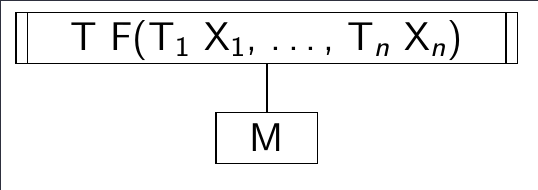

## Programozás alapjai

### 1. Algoritmusok vezérlési szerkezetei és megvalósításuk C programozási nyelven. A szekvenciális, iterációs, elágazásos, és az eljárás vezérlés.

#### Vezérlési módok

Segítségükkel azt fejezzük ki, hogy egyszerűbb műveletekből hogyan építhetünk fel összetettebb műveleteket és ennek milyen lesz a vezérlése, azaz milyen sorrendben kell végrehajtani az őt felépítő utasításokat.

Négy fő vezérlési módot különböztetünk meg:

- **Szekvenciális**: Véges sok művelet rögzített sorrendben egymás után történő végrehajtása

- **Szelekciós**: Véges sok művelet közül adott feltétel alapján valamelyik végrehajtása

- **Ismétléses**: Adott műveletet adott feltétel szerinti ismételt végrehajtása

- **Eljárás**: Adott művelet alkalmazása adott argumentumokra, ami az argumentumok értékének meghatározott változását eredményezi

> Ezek nyelv független fogalmak, amikor egy imperatív programozási nyelvet el akarunk sajátítani, a legfontosabb annak megismerése, hogy ezeket a vezérlési módokat milyen utasításokkal tudjuk (ha tudjuk) megvalósítani.

#### Algoritmusok leírása

Több féle képpen meg tudjuk adni egy algoritmus vezérlését, azaz azt az előírást, amely az algoritmus minden lépéséra kijelöli, hogy a lépés végrehajtása után melyik lépés végrehajtása következik.

- **Természetes nyelvi leírás**: Legegyszerűbb megközelítés, szövegesen, mindatokba foglalva írja le az algoritmust. Nagyon távol áll egy gépi megvalósítástól.

- **Pszeudo kód**: Egy programozási nyelv szerű struktúrált nyelv, de sokkal szabadabb, mint egy valódi programozási nyelv, nem kell minden részletet definiálni.

- **Folyamatábra**: Grafikus, kevésbé struktúrált gráf reprezentációja a végrehajtásnak, amely a működési folyamatra koncentrál

- **Szerkezeti ábra**: Szintén grafikus, strukturált leítása az algoritmus felépítésének leírására, amely leírja a működési folyamatot is

#### Folyamatábra

Akkor használjuk, ha csak a kész algoritmus működését szeretnénk leírni, és a szerkezete kevésbé fontos.

Az algoritmus egyes lépéseit egy gráf csúcspontjaiban definiáljuk, amely pontokat irányított nyilakkal kötjük össze, ezzel kijelölve a végrehajtás irányát.

Közel áll az assembly nyelvhez.

##### Szintaxis

Legyenek $M = \{ ~ M_1, ..., M_k ~ \}$ műveletek, és $F = \{ ~ F_1, ..., F_l ~ \}$ feltételek.

Az $(M, F)$ feletti folyamatábra olyan irányított gráf, amelyre teljesül a következő 5 feltétel:

- Van egy olyan pontja, ami a **Start** művelettel van címkézve, és ebbe a pontba nem vezet él.

- Van egy olyan pontja, ami a **Stop** művelettel van címkézve, és ebből nem indul ki él.

- Minden pontja vagy egy $M$-beli művelet, vagy egy $F$-beli feltétel a **Start** és **Stop** pontokon kívül.

- Ha egy pont
  
  - $M$-beli művelettel van címkézve, akkor belőle egy él indul ki
  
  - $F$-beli feltétellel van címkézve, akkor belőle két él indul ki, és ezek az **i** (igen), illetve **n** (nem) címkéket viselik.

- A gráf minden pontja elérhető a **Start** címkéjű pontból.

##### Szemantika

Egy folyamatábrát a következőképpen kell értelmezni:

- A végrehajtást a **Start** pontból kell kezdeni.

- Az összetett utasítás akkor ér véget, ha elértük a **Stop** pontot, azaz a vezérlést megkapja a **Stop** pont.

- A gráf egy pontjának a végrehajtását attól függően definiáljuk, hogy az $M$-beli utasítással, vagy $F$-beli címkével van címkézve.
  
  - Ha a pontban $M$-beli művelet van, akkor a művelet végrehajtódik és a 
    vezérlés a gráf azon pontjára kerül, amelybe a pontból kiinduló él 
    vezet.
  
  - Ha a pont $F$-beli feltétellel van címkézve, akkor kiértékelődik a 
    feltétel. Ha az értéke igaz, akkor az a pont kap vezérlést. amelybe az **i** (igen) 
    címkéjű él vezet, egyébként az a pont kapja meg a vezérlést, amelybe az **n** (nem) címkéjű él vezet.

##### Példa


1. **Start** pontból a vezérlés rákerül az $M_1$ utasítást tartalmazó blokkra.

2. $M_1$ végrehajtása után az $F_1$ feltétel kiártákelése történik.
   
   - Ha a feltétel igaz volt, akkor végrehajtjuk az $M_2$ utasítást

3. Akár végre hajtottuk az $M_2$ utasítást, akár nem, ezen a ponton eljutunk a **Stop** csúcsig

#### Szekvenciális vezérlés

Szekvenciális vezérlésről akkor beszélünk, amikor a $P$ probléma 
megoldását úgy kapjuk, hogy a problémát $P_1, ..., P_n$ részproblémákra 
bontjuk, majd az ezekre adott megoldásokat (részalgoritmusokat) sorban, 
egymás után végrehajtjuk.

$P_1, ... , P_n$ lehetnek elemi műveletek, de lehetnek összetettek is, 
amiket utána tovább kell bontani.

##### Folyamatábra


##### Szerkezeti ábra

Itt az látszódik, hogy a $P$ problémának a megoldását a $P_1, ..., P_n$ problémák megoldásával kapjuk. A sorrendiséget csak a felsorolás sorrendje jelzi.


##### C-ben

```c
{
    P1;
    ...
    P2;
}
```

#### Szelekciós vezérlés

A kiválasztás módjától függően megkülönböztetünk pár altípust:

- Egyszerű szelekciós vezérlés

- Többszörös szelekciós vezérlés

- Esetkiválasztásos szelekció

- A fentiek kiegészítve **egyébként** ágakkal

##### Egyszerű szelekciós vezérlés

Egyetlen művelet, és egyetlen feltétel van.

> Maga a művelet persze lehet összetett.

Legyen $F$ egy logikai kifejezés, $A$ pedig tetszőleges művelet. 
Az $F$ feltételből és az $A$ műveletből képzett **egyszerű szelekciós vezérlés** a következő vezérlési előírást jelenti:

1. Értékeljük ki az $F$ feltételt és folytassuk a 2. lépéssel

2. Ha $F$ értéke igaz, akkor hajtsuk végre az $A$ műveletet, és fejezzük be az összetett művelet végrehajtását

3. Egyébként ha $F$ értéke hamis, akkor fejezzük be az összetett művelet végrehajtását

A vezérlés bővíthető úgy, hogy a 3. pontban üres művelet helyett egy B műveletet hajtunk végre. (`else` ág, minimélis módosításokkal felírható hasonló definíció)

###### Folyamatábra


###### Szerkezeti ábra


###### C-ben

```c
if(F) {
    A;
}
```

```c
if(F) {
    A;
} else {
    B;
}
```

> Feltételes kifejezés (ternary): `a ? b : c`
> 
> A C nyelv egyetlen 3 operandusú művelete.

##### Többszörös szelekciós vezérlés

Több feltétel, több művelettel.

Legyenek $F_i$ logikai kifejezések, $A_i$ pedig tetszőleges műveletek $1 \le i \le n$-re (azaz mind feltételből, mint $A$ műveletből van $n$ darab). Az $F_i$ feltételekből és $A_i$ műveletekből képzett többszörös szelekciós vezérlés a következő vezérlési előírást jelenti:

1. Az $F_i$ feltételek sorban történő kiértékelésével adjunk választ a következő kérdésre: van-e olyan $i$ $(1 \le i \le n)$, amelyre teljesül, hogy az $F_i$ feltétel igaz és az összes $F_j$ $(1 \le j < i)$ feltétel hamis? (Azaz keressük az első $F_i$ feltételt, ami **igaz**.)

2. Ha van ilyen $i$, akkor hajtsuk végre az $A_i$ műveletet és fejezzük be az összetett művelet végrehajtását.

3. Egyébként, vagyis ha minden $F_i$ feltétel hamis, akkor fejezzük be az összetett művelet végrehajtását.

###### Folyamatábra


> Az utóbbi rendelkezik egyébként ággal

###### Szerkezeti ábra

Mivel a fenti dobozba nem lehetne beírni minden feltételt, és nem is lenne egyértelmű, hogy melyikhez melyik tartozik, csak egy **?**-et írunk.


> Valójában összeépíthető az egyszerű szelekciós vezérlés szerkezeti ábrájával, a hamis ágegy újabb egyszerű szelekcióba vezet, és így tovább ahány feltétel van (és a végén egy esetleges `else` ág).

###### C-ben

```c
if(F1) {
    A1;
} else if(F2) {
    A2;
    ...
} else if(Fn) {
    An;
} else {
    B;
}
```

Fontos, hogy a zárójelezésre figyeljünk, az alábbi két blokk ekvivalens, hiába tűnhet úgy, mintha a másodikban az `else` ág az első `if`-hez tartozna:

```c
if(F1) {
    if(F2)
        A1;
    else
        A2;
}
```

```c
if(F1)
    if(F2)
        A1;
else
  A2;
```

> A C nyelv nem whitespace érzékeny.

##### Esetkiválasztásos szelekciós vezérlés

Akkor alkalmazhatjuk, ha a többszörös szelekció feltételeit átírhatjuk úgy, hogy **elemek valamilyen halmazba tartozását** vizsgálják.

> `switch`

Legyen $K$ egy adott típusú kifejezés, és legyenek $H_i$-k olyan halmazok, melynek elemeinek típusa megegyezik $K$ típusával. Legyenek továbbá $A_i$ tetszőleges műveletek, ahol $1 \le i \le n$ teljesül. A $K$ szelektor kifejezésből, $H_i$ kiválasztó halmazokból és $A_i$ műveletekből képzett esetkiválasztásos szelekciós vezérlés a következő vezérlési előírást jelenti:

1. Értékeljük ki a $K$ kifejezést és folytassuk a 2. lépéssel.

2. Adjunk választ a következő kérdésre: Van-e olyan $i$ ($1 \le i \le n$), amelyre teljesül, hogy a $K \in H_i$, és $K \notin H_j$, ahol ($1 \le j<i$)?

3. Ha van ilyen $i$, akkor hajtsuk végre az $A_i$ műveletet és fejezzük be az összetett művelet végrehajtását.

4. Egyébként, vagyis ha $K$ nem eleme egyetlen $H_i$ halmaznak sem, akkor fejezzük be az összetett művelet végrehajtását.

> Itt is lehet egyébként ág (`default`), minimálisan módosul a definíció ha jelen van.

###### Folyamatábra


> Utóbbi a `default` ágas

###### Szerkezeti ábra


> $K$ az adott kifejezés, aminek a $H_i$-k be tartozását vizsgáljuk.

###### C-ben

```c
switch(K) {
    case H1:
        A1;
        break;
    ...
    case Hn:
        An;
        break;
    default:
        B;
        break;
}
```

> Alapból azt fejezzük ki, hogy melyik `case`-től kezdődően hajtsuk végre az $A_i$ utasításokat (mindhatni, hogy a `case`-ek belépési pontot határoznak meg). Így ha `break`-el, vagy `return`-el zárunk minden utasítást (esetleg kivéve az utolsót), akkor esetkiválasztásos szelekciót valósít meg a struktúra.

Itt a `case`-ek után egy elem állhat, nem egy halmaz, ezt a `case` működéséből adódóan (azaz abból, hogy egy belépési pontot határoz meg) viszont a következőképpen meg tudjuk oldani:

```c
case x_i1:
case x_i2:
...
case x_ini:
   Ai;
   break;
```

Ekkor az $A_i$ utasítás akkor fog kiválasztódni, ha $K \in H_i = \{ ~ x_{i, 1}, x_{i, 2}, ..., x_{i, n_i} ~ \}$

#### Eljárásvezérlés

Egy műveletet adott argumentumokra alkalmazunk, aminek hatására az argumentumok értékei pontosan meghatározott módon változnak meg.

Két fajta: eljárásművelet, függvényművelet.

##### Függvényművelet

Matematikai függvények álralánosítása

Függvényművelet specifikációja:

- Művelet elnevezése

- Paraméterek felsorolása

- Paraméterek típusa

- A műveletek hatásának leírása

- Eredménytípus

Jelölés: $T ~ ~ F(T_1 ~ X_1, ..., T_n ~ X_n)$

- $T$: a függvényművelet eredménytípusa

- $F$: a függvényművelet neve

- $T_i$: $i$. paraméter típusa

- $X_i$: $i$. paraméter azonosítója

> Zárójeleket akkor is kirakjuk, ha a paraméterlista üres

###### Szerkezeti ábra



> Formális paraméter: Függvényművelet leírásában használt paraméterek
> 
> Argumentum: Amire konkrét esetben végre szeretnénk hajrani a műveletet

###### C-ben

```c
T F(T1 X1, ... , Tn Xn)
{
   M;
}
```

##### Eljárásművelet

Alkalmazása adott argumentumokra az argumentumok értékének pontosan meghatározott megváltozását eredményezi.

Minden eljárásműveletnek rögzített számú paramétere van, és minden paraméter rögzített adattípusú.

Három mód:

- **Bemenő mód**: Ha a művelet végrehajtása nem változtathatja meg az adott argumentum értékét.

- **Kimenő mód**: Ha a művelet eredménye nem függ az adott argumentum 
  végrehajtás előtti értékétől, de az adott argumentum értéke a művelet 
  hatására megváltozhat.

- **Be- és kimenő (vegyes) mód**: Ha a művelet felhasználhatja az adott 
  argumentum végrehajtás előtti értékét és az argumentum értéke a művelet 
  hatására meg is változhat.

> Ezek a módok C-ben éppenséggel ugyan úgy működnek függvényműveletek esetén is, de nem feltétlen van ez így minden nyelv esetén

> C-ben a kimenő mód pointerekkel valósítható meg. Deklarációban: `T_i *X_i`, függvénytörzsben: `*X_i`-vel dereferáljuk. Híváskor: `&A_i`-vel pointert adunk át.

Eljárásművelet specifikációja:

- Művelet elnevezése

- Paraméterek felsorolása

- Paraméterek adattípusai

- Művelet hatásának leírása

Eljárásművelet általános jelölése: $P (m_1 ~ X_1 : T_1; ...; m_n ~ X_n : T_n)$

- $P$: az eljárás neve

- $m_i$: az $i$. paraméter kezelési módja

- $X_i$: az $i$. paraméter azonosítója

- $T_i$: az $i$. paraméter adattípusa

###### C-ben

`void` visszatérési érték típus.

A függvényműveletekkel ellentétben nem lehet egy összetett művelet részkifejezése (pont azért, mert nem vesz fel értéket, mivel nincs visszatérési értéke).

#### Ismétléses vezérlés

Ötféle ismétléses vezérlés:

- Kezdőfeltételes

- Végfeltételes

- Számlálásos

- Hurok

- Diszkrét

##### Kezdőfeltételes ismétléses vezérlés

A ciklusmag ismételt végrehajtását egy belépési feltételhez kötjük.

Legyen $F$ logikai kifejezés, $M$ pedig tetszőleges művelet. Az $F$ ismétlési feltételből és az $M$ műveletből (a ciklusmagból) képzett kezdőfeltételes ismétléses vezérlés a következő vezérlési előírást jelenti:

1. Értékeljük ki az $F$ feltételt és folytassuk a 2. lépéssel.

2. Ha $F$ értéke hamis, akkor az ismétlés és ezzel együtt az összetett művelet végrehajtása befejeződött.

3. Egyébként, vagyis ha az $F$ értéke igaz, akkor hajtsuk végre az $M$ műveletet, majd folytassuk az 1. lépéssel.

###### Folyamatábra


###### Szerkezeti ábra


###### C-ben

```c
while (F) {
    M;
}
```

##### Végfeltételes ismétléses vezérlés

A ciklusmag **elhagyását** kötjük egy kilépési feltételhez.

Legyen $F$ egy logikai kifejezés, $M$ pedig tetszőleges művelet. Az $F$ kilépési feltételből és az $M$ műveletből (ciklusmagból) képzett **végfeltételes ismétléses vezérlés** a következő vezérlési előírást jelenti:

1. Hajtsuk végre az $M$ műveletet majd folytassuk a 2. lépéssel.

2. Értékeljük ki az $F$ feltételt és folytassuk a 3. lépéssel.

3. Ha $F$ értéke igaz, akkor az ismétléses vezérlés és ezzel együtt az összetett művelet végrehajtása befejeződött.

4. Egyébként, vagyis ha az $F$ értéke hamis, akkor folytassuk az 1. lépéssel.

> Azaz a ciklusmag legalább egyszer lefut

###### Folyamatábra


###### Szerkezeti ábra


###### C-ben

```c
do {
    M;
} while (!F);
```

##### Számlálásos ismétléses vezérlések

Legyen `a` és `b` egész érték, `i` egész típusú változó, `M` pedig tetszőleges művelet, amelynek nincs hatása `a`,`b` és `i` értékére.

Az `a` és `b` határértékekből, `i` ciklusváltozóból és `M` műveletből (ciklusmagból) képzett **növekvő (csökkenő) számlálásos ismétléses vezérlés** az alábbi vezérlési előírást jelenti:

1. Legyen `i = a` (`i = b`) és folytassuk a 2. lépéssel.

2. Ha `b < i` (`i < a`), akkor az ismétlés és ezzel együtt az összetett művelet végrehajtása befejeződött.

3. Egyébként, vagyis ha `i <= b` (`a <= i`), akkor hajtsuk végre az `M` műveletet, majd folytassuk a 4. lépéssel.

4. Növeljük (csökkentsük) `i` értékét 1-gyel, és folytassuk a 2. lépéssel.

###### Folyamatábra

Növekvő:


Csökkenő:


###### Szerkezeti ábra

Növekvő:


Csökkenő:


###### C-ben

```c
for (kif_11, kif_12, kif_13;
     kif_2;
     kif_31,kif_32) {
    utasítás;     
}
```

Ez szemantikailag egyenértékü a következővel:

```c
kif_11; kif_12; kif_13;
while (kif_2) {
   utasítás;
   kif_31;kif_32;
}
```

##### Hurok ismétléses vezérlés

Amikor a ciklusmag ismétlését a ciklusmagon belül vezéreljük úgy, hogy a ciklus különböző pontjain adott feltételek teljesülése esetén a ciklus végrehajtását befejezzük, hurok ismétléses vezérlésről beszélünk.

Legyenek $F_i$ logikai kifejezések, $K_i$ és $M_j$ pedig tetszőleges (akár üres) műveletek $1 \le i \le n$ és $0 \le j \le m$ értékekre. Az $F_i$ kijárati feltételekből, $K_i$ kijárati műveletekből és az $M_i$ műveletekből képzett hurok ismétléses vezérlés a következő előírást jelenti:

1. Az ismétléses vezérlés következő végrehajtandó egysége az $M_0$ művelet.

2. Ha a végrehajtandó egység az $M_j$ művelet, akkor ez végrehajtódik. $j = n$ 
   esetén folytassuk az 1. lépéssel, különben pedig az $F_{j + 1}$ feltétel végrehajtásával a 3. lépésben.

3. A végrehajtandó egység az $F_i$ feltétel $1 \le i \le n$, akkor értékeljük ki. Ha $F_i$ igaz volt, akkor hajtsuk végre a $K_i$ műveletet, és fejezzük be a vezérlést. Különben a végrehajtás az $M_i$ művelettel folytatódik a 2. lépésben.

###### Folymatábra


###### Szerkezeti ábra


###### C-ben

Nincs rá olyan vezérlési forma, amivel körvezlenül megvalósítható.

Kezdőfeltételes ismétléses vezérlés és egyszerű szelekció segítségével kifejezhetjük.

> Nyelvfüggetlen megközelítés

```c
tovabb = 1;
while (tovabb) {
    M0;
    if (F1) {
        tovabb = 0;
        K1;
    } else {
        M1;
        ....
            if (Fn) {
                tovabb = 0;
                Kn;
            } else {
                Mn;
            }
    }
}
```

A C nyelvben a ciklusmag folyamatos végrehajtásának megszakítására két utasítás használható:

- `break`: megszakítja a ciklust, a program végrehajtása a ciklusmag utáni első utasítással folytatódik.

- `continue`: megszakítja a ciklusmag aktuális lefutását, a vezérlés a ciklus feltételének kiértékelésével (`while`, `do while`) illetve az inkrementáló kifejezés kiértékelésével (`for`) folytatódik.

C-ben `break` használatával:

```c
while(1) {
    M0;
    if (F1) {
        K1; break;
    }
    M1;
    ...
    if (Fn) {
        Kn; break;
    }
    Mn;
}
```

##### Diszkrét ismétléses vezérlés

Diszkrét ismétléses vezérlésről akkor beszélünk, ha a ciklusmagot végre kell hajtani egy halmaz minden elemére tetszőleges sorrendben. Legyen `x` egy `T` típusú változó, `H` a `T` értékkészletének részhalmaza, `M` pedig tetszőleges művelet, amelynek nincs hatása `x` és `H` értékére. A `H` halmazból, `x` ciklusváltozóból és `M` műveletből (ciklusmagból) képzett diszkrét ismétléses vezérlés az alábbi vezérlési előírást jelenti:

1. Ha a `H` halmaz minden elemére végrehajtottuk az `M` műveletet, akkor vége a vezérlésnek.

2. Egyébként vegyük a `H` halmaz egy olyan tetszőleges `e` elemét, amelyre még nem hajtottuk végre az `M` műveletet, és folytassuk a 3. lépéssel.

3. Legyen `x = e` és hajtsuk végre az `M` műveletet, majd folytassuk az 1. lépéssel.

###### Folyamatábra


###### Szerkezeti ábra


###### C-ben

A diszkrét ismétléses vezérlésnek nincs közvetlen megvalósítása a C nyelvben.

A megvalósítás elsősorban attól függ, hogy az ismétlési feltételben megadott halmazt hogyan reprezentáljuk.

### 2. Egyszerű adattípusok: egész, valós, logikai és karakter típusok és kifejezések. Az egyszerű típusok reprezentációja, számábrázolási tartományuk, pontosságuk, memória igényük, és műveleteik. Az összetett adattípusok és a típusképzések, valamint megvalósításuk C nyelven. A pointer, a tömb, a rekord, és az unió típus. Az egyes típusok szerepe, használata.

Az **adattípus** a programnak egy olyan komponense, amely két összetevője, az *értékhalmaz* és az értékhalmaz elemein végezhető *műveletek* által meghatározott.

#### Egyszerű adattípusok

Az elemi adattípusok közé tartoznak azok az adattípusok, amelyek értékhalmaza elemi értékekből áll, azaz nem összetett adatok alkotják.

Ezeket az elemi adattípussal rendelkező értékeket már nem lehet további, önmagukban is értelmes részekre bontani.

| C típus                  | méret (bit) | alsó határ                 | felső határ                |
| ------------------------ | ----------- | -------------------------- | -------------------------- |
| `char`                   | $8$         | fordító függő              | fordító függő              |
| `signed char`            | $8$         | $-128 (-2^7)$              | $127 (2^7-1)$              |
| `unsigned char`          | $8$         | $0$                        | $255 (2^8-1)$              |
| `short int`              | $16$        | $-32 768 (-2^{15})$        | $32 767 (2^{15}-1)$        |
| `signed short int`       | $16$        | $-32 768 (-2^{15})$        | $32 767 (2^{15}-1)$        |
| `unsigned short int`     | $16$        | $0$                        | $65 535 (2^{16}-1)$        |
| `int`                    | $32$        | $-2 147 483 648 (-2^{31})$ | $2 147 483 647 (2^{31}-1)$ |
| `signed int`             | $32$        | $-2 147 483 648 (-2^{31})$ | $2 147 483 647 (2^{31}-1)$ |
| `unsigned int`           | $32$        | $0$                        | $4 294 967 295 (2^{32}-1)$ |
| `long int`               | $32$        | $-2 147 483 648 (-2^{31})$ | $2 147 483 647 (2^{31}-1)$ |
| `signed long int`        | $32$        | $-2 147 483 648 (-2^{31})$ | $2 147 483 647 (2^{31}-1)$ |
| `unsigned long int`      | $32$        | $0$                        | $4 294 967 295 (2^{32}-1)$ |
| `long long int`          | $64$        | $-2^{63}$                  | $2^{63}-1$                 |
| `signed long long int`   | $64$        | $-2^{63}$                  | $2^{63}-1$                 |
| `unsigned long long int` | $64$        | $0$                        | $2^{64}-1$                 |
| `float`                  | $32$        | $-3.4028234663852886E+38$  | $3.4028234663852886E+38$   |
| `double`                 | $64$        | $-1.7976931348623157E+308$ | $1.7976931348623157E+308$  |
| `long double`            | $64$        | $-1.7976931348623157E+308$ | $1.7976931348623157E+308$  |

##### Egész

C-ben `int` és `char` típusok használhatóak egészek tárolására

Értelmezési tartomány az alábbiak szerint módosítható:

- `signed`: A típus előjeles értéket fog tartalmazni. Egy bit az előjelhez lesz felhasználva, nem az érték nagyságához.

- `unsigned`: A típus előjeltelen, nemnegatív értéket fog tartalmazni, minden bit felhasználható az érték nagyságához.

- `short`: kevesebb biten tárolódik, így kisebb az értelmezési tartománya. Ez a módosító már nem tehető ki a `char` elé.

- `long`: Ábrázolására több bit áll a rendelkezésre, azaz több érték ábrázolható vele. Akár duplán is alkalmazható (`long long`), és a `char` elé szintén nem kerülhet oda.

###### Pontosság

Az értelmezési tartomány határain belül valamennyi számot pontosan ábrázolnak.

> Különböző architektúrákon az egyes típusok mérete lehet más, de minden C megvalósításra igaz, hogy a `short` legfeljebb akkora, mint az `int`, ami legfeljebb akkora, mint a `long`, ami legfeljebb akkora, mint a `long long`
> 
> Pontos határok elérhetőek a `limits.h` headerben, ami preprocesszor definíciókkal közli velünk, mik a határok az adott architektúrán, pl.: `#define UCHAR_MAX 255`

###### Műveletek

- Aritmetikai műveletek: `+`, `-`, `*`, `/`, és `%`.
  
  - `/` ekkor a maradékos osztás egész része
  
  - `%` ekkor a maradékos osztás maradéka

- Relációs műveletek: `<`, `<=`, `>`, `>=`, `==`, `!=`.

- Bitenkénti logikai műveletek: `&`, `|`, `^`, `<<`, `>>`, `~`

**Egész kifejezések típusa**: Az eredmény típusa a két operandus típusa közül a nagyobbik lesz.

###### Számábrázolás

$n$ bit esetén $2^n$ állapotot tudunk megkülönböztetni, ez ennyi különböző szám ábrázolását jelenti.

- `unsigned` esetben: $[0, ..., 2^n - 1]$ zárt intervallumból vesz fel értéket. Az n db egymás utáni bitet bináris számként értelmezve kapjuk meg a reprezenzált értéket.

- `signed` esetben: $[-2^{n-1}, ..., 2^{n-1} - 1]$ zárt intervallumból vesz fel értéket.
  
  - Nemnegatív értékek: $0$ értékű bittel kezdődő $n$ bites bitsorozat a szám kettes számrendszerbeli alakját ábrázolja (bevezető $0$ bitekkel kiegészítve).
  
  - Negatív értékek: Eltároláskor adjunk hozzá a negatív értékhez $2^n$-t, és az eredményt tároljuk el. $1$-essel kezdődő bitsorozat pozitív számként értelmezett értékéből levonva a $2^n$ értéket kapjuk a reprezentált negatív értéket.
  
  > Ez a jellegű negatív szám tárolás a **kettes komplemens**
  > 
  > Úgy is megadható, hogy a reprezentálandó értéket negáljuk ($0$-ák, éy $1$-esek felcserélése), és hozzáadunk $1$-et.

##### Karakter

`char`-ban tárolt értéket lehet számként, és karakterként is értelmezni.

A char-ban tárot számok egy meghatározott kódtáblából hivatkoznak egy karakterre. Mivel ez az alkalmazott táblától függ, érdemes a kódban karakterrel hivatkozni, ha például egy feltételben ellenőrzünk, nem számmal (`'a'` ahelyett, hogy `97`).

A C alapvetően az ASCII táblát használja. Így a nem ascii karakterekkel vigyázni kell, mert pl. az UTF8 kódolás esetén egyes karakterek több byteon tárolódnak, ezt a C nem tudja kezelni.

###### Escape szekvenciák

Nem megjeleníthető karakterek, valami más hatásuk van. `\` karakterrel kezdődően adjuk meg.

Pár példa:

| Megnevezés     | Escape szekvencia |
| -------------- | ----------------- |
| újsor          | `\n`              |
| vízszintes tab | `\t`              |
| backslash      | `\\`              |

> Pontosság, műveletek, számábrázolás az egészekről szóló részben

##### Logikai

Eredetileg nem volt része a nyelvnek, a $C^{99}$ szabvány vezette be.

`_Bool` típus $\{ ~ 0, 1 ~\}$ értékkészlettel.

A logikai, és az egész típusok konvertibilisek C-ben.

> Ez onnan ered, hogy C-ben a $0$ a hamis, minden más igaz.

`stdbool.h` header: Definiál egy elegánsabb `bool` típust, plusz a `false` és `true` literálokat.

> Pontosság, műveletek, ábrázolás megintcsak megegyezik az egészekkel, mivel az egészek is viselkedhetnek logikai értékként.

##### Valós

`float` és `double`

Méretük lehet architektúrafüggő, de `float` legfeljebb akkora, mint `double`, ami legfeljebb akkora, mint `long double`.

###### Pontosság

Nem tudunk, csak diszkrét értékeket pontosan ábrázolni.

Valósok esetén annyit tudunk garantálni, hogy az értékkészlet határain belül minden értéket képesek vagyunk egy `e` relatív pontossággal ábrázolni, azaz minden `a` valós számhoz megadható az az `a`-hoz legközelebbi az adott valós típuson ábrázolható `x` érték, amelyre $(|(x - a) / a| \le e)$ teljesül.

A pontossági problémák miatt a `==` és `!=` operátorokkal vigyázni kell. Előfordulhat, különösen nagyon kicsi számok esetén, hogy az elvileg egyező értékek különböznek egymástól az ábrázolás miatt.

> Megoldás lehet egy megadott toleranciával dolgozó, összehasonlítást végző makró használata: `#define EQUALS(X,Y) ( ( ((X) > (Y)) ? ((X) - (Y)) : ((Y) - (X)) ) <= 1e-10 )`

> A nagyon kicsi számokkal az aprobléma, hogy a *tört* részben sok vezető $0$ lesz (pl. $0.0000000000035$), így kevés számjegy marad a valódi érték ábrázolására.

###### Számábrázolás

Egy valós értéket tároló memóriaterület három részre osztható lebegőpontos számábrázolás esetén:

- Előjelbit
  
  - $0$: Pozitív szám
  
  - $1$: Negatív szám
  
  > Mivel mindig jelen van, ezért nincs `signed` és `unsigned` módosítója a valós típusoknak.

- Tört

- Kitevő

> Mindegyik fix hosszúságú biten van tárolva

Valós szám ábrázolása:

1. A számot kettes számrendszerbeli $1.m * 2^k$ normál alakra hozzuk.

2. $m$ bináris számjegyeit tároljuk a *tört* részen
   
   1. Meghatározza az ábrázolás pontosságát

3. $k$ egy típusfüggő, $b$ korrekciós konstanssal megnövelt értéket tároljuk a *kitevőnek* fenntartott helyen egész számként
   
   1. Kitevő meghatározza az értéktartományt

[Binary 4 – Floating Point Binary Fractions 1 - YouTube](https://www.youtube.com/watch?v=L8OYx1I8qNg)

- `float`: 32 biten tárolja a valós számokat
  
  - 1 *előjel* bit
  
  - 8 *kitevő* bit ($b = 2^7 - 1 = 127$ korrekciós értékkel)
  
  - 23 *tört* bit

- `double`: 64 biten tárolja a vaéósz számokat
  
  - 1 *előjel* bit
  
  - 11 *kitevő* bit ($b = 2^{10} - 1 = 1023$ korrekciós értékkel)
  
  - 52 *tört* bit (azaz lb dupla olyan pontos)

#### Típusképzés

`typedef` kulcsszóval lehet típusokat elnevezni, saját típusokat definiálni.

```c
typedef tipus uj_tipusnev;
```

Például az igen hosszú `unsigned long long int` típust a `typedef unsigned long long int ulli;` utasítással `ulli`-nek keresztelhetjük.

Ha utólag jövünk rá, hogy bizonyos helyeken elég mondjuk egy kisebb méretű típus használata, akkor hasznos, ha ezt az adott műveletet eleve egy általunk megadott type alias-al használtuk, mert akkor egy helyen elég átírni.

#### Összetett adattípusok

Azokat a típusokat, amelyek értékei tovább bonthatóak, illetve további értelmezésük lehetséges, **összetett adattípusok**nak nevezzük.

##### Pointer

Dinamikus változónak nevezzük azt a változót, amely bármely blokk aktivizálásától (végrehajtásától) független hozhatunk létre, illetve szüntethetünk meg. Az ilyen dinamikus változók megvalósításának eszköze lesz a pointer típus.

`típus * változónév;`

Pointer deklaráció két értelmezése (`int * p;`):

- `*p` egy `int` típusú (dinamikus) változó

- `p` egy `int*` típusú (azaz egy `int`-re mutató) változó

Az előbbi szerencsésebb lehet, ugyanis a`*` a változóhoz tartozik, például `int * p, q;` esetén `q` egy szimpla `int` lesz.

Lehet pointer típust is definiálni: `typedef típus *pointertípusnév;`

###### Változóhivatkozás

Szintaktikus egység, meghatározott formai szabályok szerint képzett jelsorozat egy adott programnyelven, tehát egy kódrészlet. Azaz egy `p = 3;` utasítás esetén maga a `p` jel(sorozat) a változóhivatkozás.

###### Változó

A program futása során a program által lefoglalt memóriaterület egy része, amelyen egy adott (elemi vagy összetett) típusú érték tárolódik. Például egy `int p;` deklaráció esetén a memóriában lefoglalódik egy `int` típusú érték tárolására alkalmas hely, és ezen a területen tárolódik majd a változó értéke.

###### Pointer, mint absztrakt adattípus

Dinamikus változóhivatkozáshoz tartozó változók a pointer típus műveleteivel hozhatók létre és szüntethetők meg.

| Művelet megnevezése                                 | Művelet leírása                                                                                                                                            |
| --------------------------------------------------- | ---------------------------------------------------------------------------------------------------------------------------------------------------------- |
| `NULL`                                              | Konstans, érvénytelen pointer érték, ha egy pointerhez ezt az értéket kapcsoljuk, akkor annak jelentése, hogy a pointerhez nem tartozik dinamikus változó. |
| Létesít($\leftarrow$ `X` : `PE`)                    | Új `E` típusú dinamikus változó létesítése, amely elérhetővé válik az `X` `PE` (azaz `E` típusra mutató) pointer által.                                    |
| Értékadás($\leftarrow$ `X` : `PE`, $\to$ `Y`: `PE`) | Az `X` pointer felveszi az `Y` pointer értékét, azaz `X` és `Y` a művelet végrehajtása után ugyanarra a dinamikus változóra mutatnak.                      |
| Törlés($\leftrightarrow$ `X`: `PE`)                 | Az `X` által hivatkozott dinamikus változó törlésre kerül. Az `X` ezen túl nem hivatkozik semmire.                                                         |
| Dereferencia($\to$ `X`: `PE`) : `E`                 | Visszaad egy `E` típusú változó hivatkozást, amivel a dinamikus változót el tudjuk érni, amivel arra hivatkozhatunk.                                       |
| Egyenlő($\to$ `p` : `PE`, $\to$ `q`: `PE`): bool    | Összehasonlítja, hogy `p` és `q` ugyanarra a dinamikus változóra hivatkoznak-e (beleértve, hogy egyik sem hivatkozik változóra)!                           |
| NemEgyenlő($\to$ `p` : `PE`, $\to$ `q`: `PE`): bool | Összehasonlítja, hogy `p` és `q` más-más dinamikus változóra hivatkoznak-e (beleértve, hogy legfeljebb az egyik nem hivatkozik változóra)!                 |

> $\leftarrow$: kimenő paraméter
> 
> $\to$: bemenő paraméter
> 
> $\leftrightarrow$: be- és kimenő módú paraméter

###### Pointer, mint virtuális adattípus

| Művelet absztrakt szinten                           | Művelet virtuális megvalósítása |
| --------------------------------------------------- | ------------------------------- |
| `NULL`                                              | `NULL`                          |
| Létesít($\leftarrow$ `X` : `PE`)                    | `X = malloc(sizeof(E));`        |
| Értékadás($\leftarrow$ `X` : `PE`, $\to$ `Y`: `PE`) | `X = Y`                         |
| Törlés($\leftrightarrow$ `X`: `PE`)                 | `free(X); X = NULL;`            |
| Dereferencia($\to$ `X`: `PE`) : `E`                 | `*X`                            |
| Egyenlő($\to$ `p` : `PE`, $\to$ `q`: `PE`): bool    | `p == q`                        |
| NemEgyenlő($\to$ `p` : `PE`, $\to$ `q`: `PE`): bool | `p != q`                        |
| Cím($\to$ `v`:`E`, $\leftarrow$ `p`:`PE`)           | `p = &v;`                       |

> A `&` operátorral (memória cím lekérés) lokális változók esetén vigyázni kell, ugyanis azok az adott scope végén felszabadulnak (stack-en vannak), az oda mutató pointer így már felszabadított területre fog mutatni. 

Létrehozáson és megszűntetésen kívül mind megvalósítható közvetlenül a C nyelvi elemeivel.

Ezt a kettőt pedig a `stdlib.h` headerből elérhető `malloc` és `free` utasításokkal tudjuk megvalósítani.

###### Pointer mérete

32 bites architektúrán 4 byte, 64 bitesen 8 byte-on tartalmazza a hozzá tartozó dinamikus változó kezdőcímét.

###### `void*`

A `void*` egy speciális, úgynevezett típustalan pointer.
Az ilyen típusú pointerek "csak" memóriacímek tárolására alkalmasak, a dereferencia művelet alkalmazása rájuk értelmetlen.

Viszont minden típusú pointerrel kompatibilisek értékadás és összehasonlítás tekintetében.

Valójában a `malloc` függvény visszatérési értéke is `void*`, és ez kasztolódik impliciten a megfelelő típusú mutatóvá.

###### Függvény argumentumok módjainak kezelése

Alapvetően az érték szerint átadott argumentumok bemeneti argumentumok.

Kimenő, vagy be- és kimenő argumentumos keseén pointereket kell alkalmaznunk.

Például a következő függvény:

```c
void csere (int x, int y) {
    int m;
    m = x;
    x = y;
    y = m;
}
```

nem végzi el ténylegesen a cserét, ugyanis érték szerint kapja a paramétereket, így csak a stack-re kerülő két lokális változót fogja cserélni, ami csak a saját scope-ján belül történik meg.

Módosítani kell ezt a függvényt, hogy ne érték szerint várja az értékeket:

```c
void csere (int *x, int *y) {
    int m;
     m = *x;
    *x = *y;
    *y = m;
}
```

##### Tömb

Rögzített számú, ugyan olyan typusú elemek sorozata

###### Tömb, mint absztrakt adattípus

| Művelet megnevezése                                               | Művelet leírása                                                    |
| ----------------------------------------------------------------- | ------------------------------------------------------------------ |
| Kiolvas ($\to$ `A`: `T`,$\to$ `i`: `I`,$\leftarrow$ `x`: `E`)     | Az `A` tömb `i`. értékét kiolvassa és eltárolja az `x` változóban. |
| Módosít($\leftrightarrow$ `A`: `T`,$\to$ `i`: `I`,$\to$ `x`: `E`) | Az `A` tömb `i`. értékét módosítja az `x` értékkel.                |
| Értékadás ($\leftarrow$ `A`: `T`,$\to$ `X`: `T`)                  | Az `A` tömb felveszi az `X` tömb típusú kifejezés értékét.         |

> `T`: tömb típus
> 
> `E`: tömb-beli érték típusa
> 
> `I`: index típus ($0, ..., n-1$ intervallumból egy érték)

###### Tömb, mint virtuális adattípus

A változó neve kiegészül egy szögletes zárójel párral, ami között megadjuk a tömb méretét, azaz azt az elemszámot, amennyi elemet el szeretnénk tárolni a tömbben.

`típus változónév[elemszám];`

Természetesen a tömb típussal is definiálhatunk új típust:

`typedef típus újnév[elemszám];`

| Művelet absztrakt szinten                                         | Művelet virtuális megvalósítása                                                                                            |
| ----------------------------------------------------------------- | -------------------------------------------------------------------------------------------------------------------------- |
| Kiolvas ($\to$ `A`: `T`,$\to$ `i`: `I`,$\leftarrow$ `x`: `E`)     | `x = A[i];`                                                                                                                |
| Módosít($\leftrightarrow$ `A`: `T`,$\to$ `i`: `I`,$\to$ `x`: `E`) | `A[i] = x;`                                                                                                                |
| Értékadás ($\leftarrow$ `A`: `T`,$\to$ `X`: `T`)                  | Nincs direkt megvalósítás! Használható a `memcpy()`, vagy a $C^{11}$ szabvány után a biztonságosabb `memcpy_s()` függvény. |

> Fontos, hogy C-ben nincs indexhatár ellenőrzés, azzaz alul- vagy felülindexelhetünk egy tömböt, és ez látszólag nem fog problémát okozni, azonban futási hibákat eredményezhet amiatt, hogy a memória egy olyan területét érjük el, amin más adat van.

###### Több dimenziós tömbök

A műveletek nagyon hasonlóan definiálhatóak, de `I` itt indexek egy $(i_0, ..., i_k)$ vektora ($k$ dimenziós tömb esetén).

Kiolvasás: `x = A[i1]...[ik];`

Módosítás: `A[i1]...[ik] = x;`

Értékadás: `memcpy()` vagy `memcpy_s()`

###### Tömb inicializálása

```c
int t[][3] = {
    { 1, 2, 3 },  { 4, 5, 6 },  { 7, 8, 9 }
};

int t1[4][3] = {
    { 1, 2, 3 },  { 4, 5, 6 },  { 7, 8, 9 }
};

int t2[][3] = {
    { 1 },  { 4 },  { 7 },  { 9 }
};
```

> Üresen hagyott méreteket (`[]`)-et az inicializációból kikövetkezteti a nyelv.

> Inicializálatlan cellák értéke $0$

###### Tömb, mint fizikai adattípus (hogy néz ki a memóriában)

Tömb típusú változó számára történő helyfoglalás azt jelenti, hogy minden tömbelem, mint változó számára memóriát kell foglalni. Feltehetjük, hogy egy adott tömb változóhoz a tömbelemek számára foglalt tárterület összefüggő mezőt alkot.

A tömb azonosítója valójában egy pointer az első elemére.

Az indexelés pedig nem más, mint egy shorthand arra, hogy az első elemre mutató pointerrel, és egy offsettel érünk el egy bizonyos elemet.

Egy dimenziós esetben egyszerűen számolható ez az offset, hiszen csak az index és egy elem méretének szozata adja meg.

##### Rekord

Különböző típusú, de logikailag összefüggő értékek kezelésére alkalmas.

###### Szorzat-rekord absztrakt adattípus

| Művelet megnevezése                                     | Művelet leírása                                                                                                                                              |
| ------------------------------------------------------- | ------------------------------------------------------------------------------------------------------------------------------------------------------------ |
| $Kiolvas_i$($\to$ `A` : `T`,$\leftarrow$ `x`:`Ti`)      | Az `A` `T` típusú szorzat rekord `i`. mezőjét kiolvasó művelet, amely az `i`. mező típusának megfelelő `x` változóba teszi a kiolvasott mező értékét.        |
| $Módosít_i$($\leftrightarrow$ `A`: `T`;$\to$ `x` :`Ti`) | Az `A` `T` típusú szorzat rekord `i`. mezőjét módosító (beállító) művelet, amely az `i`. mező típusának megfelelő `x` változót értékül adja az `i`. mezőnek. |
| $Értékadás$($\leftarrow$ `A`:`T`;$\to$ `X` : `T`)       | Az `A` `T` típusú szorzat rekord változónak értékül adja az `X` `T` típusú szorzat rekord változót.                                                          |

###### Szorzat-rekord vitruális adattípus

```c
typedef struct T {
    T1 M1;
    ...
    Tk Mk;
} T;
```

Az első `T` a struktúra neve, ami akár el is maradhatna, a második `T` viszont az újonnan, a `typedef` által bevezetett típus neve.

> Ha a struktúrának nem adunk nevet, és nem is definiálunk hozzá egy új 
> típust, akkor mindannyiszor, amikor adott elemeket tartalmazó struktúra 
> változót szeretnénk létrehozni, le kell írni a teljes struktúra definícióját. Ez persze már túl hosszú ahhoz, hogy ezt többször megadjuk. Így ha van neve a struktúrának, akkor a következő esetben már `struct T` is elég a megadásához, ha pedig típust is képeztünk belőle, akkor a típusképzés után már a `T` típusazonosító is egyértelműen hivatkozza az adott struktúrát.

A fenti típusképzésben az `M1` ... `Mk` azonosítókat mezőazonosítóknak (tagnak, membernek) hívjuk és lokálisak a típusképzésre nézve.

| Művelet absztrakt szinten                               | Művelet virtuális megvalósítása |
| ------------------------------------------------------- | ------------------------------- |
| $Kiolvas_i$($\to$ `A` : `T`,$\leftarrow$ `x`:`Ti`)      | `x = A.Mi`                      |
| $Módosít_i$($\leftrightarrow$ `A`: `T`;$\to$ `x` :`Ti`) | `A.Mi = x`                      |
| $Értékadás$($\leftarrow$ `A`:`T`;$\to$ `X` : `T`)       | `A = X`                         |

###### Szorzat-rekord fizikai adattípus

Mivel a struktúra egy összetett adat, így az, hogy ő konkrétan mekkora részt foglal a memóriában függ attól, hogy a benne levő típusok megkorák, illetve tudnunk kell azt, hogy ezek hogy tárolódnak.

Összefüggő memóriaterületen tárolódik.

`sizeof(E)` = `sizeof(T1) + ...+ sizeof(Tk)` + igazítás.

Valamennyi mező a deklaráció sorrendjében egymást követő, növekvő memóriacímen 
kezdődik. Az első mező memóriacíme megegyezik a teljes `struct` típusú érték címével.

###### Bitmezők

```c
struct {
    unsigned int flag1 : 1;
    unsigned int flag2 : 1;
    unsigned int flag3 : 2;
} jelzok;
jelzok.flag1 = jelzok.flag2 = 0;
jelzok.flag3 = 1;
if (jelzok.flag1 == 0 && jelzok.flag3 == 1) {
    /* ... */
}

```

> Meg lehet adni, melyik mező hány bites legyen.

###### A `->` operátor

Legyen `tp` egy struktúra típusú változóra mutató pointer. Ilyenkor ha a struktúra egy mezőjére szeretnénk hivatkozni, azt a `(*tp).mezonev` alakban tudunk.

Mivel ez egy gyakori eset, egy egyenértékű, egyszerűbb megvalósítás: `tp->mezonev`

##### Unió

Elképzelhető, hogy úgy szeretnénk egységesen hivatkozni adatokra, hogy a konkrét megvalósításban még nincs fogalmunk arról, hogy a program adott futásakor milyen típusú adatot kapunk az adott ponton.

###### Egyesített-rekord absztrakt adattípus

| Művelet megnevezése                                     | Művelet leírása                                                                                                                                                                                                              |
| ------------------------------------------------------- | ---------------------------------------------------------------------------------------------------------------------------------------------------------------------------------------------------------------------------- |
| $Változat$($\to$ `A` : `T`;$\leftrightarrow$ `V`:`T0`)  | Változat kiolvasása. A művelet végrehajtása után $V = c_i$, ha $A = (c_i, a)$.                                                                                                                                               |
| $Kiolvas_i$($\to$ `A` : `T`,$\leftarrow$ `x`:`Ti`)      | Adott `i` $\in \{ 1 ~ ... ~ k \}$-ra az `A` rekord `i`. komponensének kiolvasása adott `x`, `Ti` típusú változóba. A művelet végrehajtása után `x=a`, ha `A=(c_i,a)`. A művelet hatástalan, ha `A` első komponense nem `ci`. |
| $Módosít_i$($\leftrightarrow$ `A`: `T`;$\to$ `x` :`Ti`) | Adott `i` $\in \{ 1 ~ ... ~ k \}$-ra az `A` rekord `i`. komponensének módosítása adott `x`, `Ti` típusú értékre. A művelet végrehajtása után `A=(c_i,x)`.                                                                    |
| $Értékadás$($\leftarrow$ `A`:`T`;$\to$ `X` : `T`)       | Az `A` `T` típusú szorzat rekord változónak értékül adja az `X` `T` típusú szorzat rekord változót.                                                                                                                          |

###### Egyesített-rekord vitruális adattípus

```c
typedef union T {
    T1 M1;
    ...
    Tk Mk;
} T;
```

Ebben a típusképzésben is az `M1`, ,`Mk` azonosítókat mezőazonosítóknak (tagnak, member-nek) hívjuk és lokálisak a típusképzésre nézve. Illetve az `union` szó utáni névre és a típus nevére hasonlóak igazak, mint a `struct` esetében.

Megjegyzendő, hogy a C megvalósításában (megfelelő környezetben) mindig hivatkozhatunk bármelyik mezőre, függetlenül attól, hogy az `union` aktuálisan melyik mező értékét tárolja.

Önmagában a C `union` típusképzésében nem adhatunk meg változati mezőazonosítót ($T_0$), így nincs lehetőségünk az aktuális változatról információ tárolására. Éppen ezért, ha ez a változati mezőazonosítót is el szeretnénk tárolni, akkor kombináljuk a `struct` és `union` lehetőségeit:

```c
typedef struct T {
    T0 Milyen;
    union {
        T1 M1;
        ...
        Tk Mk;
    };
} T;
```

| Művelet megnevezése                                     | Művelet leírása                     |
| ------------------------------------------------------- | ----------------------------------- |
| $Változat$($\to$ `A` : `T`;$\leftrightarrow$ `V`:`T0`)  | `V = A.Milyen`                      |
| $Kiolvas_i$($\to$ `A` : `T`,$\leftarrow$ `x`:`Ti`)      | `if (A.Milyen == ci) { x = A.Mi; }` |
| $Módosít_i$($\leftrightarrow$ `A`: `T`;$\to$ `x` :`Ti`) | `{ A.Milyen = ci; A.Mi = x ; }`     |
| $Értékadás$($\leftarrow$ `A`:`T`;$\to$ `X` : `T`)       | `A = X`                             |

###### Egyesített-rekord fizikai adattípus

Láttuk, hogy az `union`-on belül egy adott időpillanatban egy mező lesz az érvényes, így egyszerre nem szükséges minden mezőt eltárolni. Így ha a legnagyobb mező méretének megfelelő memória foglalódik az `union` számára, abban valamennyi mezőn tárolt érték elfér majd.

Azaz egy `T` `union` típus mérete a következő módon alakul: `sizeof(T) = max{sizeof(T1), ..., sizeof(Tk)}`.

##### A struct és union típusok inicializálása

Mind a `struct`, mind az `union` változók kaphatnak kezdőértéket, az adattagok értékeit a `{}`-ek között kell felsorolni.

Az értékek szimpla felsorolásával `struct`-ban az adattagok sorrendjében kell megadni az egyes tagok értékét, de nem kötelező mindet, az `union` esetében viszont csak az első mező típusának megfelelően inicializálható.

A $C^{99}$ szabvány lehetővé teszi tetszőleges mezők inicializását a mezők neveit felhasználva. Ekkor a `{}` zárójelek között az egyes értékek elé a `.mezo =`-t írva jelezhetjük, hogy az adott érték mely mező kezdőértéke lesz:

```c
Idom i = {
    .UU = {
        .U1 = {
            .C = 3, .B = 4, .A = 5
        }
    },
    .Fajta = haromszog
};
```
