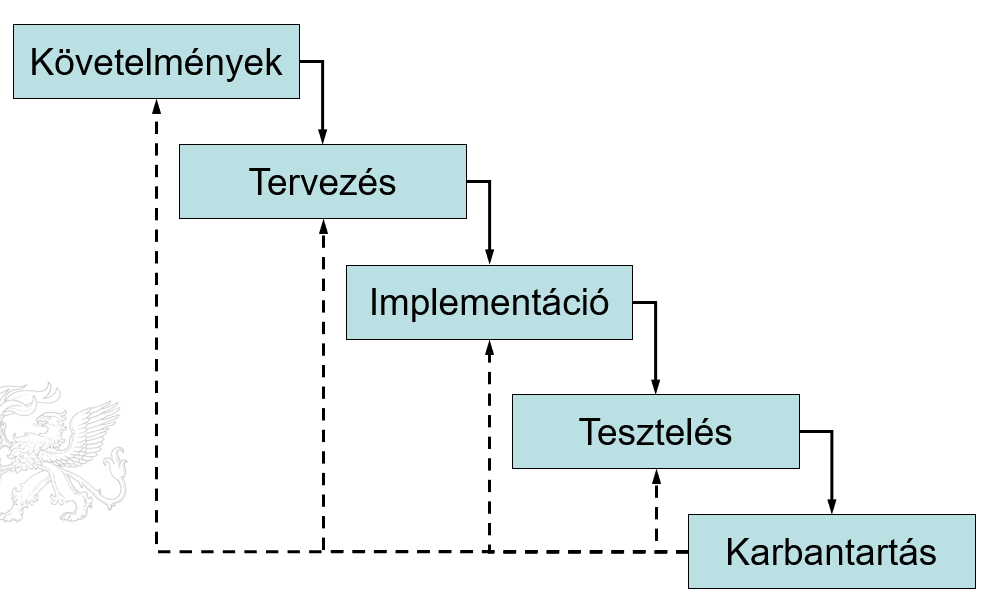
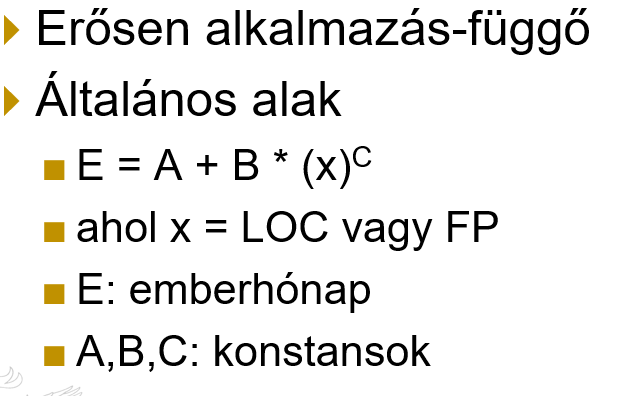
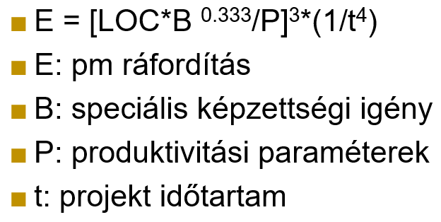
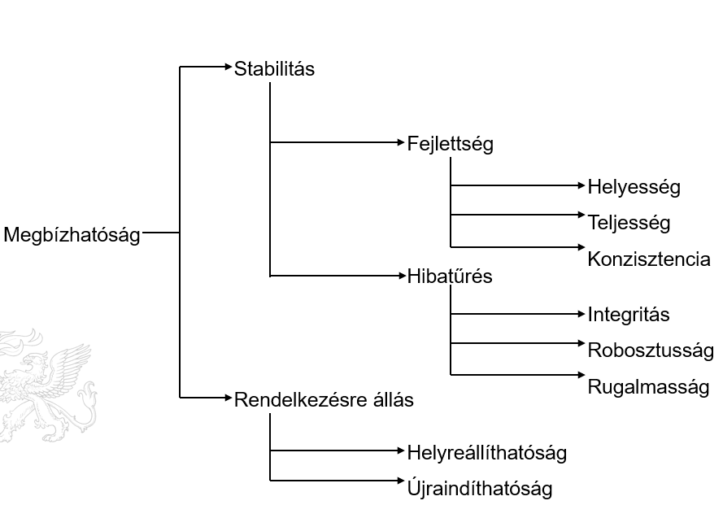
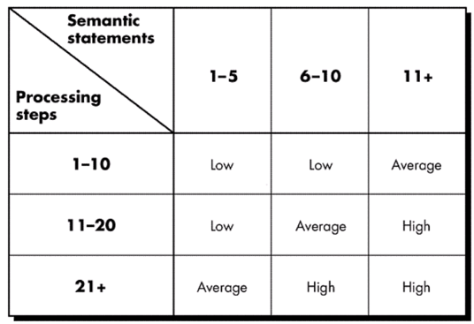
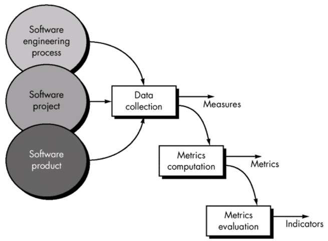
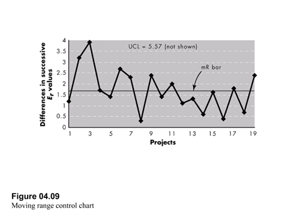

## Rendszerfejlesztés 1.

### 1. Szoftverfejlesztési folyamat és elemei; a folyamat különböző modelljei.

#### A szoftverfejlesztés folyamata

- **_A szofverfolyamat_**: tevékenységek és kapcsolódó eredmények, amely során elkészítjük a szoftvert

- A folyamat összetett, kreatív munka kell hozzá

- Csak korlátozott automatizálás

- Nincs ideális folyamat, viszont modellek léteznek

- Minden folyamat egyedi, sokszor kombinációkat használnak

**Folyamat szerepe**:

- Szoftverfejlesztés = folyamat +menedzsment + technikai módszerek + eszközök használata

- Minőségi szoftver biztosítéka

- Folyamat meggátolja hogy elveszítsük az uralmat a projekt felet

- Adaptálás adott projekthez és környezethez

**Folyamat elemek:**

- Fő elemek
  
  - Feladatok, termékek
  
  - Határidők, átadandók

- Kiegészítő elemek
  
  - Projektmenedzsment
  
  - Konfigurációmenedzsment
  
  - Dokumentáció
  
  - Minőségbiztosítás, kockázatmenedzsment
  
  - Mérés

**Folyamat fejlettsége**

- Egy szervezetnél alkalmazott folyamat minősítése meghatározhatja a megrendelők bizalmát

- SEI CMM(I) (Capability Maturity Model Integration)

- _Szintjei:_
  
  - Kezdeti
  
  - Reprodukálható
  
  - Definiált
  
  - Ellenőrzöt
  
  - Optimalizált

**A szoftverfolyamat fázisai**

- Minden folyamatnak elemei:
  
  - **Specifikáció**: szoftver funkcionalitása, megszorítások („mit”)
  
  - **Fejlesztés**: tervezés és implementáció specifikáció alapján („hogyan”)
  
  - **Verifikáció és Validáció**: fejlesztés megfelel-e a specifikációnak és a követelményeknek
  
  - **Evolúció**: változás kezelése, szoftver „utóélete”

- **Specifikáció**
  
  - Szoftver definiálása
    
    - Milyen funkciókat, szolgáltatásokat követelünk meg a rendszertől
    
    - Követelménytervezés
  
  - Kritikus szakasz: itt a legkisebb a változtatások költsége
  
  - Eredmény: követelményspecifikáció dokumentum, esetleg prototípusok
    
    - Végfelhasználónak: magas szintű
    
    - Fejlesztőknek: részletes, technikai

- **Követelménytervezés fázisai**
  
  - Megvalósíthatósági tanulmány (feasibility study)
  
  - Költséghatékonyság ellenőrzése
  
  - Követelmények feltárása és elemzése:
    
    - Rendszermodellek, prototípusok
  
  - Követelményspecifikáció: Egységes dokumentum
  
  - Követelmény validáció

- **Tervezés**
  
  - Szoftver struktúrája, adatok, interfészek
  - Rendszermodellek különböző absztrakciós szinteken
  - _Tevékenységei:_
    - Architektúra tervezés: alrendszerek meghatározása
    - Absztrakt specifikáció: alrendszerek szolgáltatásai
    - Interfész tervezés: alrendszerek között
  - Komponens tervezése
  - Részletek: adatszerkezetek, algoritmusok
  - Gyakorlati folyamatok speciálisan definiálják ezeket

- **Tervezési módszerek**
  
  - Ad hoc (átfogó rendezés nélkül)
  
  - Strukturált
    
    - Structured Design (SD)
    
    - SSADM
    
    - Jackson
  
  - Objektumorientált
    
    - pl.: UML (Unified Modeling Language, szabványos, általános célú modellező nyelv, üzleti elemzők, rendszertervezők, szoftvermérnökök számára)
  
  - Közös: grafikus rendszermodellek, szabványos jelölésrendszer, CASE (Computer Aided Software Engineering) támogatás

- **Implementáció**
  
  - Programozás és nyomkövetés
  
  - kritikus rendszereknél részletes tervezés alapján
  
  - Programozás (kódolás): adottság kell hozzá, személyes technikák, stílusok
  
  - Minőségbiztosítás érdekében kódolási stílust lehet megkövetelni
  
  - Nyomkövetés (debugging): hiba lokalizálás, eltávolítás, újratesztelés, programszöveg manuális vizsgálata, eszköztámogatás

- **Szoftver validáció**
  
  - Verifikáció és validáció (V & V): Rendszer megfelel-e a specifikációnak, és a megrendelő elvárásainak
  
  - Tesztelés különböző szinteken történik, inkrementálisan
    
    - Egység tesztelése (unit test): komponensek független tesztelése, programozó feladata
    
    - Modul tesztelése: függő és kapcsolódó komponenseket együtt, szintén a programozó feladata
    
    - Alrendszer tesztelése: például interfészek illeszkedése, független tesztelő csapat feladata
    
    - Rendszer tesztelése: előre nem várt kölcsönhatások felfedezése, validáció
      specifikációhoz tesztadatokon, független tesztelő csapat
    
    - Átvételi tesztelés: megrendelő adataival, valós környezetben, alfa tesztelés (fejlesztő vagy teszt csapat végzi)
    
    - Béta tesztelés: potenciális vásárlók által tesztelt, előre nem látható hibák keresése

- **Evolúció**
  
  - Szoftver flexibilitás miatt nagy, összetett rendszerek születnek
  
  - Változás bár költséges, de
    
    - Eredményesebb meglévő rendszerekből kialakítani az újat
    
    - Kevés a teljesen új szoftver
    
    - Egy szoftver sosincs kész
  
  - Követelményspecifikáció után a meglévő rendszereket kiértékeljük
    
    - Manuális vizsgálat
    
    - Automatikus elemzés (reverse engineering)
    
    - Kimenet: dokumentáció, magasabb szintű rendszermodell
  
  - Rendszermódosítások után jön létre az „új” rendszer
    
    - Újratervezés (re-engineering)
    
    - Folyamatos evolúció (roundtrip engineering)

#### A folyamat modelljei

##### Kategóriák

- Triviális: lineáris, vízesés
  
  - Tevékenységek különálló fázisok
  
  - Iteratív modellek: prototípus, vízesés, RAD

- Evolúciós: prototípusok gyors gyártása, finomítása

- Formális módszerek: matematikai rendszer, transzformációk

- Újrafelhasználható, komponens alapú

##### **Vízesés modell**

- Első publikált, „klasszikus” modell (életciklus modell)

- Lényegében egy szekvenciális modell
  
  - Fázisok lépcsősen kapcsolódnak
  
  - Visszacsatolás is van

- Fázisok kimenetei teljesen el kell, hogy készüljenek, mielőtt továbbmegyünk
  
  - A hibákat összegyűjtik a fázisok végén
  
  - Javításra a folyamat végén van lehetőség
  
  - Iteráció közvetve van jelen

- Ha jó a specifikáció, akkor működőképes

- Problémái
  
  - Ritkán van egyszerű lineáris fejlesztés
  
  - Követelményeket nehéz pontosan specifikálni a legelején
  
  - A megrendelő csak a legvégén látja meg először a terméket
    
    - Sok hiba ekkor derül ki, melyek javítási költsége nagy

- Előnye: megrendelő könnyebben tud megállapodni, mert a specifikáció pontos (Viszont nehezen módosítható szoftver alakul ki)

##### **_Iteráció, inkrementalitás_**

- Folyamat iterációja elkerülhetetlen
  
  - Ha a követelmények változnak, akkor a folyamat bizonyos részeit is változtatni kell

- Iteráció szélsőséges esetei:
  
  - Vízesés modellnél minimális lehetőség
  
  - Prototípus (vagy evolúciós) modellnél minimális a specifikáció, fejlesztésben sok iteráció van, és menet közben alakul ki a végleges specifikáció

##### _Evolúciós fejlesztés_

- Prototípus modell: az evolúciós fejlesztés egy szélsőséges iteratív+inkrementális példája
  
  - Durva specifikáció megrendelő részéről
  
  - Ezután gyors fejlesztés, eredménye prototípus
  
  - Prototípus kiértékelése után követelményspecifikáció újraíródik
  
  - Sok-sok iteráció a végtermékig

- Nagy dilemma: a prototípusból lesz-e a végtermék, vagy az csak eldobható

- Intenzív kapcsolat kell a megrendelővel

- Kész komponensek alkalmazása előnyös

- Prototípus modell problémái:
  
  - A megrendelő azt gondolja, hogy a prototípus kész rendszer, nehéz ellenállni, hogy ne használja
  
  - Gyors fejlesztés miatt minőség romolhat, kevésbé hatékony megoldások alkalmazása miatt, amik beépülhetnek a végső rendszerbe
  
  - Megrendelő sokszor vállalja a rizikókat, mert:
    
    - Szeret „belelátni” a fejlesztésbe
    
    - Kezdetben pontosan tudja, hogy mit szeretne, de a részletekről fogalma sincs
  
  - Hibrid megoldások kellenek, vízesés modellel

##### Inkrementális modell

- Vízesés és evolúciós fejlesztés kombinációja (robosztusság és felxibilitás)

- Nagy körvonalakban specifikáljuk a rendszert
  
  - „Inkremensek” meghatározása
  
  - Funkcionalitásokhoz prioritásokat rendelünk
  
  - Magasabbakat előbb kell biztosítani

- Architektúrát meg kell határozni

- További inkremensek pontos specifikálása menet közben történik

- Egyes inkremensek kifejlesztése történhet akár különböző folyamatokkal is (vízesés vagy evolúciós, amelyik jobb)

- Az elkészült inkremenseket akár szolgálatba is lehet állítani
  
  - Tapasztalatok alapján lehet meghatározni a következő inkremenseket

- Az új inkremenseket integrálni kell a már meglévőkkel

- Előnyei:
  
  - A szoftver már menet közben használható
  
  - Korábbi inkremensek prototípusként használhatók, a későbbi követelmények pontosítása érdekében
  
  - Ha határidő csúszás van kilátásban, inkrementális modell bevethető
    
    - Teljes projekt nem lesz kudarcra ítélve, esetleg csak egyes inkremensek
  
  - A legfontosabb inkremensek lesznek többször tesztelve (mivel azokkal kezdtük a megvalósítást)

- Hátrányai:
  
  - Megfelelő méretű inkremensek meghatározása nem triviális feladat
    
    - Ha túl kicsi: nem működőképes
    
    - Ha túl nagy: elveszítjük a modell lényegét
  
  - Bizonyos esetekben számos alapvető funkcionalitást kell megvalósítani
    
    - Egész addig nincs működő inkremens
    
    - Csak akkor pörög be a rendszer, ha minden összeállt

##### eXtreme Programming (XP)

- Szélsőséges inkrementális modell
  
  - Nagyon kis funkcionalitású inkremensek
  
  - Megrendelő intenzív részvétele

- Programozás csoportos tevékenység (többen ülnek egy képernyő előtt)

- Az utóbbi időben sok kiegészítés készül, sajnos kezdi kinőni az eredeti elképzelést

- Sok támadója van

##### RAD

- Rapid Application Development

- Extrém rövid életciklus (Működő rendszer 60-90 nap alatt)

- Vízesés modell „nagysebességű” adaptálása
  
  - Párhuzamos fejlesztés
  
  - Komponens alapú fejlesztés

- Fázisok:
  
  - Üzleti modellezés: milyen információk áramlanak funkciók között
  
  - Adatmodellezés: finomítás adatszerkezetekre
  
  - Adatfolyam processzus: adatmodell megvalósítása
  
  - Alkalmazás generálás: 4GT (negyedik generációs technikák) alkalmazása, automatikus generálás, komponensek
  
  - Tesztelés: csak komponens tesztelés

- Problémái:
  
  - Nagy emberi erőforrásigény
  
  - Fejlesztők és megrendelők intenzív együttműködése
  
  - Nem minden típusú fejlesztésnél alkalmazható
    
    - Modularizálhatóság hiánya problémát jelenthet

##### Spirális modell

- Olyan evolúciós modell, amely kombinálja a prototípus modellt a vízesés modellel

- Inkrementális modellhez hasonló, csak általánosabb megfogalmazásban

- Nincsenek rögzített fázisok, mindig egyedi modellek

- Más modelleket ölelhet fel, pl.:
  
  - Prototípuskészítés pontatlan követelmények esetén
  
  - Vízesés modell egy későbbi körben
  
  - Kritikus részek esetén formális módszerek

- A spirál körei a folyamat egy-egy fázisát reprezentálják

- Minden körben a kimenet egy „release” (modell vagy szoftver)

- Körök céljai pl.:
  
  - Megvalósíthatóság (elvi prototípusok)
  
  - Követelmények meghatározása (prototípusok)
  
  - Tervezés (modellek és inkremensek)
  
  - (javítás, karbantartás, stb.)

- A körök szektorokra oszthatók (3-6 db)
  
  - 4 szektorral:
    
    - Célok kijelölése
    
    - Kockázat becslése és csökkentése
    
    - Fejlesztés és validálás
    
    - Következő spirálkör megtervezése
  
  - 6 szektorral:
    
    - Kommunikáció megrendelővel
    
    - Tervezés
    
    - Kockázatelemzés
    
    - Fejlesztés
    
    - Megvalósítás és telepítés
    
    - Kiértékelés megrendelő részéről

##### Újrafelhasználás-orientált

- Komponens alapú fejlesztés
  
  - Elérhető, újrafelhasználható komponensek
  
  - Ezek integrációja

- Hagyományos modellekkel megegyezik
  
  - Követelményspecifikáció és validáció

- Közte levő fázisok eltérnek
  
  - Komponens elemzés
  
  - Követelménymódosítás
  
  - Rendszertervezés újrafelhasználással
  
  - Fejlesztés és integráció

- Előnyök:
  
  - Kevesebb fejlesztendő komponens, csökken a költség
  
  - Gyorsabb leszállítás

- Hátrányok
  
  - Kompromisszumok követelményekkel szemben
  
  - Evolúció során a felhasznált komponensek új verziói már nem integrálhatók

- Objektumorientált paradigma jó alap
  
  - UML használata
  
  - Rational Unified Process (RUP) egy iteratív, inkrementális és komponens
    alapú folyamat

##### **_Formális módszerek_**

- Vízesés modellre hasonlít
  
  - Specifikáció: formális, matematikai apparátus
  
  - Kidolgozás: ekvivalens transzformációk
  
  - Verifikáció: hagyományos értelemben nem szükséges

- Kisebb lépésekből áll, amelyek finomítják az egyes formális modelleket, így könnyebb a formális bizonyítás

- Speciális területeken alkalmazható (Pl. kritikus (al)rendszereknél, ahol elvárt a bizonyítottság)

- Kölcsönhatások nem mindig formalizálhatók

##### Cleanroom módszer

- Fejlesszünk (bizonyítottan) hibátlanul és akkor nem kell tesztelni

- Csak rendszertesztelés kell, modulhelyesség bizonyított

- Az egyik legismertebb formális módszer

- Inkrementális fejlesztésen alapul

- Fejlesztőeszközök egyszerűbbek, szigorúbbak (Pl. csak strukturált programnyelvek)

- Dobozokkal reprezentálják a rendszert

- Képzett, elkötelezett tervezők

##### 4GT

- Negyedik generációs technikák

- Magas szintű reprezentáció (absztrakció)
  
  - 4G (vizuális) nyelvek, grafikus jelölés
  
  - Automatikus kódgenerálás

- Vizuális eszközök: adatbázis lekérés, riportgyártás, adatmanipuláció, GUI, táblázatkezelés, HTML-oldalak, web, stb.

- Előnyei:
  
  - Rövidebb fejlesztési idő
  
  - Jobb produktivitás
  
  - Kis és közepes alkalmazásoknál jó

- Hátrányai:
  
  - Vizuális nyelvet nem könnyebb használni
  
  - Generált kód nem hatékony
  
  - Karbantarthatóság rosszabb
  
  - Nagy alkalmazásoknál nem előnyös

- Komponens alapú technikával alkalmazva még jobb

##### **_Egyéb (aktuális) modellek_**

- Kliens/szerver modell
  
  - Kliens adatokat/szolgáltatást kér, szerver szolgáltatja

- Web fejlesztés
  
  - Hagyományos módszerek + kliens/szerver + 4GT + OO + komponensek
  
  - Web tartalom és design tervezés is ide tartozik

- Nyílt forráskódú fejlesztés
  
  - Ad hoc fejlesztés
  
  - Fejlesztési ütemezés, költségvetés nem definiált
  
  - Nem strukturált folyamat
  
  - Közösségi ellenőrzés
  
  - Bizalmatlanság megbízhatóság terén
    
    - Nyílt forráskód, bárki mérheti a minőséget és javíthat
    
    - Nem feltétlenül jobb a kereskedelmi termék
  
  - Sokszor ingyenes licensz

### 2. Projektmenedzsment. Költségbecslés, szoftvermérés

#### Projektmenedzsment

##### **Tényezők (4P)**

- **Munkatársak (people)** – a sikeres projekt legfontosabb tényezői

- **Termék (product)** – a létrehozandó termék

- **Folyamat (process)** – a feladatok, tevékenységek halmaza a munka elvégzése során

- **Projekt** – minden olyan tevékenység, ami kell ahhoz, hogy a termék létrejöjjön

##### Projekt sikertelenségének okai

- Nem reális a határidők megválasztása

- A felhasználói követelmények változnak

- A szükséges ráfordítások alulbecslése

- Kockázati tényezők

- Technikai nehézségek

- A projekt csapatban nem megfelelő a kommunikáció

- A projekt menedzsment hibái

##### Emberek menedzselése

- Szoftverfejlesztő szervezet legnagyobb vagyona az emberek
  
  - Szellemi tőke
  
  - Lehető legjobban kamatozzon!

- Sok projekt bukásának legfőbb oka a rossz humánmenedzsment

- Egyik legfontosabb feladat az emberek motivációja
  
  - Szociális szükségletek, megbecsülés, önmegvalósítás igénye

**Csoportmunka**

- Valódi szoftvereket 2-1000 fős csapatok készítik (team)

- Hatékony együttműködés fontos
  
  - Csapatszellemet kell kialakítani (csoport sikere fontosabb mint az egyéné)
  
  - Csoportépítés (pl.: szociális tevékenységek)

- Munkakörnyezet fontos (közös és privát területek fontosak)

- Befolyásoló tényezők:
  
  - Csoport összetétele
    
    - egymást kiegészítő személyiségek
    
    - nemkívánatos vezető végzetes lehet
  
  - Csoportösszetartás (pl.: csoportos programozás)
  
  - Csoportkommunikáció
  
  - Csoport szerkezete
    
    - informális szervezés
    
    - vezető programozó-csoport: kell tartalék programozó és adminisztrátor is

**Csapatfelépítés szempontjai**

- A megoldandó probléma nehézsége

- A programok mérete (LOC vagy funkciópont)

- A team működésének időtartama

- A feladat modularizálhatósága

- A létrehozandó rendszer minőségi és megbízhatósági követelményei

- Az átadási határidők szigorúsága

- A projekt kommunikációs igénye

- Csapatfelépítés lehet,
  
  - **Zárt forma** – hagyományos strukturális felépítés
  
  - **Véletlenszerű forma** – laza szerkezet,egyedi kezdeményezések a döntőek
  
  - **Nyitott forma** – a zárt és a véletlenszerű paradigma előnyeinek kombinálás
  
  - **Szinkronizált forma** – az adott probléma felosztása szerint történik a team szervezése, egyes csoportok között kevés kommunikáció van

**Emberek kiválasztása**

- Különböző tesztekkel történhet
  
  - Programozási képesség
  
  - Pszichometrikus tesztek

- Sok tényező: alkalmazási terület, platform, programozási nyelv, kommunikációs készség, személyiség, stb.

- Szakmai karrier megállhat egy szinten, ha vezetői szerepkört kap
  
  - Azonos értékű kell hogy legyen a szakember és a vezető!

##### Termék (product)

- Szoftver hatásköre
  
  - Környezet
  
  - Input-output objektumok

- Probléma dekompozíció

##### Folyamat (process)

- A megfelelő folyamat kiválasztása

- Előzetes projekt terv

- 4CPF (common process framework)
  
  - Felhasználói kommunikáció
  
  - Tervezés
  
  - Kockázat analízis
  
  - Fejlesztés
  
  - Release
  
  - Felhasználói kiértékelés

#### **Szoftverköltség becslése**

- Projekt tevékenységeinek kapcsolódása a munka-, idő- és pénzköltségekhez

- Becsléseket lehet és kell adni
  
  - Folyamatosan frissíteni

- Projekt összköltsége:
  
  - Hardver és szoftver költség karbantartással
  
  - Utazási és képzési költség
  
  - Munkaköltség

**Projekt**

- W5HH módszer
  
  - Miért fejlesztjük a rendszert? (why?)
  
  - Mit fog csinálni? (what?)
  
  - Mikorra? (when?)
  
  - Ki a felelős egy funkcióért? (who?)
  
  - Hol helyezkednek el a felelősök? (where?)
  
  - Hogyan megy a technikai és menedzsment munka? (how?)
  
  - Mennyi erőforrás szükséges? (how much?)

- Szoftver projekt tervezésénél meg kell becsülni:
  
  - Mennyi pénz?
  
  - Mennyi ráfordítás?
  
  - Mennyi idő?

**Munkaköltség**

- Legjelentősebb

- Fejlesztők fizetése, kisegító személyzet fizetése, bérleti díj, rezsi, infrastruktúra, szórakozás, adó, stb.

**Termelékenység**

- Ipari rendszerben a legyártott egységek száma / emberórák

- Szoftvernél nehézkes
  
  - Egyik kód hatékony, a másik karbantartható, stb.

- Ezért mérik a szoftver valamely jellemzőjét (metrika)

- Két típus:
  
  - Méret-alapú (pl. programsorok száma)
  
  - Funkció-alapú (funkciópont, objektumpont)

**Méret alapú mérés**

- LOC = Lines Of Code

- Több technika
  
  - Csak nem üres sorok
  
  - Csak végrehajtható sorok
  
  - Dokumentáció mérete

- Félrevezető lehet (különböző nyelveken ugyanaz a funkcionalítás mint)

**Funkciópont számítás**

- Jobb, de nehezebben határozható meg

- Nyelv független

- Rendszer funkcionalitásának „mennyisége”

- Több programjellemző súlyozott kombinációja
  
  - Külső bemenetek és kimenetek
  
  - Felhasználói interaktivitás
  
  - Külső interfészek
  
  - Használt állományok

- Vannak további módosító tényezők
  
  - Projekt összetettsége
  
  - Teljesítmény
  
  - Ezek nagyon szubjektívek

- Sorok átlagos száma
  
  - Assembly: 200-300 LOC/FP
  
  - 4GL(negyedik generációs prog nyelv): 22-40 LOC/FP

**Objektumpontok**

- Nem az osztályok vagy objektumok száma!

- 4GL nyelvekhez

- Súlyozott becslés:
  
  - Megjelenítendő képernyők száma (1-3 pont)
  
  - Elkészített jelentések száma (2-8 pont)
  
  - 3GL modulok száma (modulonként 10 pont)

**Dekompozíciós technikák**

- Szoftver méret (ennek meghatározása a legfontosabb)
  
  - Fuzzy-logic: approximációs döntési lépések
  
  - FP méret
  
  - Szabványos komponens méretek használata
  
  - Változás alapú méret (létező komponenseket módosítunk)

- Probléma alapú becslés
  
  - Funkciókra való bontás a lényeges
  
  - „Baseline” metrikák (alkalmazás specifikus)
  
  - LOC becslés - dekompozíció a funkciókra
  
  - FP becslés - dekompozíció az alkalmazás jellemzőire koncentrál

- 4Folyamat alapú becslés
  
  - Meghatározzuk a funkciókat
  
  - Minden funkcióhoz megadjuk a végrehajtandó feladatokat
  
  - A feladatokra becsüljük a feladatok költségeit

**Tapasztalati becslés modellek**

- Erősen alkalmazás-függő

- Több féle számítási modell, pl:
  
  

- COCOMO modell (Constructive Cost Model)
  
  - Iparban a COCOMO 2 használt
  
  - Regressziós modell, LOC-on alapul
  
  - Feladatok nehézsége be van sorolva, feladathoz szükséges idő megbecsülve

- Dinamikus modell

**A szoftverminőség**

- Mindenki célja: termék vagy szolgáltatás minőségének magas szinten tartása

- Nem egyszerű definiálni itt, a felhasználó igényeinek (a specifikációnak) és a fejlesztők igényeinek (pl.: karbantarthatóság) is eleget kell tennie

**CMM(I): a szoftver folyamat mérése**

- Capability Maturity Model (Integration)

- Cél: a szoftverfejlesztési folyamat hatékonyságának mérése

- Egy szervezet megkaphatja valamely szintű minősítését

- 5 besorolási szint (a fölsőbb szintek magába foglalják az alsókat)
  
  - Kezdeti: csak néhány folyamat definiált, a többségük esetleges (Alapszint)
  
  - Reprodukálható: az alapvető projekt menedzsment folyamatok definiáltak. Költség, ütemezés, funkcionalitás kezelése megoldott és megismételhető. (Bevésési szint)
  
  - Definiált: a menedzsment és a fejlesztés folyamatai is dokumentáltak és szabványosítottak az egész szervezetre. (Véglegesítési szint)
  
  - Ellenőrzött: a szoftver folyamat és termék minőségének részletes mérése, ellenőrzése. (Bevezetési szint)
  
  - Optimalizált:  a folyamatok folytonos javítása az új
    technológiák ellenőrzött bevezetésével (Optimalizálási szint)

- A nagyobb szinteknél teljesülni kell a korábbi szintek követelményeinek is

**Konfigurációkezelés**

- A rendszer változásainak kezelése
  
  - Változások felügyelt módon történjenek
  
  - Eljárások és szabványok fejlesztése és alkalmazása

- Fejlesztés, evolúció, karbantartás miatt van rá szükség

- Sokszor hiba-követéssel egybekötött

- Verziók kezelése
  
  Változások forrásai
  
  Új piaci feltételek
  
  Vásárló, megrendelő új követelménye
  
  Szervezet újraszervezése (pl. felvásárlás)
  
  Új platform támogatása

**Hibamenedzsment**

- Hiba-követés
  
  - Fontos, mert sok hiba van/lesz: kategorizálás, prioritások
    felállítása, követés elengedhetetlen
  
  - Hibaadatbázis, minden hibának egyedi aonosító
  
  - Számon van tartva a hiba felvevője, a hiba súlyossága, meg van-e javítva stb.
  
  - Fontos a hiba életútjának rögzítése

- Általánosabb: változtatás-menedzsment
  
  - CR (change request) adatbázis nyilvántartása

#### Szoftvermérés, metrikák

- **Szoftvermérés**: termék vagy folyamat valamely jellemzőjét numerikusan kifejezni (metrika)
  
  - Ezen értékekből következtetések vonhatók le a minőségre vonatkozóan

- Szisztematikus szoftvermérés még nem elterjedt
  
  - Mérési eredmény használata még nem kiforrott
  
  - Mérés szabványosításának (metrikák, eszközök) hiánya

- Metrikák két csoportja:
  
  - **Vezérlési metrikák**: Folyamattal kapcsolatosak, pl. egy hiba javításához szükséges átlagos idő
  
  - **Prediktor metrikák**: Termékkel kapcsolatosak, pl. LOC, ciklomatikus komplexitás, osztály metódusainak száma

- Mindkettő befolyásolja a vezetői döntéshozatalt

**Minőségi jellemzők mérése**

- Jellemzőket lehetetlen közvetlenül mérni
  
  - Magasabb szintű absztrakciók, sok mindentől függnek
  
  - Hierarchikus összetétel (jellemzők származtatása)
  
  - Sokszor szervezet- vagy termékfüggő
  
  - Több metrika együttes vizsgálata
  
  - Metrikák változása az idő függvényében
  
  - Statisztikai technikák alkalmazása

- Metrikák (belső jellemző) és (külső) jellemzők közötti kapcsolatokra fel kell állítani egy modellt (Sok projekt esettanulmányának vizsgálata)

- Példa jellemző származtatásra:
  
  

**Mérési folyamat**

1. Alkalmazandó mérések kiválasztása

2. Mérni kívánt komponensek kiválasztása

3. Mérés (metrika számítás)

4. Magasabb szintű jellemző meghatározása modell alapján

5. Rendellenes értékek összehasonlítása (korábbi mérésekkel szemben)

6. Rendellenes komponensek részletes vizsgálata

**Termékmetrikák**

- Dinamikus
  
  - Szorosabb kapcsolat egyes minőségi jellemzőkkel

- Statikus
  
  - Közvetett kapcsolat

- Fajták:
  
  - Méret
  
  - Komplexitás, csatolás, kohézió
  
  - Objektumorientáltsággal kapcsolatos metrikák
  
  - Rossz előjelek, tervezési, kódolási problémák száma

**Tesztelés „mérése” és fejlesztése**

- Tesztelési környezet is minőségvizsgálatra szorul

- Metrikák, amiket definiálhatunk:
  
  - Lefedettség: adott változtatás hány %-át érintik a tesztek
  
  - Regressziós teszt hatékonysága
  
  - Tesztesetek redundanciája

- Tesztelési/fejlesztési költségek becsülhetővé válnak

- Súlyos összegek takaríthatók meg

**Folyamat és projekt metrikák**

- Folyamat mutatók: az aktuálsi folyamat hatékonysága

- Projekt mutatók: a jelenlegi projekt státusza

- A mérések alapján becsléseket készíthetünk (költség, ütemezés, minőség)

- A metrika olyan mutató, ami bepillantást nyújt a szoftver folyamatba (projektbe)

**Szoftverfolyamat javítása**

- Az alapvető cél a minőség és a hatékonyság növelése

- A technológia és a termékek bonyolultsága is befolyásoló tényező

- A minőség és hatékonyság szempontjából a legfontosabb tényező a munkatársak képzettsége és motiváltsága

- Személyes metrikák
  
  - Hiba riportok
  
  - Sorok száma modulonként
  
  - PSP (Personal Software Process) – személyre szabott folyamat

- Publikus metrikák: projekt szinten összegzett metrikák

- Hiba analízis
  
  - hibák forrása, javítási költségeik, kategórizálásuk stb.

**Projekt metrikák**

- Régi projektek mérési adatait használjuk új projektek költség- és időbecslésére

- Hatékonyság (funkció pontok, dokumentációs oldalak, LOC)

- Minőség (hibák szoftverfejlesztési feladatonként)

- Egy másik modell
  
  - Input(az erőforrások mérése)
  
  - funcOutput(a létrejött termék mérése)
  
  - Eredmény(a létrejött termék ‘átadandó’ használhatósága)

- Projekt menedzser használja ezeket a metrikákat

**Méret alapú metrikák**

- Széleskörűen használják ezeket a metrikákat, de nagyon sok vita van alkalmazásokról (könnyű szűmolni, de prog nyelveknél eltérő)

- PL.: Költség / LOC, Hibák / KLOC, Költség / dokumentációs oldal

**Funkció alapú metrikák**

- Felhasználói inputok száma - alkalmazáshoz szükséges adatok

- Felhasználói outputok száma-riportok,képernyők,hibaüzenetek

- Felhasználói kérdések száma - on-line input és output

- Fájlok száma- adatok logikai csoportja

- Külső interfészek száma -  az összes gépi interfész (pl.adatfájlok), ami adatokat továbbít

- Az aktuális szoftver bonyolultsági kategorizálása szubjektív

- Funkció pont számítása: FP=Count total x [0.65+0.01 x Σ (Fj)]

- Az Fj (j=1 … 13) a bonyolultságot befolyásoló tényezők

- A tényezők számításához kérdések (minden kérdést 0-5 skálán pontozunk):
  
  - A rendszer megköveteli-e a biztonsági mentéseket és helyreállításokat?
  
  - Adatkommunikáció szükséges-e?
  
  - Kritikus-e a hatékonyság?
  
  - A rendszer intenzíven használt környezetben működik?
  
  - Van on-line adatbevitel?
  
  - Az on-line adatbevitelhez szükség van összetett képernyő kezelésre?
  
  - A fájlok aktualizálása on-line módon történik?
  
  - Bonyolultak az inputok,outputok,fájlok vagy lekérdezések?
  
  - Bonyolult a belső feldolgozás?
  
  - A forráskód újrafelhasználhatóra lett tervezve?
  
  - A konverzió és az installáció a tervezés része?
  
  - A rendszer többszöri installációra lett tervezve különböző szervezeteknél?
  
  - Változások támogatása lett tervezve?

- FP programozási nyelv független

- Hátránya, hogy sok szubjektív elemet tartalmaz, nincs konkrét fizikai jelentése

**Kiterjesztett FP metrikák**

- Az eredeti FP mérték információs rendszerekre lett tervezve, egyéb rendszereknél kiegészítésekre van szükség

- 3D Funkció pont mérték
  
  - Adat dimenzió
  
  - Funkcionális dimenzió – a belső műveletek (transzformációk) száma
  
  - Vezérlési dimenzió – átmenetek állapotok között. Pl telefonnál automatikus hívás állapotba pihenő állapotból
  
  - Számítás: Index=input+output+lekérdezés+fájlok+külső interfész +transzformáció+átmenetek
    
    

**Metrikák alkalmazása szoftver-minőség mérésére**

- Elsődleges a hibák és hiányosságok mérése

- A minőség mérése:
  
  - Helyesség (hiányosság/KLOC)
  
  - Karbantarthatóság (nincs mérőszám)
  
  - Integritás: külső támadások elleni védelem
    
    - Fenyegetettség: annak valószínűsége, hogy egy adott típusú támadás bekövetkezik egy adott időszakban
    
    - Biztonság: annak valószínűsége, hogy egy adott típusú támadást visszaver a rendszer
    
    - Integritás = Σ [1-(fenyegetettség x (1-biztonság))] (Összegzés a különböző támadás típusokra történik)
  
  - Használhatóság – a felhasználó barátság mérése (milyen könnyű használni stb.)
  
  - DRE (defect removal efficiency)
    
    - DRE = E/(E+D), ahol E olyan hibák száma, amelyeket még az átadás előtt felfedezünk, D pedig az átadás után a felhasználó által észlelt hiányosságok száma
    
    - Cél a DRE növelése(minél több hiba megtalálása az átadás előtt)
    
    - Fontos, hogy a hibákat a fejlesztés minél korábbi fázisában találjuk meg (analízis, tervezés)

- Néhány tipikus kérdés, amikre metrikákkal tudunk válaszolni:
  
  - Milyen felhasználói igények változnak a leggyakrabban?
  
  - A rendszer melyik komponensében várható a legtöbb hiba?
  
  - Mennyi tesztelést tervezzünk a komponensekre?
  
  - Mennyi és milyen típusú hibát várhatunk el a tesztelés kezdetekor?

**Metrikus baseline**

- Kell egy hosszabb idejű, több projekten alapuló összehasonlítási alap (baseline)

- Korábbi projektek adatai alapján

- Metrikák gyűjtésének folyamata:

**Statisztikai folyamat vezérlés**

- Statisztikailag érvényes trendek megállapítása

- Vezérlési diagramm(metrikák stabilitásának mérése)
  
  - ER=hibák száma/ellenőrzésre fordított idő

- A változási tartomány mérése
  
  - mR bar – középvonal,UCL – felső vezérlési korlát
  
  

**Összegzés**

- A metrika alapú mutatók fontosak a menedzsment és a technikai vezetők számára

- Folyamat metrikákat stratégia szempontok alapján kell kiértékelni

- Méret-és funkció pont alapú metrikákat széleskörűen használnak az iparban.

- A szoftver minőség javításának alapja a metrika alapú „baseline”
