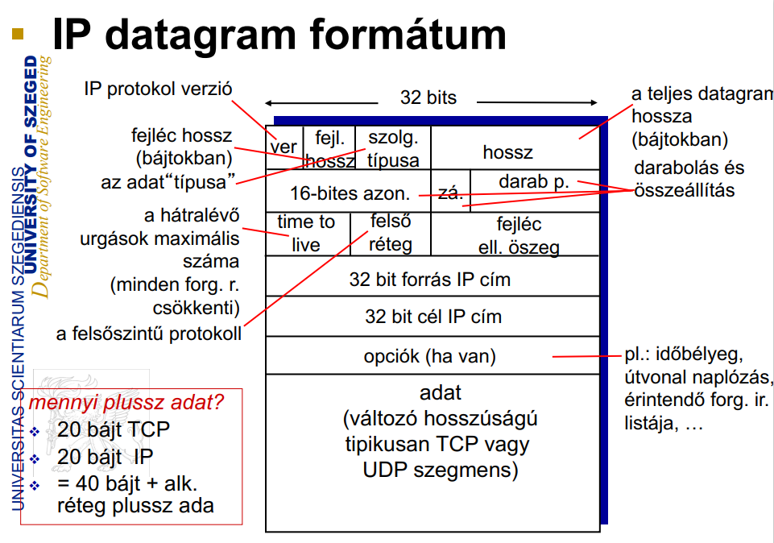
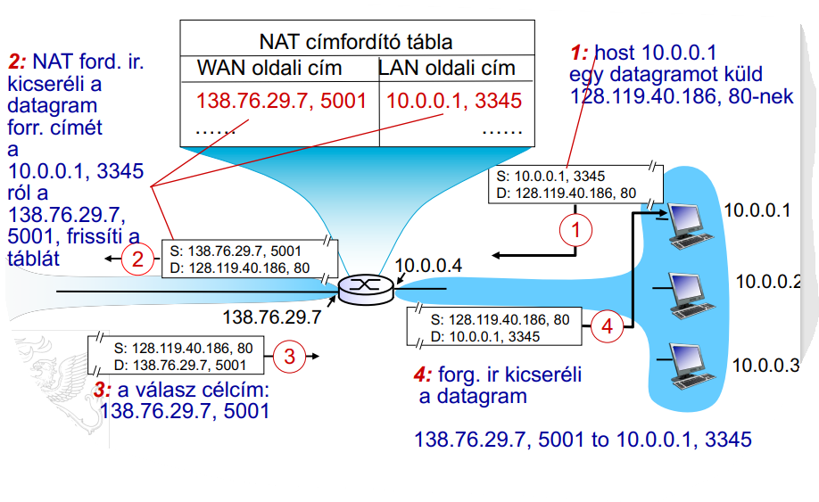

## **Számítógép hálózatok**

### 1. Számítógép-hálózati architektúrák, szabványosítók (ISO/OSI, Internet, ITU, IEEE).

#### IEEE (Institute of Electrical and Electronics Engineers)

- Az IEEE egy nemzetközi szakmai szervezet, amely elektronikai, villamosmérnöki, valamint számítástechnikai tudományokhoz kapcsolódó szabványok kidolgozásával, oktatással, tudományos konferenciák szervezésével, illetve ezekhez kötődő tanulmányok publikálásával foglalkozik

#### ISO/OSI

**ISO**: **International organization of Standardization (Nemzetközi Szabványügyi Szervezet)**

**OSI: Open System Interconnection (Nyílt rendszerek összekapcsolása)**

- Nem lett megvalósítva, végül a TCP/IP modell "nyert"
  
  - A megjelenítési és viszonylati réteg ott az alkalmazási réteg része

##### **Alkalmazás réteg (Application layer)**

- Az alkalmazási réteg szolgáltatásai támogatják a szoftver alkalmazások közötti kommunikációt, és az alsóbb szintű hálózati szolgáltatások képesek értelmezni alkalmazásoktól jövő igényeket, illetve, az alkalmazások képesek a hálózaton küldött adatok igényenkénti értelmezésére.

**Hálózati alkalmazás létrehozása**

- Olyan programok fejlesztése amelyek
  
  - (különböző) vég rendszereken futnak
  
  - hálózaton kommunikálnak
  
  - pl.: a webszerver a web böngészővel kommunikál

- Nem szükséges szoftvert írni a hálózat gerincében elhelyezkedő eszközökre
  
  - a gerincben lévő eszközök nem futtatnak felhasználói programokat
  
  - a vég rendszeern lévő alkalmazások lehetővé teszik a gyors alkalmazás fejlesztést és terjesztést

**Kliens/szerver architektúra**

- szerver:
  
  - mindég bekapcsolt/elérhető
  
  - állandó IP cím
  
  - adatközpontokban skálázható

- kliens:
  
  - a szerverrel kommunikál
  
  - bizonytalan kapcsolat
  
  - dinamikus IP címe lehet
  
  - nem beszélnek egymással közvetlenül

**P2P architektúra**

- nincs állandóan elérhető szerver

- tetszőleges végberendezések kommunikálnak egymással

- a társak szolgáltatásokat biztosítanak egymásnak
  
  - önskálálzó– újabb társak biztosítják a szolgáltatásokat nagyobb igény esetén

- a társak bizonytalan elérhetőségűek és az IP címük is változhat

- komplex menedzsment

A legismertebb alkalmazási réteg szintű protokollok a _HTTP_, az _SMTP_, az *FTP*és a _Telnet_.

##### Megjelenítési réteg (Presentation layer)

- A megjelenítési réteg biztosítja az alkalmazási réteg számára, hogy az adatok a végfelhasználó rendszerének megfelelő formában álljon rendelkezésre.

- Protokol konverziót, visszakódolás, adattömörítés, titkosítás, és egyszerűbb adatkezelések történnek ebben a rétegben

- Két számítógép között logikai kapcsolat létesítéséért felel

##### Viszonylati réteg (Session layer)

- A viszony réteg a végfelhasználói alkalmazások közötti dialógus menedzselésére alkalmas mechanizmust valósít meg
- Csomópontok közti kommunikáció

##### Szállítási réteg (Transport layer)

- A szállítási réteg biztosítja, hogy a felhasználók közötti adatátvitel transzparens legyen.

- A réteg biztosítja, és ellenőrzi egy adott kapcsolat megbízhatóságát.

- Néhány protokoll kapcsolat orientált. Ez azt jelenti, hogy a réteg nyomonköveti az adatcsomagokat, és hiba esetén gondoskodik a csomag vagy csomagok újraküldéséről.

- Az UDP (User Datagram Protocol) és TCP (Transmission Control Protocol) protokollok is ebbe a rétegbe tartoznak

- **TCP szolgáltatás**
  
  - megbízható átvitel: a küldő és fogadó processzusok között
  
  - folyam szabályozás: a küldő nem árasztja el a vevőt
  
  - torlódás vezérlés: visszafogja a küldőt amikor a hálózat túlterhelt
  
  - nem biztosítja: időzítés, minimális garantált áteresztőképeség, biztonság
  
  - kapcsolat orientált: kapcsolatfelépítés szükséges a küldő és a fogadó processzusok között

- **UDP szolgáltatás**
  
  - megbízhatatlan adatátvitel a küldő és a fogadó processzusok között
  
  - nem biztosítja: megbízhatóság, folyam szabályozás, torlódás vezérlés, időzítés,
    áteresztőképesség garancia, biztonság, kapcsolat kiépítés,

##### Hálózati réteg (Network layer)

- A hálózati réteg biztosítja a változó hosszúságú adat sorozatoknak a küldőtől a címzetthez való továbbításához szükséges funkciókat és eljárásokat, úgy, hogy az adatok továbbítása a szolgáltatási minőség függvényében akár egy vagy több hálózaton keresztül is történhet.

- A hálózati réteg biztosítja a hálózati útvonalválasztást, az adatáramlás ellenőrzést, az adatok szegmentálását/deszegmentálását, és főként a hiba ellenőrzési funkciókat.

- Az útvonalválasztók (router-ek) ezen a szinten működnek a hálózatban

- Az Internet Protokoll (IP) ebben a rétegben található

##### **Adatkapcsolati réteg (Data-Link Layer)**

- Az adatkapcsolati réteg biztosítja azokat a funkciókat és eljárásokat, amelyek lehetővé teszik az adatok átvitelét két hálózati elem között.

- Jelzi, illetve lehetőség szerint korrigálja a fizikai szinten történt hibákat is

- A használt egyszerű címzési séma fizikai szintű, azaz a használt címek fizikai címek (MAC címek) amelyeket a gyártó fixen állított be hálózati kártya szinten.

- A hálózati switchek rétege (nem látnak IP címet, csak MAC címet)

- A legismertebb példa itt is az Ethernet

- Terminológia:
  
  - Csomópontok: állomások és forgalomirányítók
  
  - Vonalak: a szomszédos csomópontokat különböző komunikációs utakon összekötő csatornák (vezetékes vonalak, vezetékmentes vonalak, LAN-ok)

##### **Fizikai réteg (Physical Layer)**

- Az eszközök közötti fizikai kapcsolatért felelős

- Feladata a bitek kommunikációs csatornára való juttatása

- Ez a réteg határoz meg minden, az eszközökkel kapcsolatos fizikai és elektromos specifikációt, beleértve az érintkezők kiosztását, a használatos feszültség szinteket és a kábel specifikációkat

- Fő funkciói:
  
  - Felépíteni és lezárni egy csatlakozást egy kommunikációs médiummal
  
  - Részt venni egy folyamatban, amelyben a kommunikációs erőforrások több felhasználó közötti hatékony megosztása történik (Például, kapcsolat szétosztás és adatáramlás vezérlés)
  
  - Moduláció, vagy a digitális adatok olyan átalakítása, konverziója, jelátalakítása, ami biztosítja, hogy a felhasználó adatait a megfelelő kommunikációs csatorna továbbítani tudja.

#### Internet

- Internet: "hálózatok hálózata"
  
  - Összekötött ISP-k (Internet Service Provider)

- Protokollok határozzák meg az üzenetek küldését és fogadását:

- Infrastruktúra amely az alkalmazásoknak szolgáltatásokat biztosít
  
  - pl.:Web, VoIP (Voice over Internet Protocol), email, játékok, e- kereskedelem, szociális háló

- Programozási interfészt biztosít az alkalmazásoknak
  
  - adatküldő és fogadó alkalmazások „Internet csatlakozása” szolgáltatás pontok
  
  - szolgáltatás opciókat ad hasonlóan a postai szolgáltatáshoz

- az Interneten minden kommunikációt protokollokal határoznak meg

- Protokollok határozzák meg a küldött és fogadott üzenetek formátumát, sorrendjét és az üzenet beérkezésekor végrehatott akciót.

#### ITU (International Telecommunication Union)

- Nemzetközi Távközlési Egyesület

- Feladata a nemzetközi távközlési együttműködés segítése

- Az ITU különböző bizottságai ajánlásokat adnak ki, amelyek figyelembe vételével dolgozzák ki az egyes országok kormányai a távközléssel kapcsolatos jogszabályokat

- Az ITU a Földet három régióra osztotta fel (Region 1, Region 2, Region 3). Egy-egy régión belül azonosak a rádiótávközlésre vonatkozó szabályok (például a rádiószolgálatok részére kijelölt frekvenciák)
  
  - Magyarország (egész Európa, Afrika, valamint Ázsia egy része) a *Region 1*-hez tartozik

### 2. Kiemelt fontosságú kommunikációs protokollok (PPP, Ethernet, IP, TCP, HTTP, RSA)

#### PPP (Point-to-Point Protocol)

- Az OSI modellben az adatkapcsolati réteg egy protokollja

- Magas szintű adatkapcsolati protokoll kétpontos vonalakhoz

- Fő célja: szállítási rétegbeli protokollok szállítása soros kommunikáción keresztül

- Támogat:
  
  - Hibajelzést
  
  - Fejléctömörítést
  
  - Megbízható adatátvitelt

- Szolgáltatásai:
  
  - Olyan keretezési módszert vezet be, mely egyértelműen ábrázolja a keret végét és a következő keret elejét. A keretformátum egyúttal megoldja a hibajelzést is
  
  - Adatkapcsolat-vezérlő protokollt tartalmaz (LCP - Link Control Protocol) a vonalak felélesztésére, tesztelésére, vonalak bontására
  
  - Különböző hálózati vezérlő protokollokat (NCP - Network Control Protocol) tartalmaz mindegyik támogatott hálózati réteghez
    
    - pl.: IPCP (IP Control Protocol), IP-hez

- Formátuma:
  
  
  
  - Minden PPP keret a szabványos jelző bájttal (01111110) kezdődik
  
  - Ezután következik a Cím mező, mely mindig az 11111111 értékre van állítva annak jelzésére, hogy minden állomásnak vennie kell a keretet
  
  - A harmadik mező a Vezérlő mező, mely alapesetben a 00000011 értékre van állítva, mely a számozatlan keret jelzésére szolgál
  
  - Alapesetben a PPP nem biztosít megbízható átvitelt, de zajos környezetben (pl. vezeték nélküli hálózat) a megbízható átvitel megoldható a számozott mód használatával (sorszámok és nyugták alkalmazásával)
  
  - A következő mező a Protokoll mező, mely azt jelzi, milyen csomag van az adat mezőben (pl. LCP, NCP, IP, IPX, stb.)
  
  - Következik az adat mező, mely változó hosszúságú, de alapértelmezésként maximum 1500 bájt. Ezután jön az Ellenőrző összeg mező, mely általában 2 bájt, de lehet 4 bájt is

#### Ethernet

> **LAN**
> 
> - A helyi hálózat (LAN - Local Area Network)  olyan számítógépes hálózat, amely egy épületen belül, vagy egymáshoz közel elhelyezkedő épületcsoportokban teszi lehetővé az informatikai eszközök kommunikációját.
> 
> - Többnyire otthonokban, irodákban, gyárakban, üzemekben található, és alkalmas szerverek, személyi számítógépek, munkaállomások összekapcsolására

- “uralkodó” vezetékes LAN technológia
  
  - egy IC, több sebesség
  
  - az első széleskörben alkalmazott LAN technológia
  
  - egyszerű, olcsó
  
  - tartja a lépést: 10 Mbps – 10 Gbps

- Fizikai topológia
  
  - busz: minden csomópont egy ütközési tartományban (ütközhetnek egymással, 90-es években volt népszerű)
  
  - csillag: aktív kapcsoló a központban, minden “beszélgetés” (szeparált) Ethernet protokollon történik (a csomópontok nem ütköznek) (ma domináns)

- Keret struktúra
  
  - A küldő interfész Ethernet keretbe csomagolja az IP datagram-mot (vagy más protokollt)
    
    
  
  - előtag:
    
    - 7 10101010 mintájú bájt majd egy bájt 10101011 mintával
    
    - a küldő és a fogadó óráinak szinkronizálására használják
  
  - címek
    
    - 6 bájtos cél és forrás MAC (Media Access Control) címek
    
    - amennyiben az interfész a sajátjával egyező vagy üzenetszórás címet lát (pl.: ARP csomag) egy keretben akkor átadja az IP protkollnak
    
    - egyébként figyelmen kívül hagyja
  
  - típus: magasabbszintű protokoll (leggyakrabban IP de lehet más is pl.: Novell IPX, AppleTalk)
  
  - CRC
    
    - ciklikus redundancia ellenőrzés a fogadónál
    
    - amennyiben hibát detektál: eldobja a keretet

- Kapcsolatmentes: nincs kézfogás a küldő és a fogadó NIC (Network Interface Controller/Card - hálózati kártya) között

- Megbízhatatlan: a fogadó NIC nem küld visszajelzést a küldő NIC-nek
  
  - az eldobott keretekben elveszett adatot a magasabb rétegben megvalósított rdt (?) szolgáltatás (pl.: TCP) viheti át újra, egyébként az elveszik

- Az Ethernet MAC protokollja: résmenta

- 802.3 Ethernet szabványok: adatkapcsolati és fizikai rétegban
  
  - **több** különböző Ethernet szabvány
    
    - közös MAC protokol és keret formátum
    
    - különböző sebességek: 2 Mbps, 10 Mbps, 100 Mbps, 1Gbps, 10 Gbps, 40 Gbps
    
    - különböző fizikai rétegbéli médium: optika, kábel
  
  

> **Ethernet kapcsoló**
> 
> - Adatkapcsolati rétegbéli eszköz
>   
>   - Ethernet keretek tárolása, továbbítása
>   
>   - megvizsgálja a bejövő keret MAC címét, csak kiválasztott kimenetre vagy kimenetekkre továbbítja, CSMA/CD –t használ az adott szegmensek elérésére
> 
> - Traszparens: az állomások nem rzékelik a kapcsolókat
> 
> - Plug-and-play, öntanuló: a kapcsolókat nem kell előre konfigurálni

#### IP (Internet Protocol)

- A hálózati réteg egy protokollja, a segítségével kommunikálnak egymással az internetre kötött csomópontok

- IP datagram formátuma:
  
  

- IP darabolás és összeállítás:
  
  - Darabolás:
    
    
  
  - A hálózati összeköttetések korlátos méretű adatot tudnak egyszerre átvinni MTU (max.transfer size)
    
    - különböző vonal típusok, különböző MTU
  
  - A nagy IP datagramot szétdarabolják
    
    - egy datagramból több datagram lesz
    
    - csak a végállomásnál rakják össze
    
    - az IP csomag fejléc mezői segítenek az összeállításban
  
  **IP címzés**

- IP cím: az állomás és forgalomirányító interfészek 32-bites azonosítója

- Interfész: az állomás/forg. ir. és a fizikai vonal kapcsolata
  
  - a forgalomirányítóknak általában több interfésze van
  
  - az állomásoknak egy vagy két interfésze szokott lenni (pl.: vezetékes Ethernet,
    vezetékmentes 802.11 (vezeték nélküli adatátviteli protokoll)

- Minden interfészhez IP címek tartozhatnak

**Alhálózatok**

- IP cím:
  
  - alhálózat rész – nagyértékű bitek
  
  - állomás rész – alacsonyértékű bitek

- Mi az alhálózat?
  
  - azonos alhálózat résszel bíró IP című interfészek
  
  - közvetenül elérik egymást forgalomirányító nélkül
  
  - 3 alhálózatot tartalmazó hálózat:
    
    
  
  - Alhálózati maszk: megmutatja az ahálózat méretét

- CIDR: Osztálymentes Tartományközi Forgalomirányítás (Classless InterDomain
  Routing)
  
  - a cím tetszőleges hosszúságú alhálózati része
  
  - cím formátum: a.b.c.d/x, ahol x a ## bitek száma a cím alhálózati részében
    
    

- Hogyan kapunk címet?
  
  - a rendszergazda fájlba írva bedrótozza **VAGY** DHCP: Dynamic Host Configuration Protocol (dinamikusan kapjuk a címeket egy szervertől)

- DHCP
  
  - cél: lehetővé tegyük, hogy az állomások a hálózathoz történő
    csatlakozáskor dinamikusan kapjanak IP címet
  
  - újrahasznosíthatjuk a címeket(csak addig tartsd a címet amíg kell on)
  
  - Külön DHCP szerver kell

- A hálózat az IP cím alhálózati részét az őt kiszolgáló ISP-től kapja meg az ISP (Internet Service Provider) címtartomány részeként

- Hierarchikus címzés segítségével a forgalomirányító infromáció
  hatékonyan kezelhető
  
  

- Az ISP az IP cím blokkokat az ICANN-től (Internet Corporation for
  Assigned Names and Numbers) kapja

**NAT: hálózati címfordítás**

- A helyi hálózat kívülről nézve csak egy IP címen látszik
  
  - az ISP-től nem kell egész címtartomány, csak egy IP cím
  
  - a belső címzést tetszőlegesen változtathatja, nem kell erről a világnak tudnia
  
  - ISP-t válthat úgy, hogy belülről nem kell újracímeznie
  
  - a belső eszközök explicit módon nem címzhetőek meg közvetlenül a hálózatról (biztonság)

- A NAT forgalomirányító:
  
  - kimenő datagram: kicseréli(forrás IP cím, port #) –ot minden egyes kimenő datagramban a (NAT IP címére és egy, új port-ra #)
  
  - megjegyzi (a NAT címfordító táblában) minden (forrás IP cím, port #) hozzárendelést a (NAT IP cím, új port #) párokhoz
  
  - bejövő datagramok: kicseréli a (NAT IP címét, új port-ot #) minden bejövő dataram cél mezőiben a megfelelő NAT táblában tárolt (forrás IP cím, port #) párossal
    
    
  
  - WAN - Wide Area Network

**IPv6**

- kezdeti motiváció: a 32-bites (IPv4) címtartomány nemsokára kimerül

- IPv6 datagram formátum:
  
  - fix hosszúságú 40 bájtos fejléc
  
  - darabolás nem megengedett

- Áttérés IPv4-ről IPv6-ra
  
  - nem lehet minden forgalomrányítót egyszerre felfrissíteni
  
  - alagút: az IPv6-os datagramot mint adatot visszük át az IPv4 datagramban az IPv4-es forgalomirányítók között
    
    
    
    

#### TCP (Transmission Control Protocol)

- A TCP egy kapcsolat-orientált protokoll, amely az OSI modell szállítási rétegében helyezkedik el
- Fő feladata egy megbízható, és biztonságos kapcsolat kiépítése (és fenntartása) két folyamat között. Menetét alapvetően három részre bonthatjuk:
  - Létrejön a megbízható kapcsolat két állomás között
  - Lezajlik a tényleges adatátvitel
  - A kapcsolat lezárása, és a számára elkülönített erőforrások felszabadítása
- A protokoll a hibamentes átvitelhez az úgynevezett pozitív nyugtázás újraküldéssel (positive acknowledgement with retransmission) néven ismert eljárást használja
- A TCP protokoll ellentétben az UDP-vel kapcsolatorientált, megbízható összeköttetést biztosít két eszköz között. Egy kapcsolat általános menete a következő:
  - Az adatátvitel megkezdéséhez a forrás-, és a célalkalmazás értesíti az operációs rendszert a kapcsolat létrehozási szándékáról.
  - Az egyik csomópont kezdeményezi a kapcsolatot, a másiknak pedig fogadnia kell azt.
  - A két operációs rendszer protokoll-szoftvermoduljai a hálózaton elküldött üzenetekkel kapcsolatba lépnek egymással és ellenőrzik, hogy az adatküldés engedélyezett-e, illetve, hogy mindkét oldal készen áll-e.
  - Ezután a kapcsolat létrejön, a szükséges szinkronizálások elvégzése után pedig megkezdődik az adatok átvitele.
  - Az átvitel során a két készülék protokollszoftverei közötti kapcsolat a megérkezett adatok helyességének ellenőrzése céljából változatlanul fennmarad.

**Háromfázisú kézfogás**

- Az adatátvitel megkezdése előtt kapcsolatot kell létesíteni a két végpont között. Mivel egy TCP szegmensben a maximálisan szállítható adat mérete korlátos (MTU - max transfer size), a protokollnak fel kell darabolnia az ennél nagyobb méretű adatfolyamot, majd a másik oldalon ugyanazon sorrendben vissza kell állítani azt (a megfelelő sorszámok alapján).

- A kapcsolat létrehozásakor szükséges így mindkét fél kezdő sorszámának egyeztetése, melyet a *SYN* vezérlőbittel megjelölt szegmensek elküldésével tesznek meg. Ezt a kapcsolódási folyamatot nevezzük *háromfázisú kézfogásnak*, melynek lépései a következők:
  
  - Forrásállomás (_A_) kezdeményezi a kapcsolatlétrehozását a célállomással (_B_), egy *SYN* szegmens elküldésével, melyben jelzi kezdősorszámát is (seq=x)
  
  - *B* megkapja a szegmenst és feljegyzi az *A* állomás kezdősorszámát, majd küld egy nyugtát a következő szegmens sorszámával (ack=x+1), és saját kezdő sorszámával (seq=y). Ezzel jelzi, hogy épségben megkapta x-edik oktettig a szegmenst, és várja x+1-edik sorszámtól a többi darabot.
  
  - Az *A* állomás megkapja a választ, melyből megtudja a *B* állomás kezdő sorszámát (y) és elküldi a következő szegmenst, egyben nyugtázva is a kérést (ack=y+1)
  
  - Ezután megkezdődik az adatok átvitele, és a kapcsolat mindaddig nyitva marad, amíg bármelyik fél nem kéri annak lezárását.

**Ablakozás**

- Az adatátvitel gyorsítása érdekében a TCP protokoll nem várja meg a nyugtát minden egyes szegmens elküldése előtt, mivel az nagyon lassú kapcsolatot eredményezne, helyette több szegmens elküldését is engedélyezi a nyugta beérkezése előtt.

- Mivel a hálózaton található eszközök és állomások tulajdonságai eltérőek, fontos egy adatfolyam-vezérlési mechanizmus meghatározása az ilyen protokollok esetén.

- Ennek hiányában a küldő fél könnyen túlterhelheti a fogadó felet, megfelelően nagy számú szegmens küldésével, és így az adatok egy része elveszik

- A TCP esetén ezt az adatfolyam-vezérlési mechanizmust *„ablakozásnak”*, a nyugta előtt elküldhető szegmensek számát pedig *ablakméretnek* (vagy röviden ablaknak) nevezzük. A kifejezés arra utal, hogy a kapcsolatban kommunikáló felek dinamikusan határozzák meg az elküldhető szegmensek számát (vagyis az ablakméretet).

**Nyugtázás**

- A megbízható kézbesítés garantálja, hogy a kommunikáció során elküldött adatok veszteség, vagy kettőződés nélkül elérik a céljukat.

- Ennek érdekében a hibamentes átvitelhez, a TCP protokoll, az úgynevezett pozitív nyugtázás újraküldéssel (positive acknowledgement with retransmission) néven ismert eljárást használja.

- Formailag az elküldött összes oktett (8 bit) sorszámmal rendelkezik, és minden egyes elküldött szegmens, *SEQ* mezője határozza meg az abban szereplő legelső oktett sorszámát (mérete pedig a legutolsóét).

- Amikor a TCP elküld egy adatokat tartalmazó szegmenst a hálózaton, elhelyez egy másolatot az újraküldési sorban is, és elindít egy időzítőt; majd amint megérkezik a másik féltől a nyugta, törli a szegmenst a sorból. Ha az időzítő lejárta előtt mégse kap nyugtát a küldő fél (vagyis a célállomás feltehetően nem kapta meg a csomagot), akkor a szegmenst újraküldi.

- Az időzítő értékének meghatározásához a TCP méri az átlagos RTT-t (Round trip delay time - az az idő, ami alatt a csomagot elküldjük, és visszaérkezik rá a nyugta), és ennél egy kicsivel nagyobb értékre állítja be azt.

#### HTTP (Hypertext Transfer Protocol)

- A web alkalmazás rétegbéli protokollja

- Kliens/szerver modell
  
  - kliens: kéréseket küldő és válaszokat fogadó webböngésző (HTTP protokollon) web objektumok megjelenítése
  
  - szerver: Web szerver amely (HTTP protokoll segítségével) a kérésekre objektumokat küld a válaszokban

- TCP-t használ:
  
  - a kliens egy TCP kapcsolatot kezdeményez (létrehoz egy
    szoftver csatornát) a szerver felé, a 80-as porton
  
  - a szerver fogadja a kliens TCP kapcsolatát
  
  - HTTP üzeneteket (alkalmazás rétegbéli protokoll üzenetek) cserél a böngésző (HTTP kliens) és a web szerver (HTTP szerver)
  
  - a TCP kapcsolatot bezárják

- A HTTP “állapotmentes”: a szerver nem tartja nyilván a kliens múltbéli kéréseit

**HTTP kapcsolatok**

- 2 fajtája van:
  
  - Nem perzisztens HTTP
    
    - legfeljebb egy objektum küldhető át a TCP kapcsolaton, a kapcsolatot ezután lezárják
    
    - több objektum letöltéséhez több kapcsolatra van szükség
  
  - Perzisztens HTTP
    
    - több objektum is átküldhető egy a kliens és a szerver között kiépített TCP kapcsolaton keresztül

- **Nem perzisztens HTTP**
  
  - RTT (definíció): egy csomag utazásának időtartama a klienstől a szerverig és vissza
  
  - HTTP válaszidő:
    
    - nem perzisztens HTTP válasz idő = 2RTT+ fájl átviteli idő
      
      
  
  - Problémái:
    
    - 2 RTT-re van szüksége minden objektum esetén
    
    - oprendszer terhelés TCP kapcslatonként
    
    - a böngészők gyakran párhuzamos TCP kapcsolatokat nyitnak a
      hivatkozott objektumok letöltésére

- **Perzisztens HTTP**
  
  - a szerver a válasz küldése után is nyitvatartja a kapcsolatot
  
  - az egymásutáni HTTP üzenetek ugyanazon a kliens/szerver kapcsolaton vannak
    átküldve
  
  - a kliens a hivatkozott objektumot azonnal kérheti
  
  - akár egy RTT minden hivatkozott objektumra

**Metódus típusok**

- GET: A megadott erőforrás letöltését kezdeményezi. Ez messze a leggyakrabban használt metódus.

- POST: Feldolgozandó adatot küld fel a szerverre. Például HTML űrlap tartalmát. Az adatot az üzenettest tartalmazza.

- PUT: Feltölti a megadott erőforrást.

- HEAD: Ugyanazt adja vissza, mint a GET, csak magát az üzenettestet hagyja ki a válaszból.

- DELETE: Törli a megadott erőforrást.

**HTTP válasz státusz kódok**

- A szerver kliens válasz üzenet első sora

- példa kódok:
  
  - 200 OK: sikeres kérés a kért objektum később ebben a
    válaszban
  
  - 301 Moved Permanently: a kért objektum át lett helyezve, az új hely később ezen üzeneben (Location:)
  
  - 400 Bad Request: a kérés üzenet nem érthető a szervernek
  
  - 404 Not Found: a kért objektum nincs a szerveren
  
  - 505 HTTP Version Not Supported
    
    

#### RSA

> **Nyílt kulcsú titkosítás**
> 
> - Olyan kriptográfiai eljárás, ahol a felhasználó egy kulcspárral – egy nyilvános és egy titkos kulccsal rendelkezik.
> 
> - A titkos kulcs titokban tartandó, míg a nyilvános kulcs széles körben terjeszthető.
> 
> - Egy, a nyilvános kulccsal kódolt üzenetet csak a kulcspár másik darabjával, a titkos kulccsal lehet visszafejteni.
>   
>   
>   
>   

- Az RSA-eljárás nyílt kulcsú (vagyis „aszimmetrikus”) titkosító algoritmus

- Alapok: moduló aritmetika
  
  - "_x mod n_" = a maradék, ha x –et elosztjuk n-nel

- Előkészületek
  
  - üzenet: egy bitminta
  
  - ezt a bitmintát egy egész szám egyedi módon jellemezi
  
  - ezek alapján az üzenet titkosítása egyenértékű a szám titoksításával
  
  - példa:
    
    - m= 10010001 . Ez az üzenet egyértelműen leírható a 145-ös számmal.
    
    - az üzenet titkosítása (m) a szám titkosításával egyenértékű és egy újabb számot ad (rejtjelezett szöveg).

- A titkos és publikus kulcspárok létreozása:
  
  1. válasszunk két nagy prím számot _p_, _q_. (pl.: 1024 bites térben)
  2. számoljuk ki _n = pq_, _z = (p-1)(q-1)_
  3. válasszuk e -t (_e<n_) úgy hogy ne legyen közös osztója _z_-vel (_e, z_ “relatív prím számok”)
  4. válasszuk ki _d_ -t úgy, hogy _ed-1_ osztható _z_-vel. (máshogyan: _ed mod z = 1_ )
  5. a nyilvános kulcs _(n,e)_ -> ${K^+}_b$. a titkos kulcs _(n,d) -> ${K^-}_b$_.

- Titkosítás, visszafejtés
  
  - amennyiben _(n,e)_ és _(n,d)_ az előzőek szerint készült el
    
    - az üzenet titkosítása m (<n), számítsuk ki $c=m^e \mod n$
    
    - az üzenet visszafejtése, c – megkapott bitminta, számítsuk ki $m=c^d \mod n$

- Egy fontos tulajdonsága:
  
  

- Miért biztonságos az RSA?
  
  - Tegyük fel, hogy tudjuk Bob nyilvános kulcsát(n,e). Milyen nehéz d-t meghatározni?
  
  - n tényezőkre bontására lenne szükség anélkül, hogy azokat ismernénk (p és q)
    
    - tény: nagy számok tényezőkre bontása nehéz
