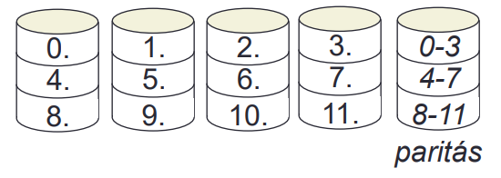

## **Számítógép architektúra**

### **1. Neumann-elvű gép egységei. CPU, adatút, utasítás-végrehajtás, utasítás- és processzorszintű párhuzamosság. Korszerű számítógépek tervezési elvei. Példák RISC (UltraSPARC) és CISC (Pentium 4) architektúrákra, jellemzőik.**

#### Neumann-elvű gép sematikus váza

**Központi memória:** a program kódját és adatait tárolja, számokként

**Központi feldolgozóegység (CPU):** A központi memóriában tárolt program utasításainak beolvasása és végrehajtása

- **_Vezérlőegység:_** utasítások beolvasása a memóriából és típusának megállapítása

- **_Aritmetikai és logikai egység (ALU):_** Utasítások végrehajtásához szükséges aritmetikai és logikai műveletek elvégzése

- **_Regiszterek:_** kisméretű, gyors elérésű memóriarekeszek, részeredmények tárolása, vezérlőinformációk

**Külső sín:** részegységek összekötése (kábel, huzalozás), adatok, címek, vezérlőjelek továbbítása különböző buszokkal

**Belső sín:** CPU részegységei közötti kommunikáció (vezérlőegység, ALU, regiszterek)

**Beviteli és kiviteli eszközök:** felhasználóval való kapcsolat, adattárolás háttértárakon, nyomtatás stb.

(Működést biztosító járulékos eszközök: gépház, tápellátás, stb.)

#### Adatút

#### Utasítás végrehajtás

**Betöltő-dekódoló-végrehajtó ciklus**

1. Soron következő utasítás beolvasása a memóriából az utasításregiszterbe az utasításszámláló regiszter mutatta helyről

2. Utasításszámláló beállítása a következő címre

3. A beolvasott utasítás típusának meghatározása

4. Ha az utasítás memóriára hivatkozik, annak lokalizálása

5. Ha szükséges, adat beolvasása a CPU egy regiszterébe

6. Az utasítás végrehajtása

7. Vissza az 1. pontra

**Probléma:** A memória olvasása lassú, az utasítás és az adatok beolvasása közben a CPU többi része kihasználatlan

**Gyorsítási lehetőségek:**

- Órajel frekvenciájának emelése (korlátozott)

- Utasításszintű párhuzamosság
  
  - Csővezeték
  
  - Szuperskaláris architektúrák

- Processzorszintű párhuzamosság
  
  - Tömbszámítógépek
  
  - Multiprocesszorok
  
  - Multiszámítógépek

**Késleltetés:** utasítás végrehajtásának időigénye

**Áteresztőképesség:** MIPS (millió utasítás mp-enként)

#### Utasításszintű párhuzamosság

##### Párhuzamos csővezetékek

- Közös utasítás-beolvasó egységgel

- A csővezetékek saját ALU-val rendelkeznek (párhuzamos végrehajtás, ha nincs erőforrás-használat ütközés)

- Általában 2 vagy 4 csővezeték

- Pentium hasonlót alkalmaz
  
  - Fő csővezeték: tetszőleges Pentium utasítás
  
  - Második csővezeték: csak egész műveletek

**Szuperskaláris architektúrák**

- Egy csővezeték, de több funkcionális egységgel

- Feltételezzük hogy S1-S3 fázis sokkal gyorsabb, mint S4

- Funkcionális egységek ismétlődhetnek, pl. több ALU is lehet

- Hasonló a Pentium 4 architektúrája

#### Processzorszintű párhuzamosság

- **Tömbszámítógépek**
  
  - Ugyanazon műveletek elvégzése különböző adatokon → párhuzamosítás

- **Multiprocesszorok (szorosan kapcsolt CPU-k)**
  
  - Több CPU, közös memória → együttműködés vezérlése szükséges
  
  - Sínrendszer
    
    - 1 közösen használt (lassíthat)
    
    - Emellett a CPU-k akár saját lokális memóriával is rendelkezhetnek
  
  - Jellemzően max. pár száz CPU-t építenek össze

- **Multiszámítógépek (lazán kapcsolt CPU-k)**
  
  - Nincs közös sín, processzor-kommunikáció üzenetküldéssel
  
  - Általában nincs minden gép összekötve egymással (pl. fa-struktúra)
  
  - Több ezer gép is összeköthető

#### RISC és CISC

- **RISC (Reduced Instruction Set Computer)**
  
  - Csökkentett utasításkészletű számítógép
  
  - Csak olyan utasítások legyenek, amelyek az adatút egyszeri bejárásával végrehajthatók
  
  - Tipikusan kb. 50 utasítás

- **CISC (Complex Instruction Set Computer)**
  
  - Összetett utasításkészletű számítógép
  
  - Sok utasítás (akár több száz), mikroprogram interpretálással
  
  - Lassabb végrehajtás

Intel: A kezdeti CISC felépítésbe integráltak egy RISC magot (80486-tól)
a leggyakoribb utasításoknak

#### Korszerű számítógépek tervezési elvei

- **Minden utasítást közvetlenül a hardver hajtson végre**
  
  - A gyakran használtakat mindenképpen
  
  - Interpretált mikroutasítások elkerülése

- **Maximalizálni az utasítások kiadási ütemét**
  
  - Párhuzamos utasításkiadásra törekedni

- **Az utasítások könnyen dekódolhatók legyenek**
  
  - Kevés mezőből álljanak, szabályosak, egyforma hosszúak
    legyenek, …

- **Csak a betöltő és a tároló utasítások hivatkozzanak a
  memóriára**
  
  - Egyszerűbb utasításforma, párhuzamosítást segíti

- **Sok regiszter legyen**
  
  - Számítások során ne kelljen a lassú memóriába írni

### 2. Számítógép perifériák: Mágneses és optikai adattárolás alapelvei, működésük (merevlemez, Audio CD, CD-ROM, CD-R, CD-RW, DVD, Bluray). SCSI, RAID. Nyomtatók, egér, billentyűzet. Telekommunikációs berendezések (modem, ADSL, KábelTV-s internet).

#### Mágneslemezek

**Részei:**

- Mágnesezhető felületű, forgó alumínium**korong**
  
  - Átmérő kezdetben 50 cm, jelenleg 3-12 cm

- Indukciós tekercset tartalmazó **fej**
  
  - Lebeg vagy érinti a felszínt

- **Kar**
  
  - Sugárirány mentén a fej egyvonalú mozgatása

**Írás:** Pozitív vagy negatív áram az indukciós tekercsben, a lemez adott helyen mágneseződik

**Olvasás:** Mágnesezett terület felett elhaladva pozitív vagy negatív áram indukálódik a mágneses polarizációnak megfelelően

**Adattárolás:**

- **Sáv**
  
  - Koncentrikus körök mentén
  
  - Egy teljes körülfordulás alatt felírt bitsorozat
  
  - Centiméterenként 5-10 ezer sáv (szélesség)

- **Szektor**
  
  - 1 sávon több szektor
    
    - Fejléc: fej szinkronizálásához
    
    - Adat (pl. 512 bájt)
    
    - Ellenőrző kód
    
    - Hamming vagy Reed-Solomon
    
    - Szektorrés

- **Lineáris adatsűrűség**
  
  - Kerület mentén, 50-100 ezer bit/cm

- **Merőleges rögzítés**
  
  - Tárolás hosszirány helyett „befelé” történik

- **Kapacitás**
  
  - Formázott és formázatlan

**Felépítés:**

- Fontos a tisztaság és a pormentesség → zárt merevlemezek

- **Lemezegység**
  
  - Közös tengelyen több lemez (6-12), azonos fej pozíció!
  
  - Cilinder: adott sugárpozíción lévő sávok összessége

- **Teljesítmény**
  
  - Keresés (seek): fej megfelelő sugárirányba állítása (kar)
    
    - 1 ms: egymás utáni sávok
    
    - 5-10 ms: átlagos (véletlenszerű)
  
  - Forgási késleltetés
    
    - A kerület mentén a fej alá fordul a kívánt terület
    
    - Fél fordulat ideje, 3-6 ezredmásodperc (5400, 7200, 10880 fordulat / perc mellett)

**Jellemzők:**

- Mechanikai sérülés előfordulhat (Fizikai behatásra a fej megsértheti a lemezt)

- Lemezvezérlő lapka
  
  - Sokszor saját CPU-t is tartalmaz
  
  - Szoftverből érkező parancsok fogadása
    
    - READ, WRITE, FORMAT
  
  - Kar mozgatása
  
  - Hibák felismerése és javítása
    
    - Javíthatatlan hiba esetén fizikai áthelyezés
  
  - Bájtok oda- és visszaalakítása bitek sorozatává
  
  - Pufferelés (gyorsítás)

**Típusok:**

**_<mark>SCSI</mark>_**

- Small Computer System Interface
  
  - „kis számítógép-rendszerek interfésze”, kiejtése „szkazi”

- Olyan szabványegyüttes, melyet számítógépek és perifériák közötti adatátvitelre terveztek

- A SCSI szabványok definiálják a parancsokat, protokollokat, az elektromos és optikai csatolófelületek definícióit

- A SCSI merevlemezek fizikai mérete ugyanakkora, mint az ATA és SATA winchestereké – lemezeinek átmérője 3,5 inch –, viszont percenkénti fordulatszáma azokénál nagyobb, haladóbb eszközök

**<mark>RAID</mark>**

- Redundant Array of Inexpensive Disks - Olcsó lemezek redundáns tömbje

- Ellentéte: SLED (Single Large Expensive Disk), egyetlen nagy drága lemez

- Több merevlemez egységbe foglalása (SCSI alkalmazása a párhuzamossága miatt)

- A rendszer felé egy nagy lemezként jelenik meg

- Az adatok a lemezeken szétosztásra kerülnek

- redundancia javítja a megbízhatóságot

- Többféle szervezési mód (RAID 0 - RAID 6), megvalósítása lehet hardveres vagy szoftveres

- **RAID 0**
  
  - Adatok párhuzamos tárolása a lemezeken
    
    - k darab szektorból álló csíkok (stripes)
    
    - Csíkok egy-egy lemezen tárolódnak
  
  - Nincs hibajavítási képessége, nem „igazi” RAID (így gyorsabb)
  
  - Nagyméretű blokkokkal működik legjobban
  
  - 

- **RAID 1**
  
  - Adatok írása két példányban (két különböző lemezre) csíkozással (4 elsődleges és 4 tartalék lemez)
  
  - Olvasás párhuzamosítható, egyes szektorok az elsődleges, mások a tartalék lemezekről
  
  - Hibás lemezegység cserélhető, csak rá kell másolni a „párja” tartalmát
  
  - 

- **RAID 2**
  
  - Bájt- vagy szó-alapú tárolás (szektorcsoportok helyett)
  
  - A lemezeknek és a karoknak szinkronban kell mozogniuk
  
  - Adat + Hamming kód bitjeinek egyidejű tárolása külön
    lemezeken (4 adatbit + 3 paritásbit = 7 tárolandó bit; 7 szinkron lemez kell)
    
    - Hamming távolság: két azonos hosszúságú bináris jelsorozat eltérő bitjeinek a száma
    
    - minimális hamming távolság segítségével detektálja és javítja a hibákat (ha d a minimális Hamming távolság, akkor d-1 hibát tud detektálni és ⌊(_d_-1)/2⌋ hibát tud javítani)
  
  - Sok merevlemez esetén használható jól
  
  - Vezérlőnek plusz munka a Hamming kód kezelése!
  
  - Hamming kóddal pótolható a kieső lemez tartalma -> hibatűrő
  
  - 

- **RAID 3**
  
  - A RAID 2 egyszerűsített változata
  
  - Minden adatszóhoz egyetlen paritásbit
  
  - Paritásbit tárolása dedikált lemezegységen
  
  - Itt is szükséges a lemezek szinkron kezelése
  
  - Javításra is alkalmas, ha tudjuk, hogy melyik lemezegység romlott
    el, de egyszerre maximum 1, tehát cseréljük gyorsan!

- **RAID 4**
  
  - Csíkozással dolgozik -> nem szükséges a lemezegységek szinkron kezelése, Csíkonkénti paritást felírja egy dedikált paritás lemezegységre
  
  - Kieső meghajtó tartalma előállítható a paritásmeghajtó segítségével
  
  - Probléma: Íráshoz olvasni is kell minden lemezről, nagyon leterheli a paritásmeghajtót

- **RAID 5**
  
  - RAID 4-hez hasonló elv, de nincs dedikált paritásmeghajtó
  
  - A paritásbiteket körbejárásos módszerrel szétosztja a lemezegységek között
  
  - Legalább 3 lemezegység kell, legalább 4 ajánlott

#### Optikai lemezek

**CD írás folyamata:**

- Üveg mesterlemez: írás nagy energiájú lézerrel

- A mesterlemezről negatív öntőforma készül

- A negatív öntőformába olvadt polikarbonát gyantát öntenek

- Megszilárdulás után tükröző alumínium réteget visznek rá

- Védő lakk réteggel vonják be és rányomtatják a címkét

**CD olvasás folyamata**

- Olvasás kis energiájú infravörös lézerrel

- Az üregből visszavert fény fél hullámhossznyival rövidebb utat tesz
  meg, mint az üreg pereméről visszavert, ezért gyengíteni fogják
  egymást

**Audio CD adattárolása**

- Spirál alakban, belülről kifelé haladva, kb. 5,6 km hosszú

- A jel sűrűsége állandó a spirál mentén

- Állandó kerületi sebesség biztosítása, változó forgási sebesség

- nincs hibajavítás, de mivel audio ezért nem gond

**CD-ROM**

- Digitális adattárolásra

- Többszintű hibajavítás bevezetése (a hanggal ellentétben itt nem lehet adatvesztés!)

- nehezebb az olvasó fejet pozícionálni mint a merevlemezeknél (koncentrikus körök helyett spirál)

- Meghajtó szoftvere nagyjából a célterület fölé viszi az olvasófejet, Fejlécet keres, abban ellenőrzi a szektor sorszámot

**CD-R**

- CD-ROM-okhoz hasonló polikarbonát felépítés

- Saját író berendezéssel rögzíthető az adat

- _Újdonság_
  
  - Író lézernyaláb
  
  - Alumínium helyett arany felület
  
  - Üregek és szintek helyett festékréteg alkalmazása
    
    - Írás: a nagy energiájú lézer roncsol → sötét folt marad véglegesen
    
    - Olvasás: az ép és a roncsolt területek detektálása

**CD-RW**

- Újraírható optikai lemez

- _Újdonság_
  
  - Más adattároló réteg
    
    - Ezüst, indium, antimon és tellúr ötvözet
    
    - Kétféle stabil állapot: kristályos és amorf (más fényvisszaverő képesség)
  
  - 3 eltérő energiájú lézer
    
    - Legmagasabb energia: megolvad az ötvözet → amorf
    
    - Közepes energia: megolvad → kristályos állapot
    
    - Alacsony energia: anyag állapotnak érzékelése, de meg nem változik

**DVD**

- CD koronggal egyező méret

- Nagyobb jelsűrűség (kisebb üreg, szorosabb spirál)

- Vörös lézer

- Több adat (egy/két oldalas, egy/két rétegű (4,7 GB – 17 GB))

- Új filmipari funkciók:Szülői felügyelet, hatcsatornás hang, képarány dinamikus választása (4:3 vagy 16:9), régiókódok

**Blu-Ray**

- Kék lézer használata a vörös helyett
  
  - Rövidebb hullámhossz, jobban fókuszálható, kisebb mélyedések
  
  - 25 GB (egyoldalas) és 50 GB (kétoldalas) adattárolási képesség
  
  - 4,5 MB/mp átviteli sebesség

#### Kimenet/bemenet

**Nyomtatók**

- Mátrixnyomtatók
  
  - Monokróm nyomat
  
  - Tintaszalag + elektromágnesesen irányítható tűk
  
  - Olcsó technika, elsősorban cégeknél (volt) jellemző
  
  - Pontmátrix karakterek

- Tintasugaras nyomtatók
  
  - Elsősorban otthoni használatra
  
  - Lassú, de relatíve olcsó
  
  - Tintapatront tartalmazó, mozgatható fej, lapra tintát permetez
  
  - Fajtái
    
    - Piezoelektromos: Tintapatron mellett kristály, amely feszültség hatására deformálódik → tintacseppet présel ki
    
    - Hővezérlésű vagy festékbuborékos:Fúvókákban kis ellenállás, amely feszültség hatására felhevül, a festék felforr és elpárolog, túlnyomás keletkezik, papírra kerül, fúvókát lehűtik, a keletkező vákuum újabb tintacseppet szív be a tartályból

- Lézernyomtatók
  
  - Kiváló minőségű kép, gyors működés
  
  - Saját CPU, memória
  
  - Elsősorban monokróm, de van színes változata is

- 3D nyomtatás
  
  - Digitális tervrajzokból → 3D tárgy
  
  - Porréteg + ragasztó komponens
  
  - jelenleg még drága
  
  - Prototípusok gyors készítése, egyedi tárgyak, objektumok készítése
  
  - Tárgyak helyett tervek küldése nagy távolságokra

**Egér**

- Grafikus felületen egy mutató mozgatása

- Egy, kettő vagy akár több nyomógomb vagy görgő

- Típusai
  
  - Mechanikus: Kerekek vagy gumi golyó, potenciométerek
  
  - Optikai: LED fény, visszaverődés elemzése
  
  - Optomechanikus: Golyó, két tengelyt forgat (merőlegesek), résekkel ellátott tárcsák, LED fény, mozgás hatására fényimpulzusok

- Működése: Bizonyos időnként (pl. 0,1 sec) vagy esemény hatására 3 adatos (általában 3 bájtos) üzenetet küld a soros vonalon (PS-2 vagy USB) a számítógépnek

**Billentyűzet**

- Egy-egy billentyű leütése áramkört zár

- Megszakítás generálódik
  
  - Az operációs rendszer kezeli és továbbítja a programoknak

#### Telekommunikációs berendezések

**Modem**

- Adatkommunikáció analóg telefonvonalon
  
  - Az analóg vonalat hangátvitelre találták ki
  
  - Adatátvitelhez: vivőhullám (1000-2000 Hz-es szinusz hullám)
  
  - A bitek csak sorosan, egymás után vihetők át
    
    - 1 bájt átvitele: start bit + 8 adatbit + stop bit = 10 bit

- Modulációk
  
  - amplitúdó, frekvencia módosítása
  
  - Fázis: dibit kódolás
    
    - 45, 135, 225 és 315 fokos fáziseltolódások az időintervallumok elején
    
    - 2 bit átvitele egységnyi idő alatt (45 fok: 00, 135 fok: 01, …)
  
  - Kombinálva is használhatók

- Definíciók
  
  - Baud: Jelváltás / másodperc
    
    - 1 jelváltás több bitnyi információt is hordozhat (lásd dibit kódolás)
  
  - Adatátviteli sebesség: bit / másodperc
    
    - Jellemzően 28800 vagy 57600 bit / mp, jóval alacsonyabb baud értékkel!
  
  - Kommunikációs vonal típusa
    
    - Full-duplex (kétirányú kommunikáció egyidőben)
    
    - fél-duplex (egyszerre csak 1 irányban)
    
    - szimplex (egyirányú kommunikáció lehetséges csak)

**ADSL (Asymmetric Digital Subscriber Line)**

- Szélessávú adatforgalom analóg telefonvonalon

- Hangátvitel: 3000 Hz-es szűrő alkalmazása a vonalon

- DSL technika: 1,1 MHz méretű tartomány használata
  
  - 256 darab 4 kHz-es csatorna
  
  - Szétválasztó (splitter)
    
    - Az alsó tartomány leválasztása hangátvitelre: 0. csatorna
    
    - A felső tartomány az adatátvitelé: 4-8 Mbps sebesség
    
    - 1-5. csatornák nem használtak (ne zavarja a hangátvitelt)
    
    - Két vezérlő csatorna a le- és feltöltés vezérlésére, a többi az adatátvitelre

**Kábeltévés internet**

- Kábeltévé társaságok
  
  - Fő telephely + fejállomások
  
  - Fejállomások üvegkábelen a fő telephelyhez kapcsolódnak
  
  - A felhasználók felé induló vonalakon sok eszköz osztozik
    
    - Kábelek sávszélessége 750 MHz körüli
    
    - A sávszélesség függ a felhasználók pillanatnyi számától!
    
    - Bonyolultabb kommunikáció a fejállomás és az előfizetői eszközök között
  
  - Sávkiosztás
    
    - 54 – 550 MHz: TV, rádió (lejövő frekvenciák)
    
    - 5 – 42 MHz: felmenő frekvenciák adatfeltöltésre és vezérlésre
    
    - 550 – 750 MHz: lejövő frekvenciák adatletöltésre
    
    - Aszimmetrikus adatkommunikáció
  
  - Szükséges eszköz: kábelmodem
