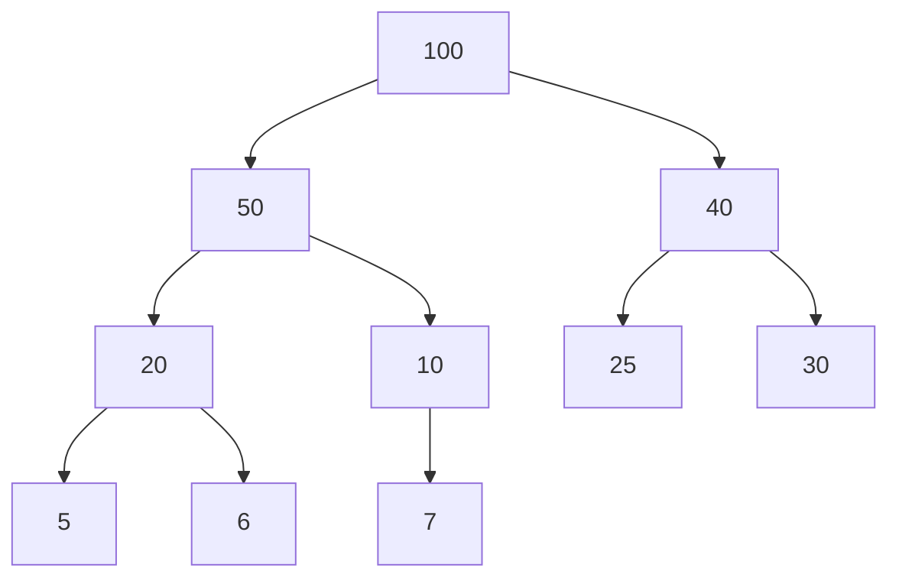
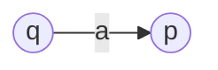
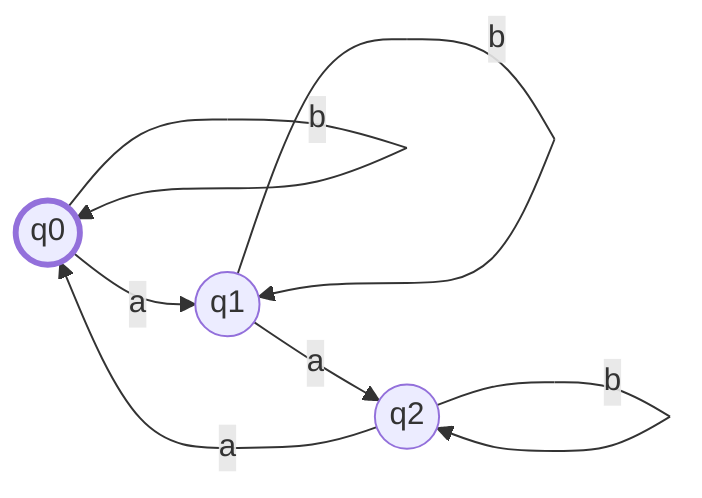
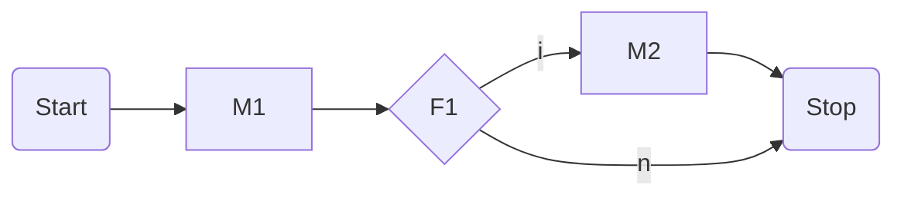
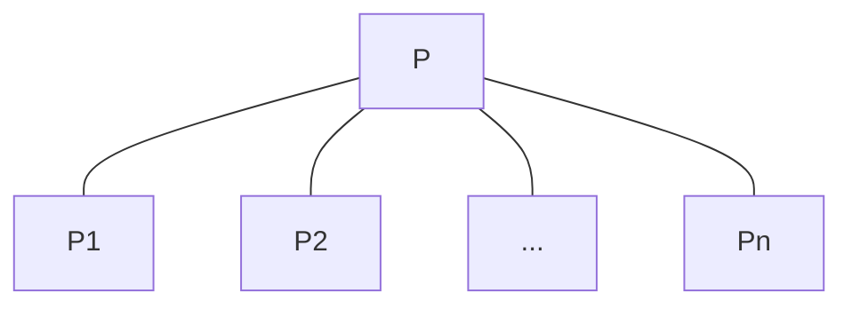
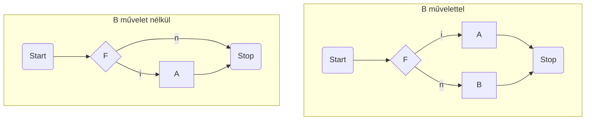

## Algoritmusok és Adatszerkezetek I

### 1. Részproblémára bontható algoritmusok (mohó, oszd-meg-és-uralkodj, dinamikus programozás), rendező algoritmusok, gráfalgoritmusok (szélességi- és mélységi keresés, minimális feszítőfák, legrövidebb utak)

#### Mohó algoritmusok

A feladatot pontosan egy részfeladatra bontják, és azt tovább rekurzívan oldják meg. Mindig a legjobbnak tűnő megoldás irányába haladunk tovább.

**Nem minden problémára adható mohó megoldás!**

De ha létezik, akkor nagyon hatékony!

**Mohó választás**: Az adott problémát egyetlen részproblémára bontja. Ennek optimális megoldásából következik az eredeti feladat optimális megoldása is.

##### Mohó algoritmus tervezése

1. Fogalmazzuk meg a **mohó választást**.

2. Bizonyítsuk be, hogy az eredeti problémának mindig van olyan **optimális megoldása**, amely **tartalmazza a mohó választást**. Tehát hogy a mohó választás **biztonságos**.

3. Bizonyítsuk be, hogy a mohó választással olyan részprobléma keletkezik, amelynek egy **optimális megoldásához hozzávéve a mohó választást**, az eredeti probléma egy optimális megoldását kapjuk.

##### Példa: _Töredékes hátizsák feladat_

**Bemenet**: A hátizsák  kapacitása,  tárgy,  tárgy súlyok,  tárgy értékek

**Kimenet**: Mi a legnagyobb érték, ami  kapacitásba belefér?

Minden tárgyból 1db van, de az darabolható.

**Algoritmus**:

- Számoljuk ki minden tárgyra az  arányt

- Tegyünk bele a legnagyobb -vel rendelkező, még rendelkezésre álló tárgyból annyit a zsákba, amennyi belefér


Futás a fenti példán:

- Kiszámoljuk az  értékeket
  
  1. Tárgy: 6
  
  2. Tárgy: 5
  
  3. Tárgy: 4

- Végighaladunk a tárgyakon az  arányok szerint
  
  - Az első tárgy teljes egészében belefér, azt beválasztjuk.
  
  - A 2. tárgy is teljes egészében belefér, azt is beválasztjuk.
  
  - A 3. tárgy már nem fér be, beválasztunk annyit, amennyi kitölti a szabad helyet. Jelen esetben a tárgy -át.

> A probléma nem-törtedékes verziójára ez a mohó algoritmus nem mindig talál optimális megoldást.

#### Oszd-meg-és-uralkodj algoritmusok

A feladatot több **részfeladatra** bontjuk, ezek hasonlóak az eredeti feladathoz, de méretük kisebb, tehát ugyan azt a feladatot akarjuk egy kisebb bemenetre megoldani.

**Rekurzív módon** megoldjuk ezeket a részfeladatokat (azaz ezeket is kisebb részfeladatokra bontjuk egészen addig, amíg elemi feladatokig jutunk, amelyekre a megoldás triviális), majd **összevonjuk őket**, hogy az eredeti feladatra megoldást adjanak.

> A részfeladatok ne legyenek átfedőek. Bár az algoritmus ettől még működhet, de nem hatékony.

##### Lépések

1. **Felosztás**: Hogyan osztjuk fel a feladatot több kisebb részfeladatra.

2. **Uralkodás**: A feladatokat rekurzív módon megoldjuk. Ha a részfeladatok mérete elég kicsi, akkor közvetlenül meg tudjuk oldani a részfeladatot, ilyenkor nem osztjuk tovább rekurzívan.

3. **Összevonás**: A részfeladatok megoldásait összevonjuk az eredeti feladat megoldásává.

##### Példa: _Összefésülő rendezés_

1. **Felosztás**: Az  elemű rendezendő sorozatot felosztja két  elemű részsorozatra.

2. **Uralkodás**: A két részsorozatra rekurzívan tovább hívjuk az összefésülő rendezés eljárást. Az elemi eset az egy elemű részsorozat, hiszen az már rendezett, ilyenkor csak visszatérünk vele.

3. **Összevonás**: Összefésüli a két rendezett részsorozatot, ezzel létrehozza az eredeti sorozat rendezett változatát.

```c
          [6, 5, 3, 1, 8, 7, 2, 4]
               /             \
        [6, 5, 3, 1]    [8, 7, 2, 4]
          /                      \
  [6, 5]    [3, 1]        [8, 7]    [2, 4]
  /  \       /   \        /   \      /   \
[6]  [5]    [3]  [1]    [8]  [7]    [2]  [4]

[6]  [5]    [3]  [1]    [8]  [7]    [2]  [4]
  \  /        \  /        \  /        \  /
 [5, 6]      [1, 3]      [7, 8]      [2, 4]
      \      /                \      /
    [1, 3, 5, 6]            [2, 4, 7, 8]
          \                       /
           [1, 2, 3, 4, 5, 6, 7, 8]
```

> Az összefésülés folyamata egyszerű, csak két mutatót vezetünk a két rendezett tömbön, lépkedünk, mindig a kisebbet fűzzük egy másik, kezdetben üres tömbhöz.

##### Példa: _Felező csúcskereső algoritmus_

Vizsgáljuk meg a középső elemet. Ha csúcs, térjünk vissza vele, ha nem csúcs, akkor az egyik szomszédja nagyobb, vizsgáljuk tovább a bemenet felét ezen szomszéd irányába. Azért megyünk ebbe az irányba, mert erre biztosan van csúcs. Ezt onnan tudjuk, hogy maga ez a nagyobbik szomszéd is egy potenciális csúcs. Ha mindkét szomszédja nagyobb, akkor mindegy melyik irányba haladunk tovább, egyszerűen azzal, amiről előbb megtudtuk, hogy nagyobb.

1. **Felosztás**:  elemű sorozatot felosztjuk két  elemű részsorozatra
2. **Uralkodás**: A megfelelő részsorozatban rekurzívan tovább keresünk csúcsot
3. **Összevonás**: Ha csúcsot találtunk, adjuk vissza

```c
// Kiindulási tömb:
[1, 3, 4, 3, 5, 1, 3]

// Középső elemet megkeressük, nem csúcs, így tovább haladunk:
[1, 3, 4, 3, 5, 1, 3]
          ^
// Középső elemet megkeressük, nem csúcs, így tovább haladunk:
[1, 3, 4][3, 5, 1, 3]
    ^
// A középső elem egy csúcs, visszaadjuk
[1, 3][4][3, 5, 1, 3]
       ^
```

Ez az algoritmus logaritmikus időigényű. Ezzel szemben az egyszerű megoldás amikor minden elemen végighaladva keresünk csúcsot, lineáris, azaz jelentősen rosszabb.

#### Dinamikus programozás

Olyan feladatok esetén alkalmazzuk, amikor a **részproblémák nem függetlenek**, azaz vannak közös részproblémák.

> **Optimalizálási feladatok** tipikusan ilyenek.

A megoldott **részproblémák eredményét memorizáljuk** (mondjuk egy táblázatban), így ha azok mégegyszer elő kerülnek, nem kell újra kiszámolni, csak elővenni memóriából az eredményt.

##### Iteratív megvalósítás

- Minden részmegoldást kiszámolunk.

- Alulról-felfelé építkező megközelítés, hiszen előbb a kisebb részproblémákat oldjuk meg, amiknek az eredményét felhasználjuk az egyre nagyobb részproblémák megoldásához.

##### Rekurzív megvalósítás

- Részmegoldásokat kulcs-érték formájában tároljuk.

- Felülről lefele építkező megközelítés.

- **Csak akkor használjuk, ha nem kell minden megoldást kiszámolni!**
  
  - Ha ki kell mindent számolni, érdemesebb az iteratív megközelítést választani a függvényhívások overhead-je miatt.

##### Példa: _Pénzváltás feladat_

Adott  érmékkel (mindből van végtelen sok) hogyan lehet a legkevesebb érmét felhasználva kifizetni  forintot.

```c
// Input:
P1 = 1;
P2 = 5;
P3 = 6;
F  = 9;
```

###### Rekurzív megvalósítással a futás

```c
// Egy dimenziós tömbbel dolgozunk, egyes sorokban
// az egyes hívások állapota látszódik.
// Első sor a pénzérme indexét jelöli.

0  1  2  3  4  5  6  7  8  9
0  -  -  -  -  -  -  -  -  ? // penzvalt(9) = min( penzvalt(3), penzvalt(4), penzvalt(8) ) + 1
0  -  -  ?  -  -  -  -  -  ? // penzvalt(3) = min( penzvalt(2) ) + 1
0  -  ?  ?  -  -  -  -  -  ? // penzvalt(2) = min( penzvalt(1) ) + 1
0  ?  ?  ?  -  -  -  -  -  ? // penzvalt(1) = min( penzvalt(0) ) + 1
0  1  ?  ?  -  -  -  -  -  ? // penzvalt(0)-t ismertük már, kiindulástól kezdődően el volt mentve rá a triviális 0 megoldás, így penzvaltas(1) = 0 + 1
0  1  2  ?  -  -  -  -  -  ? // penzvalt(1) visszatér, kiadja penzvalt(2) eredményét
0  1  2  3  -  -  -  -  -  ? // penzvalt(2) visszatér, kiadja penzvalt(3) eredményét
0  1  2  3  -  -  -  -  -  ? // penzvalt(3) visszatér

// penzvalt(9) jelenleg itt tart: min( 3, penzvalt(4), penzvalt(8) ) + 1
0  1  2  3  4  -  -  -  -  ? // penzvalt(4) = min( penzvalt(3) ) + 1

// penzvalt(9) jelenleg itt tart: min( 3, 4, penzvalt(8) ) + 1
0  1  2  3  4  -  -  -  ?  ? // penzvalt(8) = min( penzvalt(2) = 2, penzvaltas(3) = 3, penzvaltas(7) ) + 1
0  1  2  3  4  -  -  ?  ?  ? // penzvalt(7) = min( penzvalt(1) = 1, penzvaltas(2) = 2, penzvaltas(6) ) + 1
0  1  2  3  4  -  ?  ?  ?  ? // penzvalt(6) -> mivel ilyen érménk van, így ezt nem kell kiszámolni, tudjuk, hogy penzvalt(6) = 1
0  1  2  3  4  -  1  2  ?  ? // penzvalt(6) visszatér, kiadja penzvalt(7)-et
0  1  2  3  4  -  1  2  3  ? // penzvalt(7) visszatér, kiadja penzvalt(8)-at
0  1  2  3  4  -  1  2  3  4 // penzvalt(8) visszatér, kiadja penzvalt(9)-et
```

> Bár elmondható, hogy egy esetre, az 5-re nem kellett kiszámolnunk az értéket, de ez implementáció függő volt, ha `penzvalt(6)`-ot is ugyan úgy számoltuk volna, mint a többi értéket, akkor mindent kiszámoltunk volna, és a rekurzív függvényhívások overhead-je miatt egyértelműen az iteratív megközelítés lenne a jobb.

###### Iteratív megvalósítással a futás

```c
// 0-tól F-ig (9-ig) építunk egy egy dimentziós tömböt
0  1  2  3  4  5  6  7  8  9

0  ?  ?  ?  ?  ?  ?  ?  ?  ?
0  1  ?  ?  ?  ?  ?  ?  ?  ? // penzvalt[1] = min( penzvalt[0] ) + 1
0  1  2  ?  ?  ?  ?  ?  ?  ? // penzvalt[2] = min( penzvalt[1] ) + 1
0  1  2  3  ?  ?  ?  ?  ?  ? // penzvalt[3] = min( penzvalt[2] ) + 1
0  1  2  3  4  ?  ?  ?  ?  ? // penzvalt[4] = min( penzvalt[3] ) + 1
0  1  2  3  4  1  ?  ?  ?  ? // penzvalt[5] = min( penzvalt[0], penzvalt[4] ) + 1
0  1  2  3  4  1  1  ?  ?  ? // penzvalt[6] = min( penzvalt[0], penzvalt[1], penzvalt[5] ) + 1
0  1  2  3  4  1  1  2  ?  ? // penzvalt[7] = min( penzvalt[1], penzvalt[2], penzvalt[6] ) + 1
0  1  2  3  4  1  1  2  3  ? // penzvalt[8] = min( penzvalt[2], penzvalt[3], penzvalt[7] ) + 1
0  1  2  3  4  1  1  2  3  4 // penzvalt[9] = min( penzvalt[3], penzvalt[4], penzvalt[8] ) + 1
```

#### Rendező algoritmusok

##### Rendezés

- **Input**: Egészek egy  hosszú tömbje (egy `<a1, a2, ..., an>` sorozat)

- **Output**:  hosszú, rendezett tömb (az input sorozat egy olyan `<a'1, a'2, ..., a'n>` permutációja, ahol `a'1 <= a'2 <= ... <= a'n`)

> Ez egy egyszerű eset, a gyakorlatban:
> 
> - Van valamilyen iterálható kollekciónk: `Iterálható<Objektum>`)
> 
> - Van egy függvényünk, ami megondja képt kollekció-elemről, hogy melyik a _nagyobb_: `(a: Objektum, b: Objektum) => -1 | 0 | 1`
> 
> Ezek együttesével már megfelelően absztrakt módon tudjuk használni az összehasonlító rendező algoritmusokat bármilyen esetben.

##### Beszúró rendezés

**Helyben rendező** módszer.

```ts
const beszuroRendezes = (A: number[]) => {
  for (let j = 1; j < A.length; j++) {
    const beillesztendo = A[j];
    let i = j - 1;
    for (; i >= 0 && A[i] > beillesztendo; i--) {
      A[i + 1] = A[i];
    }
    A[i + 1] = beillesztendo;
  }
  return A;
};
```


Végig haladunk a tömbön, és minden elemtől visszafelé elindulva megkeressük annak a helyét, és beszúrjuk oda. Amin áthaladtunk, az a részsorozat már rendezett lesz mindig.

| Futásidő | Tárigény ( össz ~ inputon kívül ) |
|:--------:|:---------------------------------:|
|  |  ~                    |

Legrosszabb eset: Teljesen fordítva rendezett tömb az input: `[5, 4, 3, 2, 1]`. Ekkor minden `beillesztendo` elemre vissza kell lépkedni a tömb elejéig.

##### Kupacrendezés

```ts
const kupacRendezes = (A: number[]) => {
    maximumKupacotEpit(A); // Helyben kupacosítja
    for (let i = A.length - 1, i >= 1; i--) {
        csere(A[1], A[i]);
        kupacMeret[A]--;
        maximumKupacol(A, 1);
    }

    return A;
}
```

Az input tömböt először **maximum-kupaccá** kell alakítani. Ekkor tudjuk, hogy a legnagyobb elem a gyökérben van, így ezt berakhatjuk az éppen vizsgált pozícióra (`csere(A[1], A[i])`). Ez után már csak csökkentenünk kell a kupac méterét, hiszen nem akarjuk mégegyszer a gyökérben az `A[i]`-t. Végezetül helyre kell állítanunk a kupac-tulajdonságot egy `maximumKupacol(A, 1)` hívással. (A 2. paraméter azt mondja meg, melyik csúcsbtól lefelé szeretnénk helyreállítani, jelen esetben az 1-es, hiszen pont azt a pozíciót rontottuk el, amikor cseréltünk. Tehát az egész kupacot helyreállítjuk.)


| Futásidő      | Tárigény ( össz ~ inputon kívül ) |
|:-------------:|:---------------------------------:|
|  |  ~                    |

##### Gyorsrendezés

Összefésülő rendezéshez hasonlóan oszd-meg-és-uralkodj algoritmus

- **Felosztás**: Az `A[p..r]` tömböt, két (esetleg üres) `A[p..q-1]` és `A[q+1..r]` résztömbre osztjuk, hogy az `A[p..q-1]` minden eleme kisebb, vagy egyenlő `A[q]`-nál, és `A[q]` kisebb vagy egyelő `A[q+1..r]` minden eleménél. A `q` index kiszámítása része ennek a felosztó eljárásnak.

- **Uralkodás**: Az `A[p..q−1]` és `A[q+1..r]` résztömböket a gyorsrendezés rekurzív hívásával rendezzük.

- **Összevonás**: Mivel a két résztömböt helyben rendeztük, nincs szükség egyesítésre: az egész `A[p..r]` tömb rendezett.

```ts
const feloszt = (A: number[], p: number, r: number) => {
  const x = A[r];
  let i = p - 1;
  for (let j = p; j <= r - 1; j++) {
    if (A[j] <= x) {
      i++;
      [A[i], A[j]] = [A[j], A[i]];
    }
  }
  [A[r], A[i + 1]] = [A[i + 1], A[r]];
  return i + 1;
};
```

```ts
const _gyorsRendezes = (A: number[], p: number, r: number) => {
  if (p < r) {
    const q = feloszt(A, p, r);
    _gyorsRendezes(A, p, q - 1);
    _gyorsRendezes(A, q + 1, r);
  }
  return A;
};

const gyorsRendezes = (A: number[]) => _gyorsRendezes(A, 0, A.length - 1);
```

| Futásidő | Tárigény |
| -------- |:--------:|
|  |    |

> Fontos, hogy az eljárás teljesítménye függ attól, hogy a felosztások mennyire ideálisak. Valószívűségi alapon a vátható rekurziós mélység , ami mivel egy hívás futásideje , így az átlagos futásidő . A gyakorlat azt mutatja, hogy ez az algoritmus jól teljesít.

> Lehet úgy implementálni, hogy  tárigénye legyen, ez egy helyben rendező, farok-rekurzív ejlárás.

##### Összehasonlító rendezések teljesítményének alsó korlátja

Minden összehasonlító rendező algoritmus legrosszabb esetben  összehasonlítást végez.

> Ez alapján pl. az összefésülő, vagy a kupac rendezés **aszimptotikusan optimális**.

> Eddigi algoritmusok mind összahasonlító rendezések voltak, a kövezkező már nem az.

Ezt döntési fával lehet bebizonyítani, aminek belső csúcsai meghatároznak két tömbelemet, amiket épp összehasonlítunk, a levelek pedig hogy az oda vezető összehasonlítások milyen sorrendhez vezettek. Nem konkrét inputra írható fel döntési fa, hanem az algoritmushoz. Így ennek a fának a legrosszabb esetben vett magassága lesz az algoritmus futásidejének felső korlátja.

##### Leszámoló rendezés

Feltételezzük, hogy az összes bemeneti elem  és  közé esik.

Minden lehetséges bemeneti elemhez megszámoljuk, hányszor fordul elő az inputban.

Majd ez alapján azt, hogy hány nála kisebb van.

Ez alapján már tudjuk, hogy az egyes elemeknek hova kell kerülni. Mert ha pl 5 elem van, ami kisebb, vagy egyenlő, mint 2, akkor tudjuk, hogy az 5. pozíción 2-es kell, hogy legyen.

```ts
const leszamoloRendezes = (A: number[], k: number) => {
  const C = [...new Array(k + 1)].map(() => 0);
  A.forEach((szam) => {
    C[szam]++;
  });
  // Itt a C-ben azon elemek száma van, aminek értéke i

  for (let i = 1; i < C.length; i++) {
    C[i] += C[i - 1];
  }
  // Itt C-ben i indexen azon elemek száma van, amik értéke kisebb, vagy egyenlő, mint i

  const B = [...new Array(A.length)]; // B egy A-val egyező hosszú tömb

  for (let i = A.length - 1; i >= 0; i--) {
    B[C[A[i]] - 1] = A[i];
    C[A[i]]--;
  }

  return B;
};
```

| Futásidő        | Tárigény     |
|:---------------:|:------------:|
|  |  |

> A gyakorlatban akkor használjuk, ha , mert ekkor a futásidő 

#### Gráfalgoritmusok

Gráfok ábrázolása: **éllista** vagy **szomszédsági mátrix**


##### Szélességi keresés

Gráf bejárására szolgál.

A bejárás során kijelöl egy "szélességi fát", ami egy kiindulási csúcsból indulva mindig az adott csúcsból elérhető csúcsokat reprezentálja.

Amilyen távol van a kiindulási csúcstól egy csúcs, az olyan mélységen helyezkedik el ebben a fában.

Irányított, irányítatlan gráfok esetén is alkalmazható.

A csúcsok távolsága alapján halad a bejárás (a kijelölt kezdeti csúcstól), minden  távolságra levő csúcsot elérünk az előtt, hogy egy  távolságra levőt elérnénk.

Az algoritmus színezi a csúcsokat, ezek a színek a következőket jelentik:

- **fehér**: Kiindulási szín, egy ilyen színű csúcsot még nem értünk el.

- **szürke**: Elért csúcs, de még van fehér szomszédja.

- **fekete**: Elért csúcs, és már minden szomszédja is elért (vagy szürke vagy fekete).


```js
// A G a gráf, s a kiindulási csúcs
szelessegiKereses(G, s) {
    for G gráf minden nem s csúcsára {
        szín[csucs] = "fehér"
    }
    szín[s] = "szürke"
    d[s] = 0 // Távolság s-től
    szülő[s] = null
    Q = [] // Üres SOR
    sorba(Q, s)
    while Q nem üres {
        u = sorból(Q)
        for u minden v szomszédjára {
            if (szín[v] === "fehér") {
                szín[v] = "szürke"
                d[v] = d[u] + 1
                szülő[v] = u
                sorba(Q, v) // Tovább feldolgozzuk majd neki a szomszédjait
            }
        }
        szín[u] = "fekete" // Itt már végigmentünk minden szomszédján
    }
}
```

###### Futásidő

- Minden csúcsot egyszer érintünk csak, ez  db csúcs.

- Sorba, és sorból , így a sorműveletek összesen 

- Szomszédsági listákat legfeljebb egyszer vizsgáljuk meg, ezek össz hossza , így összesen  időt fordítunk a szomszédsági listák vizsgálására.

- Az algoritmus elején a kezdeti értékadások ideje .

- Összesített futásidő: 

##### Mélységi keresés

Addig megy a kivezető élek mentén, ameddig tud, majd visszafele indulva minden érintett csúcs kivezető élein addig megy mélyre, amíg lehet.

Ugyan azokat a színekez használja a csúcsok színezésére, mint a szélességi keresés.

Minden csúcshoz feljegyzi, hogy mikor (hány lépés után) érte el, és hagyta el azt.

```js
melysegiKereses(G) {
    for G minden u csúcsára {
        szín[u] = "fehér"
        szülő[u] = null
    }
    idő = 0
    for G minden u csúcsára {
        if (szín[u] === "fehér") {
            melysegiBejaras(u)
        }
    }
}

melysegiBejaras(u) {
    szín[u] = "szürke"
    idő++
    d[u] = idő // Ekkor értük el
    for u minden v szomszédjára {
        if (szín[v] === "fehér") {
            szülő[v] = u
            melysegiBejaras(v) // Azonnal már indulunk is el a talált csúcsból
        }
    }
    szín[u] = "fehete"
    ido++
    f[u] = ido // Ekkor hafytuk el
}
```


###### Futásidő

A `melysegiKereses()` futásideje a `melysegiBejaras()` hívástól eltekintve . A `melysegiBejaras()` hívások össz futásideje , mert ennyi a szomszédsági listák összesített hossza. Így a futásidő 

> A futásidő azért lesz additív mingkét esetben, mert a szomszédsági listák össz hosszára tudjuk mondani, hogy . Lehet, hogy ezt egyszerre nézzük végig, lehet, hogy eloszlatva, de **összessen** ennyi szomszédot vizsgál meg például a `mélységiBejárás()`.

##### Minimális feszítőfák

Cél: megtalálni éleknek azon **körmentes** részhalmazát, amely élek mentén **minden csúcs összeköthető,** és az élek **összesített súlya** legyen a **lehető legkisebb**.

Az így kiválasztott élek egy fát alkotnak, ez a **feszítőfa**.

Két **mohó** algoritmus: **Prim**, **Kruskal**

###### Kruskal

A gráf csúcsait diszjunkt halmazokba sorolja. Kezdetben minden csúcs 1-1 egy elemű halmaz.

> Erre van speciális diszjunkt-halmaz adatszerkezet

Minden iterációban beveszi a legkisebb súlyú élet, aminek végpontjai különböző halmazokban vannak.

Ez által egy erdőt kezel, mit a végére egy fává alakít. Ez lesz a feszítőfa.

```js
kruskal(G, w) { // Az élsúlyokat megadó függvény
    A = 0
    for minden v csúcsra {
        halmaztKeszit(v)
    }
    for minden (u, v) élre, az élsúlyok szerin növekvő sorrendben {
        if halmaztKeres(u) != halmaztKeres(v) {
            A = A unió { (u, v) }
            egyesít(u, v)
        }
    }
}
```

`halmaztKeszit`, `halmaztKeres` és `egyesít` a diszjunkt halmazokat kezelő függvények.


####### Futásidő

Az élek rendezése .

A halmaz műveletek a kezdeti értékadásokkal együtt . Ahol az  egy nagyon lassan növekvő függvény, a diszjunkt-halmaz adatszerkezet sajátossága. Mivek összefüggő gráf esetén , így a diszjunkt-halmaz műveletek  idejűek.  miatt .

Így a teljes futásidő .

##### Prim algoritmus

A Kruskallal ellentétben folyamatosan egy darab fát kezel, ezt növeli az iterációkban.

Egy megadott kiindulási csúcsból indulva minden iterációban hozzávesszük azt a csúcsot, amit a legkisebb súlyú él köt a meglévő fához.

```js
prim(G, w, r) { // Az élsúlyokat megadó függvény
    for minden v csúcsra {
        kulcs[v] = Végtelen
        szülő[v] = null
    }
    kulcs[r] = 0
    Q = G csúcsai // Prioritási sor kulcs[] szerint minimális
    while Q nem üres {
        u = kiveszMin(Q)
        for u minden v szomszédjára {
            if v eleme Q, és w(u, v) < kulcs[v] {
                szülő[v] = u
                kulcs[v] = w(u, v)
            }
        }
    }
}
```


####### Futásidő

Bináris minimum kupac megvalósítással:

Kezdeti értékadások: 

Egy db kiveszMin művelet: . Összesen: , mivel -szer fut le a ciklus.

Belső for ciklus -szer fut, mivel szomszédsági listák hosszainak összege: . (Ez megintcsak additív, nem kell a külső ciklussal felszorozni, mert a szomszédsági listák alapján tudjuk, hogy ennyiszer fog maximum összesen lefutni.) Ezen a cikulson belül a -hoz tartozás vizsgálata konstans idejű, ha erre fenntartunk egy jelölő bitet. A kulcs-nak való értékadás valójában egy kulcsotCsökkent művelet, ami  idejű.

Agy tehát az összesített futásidő: .

> Fibonacchi-kupaccal gyorsítható az algoritmus, ekkor a kiveszMin -s, kulcsotCsökkent -es, teljes futásidő: 

##### Legrövidebb utak

Lehetséges problémák:

- **Adott csúcsból induló legrövidebb utak problémája**: Egy adott kezdőcsúcsból meg szeretnénk találni minden másik csúcshoz vezető legrövidebb utat.

- **Adott csúcsba érkező legrövidebb utak problémája**: Minden csúcsból egy adott csúcsba. Ugyan az, mint az előbbi, ha az élek irányát megfordítjuk.

- **Adott csúcspár közti legrövidebb út problémája:** Ha az elsőt megoldjuk, ezt is megoldottuk. Nem ismert olyan algoritmus, ami aszimptotikusan gyorsabban megoldaná ezt a feladatot, de az elsőt nem.

- **Összes csúcspár közti legrövidebb utak problémája**: Ez persze megoldható lenne az elsővel, ha minden csúcsból elindítjuk, de ennél léteznek gyorsabb megoldások.

**Optimális részstruktúra**: Azt jelenti jelen esetben, hogy két csúcs közti legrövidebb út magában foglalja sokszor másik két csúcs közti legrövidebb utat. Az algoritmusok ezt használják ki.

**Negatív súlyú élek**: Lehetnek, de a gráf nem tartalmazhat **negatív összsúlyú kört**. Ugyanis ekkor nem definiált a legrövidebb út, hiszen a körön mégegyszer végig haladva mindig kisebb súlyú utat kapunk.

**Kör a legrövidebb útban**: Negatív összsúlyú tehát nem lehet, mert ekkor maga a feladat nem definiált. **Pozitív összsúlyú sem lehet**, hiszen ekkor jobban járnánk, ha nem járnánk be a kört. **Nulla összsúlyúnak pedig nincsen értelme**, hogy szerepeljen legrövidebb útban, hiszen ekkor ugyan annyi az összsúly a kör megtétele nélkül is. Tehát általánosságban feltételezhetjük, hogy a **legrövoidebb út nem tartalmaz kört**.

Két függvény, amit használni fognak az algoritmusok:

```js
egyForrasKezdoertek(G, s) { // Kezdőértékek beállítása, ha egy csúcsból indul
    for minden v csúcsra {
        d[v] = Végtelen
        szülő[v] = null
    }
    d[s] = 0
}


közelít(u, v, w) { // (u, v) él alapján v távolságának frissítése (ha u-ból jőve kisebb, akkor csökkentjük)
    if d[v] > d[u] + w(u, v) {
        d[v] = d[u] + w(u, v) // A d[v] becslést csökkenti
        szülő[v] = u
    }
}
```

###### Bellman-Ford algoritmus

**Lehetnek negatív élek**, ha van negatív összsúlyú él, azt felismeri az algoritmus, jelzi azzal, hogy hamissal tér vissza.

```js
bellmanFord(G, w, s) {
    egyForrasKezdoertek(G, s)
    for i = 1 to |V[G]| - 1 {
        for minden (u, v) élre {
            közelít(u, v, w)
        }
    }
    for minden (u, v) élre { // Itt ellenőrzi, hogy volt-e negatív kör
        if d[v] > d[u] + w(u, v) {
            return false
        }
    }
    return true
}
```


####### Futásidő

 hiszen a kezdőértékek beállítésa , az egymásba ágyazott for ciklus , a második ciklus pedig .

###### Dijkstra algoritmusa

**Nemnegatív élsúlyok** esetén működik.

**S halmaz**: Azon csúcsok kerülnek bele, amikhez már meghatározta a legrövidebb utat a kezdőcsúcsból.

```js
dijkstra(G, s) {
    egyForrasKezdoertek(G, s)
    S = üresHalmaz
    Q = V[G] // Q minimum prioritási sor
    while Q nem üres {
        u = kiveszMin(Q)
        S = S unió { u }
        for u minden v szomszádjára {
            közelít(u, v, w)
        }
    }
}
```

A Q sorban azok a csúcsok vannak, amik nincsenek S-ben, tehát még nem tudjuk a hozzájuk vezető legrövidebb utat. A sort a  érték szerint azaz az ismert legrövidebb út szerint indexeljük.


####### Futásidő

Minden csúcs pontosan egyszer kerül át az  halmazba, emiatt amikor szomszédokat vizsgálunk, azt minden csúcsra egyszer tesszük meg, ezen szomszédok vizsgálata összesen -szer fut le, mert ennyi a szomszédsági listák össz hossza. Így a közelít, és ez által a `kulcsotCsökkent` művelet legfejlebb -szer hívódik meg.

Az összesített futásidő nagyban függ a **prioritási sor implementációtól**, a legegyszerűbb eset, ha egy **tömbbel implementáljuk**. Ekkor a `beszúr` és `kulcsotCsokkent` műveletek -esek, a `kiveszMin` pedig , mivel az egész tömbön végig kell menni. Így a teljes futásidő .
**Ritkább gráfok esetén gyorsítható** az algoritmus **bináris kupac** implementációval, és általánossagban gyorsítható fibonacchi kupaccal.

###### Floyd-Warshall algoritmus

**Dinamikus programozási** algoritmus legrövidebb utak **minden csúcspárra** problémára.

Lehetnek negatív élsúlyok, de negatív összsúlyú körök nem.

Az algoritmus lényege, hogy dinamikus programozással haladunk, egyre több csúcsot használunk fel, és azt figyeljük, hogy a két csúcs között vezető úton jobb eredményt érnénk-e el, ha az adott iteráció csúcsán keresztül mennénk.

Ez a következő rekurziós képlettel írható fel:


```js
floydWarshall(W) { // W szomszédsági mártix
    n = sorokSzama(W)
    d(0) = W
    for k = 1-től n-ig { // Ezt vizsgáljuk mindig majd, mint köztes csúcs
        for i = 1-től n-ig {
            for j = 1-től n-ig {
                d(k)[i, j] = min(
                    d(k - 1)[i, j],
                    d(k - 1)[i, k] + d(k - 1)[k, j]
                )
            }
        }
    }
}
```

A belső értékadás magyarázata: A k. iterációban a legrövidebb út, ami i-ből j-be vezet, az vagy a már megtalált k - 1-edik iterációbeli eredmény, vagy a az előzőz iterációbeli út i-ből k-ba, plusz k-ból j-be, azaz **felhasználjuk-e a k-t, mint egy köztesen érintett csúcsot**.

####### Futásidő

A három for ciklus határozza meg, mert annak a magja -es, így a futásidő , ahol  a sorok száma.

### 2. Elemi adatszerkezetek, bináris keresőfák, hasító táblázatok, gráfok és fák számítógépes reprezentációja

Az **adatszerkezet** adatok tárolására, és szervezésére szolgáló módszer, amely lehetővé teszi a hatékony hozzáférést és módosítést.

Algoritmushoz válasszuk ki az adatszerkezetet. Előfordulhat, hogy az algoritmus a megfelelő adatszerkezeten alapul.

**Absztrakt adatszerkezet**: műveletek által definiált adaszerkezet, nem konkrét implementáció.

**Adatszerkezetek**: Absztrakt adatszerkezetek konkrét megvalósításai. Általában egyes implementációk egyes műveleteket gyorsabban, míg másokat lassaban tudnak végrehajtani. Ez alapján kell az algoritmushoz kiválasztani a megfelelőt.

> Absztrakt adatszerkezetek olyanok, mint **interfészek**, az adatszerkezetek pedig azt implementáló **osztályok**.

#### Listák

Absztrakt adatszerkezet.

Benne az adatok lineárisan követik egymást, egy kulcs többször is előfordulhat benne.

| Művelet            | Magyarázat                                                        |
| ------------------ | ----------------------------------------------------------------- |
| `ÉRTÉK(H, i)`      | `i`. pozíción (index-en) a kulcs értékének visszaadása            |
| `ÉRTÉKAD(H, i, k)` | `i`. pozíción levő értéknek a `k` érték értéküladása              |
| `KERES(H, k)`      | A `k` kulcs (érték) megkerekéke a listában, indexének visszaadása |
| `BESZÚR(H, k, i)`  | Az `i`-edik pozíctó után a `k` beszúrása                          |
| `TÖRÖL(H, k)`      | Első `k` értékű elem törlése                                      |

##### Közvetlen elérésű lista

Összefüggő memóriaterületet foglalunk le, így minden index közvetlen elérésű.

| Művelet            | Futásidő |
| ------------------ | -------- |
| `ÉRTÉK(H, i)`      |    |
| `ÉRTÉKAD(H, i, k)` |    |
| `KERES(H, k)`      |    |
| `BESZÚR(H, k, i)`  |    |
| `TÖRÖL(H, k)`      |    |

> Beszúrásnál újra kellhet allokálni egyel nagyobb emmóriaterületet.

> Jellemzően úgy implementáljuk, hogy definiálunk egy **kapacitást**, és amikor kell, akkor ennyivel allokálunk többet az új memóriaterületen. Illetve jellemzően azt is definiáljuk, hogy mikor kell zsugorítani a területet, azaz hány üresen maradó cella esetén (nem lyukak! az nem lehet, csak a terület végén levő üres cellák) allokáljunk kevesebb területet.

**Előnye**: O(1)-es indexelés.

**Hártánya**: Módosító műveletek lassúal, egy nagy memóriablokk kell.

##### Láncolt lista

Minden kulcs mellett tárolunk egy mutatót a következő, és egy mutatót a megelőző elemre.

**Egyszeresen láncolt lista**: csak a következőre tárolunk mutatót.

**Kétszeresen láncolt lista**: Következőre, előzőre is tárolunk mutatót.

**Ciklikus lista**: Utolsó elem rákövetkezője az első elem, első megelőzője az uolsó elem.

**Őrszem / fej**: Egy NULL elem, ami mindig a lista eleje.

| Művelet            | Futásidő |
| ------------------ | -------- |
| `ÉRTÉK(H, i)`      |    |
| `ÉRTÉKAD(H, i, k)` |    |
| `KERES(H, k)`      |    |
| `BESZÚR(H, k, i)`  |    |
| `TÖRÖL(H, k)`      |    |

> Beszúrás, és törlés valójában . Csak akkor , ha már a megfelelő pozíción vagyunk, azaz már tudjuk, melyik mutatókat kell átírni.

**Előnye**: Nem egy nagy összefüggő memória blokk kell.

**Hártánya**: Nem lehet gyorsan indexelni. Tárigény szempontjából rosszabb, minden kulcs mellett tárolunk legalább egy mutatót.

#### Verem

Lista, amiben csak a legutoljára beszúrt elemet lehet kivenni. (**LIFO**)

Emiatt a speciális művelet végzés miatt gyorsabb, mint a sima lista.

Alkalmazásokra pl.: Függvényhívások veremben, undo-redo, böngésző előzmények.

##### Verem megvalósítás fix méretű tömbbel

Fenntartunk egy mutatót a verem tetejére, eddig van feltöltve a lefoglalt memóriaterület. (A verem alja a 0. index.)

```js
üresVerem(V) {
    return tető[V] == 0
}
```

```js
verembe(V, x) {
    tető[V]++ // Tető mutató frissítése, hiszen egyel több elem lesz
    V[tető[V]] = x
}
```

```js
veremből(V) {
    if üresVerem(V) {
        throw Error("alulcsordulás")
    } else {
        tető[V]--
        return V[tető[V] + 1] // Ez az index nincs felszabadítva, vagy átírva, egyszerűen a mutató van csökkentves
    }
}
```

Mind a 3 művelet -es, hiszen csak indexeléseket, értékadásokat tartalmaznak.

> Hasonlóan a tömbbel megvalósított listához, itt is érdemes lehet kapacitást meghatározni.

#### Sor

Mindig a legelőször beszúrt elemet lehet kivenni. (**FIFO**)

Lefoglalunk egy valamekkora egybefüggő memória szegmenst, de nem mindig használjuk az egészet. Két mutatót tartunk fent, a `fej` és a `vége` mutatókat, ezek jelölik, hogy éppen mekkora részét használjuk a lefoglalt területnek sorként.

```js
sorba(S, x) {
    S[vége[S]] = x // A vége egy üres pozícióra mutat alapból, ezért növeljük utólag.
    if vége[S] == hossz[S] {
        vége[S] = 1 // Ekkor "körbefordult" a sor a lefoglalt memóriaterületen.
    } else {
        vége[S]++
    }
}
```

```js
sorból(S) {
    x = S[fej[S]] // A fej mutat a sor "elejére", azaz a legrégebben betett elemre.
    if fej[S] == hossz[S] {
        fej[S] = 1 // Ekkor "körbefordult" a sor a lefoglalt memóriaterületen.
    } else {
        fej[S]++
    }
    return x
}
```

Mind a két művelet -es, hiszen csak indexeléseket, értékadásokat tartalmaznak.

#### Prioritási sor

Absztrakt adatszerketet.

Nem a kulcsok beszúrásának sorrendje határozza meg, mit lehet kivenni, hanem mindig a maximális (vagy minimális) kulcsú elemet tudjuk kivenni.

| Művelet         | Magyarázat                                      |
| --------------- | ----------------------------------------------- |
| `BESZÚR(H, k)`  | Új elem beszúrása a prioritási sorba            |
| `MAX(H)`        | Maximális kulcs értékének visszaadása           |
| `KIVESZ-MAX(H)` | Maximális kulcsú elem kivétele (vagy minimális) |

##### Kupac

Hatékony **prioritási sor megvalósítás**.

A kupac egy **majdnem teljes bináris fa**, amiben minden csúcs értéke legalább akkora, mint a gyerekeié, ezáltal a maximális (minimális) kulcsú elem a gyökérben van.

Majdnem teljes bináris fa alatt azt értjük, hogy a fa legmélyebb szintjén megengedett, hogy balról jobbra haladva egyszer csak már ne álljon fenn a bináris fa tulajdonság.

###### Tömbös megvalósítás

Egybefüggő memóriaterületen van a teljes kupac.

A **szülő**, a **bal gyerek**, és a **jobb gyerek** gyorsan számolható a tömb indexelésével.

```js
szülő(i) { // i indexő elem szülője
    return alsoEgeszResz(i / 2)
}
```

```js
balGyerek(i) { // i indexű elem bal gyereke
    return 2i
}
```

```js
jobbGyerek(i) { // i indexű elem jobb gyereke
    return 2i + 1
}
```



Ennek a kupacnak a tömbös reprezentációja:

```js
[100, 50, 40, 20, 10, 25, 30, 5, 6, 7];
```

####### Kupactulajdonság fenntartása

Garanálnunk kell, hogy az egyes beszúrások, kivételek után a kupacra jellemző tulajdonságok fennmaradnak.

A tulajdonság fenntartására ez a függvény fog felelni:

```js
maximumKupacol(A, i) {
    l = balGyerek(i)
    r = jobbGyerek(i)
    if l <= kupacMéret[A] és A[l] > A[i] { // l <= kupacMéret[A] ellenőrzés csak azért kell, hogy az A[l] indexelés biztonságos legyen.
        legnagyobb = l
    } else {
        legnagyobb = i
    }
    if r <= kupacMéret[A] és A[r] > A[i] { // r <= kupacMéret[A] ellenőrzés csak azért kell, hogy az A[r] indexelés biztonságos legyen.
        legnagyobb = r
    }
    if legnagyobb != i {
        csere(A[i], A[legnagyobb])
        maximumKupacol(A, legnagyobb)
    }
}
```

Tehát a vizsgált indexű elemet összehasonlítjuk a gyerekeivel, és ha valamelyik nagyobb, akkor azzal kicseréljük, és rekurzívan meghívjuk rá a `maximumKupacol()`-t, mert lehet, az új szülőjénél/gyerekénél is nagyobb.

`maximumKupacol()` futásideje , mert ennyi a majdnem teljes bináris fa mélysége, és legrosszabb esetben az egészen végig kell lépkedni.

####### Maximum lekérése

A prioritási sor `MAX(H)` függvényének megvalósítása egyszerű, csak vissza kell adnunk a tömb első elemét, ami a kupac gyökere.

```js
kupacMaximuma(A) {
    return A[1]
}
```

####### Maximum kivétele

Ilyenkor az történik, hogy a kupac utolsó elemét áthelyezzük a gyökérbe, és a gyökérből indulva helyreállítjuk a kupac tulajdonságot, "lekupacoljuk" az elemet.

```js
kupacbólKiveszMaximum(A) {
    if kupacMéret[A] < 1 {
        throw Error("kupacméter alulcsordulás")
    }
    max = A[1]
    A[1] = A[kupacMéret[A]]
    kupacMéret[A]-- // Méter csökkentése, az érték a memóriában marad, csak nem értelmezzük a kupac részeként.
    maxumimKupacol(A, 1) // Mivel beszúrtuk ide az utolsó elemet, helyre kell állítani ("lefelé kupacolni")
    return max
}
```

####### Beszúrás

Új elem beszúrása egyszerű, csak szúrjuk be a kupac végére, és onnan kiindulva végezzünk egy helyreállítást, ezzel az új elemet a helyére "felkupacolva".

```js
kupacbaBeszur(A, x) {
    kupacMéter[A]++
    A[kupacMéret[A]] = x
    maximumKupacol(A, kupacMéret[A])
}
```

####### Futásidők

| Művelet         | Futásidő    |
| --------------- | ----------- |
| `BESZÚR(H, k)`  |    |
| `MAX(H)`        |  |
| `KIVESZ-MAX(H)` |    |

#### Fák, és számítógépes reprezenzációjuk

##### Fa

- Összefüggő, körmentes gráf

- Bármely két csúcsát pontosan egy út köti össze

- Elsőfokú csúcsi: **levél**

- Nem levél csúcsai: **belső csúcs**

###### Bináris fa

- **Gyökeres fa**: Van egy kitűntetett gyökér csúcsa

- **Bináris fa**: Gyökeres fa, ahol minden csúcsnak legfeljebb két gyereke van.

##### Számítógépes reprezentáció

Csúcsokat, és éleket reprezentálunk.

Maga a fa objektumunk egy mutató a gyükérre.

###### Gyerek éllistás reprezentáció

```java
class Node {
    Object key;
    Node parent;
    List<Node> children; // Gyerekek éllistája
}
```

###### Első fiú - apa - testvér reprezentáció

```java
class Node {
    Object key;
    Node parent;
    Node firstChild;
    Node sibling;
}
```

###### Bináris fa reprezentációja

```java
class Node {
    Object key;
    Node parent;
    Node left;
    Node right;
}
```

> Mindegyik esetben, ha nincs Node, akkor NULL-al jelezhetjük. Pl. a gyökér szülője esetében.

#### Bináris keresőfák

Absztrakt adatszerkezet a következő műveletekkel:

| Művelet                           | Magyarázat                                                                        |
| --------------------------------- | --------------------------------------------------------------------------------- |
| `KERES(T, x)`                     | Megkeresi a fában az `x` kulcsot, és visszaadja azt a csúcsot                     |
| `BESZÚR(T, x)`                    | Fába az `x` kulcs beszúrása                                                       |
| `TÖRÖL(T, x)`                     | Fából az `x` kulcsú csúcs törlése                                                 |
| `MIN(T)` / `MAX(T)`               | A fa maximális, vagy minimális kulcsú csúcsának visszaadása                       |
| `KÖVETKEZŐ(T, x)` / `ELŐZŐ(T, x)` | A fában az `x` kulcsnál egyel nagyobb, vagy egyel kisebb értékű csúcs visszaadása |

> A `T` a fa gyökerére mutató mutató.

> Cél: Minden művelet legalább -es legyen

##### Bináris keresőfa tulajdonság

Egy  csúcs értéke annak a bal részfájában minden csúcsnál nagyobb vagy egyenlő, jobb részfájában minden csúcsnál kisebb vagy egyenlő.

##### Keresés

A bináris fa tulajdonságot kihasználva fa keresendő kulcsot hasonlítgatjuk a bal, jobb gyerekekhez, és ennek megfelelően lépünk jobbra / balra.

```js
fábanKeres(x, k) {
    while x != NULL és k != kulcs[x] {
        if k < kulcs[x] {
            x = bal[x]
        } else {
            x = jobb[x]
        }
    }
    return x
}
```

##### Minimum / Maximum keresés

A minimum elem a "legbaloldali" elem

```js
fábanMinimum(x) {
    while bal[x] != NULL {
        x = bal[x]
    }
    return x
}
```

A maximum elem a "legjobboldali" elem

```js
fábanMaximum(x) {
    while jobb[x] != NULL {
        x = jobb[x]
    }
    return x
}
```

##### Következő / Megelőző

```js
fábanKövetkező(x) {
    if jobb[x] != NULL {
        return fábanMinimum(jobb[x])
    }
    y = szülő[x]
    while y != NULL és x == jobb[y] {
        x = y
        y = szülő[y]
    }
    return y
}
```

Azaz, ha van jobb részfája a fának, amiben keresünk, akkor annak a mimimuma a rákövetkező, ha nincs, akkor pedig addig lépkedünk fel, amíg az aktuális csúcs a szülőjének bal gyereke nem lesz, ugyanis ekkor a szülő a rákövetkező.

##### Beszúr

```js
fábaBeszúr(T, z) {
    y = null
    x = gyökér[T]
    while x != null {
        y = x
        if kulcs[z] < kulcs[x] {
            x = bal[x]
        } else {
            x = jobb[x]
        }
    }
    szülő[z] = y
    if y = null {
        gyökér[T] = z
    } else if kulcs[z] < kulcs[y] {
        bal[y] = z
    } else {
        jobb[y] = z
    }
}
```

Tehát megkeressük az új elem helyét, az által, hogy jobbra, balra lépkedünk, majd beszúrjuk a megfelelő csúcs alá jobbra, vagy balra.

##### Töröl

```js
fábólTöröl(T, z) {
    if bal[z] == null vagy jobb[z] == null {
        y = z
    } else {
        y = fábanKövetkező(z)
    }

    if bal[y] != null {
        x = bal[y]
    } else {
        x = jobb[y]
    }

    if x != null { // x akkor null, ha y = fábanKövetkező(z)
        szülő[x] = szülő[y] // "átkötés"
    }

    if szülő[y] == null {
        gyökér[T] = x // Ha gyökérbe lett kötve az y, akkor ezt is frissítjük
    } else if y == bal[szülő[y]] {
        bal[szülő[y]] = x // "átkötés"
    } else {
        jobb[szülő[y]] = x // "átkötés"
    }

    if y != x {
        kulcs[z] = kulcs[y]
    }

    return y
}
```

###### Levél törlése

Ha a kitörlendő csúcs egy levél, akkor egyszerűen kitöröljük azt, a szülőkénél a rá mutató mutatót `null`-ra állítjuk.

###### Egy gyerekes belső csúcs

Ebben az esetben a törlendő csúcs helyére bekötjük annak a részfáját (amiből, mivel egy gyereke van, csak egy van).

###### Két gyerekes belső csúcs

Ebben az esetben a csúcs helyére kötjük annak a rákövetkezőjét. Mivel ebben az esetben van biztosan jobb gyereke, így a jobb gyerekének a minimumát fogjuk a helyére rakni (ami mivel egy levél, csak egyszerűen törölhetjük az eredeti helyéről).

##### Futásidők

Az összes művelet (`KERES`, `MAX / MIN`, `BESZÚR`, `TÖRÖL`, `KÖVETKEZŐ / ELŐZŐ`) -s, azaz a fa magasságával arányos. Ez alap esetben nem feltétlen olyan jó, de kiegyensúlyozott fák esetén jó, hiszen akkor -es.

> Pl. AVL-fa, bináris kereső fa kiegyensúlyozott.

#### Halmaz

Absztrakt adatszerkezet.

Egy elem legfejlebb egyszer szerepelhet benne.

| Művelet                                | Magyarázat                         |
| -------------------------------------- | ---------------------------------- |
| `TARTALMAZ(k)` (lényegében `KERES(k)`) | Benne van-e egy e `k` a halmazban? |
| `BESZÚR(K)`                            | Elem behelyezése a halmazba.       |
| `TÖRÖL(K)`                             | Elem törlése a halmzból.           |

> Egyéb extra műveletek definiálhatóak, pl.: `METSZET`, `UNIÓ`

##### Közvetlen címzésű táblázat

Egy akkora tömb lefoglalása, mint amekkora a teljes érték univerzum mérete, és ha egy szám eleme a halmaznak, egyszerűen beírjuk ezt a megfelelő indexre.

Jó, mert nagyon gyors megoldás.

Viszont nagy probléma, hogy a tárigény az univerzum méretével arányos, nem pedig a ténylegesen felhasznált elemekkel.

Kis méretű univerzum esetén ajánlatos csak.

#### Szótár

Absztrakt adatszerkezet.

Egy halmaz elemeihez (kulcsok) egy-egy érték tartozik. Kulcs egyedi, érték ismétlődhet.

> dict, asszociatív tömb, map

#### Hasító tábla

Szótár, és halmaz hatékony megvalósítása.

Cél.: `TARTALMAZ`, `BESZÚR`, `TÖRÖL` műveletek legyenek gyorsak.

##### Hasító függvény

Kulcsok  univerzumának elemeit (lehetséges kulcsokat) képezi le a hasító táblázat **rés**eire.

Pl.: 

 a hasító táblázat mérete, azaz a **rések száma**.

Mivel az univerzum, a lehetséges kulcsok száma nagyobb, mint réseké (különben csinálhatnánk tömbös megvalósítást), így elkerülhetetélen, hogy ürközések legyenek, azaz hogy a hasító függvény két kulcsot ugyan arra a résre képezzen le.

Ezeket az **ütközéseket fel kell oldani**.

##### Ütközésfeloldás láncolással

A résekben láncolt listák vannak.

Ha olyan helyre akarunk beszúrni, ahol már van elem, akkor a lista elejére szúrjuk be az újat (ez konstans idejű).

**Keresés, törlés valamivel romlik**, hiszen egy listán is végig kellhet menni.

Kitöltési tényező:  (**láncok átlagos hossza**)

: rések száma

: elemek a táblában

**Egyszerű egyenletes hasítási feltétel**: Minden elem egyforma valószínűséggel képződik le bármelyik résre.

Ha egy hasító függvény ezt biztosítja, akkor a keresések (mind sikeres, mind sikertelen) átlagos ideje (nem legrosszabb!) 

Ha tudjuk, mennyi elem lesz a táblában, akkor meg tudjuk választani a rések számát úgy, hogy az  egy konstans legyen, ekkor `KERES`, `TÖRÖL`, `BESZÚR` mind .

#### Gráfok számítógépes reprezentációja


- Csúcsok + élek halmaza

- Szomszédsági mártix

- Szomszédsági lista

|                        | Létezik (u, v) él?       | Összes él listázása   | Egy csúcs szomszédainak listázása |
| ---------------------- |:------------------------:|:---------------------:|:---------------------------------:|
| Csúcsok + élek halmaza |       |    |                |
| Szomszédsági mátrix    |               |  |                |
| Szomszédsági lista     |  |    |           |

Érdemes mindig elgondolkodni, hogy milyen reprezentációt választunk, az alapján, hogy milyen gráfogkra számítunk, azaz várhatóan milyen az élek és csúcsok eloszlása, azaz mennyire ritka / sűrű a gráf. Ha az élek száma arányos a csúcsok számával, az egy sűrű gráf, ha az élek száma arányos a csúcsok számának négyzetével, az egy ritka gráf.
## Bonyolultságelmélet

**Inputméret**:

`n`: input bitjeinek száma

- `N` egész, `n` szám esetén pl. `N = 0 ... 2^n`, így `N = O(2^n)` és `n = O(log N)`

- `T` tömb esetén 2 véglet:
  
  - `n` db 1 bites érték van a tömbben, így `T.length = 0 ... n`, ami `O(log n)` biten elfér
  
  - 1 db `n` bites érték van a tömbben, így `T[i] = 0 ... 2^n`, ami `O(n)` biten fér el

- `G` szomszédsági mátrixal ábrázolt gráf esetén:
  
  - Legyen `N` a csúcsok száma
  
  - `n = O(N^2)` és `N = O(sqrt(n))`
  
  - Azaz a csúcsok száma kicsi a teljes gráf bitjeinek számához képest

Futásidőt, és tárigényt `n` azaz az input bitjeinek számának függvényében számolunk.

### 1. Hatékony visszavezetés. Nemdeterminizmus. A P és NP osztályok. NP-teljes problémák.

> szoktam érdeklődni h **futásidőt minek a függvényében számolunk**, pl h ebben vagy ebben a problémában **mennyi lesz az az n inputméret**, hogy számoljuk ki, mi a **visszavezetés/nehézség/teljesség meg az NP osztály**, aztán **egy-két NP-teljes <= NP-teljes visszavezetést** szoktam kérni h példán keresztül mutassa be a user h hogy megy, a példát is én adom rendszerint, megkérdezem h miért lesz ez tényleg visszavezetés (**miért tartja a választ, miért polinomidejű**)

#### A P osztály

R az eldönthető problémák osztálya.

Polinomidőben eldönthető problémák osztálya.

Tehát minden olyan **eldöntési probléma** P-ben van, amire létezik  időigényű algoritmus, valamely konstans -ra.

> Ezeket a problémákat tartjuk **hatékonyan megoldhatónak**.

##### Elérhetőség

P-beli probléma.

**Input**: Egy  irányított gráf. Feltehető, hogy 

**Output**: Vezet-e -ben (irányított) út -ből -be?

Erre van algoritmus:

- Kiindulásnak veszünk egy  és  halmazt.

- Mindig kiveszünk egy elemet -ből, és annak szomszédait betesszük -be, és -ba is.

- Ez által -ban lesznek az -ből elérhető csúcsok.

Erre a konkrét implementációnk futásideje változó lehet, függhet például a gráf repretenzációtól, és a halmaz adatszerkezet megválasztásától. De a lényeg, hogy van-e polinom idejű algoritmus, és mivel általánosságban -el számolhatunk legrosszabb esetnek (előnytelen implementáció esetén is bele férünk), így -ös a futásideje az algoritmusnak (hiszen , mert biztosan kevesebb a csúcsok száma, mint a gráfot ábrázoló biteké).

#### Hatékony visszavezetés

##### Rekurzív visszavezetés

> A.K.A. Turing-visszavezetés

Az  eldöntési probléma **rekurzívan visszavezethető** a  eldöntési problémára, jelben , ha van olyan  **rekurzív függvény**, mely  inputjaiból  inputjait készíti **választartó** módon, azaz minden  inputra 

> Itt a _rekurzió_ azt jelenti, hogy kiszámítható, adható rá algoritmus.

Ebben az esetben ha  eldönthető, akkor  is eldönthető, illetve ha  eldönthetetlen, akkor  is eldönthetetlen.

Lényegében ez azt fejezi ki, hogy " legalább olyan nehéz, mint ".

**Probléma ezzel a megközelítéssel**: Ha  eldönthető probléma,  pedig nemtriviális, akkor .

- Tehát nehézség szempontjából nem mondtunk valójában semmit.

- Ennek oka, hogy ebben az esetben az  inputkonvertáló függvényben van lehetőségünk egyszerűen az  probléma megoldására, és ennek megfelelően  egy _igen_, vagy _nem_ példányának visszaadására.

- Ez alapján az összes nemtriviális probléma (azaz az olyanok, amik nem minden inputra ugyan azt adják) "ugyan olyan nehéznek" tűnik.

- Probléma oka: **Túl sok erőforrást engedünk meg az inputkonverzióhoz**, annyit, ami elég magának a problémának a megoldására.

- Megoldás: Hatékony visszavezetés.

##### Hatékony visszavezetés

> A.K.A. Polinomidejű visszavezetés

Az  eldöntési probléma **hatékonyan visszavezethető** a  eldöntési problémára, jelben , ha van olyan  **polinomidőben kiszámítható** függvény, mely  inputjaiból  inputjait készíti **választartó** módon.

Ekkor ha  **polinomidőben** eldönthető, akkor  is eldönthető **polinomidőben**, illetve ha -ra nincs polinomidejű algoritmus, akkor -re sincs.

##### Példa

Egy példa a hatékony visszavezetésre a 

###### SAT

**Input**: Egy **CNF** (konjunktív normálformájú formula)

**Output**: Kielégíthető-e?

> Azaz van-e olyan értékadás, ami mellett igaz a formula?

###### PÁROSÍTÁS

**Input**: Egy  gráf

**Output**: Van-e -ben teljes párosítás?

> Közös csúccsal nem rendelkező élek halmaza, amik lefednek minden csúcsot.

###### Visszavezetés

Tehát a cél egy  gráfból egy  CNF előállítása választartó módon, polinomidőben úgy, hogy **-ben pontosan akkor legyen teljes párosítás, ha  kielégíthető**.

- Minden élhez rendelünk egy logikai változót.

- Akkor lesz igaz a változó, ha beválasztjuk az élt a teljes párosításba.

- A cél egy olyan CNF előállítása, amiben a következőt formalizáljuk: Minden csúcsra felítjuk, hogy pontosan egy él illeszkedik rá, majd ezeket összeéseljük. Ha így egy csúcsra sikerül megfelelő CNF-et alkotni, akkor azok összeéselése is CNF, hiszen CNF-ek éselése CNF.

- Egy csúcshoz annak formalizálása, hogy pontosan egy él fedi: legalább egy él fedi ÉS legfeljebb egy él fedi.
  
  - Legalább egy: Egyetlen CNF kell hozzá: .
  
  - Legfeljebb egy: Négyzetesen sok klóz kell hozzá, minden csúcspárra megkötjük, hogy "nem ez a kettő egyszerre": 

>  az adott viszgált csúcsra illeszkedő élek.


#### Nemdeterminizmus

**Nemrealisztukus** számítási modell: Nem tudjuk hatékonyan szimulálni.

RAM gépen el lehet képzelni a következő utasításképp: `v := nd()`.

Ezzel nemdeterminisztikusan adunk értéket egy bitnek, amit úgy lehet elképzelni, mintha ezen a ponton a számítás elágazna, és az egyik szálon `v = 1`, a másikon `v = 0` értékkel számol. Egy ilyen elégazásnak konstans időben kellene történnie.


A fenti képen egy **számítási fa** van, minden elégazás egy nemdeterminisztikus bitgenerálás.

**Időigény**: A leghosszabb szál időigénye. Tehát a **számítási fa mélysége**.

**Eldöntési algoritmus** esetén a végeredmény akkor **true, ha legalább egy szál true,** akkor **false, ha minden szál false**.

##### Nemdeterminisztikus algoritmus a SAT-ra

Input formulánkban az  változók fordulnak elő.

1. Generáljunk minden -hez egy nemdeterminisztikus bitet, így kapunk egy értékadást.

2. Ha a generált értékadás kielégíti a formulát, adjunk vissza `true`-t, egyébként `false`-t.

Példa input: 

Ehhez az inputhoz a számítási fa:


Ennek az algoritmusnak a nemdeterminisztikus időigénye , hiszen  változónak adunk értéket, és a behelyettesítés, ellenőrzés is lineáris időigényű.

#### Az NP osztály

**Nemdeterminisztikus algoritmussal polinomidőben** eldönthető problémák osztálya.

A **SAT** a korábbi példa alapján például **NP-beli**.

 természetesen igaz, hiszen egy determinisztikusan polinom idejű algoritmus felfogható olyan nemdeterminisztikusnak, ami sosem ágazik el.  miatt .

Ennél többet nem tudunk, nem tudjuk, hogy  igaz-e. Széleskörben elfogadott sejtés, hogy nem. Hasonlóan az sem ismert, hogy  igaz-e, erről is az az elfogadtott álláspont, hogy nem.

Persze  is igaz, mert a nemdeterminisztikus számítás szimulálható determinisztikusan, bár ez exponenciálisan lassú.


#### NP-teljes problémák

**-teljesség definíciója**: Ha  problémák egy osztálya, akkor az  probléma

- **-nehéz**, ha minden -beli probléma visszavezethető -ra

- **-teljes**, ha  még ráadásul -ben is van

##### Polinomidőben verifikálhatóság

Az  probléma polinomidőben verifikálható, ha van egy olyan  reláció, **inputok**, és **tanúk** között, melyre:

- Ha  az  inputra és a  tanúsítványra, akkor  valamilyen  konstansra (azaz a tanúk "nem túl hosszúak")

- Ha kapunk egy  párt, arról determinisztikusan polinomidőben el tudjuk dönteni, hogy  fennáll-e, vagy sem (azaz egy tanú könnyen ellenőrizhető)

- Pontosan akkor létezik -hez olyan , melyre  igaz, ha  az -nak egy "igen" példánya (azaz  tényleg egy jó "tanúsítvány-rendszer" az  problémához)

> SAT esetében pl. lineáris időben tudjuk ellenőrizni, hogy egy adott értékadás kielégíti-e a CNF-et.

**Egy probléma pontosan akkor van NP-ben, ha polinomidőben verifikálható.**

##### SAT

Cook tétele kimondja, hogy a **SAT egy NP-teljes probléma**.

Variánsok: FORMSAT, 3SAT is NP-teljes (és minden kSAT -ra), DE 2SAT P-beli, visszavezethető ugyanis az elérhetőségre.

Horn-átnevezhető formulák kielégítése is polinomidőben eldönthető.

> Horn-formula, ha minden klózban legfeljebb egy pozitív literál, Horn-átnevezhető, ha bizonyos változók komplementálásával Horn-formulává alakítható.

##### NP-teljes gráfelméleti problémák

###### Független csúcshalmaz

**Input**: Egy  irányítatlan gráf, és egy  szám

**Output**: Van-e -ben  darab **független**, azaz páronként nem szomszédos csúcs?

###### Klikk

**Input**: Egy  gráf, és egy  szám.

**Output**: Van-e -ben  darab páronként szomszédos csúcs?

###### Hamilton-út

**Input**: Egy  gráf.

**Output**: Van-e -ben Hamilton-út?

##### Halmazelméleti NP-teljes problémák

###### Párosítás

**Input**: Két egyforma méretű halmaz, , és , és egy  reláció.

**Output**: Van-e olyan  részhalmaza a megengedett pároknak, melyben minden -beli elem pontosan egyszer van fedve?

>  halmaz: lányok,  halmaz: fiúk, reláció: ki hajlandó kivel táncolni. Kérdés: Párokba lehet-e osztani mindenkit?

###### Hármasítás

**Input**: Két egyforma méretű halmaz, , , és , és egy  reláció.

**Output**: Van-e olyan  részhalmaza a megengedett pároknak, melyben minden -beli elem pontosan egyszer van fedve?

> Hasonló példa áll,  halmaz házak, ahol táncolnak.

###### Pontos lefedés hármasokkal

**Input**: Egy   elemű halmaz, és háromelemű részhalmazainak egy  rendszere.

**Output**: Van-e az -k közt , amiknek uniója ?

###### Halmazfedés

**Input**: Egy  halmaz, részhalmazainak egy  rendszere, és egy  szám.

**Output**: Van-e az -k közt  darab, amiknek uniója ?

###### Halmazpakolás

**Input**: Egy  halmaz, részhalmazainak egy  rendszere, és egy  szám.

**Output**: Van-e az -k közt  darab páronként diszjunkt?

##### Számelméleti NP-teljes problémák

###### Egész értékű programozás

**Input**: Egy  egyenlőtlenség-rendszer, -ban és -ben egész számok szerepelnek.

**Output**: Van-e egész koordinátájú  vektor, mely kielégíti az egyenlőtlenségeket?

###### Részletösszeg

**Input**: Pozitív egészek egy  sorozata, és egy  célszám.

**Output**: Van-e ezeknek olyan részhalmaza, melynek összege épp ?

###### Partíció

**Input**: Pozitív egészek egy  sorozata.

**Output**: Van-e ezeknek egy olyan részhalmaza, melynek összege épp ?

###### Hátizsák

**Input**:  darab tárgy, mindegyiknek egy  súlya, és egy  értéke, egy  összkapacitás és egy  célérték.

**Output**: Van-e a tárgyaknak olyan részhalmaza, melynek összsúlya legfeljebb , összértéke pedig legalább ?

### 2. A PSPACE osztály. PSPACE-teljes problémák. Logaritmikus tárigényű visszavezetés. NL-teljes problémák.

> amit tudni kéne, az szintén az **inputméret** és mondjuk példa **rövid forráskódnak a tárigény elemzése** h az mennyi lesz ordóban és miért, az **elérhetőségről a tanult nemdet és det jó tárigényű algoritmusok tárigényét és h miért annyi**, az **elérhetőségi módszer miről szól**, tudni mi a **savitch és mi az immerman-szelepcsényi tétel** (utóbbinak a bizonyításába nem kérdezek, előbbi a det jó tárigényű algo az elérhetőségre), meg h **mi a QSAT és mi a földrajzi probléma és azok milyen nehezek** + ott is **adok példát h ez itt egy "igen" vagy egy "nem" példánya** a problémának és miért. ott **nem kérdezem** a QSAT <= Földrajzi játék visszavezetést

#### A PSPACE osztály

Determinisztikusan (vagy nemdeterminisztikusan), polinomidőben megoldható problémák osztálya.

- : Az  tárban eldönthető problémák osztálya.

- : Az  tárban **nemdeterminisztikusan** eldönthető problémák osztálya.

- : Az  időben eldönthető problémák osztálya.

- : Az  időben **nemdeterminisztikusan** eldönthető problémák osztálya.

PSPACE-beli problémák még **nehezebbek, mint az NP-beliek**.

##### Fontos összefüggés NSPACE és SPACE között


Ebből következik ez is:


Hiszen a kettes hatványtól függetlenül  ugyan úgy csak egy **polinom**iális függvény.

> Ennek az összefüggésnek az oka, hogy a tár **újra felhasználható**. Emiatt viszonylag kevés tár is elég sok probléma eldöntésére. Az idő ezzel szemben sokkal problémásabb, nem tudjuk, hogy egy  időigényű nemdeterminisztikus algoritmust lehet-e -nél gyorsabban szimulálni.

##### Lineáris tárigény

Az előbb említett előny miatt elég sok probléma eldönthető  tárban.

Pl. **SAT**, **HAMILTON-ÚT,** és a **3-SZÍNEZÉS** mind eldönthető lineáris tárban. Csak lehetséges tanúkat kell generálni, fontos, hogy egyszerre csak egyet, ezt a tárat használjuk fel újra és újra. Ellenőrizzük a tanút, ha nem jó generáljuk a következőt.

#### _Offline_, vagy _lyukszalagos_ tárigény

Ha az algoritmus az inputot csak olvassa, és az outputot _stream-mód_-ban írja, akkor az input, output regisztereket nem kell beszámolni, csak a working regisztereket.

> A cél ezzel az, mert a korábbiak alapján jó lenne, ha lehetne értelme szublineáris tárigénynek. Márpedig ha pl. az inputot már beszámoljuk, akkor az már legalább lineáris.

#### Az NL-osztály

- : Determinisztikusan logaritmikus tárban eldönthető problémák osztálya.

- : Nemdeterminisztikusan logaritmikus tárban eldönthető problémák osztálya.

Immermann-Szelepcsényi tétel szerint: 

##### Mit nem szabad, hogy legyen esély NL-beli algoritmust készíteni?

- Az **inputot írni**.

-  méretű bináris tömböt felvenni.

##### Mit szabad?

- Olyan **változót létrehozni**, amibe  és  közti számokat írunk, hiszen ezek  tárat igényelnek.

- Nem csak -ig ér számolni, hanem bármilyen **fix fokszámú polinomig**. Pl. ha -ig számolunk, az is elfér  biten, tehát  a tárkorlátja.

- Az **input valamelyik elemére rámutatni** egy pointerrel, hiszen lényegében ez is egy -tól -ig értékeket felvevő változó.

##### Elérhetőség

**Determinisztikusan** Savitch tétele szerint az ELÉRHETŐSÉG eldönthető  tárban. Ennek oka a rekurzió, hiszen egy példányunk  táras, de ebből egyszerre akár  darab is lehet a memóriában.

**Nemdeterminisztikusan** bele férünk a logtárba. Ekkor "nemdeterminisztikusan bolyongunk" a gráfban, és ha  lépésben elértünk a csúcsig, akkor `true` amúgy `false`. Tehát minden iterációban átlépünk nemdeterminisztikusan minden szomszédra, ha megtaláltuk a cél csúcsot, `true`, ha nem tudunk már tovább lépni, vagy lefutott mind az  iteráció, akkor `false`.

Ezek alapján tehát:


#### Logtáras visszavezetés

-n belül ugye a polinomidejű visszavezetésnek nincs értelme. Hiszen ekkor az inputkonverziót végző függvényben meg tudjuk oldani a problémát, és csak visszaadni egy ismerten `true` vagy `false` inputot.

##### Definíció

Legyenek  és  eldöntési problémák. Ha  egy olyan függvény, mely

-  inputjaiból  inputjait készíti,

- választartó módon:  "igen" példányiból  "igen" példányait, "nem" példányaiból pedig "nem" példányt,

- és logaritmikus tárban kiszámítható,

akkor  egy logtáras visszavezetés -ról -re. Ha  és  közt létezik ilyen, akkor azt mondjuk, hogy  logtárban visszavezethető -re, jelben .

>  biztosan lyukszalagos, hiszen szublineárisnak kell lennie.

##### Tulajdonságok

A logaritmikus tárigényű algoritmusok polinom időben megállnak, hiszen  tárat  féleképp lehet teleírni, minden pillanatban a program  darab konstans utasítás egyikét hajtja éppen végre, így összesen -féle különböző konfigurációja lehet, ami polinom.

Ebből következik: 

> Azaz a logtáras visszavezetés formailag "gyengébb".

Valójában nem tudjuk, hogy ténylegesen gyengébb-e ez a visszavezetés, de azt tudjuk, hogy akkor lesz gyengébb, ha .

 pontosan akkor teljesül, ha 

Ha  és  logtáras függvények, akkor kompozíciójuk is az. Ez azért jó, mert akkor itt is be lehet vetni azt a trükköt, amit a polinomidejű visszavezetésnél, azaz a -nehézség bizonyításához elég egy már ismert -nehéz problémát visszavezetni az adott problémára. Hiszen ekkor tranzitívan minden -beli probléma visszavezethető lesz az aktuális problémára is.

#### NL-teljes problémák

Legyen  problémák egy osztálya. Azt mondjuk, hogy az  probléma -nehéz, ha  minden eleme **logtárban** visszavezethető -ra.

Ha ezen kívül  még ráadásul -beli is, akkor  egy -teljes probléma.

> Szóval ugyan az, mint -n kívül, csak logtárban, mivel -n belül a polinomidejű visszavezetésnek nincs értelme.

##### P-teljes problémák

- Input egy **változómentes** itéletkalkulus-beli formula, kiértékelhatő-e?

- HÁLÓZAT-KIÉRTÉKELÉS

##### NL-teljes problémák

- **ELÉRHETŐSÉG**

- **ELÉRHETŐSÉG** úgy, hogy az input irányított, **körmentes** gráf

- **ELÉRHETETLENSÉG** (mivel ez az ELÉRHETŐSÉG komplementere, igy -teljes, így -teljes, hiszen  az Immermann-Szelepcsényi tétel szerint)

- **2SAT** (, és annak a komplementere, megintcsak az Immermann-Szelepcsényi tétel miatt)

#### PSPACE-teljes problémák

##### QSAT

**Input**: Egy  alakú **kvantifikált ítéletlogikai** formula, melynek magja, a  konjunktív normálformájú, **kvantormentes** formula, melyben csak az  változók fordulnak elő.

**Output**: Igaz-e ?

> Ez nem első rendű logika, az  változók csak igaz / hamis értékeket vehetnek fel.

A QSAT egy **PSPACE-teljes** probléma.

Egy QSAT-ot megoldó rekurzív algoritmus rekurziós fája:


Tárigénye , mert a rekurziókor lemásoljuk az inputot, ami  méretű, és a mélység 

###### QSAT, mint kétszemélyes, zéró összegű játék

**Input**: Egy  alakú **kvantifikált ítéletlogikai** formula, melynek magja, a  konjunktív normálformájú, **kvantormentes** formula, melyben csak az  változók fordulnak elő.

**Output**: Az első játékosnak van-e nyerő stratégiája a következő játékban?

- A játékosok sorban értéket adnak a változóknak, előbb az első játékos -nek, majd a második -nek, megint az első stb., végül a második -nek.

- Ha a formula értéke igaz lesz, az első játékos nyert, ha hamis, a második.

##### FÖLDRAJZI JÁTÉK

**Input**: Egy  irányított gráf. és egy kijelölt "kezdő" csúcsa.

**Output**: Az első játékosnak van-e nyerő stratégiája a következő játékban?

- Először az első játékos kezd, lerakja az egyetlen bábuját a gráf kezdőcsúcsára.

- Ezután a második játékos lép, majd az első, stb., felváltva, mindketten a bábut az aktuális pozíciójából egy olyan csúcsba kell húzzák, ami egy lépésben elérhető, és ahol még nem volt a játék során. Aki először nem tud lépni, vesztett.


##### További PSPACE-teljes problémák

- Adott egy  determinisztikus RAM program, és egy  inputja. Igaz-e, hogy  elfogadja -t, méghozzá  tárat használva?

- Adott két reguláris kifejezés. Igaz-e hogy ugyan azokra a szavakra illeszkednek?

- Adott két nemdeterminisztikus automata. Ekvivalensek-e?

- -es SOKOBAN

- -es RUSH HOUR
## Formális Nyelvek

### 1. Véges automata és változatai, a felismert nyelv definíciója. A reguláris nyelvtanok, a véges automaták, és a reguláris kifejezések ekvivalenciája. Reguláris nyelvekre vonatkozó pumpáló lemma, alkalmazása és következményei.

> rendszerint adok egy **példa automatát, megkérdezem h det vagy nemdet és miért**, felismeri-e ezt meg ezt a szót és miért, a képen **hogy hívják a bogyókat meg a nyilakat**, van h beadok pár **regexet h mondjál szavakat amik csak erre illeszkednek és a többire nem és miért**, van h **regexből kérem h csináljunk automatát,** van h **nd automatából determinisztikust**, van h egy **konkrét egyszerűbb nyelvet mondok és arra kéne regext vagy automatát készíteni**

#### Véges automata

Az  rendszert **determinisztikus automatának** nevezzük, ahol:

-  egy nem üres, véges halmaz, az **állapotok halmaza**

-  egy ábécé, au **input ábécé**

-  a **kezdő állapot**

-  a **végállapotok halmaza**

-  egy leképezés, az **átmenetfüggvény**

Példa:

- 

- 

- 

- 
  
  - 
  
  - 
  
  - 
  
  - 
  
  - 
  
  - 

##### Automata megadása irányított gráfként

Gráf csúcsai az automata állapotai

Ha , akkor a  csúcsból egy élet irányítunk a  csúcsba, és az élet ellátjuk az  címkével



> Itt az automata a  állapotból az  input szimbólum hatására átmegy a  állapotba.

A korább példa automata megadása gráffal:



> A  állapot jelen példában a végállapot is, amit a vastagított szél jelez.

##### Automata megadása táblázatként

Első sorban a kezdőállapot, végállapotokat meg kell jelölni (itt most csillag).

A korább példa automata megadása táblázattal:

|  |    |    |
|:--------:|:-----:|:-----:|
| \*  |  |  |
|     |  |  |
|     |  |  |

> Csillag jelzi, hogy az adott sor állapota végállapot.

##### Automata átmenetei

 **konfigurációinak halmaza**: 

A  **konfiguráció** azt jelenti, hogy  a  állapotban van ás az  szót kapja inputként.

###### Átmeneti reláció

 esetén , ha , valamely -ra, és .

> Azaz aminkor az automata átmegy -ból -be, akkor az ehhez "felhasznált" szimbólumot leveszi az input szó elejéről. Pl. itt  hatására ment, és , így az átmenet után az input szó már csak  az  nélkül. Mondhatni, hogy az -t felhasználta az átmenethez.

####### Átmeneti reláció fajtái

- : Egy lépés

- :  lépés

- : Legalább egy lépés

- : Valamennyi (esetleg 0) lépés

> Az  jelölés egy automatát azonosít, elhagyható, ha éppen csak 1 automatáról beszélünk, mert ilyenkor egyértelmű

> \*, és + itt is, és mindenhol ebben a tárgyban úgy működik, mint megszokott regexeknél

##### Felismert nyelv

Az  automata által felismert nyelven az  nyelvet értjük.

> Azaz -ból  hatására valamelyik  végállapotba jutunk

>  az üres szó

##### Nemdeterminisztikus automata

Az  rendszert **nemdeterminisztikus automatának** nevezzük, ahol:

-  egy nem üres, véges halmaz, az **állapotok halmaza**

-  egy ábécé, az **input ábécé**

-  a **kezdő állapot**

-  a **végállapotok halmaza**

-  egy leképezés, az **átmenetfüggvény\***

> Azaz ugyan az, mint a determinisztikus, csak egy input szimbólum hatására egy állapotból többe is átmehet.

A determinisztikus automata ezen általánosítása (hiszen ez egy általánosítás, a determinisztikus automata is lényehében olyan nemdeterminisztikus ami mindig állapotoknak egy egyelemű halmazába tér át) **nem növeli meg a felismerő kapacitást**, tehát egy nyelv akkor és csak akkor ismerhető fel nemdeterminisztikus automatával, ha felismerhető determinisztikus automatával.

> Ezt "hatvány halmaz módszerrel" lehet bebizonyítani, meg kell nézni, hogy  hatására milyen állapotokba tud kerülni a nemdeterminisztikus automata, és azonkah az uniója lesz egy állapot. Ez a "determinizálás", aminek a során az állapotok száma nagyban megnőhet (akár exponenciálisan).

###### Átmeneti reláció

 esetén , ha , valamely -ra, és .

###### Felismert nyelv

Az  (nemdeterminisztikus) automata által felismert nyelven az  nyelvet értjük.

> Azaz -ból a  hatására elérhető valamely  végállapot. DE! Nem baj, ha elérhetően nem-végállapotok is.

###### Teljesen definiált automata

Akkor teljesen definiált egy automat, ha minden szót végig tud olvasni.

Azaz nem tud pl. egy  átmenet miatt elakadni.

Azaz akkor teljesen definiált, ha minden  és  esetén  **legalább** egy elemű.

Determinisztikus automaták teljesen definiáltak, hiszen pontosan egy állapotba léphetünk tovább.

Nemdeterminisztikus automaták pedig teljesen definiálhatóvá tehetőek "csapda" állapot bevezetésével, anélkül, hogy a felismert nyelv megváltozna.

- Felveszünk egy  állapotot (ez a "csapda") állapot.

-  esetén legyen 

- Legyen  minden -ra.

> A 3. pont az, ami miatt ez egy "csapda", nem lehet már ebből az állapotból kijönni.

##### Nemdeterminisztikus -automata

Tartalmaz -átmeneteket.

Az  rendszert **nemdeterminisztikus -automatának** nevezzük, ahol:

-  egy nem üres, véges halmaz, az **állapotok halmaza**

-  egy ábécé, az **input ábécé**

-  a **kezdő állapot**

-  a **végállapotok halmaza**

-  egy leképezés, az **átmenetfüggvény**

> Azaz ugyan olyan, mint a nemdeterminisztikus, csak lehet olyan átmenete, ami "nem fogyasztja" az inputot. Ez az -átmenet.

**Ez sem bővíti a felismerő kapacitást**, egy nyelv akkor és csak akkor ismerhető fel nemdeterminisztikus -átmenetes automatával, ha felismerhető nemdeterminisztikus automatával.  automata -mentesítéssel átalakítható nemdeterminisztikus automatává, ekkor az automaza a  állapotból az  hatására azon állapotokba megy át, amelyekre  valamennyi (akár 0) -átmenettel, majd egy -átmenettel jut el, továbbá az automata végállapotai azon az állapotok, amikből valamennyi (akár 0) -átmenettel egy -beli állapotba jut.

###### Átmeneti reláció

 esetén , ha , valamely -ra, és .

> Ha , akkor éppen 

###### Felismert nyelv

Felismert nyelv definíciója ugyan az, mint a sima nemdeterminisztikus esetben.

#### Ekvivalencia tétel

Tetszőleges  nyelv esetén a következő három állítás ekvivalens:

1.  reguláris (generálható reguláris nyelvtannal).

2.  felismerhető automatával.

3.  reprezentálható reguláris kifejezéssel.

Ezt külön három párra lehet belátni.

##### \* Reguláris nyelvtan

Egy  nyelvtan reguláris (vagy jobblineáris), ja -ben minden szabály  vagy  alakú.

Egy  nyelvet reguláris nyelvnek hívunk, ha van olyan  reguláris nyelvtan, melyre  (azaz őt generálja).

Az összes reguláris nyelvek halmazát -el jelöljük.


> Azaz vannak olyan környezetfüggetlen nyelvek, amik nem regulárisak.

##### Reguláris kifejezések

Egy  ábécé feletti reguláris kifejezések halmaza a  halmaz legszűkebb olyan  részhalmaza, amelyre az alábbi feltételek teljesülnek:

1. Az  szimbólum eleme -nak

2. Az  szimbólum eleme -nak

3. Minden -ra az  szimbólum eleme -nak

4. Ha , akkor  és  is elemei -nak.

> -ban tehár maguk a kifejezések vannak.

Az  reguláris kifejezés által meghatározott (reprezentált) nyelvet -el jelöljük, és a következőképp definiáljuk:

- Ha , akkor  (üres nyelv)

- Ha , akkor 

- Ha , akkor 

- Ha:
  
  - , akkor 
  
  - , akkor 
  
  - , akkor 

##### Reprezentálható nyelvek regulárisak

>  az ekvivalencia tételben.

Ha  nyelv reprezentálható reguláris kifejezéssel, akkor generálható reguláris nyelvtannal.

Ez  struktúrája szerinti indukcióval belátható.

##### Reguláris nyelvek felismerhetők automatával

>  az ekvikalencia tételben.

Ha  nyelv reguláris, akkor felismerhető automatával.

Ennek bizonyítását ez a két lemma képezi, ezekkel fel tudunk írni egy automatát a nyelvtanból:

- Minden  reguláris nyelvtanhoz megadható vele ekvivalens  reguláris nyelvtan, úgy, hogy -ben minden szabály , vagy  alakú, ahol  és .
  
  > Ez az átalakítás EZ, csak láncolva új szabályokat kell felvenni, pl.  helyett 

- Minden olyan  reguláris nyelvtanhoz, melynek csak  vagy  alakú szabályai vannak, megadható olyan  nemdeterminisztikus -automata, amelyre .

> Ez is EZ, hiszen az  jellegű szabályok könnyen felírjatóak automataként, -ból megy  hatására -be

##### Automatával felismerhető nyelvek reprezentálhatók

>  az ekvivalencia tételben

Minden, automatával felismerhető nyelv reprezentálható reguláris kifejezéssel.

#### Pumpáló lemma reguláris nyelvekre

Minden  reguláris nyelv esetén megadható olyan (-től függő)  egész szám, hogy minden -re ha , akkor van olyan  felbontás, melyre  és , és minden -ra, 

> Ha egy  nyelvhez nem adható meg ilyen , akkor az nem reguláris. Így ezen lemma segítségével bebizonyítható nyelvekről, hogy azok nem regulárisak.

> A  szám az -et felismerő egyik determinisztikus automata (több is felismeri) állapotainak száma.

#### A pumpáló lemma alkalmazása

A lemma arra használható, hogy nyelvekről belássuk, hogy az nem reguláris.

**Példa**: Az  nyelv nem reguláris.

**Bizonyítás**: Tegyük fel, hogy  reguláris. Akkor megadható olyan  szám, ami teljesíti a pumpáló lemma feltételeit.
Vegyük az  szót, melynek hossza .
A pumpáló lemmában szereplő feltételek szerint létezik  felbontás, melyre ,  és minden -ra .
Mivel , a középső  szó csak  betűkből áll. Továbbá a  feltétel miatt a , , stb szavakban az -k száma nagyobb, mint a -k száma, tehát ezen szavak egyike sincs -ben. Ellentmondás, tehát nem létezik ilyen  szám. Akkor viszont az  nyelv nem reguláris.

> Tehát az a baj ezzel a nyelvvel, hogy csak -kat tudnánk bele pumpálni, de ez kivezet a nyelvből.

#### Következmények

- Egy automata nem képes számolni, hogy két betű ugyanannyiszor szerepel-e.

- Van olyan környezetfüggetlen nyelv, ami nem reguláris. Azaz . Például ilyen az előző  nyelv.

### 2. A környezetfüggetlen nyelvtan, és nyelv definíciója. Derivációk, és derivációs fák kapcsolata. Veremautomaták, és környezetfüggetlen nyelvtanok ekvivalenciája. A Bar-Hillel lemma és alkalmazása.

> mondjuk **adok egy nyelvet, arra kérem h építs veremautomatát vagy CF nyelvtant** (itt shameless self-promóként ajánlom a weblapomról a fonya alatti gyak recapomat), ott is **megkérdezgetek dolgokat h példa derivációs fát rajzolj le egyet hozzá**, esetleg azt h a **nyelvtant konvertáld veremautomatává**

#### Környezetfüggetlen nyelvtan

Egy  négyes, ahol:

-  egy ábécé, a **nemterminális ábécé**

-  egy ábécé a **terminális ábécé**, amire 

-  a **kezdő szimbólum**

-  pedig  alakú ún. **átírási szabályok véges halmaza**, ahol , és 

##### Környezetfüggetlen nyelvek

Egy  nyelvet környezetfüggetlennek hívunk, ha van olyan  környezetfüggetlen nyelvtan, melyre .

Az összes környezetfüggetlen nyelvek halmazát -fel jelöljük.

Például az  nyelv környezetfüggetlen.

##### Deriváció

Tetszőleges  esetén , ha van olyan  szabály és vannak olyan  szavak, amelyekre fennállnak, hogy .

> Azaz, ha egy átírással (valamelyik P-beli szabály mentén) átvihető.

###### Fajtái

- : Egy lépés, közvetlen levezetés, közvetlen deriváció

- : n lépés (0 lépés önmagába viszi)

- : Legalább egy lépés

- : Valamennyi (akár 0) lépés

> A  alsó indexben elhagyható, ha 1 db nyelvtanról van éppen szó.

##### Generált (környezetfüggetlen) nyelv

A  környezetfüggetlen nyelvtan által generált nyelv:


> Azaz az összes olyan szó, ami -ből levezethető.

#### Derivációs fák, kapcsolatuk a derivációkkal

Az  gyökerű derivációs fák halmaza a legszűkebb olyan  halmaz, amelyre:

- Az a fa, amelynek egyetlen szögpontja (vagyis csak gyökere) az , eleme -nek.
- Ha , akkor az a fa, amelynek gyökere , a gyökerének egyetlen leszármazottja az , eleme -nek.
- Ha , továbbá , akkor az a fa, amelynek gyökere , a gyökeréből  él indul rendre a  fák gyökeréhez, eleme -nek.


 Legyen  egy  gyökerű derivációs fa. Akkor  magassságát -vel, a határát pedig -vel jelöljük és az alábbi módon definiáljuk:

- Ha  az egyetlen  szögpontból álló fa, akkor  és .

- Ha  gyökere , aminek egyetlen leszármazottja , akkor , és .

- Ha  gyökere , amiből  él indul rendre a  közvetlen részfák gyökeréhez, akkor  és .

> Azaz  a -ben levő olyan utak hosszának maximuma, amelyek  gyökeréből annak valamely leveléhez vezetnek.

> Azaz  azon -beli szó, amelyet  leveleinek balról jobbra (vagy: preorder bejárással) történő leolvasásával kapunk.

##### Az összefüggés derivációs fák, és derivációk közt

Tetszőleges  és  esetén  akkor, és csak akkor, ha van olyan  derivációs fa, amelyre .

##### Az összefüggés következményei

- Tetszőleges  esetén  akkor és csak akkor, ha van olyan  gyökerű derivációs fa, amelynek határa .

> Ez csak a korábbi tétel alkalmazása -re, és egy -re.

- Tetszőleges  esetén a következő állítások ekvivalensek:
  
  - 
  
  - 
  
  -  (ez bal oldali deriváció, mindig a legbaloldalibb nemterminálist lehet csak helyettesíteni)
  
  - van olyan  gyökerű derivációs fa, amelynek határa .

##### Generált nyelv definiálása derivációs fákkal


#### Veremautomata


Ez a veremautomata felismeri a  nyelvet

#### Ekvivalencia

Minden CF nyelv felismerhető veremautomatával.

> Ráadásul egyetlen állapottal, üres veremmel ismer fel

Minden veremautomatával felismerhető nyelv CF.

#### Bar-Hillel lemma és alkalmazása


> -t, és -et egyszerre pumpáljuk

> Ha egy nyelv CF, akkor teljesül az állítás

Belátható vele, hogy egy nyelv környezetfüggetlen-e.

Pl.:  nem környezetfüggetlen, mert nem pumpálható két ponton.

"Környezetfüggetlen nyelvtan képes számolni 'két valamit', de nem képes számolni 'három valamit'"
## Közelítő és szimbolikus számítások

> Numerikus stabilitás jelentése: A függvény argumantumainak megváltozása mekkora eltérést eredményez a függvényértékben. Ha nagyot akkor numerikusan nem stabilis.

### 1. Eliminációs módszerek, mátrixok trianguláris felbontásai. Lineáris egyenletrendszerek megoldása iterációs módszerekkel. Mátrixok sajátértékeinek, és sajátvektorainak numerikus meghatározása.

#### Eliminációs módszerek


Tegyük fel, hogy , és . Az  lineáris egyenletrendszernek pontosan akkor van egyetlen megoldása, ha  nem szinguláris (azaz ). Ekkor a megoldás . A megoldás . komponensét megadja a Cramer szabály is:


>  mátrixot úgy kapjuk, hogy az  mátrix . oszlopát kicseréljük a  vektorral.

> Gyakorlatban ez a tétel nem használatos, mert az inverz számolás nagy műveletigényű lehet, a Cramer szabály pedig numerikusan nem stabilis.

##### Lineáris egyenletrendszerek megoldási módjai

- Direkt módszerek: Véges sok, meghatározott számú lépésben megtalálják a megoldást.

- Iterációs módszerek: Minden iterációs lépésben jobb és jobb közelítést adják a megoldásnak.
  
  - Magát a megoldást általában nem érik el véges lépésben.

##### Egyenletrendszerek ekvivalenciája

Két egyenletrendszert akkor tekintünk ekvivalensnek, ha a megoldásaik halmaza megegyezik.

Megengedett transzformációk:

- Egy egyenletnek egy nem nulla számmal való beszorzássa.

- Egy egyenlet konstansszorosának hozzáadása egy másik egyenlethez.

##### Egyenletrendszerek megoldása

Ilyen (ekvivalens) átalakításokkal próbálunk **háromszögmátrixot** vagy **diagonális mátrixot** létrehozni. Ez azért jó, mert ilyen alakban az egyenletrendszer könnyen megoldható:


Ilyen az esetben a megoldás könnyen kifejezhető:


###### Matlab program

A fentebbi példa módszerének altalánosítása felső trianguláris mátrixokra.

```matlab
function x = UTriSol(U, b)
n = length(b);
x = zeros(n, 1);
for j = n : -1 : 2
    x(j) = b(j) / U(j, j);
    b(1:j - 1) = b(1:j - 1) - x(j) * U(1:j - 1, j);
end
x(1) = b(1) / U(1, 1);
```

> Műveletigénye 

##### Eliminációs mátrix

 A  **eliminációs mátrix**, ha felírható  alakban valamely -re egy olyan  vektorral, amelynek -dik komponense, 

###### Példa


 a mátrix 3. oszlopában látszódik is, csak ott tér el egy egységmátrixtól.

 komponensei:


 miatt a  harmadik sora nulla, illetve az  csak haramdik koordinátája .

###### Eliminációs mártix jelentősége

Egy  mátrixot a  eliminációs mátrixszal balról szorozva a  szorzatmátrix úgy áll elő, hogy  -dik sorához rendre hozzáadjuk  -dik sorának -szeresét.

Például a következő mátrixok esetén:


Az eredmény:


Az  mátrix első sorához valóban kétszer a másodikhoz háromszor a harmadikhoz pedig nullaszor lett hozzáadva az  mátrix harmadik sora.

Könnyen megadható olyan eliminációs mátrix, amivel egyadott oszlop (vagy egy önálló vektor) **egy adott koordináta alatti elemei kinullázhatóak**, például a fentebbi  mátrixhoz ( módosítottam -re, hogy szemléletesebb legyen a példa):


Az első oszlopban ténylegesen kinullázódott két sor, már csak a második oszlopban kellene az utolsó sort kinullázni, és egy könnyen megoldható egyenletrendszer együtthatómátrixát kapnánk.

#### Mátrixok trianguláris felbontásai

##### LU felbontás

Át akarjuk alakítani az  egyenletrendszert úgy, hogy a bal oldalon háromszögmátrix szerepeljen.

Ezt valamennyi eliminációs mátrix sorozatával meg tudjuk tenni:


> Hasonló felbontás megkezdése történt az előző példában.

Ekkor , 

> Könnyű számolni, mert az eliminációs mátrix inverze úgy számolható, hogy a főátlón kívüli elemeket negáljuk.

###### Egyenletrendszer megoldása LU felbontással

 helyett az  egyenletrendszert oldhatjuk meg. Ezt **két lépésben** elvégezve végig háromszögmátrixokkal dolgozhatunk.

Ezzel megkaptuk a **Gauss-elimináció** módszerét:

1. Az  mátrix  felbontása

2.  megoldása -ra (az  egy új, mesterséges változó)

3.  megoldása -re

```matlab
[L, U] = LU(A);
y = LTriSol(L, b);
x = UTriSol(U, y);
```

###### * LU felbontás Matlabban

```matlab
function [L, U] = LU(A)
[m, n] = size(A);
for k = 1:n-1
    A(k+1:n, k) = A(k+1:n, k) / A(k, k);
    A(k+1:n, k+1:n) = A(k+1:n, k+1:n) - A(k+1_n, k) * A(k, k+1_n);
end
L = eye(n, n) + tril(A, -1);
U = triu(A);
```

###### Főelemkiválasztás

Az LU felbontás csak akkor sikeres, ha az  mátrix nem szinguláris, és minden generáló elem (főátló-beli elemek) nullától különböző (mivel azokkal leosztunk). Ha az utóbbi nem teljesül, még lehet, hogy van felbontás, átrendezéssel, ami ekvivalens feladatot eredményez. Ezt az eljárást főelemkiválasztásnak hívjuk.

Ezeket a sorcseréket egy **permutációs mátrixszal** való beszorzással végezzük.

A  permutációs mátrix egy egységmátrix, melyben az -edik, és -edik sor fel van cserélve. Dimenziószáma megegyezik a "permutálandó" mátrixéval.

Az  mátrixot ezzel a -vel balról szorozva egy olyan mátrixot kapunk, ami az  mátrix, melyben az -edik, és -edik sor fel van cserélve.

Jobbról szorozva az oszlopok cserélődnek.

##### Cholesky felbontás

**Rirka mátrixok** esetén hatékonyabb, mint a Gauss-elimináció.

Ha az  mátrix szimmetrikus, és pozitív definit, akkor az LU felbontás  alakban létezik, tehát , ahol  alsó háromszögmátrix, amelynek diagonális elemei pozitív számok. Az ilyen felbontást **Cholesky-felbontásnak** hívjuk.

> Pozitív definit = minden sajátértéke pozitív

###### Matlab implementáció

```matlab
function [x] = LGPD(A, b);
R = chol(A);
y = R' \ b;
x = R \ y;
```

> A `'` operátor transzponál, a `\` pedig: `R \ y := Az Rx = y` egyenletrendszer megoldása

A Cholesky felbontás numerikusan stabilis, műveletigénye . Feleannyi, mint egy általános mátrix LU felbontásáé.

##### QR ortogonális felbontás

Egy  négyzetes mátrix ortogonális, ha .

Az ortogonális transzformációk megtartják a kettes normát, így numerikusan stabilisak.

Lineáris egyenletrendszer megoldása az  felbontással:


Matlabban

```matlab
[Q, R] = qr(A, 0);
x = R \ (Q' * b);
```

Tetszőleges  négyzetes valós reguláris mátrixnak létezik az  felbontása ortogonális és felső háromszögmátrixra.

#### Lineáris egyenletrendszerek megoldása iterációs módszerekkel

A korábbi megoldási módok **direkt módszerek voltak**, véges lépésben megtalálták a megoldást. A következőek iterációs módszerek, minden iterációban egyre jobb közelítéseket adnak, de általában véges lépésben nem találják meg a megoldást. Mégis nagyobb méterű, sűrűbb mátrixok esetén előnyös a használatuk.

##### Jacobi iteráció

> Nem minden esetben konvergál a jacobi iteráció! (A megoldás felé)

A módszer:

1. Felírjuk az egyenleteket olyan formában, hogy a bal oldalra rendezünk 1-1 változót.

2. Választunk egy kiindulási  vektort.

3. Elkezdjük az iterációt, mindig a megkapott értékeket behelyettesítjük a kifejezett változó jobb oldalába (nulladik iterációban -t).

4. Ezt addig ismételgethetjük, amíg az eltérés két eredmény között megfelelően kicsi.

###### Példa


Ehhez tartozó **iterációs egyenletek**:


> Ez éppenséggel az  kezdővektorral divergál a megoldástól.

>  az **iterációs egyenleteknek** az általános, tömör felírása.

###### Jacobi iteráció konvergenciája

Az, hogy a  mátrix **diagonálisan domináns**, elegendő feltétele a Jacobi iteráció konvergenciájának.

> Egy mátrix akkor diagonálisan domináns, ha minden sorban a diagonális elem abszolútértékben nagyobb, mint az összes többi sor-beli elem abszolútértékben vett összege.

##### Iterációs módszerek konvergenciája

Vizsgáljuk meg az  iteráció által definiált  sorozat konvergenciáját. Jelöljük az eredeti egyenletrendszerünk megoldásár -al. Az  eltérésre a következő állítás érvényes:

Tetszőleges  kezdővektor, esetén a -adik közelítés eltérése az  megoldástól 

Következmény: Ha a  mátrix **nilpotens**, akkor , tehát az iterációs eljárás véges sok lépésben megtalálja a megoldást.

> A nilpotens azt jelenti, hogy van olyan  index, amire 

**Globális konvergencia**: Akkor mondjuk, hogy egy iterációs sorozat globálisan konvergens, ha minden indulóvektorral ugyan azt a megoldást kapjuk.

Az   iteráció akkor és csak akkor globálisan konvergens, ha .

>  a  mátrix **spektrálrádiusz**-át jelenti, ami a sajátértékeinek abszolút értékben vett maximuma.

##### Gauss-Seidel iteráció

Annyiban tér el a Jacobi-iterációtól, hogy az iterációs egyenletek jobb oldalán felhasználjuk az adott iterációban már megtalált közelítő értékeket.

Például ha  már ismert, akkot a továbbiakban  helyett -et használjunk.

Ez valamivel gyorsítja a konvergenciát.

> Jacobi, Gauss-Seidel matlab kódok kellenek?

#### Mátrixok sajátértékeinek, és sajátvektorainak numerikus meghatározása

Legyen adott egy  négyzetes mátrix. Adjuk meg a  számot, és az  vektort úgy, hogy .

Ekkor  az  sajátértéke, és  az  sajátvektora.

> Baloldali sajátérték, sajátvektor: 

Mátrix **spektruma**: Sajátértékeinek halmaza, jele: .

Mátrix **spektrálrádiusza**: , jele: 

##### Sajátvektor, sajátérték jelentősége

A sajátvektorok irányába eső vektorokat az  mátrix megnyújtja az adott sajátvektorhoz tartozó sajátértéknek megfelelően.

##### Sajátértékek, sajátvektorok nem egyértelműek

- Egységmátrixnak az 1 -szeres sajátértéke

- Egy sajátvektorral együtt annak minden nem nulla számmal szorzottja is ugyanahhoz a sajátértékhez tartozó sajátvektora

##### Sajátértékek, sajátvektorok meghatározása

Megkaphatjuk a  homogén lineáris egyenletrendszerből. Ennek pontosan akkor van nulla vektortól különböző megoldása, ha az  mátrix szinguláris.

Emiatt a sajátértékeket leírja a  egyenlet. Ennek baloldalán levő -edfokú polinomot az  mátrix **karakterisztikus polinomjának** nevezzük.

##### * Sajátértékek korlátai

Tetszőleges  mátrixra és bármely mátrixnormára .

A mátrix összes sajátértéke benne van a 


##### Hatványmódszer

> A.K.A. *von Mieses vektoriterációja*

A legnagyobb abszolútértékű sajátérték meghatározására szolgál.

Az algoritmus iterációs képlete:


Kiindulási vektor:

- , és

-  nem merőleges a legnagyobb abszolút értékű sajátértékhez tartozó sajátvektorra.

###### Matlabban

```matlab
function lambda = hatv(A);
x = [rand(1) rand(1) rand(1)];
for i = 1:100
    y = A * x;
    lambda = y ./ x;
    r = (x' * y) / (x' * x);
    x = y / norm(y);
end
```

> A `./` komponensenként való osztás.

Az egyes iterációban kapott eredmények:

- `r`: Rayleigh-féle hányadossal kapott eredmény.

- `x`: Komponensenkénti becsléssel kapott eredmény.

### 2. Érintő, szelő, és húr módszer, a konjugált gradiens eljárás. Lagrange interpoláció. Numberikus integrálás.

#### Érintő módszer

> A.K.A. Newton-módszer

Tegyük fel, hogy az  egyenlet  egyszeres, izolált zérushelyét akarjuk meghatározni, és hogy ennek a környezetében  differenciálható.

Válasszunk ki ebből egy  kezdőértéket, majd képezzük az


iterációs sorozatot.

##### A módszer geometriai jelentése

Az aktuális  pontban meghatározzuk az  függvény és deriváltja értékét, ezekkel képezzük az adott ponthoz húzott érintőt, és következő iterációs pontnak azt határozzuk meg, amelyben az érintő zérushelye van.

##### Megoldás garantálása

Ha az  függvény kétszer folytonosan differenciálható az  zérushely egy környezetében, akkor van olyan pont, ahonnan indulva a Newton-módszer kvadratikusan konvergens sorozatot ad meg:


valamely pozitív  konstanssal.

#### Szelő módszer

Legyen  az  egyenlet egyszeres gyöke. Válasszunk alkalmas  és  kezdőértékeket, és ezekből kiindulva hajtsuk végre azt az iterációt, amit a következő képlet definiál:


Valójában annyiban tér el a Newton-módszertől, hogy  helyett annak közelítéseként a **numerikus derivált**,


szerepel.

> Így tehát ez az eljárás csak egy  függvényt kiszámoló szubrutinra (függvényre) támaszkodik.

##### A módszer geometriai jelentése

 nem más, mint az  és az  pontokon átmenő egyenes és az  tengely metszéspontjának  koordinátája.

##### Tulajdonságok

- Szokás a szelő módszert olyan kezdőértékekkel indítani, amik **közrefogják** a  gyököt.

- Ha , és , akkor -nál nagyobb, de ahhoz közeli kezdőértékekkel **szigorúan monoton konvergencia** érhető el.

#### Húr módszer

A szelő módszer a következő módosításokkal:

- A kezdeti  pontokban az  függvény **ellentétes előjelű**.

-  előjelétől függően a megelőző két pontból **azt választja** a következő iterációs lépéshez, amelyikkel ez a **tulajdonság fennmarad**.

> Például ha  pozitív, és  negatív,  pozitív, akkor a következő iterációban  mellett -t használja a módszer az  helyett.

#### Konjugált gradiens eljárás

Optimalitálás elvein alapuló módszer.

Szimmetrikus pozitív definit mátrixú lineáris egyenletrendszerek megoldására alkalmas.

Pontos aritmetikával ugyan véges sok lépésben megtalálná a megoldást, de a kerekítési hibák miatt mégis iterációs eljárásnak kell tekinteni.

Legyen  egy szimmetrikus, pozitív definit mátrix, akkor a 


kvadratikus függvénynek egyetlen  minimumpontja van, és erre  teljesül.

Azaz az  lineáris egyenletrendszer megoldása ekvivalens a  kvadratikus függvény minimumpontjának meghatározásával.

A többdimenziós optimalizálási eljárások rendszerint az  alakban keresik az új közelítő megoldást, ahol  egy keresési irány, és  a lépésköz.

##### Kvadratikus függvényekkel kapcsolatos összefüggések

1. A negatív gradiens a rezudiális vektor: 

2. Adott keresési itány mentén nem kell adaptív módon meghatározni a lépésközt, mert az optimális  közvetlenül megadható. A keresési irány mentén ott lesz a célfüggvény minimális, ahol a rezudiális vektor merőleges -ra.
   

##### A módszer

Adott  kezdőpontra legyen , és iteráljuk  értékekre az alábbi lépéseket, amíg a megállási feltételek nem teljesülnek:

1. : A **lépéshossz** meghatározása

2. : Iterált **közelítő megoldás**

3. : Új **rezudiális vektor**

4. : Segédváltozó

5. : Új **keresési irány**

> Korábbi gradiensmódszerek esetén egyszerűen a negatív gradienst követik minden iterációs lépésben, de felismerték hogy ez a meredek falú, enyhén lejtő völgyszerű függvények esetén szükségtelenül sok iterációs lépést eredményez a völgy két oldalán való oda-vissza ugrálás miatt. A kisebb meredekséggel rendelkező irányban viszont lényegesen gyorsabban lehetett volna haladni.
> A konjugált gradiens módszer a lépésenkénti megfelelő irányváltoztatással kiküszöböli ezt a hibát.

A megállási feltétel szokás szerint az, hogy a felhasználó előírja, hogy az utolsó néhány iterált közelítés eltérése és a lineáris egyenletrendszer két oldala különbsége normája ezekben a pontokban adott kis pozitív értékekJaaj csak köszit meg rf-et ne alatt maradjanak.

##### Matlabban

```matlab
function x = kg(A, b, x);
s = b - A * x;
r = s;
for k = 1:20
    a = (r' * r) = (s' * A * s);
    x = x + a * s;
    rr = r - a * A * s;
    s = rr + s * ((rr' * rr) / (r' * r));
    r = rr
end
```

> Az `rr` valójában , csak mivel `s` kiszámolásához -ra is szükség van, így csak az után adjuk értékül `r`-nek (`rr`-t).

#### Lagrange interpoláció

**Interpoláció**: Az a feladat, amikor adott  pontsorozaton állítunk elő egy függvényt, amely egy adott függvényosztályba tartozik, és minden ponton átmegy.

> Azaz  helyeken a megfelelő  értékeket vegye fel a függvény.

> Ha a keresett  függvény polinom, akkor **polinominterpolációról** beszélünk.

**Interpoláció másik jelentése**: A közelítő függvény segítségével az eredeti  függvény értékét egy olyan  pontban becsüljük az interpoláló  polinom  helyettesítési értékével, amelyre:


Ezzel szemben ha


teljesül, akkor **extrapolációról** van szó.

**Spline interpoláció**: Több alacsony fokszámú polinomból összerakott függvényt keres úgy, hogy az adott pontokon való áthaladás megkövetelése mellett az is elvárás, hogy a szomszédos polinomok a csatlakozási pontokban **előírt derivált értékeket** vegyenek föl.

##### Polinomok fokszáma

Polinom interpoláció esetén a polinom fokszáma,  egyenlő -el.

Spline alkalmazásakor a fokszám lényegesen kisebb, mint az alappontok száma.

Amennyiben egy olyan polinomot illesztünk, amelynek fokszáma kisebb, mint , akkor **görbeillesztésről** beszélünk.

> Görbeillesztéskor a polinom persze nem feltétlen megy át minden alapponton.

##### Lagrange interpoláció

> Lagrange interpolációkor feltesszük, hogy az alappontok különbözőek, de ez nem egy túl erős feltétel, hiszen nem is lehet azonos  koordinátán két különböző  értéket érinteni egy függvénnyel.

A Lagrange interpoláció az interpoláló polinomokat


alakban adja meg, ahol


Legyenek adottak az  páronként különböző alappontok. Ekkor az  függvényértékekhez egyértelműen létezik olyan legfeljebb -edfokú interpoláló polinom, amely megegyezik a Lagrange interpolációs polinommal.

##### Matlabban

```matlab
function [C, L] = lagran(X, Y)
w = length(X);
n = w - 1;
L = zeros(w, w);
for k = 1:n+1
    V = 1;
    for j = 1:n+1
        if k ~= j
            V = conv(V, poly(X(j))) / (X(k) - X(j));
        end
    end
end
C = Y * L;
```

> `conv(u, v)`: Konvolúció, `u` a maszk, amit keresztül tol `v`-n.
> 
> `poly(A)`: Karakterisztikus polinom-ot számol ki mátrixból, vagy sajátértékekből.
> 
> `~=`: Nem-egyenlő operátor.

#### Numerikus integrálás

A kvadratúra a numerikus integrálás szinonimája, amikor a


határozott integrál közelítése a feladat. Itt  az  integrálandó függvény primitív függvénye. Ez utóbbi nem minden esetben áll rendelkezésre, sőt sokszor nem is elemi függvény, nem adható meg zárt alakban.

##### Kvadratúra-formula

A határozott integrálokat szokás


alakban közelíteni, ahol -et **kvadratúra-formulának** nevezzük.

Általában feltesszük, hogy  teljesül az  **alappontokra**, és ezek **páronként különbözőek**.

A  számokat **súlyoknak** hívjuk.

##### Integrál, és kvadratúra-formula tulajdonságai


##### Kvadratúra-formula képlethibája


Ha , akkor a **kvadratúra-formula pontos** -re.

Kvadratúra-formula pontossági rendje az  természetes szám, ha az pontos az  hatványfüggvényekre, azaz  minden -re, de nem pontos -re.

A ,  alappontos kvadratúra-formula rendje legfejlebb  lehet.

##### Interpolációs kvadratúra-formulák

Azt mondjuk, hogy  egy interpolációs kvadratúra-formula, ha az előáll az alappontokra felírt Lagrange polinom integrálásával:


ahonnan .

> Az alappont az interpolációra, és a kvadratúrára is vonatkozik.

Minden  alappontra épülő  interpolációs kvadratúra-formula rendje legalább .

Ha egy  kvadratúra-formula rendje legalább , akkor az interpolációs kvadratúra-formula.

##### Véges differenciák

Ekvidisztáns alappontokat adunk meg.

Szomszédos alappontok **távolsága állandó**: .

Az interpolációs alappontok: 

Az adott  alappontokhoz és  függvény értékekhez tartozó  *i-edrendű véges differenciákat* a következő kettős rekurzióval definiáljuk:


Természetes számokra értelmezett binomiális együtthatók általánostásaként vezessük be a:


jelölést a  transzformációhoz.

A véges differenciákkal felírt Lagrange interpolációs polinom:


##### Newton-Cotes formulák

Az interpolációs kvadratúra-formulák egy régi osztálya.

Ekvidisztáns alappontokat használnak.

> Azaz a szomszédosak közt ugyan annyi a távolság.

Ha az integrál határai szerepelnek az alappontok közt, akkor *zárt-,* ha a határok nem alappontok, akkor *nyitott formuláról* beszélünk.

###### Zárt formulákra összefüggések


###### Nyitott formulákra összefüggések


###### -edik Newton-Cotes formula

 új változó mellett az -edig Newton-Cotes formula:


> A  lényegében az adott változó eltolását fejezi ki az -tól.

> A  véges differenciál.

Ha a formula zárt:


Ha a formula nyitott:


###### Első négy zárt Newton-Cotes formula

1. : **Trapéz szabály**

2. : **Simpson-szabály**

3. : **Simpson -os szabálya**

4. : **Bool-szabály**

##### Matlabban

```matlab
function f = fxlog(x)
f = x .* log(x);
```

A fentebbi függvény az  függvényértéket kiszámoló eljárás, ennek numerikus integrálása a  intervallumon:

```matlab
quad(@fxlog, 2, 4);
```

> Eredményül 6.7041-et logol az interpreter.
## Logika és informatikai alkalmazásai

> rendszerint azzal indítok h példát adok fel, az elsőben **hilbertes és/vagy rezolúciós következtetést**, a másodikban **elsőrendű/alap rezolúciósat**, hogy na akkor ezen induljunk el és **közben kérdezgetem a táblán levő dolgokról h azok mik** (pl a másodikban a |= jelre, p-re, f-re hogy az mi, a két kvantorra h az melyik melyik, a változókra h azok mit vehetnek fel értékül, ilyesmit); a **másodikban valszeg az input eleve nem lesz skolemben**, arra is kell majd hozni, végén lehet megkérdem h **mi ez a helyességi-teljességi tétel, mit jelent a két szó közül melyik**

### 1. Normálformák az ítéletkalkulusban, Boole-függvények teljes rendszerei. Következtető módszerek: Hilbert-kalkulus és rezolúció, ezek helyessége és teljessége.

#### Normálformák az ítéletkalkulusban

##### * Ítéletkalkulus-beli formulák

- Minden **változó**, és minden **logikai konstans** formula

- Ha  formula, akkor  is formula

- Ha  és  formulák, akkor  is formulák

- **Más formula nincs**

##### Konjunktív normálforma (CNF)

- **Literál**: CNF legkisebb eleme, lehet egy **válzotó**, vagy egy **változó negáltja**.
  
  - **Negatív literál**: Ha egy változó negáltja alkotja.
  
  - **Pozitív literál**: Ha egy nem negált változó alkotja.

- **Klóz**: Véges sok **literál diszjunkciója** (vagyolása).
  
  - **Egységklóz**: 1db változóból álló klóz.
  
  - **Üres klóz**: 0db változóból álló klóz.
    
    - Értéke minden értékadás mellett **hamis**.
    
    - Jele: 

- **CNF**: **Klózok konjunkciója** (éselése).
  
  - **Üres CNF**: 0db klózt tartalmaz.
    
    - Értéke minden értékadás mellett **igaz**.
    
    - Jele: 

> Üres klóz az inputban jellemzően nincs, de az algoritmusok generálhatnak.

###### Minden formula ekvivalens CNF alakra hozható.

1.  és  konnektívák eliminálása. (-vel)

2. -k bevitele változók mellé deMorgan azonosságokkal.

3.  jelek bevitele a  jelek alá disztributivitás alkalmazásával.

> Disztributivitás szabályai:
> 
> 

> A "konnektíva" azt jelenti, hogy az operátor formulákat vár (köt össze), nem változókat (az a Boole-függvény).

###### CNF-ek reprezentálása

Nem stringként, hanem:

- egy klózt a benne szereplő literálok halmazaként,

- egy CNF-et pedig a klózainak halmazaként.

> Ezt azért tehetjük meg, mert sem a vagyolás, sem az éselés esetén nem számít a sorrend, illetve az érintett változók multiplicitása sem, pl.  ugyan az, mint  (sorrend fordult, multiplicitás eltűnt).

##### Diszjunktív normálforma

Ugyan az, mint a CNF, csak nem "vagyolások éselése", hanem "éselések vagyolása".

##### Negációs normálforma

Ha  csak változó előtt szerepel, és -en kívül csak  és  szerepel.

> Ilyet kapunk ha a CNF-re hozást csak a 2. lépésig csináljuk.

#### Boole-függvények teljes rendszerei

##### * Boole függvény (-változós)

Bitvektort egy bitbe képező függvény: 

 egy -változós függvény jelölése: 

A  unáris, egyváltozós Boole-függvény

A többi 4 megadható 4 soros igazságtáblával.

##### * Indukált Boole-függvény

Ha az  formulában csak a  változók szerepelnek, akkor  indukál egy -változós Boole-függvényt, melyet szintén -el jelölünk:

-  (ez **projekció** / tömbelem kiválasztás)

- 

- 

- ...

> A Boole-függvénynek átadott bitvektor tulajdonképpen a formula egy értékadása. A visszaadott bit pedig a formula kiértékelésének eredménye.

##### * Boole-függvények megszorítása

Legyen  a Boole-függvény, . Ha  igazságérték, úgy  jelöli azt az  változós Boole-függvényt, melyet úgy kapunk, hogy  inputjában  értékét rögzítjük -re.

Azaz: 

Például:

-  a konstans 1 függvény.

-  a konstans 0 függvény.

> Bármenyik koordinátát lehet rögzíteni, nem csak az utolsót.

##### Teljes rendszerek

Boole-függvények egy  rendszere teljes, vagy adekvált, ha minden -változós Boole-függvény előáll

- a **projekcióból**

- és  elemeiből

- alkalmas **kompozícióval**.

###### Kompozíció

Ha  és  Boole-függvények, akkor az  az a -változós Boole-függvény, melyre: 

> Azaz egy függvényt úgy hívunk meg, hogy az inputjai függvényhívások eredményei.

##### Shannon expanzió


> Lényegében ezzel azt írtuk le, hogy az  értéke mellett vagy úgy igaz a formula, hogy , vagy úgy, hogy .

Ennek a következménye: Minden Boole függvény előáll a projekciók, és a  alkalmas kompozíciójaként. (Hiszen az előző összefüggésben csak ezeket használjuk fel, és ez ismételhető amíg nem kötöttünk le minden változót.)

Ezt úgy is lehet mondani, hogy a  **rendszer teljes**.

Ebből az is következik, hogy minden Boole-függvény indukálható olyan formulával, melyben csak a  konnektívák szerepelnek.

##### További teljes rendszerek

- : Mivel 

-  `// Hilbert rendszere`

- 

- 

> A NAND-on, és NOR-on kívül nincs másik olyan  Boole-függvény, ami egyedül is teljes rendszert alkot.

#### Hilbert rendszere

Egy input  **formulahalmaz** összes következményét (és csak a következményeket) lehet vele levezetni.

Az ítéletváltozókon kívül ebben a rendszerben csak a  konnektívát, és a  logikai konstanst használhatjuk.

> Minden formula ilyan alakra hozható, mert  teljes rendszer.

##### A Hilbert rendszer axiómái

- 

- 

- 

> Ezen a formulák **tautológiák**. Azaz minden értékadás mellett igazak.

##### Az axiómák példányai

A 3 axióma egy **példánya**: valamelyik axiómában szereplő  helyére **tetszőleges formulát** írunk.

Ennek van jelölése is: Ha  egy formula, melyben a  változók szerepelnek, és  formulák, akkor  jelöli azt a formulát, melyet úgy kapunk -ből, hogy benne minden  helyére az  formulát írjuk.

##### Leválasztási következtetés, avagy modus ponens


> Ha -et, és -t már levezettük, azaz az eredeti formulánknak ők logikai következményei, akkor felvehetjük -t is, mert ő is logikai következmény.

##### Levezetés Hilbert rendszerében

Legyen  formulák egy halmaza,  pedig egy formula. Azt mondjuk, hogy  **levezethető** -ból **Hilbert rendszerében**, jelben , ha van olyan  formula-sorozat, melynek minden eleme

- -beli vagy

- **axiómapéldány** vagy

- előáll két korábbiból **modus ponenssel**

és melyre . (Ha  üres, akkor  helyett -et is írhatunk) 

###### Példa

Feladat:


**Bal oldalt**:  **formulahalmaz**, ezekből akarjuk **levezetni** a **jobb oldalt**

**Ha sikerül levezetni**, akkor a jobb oldalt álló formula a  logikai következménye

**Dedukciós tétel** alkalmazása:


**Lépések**:

1.  : fel lehet venni, mert 

2.  : Fel lehet venni, mert , azaz a második axióma példánya

3.  : Fel lehet venni, mert az  és a  felvett formulákból leválasztási következtetéssel, más néven modus ponensel kijön

4.  : 

5.  : 

6.  : 

7.  : 

Eredmény: A jobb oldali formulát () sikeresen levezettük -ból, a hilbert rendszer helyessége miatt kijelenthető, hogy  -nak logikai következménye

> Szóval amit a lépésekkor lehet: -ból felvenni, MP-elni, és axiómát példányosítani. Az axiómákba nem csak 1-1 változó kerülhet hanem összetettebb formulák is, pl 

> Változók logikai értékeket vehetnek fel

> Dedukciós tételt nem szabad elfelejteni

> Eléggé azon múlik, hogy meg van-e a jó axióma példányosítás, lehet pl. úgy gondolkodni, mit kell példányosítani, hogy utána egy meglévővel MP-elni lehessen

> : Levezetés Hilbert rendszerében
> : Logikai következmény
> Mivel helyes, teljes, így ekvivalens, de mást jelent ettől a két jel

##### Helyesség, teljesség

###### Helyesség

Ha , akkor .

> Azaz, ha egy formulát le lehet vezetni -ból Hilbert rendszerében, akkor az következménye is -nak.

###### Teljesség

**Dedukciós tétel**: Tetszőleges  formulahalmazra, és ,  formulákra  

**H-konzisztens halmazok**: Egy  formulahalmazt H-konzisztensnek nevezünk, ha **nem igaz**, hogy 

> Csak simán az, hogy **konzisztens** formulahalmaz, az azt jelenti, hogy **kielégíthető**.

Ekvikalens állítások tetszőleges  formulahalmazra:

- Van olyan  formula, melyre  és  is igaz.

-  **nem** H-kozisztens.

-  minden  formulára.

**Maximális H-konzisztens halmazok**: Egy  formulahalmazt maximális H-konzisztensnek nevezünk, ha

-  H-konzisztens, és

- minden -ra  már nem H-konzisztens.

> Minden  H-konzisztens halmazhoz van  maximális H-konzisztens halmaz. "A halmazt fel lehet fújni."

Ha  maximális H-konzisztens halmaz, akkor tetszőleges  formulára vagy , vagy , de nem mindkettő.

> Azaz minden **formulát, vagy a negáltját** tartalmazzák, de csak az egyiket.

Tetszőleges  formulahalmaz pontosan akkor kielégíthető, ha H-konzisztens.

**A Hilbert-rendszer teljessége**:

Ha , akkor 

> Azaz ha egy formula logikai következménye -nak, azt le lehet vezetni Hilbert rendszerében

#### Rezolúció

##### Rezolúciós következtetés


> Nyílván, mert ha az  igaz, akkor  igaz kell, hogy legyen, ha  hamis, akkor  igaz kell, hogy legyen.

> Emlékeztető: Logikai következmény jelentése: Bármely értékadás mellett ha a bal oldal igaz (jelen esetben bal oldalon minden igaz, mert egy halmaz áll ott), akkor a jobb is.

##### Rezolvens

Ha  és  klózok,  és , akkor  és  ( menti) rezolvense a  klóz.

> Egy új, harmadik klóz keletkezik.

##### Rezolúciós algoritmus

**Input**: Klózok  halmaza.

**Output**: Kielégíthetetlen-e ?

**Algoritmus**: Listát vezetünk klózokról. Egy klózt felveszünk, ha 

- -beli, vagy

- két, a listán már szereplő klóz rezolvense.

Ha az  üres klóz rákerül a listára, a  kielégíthetetlen.

Ha már nem tudunk új klózt felvenni és  nincs köztük,  kielégíthető.

> Kielégíthető formulahalmazra nem feltétlen áll meg az algoritmus. Ezért kérdezzük inkább, hogy kielégíthetetlen-e.

> Egyszerre több literál mentén nem ér rezolválni!!

###### Példa

Feladat:


Következtetést kell csinálni

Az algoritmus alapvetően azt csinálja, hogy kap egy klóz halmazt, és ha kielégíthetetlen, ezt megmondja

Ennek megfelelően kell formalizálni a következtetést. A jobb oldal negáltját hozzá kell venni a bal oldalhoz:


Majd ezt "összeéselni", és CNF-re kell hozni, hiszen ez a rezolúció inputja:


> CNF-re hozás fent le van írva

Tehát azt akarjuk belátni, hogy a  klózok halmaza, ami valójában egy CNF, kielégíthetetlen, mert ha az, akkor logikai következménye az eredetileg jobb oldalon álló formula (hiszen a negáltját hozzáéselve kielégíthetetlen a formula)

Levezetés:

1. : fel lehet venni, mert -beli

2. : 

3. : fel lehet venni, mert az  és  rezolvense  mentén

4. : 

5. : 

6. : 

7. : 

8. : 

9. : 

> **Egyszerre két változó mentén** rezolválni SZIGORÚAN TILOS

Eredény: Megkaptuk az üres klózt, azaz a formula kielégíthetetlen, azaz az eredeti jobb oldalon álló formula logikai következménye a bal oldalnak

###### Helyesség

Ha az algoritmus "kielégíthetetlen" válasszal áll meg, akkor az input  valóban kielégíthetetlen.

###### Teljesség

Ha  kielégíthetetlen, akkor az algoritmus mindig a "kielégíthetetlen" válasszal áll meg.

### 2. Normálformák az elsőrendű logikában. Egyesítési algoritmus. Következtető módszerek: Alap rezolúció, és elsőrendű rezolúció, ezek helyessége és teljessége.

#### * Elsőrendű logika alapfogalmak

Függvényjelek, predikátumjelek **aritása / rangja**: Hány változósak

**Alapterm**: Olyan term, amiben nincs változó

**Term**:

- Változók

-  függvényjel, és  termek esetén  is term

##### * Struktúra

Egy  hármas, ahol

-  egy nemüres halmaz, az **univerzum**

- > A változók ebből vehetnek fel értékeket

-  a változóknak egy "default" **értékadása**, minde  változóhoz egy  objektumot rendel

-  az **interpretációs függvény**, ez rendel a függvény és predikárumjelekhez szemantikát, "értelmet" az adott struktúrában:
  
  - ha  **függvényjel**, akkor  egy  függvény
  
  - > Objektum(ok)ból objektumot csinál
  
  - ha  **predikátumjel**, akkor  egy  predikátum
  
  - > Objektum(ok)ból igazságértéket csinál

> Az  bináris predikátumjelet minden struktúrában ténylegesen az egyenlőséggel kell interpretálnunk!

###### * Term kiértékelése

- Ha  változó, akkor 

- Ha , akkor 

> Emlékeztető, a term lehet egy változó, vagy egy függvény, aminek paraméterei termek.

> Egy struktúra megadásakor **elég csak azon változókat specifikálni**, amik **ténylegesen használtak** (szerepelnek a termekben).

###### * Formulák kiértékelése

: Az a struktúra, ami az  struktúrát úgy változtatja, hogy benne a  

Ha  formula,  pedig struktúra, akkor az  értéke -ban egy igazságérték, amit  jelöl, és az  felépítése szerinti indukcióval adunk meg:

- Logikai konstansok: 

- Konnektívák: , , , ...

- Atomi formulák: 

> Azaz -ban elöször kiértékeljük  termeket, majd a kapott  objektumokat befejettesítjük abba a predikátumba, amit ebben a struktúrában  jelöl.

- Kvantorok:
  
  - : , ha van olyan , melyre , különben 
  
  - : , ha minden -ra igaz, hogy , különben 0

#### Normálformák az elsőrendű logikában

##### Zárt Skolem alak

1. **Nyilak eliminálása** ()

2. **Kiigazítás**: Ne legyen **változónév-ütközés**

3. **Prenex alak**ra hozás: Összes **kvantor előre** kerül

> Idáig volt ekvivalens az átalakítás

1. **Skolem alak**ra hozás: Összes kvantor elöl, és mind 

2. **Lezárás**: Ne maradjon **szabad változó-előfordulás**

###### Kiigazítás

- Különböző helyeken levő kvantorok **különböző változókat kötnek** és

- Nincs olyan változó, mely **szabadon is és kötötten is** előfordul.

> Gyakorlatban annyi ez a lépés, hogy a kötött változókat átnevezzük, jellemzően indexeléssel.

> **Átnevezni csak kötött** változókat ér, szabad változót nem, akkor marad ekvivalens.

###### Prenex alak

Egy formula **Prenex alak**ú, ha  alakú, ahol  **kvantormentes** formula, és mindegyik  egy **kvantor**.

Minden formula ekvivalens Prenex alakra hozható.

Első lépésként **ki kell igazítani a formulát** (előző lépés).

- Ha egy negálást áthúzunk egy kvantoron, megfordul a kvantor: 

- 
  
  - Ha  nem szerepel -ben szabadon, ezért kell előtte kiigazírani!

###### Skolem alak

Egy formula **Skolem alakú**, ha , ahol -ben (a formula magjában) már nincs kvantor.

Skolem alak értelme: 

> Tehát termeket lehet a változók helyére helyettesíteni.

A Skolem-alakra hozás **nem ekvivalens, csak s-ekvivalens**: Minden  formulához konstruálható eg yolyan  Skolem alakú formula, ami pontosan akkor kielégíthatő, ha  is az. Ennek jele: 

- Prenex alakra hozzuk a formulát

- Skolem-függvényekkel eltűntetjük a  kvantorokat:
  
  - Minden -lekötött változót a formula magjában cseréljünk le egy  termre, ahol:
    
    -  egy teljesen új függvényszimbólum,
    
    -  pedig az  előtt szereplő -kötött változók.

###### Zárt Skolem alak

- Minden  szabad előfordulás helyett egy új  konstansjelet vezetünk be

- ezt úgy, hogy minden formulában az összes szabad  helyére ugyanazt a -et írjuk

> Ez is s-ekvivalens átalakítás

##### CNF elsőrendű logikában

- **Literál**: Atomi formula (ekkor pozitív), vagy negáltja (ekkor negatív), pl.: 

- **Klóz**: Literálok véges diszjunkciója, pl.: 

- **CNF**: Klózok konjukciója, pl.: 

**Kvantormentes** elsőrendű logikai formulát az ítéletkalkulusban megszokott módon hozhatunk CNF-re.

#### Alap rezolúció

> Alap, mert alaptermek szerepelnek benne

Input: Elsőrendű formulák egy  halmaza

Ha  kielégíthetetlen, akkor az algoritmus ezt véges sok lépésben levezeti

Ha kielégíthető, akkor vagy ezt vezeti le, vagy végtelen ciklusba esik

##### Módszer

-  elemeit zárt Skolem alakra hozzuk, a kapott formulák magját CNF-re.
  
  - Jelölje  a kapott klóz halmazt

- Ekkor  a klózok **alap példányainak halmaza**

> Ez annyit takar, hogy a klózban a változók helyére ízlés szerint alaptermeket helyettesítünk, minden ilyennek a halmaza

- Az  halmazon futtatjuk az ítéletkalkulus-beli rezolúciós algoritmust

Mivel  általában végtelen, így az algoritmus (mondjuk)

- Egy lépésben legenerálja, és felveszi  egy elemét

- az eddigi klózokkal rezolvenst képez, amíg csak lehet

- ha közben megkapjuk az üres klózt,  kielégíthetetlen

- különben generáljuk a következő elemet.


##### Példa:


Hasonló, mint az íréletkalkulus beli rezolúció, annyi, hogy -ból lehet felvenni klózokat, ami annyi tesz, hogy a -beli kiválasztott klózban lehet a változókat valamilyen alaptermmel helyettesíteni.

Az alapterm változó nélküli term, függvényjelekből, konstansokból összerakva (févtelen sok lehet)

Inputnak kapott formulát majd zárt Skolem-re kell hozni előbb, és a magját CNF-re (a CNF-et már ugyan úgy kell, mint ítéletkalkulusban)

> Változók értéke mi lehet? A struktúra határozza meg, amiben  értékes ad a változóknak -ból, azaz az értékük -beli objektum

##### Helyesség, és teljesség

**Helyesség**: Ha sikerül levezetni az üres klózt, akkor  valóban kielégíthetetlen

**Teljesség**: Ha  kielégíthetetlen, akkor ezt le tudjuk vezetni

#### Elsőrendű rezolúció

##### Elsőrendű rezolvensképzés

Két elsőrendű logikai klóz,  és  elsőrendű rezolvensét így kapjuk:

- Átnevezzük a klózokban a változókat úgy (legyenek a változóátnevezések  és ), hogy a kapott  és  klózok ne tartalmazzanak közös változót.

- Kiválasztunk -ből és -ből  literálokat, mindkettőből legalább egyet-egyet.

- Futtatjuk az egyesítési algoritmust a  klózon.

> Emiatt az egyesítési lépés miatt a korábbi literál kiválasztást érdemes úgy csinálni, hogy csak egy féle predikátumjeleket választunk ki, és az egyik klózból csak pozitív előfordulásokat, a másikból csak negatívakat. Így lesz esély arra, hogy egyesíthető legyen.

- Ha  egyesíthető az  legáltalánosabb egyesítővel, akkor -et végrehajtjuk a nem kiválasztott literálok halmazán: 

A kapott  klóz a  és  egy elsőrendű rezolvense.

###### Példa


##### Algoritmus

**Input**: Elsőrendű klózok egy  halmaza. Úgy tekintjük, mintha a -beli klózok változói univerzálisan lennének kvantálva.

> Azért tekinthetjük így, mert 

**Output**:

- Ha , akkor "kielégíthetetlen"

- Különben "kielégíthető", vagy végtelen ciklus

Listát vezetünk klózokról, egy klózt felveszünk, ha

- -beli, vagy

- két, már a listán szereplő klóz rezolvense.

Ha  rákerül a listára, akkor  kielégíthetetlen.

Különben, ha már nem tudunk több klózt lebezetni,  kielégíthető.

>  jelöli azt a halmazt, amely tartalmazza  elemeit, és a belőlük egy rezolvensképzéssel levezethető klózokat.

>  pedig a -ból rezolúcióval levezethető összes klóz halmazát jelöli.

##### Példa


Zárt Skolemre, magját CNF-re kell hozni majd a formulának

-ból felvenni ér

Rezolválásra példa (5. sor kifejtve):

- Nincsenek ütköző változó nevek a két klózban, nem kell átnevezni

- Egyikből ugye pozitív literál kell, másikból negatív:  és 

- Ezeket kell egyesíteni (negáció erre a lépésre leketül persze)
  
  - Két (vagy akár több) klózt egymás mellé helyezve el kell indulni balról jobbra
  
  - Ahol eltérés van ott fel kell jegyezni egy olyan átírási szabályt, holgy egyezzenek meg az adott pozíción
  
  - Ezt addig ismételni, míg teljesen meg nem egyeznek
  
  - Jelen esetben:
    
    - , mivel balról jobbra haladva ez az első eltérés amit találunk
    
    - 

- A feljegyzett átírási szabályokat azokra literálokra, amik nem vettek részt az egyesítésben, jelen esetben -ra.
  
  - 

- Az összes literálon elvégezzük ezt ami nem volt egyesítve, és az ezekből alkozott klóz lesz a rezolvens

##### Helyesség, és teljesség

Helyesség: Ha le tudjuk vezetni a -t, akkor kielégíthetetlen

Teljesség: Ha kielégíthetetlen, akkor le tudjuk vezetni a -t
## Mesterséges Intelligencia 1.

### 1. Keresési feladat: feladatreprezentáció, vak keresés, informált keresés, heurisztikák. Kétszemélyes zéró összegű játékok: minimax, alfa-béta eljárás. Korlátozás kielégítési feladat.

#### Keresési feladat

A feladatkörnyezetről feltételezzük, hogy *diszkrét*, *statikus*, *determinisztikus*, és *teljesen megfigyelhető*.

##### Feladatreprezentáció

Következőekkel modellezzük a feladatot:

- **Lehetséges állapotok** halmaza

- Egy **kezdőállapot**

- **Lehetséges cselekvések** halmaza

- Egy **állapotátmenet függvény**: Minden állapothoz rendel egy **(cselekvés, állapot)** típusú, rendezett párokból álló halmazt.

- Állapotátmenet **költségvüggvénye**, amely minden lehetséges állapot-cselekvés-állapot hármashoz egy  valós nemnegatív költségértéket rendel

- **Célállapotok** halmaza

Ez egy súlyozott gráfot definiál, amiben a **csúcsok az állapotok**, **élek a cselekvések**, **súlyok a költségek**.

Ez a gráf az **állapottér**

**Út**: Állapotok cselekvésekkel összekötött sorozata.

##### Vak (informálatlan) keresés

**Cél**: Adott kezdőállapotból megtalálni egy minimális költségű utat egy célállapotba.

> Ez azért nem egy triviális, legrövidebb út keresési feladat, mert az állapottér nem mindig adott teljes egészében, mert nem mindig véges.

**Megvalósítás**: **Keresőfával**, azaz a kezdőállapotból növesztünk egy fát a szomszédos állapotok hozzávételével amíg célállapotot nem találunk.

> Keresőfa nem azonos az állapottérrel! Hiszen az állapottér nem is feltétle fa.

Keresőfa egy csúcsában tárolt információ:

- Szülő

- Állapot

- Cselekvés, ami a szülőből ide vezetett

- Útköltség a kezdőállapottól eddig

- Mélység (kezdőállapoté nulla)

###### Általános, absztrakt eljárás

```
fakereses() {
    perem = { újcsúcs(kezdőállapot) }
    while perem.nemüres() {
        csúcs = perem.elsőkivesz()
        if csúcs.célállapot() {
            return csúcs
        }
        perem.beszúr(csúcs.kiterjeszt())
    }
    throw Error
}
```

> Ha olyan csúcsot szúrunk be, aminek állapota már szerepel a `perem`-ben, akkor a nagyobb költségűt felesleges benne hagyni.

- `csúcs.kiterjeszt()`: Létrehozza a csúcsból elérhető összes állapothoz tartozó keresőfa csúcsot, a mezőket megfelelően inicializálja.

- `perem`: Egy prioritási sor.

- `perem.elsökivesz()`: Ez definiálja a bejárás stratégiáját. (Lényegében a prioritási sorban a kulcsok rendezésének módja.)

###### Szélességi keresés

**FIFO** perem.

- Teljes, minden véges számú állapot érintésével elérhető állapotot véges időben elér.

- Általában nem optimális, de akkor pl. igen, ha a költség a mélység nem csökkenő függvénye.

- Időigény = Tárigény = 
  
  > Exponenciális komplexitás miatt nem skálázódik nagy -kre.

> : szomszédok maximális száma.
> 
> : legkisebb mélységű célállapot mélysége a keresőfában.

###### Mélységi keresés

**LIFO** perem.

- Teljes, ha a keresési fa véges mérezű. Egyébként nem.

- Nem optimális.

- Időigény: , Tárigény: 
  
  > Az időigény nagyon rossz, tárigény jó, mert nem exponenciális.

> : keresőfa maximális mélysége.

###### Iteratívan mélyülő keresés

**Mélységi keresések** sorozata 1, 2, 3 stb. **mélységekre korlátozva**, amíg célállapotot nem találunk.

- Teljesség és optimalitás a szélességi kereséssel egyezik meg.

- Időigény: 
  
  > Általában jobb, mint a szélességi

- Tárigény: 
  
  > Jobb, mint a mélységi

Meglepő, de igaz, hogy annak ellenére, hogy az első szinteket újra, meg újra bejárjuk, javítunk.

Ez a **legjobb informálatlan kereső**.

###### Egyenletes költségű keresés

Költség alapján rendezi a permet, először a legkisebb útiköltségű csúcsot fejtjük ki.

###### Gráfkeresés

Ha nem fa az állapottér.

Ha a kezdőállapotból több út is vezet egy állapotba, akkor a fakeresés végtelen ciklusba eshet, de legalábbis a hatékonysága drasztikusan csökken.

**Cél**: Ugyan azon állapotba vezető útak redundáns tárolásának elkerülése.

**Zárt halmaz**: Ebbe **tároljuk** a peremből **már egyszer kivett** csúcsokat.

```
gráfkereses() {
    perem = { újcsúcs(kezdőállapot) }
    zárt = { }
    while perem.nemüres() {
        csúcs = perem.elsőkivesz()
        if csúcs.célállapot() {
            return csúcs
        }
        zárt.hozzáad(csúcs)
        perem.beszúr(csúcs.kiterjeszt() - zárt)
    }
    throw Error
}
```

Mi van, ha egy zárt halmazban levő csúcshoz **találnánk jobb megoldást**?

- Egyenletes költségű kereséskor nincs ilyen eset, mert az úgy pont Djikstra algoritmusa az állapottérre.

- Mélységi keresésnél előfordulhat ilyen, ekkor át kell linkelni a zárt halmazban tárolt csúcsot a jobb út felé. 
  
  > Ez csak annyi, hogy frissítjük a szülőt, mélységet, költséget, és cselekvést?

##### Informált keresés

Az eddigi algoritmusok nem tudtak semmit arról, hogy merre haladnak tovább.

**Heurisztika**: Minden állapotból megbecsülni, hogy mekkora az optimális út költsége az adott állapotból egy célállapotba. Ez alapján tudjuk kiválasztani, merre érdemes haladni.

> Például útvonal-tervezési probléma esetén jó heurisztika lehet a légvonal-beli távolság.

: **Optimális** költség **közelítése**  **állapotból** a legközelebbi **célállapotba**.

: **Tényleges** költség a **kezdőállapozból** -be.

###### Mohó legjobb-először

A peremben rendezést  alapján végezzük, a legkisebb értékű csúcsot vesszük ki.

, ha  célállapot feltételezése mellett:

- Teljes, ha a keresési fa véges mélységű

- Nem optimális

- Időigény = Tárigény = 

> Jó -val javítható ez a komplexitás

###### 

A peremben a rendezést  alapján végezzük, a legkisebb értékűt vesszük ki.

> A teljes út költségét becsüli.

**Teljesség és optimalitás**

 **elfogadható** (megengedhető): Ha nem ad nagyobb értéket, mint a tényleges optimális érték, azaz **nem becsül túl**.

Fakeresés esetén ha  elfogadható, és a keresési fa véges, akkor az  optimális.

 **konzisztens** (monoton): Ha  minden -re, és  minden  szomszédjára.

Gráfkeresés esetén ha  konzisztens, és az állapottér véges, akkot az  optimális.

**Hatékonyság**

Az  optimálisan hatékony, hiszen csak azokat a csúcsokat terjeszti ki, amelyekre  ( az optimális költség).

> Bár ezeket minden optimális algoritmusnak ki kell terjeszteni.

A tárigény általában exponenciális, de nagyon függ -tól (ha , akkor konstans).

Időigény szintén erősen függ -tól.

###### Egyszerűsített memóriakorlátozott 

Próbáljuk meg az összes rendelkezésre álló memóriát használni, és kezeljük le, ha elfogy.

Futtassuk az -ot amíg van memória, ha elfogyott:

- Töröljük a legrosszabb levelet a keresőfában, egyezés esetén a régebbit.

- A törölt csúcs szülőjében jegyezzük meg az innen elérhető ismert legjobb költséget (így később vissza lehet ide térni, ha minden többi útról kiderülne, hogy rosszabb)

Teljes, ha a legkisebb mélységű célállapot mélységényi csúcs belefér a memóriába egyszerre. (Tehát az oda vezető egész út.)

Hasonló költségű utak esetén előfordulhat, hogy ugrál a két út közt, így lassan talál megoldást.

##### Relaxáció

Feltételek elhagyása.

Például a 8-kirakós játék esetén


- : Rossz helyen lévő számok, ábrán 8
  
  - Relaxáció: Minden szám egyből a helyére rakható

- : Manhattan távolság számonként, ábrán 18
  
  - Relaxáció: Minden szám tolható a szomszédba, akkor is ha van ott másik szám

- : Optimális költségek, ábrán 26

Észervétel: , azaz  **dominálja** -et.

A relaxált probléma optimális költsége  az eredeti probléma optimális költségénél, mivel az eredeti probléma állapottere része a relaxáltnak (mivel pl az hogy akkor is léphetünk szomszédba, ha foglalt, növeli az állapotteret). Tehát **elfogadható heurisztikát kapunk**.

> Konzisztens is

###### Relaxálás automatizálása

Ha formális kifejezés adja meg a lehetséges lépéseket a probléma lehetséges állapotairól, akkor automatikusan elhagyhatunk feltételeket, pl. 8-kirakó esetében formálisan:

1. Egy számot csak szomszédos pozícióra lehet mozgatni, és

2. Egy számot csak üres pozícióba lehet mozgatni

Ha elhagyjuk mindkét szabályt, akkor -et kapjuk.

Ha csak a 2-es szabályt hagyjuk el, kkor pedig -t.

###### Több heurisztika kombinálása


Ha igaz, hogy minden -re  konzisztens, akkor  is konzisztens.

#### Kétszemélyes zéró összegű játékok

##### Kétszemélyes, lépésváltásos, determinisztikus, zéró-összegű játék

- Lehetséges állapotok halmaza
  
  - Legális játékállások

- Egy kezdőállapot

- Lehetséges cselekvések halmaza

- Állapotátmenet függvény

- Célállapotok

- Hasznosségfüggvény: Célállapozhoz hasznosságot rendel

Ez a **játékgráf** (jellemzően nem fa)

Két **ágens** van, felváltva lépnek.

- **MAX játékos**: Maximalizálni akarja a hasznosság függvényt.

- **MIN játékos**: Minimalizálni akarja a hasznosság függvényt.

> Konvenció: MAX kezd

Első célállapot elérésekor a játéknak vége.

Zéró összegű játék: Modellünkben MIN minimalizálja a hasznosságot, lényegében maximalizálja a negatív hasznosságot. Így lényegében a MIN játékis hasznosságfüggvénye a MAX játékosénak -1-szerese, innen az elnevezés, mert a kettő összege nulla.

Példa az amőba játék játékgráfjára


##### Minimax algoritmus

Tökéletesen racionális hipotézis: Tfh. mindkét játékos a teljes játékgráfot ismeri, tetszőlegesen komplex számításokat tud elvégezni, és nem hibázik.

Stratégia: Minden állapotra meghatározza, hogy melyik lépést kell választani.

Minmax a következőeket számolja minden  csúcsra:


```c
maxErtek(n) {
    if végállapot(n) return hasznosság(n)
    max = -végtelen
    for a in n szomszédai {
        max = max(max, minÉrték(a)) // Itt a MIN játékos lép!
    }
    return max
}
```

```c
minErtek(n) {
    if végállapot(n) return hasznosság(n)
    min = végtelen
    for a in n szomszédai {
        min = min(min, maxÉrték(a)) // Itt a MAX játékos lép!
    }
    return min
}
```

 Az eljárás `maxErtek(kezdőállapot)` hívással indul, hiszen a MAX játékos kezd.

Ha van a játékgráfban kör, akkor nem terminál. Ez a gyakorlatban azért nem probléma, mert csak adott mélységig futtatjuk.

> Sok játék esetén a szabályok kizárják a végtelenségig futó köröket.

A minmax érték az optimális hasznosság, amit az adott állapotból el lehet érni, ha az ellenfél tökéletesen racionális.

##### Alfa-béta vágás

Ha tudjuk, hogy MAX egy adott csúcs rekurzív kiértékelése közben talált olyan stratégiát, amellyel ki tud kényszeríteni pl. 10 értékű hasznosságot az adott csúcsban, akkot a csúcs további kiértékelése közben nem kell vizsgálni olyan állapotokat, amelyekben MIN ki tud kényszerítani  10 hasznosságot, hiszen tudjuk, hogy MAX sosem fogja ide engedni a játékot.

Új paraméterek:

- **Alfa**: **MAX-nak** már felfedeztünk egy olyan stratégiát, amely **alfa** hasznosságot biztosít egy olyan állapotból indulva, ami a keresőfában az  állapotból a gyökér felé vezető úton van.

- **Béta**: **MIN-nek** már felfedeztünk egy olyan stratégiát, amely **béta** hasznosságot biztosít egy olyan állapotból indulva, ami a keresőfában az n állapotból a gyökér felé vezetű úton van.

Számítás a `maxÉrték(kezdőállapot, -végtelen, végtelen)` hívással indul.

```
maxErtek(n, alfa, beta) {
    if végállapot(n) return hasznosság(n)
    max = -végtelen
    for a in n szomszédai {
        max = max(max, minÉrték(a, alfa, beta)) // Itt a MIN játékos lép!
        if max >= beta return max // Vágás!
        alfa = max(max, alfa)
    }
    return max
}
```

```
mixErtek(n, alfa, beta) {
    if végállapot(n) return hasznosság(n)
    min = végtelen
    for a in n szomszédai {
        min = min(min, maxÉrték(a, alfa, beta)) // Itt a MIN játékos lép!
        if alfa >= min return min // Vágás!
        beta = min(min, beta)
    }
    return min
}
```

Ha mindig a legjobb lépést vesszük, akkor , amúgy .

> Gyakorlatban használhatunk rendezési heurisztikákat, amik sokszor közel kerülnek az optimális esethez. 


#### Korlátozás kielégítési feladat

**Lehetséges állapotok halmaza**: , ahol  az . változó lehetséges értékei, azaz a feladat állapotai az  db változó lehetséges értékkombinációi.

**Célállapotok**: A megengedett állapotok, amelyek definíciója a következő: Adottak  korlátozások, . A megengedett vagy konzisztens állapotok halmaza a . (Ezek minden korlátozást kielégítenek)

> Gyakran egy  korlátozás egy változóra vagy változópárra fejez ki megszorítást

**Kényszergráf**: A feladatban szereplő változók és a korlátozások által definiált gráf. Ugye ez változó párokra értendő, de ha esetleg több változót érintenek a korlátozások, az is felírható olyan korlátokkal, amik kettőt érintenek.

##### Inkrementális kereső algoritmusok

A probléma éllapottárbeli keresésként értelmezve:

- Minden változóhoz felveszünk egy új "ismeretlen" értéket. Jelölje ezt "?". a kezdeti állapot: .

- Az állapotátmenet függvény rendeljen hozzá minden állapothoz olyan állapotokat, amelyekben egyel kevesebb ? van, és amelyek megengedettek.

- A költség minden állapotátmenetre legyen konstans.

> Mélységi keresés jó választás lehet, mert a keresőfa mélysége kicsi.

Informált kereséssel: próbáljunk nehezen kielégíthető változókat kifejteni előbb:

- Amelyikhez a legkevesebb megengedett lépés maradt

- Amelyre a legtöbb korlátozás vonatkozik

A választott változó megengedett lépéseiből kezdjük azzal, amelyik a legkevésbé korlátozza a következő lehetséges lépések számát.

##### Optimalizáló algoritmusok, lokális keresők

Egy másik lehetséges megközelítés **optimalizálási problémát definiálni**:

- A **célfüggvényt** definiáljuk pl. úgy, hogy legyen a megsértett korlátozások száma. Ha eleve tartozott célfüggvény a feladathoz, össze kell kombonálni vele.

- Az **operátorokat** definiálhatjuk sokféleképpen, pl. valamely változó értékének megváltoztatásaként.

### 2. Teljes együttes eloszlás tömör reprezentációja, Bayes hálók. Gépi tanulás: felügyelt tanulás problémája, döntési fák, naiv Bayes módszer, modellillesztés, mesterséges neuronhálók, k-legközelebbi szomszéd módszere.

#### * Alapfogalmak

##### Véletlen változók

Van **neve**, és **lehetséges értékei**, azaz **domainje**.

**Elemi kijelentés**:  értékének egy korlátozását fejezik ki (pl. , ahol )

> Itt  egy véletlen változó,  domainnel.

**Véletlen változók típusai**:

- **Logikai**: A domain ekkor .
  
  - Pl. "Fogfájás=igaz", vagy csak simán "fogfájás" (és negáltja fogfájás) egy elemi kijelentés.

- **Diszkrét**: Megszámlálható domain, pl. idő, ahol a domain .
  
  - Pl. "Idő=nap", vagy csak simán "nap".

- **Folytonos**: Pl.:  véletlen változó, 
  
  - Pl.  Egy elemi kijelentés

**Komplex kijelentések**: Elemi kijelentésekből képezzük a szokásos logikai operátorokkal.

**Elemi esemény**: Minden véletlen változóhoz értéket rendel: Ha  véletlen változókat definiálunk a  domainekkel, akkor az elemi események halmaza a  halmaz.

**Valószínűség**: Egy függvény, amely egy kijelentéshez egy valós számot rendel.

> Véletlen változók: nagy betűk
> Kijelentések, és a változók értékei: kis betűk

 az  kijelentés valószínűsége.

:  tetszőleges értékére érvényes az adott állítás / képlet.

A  függvény a **valószínűségi eloszlás**, amely minden lehetséges kijelentéshez valószínűséget rendel.


###### Feltételes valószínűség

 (feltéve, hogy )

> **Jelentése**: *Az  kijelentés **feltételes valószívűsége**, feltéve, hogy az összes tudásunk  ( is egy kijelentés)*

**Szorzatszabály**: 

##### Teljes együttes eloszlás

Az **összes elemi esemény valószínűségét** megadja.

Ebből kiszámolható **bármely kijelentés valószínűsége**.

Továbbiakhoz feltesszük, hogy az **összes változó diszkrét**.

###### Példa

Legyenek a véletlen változók `Luk`, `Fogfájás`, `Beakad`, mind logikai típusú. Ekkor a teljes együttes eloszlást egy táblázat tartalmazza:

| `Luk` | `Fogfájás` | `Beakad` |  |
|:-----:|:----------:|:--------:|:-----:|
| nem   | nem        | nem      | 0.576 |
| nem   | nem        | igen     | 0.144 |
| nem   | igen       | nem      | 0.064 |
| nem   | igen       | igen     | 0.016 |
| igen  | nem        | nem      | 0.008 |
| igen  | nem        | igen     | 0.072 |
| igen  | igen       | nem      | 0.012 |
| igen  | igen       | igen     | 0.108 |

#### * Függetlenség

Az  és  kijelentések függetlenek akkor, és csak akkor, ha .

Az  és  véletlen változók függetlenek akkor, és csak akkor, ha , vagy ekvivalensen , illetve 

Azaz két változó független, ha az **egyik sem tartalmaz információt a másikról**.

#### * Feltételes függetlenség

Az  és  **kijelentések** feltételesen függetlenek  feltételével akkor, és csak akkor, ha . Ekkor  és  nem feltétlenül független abszolút értelemben.

Tipikus eset, ha  és  közös **oka** .

 és  **véletlen változók** feltételesen függetlenek  feltevésével akkor, és csak akkor, ha , vagy ekvivalensen , illetve .

Egy lehetséges elérhető tömörítés:


> Első egyenlőség: **Szorzatszabály**
> 
> Második egyenlőség: Feltételes függetlenség **feltevése**

>  táblázatok méreteinek összege sokkal kisebb lehet, mint az eredeti 

Ha  feltevése mellett  kölcsönösen függetlenek, azaz


Ez a naiv Bayes modell alakja. Itt  tömörítés érhető el, hiszen


#### Teljes együttes eloszlás tömör reprezentációja

> Feltételes függetlenséggel tudjuk tömöríteni a teljes együttes eloszlás reprezentációját

##### Láncszabály

Legyen  a véletlen változók egy tetszőleges felsorolása, ekkor a láncszabály:


Minden  tényezőre az  változókból vegyünk egy  részhalmazt, melyre igaz, hogy , és a  halmaz minimális, azaz belőle több elem nem hagyható el, különben a fenti tulajdonság sérül.

Ez a tömörítési lépés, és annál jobb, minél kisebb a  halmaz.

Ekkor persze:


Ez a teljes együttes eloszlás tömörített reprezentációja.

#### Bayes-hálók

**Teljes együttes eloszlás tömörítése** alapján egy **gráfot definiál**, ami egy tömör, és intuitív reprezentációt tesz lehetővé.

A teljes együttes eloszlás tömörítésekor bevezetett  jelölés már a gráf struktúrára utal, amelyben a csúcsok az  véletlen változók, és az  irányított él akkor és csak akkor van behúzva, ha . A gráfban minden  változóhoz tartozik egy  eloszlás.

Ez egy irányított, körmentes gráfot alkot.

##### Példa


Egy konkrét lehetséges világ valószínűsége pl.:


Ha egy Bayes-hálóban -ből  csúcsba vezet él, akkor  és  nem független.

DE nem igaz, hogy ha  és  nem független, akkor van köztük él.

Egy eloszláshoz **sok különböző Bayes háló** adható.

##### Bayes-háló konstruálása

**Gyakorlatban** sokszor egy szakértő definiálja a változókat, és a hatásokat a változók között, és ennek a tudásnak a segítségével kitöltjük a változóhoz tartozó feltételes eloszlásokat. Ekkor adott az intuitív reprezentáció, ami definiál egy teljes együttes eloszlást, és ezt felhasználjuk valószínűségi következtetésekre.

**Elméleti** szempontból bármely adott együttes elosztásra konstruálható Bayes háló a láncszabállyal.

FONTOS! A láncszabály alkalmazásakor használt, rögzített változósorrendtől függ a Bayes háló.

##### Függetlenség, és Bayes hálók

Függetlenséggel kapcsolatos információk kiolvasása a hálóból.

Ha  nem leszármazottja -nek, akkor: 

Bármely  váltzóra igaz: 

> **Markov-takaró(X)**: Az a halmaz, amely  szülőinek,  gyerekeinek, és  gyerekei szülőinek az uniója.

#### Gépi tanulás

##### Felügyelt gépi tanulás

Egy  függvényt keresünk, amely illeszkedik adott példákra.

A példák  alakban adottak. 

Pl.:  az emailek halmaza, 

Példák kézzel osztályozott emailek.

Egy -t keresünk, ami -et **közelíti**.

A  függvény **konzisztens** az adatokkal, ha  minden példára.

A  függvényt mindig egy  **hipotézistérben** keressük. Azaz a függvényt mindig egy adott alakban keressük, pl. adott fokszámú polinom.

A tanulás **realizálható**, ha létezik , amelyre  konzisztens.

Gyakorlatban elég, ha  "közel" van a példákhoz, nem kell pontosan illeszkednie. Ez azért van, mert sokszor a tanuló példák zajt tartalmaznak, és káros ha ezeket megtanuljuk. (**túltanulás**)

**Indukció problémája**:  jó közelítése olyan, amely a példákon kívül is jól közelíti -et, azaz jól **általánosít**.

Jó tanulás alapja:

-  hipotézistér gondos megválasztása
  
  - Tartalmazza -et
  
  - Éppen annyira általános, amennyire kell (Occam borotvájának elve)

- Tanuló algoritmus megválasztása
  
  - -ból kiválasztja -t
  
  - Törekedhet tömören leírható -t választani egy nagyon általános -ból is.

- Számítási szempontból egyszerű reprezentáció, és hipozézistér
  
  - Hatékonyság miatt
  
  - Túl egyszerű reprezentáció sokszor komplex hipotézistereket eredményez

##### Reprezentáció

Az  és  halmazok tetszőleges objektumokat írhatnak le, fontos ezek jó reprezentációja.

Pl.: Szövegek esetén szemantikus beágyazások.

 halmaz tartalmazhat diszkrét osztálycímkéket, vagy lehet folytonos halmaz is (regresszió).

##### Döntési fák

 diszkrét változók értékeinek vektora.

 egy diszkrét változó egy értéke. pl. 

Mivel  véges halmaz, osztályozási feladatról beszélünk, ahol  elemeit kell osztályokba sorolni, és az osztályok  értékeinek felelnek meg.


Ez a döntési fa pl. azt határozza meg, hogy az adott jellemzők mellett () érdemes-e asztalra várni az étteremben ().

Ennek az előnye, hogy a döntések megmagyarázhatóak, emberileg értelmezhető a fenti ábra. Míg mesterséges neuron hálók esetében ez nem igaz.

###### Kifejezőerő

A kifejezőerő az **ítéletkalkulus**.

T.f.h. a címke logikai érték.

- **Ítéletek**: Változó értékadások.

- **Modell**: Egy  változóvektor egy modell, mert minden ítélet igazságértékét megadja.

- **Formula**: A döntési fából logikai formula gyártható, és fordítva,
  
  - Fából formula: Az "igen" címkékhez vezető utakban összeéseljük az éleket, majd összevagyoljuk az utakat.
  
  - Formulából fa: A formula igazságtábláját fel lehet írni fa alakban. Vegyük a változók egy  felsorolását, az  a gyökérelem  értékei az élek, és az . szinten a fában minden pontban  van, amely pontokból az élek  értékei. Az  változóból kivezető élek már levelek lesznek, értékük az igazságtáblában található érték (a levéltől gyökérig vezető út meghatározza, az igazságtábla melyik sora kell).
  
  > Ez a faépítés nagy fákat eredményez, a gyakorlatban általában alkalmaznak tömörítési technikákat.

###### Döntési fa építése

Adottak ilyen felépítésű példák:

```
(
    (
        Vendégek=tele,
        Várakozás=10-30,
        Éhes=igen,
        VanMásHely=nem,
        Esik=igen,
        Foglalás=nincs,
        Péntek/Szombat=igen,
        VanBár=ige
    ),
    igaz
)
```

És ilyenekből minél több, legalább pár száz.

Példákat bemagolni könnyű, pl. tekinthetjük a példákat az igazságtábla ismert sorainak, és az alapján építünk fát a korábbiak szerint. Ismeretlen sorokhoz véletlenszerű értéket írhatunk. Ez konzisztens az adatokkal.

De a magolás nem általánosít!

Ötlet: A gyökérbe tesszük azt a változót, ami a legtöbb információt hordozza, ezáltal a legjobban szeparálja a példákat.

Majd rekurzívan a még nem rögzített változók közül megint választunk.

Speciális esetek, amikor megállítják a rekurziót:

- Ha csak pozitív, vagy negatív példa van, akkor levélhez értünk, megcímkézzük.

- Ha üres halmazról van szó, akkor egy alapértelmezett értéket definiálunk, pl. a szülőben levő többségi döntést.

- Ha pozitív, és negatív példa is van, de nincs több változó: A többségi szavazattal címkézzük. (Ez akkor fordul elő, ha zajos az adat)

###### A legjobban szeparáló attribútum

Egy  valószínűségi eloszlás várható (átlagos) információtartalma, más néven **entrópiája**:


ahol 

Ennek minimuma , ami a **maximális rendezettségi állapotot jelöli**. Amikor pontosan egy -re , és .

A maximuma pedig , ez a maximális rendeze**tlenség** állapota.

Legyen egy példahalmazban  pozitív, és  negatív példa. Ekkor a példahalmaz entrópiája


**Információnyereség** egy  változóra nézve:


> Példahalmaz entrópiájának, és a az  változó lehetséges értékei szerinti felosztás után keletkező részhalmazok átlagos entrópiájának a különbsége.

>  és  az  változó . lehetséges értékét tartalmazó pozitív illetve negatív példák száma.

Ez alapján választható egy maximális nyereségű változó.

###### Zajszűrés az attribútumválasztásban

**Problémák**:

- **Magolás**

- **Túlillesztés**: Túl pontosan illesztjük az adatokra a modellt. Akkor, ha túl általános a modellünk, pl. egy lineáris közelítés helyett magas fokszámú polinom.

**Zajszűrés**: Megnézzük, hogy az **információnyereség statisztikailag szignifikáns-e**.

Pl.:  (**khí-négyzet**) próbával a  **metszés** algoritmusával.

##### naiv Bayes módszer

###### Bayes szabály

 és  kijelentésekre:


> Ebből következik: 

Általában is  és  változókra vagy változóhalmazokra:


###### Naiv Bayes algoritmus

Statisztikai következtető módszer.

Adatbázis-beli példák alapján példákat osztályoz

Legyen  célváltozó, és  a nyelvünk szavai.

Pl.  lehet igaz, ha az adott email spam, hamis, ha nem spam.

 pedig logikai változó, az . szó előfordulását jelzi. Igaz, ha az emailben szerepel az adott szó.

A feladat egy adott  email esetében meghatározni, hogy  mely értékére lesz  feltételes valószínűség maximális.

Ehhez a következő átalakításokat, illetve függetlenségi feltevéseket tesszük:


Első egyenlőség: a Bayes tétel alkalmazása. . 

Második közelítő egyenlőség: naiv Bayes feltevés. A pontatlanságért cserébe (ezért csak közelítő egyenlőség)  és  könnyen közelíthető az adatbázisban található példák segítségével.

Így gyakorlatban kiszámolható  minden lehetséges értékére, nagysági sorrend meghatározható. A legvalószínűbb értéket választjuk.

##### Modellillesztés

Adottak a  példák.

Egy  függvényt keresünk, amely a példákra jól illeszkedik, és jól általánosít.

Optimalizációs megközelítés: Definiáljuk az  veszteségfüggvényt, amely egy  példára megadja, hogy az adott  hipotézis "mennyi bajt okoz" az adott példán.

> Példa veszteségfüggvényre: Nényzetes hiba: 

Rögzített hibafüggvény esetén az optimalizálási feladat a következő:


###### Lineáris regresszió

Három fő komponens:

- , azaz lineáris, eltolást () is tartalmazó függvények halmaza.

- , azaz a négyzetes hiba.

- Az optimalizáló algoritmus legyen a **gradiens módszer**.


###### Gradiens módszerek

Tegyük fel, hogy az  differenciálható.

Az  derivált:

- , ha  lokális szélsőérték

- pozitív, ha  növekszik -nél

- negatív, ha  csökken -nél

A gradiens módszer alapja, hogy valameny tetszőleges -ból kiindulunk, majd kiszámoljuk az


képlettel az  sorozat elemeit, amelyre azt szeretnénk, hogy közelítse  egy lokális minimumát.

Megfelelő  választása esetén ez garantált, azonban a pontos  nem mindig ismert.

> A gyakorlatban sokszor  konstans értéket használjuk, ami elég kicsi ahhoz, hogy a rendszer konvergálni tudjon, vagy idővel csökkentjük -t

> -t a gépi tanulásban **learning rate**-nek nevezzük.

Ha  egy  dimenziód differenciálható függvény, a fenti módszer változtatása nélkül alkalmazható, hiszen a  gradiens vektor a legnagyobb növekedés irányába mutat, így


hasonlóan viselkedik.

#### Mesterséges neuronhálók

##### Különálló neuron


Az  a . bemeneti érték, a  a . bemenet súlya.

A  az eltolássúly (bias weight),  fix bemenet mindig -1.

A neuron először a bemenetekből, és súlyokból kiszámolja a következő összeget:


Majd az összeg végeredményén alkalmazza az **aktivációs függvényt**.

##### Aktivációs függvény


Eredeti célja: Ha "jó" input jön, akkor adjon 1-hez közeli értéket, ha "rossz" input jön, akkor 0-hoz közelit.

Manapság már nem követelmény, hogy -ből adjon értéket.

De fontos, hogy nemlineáris, ugyanis akkor magukkal a súlyokkal is kifejezhető lenne.

Pár példa:

- **Küszöbfüggvény**
  
  -  ha 
  
  -  ha 
  
  - Ezzel az aktivációs függvénnyel a neuron a klasszikus "**perceptron**"

- **Szigmoid függvény**
  
  - 

- **Rectifier aktiváció**
  
  - 
  
  - Ezt használó neuront **ReLU**-nak hívjuk

##### Neuron kimenete

A neuron a teret két részre osztja egy hipersíkkal.

-  esetén elfogadja az inputot

- különben nem

>  a  és  vektorok belső szorzata, ugyan az  mint a fentebb leírt szummma, ami az aktivációs függvény inputja. 

Emiatt csak lineárisan szeparálható függvények reprezentálhatóak hiba nélkül.

Példa logikai műveletek lineáris szeparálására:


> Látszik, hogy a XOR nem lineárisan szeparálható, mert nem lehet olyan egyenest behúzni ami szeparálja az igaz, és hamis értékeket.

##### Többrétegű hálók

Neuronokból épített hálózat.


 és  a bemenet.

Itt most nincsenek eltolássúlyok, de amúgy kellenének.

Réteg csoportok:

- **Bemeneti réteg**: Szögletes csúcsok alkotják, ez maga a bemenetek halmaza

- **Kimeneti réteg**: 5-ös számú neuron alkotjha most egyedül, de lehetne több is, pl. 1-1 minden lehetséges osztálycímkének

- **Rejtett rétegek**: Minden másik köztes réteg

> Egy egy előrecsatolt hálózat (a kapcsolatok az input irányától az output irányába mutatnak), de lehet olyat is építeni, amiben van kör, ezek a rekurrens hálózatok.

##### Többrétegű hálók algoritmusa

Optimalizáció alapú megközelítést alkalmazunk, ennek komponensei lehetnek pl.:

- 
  
  - Ahol  egy rögzített struktúrájú,  súlyokkal rendelkező neuronháló

- 
  
  - Ez a  hipotézis **negatív log likelihood**ja

- Optimalizáló algoritmus legyen gradiens módszer

Visszaterjesztés (**backpropagation**): Valójában a gradiens kiszámolására szolgál. A kimeneten jelentkező veszteség visszaterjesztődik a rejtett neuronokra, ez alapján a súlyok állítása.

Több osztály esetén több kimeneti neuron, veszteségfüggvény: **kereszt entrópia**

> De ennek van bináris változata is (2 osztály)

##### Modern neuronháló-architektúrák

###### Teljesen összefüggő réteg

 dimenziós input  dimenziós inputra leképezése:


Összes input össze van kötve az összes kimenettel, összesen  kapcsolat, mind külön súllyal.

Tehát összesen eltolási súlyokkal együtt  súly van.

###### Konvolúciós réteg

Ha az inputban fontos a szomszédsági / sorrendiségi reláció.

Például képek, hangok esetén.

Egy 1D struktúrájú inputtal (A.K.A egy vektorral) működő konvolúciós réteg:


- Réteg azonos neuronokból áll, a súlyaik megegyeznek

- Minden neuron csak egy rögzített összefüggő sávot lát az inputból

Az ábrán látható réteg például leírható 3db súllyal. Ami a teljesen összefüggő réteghet képest nagyon kevés.

3 szépességű szűrővel végigpásztázzuk az inputot. 

**Paraméterek**: lépésköz (**stride**), iletve a szűrőméret ()

Ezek a paraméterek meghatározzák az output dimenzióját, ami . Ha , akkor ez mindig kevesebb, mint az input dimenzió. 

> Ha nem akarjuk, hogy csökkenjen az input, lehet **zero padding**-et használni

Példa 2D-s inputtal, zero padding-el:


Neuronok is 2D elrendezésben.

Ez a réteg 9 súllyal leírható (-as szűrő)

3D input, a 3. dimenzió, a mélység lehet pl. színes képek esetén 3, az RGB színeknek:


###### Max pooling réteg

Input méretének csökkentésére szolgál.

Például 2D-ben egy -es max szűrő 2-es lépésközzel:


#### k-legközelebbi szomszéd módszere

Példányalapú tanuló algoritmus.

Adottak  példák.

Adott -re az -r az -hez közeli példák alapján határozzuk meg.

1. Keressük meg  db legközelebbi szomszédját ( pl. 5 és 10 között, lehetőleg páratlan, hogy ne legyen holtverseny)

2. A  értéke ezen szomszédok -jainak átlaga (esetleg távolsággal súlyozva) ha  folytonos, ha diszkrét akkor pedig pl. többségi szavazat.

**Sűrűség közelítése**: Ha  példák adottak ( nélkül), akkor a  sűrűség közelítésére is jó: adott -re nézzük meg, hogy a  legközelebbi szomszéd mekkora területen oszlik el.  ekkor fordítottan arányos a területtel.

Távolság függvény: .

- Diszkrét esetben, pl. Hamming-távolság: a különböző jellemzők száma
  
  > Hamming(001, 011) = 1

- Folytonos esetben pl. euklideszi távolság, manhattan távolság, stb.
  
  - Folytonos jellemzőket normalizálni kell, mert egyes jellemző értékek más skálán mozoghatnak (pl. hőmérséklet, magasság).
  
  - Standardizálás: Jellemzőkből kivonjuk az átlagot, és elosztjuk a szórással.

Az algoritmus hibái:

- Érzékeny a távolságfüggvény definíciójára

- Sok példa esetén költséges a  legközelebbi szomszédot megtalálni

- Sok jellemző esetén (sok dimenziós térben) a távolságfüggvény nagyon nem intuitív
## Operációkutatás

### 1. LP alapfeladat, példa, szimplex algoritmus, az LP geometriája, generálóelem választási szabályok, kétfázisú szimplex módszer, speciális esetek (ciklizáció-degeneráció, nem korlátos feladat, nincs lehetséges megoldás)

#### Alapfogalmak

- **Döntési változók**: 

- **Változók értelmezési tartománya**: 

- **Cél**: min / max probléma

- **Célfüggvény** (max / min): 

- **Korlátozások** (egyenletek, egyenlőtlenségek): 

#### LP alapfeladat


- **Lineáris programozási feladat**: Keressük meg adott lineáris  értelmezési tartományú függvény (célfüggvény) szélsőértékét (minimumát, vagy maximumát) értelmezési tartományának adott lineáris korlátokkal (feltételekkel) meghatározott részében.

- **Lehetséges megoldás**: Olyan  vektor, hogy -t -be helyettesítve () kielégíti a feladat feltételrendszerét.

- **Lehetséges megoldási tartomány**: Az összes lehetséges megoldás (vektor) halmaza.

- **Optimális megoldás**: Olyan lehetséges megoldás, ahol a célfüggvény felveszi a minimumát / maximumát.

##### Általános alak tömören


> **Standard alakban** minden feltétel  maximalizálás esetén,  minimalizálás esetén. Illetve minden változó nemnegatív.

#### Példa

Játékgyártó cég kétféle terméket gyárt:

- **Katonákat**
  
  - \$10 anyagköltség
  
  - \$14 munkadíj
  
  - 1 óra fafaragás
  
  - 2 óra lakkozás-festés
  
  - Eladási ár: \$27

- **Vonatokat**
  
  - \$9 anyagköltség
  
  - \$10 munkadíj
  
  - 1 óra fafaragás
  
  - 1 óra lakkozás-festés
  
  - Eladási ár: \$21

**Erőforrások**:

- Fafaragó műhely: 80 munkaóra

- Lakkozás-festés: 100 munkaóra

**Extra megkötés**: A cég legfeljebb 40 katonát akar gyártani.

##### LP feladat


Lehetséges megoldás: 

> Azaz 20 katona, 20 vonat

Optimális megoldás: 

Optimum értéke:  (Célfüggvénybe helyettesítve: )

> Azaz \$180 profiot érhet el a cég

#### Egy lineáris program felírása

1. Válasszuk meg a **döntési változókat**

2. Határozzuk meg a **célt**, és a **célfüggvényt** (lineáris függvény)

3. Írjuk fel a **korlátozó feltételeket** (lineáris egyenlőtlenségek)

4. Határozzuk meg a **változók értelmezési tartományát** (előjel feltételek)

#### LP feladat megoldása

**Csúcs** (extremális) **pont**: Két egyenes metszéspontja, ha a korlátozó feltételek által meghatározott lehetséges megoldások halmazát az alábbi módon ábrázoljuk:


**Tétel**: Ha egy LP feladatnak van optimális megoldása, akkor olyan optimális megoldása is van, ami a lehetséges megoldási tartomány csúcspontja.

> **Ötlet**: Keressük meg a csúcspontokat, értékeljük ki az összes helyen, és vegyük a maximumot.
> 
> Ezzel az a probléma, hogy **sok ilyen csúcspont lehet**.

##### Mesterséges változók

Annak érdekében, hogy az egyenlőtlenségeket egyenlőségekre cserélhessük, mesterséges változókat adunk az egyenlőtlenséges bal oldalaihoz:


##### Szótár

Az az egyenl**et**rendszer, amiben a mesterséges változókat kifejeztük:


- **Bázisváltozók**: A szótár feltétel egyenleteinek bal oldalán álló változók

- **Nembázis változók**: A szótár feltételeinek jobb oldalán álló változók

- **Szótár bázismegoldása**: Olyan  vektor, amelyben a nembázis változók értéke nulla, (ezért) a bázisváltozók értékei az őket tartalmazó egyenletek jobb oldali konstansai.

- **Lehetséges (feasible) bázismegoldás**: Olyan bázismegoldás, ami egyben lehetséges megoldás is, azaz a szótárra teljesül, hogy ,  a bázismegoldásban.

#### Szimplex algoritmus

Adott **standard alakú LP feladat**, hozzá **szótár**.

T.h.f. , azaz a szótár bázismegoldása lehetséges megoldás.

> Ez a feltétel nem része a szimplexnek, negatív jobb oldalú feltételekről később.

Az algoritmus **iteratív optimum keresés**.

Ismételt áttérés más szótárakra a következő feltételek mellett:

1. Minden iteráció szótára ekvivalens az előző iterációéval

2. Minden iteráció szótárának a bázismegoldásán a célfüggvény értéke nagyobb, vagy egyenlő, mint az előző iterációén

3. Minden iteráció bázismegoldása lehetséges megoldás

**Pivot lépés**: Új szótár megadása egy bázis és nembázis változó szerepének felcserélésével.

- **Belépőváltozó**: A szimplex algoritmus egy iterációjának belépőváltozója az a nembázis változó, ami a következő szótárra áttérés hatására bázisváltizóvá válik

- **Kilépőváltozó**: A szimplex algoritmus egy iterációjának kilépőváltozója az a bázisváltozó, ami a következő szótárra áttérés hatására nembázis változóvá válik

**Szótárak ekvivalenciája**: Két szótár ekvivalens, ha az általuk leírt egyenletrendszer összes lehetséges megoldásai és a hozzájuk tartozó célfüggvényértékek rendre megegyeznek

**Tétel**: A pivot lépés előtti és az utána előálló új szótár ekvivalensek.

- Egyenleteket átrendezni ekvivalens átalakítás

- Egy egyenlethez egy másik konstans-szorosát hozzáadni ekvivalens átalakítás

##### Hányadosteszt

Így döntjük el, hogy melyik egyenletből fejezzük ki a belépőváltozót.

A legszűkebb korlátot adó egyenletből fejezzük ki a belépő változót.

Azon előfordulások közül, ahol a belépő változó negatív előjelű együtthatóval szerepel, kiválasztjuk azt ahol a () a legkisebb.

> Ami pozitív együtthatóval szerepel, az nem ad korlátot a változóra!

##### Optimális bázismegoldás

Honnan tudjuk, hogy az aktuális bázismegoldás optimális?

**Tétel**: Ha egy szótárban nincs pozitív  célfüggvény együttható és negatív  konstans a feltételek egyenleteiben, akkor a szótár bázismegoldása optimális megoldás.

##### Az algoritmus

**Input**: Egy lehetséges induló szótár

**Output**:

-  optimális bázismegoldás

> Azaz a szótár bázismegoldása lehetséges megoldás

-  a célfüggvény optimuma

Lépések:

1. A szótárban  minden -re?
   
   1. **Igen**: Az aktuális bázismegoldás **optimális**, az algoritmus megáll
   
   2. **Nem**: Folytatás 2. ponttal

2. Válasszunk a nembázis változók közül belépőváltozónak valamelyik -t, amelyre  (pozitív célfüggvény együttható)

3.  minden -re?
   
   1. Igen: Az LP feladat nem korlátos, az algoritmus megáll
   
   2. Nem: Folytatás 4. ponttal

4. Legyen  valamely index, amelyre  és  minimális
   
   > Ez a **hányadosteszt**

5. Hajtsunk végre egy pivot lépést úgy, hogy  legyen a belépőváltozó, és az . feltétel bázisváltozója legyen a kilépő

##### Generálóelem választási szabályok (Pivot szabályok)

Olyan szabály, ami egyértelművé teszi, hogy a szimplex algoritmusban mely változók legyenek a belépő-, és a kilépőváltozók, ha több változó is teljesíti az alapfeltételeket.

###### Klasszikus Szimplex algoritmus pivot szabálya

- Lehetséges belépő változók közül válasszuk a legnagyobb  értékűt, több ilyen esetén azok közül a legkisebb indexűt

- Lehetséges kilépő változók közül (hányadosteszt!) válasszuk a legkisebb  indexűt.

###### Bland szabály

- Lehetséges belépő véltozók közül **legkisebb indexűt**, ÉS

- Lehetséges kilépő változók közül **legkisebb indexűt** választjuk

**Tétel**: Ezzel a szabállyal az algoritmus véget ér, azaz a ciklizáció elkerülhető.

###### Lexikografikus szabály

Ciklizáció oka a degeneráció, azaz bázisváltozó 0 értékűvé válása a bázismegoldásban.

- **Adjunk** hozzá kezdő szótár minden feltételének jobb oldalához egy pozitív  **konstanst**

- Minden feltételre legyenek ezek **különböző nagyságrendűek** a következőképpen: 

- Így a szimplex algoritmus során biztosan **nem ütik ki egymást**

- **Nem lesznek degenerált bázismegoldások**, így nincs ciklizáció

- Az utolsó, optimális szótárból elhagyjuk az -okat

- Lehetséges belépőváltozók közül válasszuk a **legnagyobb**  **értékűt**, több ilyen esetén azok közül a **legkisebb indexűt**

- Lehetséges kilépőváltozók közül válasszuk azt, amelynek  indexű egyenletére az együtthatókból álló vektor **lexikografikusan a legkisebb**

**Tétel**: Ezzel a szabállyal az algoritmus véget ér, azaz a ciklizáció elkerülhető.


##### Speciális esetek

###### Nem korlátos LP feladat

Ha az LP feladat maximalizálandó (minimalizálandó), és célfüggvénye tetszőlegesen nagy (kicsi) értéket felvehet a lehetséges megoldások halmazán, akkor a feladatot nem korlátosnak nevezzük.

**Tétel**: Ha egy szótárban van olyan pozitív  célfüggvény együttható, hogy minden  együttható nemnegatív, akkor az LP feladat, amihez a szótár tartozik, nem korlátos.

###### Ciklizáció

**Degenerált iterációs lépés**: Olyan szimplex iteráció, amelyben nem változik a bázismegoldás.

**Degenerált bázismegoldás**: Olyan bázismegoldás, amelyben egy vagy több bázisváltozó értéke .

**Ciklizáció**: Ha a szimplex algoritmus valamely iterációja után egy korábbi iteráció szótárát kapjuk meg, akkot azt ciklizációnak nevezzük.

**Tétel**: Ha a szimplex algoritmus nem áll meg, akkor ciklizál.

A ciklizáció **elkerülhető** megfelelő pivot szabály alkalmazásával.

Ciklizáció szemléletesen: **több** korlátozó feltételhez tartozó egyenes **megy át ugyan azon a ponton**:


#### Kétfázisú szimplex algoritmus

Ha egy **szótárban** minden , akkor mehet a szimplex algoritmus.

Ellenkező esetben vezessünk be egy új mesterséges változót () és tekintsük a következő segédfeladatot:


Vegyük a legnegatívabb jobboldalú egyenletet (2-es), és fejezzük ki -t ebből, a többiből a mesterséges változókat.

**Tétel**: A standard feladatnak akkor, és csak akkor létezik lehetséges megoldása, ha  a hozzá felírt segédfeladat optimuma.

Ha a segédfeladatot megoldjuk a szimplex algoritmussal és annak optimuma , akkor a megoldás legutolsó szótárából könnyen felírhatunk egy olyan szótárat, amely:

- Az eredeti feladat szótára

- Bázismegoldása lehetséges megoldás is egyben

A szótár felírásának lépései:

- Ha  szerepel a feltételek között, akkor elhagyjuk

- Ha  bázisváltozó, akkor az egyenleténak jobb oldalán levő nem  együtthatójú változók valamelyikét belépőváltozónak, -t kilépőváltozónak tekintve végrehajtunk egy pivot lépést

- Elhagyjuk  megmaradt előfordulásait

- A célfüggvény egyenletét lecseréljük az eredeti célfüggvényre, amit átírunk az aktuális bázisváltozónak megfelelően

Az így megkapott lehetséges szótárból kiindulva indítjuk a szimplex algoritmust.

#### LP és konvex geometria

Az olyan fogalmaknak, mint bázismegoldás, lineáris feltétel, lehetséges megoldások halmaza, megfeleltethető egy-egy geometriai objektum.

:  dimenziós lineáris tér a valós számok felett, elemei az  elemű valós vektorok.

:  dimenziós euklideszi tér, olyan lineáris tér, amelyben értelmezett egy belső szorzat, és egy távolság függvény a következő módon:

- 

-  norma

- 

Korlátozások által kijelölt csúcsok a térben:


A **lineáris feltételek** zárt féltereket () és síkokat () határoznak meg

A **lehetséges megoldások halmaza** ezen félterek és síkok metszete

**Poliéder**: Zárt, véges sok csúcsponttal rendelkező ponthalmaz

**A lehetséges megoldások halmaza egy konvex poliéder.**

Bázismegoldások = poliéder csúcsok.

**Ciklizáció**: az adott csúcsban ragadunk.

> Oka, hogy a csúcspont leírására használt síkokat cserélgetjük.

### 2. Primál-duál feladatpár, dualitási komplementaritási tételek, egész értékű feladatok és jellemzőik, a branch and bound módszer, a hátizsák feladat

#### Primál-duál feladatpár

Játékgyáras példához:

Legyen egy egység fa piaci ára , egy egység festék ára 

A gyártó opciói:

- Eladhatja az erőforrásokat piaci áron

- Vehet további fát, festéket

- Gyárt a rendelkezésre álló erőforrásokból, és eladja a játékokat

A készletet -ért lehetne eladni

Két eset:

- Ha egy katona alapanyagára kisebb, mint az eladási, azaz 
  
  - Ekkor a gyártó nem adja el az erőforrásokat

- Ha az alapanyagára nagyobb, azaz 
  
  - Ekkor a gyártó eladhatja az erőforrásait

##### Duális feladat a játékgyár példára

Ezen példa esetén az alapanyag-felvásárló szemszögéből megoldott felatat:


Ez az eredeti feladat **duálisa.**

Maga az eredeti feladat a **primál** feladat.

##### Duális feladat általánosan


**Állítás**: Duál feladat duálisa az eredeti primál feladat.

A duális feladat megoldásában  az eredeti (primál) feladat . erőforrásáfoz tartozó piaci ár, amit marginális árnak vagy árnyék árnak nevezünk

- Ez az erőforrás értéke az LP megoldójának szemszögéből

- Az  erőforrás mennyiségének egy egységnyi növelésével éppen -gal nő a nyereség (azaz a célfüggvény értéke)

- -nál többet már nem érdemes fizetni az  erőforrásért, de kevesebbet persze igen

##### Dualitási tételek

###### Gyenge dualitás tétele

Ha  lehetséges megoldása a primál feldatnak és  lehetséges megoldása a duál feladatnak, akkor:


> Azaz a duális feladat bármely lehetséges megoldása felső korlátot ad a primál bármely lehetséges megoldására (így az optimális megoldásra is)

###### Erős dualitás tétele

Ha van a primál feladathak optimális megoldása, , akkor a duál feladatnak is létezik optimális megoldása, , és a célfüggvényértékük megegyezik, azaz 

###### Lemma

Legyen  lehetséges megoldása a primál feladatnak, és  lehetséges megoldása a duál feladatnak.

Ha , akkor  a primál feladat optimális megoldása,  pedig a duál feladat optimális megoldása.

> Ez a gyende dualitási tételből ered

###### Segédtételek

1. Ha a primál feladat célfüggvénye nem korlátos, akkor a duál feladatnak nincs lehetséges megoldása

2. Ha a duál feladat célfüggvénye nem korlátos, akkor a primál feladatnak nincs lehetséges megoldása

##### Összefüggések primál és duál között


##### Dualitásból adódó lehetőségek

- Szimplex iterációszáma közelítőleg a sorok számával arányos, így sok feltétel, kevés változó esetén érdemes áttérni a duálisra

- Ha primál esetben 2 fázisra van szükség, míg duális esetén csak egyre, akkor is érdemes áttérni

- Ha menet közben kell új feltételeket hozzávenni az LP-hez, akkot a duál feladattal dolgozva az új feltétel csak egy új, nembázis változóként jelenik meg, hozzávesszük az aktuális szótárhoz, és folytatjuk a feladatmegoldást

#### Komplementaritás


Azt mondjuk, hogy  és  komplementárisak, ha 


vagy a kiegészített feladatra nézve:


Vagyis

- Ha , akkor -edik egyenletbe helyettesítve -et kapunk, azaz 
  
  - "a feltétel éles"

- Ha az -edik feltétel nem éles, azaz , akkor 

> Hiszen a  és a  egyenletek esetén ez a két lehetőség van, hogy egyenlőség legyen


##### Komplementaritási tétel

Tegyük fel, hogy  a primál,  a duál feladat lehetséges megoldása. Az  és  **akkor, és csak akkor optimálisak, ha komplementárisak is**.

Ezért ha  a primál optimális megoldása, akkor igazak:

- Ha  a duál optimális megoldása, akkor  és  komplementárisak

- Lézetik olyan lehetséges  megoldása a duálisnak, hogy  és  komplementáris. Ekkoz  optimális is.

##### Komplementáris lazaság

Komplementartiás segítségével ellenőrizni tudjuk, hogy egy megoldás javaslat optimális-e


- Adott , egy javasolt primál megoldás, ellenőrizzük, hogy lehetséges-e

- Nézzük meg, mely  változóknak kell -nak lennie

- Nézzük meg, mely duál feltételnek kell élesnek lennie, így egy egyenletrendszert kapunk

- Oldjuk meg ezt a rendszert

- Ellenőrizzük, hogy a kapott megoldás lehetséges megoldása-e a duálisnak

> Ha minden lépés sikeres volt, akkoz az adott  optimális különben nem

#### Egész értékű programozás

Olyan LP feladat, amiben valamennyi változó egész értékű

- **IP**: Tiszta egészértékű programozási feladat, ekkor minden változó egész értékű

- **MIP**: Vegyes egészértékű programozási feladat, ekkor csak néhány változóra követelünk egészértékűséget

- **0-1 IP**: Minden változó bináris, értéke csak 0 vagy 1 lehet

##### Lehetséges megoldások halmaza


- LP: Szürke háromszög

- MIP: Sárga szakaszok

- IP: Fehete pontok

##### LP-lazítás

Egy egészértékű programozási feladat LP-lazítása az az LP, amelyet úgy kapunk az IP-ből, hogy a változókra tett minden egészértékűségi vagy bináris megkötést eltőrlünk

Állítások az LP-lazításról:

- Bármelyik IP lehetséges megoldáshalmaza része az LP-lazítása lehetséges megoldástartományának

- Maximalizálásnál az LP-lazítás optimum értéke  az IP optimum értékénél

- Ha az LP-lazítás lehetséges megoldáshalmazának minden **csúcspontja** egész, akkor van egész optimális megoldása, ami az IP megoldása is egyben

- Az LP-lazítás optimális megoldása bármilyen messze lehet az IP megoldásától

#### Korátozás és szétválasztás (branch and bound)

Akkor alkalmazzuk, ha egy IP feladat megoldásakor LP-lazításon dolgozunk, és az optimum nem egész

Ekkor egy  nem egész változó szerint két részfeladatra bontjuk a feladatot. Ha  értéke  akkor , illetve  feltételeket vesszük hozzá egy-egy új feladatunkhoz.

Ezeket a részproblémákat egy fába rendezzük.

- Gyökér az LP-lazítás

- Leszármazottai a részproblémák

- A hozzávett feltételt az élen adjuk meg

- A csúcsokban az LP-k optimális megoldásait jegyezzük


> A 3. részprobléma fáját ki sem kell fejteni, mert már találtunk jobb megoldást a 39-nél, a 6. részproblémában a 40-et (az is az optimum).

Egy csúcs **felderített** (lezárt), ha:

- Nincs lehetséges megoldása

- Megoldása egészértékű

- Felderítettünk már olyan egész megoldást, ami jobb a részfeladat megoldásánál

Egy részfeladatot **kizárunk**, ha:

- Nincs lehetséges megoldása

- Felderítettünk már olyan egész megoldást, ami jobb a részfeladat megoldásánál

#### Hátizsák feladat

Egy olyan **IP**-t, amiven **csak egy feltétel** van, hátizsák feladatnak nevezünk.

##### Példa

| Tárgy     | Súly | Haszon | Relatív hasznosság | Sorrend |
|:--------- |:----:|:------:|:------------------:|:-------:|
| Tablet    | 5    | 16     | 3.2                | 1.      |
| Laptop    | 7    | 22     | 3.1                | 2.      |
| Okosteló  | 4    | 12     | 3                  | 3.      |
| Elemlámpa | 3    | 8      | 2.7                | 4.      |

Matematikai modell:

Legyen , ha az . tárgyat viszi, , ha marad. Ekkor a feladat:


LP-lazítás könnyen kiszámolható: Relatív hasznosság szerint sorrendbe rakjuk a tárgyakat, ami belefér azt egészében bele rakjuk, ami nem, annak csak tört részét.


> Például itt a lazításban az  és  tárgyak (tablet, laptop) teljesen befértek, míg a telefonnak csak a fele, így amentén ágazunk el, hogy mi lenne, ha  és ha 

Legrosszabb esetben  részfeladatot kell megoldani, vagyis a hátizsák probléma NP-nehéz.

Egészérékű feladatoknál még rosszabb, , ahol  a lehetséges egészek száma egy változóra.
## Operációs rendszerek

### 1. Processzusok, szálak/fonalak, processzus létrehozása/befejezése, processzusok állapotai, processzus leírása. Ütemezési stratégiák és algoritmusok kötegelt, interaktív és valós idejű rendszereknél, ütemezési algoritmusok céljai. Kontextus-csere.

#### Alapfogalmak

- **Processzus**: Egy végrehajtás alatt álló program. Minden processzushoz tarozik egy saját címtartomány. Beleértve az utasításszámláló, a regiszterek és a változók aktuális értékét is.

- **Szálak (thread)**: Processzusok egymással összefüggő erőforrások egy csoportosítása. A processzus címtartománya tartalmazza a program kódját, adatait és más erőforrásait.

#### Processzusok létrehozása

Négy fő esemény, amely okozhatja egy processzus létrehozását:

- **A rendszer inicializálása**
  
  > A felhasználóval tartják a kapcsolatot: előtérben futnak.
  > Nincsenek bizonyos felhasználóhoz rendelve: háttérben futnak, démonok (daemon).

- **A processzus által meghívott processzust létrehozó rendszerhívás végrehajtása**
  
  > Kooperatív folyamatok, egymással együttműködő de amúgy független processzusok.

- **A felhasználó egy processzus létrehozását kéri**
  
  > Interaktív rendszerekben.

- **Kötegelt feladat kezdeményezése**
  
  > Amennyiben rendelkezésra áll erőforrás.

#### Processzusok befejezése

Processzusok befejeződnek, rendszerint a következő körülmények között:

- **Szabályos kilépés** (önkéntes)
  
  > A fordítóprogram végzett a feladatával, majd végrehajt egy rendszerhívást, amellyel közli az operációs rendszer felé, hogy elkészült (MINIX 3-ban az *`exit`* hívás), vagy például képernyőorientált programok esetén (pl.: szövegszerkeztő) rendelkezik olyan billentyű kombinációval amellyel a felhasználó közölheti a processzussal, hogy mentse a munkafájlt és fejezze be a futását.

- **Kilépés hiba miatt** (önkéntes)
  
  > Esetlegesen egy hibás programsor miatt. Példa egy illegális utasítás végrehajtása, nem létező memória címre hivatkozás, nullával való osztás.

- **Kilépés végzetes hiba miatt** (önkéntelen)
  
  > Végzetes hiba lehet, ha a felhasználó a *`cc foo.cc`* parancsot kiadva szeretné fordítani a *`foo.cc`* programot, de nem létezik ilyen nevű fájlt. A fordítóprogram egyszerűen kilép.

- **Egy másik processzus megsemmisíti** (önkéntelen)
  
  > Olyan rendszerhívás végrehajtása, amely közli az operációs rendszerrel, hogy semmisítsen meg egy másik processzust (MINIX 3-ban *`kill`* hívás). A megsemmisítőnek természetesen rendelkeznie kell a megfelelő jogosultságokkal.

#### Processzusok állapotai

- **Futó:** Végrehajtás alatt áll, a CPU-t használja.
- **Blokkolt:** Logikailag nem lehet folytatni. Bizonyos külső esemény bekövetkezéséig nem képes futni.
- **Futásra kész:** Elivileg készen áll, futásra képes. Ideiglenesen leállították, hogy egy másik processzus futhasson.


> Minden processzus aktuális állapotáról információt kell tárolni, amelyet az operációs rendszer táblázatban tárol el.

- Utasításszámláló
- Veremmutató
- Lefoglalt memória
- Megnyitott fájlok állapota
- Egyéb

#### Kontextus-csere

Több egyidejűleg létező processzus és egy CPU esetén a CPU váltakozva hajtja végre a processzusokat. A CPU átvált P1 processzusról a P2 processzusra, P1 állapotát a CPU regisztereiből el kell menteni az erre fenntartott memóriaterületre, P2 korábban elmentett állapotát helyre kell állítani a CPU regisztereiben.

#### Ütemezés

Amikor több processzus képes futni, viszont csak egy processzor áll rendelkezésre, akkor az operációs rendszernek el kell döntenie, hogy mely fusson először. Az operációs rendszer azon részét, amelyik ezt a döntést meghozza, `ütemezőnek` (scheduler) nevezzük, az erre a célra használt algoritmus pedig az `ütemezési algoritmus`.

#### Ütmezés kötegelt rendszerekben

Nincsenek felhasználók, emiatt nem megszakítható ütemezési algoritmusok, vagy minden processzus számára hosszú időintervallumokat engedélyező, megszakítható alkoritmusok használata gyakran elfogadható. Így csökken a processzusváltások száma és nő a teljesítmény.

- **Sorrendi ütemezés**
  
  > Nem megszakítható, olyan sorrendben osztja a CPU-t, ahogy a processzusok azt kérik. Addig fut amíg nem blokkolódik. A sor elején lépő processzus kapja a CPU-t, amikor egy blokkolt újra futáskész a sor végére kerül. könnyen megérthető, pártatlan.

- **Legrövidebb feladatot először**
  
  > Nem megszakítható, feltételezi, hogy ismerjük a futásidőket. Akkor kell használni, ha több egyformán fontos fealdat van. Csak akkor optimális ha mindegyik feladat egyszerre rendelkezésre áll.

- **Legrövidebb maradék idejű következzen**
  
  > Megszakítható, mindig azt a processzust választja az ütemező, amelynek legkevesebb a befejeződésig még a hátralévő ideje, új processzus esetén ha kevesebb időt igényel az új processzus, akkor lecseréljük az új processzusra. Az új, rövid feladatok jó kiszolgálásban részesülnek.

- **Háromszintű ütemezés:**
  
  > - **Bebocsátó ütemező:**
  >   
  >       Megfelelő keveréket állít elő a CPU és I/O igényes processzusokból, a rövid feladatokat előbb beengedi, de a hosszabbaknak várakozniuk kell.
  > 
  > - **Memóriaütemező:**
  >   
  >       Sok processzus esetén azok nem férnek el a memóriában, ki kell őket tenni merevlemezre. Körültekintőnek kell lennie.
  >       Döntési szempontok:
  >           - *Mennyi idő telt el a processzus lemezre vitele óta?*
  >           - *Mennyi CPU időt használt fel processzus nemrégiben?*
  >           - *Melyen nagy a processzus?*
  >           - *Mennyire fontos?*
  > 
  > - **CPU-ütemező:**
  >   
  >       Valójában kiválasztja, hogy a futásrakész processzusok közül melyik fusson következőnek.

#### Ütmezés interaktív rendszerekben

Az időnkénti megszakítás nélkülözhetetlen, nehogy valamely processzus kisajátítsa a CPU-t, ezzel megakadályozva a többit a futásban. Tehát megszakítások ütemezésre van szükség.

- **Round robin ütemezés**
  
  > Processzusoknak időintervallum van osztva amely alatt engedélyezett a futásuk. Az időintervallum végén futó processzusok átadják a CPU-t és az idő előtt befejezett vagy blokkolt processzusok is. Listát vezet a futtatható processzusokról és az időszelet felhasználása után a lista végére kerül a processzus.

- **Prioritás ütemezés**
  
  > Minden processzushoz prioritást rendelünk, a legmagasabb prioritású, futáskész kapja meg a CPU-t. Annak megekőzése érdekében, hogy a magas prioritásuak végtelen ideig fussanak, minden óraütemben csökkenti a futó processzus prioritását. Amikor a második legfontosabb lesz akkor kontextus csere. Maximális időszeletet rendelünk a processzusokhoz, és amikor lejár az idő, akkor a második processzus a prioritási sorban kapja a CPU-t.
  > 
  > - **Statikus:** Adott rendszerben adott felhasználókra automatikusan adott prioritású processzusok jönnek létre (Unix rendszerben a *`nice`* utasítással csökkenthetjük a prioritást)
  > - **Dinamikus:** Erősen I/O műveleteket végző processzusok esetén, azonnal meg kelllene kapniuk a CPU-t, lehetővé tenni számára a következő I/O művelet megkezdését, majd másik proszesszus fog futni.
  
  > Érdemes a processzusokat prioritási osztályokba sorolni, és osztályokon belül a Round robin ütemezést alkalmazni.

- **Többszörös sorok**
  
  > Lassú a kontextus csere végrehajtása. Prioritási osztályok felállítása, úgy hogy a legmagasabb osztályban egy időszeletig futnak, a következőben kettőig, a következő osztályban négy időszeletig és így tovább. Ha elhasználja az időszeletet akkor egy osztállyal lejjebb kerül, így egyre kevesebb gyakorisággal fog futni.

- **Legrövidebb processzus következzen**

Interaktív processzusok általában a következő sémát követik:

1. Várakozás utasításra

2. Utasítás végrehajtása

3. GOTO 1.
   
   > Kötegelt rendszerben ez minimális válaszidőt ad, viszont párhuzamos processzusoknál nehéz meghatározni, hogy melyik a legrövidebb. Becslés végrehajtása múltbéli viselkedés alapján. Becslés aktualizálása súlyozott átlag számolásával:
   > 
   > 
   > 
   > Ahol *`T`* a becsült idő és az *`a`* megválasztásával megválaszthatjuk, hogy a processzus gyorsan elfelejtse-e a régi futásokat, vagy sokáig emlékezzen rájuk. Az a = 1/2 választással a következő egymás utáni becsléseket kapjuk:
   > 
   > 
   > 
   > Öregedéssel számolva: vesszük a mért érték és az előző becslés súlyozott átlagát.
- **Garantált ütemezés**
  
  > Ígéret tétele a felhasználónak a teljesítménnyel kapcsolatbanés ezt be is tartjuk. ( Példa: *n* felhasználó esetén a CPU *1/n*-ed részét kapod ). A betartáshoz nyomon kell követni hogy a CPU mennyi időt kapott a létrehozása óta, ezután kiszámítja mindegyikhez a neki járó mennyiséget.

- **Sorsjáték ütemezés**
  
  > Alapötlet, hogy minden processzusnak sorsjegyet adunk a különböző erőforrásokhoz, mintpédául CPU idő. A fontosabb processzusok többlet sorsjegyet kapnak, hogy növeljék a nyerési esélyeiket. Kooperatív processzusok átadhatják egymásnak a sorsjegyeket. Nagyon jó a válaszidő.

- **Arányos ütemezés**
  
  > Ebben a modellben minden felhasználó kap valamekkora hányadot a CPU-ból. Két felhasználó esetén ez 50%-50% attól függetlenül, hogy hány processzust futtatnak.

#### Ütmezés valósidejű rendszerekben

Nem mindig van szükség megszakításos ütemezésre, mivel a processzusok eleve nem futnak sokáig. Csak a szóban forgó alkalmazás érdekeit szem előtt tartó programok futnak.

Jellemzően egy vagy több külső fizikai eszköz ingert küld a számítógép felé, amire annak megfelelően reagálnia kell egy adott időn belül.

- **Szigorú valósidejű rendszerek:** Abszolút határidők vannak, kötelező betartani.
- **Toleráns valósidejű rendszerek:** Egy-egy határidő elmulasztása nem kívánatos, de azért tolerálható.

> A valós idejű viselkedés eléréséhez a programot több processzusra osztjuk, ezek viselkedése ismert/megjósolható, és rövid életűek. Az ütemező feladata, hogy a processzusokat úgy ütemezze, hogy a határidők be legyenek tartva.

Eseményeket két csoportba sorolhatjuk:

- **Periodikusak:** Rendszeres intervallumként fordulnak elő.
- **Aperiodikusak:** Megjósolhatatlan az előfordulásuk.

> A valós idejű ütemezési algoritmusok dinamikusak vagy statikusak lehetnek.

### 2. Processzusok kommunikációja, versenyhelyzetek, kölcsönös kizárás. Konkurens és kooperatív processzusok. Kritikus szekciók és megvalósítási módszereik: kölcsönös kizárás tevékeny várakozással (megszakítások tiltása, változók zárolása, szigorú váltogatás, Peterson megoldása, TSL utasítás). Altatás és ébresztés: termelő-fogyasztó probléma, szemaforok, mutex-ek, monitorok, Üzenet, adás, vétel. Írók és olvasók problémája. Sorompók.

#### Processzusok kommunikációja

A processzusoknak szükségük vannak a kommunikációra, és előnyös ha ez nem magszakításokkal történik. (InterProcess Communication [IPC])

#### Versenyhelyzetek

Kooperatív processzusok közös tárolóterületen dolgoznak, ahol mindegyik írhat és olvashat is.
Általános probléma a `háttérnyomtatás`, ahol egy kliens beteszi a nyomtatandó fájl nevét egy háttérkatalógusba majd a nyomtató démon folyamatosan ellenőrzi, hogy kell-e nyomtatni. Ha kell akkor kinyomtatja majd törli a nevét a katalógusból.


Két megosztott változó van, az *`in`* és az *`out`*. Az *`in`* a katalógus következő szabad helyére mutat és az *`out`* a következő nyomtatandó állományra.
Legroszabb esetben `A` olvassa az *`in`* értékét és eltárolja egy lokális változóban, majd egy kontextus csere történik. `B` eltárolja az állományt és az *`in`*-t frissíti az új értekkel majd `A` folytatja a futását és felülírja a korábbi rekesz tartalmát (kitörli a `B` által beírt állomány nevét) és frissíti az *`in`* értékét.

> Ez egy versenyhelyzet, mivel megosztott adatok esetén a végeredmény attól függ, hogy ki mikor fut.

#### Kritikus szekciók

Ahol a program versenyhelyzetbe kerül.
Cél a versenyhelyzet elkerülése, meg kell tiltani, hogy egy időben egynél több processzus hozzáférjen a megosztott adatokhoz.
Ha két processzus soha nincs egyszerre a kritikus szekciójában a versenyhelyzet elkerülhető.

> Szükséges feltételek a kooperatív processzusok megfelelő együttműködéséhez: 
> 
> 1. Ne legyen két processzus egyszerre a saját kritikus szekciójában
> 2. Semmilyen előfeltétel ne legyen a sebességekről vagy a CPU-k számáról
> 3. Egyetlen, a kritikus szekcióján kívül futó processzus sem blokkolhat más processzusokat
> 4. Egyetlen processzusnak se kelljen örökké várni arra, hogy belépjen a kritikus szekciójába

#### Kölcsönös kizárás

Egy módszer amely biztosítja, hogy ha egy processzus használ valamely megosztott változót vagy fájlt, akkor a többi processzus tartózkodjon ettől a tevékenységtől.

#### Kölcsönös kizárás tevékeny várakozással

- **Megszakítások tiltása** 
  Minden processzus letiltja az összes megszakítást a kritikus szekcióba lépés után, majd újra engedélyezi mielőtt elhagyja azt. Ha nem fordulhat elő óramegszakítás akkor a CPU nem fog másik processzura váltani.
  
  > Gyakran hasznos technika az operációs rendszeren belül de nem megfelelő a felhasználói processzusok számára mint általános kölcsönös kizárási mechanizmus.(Mivel mi van akkor, ha nem engedélyezi azokat újból, vagy több processzoros rendszernél csak az adott CPU-ravonatkozik a megszakítás tiltása)

- **Változók zárolása:**
  Egy szoftvermegoldás, megosztott változó, kezdeti értéke 0. Mielőtt egy processzus belépne a saját kritikus szekciójába először megvizsgálja ezt a változót, ha 0 akkor belép és 1-re állítja. Ha már 1 akkor a processzus addig vár, amíg az 0 nem lesz. Így a 0 azt jelenti, hogy egyetlen processzus sincs a saját kritikus szekciójában, az 1 meg hogy valamely processzus a saját kritikus szekciójában van.
  
  > Sajnos ez a módszer ugyan azt a végzetes hibát rejti magában mint a háttérnyomtatás. (Mi van ha az egyik processzus elolvassa a zárolásváltozót és épp akkor történik kontextus csere mielőt betudná állítani azt 1 értékre)

- **Szigorú váltogatás:**
  Folyamatosan tesztel, hogy lássa mikor léphet be a kritikus szekciójába.
  Azt amikor folyamatosan tesztelünk egy változót egy bizonyos érték megjelenéséig, `tevékeny várakozás`-nak nevezzük. Ez általában nem megfelelő megoldás mivel pazarolja a CPU-t.
  
  > Bár ez az algoritmus elkerül minden versenyt, mégsem tekinthető komoly jelöltnek a probléma megoldására mivel megsérti a 3.feltételt miszerint: A processzus blokkolja másik processzus kritikus szekcióba való lépését a kritikus szekción kívül.

- **Peterson megoldása:**
  Két C eljárás, kritikus szekcióba lépés előtt **`enter_region`** hívás, kritikus szekció elhagyása után **`leave_region`** hívása.
  
  > Ez egy udvarias megoldás mivel maga elé engedi a másik processzust.

- **TSL utasítás:**
  
  Hardveres segítséget igényel. Általában többprocesszoros gépeknél alkalmazandó. TSL RX,LOCK utasítás van. (Test and Set Lock)
  Beolvassa a LOCK memória szót az RX regiszterbe, nem nulla értéket ír a memória címre
  A memória elérés más CPU-knak tiltva van a művelet befejezéséig
  
  A TSL utasítás alkalmazásához egy **`LOCK`** megosztottváltozót használunk, ezzel összehangolva a megosztott memória elérést. Amikor a **`LOCK`** 0 akkor bármelyik processzus beállíthatja azt 1-re a TSL utasítás használatával és ezután írhatja, olvashatja a megosztott memóriát. Ha megtette a processzus visszaállítja a **`LOCK`** értékét 0-ra.
  
  > Párban kell használni az eljárásokat, mivel ha valaki csal, akkor a kölcsönös kizárás meghiúsul.

#### Altatás és ébresztés

Processzusok közötti kommunikációs primitív amelyek a CPU idő pazarlása helyett blokkolnak, amikor nem megengedett, hogy kritikus szekcióba lépjenek. **`sleep`** és **`wakeup`** pár.
A **`sleep`** egy rendszerhívás amely a hívót blokkolja (felfüggeszti) mindaddig amíg egy másik processzus fel nem ébreszti.
A **`wakeup`** hívásnak egy paramétere van, maga a processzus amit felkell ébreszteni.

#### Termelő-fogyasztó probléma

Termelő mely adatokat helyez el a tárolóban és a fogyasztó amely azokat kiveszi, szükség van egy **`count`** változóra amit a termelő megvizsgál, hogy maxmimális-e az értéke, (azaz a tároló tele van-e) ha igen akkor a termelő elalszik, ha nem akkor beletesz egy elemet a tárolóba és növeli a **`count`** értékét. A fogyasztó szintúgy ellenőrzi **`count`** értékét és ha 0 elalszik, ellenkező estben pedig kiveszi az elemet a tárolóból.
Probléma a még nem alvó processzusnak küldött ébresztőjel elveszik. Megoldás: ébresztőt váró bit hozzáadása.

#### Szemaforok

Egész változókban kell számolni az ébresztéseket a későbbi felhasználás érdekében. A szemafor értéke lehet 0 ha nincs elmentett ébresztésés lehet pozitív ha egy vagy több ébresztés függőben van. Ez a két művelet a **`down`** és az **`up`**.
A **`down`** művelet megvizsgálja hogy a szemafor értéke nagyobb-e mint 0. Ha igen csökkenti az értékét (azaz elhasznál egy ébresztést) és azonnal folytatja. Ha az értéke 0 akkor a processzust elaltatja mielőtt a **`down`** befejeződne.
az **`up`** rendszerhívás a megadott szemafor értékét növeli. Ha egy vagy több processzus aludna már ezen a szemaforon akkor egyet kiválasztva  a rendszer megengedi annak hogy befejezze a **`down`** műveletét.

#### Mutex-ek

A szemafor egy egyszerűsített változata. A mutexek csak bizonyos erőforrások vagy kódrészek kölcsönös kizárásának kezelésére alkalmasak.
Két állapota lehet: `zárolt` és `nem zárolt`.
Például ha egy processzus hozzá szeretne jutni a kritikus szekciójához akkor meghívja a `mutex_lock` eljárást. Ha a mutex nem zárolt akkor az eljárás sikeres és beléphet a kritikus szekcióba. Másik esetben pedig a hívó blokkolódik amíg a kritikus szekcióban lévő processzus nem hívja a `mutex_unlock` eljárást.

#### Monitorok /nem érthető/

Magasabb szintű szinkronizációs primitívek használatának javaslata amelyeket monitoroknak nevezték el.

- Eljárások, változók és adatszerkezetek együttese
- Speciális modulba/csomagba vannak összegyűjtve
- A processzusok bármikor hívhatják a monitorban lévő eljárásokat, nem érhetik el a belső adatszerkezeteit
- Objektumorientált nyelvekben is használt szabály
- Minden időpillanatban csak egy processzus lehet aktív egy monitorban
- Könnyű módszer a kölcsönös kizárás eléréséhez
- Nem elegendő, szükség van olyan módszerre, amellyel egy processzust blokkolhatunk, ha nem tud tovább haladni
- Megoldás állapot változók bevezetése (nem számlálók)

Szükség van egy szabályra, hogy mi történjen a **`signal`** után?

> Az újonnan felébresztett processzust hagyjuk futni, de a másikat felfüggesztjük

#### Üzenet

Két primitívet használ, hasonlítanak a szemaforokra, de nem monitorok
**`send(cél)`** és **`receive(forrás)`** (rendszerhívások)

**Tervezési kérdések az üzenetküldési rendszereknél:**

> Hálózatba kötött gépeken futó processzusok kommunikációja
> Az üzenet elveszhet a hálózaton

> A küldő és fogadó ugyanazon a gépen található
> Lassabb, mint a többi eddigi eszköz

Levelesláda adatszerkezet

> Adott számú üzenet tárolására alkalmas
> Ha tele van a levelesláda küldő felfüggesztődik

Ideiglenes tárolás elhagyása

> Ha **`receive`** előtt **`send`**-et hajtunk végre
> Küldő blokkolódik, amíg a **`receive`** végrehajtódik

> Ha a **`send`** előtt **`receive`** hajtódik végre
> Fogadó blokkolódik, amíg a **`send`** blokkolódik

> Randevúnak nevezzük ezt a stratégiát, könnyebb megvalósítani, de kevésbé rugalmas

#### Írók és olvasók problémája

Adatbázis elérést modellező probléma. Pédául egy légitársaság helyfoglaló rendszere. A modellben léteznek olvasó processzusok amelyek olvassák az adatbázist akár egyidejűleg is és író processzusok amelyek ha írják az adatbázist, akkor más processzusoknak nem szabad elérniük azt. A kérdés az, hogy hogyan programozzuk az írókat és olvasókat?

> **Egyik megoldás:** Az első olvasó aki hozzáfér az adatbázishoz végrehajt egy **`down`**-t a **`db`** szemaforon és a következő olvasók csak az **`rc`** számlálót növelik. Ha egy olvasó kilép, akkor csökkenti az **`rc`** számlálót, majd az utolsó kilépő végrehajt egy **`up`**-ot a **`db`** szemaforon lehetővé téve az írónak, (ha van ilyen) hogy belépjen.
> Ezzel a probléma hogy mivel nem baj, ha több olvasó lép be, ezért ha sorozatosan érkeznek olvasók, azok bebocsájtást nyernek, viszont egy író felfüggesztődik. Abban az esetben, ha mondjuk 2mp-ként érkezik egy olvasó és ezek munkája 5mp-ig tart, akkor az író soha sem lesz beengedve.

> **Masik megoldás:** Ha érkezik egy olvasó, viszont egy író már vár, akkor az olvasó felfüggesztődik. Így az írónak csak azokat az olvasókat kell megvárnia hogy végezzenek amelyek előtte érkeztek.
> Ennek a megoldásnak a hátránya, hogy kevesebb párhuzamosságot enged meg, ezáltal a hatékonyság csökken.

> Courtois és társai rámutattak egy megoldásra amely az írónak ad elsőbbséget. *( lásd: Courtois et al., 1971 )*

#### Sorompók

Könyvtári eljárás, fázisokra osztjuk az alkalmazást
**Szabály:** Egyetlen processzus sem mehet tovább a következő fázisra, amíg az összes processzus nem áll készen

> Sorompó elhelyezése mindegyik fázis végére és amikor egy processzus a sorompóhoz ér, akkor addig blokkolódik ameddig az összes processzus el nem éri a sorompót, majd a sorompó az utolsó processzus beérkezése után elengedi a azokat

## Adatbázisok

### 1. Adatbázis-tervezés: A relációs adatmodell fogalma. Az egyed-kapcsolat diagram és leképezése relációs modellre, kulcsok fajtái. Funkcionális függőség, a normalizálás célja, normálformák.

> **_<mark>Emlékeztető</mark>_**
> 
> **_Alapfogalmak_**
> 
> **Adatbázis** (DB = database): adott formátum és rendszer szerint tárolt adatok együttese
> 
> **Adatbázisséma:** az adatbázis struktúrájának leírása
> 
> **Adatbázis-kezelő rendszer** (DBMS = Database Management System): az adatbázist kezelő szoftver
> 
> - Főbb feladatai:
>   
>   - adatstruktúrák definiálása (adatbázisséma)
>   
>   - adatok aktualizálása (adatfelvitel, törlés, módosítás) és
>     lekérdezése
>   
>   - nagy mennyiségű adat hosszú idejű, biztonságos tárolása
>   
>   - több felhasználó egyidejű kiszolgálása, jogosultságok
>     szabályozása
>   
>   - több feladat egyidejű végrehajtása, tranzakciók kezelése
> 
> **Rekord** (= feljegyzés): az adatbázis alapvető
> adategysége
> 
> **Egyed-kapcsolat modell fogalmai**
> 
> **Egyed (entitás):** a valós világ egy objektuma, melyről az
> adatbázisban információt szeretnénk tárolni
> 
> **Tulajdonság (attribútum):** az egyed egy jellemzője
> 
> **Összetett attribútum:** maga is attribútumokkal rendelkezik (általában egy struktúra, aminek adattagjai külön-külön elemi típusú értékekre
> képződnek le)
> 
> - Jelölés: a struktúrát alkotó adattagokat újabb
>   ellipszisekkel kötjük az összetett attribútumhoz
> 
> **Többértékű attribútum:** halmaz vagy lista adattípusra képződik le (előbbinél nem számít a sorrend, utóbbinál viszont igen)
> 
> - Jelölés: kettős ellipszis
> 
> **Gyenge entitás:** az attribútumai nem határozzák meg egyértelműen
> 
> - Jele: kettős téglalap
> 
> **Meghatározó kapcsolat:** gyenge entitást határoz meg
> 
> - Jele: kettős rombusz
> 
> 
> 
> **Specializáló kapcsolat**: olyan kapcsolat, amely hierarchiát jelöl az egyedek között. Például egy helyiség lehet számítógépes terem vagy mosdó is.
> 
> 
> 
> **Kulcs:** olyan (minimális) attribútumhalmaz, amely már egyértelműen meghatározza az egyedet

#### A relációs adatmodell fogalma

- az adatokat és a köztük lévő kapcsolatokat is kétdimenziós táblákban tárolja; az azonos sorban álló egyedek alkotnak egy relációt
- az erre a modellre épülő adatbáziskezelőket RDBMS-nek (Relational DBMS) nevezzük
- lekérdező nyelvük az SQL (Structured Query Language)
- napjainkban is széles körben használt modell

**Adattábla:** sorokból (rekordokból) és oszlopokból áll. Egy sor annyi mezőből áll, ahány oszlopa van a táblának.

**Attribútum:** egy tulajdonság, névvel és értéktartománnyal (a Z attribútum értéktartománya dom(Z))

**Értéktartomány megadása:** típus, hossz, (korlátozó feltételek)

- A relációs modellben az értéktartomány csak atomi értékekből állhat!


**Relációséma:** egy névvel ellátott attribútumhalmaz

- Jelölések:
  
  - 
  
  - , ahol 
  
  -  az  séma  attribútuma

- Példa:
  
  - Ügyfél (ügyfélkód, ügyfél neve)
  
  - dom(ügyfélkód): 10 jegyű egész számok halmaza
  
  - dom(ügyfél neve): legfeljebb 200 karakter hosszú sztringek halmaza

**Reláció (adattábla)** az  relációs séma felett: .

 elemei  alakúak, ahol 

Az _Ügyfél(ügyfélkód, ügyfél neve)_ relációs séma feletti relációs séma feletti
adattábla: 


**Miért hívják relációnak az adattáblát?**
Magyarázat: a matematikai relációfogalom

- : természetes számok halmaza

- : az összes _(a, b)_ párok halmaza

**Relációjel:** pl. 

- A "kisebb" reláció definíciója:
  
  - , ahol  azon _(a, b)_ párok halmaza, amelyekre 
    
    - Példa: _(2, 3)_ , de *(5,2)* 

- Általánosítás: , ahol  azon _(a, b, c)_ hármasok halmaza, amelyekre valamilyen feltétel teljesül

**Megjegyzések**

- Az adattábla sorok halmaza, ezért a relációs modellben a tábla minden sora különböző, és a soroknak nincs kitüntetett sorrendje.

- Elvileg a tábla oszlopainak sincs kitüntetett sorrendje

- Az RDBMS-ek (Relational Database Management System) általában megengednek azonos sorokat is, és a soroknak ill. oszlopoknak szükségképpen van egy tárolási sorrendje.

**Elnevezések**

- Relációséma: a tábla felépítési sémája.

- Reláció vagy adattábla vagy tábla: az adatokat tartalmazza.

- Sor, oszlop.

- Rekord: a tábla egy sora.

- Mező: a séma egy attribútuma, vagy egy bejegyzés a táblában.

- NULL: definiálatlan mezőérték.

- Relációs adatbázis: táblák együttese.

**Relációsémák és táblák**

- Ügyfél (ügyfélkód, ügyfélnév)

- Számla (számlaszám, számla neve)

- Rendelkezik (ügyfélkód, számlaszám)

_A sémák között a közös attribútumok biztosítják a kapcsolatot._

**<mark>Kulcsok</mark>**

- **Szuperkulcs (superkey):** olyan attribútumhalmaz, amely egyértelműen azonosítja a tábla sorait.

- Pontosabban: Egy  relációsémában  szuperkulcs, ha bármely  feletti  tábla bármely két sora -n különbözik.

- **Kulcs (key):**  kulcs, ha minimális szuperkulcs, vagyis egyetlen valódi részhalmaza sem szuperkulcs.
  
  - Például az Ügyfél (ügyfélkód, ügyfél neve) sémában
    
    - {ügyfélkód} szuperkulcs és kulcs is
    
    - {ügyfélkód, ügyfél neve} szuperkulcs de nem kulcs
    
    - {ügyfél neve} nem szuperkulcs (és nem kulcs)

- **Egyszerű kulcs:** ha egyetlen attribútumból áll.

- **Összetett kulcs:** ha több attribútumból áll.
  
  - Példák:
    
    - Ügyfél (ügyfélkód, ügyfél neve) -> Egyszerű kulcs: {ügyfélkód}
    
    - Rendelkezik (ügyfélkód, számlaszám) -> Összetett kulcs: {ügyfélkód, számlaszám}

- Megjegyzések
  
  - A teljes  attribútumhalmaz mindig szuperkulcs.
  
  - A kulcs valójában egy feltétel előírása a relációsémára.
  
  - A kulcs a séma tulajdonsága, nem a tábláé.
  
  - Egy sémában több kulcs lehet.

- **Elsődleges kulcs (primary key):** Ha csak egy kulcs van, az lesz az elsődleges kulcs.
  Ha több kulcs van, egyet önkényesen kiválasztunk.
  Jele: aláhúzás.
  
  - Például:
    
    - Felhasználó (<u>felhasználónév</u>, név, e-mail, jelszó, belépés)
      Kulcsok: {felhasználónév}, {e-mail}
      Elsődleges kulcs: {felhasználónév}

- Fontos különbség:
  
  - Relációs modell: a tábla minden sora különböző,
    ezért mindig van kulcs.
  
  - Konkrét RDBMS: ha azonos sorokat is megengedünk, akkor nincs kulcs!
    
    - Példa (itt megengedhető hogy ne legyen kulcs):
      
      - Vásárlás (dátum, terméknév, mennyiség)
        2011.09.04. |banán| 4.0
        2011.09.05. |alma | 3.0
        2011.09.05. |szilva | 1.5
        2011.09.05. |alma | 3.0

- **Külső kulcs (idegen kulcs, foreign key):**
  
  - Egy relációséma attribútumainak valamely részhalmaza külső kulcs, ha egy másik séma elsődleges kulcsára hivatkozik.
  
  - Jelölés: dőlt betű, vagy a hivatkozott kulcsra mutató nyíl
  
  - A külső kulcs valójában egy feltétel előírása a relációsémákra.
  
  - Hivatkozási integritás: A külső kulcs értéke a hivatkozott táblában előforduló kulcsérték vagy NULL lehet
  
  - Példa:
    
    - Ügyfél (ügyfélkód, ügyfélnév)
      Számla (számlaszám, számla neve)
      Rendelkezik (ügyfélkód, számlaszám)
      
      

**<mark>Relációs adatbázis séma:</mark>** relációsémák + kulcs feltételek (elsődleges kulcsok, külső kulcsok)

- Példa: egészségügyi adatbázis
  
  - Beteg (<u>betegId</u>, betegnév, lakcím)
  
  - Orvos (<u>orvosId</u>, orvosnév, osztály, kórház)
  
  - Kezelés (<u>kezelésId</u>, megnevezés, kategória)
  
  - Ellátás (<u>_betegId_</u>, <u>_orvosId_</u>, <u>_kezelésId_</u>, <u>dátum</u>, költség)

**<mark>Indexelés</mark>**

- Index: kiegészítő adatstruktúra. Célja:
  
  - rendezés,
  
  - keresések gyorsítása (pl. külső kulcs).

- Indexkulcs: valamely  attribútumhalmaz.
  
  - Megegyezhet a tényleges kulccsal, de más is lehet.

- „Indextábla”: Index (indexkulcs, rekordsorszám)

- Egy táblához több index is létrehozható, de a sok index lassabb műköséshez vezet
  
  

#### E-K modellből relációs modell

**Egyedek leképezése**

- Szabály: a relációséma neve az egyed neve, attribútumai az egyed
  attribútumai, elsődleges kulcsa az egyed kulcs-attribútuma(i).

- Megfeleltetés: egyedtípus -> relációséma,
  egyedpéldány -> tábla egy sora, egyedhalmaz -> teljes tábla

- Attribútumok értéktartománya meghatározandó

- Kulcs-feltétel ellenőrzendő! Van-e több kulcs?


FELHASZNÁLÓ(<u>felhasználónév</u>, jelszó, email, név, utolsó
belépés időpontja)
ÜZENET(<u>sorszám</u>, tartalom)
HÍRFOLYAM(<u>azonosító</u>, megnevezés, kulcsszavak)

**Gyenge egyedek leképezése**

- Szabály: a gyenge egyed relációsémáját bővíteni kell a
  meghatározó kapcsolat(ok)ban szereplő egyed(ek) kulcsával.


- Tfh. egy dolgozónak nincs két ugyanolyan konfigurációjú laptopja!
  
  - LAPTOP<u>_(személyi szám_</u>, CPU, RAM, HDD, SSD)

**Összetett attribútumok leképezése**

- Szabály: az összetett attribútumot a komponenseivel helyettesítjük
  (egy lépésben megtehető).


**Többértékű attribútumok leképezése**

1. <u>megoldás:</u> hosszú string
   
   
   
   Hátrány: Lassú keresés

2. <u>megoldás:</u> sorok többszörözése
   
   
   
   Hátrány: egyedi azonosítás elvesztése + redundancia

3. <u>megoldás:</u> új tábla felvétele
   
   
   
   Ha a kulcsszavak sorrendje is számít, akkor az új tábla ezzel bővíthető!

4. <u>megoldás:</u> Az ismétlődő kulcsszavak elkerülése (kapcsoló tábla felvétele)
   
   
   
   

**Kapcsolatok leképezése**


1. Új séma felvétele: 
2. Konszolidáció: Ha az új séma kulcsa megegyezik valamelyik  kulcsával, akkor azzal összevonható


**Kapcsolatok leképezési szabálya, összefoglalás**

- 1:1 kapcsolat esetén a kapcsolat sémája bármelyik egyed sémájába beolvasztható.

- 1:N kapcsolat esetén a kapcsolat sémája az N oldali egyed sémájába beolvasztható.

- Végezhető egy lépésben.

- N:M vagy többágú kapcsolat esetén a kapcsolat sémája egyik egyed sémájába sem olvasztható be.

**Önmagával kapcsolódó entitás**


**Specializáló kapcsolatok leképezése**

1. <u>megoldás:</u> főtípus és minden altípus külön sémában (minden egyedpéldány csak egy táblában szerepel)


Hátrány: kereséskor több táblát is vizsgálni kell, kombinált altípusokhoz új tábla kell

2. <u>megoldás:</u> minden altípus külön sémában a fő típus kulcsattribútumaival (egy egyedpéldány több táblában szerepelhet)


Hátrány: kereséskor több táblát is vizsgálni kell

3. <u>megoldás:</u> egy közös tábla
   
   
   
   Hátrány: NULL értékek (tárpazarló + tényleges jelentésük elvész)

4. <u>megoldás:</u> egy közös tábla típusjelzéssel


Hátrány: NULL értékek (tárpazarló)

#### Adatbázis normalizálása

**Cél:** Redundancia kiszűrése az adatbázisból, aktualizálási anomáliák elkerülése érdekében.

1. Redundancia felderítése a relációsémák vizsgálatával.
2. Redundancia megszüntetése a sémák felbontásával (normalizálás).

#### **Funkcionális függés**

- Adott  relációséma, , 

- -től funkcionálisan függ , ha bármely  feletti 
  tábla esetén valahányszor két sor megegyezik -n,
  akkor megegyezik -n is

- Jelölés: 

- Példa:
  
  - Adott a következő tábla:
    
    
  
  - Ha tudjuk az Employee number oszlop értéket, akkor megtudhatjuk a hozzá tartozó Employee Name, Salary és City értékeket is. Ez alapján mondhatjuk hogy Employee Name, Salary és City funkcionálisan függenek az Employee number oszloptól. Jelölése:
    
    {Employee number}  {Employee Name, Salary, City}

**Elnevezések:**

-  **triviális**, ha  (vagyis ha  elemei egyben  elemei is)

- Ellenkező esetben  **nemtriviális**.

-  **teljesen nemtriviális**, ha  (vagyis ha nincsenek közös elemeik)


**Példa:**

- SZÁMLA (<u>cikkszám</u>, megnevezés, egységár, mennyiség, összeg)
  
  - összeg = egységár \* mennyiség
  
  - Függőségek:
    
    - {cikkszám}  {megnevezés, egységár, mennyiség}
    
    - {egységár, mennyiség}  {összeg}

- DOLGOZÓ (<u>adószám</u>, név, beosztás, fizetés)
  
  - Itt {beosztás}  {fizetés} függés **nem áll fenn!**

**Megjegyzések:**

- A funkcionális függés a séma tulajdonsága (nem a tábláé).
  
  > _séma:_ az adat struktúráját írja le (gyakorlatilag egy tervrajz)
  > 
  > _tábla:_ az adatok, oszlopok és sorok szerint rendezetten, a séma szerint meghatározva

- „Funkcionális” jelentése: ha , akkor létezik egy  függvény. Például: {egységár, mennyiség}  {összeg} kiszámítható, de
  {felhasználónév}  {email} nem számítható.

- **Állítás:**  akkor és csak akkor szuperkulcs, ha 

- **Relációséma új definíciója:** , ahol  attribútumhalmaz, és  az -n definiált funkcionális függőségek halmaza .

- **Adattábla (reláció) R felett**: ,amely eleget tesz az -beli függőségeknek.

**Példa:**


**Egyszerű szabályok**

- **Szétvágási szabály:**
  
  
  
  - Példa: {felhasználónév}  {email, név} ezért {felhasználónév}  {email} és {felhasználónév}  {név}

- **Egyesítési szabály:**
  
  

- **Vigyázat!** Ha , ebből nem következik, hogy  !
  
  - Példa: Fuvar (gkvez, rendszám, indul, érkezik)
    
    - {rendszám, indul}  {gkvez}, de ebből nem következik, hogy
       és 

**Armstrong-axiómák**

1. Reflexivitás: Ha 

2. Bővítés: Ha , akkor 

3. Tranzitivitás: Ha  és , akkor 

Állítás: Az Armstrong-axiómák segítségével egy adott függőségi halmazból következő bármely függőség formálisan levezethető. (Levezetésen az axiómák véges sokszori alkalmazását értjük a formális logika szabályai szerint.)

**Kulcsok meghatározása**

- K ( A) akkor és csak akkor szuperkulcs, ha K  A
  
  - A függések alapján meg lehet-e határozni?

**Attribútumhalmaz lezártja**

- Legyen  relációséma, és 

- Az  attribútumhalmaz lezártja () az összes -től függő attribútum

**Példa  meghatározására**


**Állítás:** Legyen  relációséma. Egy  attribútumhalmaz akkor és csak akkor szuperkulcs, ha .

- Kulcs meghatározása: Először legyen , ez mindig
  szuperkulcs. -ból sorra elhagyunk attribútumokat, és
  mindig ellenőrizzük, hogy  teljesül-e.

- Példa kulcs meghatározására:
  
  

**Függéshalmaz lezártjának meghatározása**

- Függéshalmaz lezártja: az összes F-ből levezethető függés halmaza. Jelölése .

- Algoritmus F+ meghatározására:
  
  1. Vegyük az A attribútumhalmaz összes részhalmazát.
  2. Minden X részhalmazhoz állítsuk elő -t.
  3. Valamennyi -ra az  függőséget felvesszük -ba.

#### Felbontás (dekompozíció)

- Ha egy reláció nem megfelelő normálformában van, akkor a reláció dekompozíciójára van szükség
  
  - Veszteségmentes felbontás (másnéven hűséges felbontás)
    
    - ha reláció dekompozíciójánál nem vesztettünk információt
    
    - garantálja hogy dekompozíció után a relációk természetes összecsatolása ugyanazt a relációt fogja eredményezni (másképp: , ahol  az eredeti tábla,  és  a dekompozíció ererdményei)
      
      
      
      
  
  - Függőségőrző felbontás
    
    

- Heath tétele:
  
  - , ahol ,  és  diszjunkt attribútumhalmazok
  
  - Ha , akkor az ,  felbontás hűséges.

#### Normalizálás

##### 1. normálforma (1NF)

- Egy relációséma 1NF-ben van, ha az attribútumok értéktartománya csak egyszerű (atomi) adatokból áll (nem tartalmaz például listát vagy struktúrát)
  
  - Ennek teljesülését már a relációséma definíciójánál feltételeztük.
  
  - Az 1NF-re hozást az E-K modell  relációs modell leképezésnél megvalósítottuk.

- Definíciók
  
  - Adott , , és 
    
    - -től teljesen függ , ha bármely attribútumot elhagyva a függőség már nem teljesül
    
    - Egy attribútum elsődleges attribútum ha szerepel a relációséma valamely kulcsában, ellenkező esetben másodlagos attribútum

##### 2. normálforma (2NF)

- Egy  relációséma 2NF-ben van, ha minden másodlagos attribútum teljesen függ bármely kulcstól.

- Következmények:
  
  - Ha minden kulcs egy attribútumból áll, akkor a séma 2NF-ben van, Például:
    
    - FELHASZNÁLÓ(<u>felhasználónév</u>, jelszó, email, vezetéknév, keresztnév, utolsó belépés időpontja)
    
    - Kulcsok: {felhasználónév} {email}
    
    - egyelemű kulcsok, ebből következik hogy ha elemet hagynánk el belőlük, akkor üreshalmazt kapnánk, ami már nem azonosítja be egyértelműen a másodlagos (vagyis nem kulcs) attribútumokat
  
  - Ha a sémában nincs másodlagos attribútum, akkor 2NF-ben van. Például:
    
    - FUVAR(gkvez, <u>rendszám</u>, <u>indul</u>, érkezik)
    
    - Kulcsok: {gkvez, indul}, {gkvez, érkezik}, {rendszám, indul}, {rendszám, érkezik}

- A séma nincs 2NF-ben, ha egy kulcs részhalmazától függ (egy vagy több másodlagos attribútum)

- 2NF-re hozás: a sémát felbontjuk Heath tétele szerint, a normálformát sértő függőség mentén
  
  
  
  
  
  

##### 3. normálforma (3NF)

-  és 
  
  - -től tranzitívan függ ,ha van olyan , amelyre  és ,
    de  nem függ -tól, és az  függés teljesen nemtriviális (vagyis  üres). Ellenkező esetben -től közvetlenül függ .

- Egy  relációséma 3NF-ben van, ha minden másodlagos attribútuma közvetlenül függ bármely kulcstól.
  
  - Következmény: Ha a sémában nincs másodlagos attribútum,
    akkor 3NF-ben van.


Nem tranzitív függés, mivel a felhasználónév függ az emailtől.

- A séma nincs 3NF-ben, ha egy vagy több másodlagos attribútum tranzitívan függ valamely kulcstól

- 3NF-re hozás: ha a  tranzitív függés fennáll, akkor a sémát felbonthatjuk Heath tétele szerint az  függés mentén.

- Példa:
  
  - DOLGOZÓ(<u>adószám</u>, TAJ szám, dolgozó neve, projektkód, projekt neve)
  
  - Egy dolgozó csak egy projekten dolgozhat. Ha többen dolgoznak ugyanazon a projekten, akkor a projekt neve ismétlődik.
  
  - Kulcsok: {adószám}, {TAJ szám}
  
  - A séma 2NF-ben van (csak egyszerű kulcs van benne).
  
  - Tranzitív függés: {adószám}  {projektkód}  {projekt neve}
  
  - Felbontás Heath-tétele alapján:
    
    - C = {projektkód}
    
    - D = {projekt neve}
    
    - B = {adószám, TAJ szám, dolgozó neve}
  
  - Felbontás után:
    
    - DOLGOZÓ(<u>adószám</u>, TAJ szám, dolgozó neve, projektkód)
    
    - PROJEKT(<u>projektkód</u>, projekt neve)

- **Állítás:** Ha egy relációséma 3NF-ben van, akkor 2NF-ben is van.

##### Boyce-Codd normálforma (BCNF)

- Egy relációséma BCNF-ben van, ha bármely nemtriviális  függés esetén L szuperkulcs.
  
  - Vagyis: A sémában csak kulcstól való függés van, ezen kívül nincs „kóbor függés”.

- A séma nincs BCNF-ben, ha van benne olyan nemtriviális függés, amelynek bal oldalán nem szuperkulcs áll.

- BCNF-re hozás: a sémát felbontjuk Heath tétele szerint, a normálformát sértő függőség mentén.

- Példa:
  
  - DOLGOZÓ(<u>adószám</u>, TAJ szám, <u>projektkód</u>)
  
  - Egy dolgozó több projekten dolgozhat. Ha valaki több projekten dolgozik, akkor a TAJ szám ismétlődik.
  
  - Kulcsok: {adószám, projektkód}, {TAJ szám, projektkód}
  
  - A séma 3NF-ben van (nincs másodlagos attribútum).
  
  - BCNF-et sértő függés:{adószám}  {TAJ szám} (adószám nem szuperkulcs)
  
  - Felbontás Heath-tétele alapján:
    
    - C = {adószám}
    
    - D = {TAJ szám}
    
    - B = {projektkód}
  
  - Felbontás után:
    
    - DOLGOZÓ(<u>adószám</u>, TAJ szám)
    
    - PROJEKT(<u>adószám</u>, <u>projektkód</u>)

- **Állítás:** Ha egy relációséma BCNF-ben van, akkor 3NF-ben is van.

##### 4. normálforma (4NF)

- Példa: Rendelhet (<u>nagyker</u>, <u>kisker</u>, <u>áru</u>), BCNF-ben van.


- , és legyen 
  
  - -tól többértékűen függ  (), ha bármely  feletti  tábla esetén ha két sor megegyezik -n, akkor a kombinációjuk is szerepel a táblában
  
  - Példa:
    
    - nagyker 
    
    - viszont kisker  már nem igaz, mert például (N2, K2) és (K2, A2), de (N2, K2, A2) már nem teljesül!


**Fagin tétele**


- A Rendelhet tábla 4NF felbontása:
  
  

- **Állítás:** Ha egy relációséma 4NF-ben van, akkor hűséges
  felbontással nem lehet redundanciát megszüntetni.

### 2. Az SQL adatbázisnyelv: Az adatdefiníciós nyelv (DDL) és az adatmanipulációs nyelv (DML). Relációsémák definiálása, megszorítások típusai és létrehozásuk. Adatmanipulációs lehetőségek és lekérdezések.

#### Az SQL nyelv

**SQL** = Structured Query Language (= strukturált lekérdező nyelv). A relációs adatbáziskezelés szabványos nyelve. Nem algoritmikus nyelv, de algoritmikus nyelvekbe beépíthető (beágyazott SQL).

**Általános jellemzők**

- Az SQL utasításait két fő csoportba szokták sorolni:
  
  - DDL (= Data Definition Language): adatstruktúra definiáló utasítások.
  
  - DML (= Data Manipulation Language): adatokon műveletet végző utasítások

**Szintaxis**

- Kisbetű és nagybetű a nyelv alapszavaiban egyenértékű

- Utasítások sorfolytonosan írhatók, lezárás pontosvesszővel

- Változó nincs, csak tábla- és oszlopnevekre lehet hivatkozni. Kifejezésben hivatkozás egy tábla adott oszlopára: tábla.oszlop (ha a tábla egyértelmű, akkor elhagyható)

- Alias név: név AS másodnév (egyes implementációkban AS elhagyható).

- Szövegkonstans: 'szöveg'

- Dátum: DATE '1968-05-12'. Egyes rendszerek az SQL szabványtól eltérő konvenciót alkalmaznak, például 13-NOV-94 (Oracle)

- Idő: TIME '15:31:02.5' (óra, perc, másodperc)

- Stringek konkatenációja: + vagy ||

- Relációjelek: =, <=, >=, !=, <>

- Logikai műveletek: AND, OR, NOT. Az SQL rendszerek "háromértékű logikát"
  használnak, vagyis a TRUE és FALSE mellett a NULL (definiálatlan) érték is felléphet. Ha egy kifejezés valamelyik eleme NULL, akkor a kifejezés értéke is NULL lesz.
  
  - Az SQL-szabvány szerint egy logikai kifejezés értéke ISMERETLEN (UNKNOWN), ha benne NULL érték szerepel.

- Az utasítások szintaxisának leírásánál az elhagyható részleteket szögletes zárójellel
  jelöljük.

#### Relációsémák definiálása (DDL)

- Relációséma létrehozására a CREATE TABLE utasítás szolgál, amely egyben egy üres
  táblát is létrehoz a sémához. Az attribútumok definiálása mellett a kulcsok és külső kulcsok megadására is lehetőséget nyújt:
  
  - CREATE TABLE táblanév
    ( oszlopnév adattípus [feltétel],
    ... ...,
    oszlopnév adattípus [feltétel]
    [, táblaFeltételek]
    );

- Az adattípusok (rendszerenként eltérők lehetnek):
  
  - _CHAR(n):_ n hosszúságú karaktersorozat
  
  - _VARCHAR(n):_ legfeljebb n hosszúságú karaktersorozat
  
  - _INTEGER:_ egész szám (röviden INT)
  
  - _REAL:_ valós (lebegőpontos) szám, másnéven FLOAT
  
  - _DECIMAL(n[,d]):_ n jegyű decimális szám, ebből d tizedesjegy
  
  - _DATE:_ dátum (év, hó, nap)
  
  - _TIME:_ idő (óra, perc, másodperc)

- Az adattípushoz "DEFAULT érték" megadásával alapértelmezett érték definiálható. Ha ilyet nem adunk meg, az alapértelmezett érték NULL

- Feltételek (egy adott oszlopra vonatkoznak):
  
  - PRIMARY KEY: elsődleges kulcs (csak egy lehet)
  
  - UNIQUE: kulcs (több is lehet)
  
  - REFERENCES tábla(oszlop) [ON-feltételek]: külső kulcs

- Táblafeltételek (az egész táblára vonatkoznak):
  
  - PRIMARY KEY (oszloplista): elsődleges kulcs
  
  - UNIQUE (oszloplista): kulcs
  
  - FOREIGN KEY (oszloplista) REFERENCES tábla(oszloplista) [ON-feltételek]: külső kulcs

- Ha a (külső) kulcs több oszlopból áll, akkor csak táblafeltétel formájában adható meg.

- A PRIMARY KEY (elsődleges kulcs) és UNIQUE (kulcs) közötti különbségek:
  
  - Egy sémában csak egy elsődleges kulcs, de tetszőleges számú további kulcs lehet
  
  - Külső kulcs általában a másik tábla elsődleges kulcsára hivatkozik.
  
  - Egyes DBMS-ek az elsődleges kulcshoz automatikusan indexet hoznak létre.

- A CREATE TABLE utasítással tulajdonképpen egy R = (A, F) relációsémát adunk meg,
  ahol F megadására szolgálnak a kulcsfeltételek. Ha a relációséma BCNF-ben van, akkor ezzel az összes függés megadható, hiszen ekkor csak szuperkulcstól lehet nemtriviális függés

- Példa (az alábbi relációséma SQL-ben való létrehozása):
  
  - Osztály (<u>osztálykód</u>, osztálynév, vezAdószám)
  
  - Dolgozó (<u>adószám</u>, név, lakcím, _osztálykód_)
    
    

- A tábla módosításakor a definiált kulcsfeltételek automatikusan ellenőrzésre kerülnek. PRIMARY KEY és UNIQUE esetén ez azt jelenti, hogy a rendszer nem enged olyan módosítást illetve új sor felvételét, amely egy már meglévő kulccsal ütközne.

- REFERENCES (külső kulcs hivatkozás) esetén ON-feltételek megadásával
  szabályozhatjuk a rendszer viselkedését (jelölje T1 a hivatkozó és T2 a hivatkozott táblát):
  
  - _Alapértelmezés_ (ha nincs ON-feltétel): T1-ben nem megengedett olyan beszúrás és módosítás, amely T2-ben nem létező kulcs értékre hivatkozna, továbbá T2-ben nem megengedett olyan kulcs módosítása vagy sor törlése, amelyre T1 hivatkozik.
  
  - **ON UPDATE CASCADE:** ha T2 egy sorában változik a kulcs értéke, akkor a rá való T1-beli hivatkozások is megfelelően módosulnak (módosítás továbbgyűrűzése).
  
  - **ON DELETE CASCADE:** Ha T2-ben törlünk egy sort, akkor T1-ben is törlődnek a rá hivatkozó sorok (törlés továbbgyűrűzése).
  
  - **ON UPDATE SET NULL:** ha T2 egy sorában változik a kulcs értéke, akkor T1-ben a rá való külső kulcs hivatkozások értéke NULL lesz.
  
  - **ON DELETE SET NULL:** ha T2-ben törlünk egy sort, akkor T1-ben a rá való külső
    kulcs hivatkozások értéke NULL lesz.

- A kulcsfeltételek ellenőrzése csak indexekkel oldható meg hatékonyan.

- Relációséma törlése:
  
  - **DROP TABLE táblanév;**
  
  - Hatására a séma és a hozzá tartozó adattábla törlődik.

- Relációséma módosítása:
  
  - **ALTER TABLE táblanév
    [ADD (újelem, ..., újelem)]
    [MODIFY (módosítás, ..., módosítás)]
    [DROP (oszlop, ..., oszlop)];**
  
  - Az ALTER TABLE utasítás szintaxisa és szemantikája rendszerenként eltérő, például oszlopok törlését nem minden rendszer engedi meg.

> **Indexek létrehozása**
> 
> - Az indexek kezelése nem része az SQL2 szabványnak, de valamilyen formában minden RDBMS támogatja
> 
> - Index létrehozása:
>   
>   - **CREATE [UNIQUE] INDEX indexnév ON tábla(oszloplista);**
>   
>   - A megadott tábla felsorolt oszlopaira, mint indexkulcsra generál indexet.
>   
>   - Ha UNIQUE szerepel, akkor a tábla nem tartalmazhat két azonos indexkulcsú rekordot
> 
> - Index törlése:
>   
>   - **DROP INDEX indexnév;**
> 
> - Példák:
>   
>   - CREATE INDEX DolgInd1 ON Dolgozó(név);
>     CREATE INDEX DolgInd2 ON Dolgozó(osztálykód,név);
>   
>   - Az első példa egyszerű indexkulcsot tartalmaz, amely a dolgozók név szerinti keresését, illetve rendezését támogatja. A második példában szereplő összetett indexkulcs az osztálykód szerinti, osztályon belül pedig név szerinti keresést/rendezést segíti, mivel a rendszerek
>     általában az osztálykód és név attribútumok konkatenációjával képezik az indexkulcsot. Ez a megoldás viszont a pusztán név szerinti keresést nem támogatja.

#### Adattábla aktualizálása (DML)

- A táblába új sor felvétele:
  
  - **INSERT INTO táblanév [(oszloplista)] VALUES (értéklista);**
  
  - Ha oszloplista nem szerepel, akkor valamennyi oszlop értéket kap a
    CREATE TABLE-ben megadott sorrendben. Egyébként csak az oszloplistában megadott mezők kapnak értéket, a többi mező értéke NULL lesz.
  
  - Példa:
    
    - INSERT INTO Dolgozó (név, adószám)
      VALUES ('Tóth Aladár', 1111);
  
  - A táblába adatokat tölthetünk át másik táblából is, ha a VALUES(értéklista) helyére egy lekérdezést írunk

- Sor(ok) módosítása:
  
  - **UPDATE táblanév
    SET oszlop = kifejezés, ..., oszlop = kifejezés
    [ WHERE feltétel ];**
  
  - Az értékadás minden olyan soron végrehajtódik, amely eleget tesz a
    WHERE feltételnek. Ha WHERE feltétel nem szerepel, akkor az értékadás az összes sorra megtörténik.
  
  - Példa:
    
    - UPDATE Dolgozó
      SET lakcím = 'Szeged, Rózsa u. 5.'
      WHERE név = 'Kovács József';

- Sor(ok) törlése:
  
  - **DELETE FROM táblanév
    [ WHERE feltétel ];**
  
  - Hatására azok a sorok törlődnek, amelyek eleget tesznek a WHERE
    feltételnek. Ha a WHERE feltételt elhagyjuk, akkor az összes sor törlődik (de a séma megmarad).
  
  - Példa:
    
    - DELETE FROM Dolgozó
      WHERE név = 'Kovács József';

#### Lekérdezés (DML)

- Lekérdezésre a SELECT utasítás szolgál, amely egy vagy több adattáblából egy eredménytáblát állít elő.

- Az eredménytábla a képernyőn listázásra kerül, vagy más módon
  használható fel. (Egyetlen SELECT akár egy komplex felhasználói programot helyettesíthet!)

- A "SELECT DISTINCT ,..., FROM ,..., WHERE feltétel" utasítás egyenértékű a következő relációs algebrai kifejezéssel:
  
  - 
  
  - Vagyis, a felsorolt táblák Descartes-szorzatából szelektáljuk a feltételnek eleget tévő sorokat, majd ezekből projekcióval választjuk ki az E eredménytábla oszlopait.
  
  - A DISTINCT opciót akkor kell kiírni, ha az eredménytáblában az azonos sorokból csak egyet kívánunk megtartani.

- Ha oszloplista helyére \* karaktert írunk, ez valamennyi oszlop felsorolásával
  egyenértékű. A SELECT legegyszerűbb változatával adattábla listázását érhetjük el:
  
  - SELECT \* FROM T;
  
  **A relációs algebra műveleteinek megvalósítása:**

- Projekció
  
  - SELECT [DISTINCT] ,..., FROM T;
  
  - Pl.: SELECT DISTINCT szerző, cím FROM Könyv;

- Szelekció
  
  - SELECT \* FROM T WHERE feltétel;
  
  - Pl.: SELECT \* FROM Könyv WHERE kivétel < 2013.01.01;

- Descartes-szorzat:  x 
  
  - SELECT \* FROM T1,T2;

- Természetes összekapcsolás
  
  - Állítsuk elő például az Áru (cikkszám, megnevezés) és Vásárlás (cikkszám, mennyiség) táblák természetes összekapcsolását:
    
    - SELECT Áru.cikkszám, megnevezés, mennyiség
      FROM Áru, Vásárlás
      WHERE Áru.cikkszám = Vásárlás.cikkszám;
    
    - A fentivel egyenértékű, szintén gyakran használt szintaxis:
      
      - SELECT Áru.cikkszám, megnevezés, mennyiség
        FROM Áru INNER JOIN Vásárlás ON Áru.cikkszám = Vásárlás.cikkszám;
  
  - Megjegyzés: A fenti példákban a SELECT után nem elegendő csak „cikkszám”-ot írni, annak ellenére, hogy esetünkben „Áru.cikkszám = Vásárlás.cikkszám”, tehát mindegy, melyik cikkszámot választja a rendszer. Általában, ha egy lekérdezésben több azonos oszlopnév szerepel, az SQL rendszerek megkövetelik a táblanév megadását

- Külső összekapcsolás
  
  - Az SQL szabvány szerint a LEFT, RIGHT vagy FULL OUTER JOIN kulcsszavakkal
    adható meg külső összekapcsolás
  
  - Például:
    
    - SELECT Áru.cikkszám, megnevezés, mennyiség
      FROM Áru LEFT OUTER JOIN Vásárlás
      ON Áru.cikkszám = Vásárlás.cikkszám;

- Théta join
  
  - SELECT \* FROM T1,T2 WHERE feltétel;

- Unió
  
  - (SELECT _ FROM T1)
    UNION
    (SELECT _ FROM T2);
  
  - A két SELECT eredménytáblája kompatibilis kell hogy legyen

- Metszet
  
  - (SELECT _ FROM T1)
    INTERSECT
    (SELECT _ FROM T2);
  
  - A két SELECT eredménytáblája kompatibilis kell hogy legyen

- Különbség
  
  - (SELECT _ FROM T1)
    EXCEPT
    (SELECT _ FROM T2);
  
  - A két SELECT eredménytáblája kompatibilis kell, hogy legyen. Egyes rendszereknél EXCEPT helyett MINUS használatos.

**Alias nevek**

- A SELECT után megadott oszloplista valójában nem csak oszlopneveket, hanem
  tetszőleges kifejezéseket is tartalmazhat, és az eredménytábla oszlopainak elnevezésére alias neveket adhatunk meg

- Például:
  
  - SELECT név AS áru, egységár\*mennyiség AS érték FROM Raktár;

**Függvények**

- Például:
  
  - Abszolút érték
    
    - ABS(n)
  
  - Konverzió kisbetűsre
    
    - LOWER(char)
  
  - stb...

**Összesítő függvények**

- Egy oszlop értékeiből egyetlen értéket hoznak létre (például átlag). Általános alakjuk:
  
  - függvénynév ( [DISTINCT] oszlopnév )

- Ha DISTINCT szerepel, akkor az oszlopban szereplő azonos értékeket csak egyszer kell figyelembe venni. A számításnál a NULL értékek figyelmen kívül maradnak. Az egyes függvények:
  
  - AVG: átlagérték.
  
  - SUM: összeg.
  
  - MAX: maximális érték.
  
  - MIN: minimális érték.
  
  - COUNT: elemek száma. Ennél a függvénynél oszlopnév helyére \* is írható, amely valamennyi oszlopot együtt jelenti.

- Példa:
  
  - SELECT AVG(fizetés) FROM Dolgozó;
  
  - Az eredménytábla egyetlen elemből áll, amely az átlagfizetést adja.

**Csoportosítás (GROUP BY, HAVING)**

- Ha a tábla sorait csoportonként szeretnénk összesíteni, akkor a SELECT utasítás a
  **GROUP BY oszloplista**
  alparanccsal bővítendő.
  
  - Egy csoportba azok a sorok tartoznak, melyeknél oszloplista értéke
    azonos.
  
  - Az eredménytáblában egy csoportból egy rekord lesz
  
  - Példa:
    
    - SELECT osztkód, AVG(fizetés) FROM Dolgozó
      GROUP BY osztkód;
    
    - A Dolgozó táblából osztályonként az átlagfizetést számoljuk

- **Csoportosítási szabály**: A SELECT után összesítő függvényen kívül csak olyan
  oszlopnév tüntethető fel, amely a GROUP BY-ban is szerepel.
  
  - Hibás például az alábbi lekérdezés, amely azt szeretné megtudni, hogy az egyes osztályokon kinek a legnagyobb a fizetése:
    
    - SELECT osztkód, név, MAX(fizetés) AS maxfiz FROM Dolgozó GROUP BY osztkód;
    
    - A hiba oka: név nem szerepelhet a SELECT után, mert a GROUP BY után sem szerepel.

- A GROUP BY által képezett csoportok közül válogathatunk a
  **HAVING feltétel**
  alparancs segítségével: csak a feltételnek eleget tevő csoportok kerülnek összesítésre az eredménytáblába.
  
  - Példa. Azon osztályok listája, ahol az átlagfizetés > 180 000 Ft:
    
    - SELECT osztkód, AVG(fizetés) FROM Dolgozó
      GROUP BY osztkód
      HAVING AVG(fizetés) > 180000;

- Az eredménytábla rendezése:
  
  - Bár a relációs modell nem definiálja a rekordok sorrendjét, a gyakorlatban rendszerint valamilyen rendezettségben kívánjuk látni az eredményt
  
  - Erre szolgál az
    **ORDER BY oszlopnév [DESC], ..., oszlopnév [DESC]**
    alparancs, amely a SELECT utasítás végére helyezhető, és az eredménytáblának a megadott oszlopok szerinti rendezését írja elő
  
  - Az oszlopnév után írt ASC (ascending) növekvő, DESC (descending) csökkenő sorrendben való rendezést jelent. (Alapértelmezés szerint a rendezés
    növekvő sorrendben történik, ezért ASC kiírása fölösleges)
  
  - Példa:
    
    - SELECT osztkód, név, fizetés FROM Dolgozó
      ORDER BY osztkód, fizetés DESC;

**A SELECT utasítás általános alakja**

- A SELECT utasítás az alábbi alparancsokból állhat az alábbi sorrendben (a szögletes
  zárójelben szereplő részek elhagyhatók):
  
  - SELECT [DISTINCT] oszloplista projekció
    FROM táblanévlista Descartes-szorzat
    [WHERE feltétel] szelekció
    [GROUP BY oszloplista] csoportonként összevonás
    [HAVING feltétel] csoport-szelekció
    [ORDER BY oszloplista]; rendezés

**Alkérdések**

- Ha egy SELECT utasítás WHERE vagy HAVING feltételében olyan logikai kifejezés
  szerepel, amely SELECT utasítást tartalmaz, ezt alkérdésnek vagy belső SELECT-nek is nevezik. Általában, valamely SQL utasítás belsejében szereplő SELECT utasítást alkérdésnek nevezzük.

- Példa. Az alábbi utasítás azon dolgozók listáját adja, amelyek fizetése kisebb, mint
  az átlagfizetés:
  
  - SELECT név, fizetés FROM Dolgozó
    WHERE fizetés < ( SELECT AVG(fizetés) FROM dolgozó );

- Nem csak a logikai kifejezés tartalmazhat alkérdést, hanem az INSERT utasítás is:
  
  - **INSERT INTO táblanév [(oszloplista)] SELECT ... ;**
  
  - A SELECT annyi oszlopot kell hogy kiválasszon, amennyit oszloplista tartalmaz. A többi oszlop NULL értéket vesz fel.
  
  - Példa. Tegyük fel, hogy a Raktár (cikkszám, név, egységár, mennyiség) táblából
    egy Készlet (áru, érték) táblát szeretnénk létrehozni, amely az áruféleség megnevezését és az aktuálisan tárolt mennyiség értékét tartalmazza. Ez a következőképp lehetséges:
    
    - CREATE TABLE Készlet
      ( áru CHAR(20),
      érték INTEGER
      );
      INSERT INTO Készlet
      SELECT név, egységár\*mennyiség FROM Raktár;

**Nézettáblák (virtuális táblák)**

- Egy adatbázisban általában kétféle adatra van szükségünk:
  
  - alapadatok: tartalmukat aktualizáló műveletekkel módosítjuk
  
  - származtatott adatok: az alapadatokból generálhatók.

- Származtatott adattáblát például INSERT ... SELECT segítségével is létrehozhatunk
  (lásd az előző pontot), ekkor viszont az nem követi automatikusan az alapadatok módosulását, ha pedig minden aktualizáló műveletnél újragenerálnánk, az rendkívül lassú lenne. A problémát a nézettábla oldja meg.

- A nézettábla (virtuális tábla, view) nem tárol adatokat. Tulajdonképpen egy
  transzformációs formula, amelyet úgy képzelhetünk el, mint ha ennek segítségével a tárolt táblák adatait látnánk egy speciális szűrőn, „optikán” keresztül.

- Nézettáblák alkalmazási lehetőségei:
  
  - Származtatott adattáblák létrehozása, amelyek a törzsadatok módosításakor
    automatikusan módosulnak (pl. összegzőtáblák).
  
  - Bizonyos adatok elrejtése egyes felhasználók elől (adatbiztonság vagy egyszerűsítés céljából)

- Nézettábla létrehozása:
  
  - CREATE VIEW táblanév [(oszloplista)] AS alkérdés;

- A SELECT utasítás eredménytáblája alkotja a nézettáblát. "Oszloplista" megadásával a nézettábla oszlopainak új nevet adhatunk. A CREATE VIEW végrehajtásakor a rendszer csak letárolja a nézettábla definícióját, és majd csak a rá való hivatkozáskor generálja a szükséges adatokat. Ebből adódóan a nézettábla tartalma mindig aktuális.

- A nézettáblák általában ugyanúgy használhatók, mint a tárolt adattáblák, vagyis ahol egy SQL parancsban táblanév adható meg, ott rendszerint nézettábla neve is szerepelhet.

- Példa. Származtatott adatok kezelése. A Raktár (cikkszám, név, egységár,
  mennyiség) táblából létrehozott nézettábla:
  
  - CREATE VIEW Készlet (áru, érték) AS
    SELECT név, egységár\*mennyiség FROM Raktár;

- Ha a nézettábla tartalmát módosítjuk, akkor a módosítás a megfelelő tárolt táblákon hajtódik végre – és természetesen megjelenik a nézettáblában is

#### Aktív elemek (megszorítások, triggerek)

- Aktív elem: olyan programrész, amely bizonyos szituációban automatikusan
  végrehajtódik. Ennek speciális esete a megszorítás, ami bizonyos feltételek ellenőrzését jelenti bizonyos helyzetekben.

**Attribútumok megszorításai**

- A CREATE TABLE-ben valamely attribútum deklarációja után adhatók meg.

- Kulcs feltételek: a CREATE TABLE utasításban adhatók meg a PRIMARY KEY,
  UNIQUE, REFERENCES kulcsszavakkal. Aktualizálási műveleteknél a megfelelő feltétel automatikus ellenőrzését váltják ki.

- További megszorítások:
  
  - NOT NULL
    
    - Adott attribútum értéke nem lehet NULL. Hatására a rendszer megakadályoz minden olyan műveletet, amely az adott attribútum NULL értékét eredményezné. Adatbevitelnél például ez azt jelenti, hogy az attribútum értékét kötelező megadni
  
  - CHECK (feltétel)
    
    - Az adott attribútum módosítását a rendszer csak akkor engedi meg, ha a feltétel teljesül.
    
    - Példa: A dolgozók nemét is nyilvántartjuk (F=férfi, N=nő):
      
      - CREATE TABLE Dolgozó
        ( adószám DECIMAL(10) PRIMARY KEY,
        név CHAR(30) NOT NULL,
        nem CHAR(1) CHECK (nem IN ('F', 'N')),
        lakcím CHAR(40),
        osztkód CHAR(3) REFERENCES Osztály(osztkód)
        );

- Értéktartomány definiálása:
  
  - **CREATE DOMAIN név típus [DEFAULT érték] [CHECK (feltétel)];**
  
  - Értéktartomány módosítása ALTER DOMAIN, törlése DROP DOMAIN utasítással
    történik.
  
  - Példa. A nemekhez tartozó konstansértékek definiálása:
    
    - CREATE DOMAIN NemÉrték CHAR(1) CHECK (VALUE IN ('F', 'N'));
      CREATE TABLE Dolgozó
      ( adószám DECIMAL(10) PRIMARY KEY,
      név CHAR(30),
      nem NemÉrték,
      lakcím CHAR(40)
      );

**Táblára vonatkozó megszorítások**

- A CREATE TABLE végére, a táblaFeltételeknél helyezendők el.

- Kulcs feltételek:
  PRIMARY KEY, UNIQUE, FOREIGN KEY kulcsszavakkal. Ha a CHECK feltétel egyszerre
  több attribútumot érint, akkor szintén a táblaFeltételeknél helyezendő el.

- Példa. Biztonsági ellenőrzésként megköveteljük, hogy a könyvek kölcsönzésénél a
  kivétel dátuma előzze meg a visszahozási határidőt:
  
  - CREATE TABLE Könyv
    ( könyvszám DECIMAL(6) PRIMARY KEY,
    szerző CHAR(30),
    cím CHAR(30),
    kivétel DATE,
    vissza DATE,
    CHECK (kivétel < vissza)
    );

**Általános megszorítások**

- Több táblára (általában, a teljes adatbázissémára) vonatkozhatnak. Megadásuk:
  
  - **CREATE ASSERTION név CHECK (feltétel);**
  
  - A feltételben szereplő táblák bármelyikének módosításakor a feltétel ellenőrzésre kerül.

- Példa. A Dolgozó(adószám, név, fizetés, osztálykód) és Osztály(osztálykód,
  osztálynév, vezAdószám) táblák esetén megköveteljük, hogy a vezetők fizetése legalább 100 000 Ft legyen:
  
  - CREATE ASSERTION VezetőFizetés
    CHECK (NOT EXISTS
    (SELECT \* FROM Dolgozó, Osztály
    WHERE Dolgozó.adószám = Osztály.vezAdószám
    AND fizetés < 100000));

- Az önálló megszorítás törlése:
  
  - **DROP ASSERTION név;**

**Triggerek**

- A trigger egy aktualizálási művelet esetén végrehajtandó programrészletet definiál.

- Megadása:
  
  - **CREATE TRIGGER név
    { BEFORE | AFTER | INSTEAD OF }
    { DELETE | INSERT | UPDATE [OF oszlopok] }
    ON tábla
    [ REFERENCING [OLD AS régi] [NEW AS új]
    [ FOR EACH ROW ]
    [WHEN (feltétel)] programblokk;**
    
    - Jelölés: a fenti szintaxis leírásban { x | y } azt jelenti, hogy x és y egyike választható.
    
    - **név**: a trigger neve.
      **BEFORE, AFTER, INSTEAD OF**: az aktualizálási művelet előtt, után, vagy helyette lép működésbe a trigger.
      **DELETE, INSERT, UPDATE OF**: az aktualizálási művelet neve.
      ON tábla: ezen tábla aktualizálásakor lép működésbe a trigger.
      **REFERENCING**: lehetővé teszi, hogy a tábla aktuális sorának aktualizálás előtti és utáni állapotára névvel hivatkozzunk.
      **FOR EACH ROW**: ha megadjuk, akkor a trigger a tábla minden egyes sorára lefut, amelyet az aktualizálási művelet érint (sor szintű trigger). Ha nem adjuk meg, akkor egy aktualizálási művelet esetén csak egyszer fut le a trigger (utasítás szintű trigger).
      **WHEN feltétel**: a megadott feltétel teljesülése esetén hajtódik végre a trigger.
      **programblokk**: egy vagy több SQL utasításból álló, vagy valamely programozási nyelven írt blokk.
## Digitális képfeldolgozás

### 1. Simítás/szűrés képtérben (átlagoló szűrők, Gauss simítás és mediánszűrés); élek detektálása (gradiens-operátorokkal és Marr-Hildreth módszerrel).

> **Konvolúció**
> 
> 
> 
> Lényege, hogy van egy kernel (a képen "Convolution filter", egy mátrix), amit végigléptetünk egy nála nagyobb mátrixon. Minden egyes pozícióban a kernelben lévő számokat összeszorozzuk az "alattuk" lévő számokkal, a szorzatokat szummázzuk, utána ezt az eredményt egy harmadik (vagy a forrás mátrixal egyenlő méretű, vagy nem, attól függ mekkora méretű képet akarunk visszakapni) célmátrixba írjuk. Így a forrsáképen való végighaladás után kitöltődik az egész célmátrix.
> 
> (maszk=kernel)

#### Átlagoló szűrés

- **Zaj:** a képpont-intenzitások nemkívánatos változása

- Az átlagoló szűrés egy olyan technika, amit képek simítására, másszóval zajtalanítására használnak


- Lényege, hogy minden egyes pixelt a környezete (ebbe beleszámít a helyettesíteni kívánt pixel is) átlagával helyettesítünk

- Ezt egy olyan konvolúciós szűréssel éri el, ahol a kernel (vagy konvolúciós maszk) egy olyan mátrix, ahol az elemek összege mindig 1
  
  - Példák konvolúciós maszkokra:
    
    

- Pálda átlag szűrésre:
  
  

- Az átlag-szűrő hatása és tulajdonságai
  
  - a képpontok felveszik a környezetük átlagát
  
  - a szűrt kép intenzitásértékei a kiindulási kép intenzitástartományában maradnak
  
  - lineáris operátor (mivel a is konvolúció az)
  
  - haszna: csökkenti a zajt
  
  - kára: gyengíti az éleket, homályossá teszi a képet

- Szűrés a környezet súlyozott átlagával
  
  - Átlagolás: a környezetbe eső valamennyi pont intenzitása egyforma súllyal esik a latba.
    
    
  
  - Súlyozott átlag: a környezet intenzitásaihoz (általában a távolsággal arányosan csökkenő) súlyokat rendelünk
  
  - 

#### Medián szűrés

- Az [ a_1, a_2, …, a_2n+1 ] (páratlan elemszámú) szám-tömb mediánja a nagyság szerint rendezett tömb középső, (n+1)-dik eleme

- Az átlagoló szűréshez hasonlóan zajszűrésre használatos, viszont jobban megőrzi a fontosabb részleteket

- Ennél a szűrésnél is egy meghatározott méretű környezet van figyelembe véve, de itt nem a szomszédos pixelek átlagával, hanem a mediánjával helyettesíti az egyes pixeleket

- Illusztrálva:
  
  

- Alkalmazása:
  
  

- A medián-szűrés hatása
  
  - Megszünteti az egyedi (és a „kis” kiterjedésű) kiugrásokat
  
  - „Jobban” megőrzi az éleket, mint az átlagolás
  
  - „Nagy” kiterjedésű zajfoltoknál jel-elnyomó.

#### Gauss simítás

> **Pascal háromszög**
> 
> 

- Szintén zajszűrésre használatos

- A Gauss simítás alkalmazása egy képre nem más, mint konvolválni a képet a Gauss függvénnyel
  
  - A maszk egy ("harang alakú") Gauss görbét fog reprezentálni

- 1 dimenziós Gauss függvény
  
  - σ a szórást jelöli
    
    

- 2 dimenziós Gauss függvény
  
  


- Diszkrét közelítése a Pascal háromszög segítségével (attól függ hogy melyik szintjéből kell kiindulnunk, hogy mekkora maszkot akarunk)
  
  
  
  

- Példa Gauss szűrésre 3x3-as maszkkal:
  
  

#### Éldetektálás

> **Tangens függvény**
> 
> 
> 
> **Első rendű derivált**
> 
> Geometriai jelentése: az érintő iránytangense.
> 
> Elárulja, hogy a függvény hol nő és hol csökken és hogy milyen mértékben.
> 
> A derivált (meredekség):
> 
> - pozitív, ha a függvény nő,
> - negatív, ha csökken

**Éldetektálás Gradiens operátorokkal**

- A képen ott található él, ahol a kép-függvény valamely irány mentén hirtelen változik.
  
  
  
  

- Tipikus élprofilok
  
  

- Az első deriváltat felhasználhatjuk éldetektálásra: ahol kiemelkedőbb lokális maximuma (vagy minimuma) van az első deriváltnak, ott jó esélyel él található. A lokális minimumok miatt abszolútértéket szokás venni, így csak a maximumokra kell odafigyelni
  
  

- 2 dimenziós képnél parciális derivált használata: változások detektálása az _x_ és _y_ koordináta mentén
  
  - a két érték alapján tudjuk hogy hol vannak élek
    
    
  
  - Gradiens nagysága:
    
    
  
  - Gradiens iránya:
    
    

- Diszkrét gradiens operátorok:
  
  - Roberts operátor
    
    - a maszkelemek összege 0
    
    - könnyen számítható, de zajérzékeny
      
      
  
  - Prewitt operátor
    
    - a maszkelemek összege 0
      
      
  
  - Sobel operátor
    
    - a maszkelemek összege 0
    
    - simító hatással bír
      
      
  
  - Frei-Chen (izotropikus) operátor
    
    - a maszkelemek összege 0
      
      

- Gradiens maszk tervezése (x-irányban)
  
  
  
  - Feltételek:


- 8-irányban élt kereső gradiens operátorok
  
  - Prewitt compass operátor
    
    
  
  - Robinson-3 compass operátor
    
    
  
  - Robinson-5 compass operátor
    
    
  
  - Kirsch compass operátor
    
    

**Laplace éldetektálás**

- Másodrendű derivált: az első rendű deriváltal szemben a nullán való áthaladás helyén lesz az él, nem a lokális maximumnál vagy minimumnál
  
  

- Kétváltozós függvény Laplace operátora: az _x_ szerinti és _y_ szerinti másdorendű deriváltak összege (a képen látható ahogy az összegből tényleg megkapjuk az összes élt)
  
  
  
  

- A Laplace operátor egy lineáris differenciál-operátor a másodrendű derivált közelítésére (a gradiens operátor önmagával vett belső szorzata)
  
  - Tulajdonságai:
    
    - forgásinvariáns
    
    - egyetlen maszkkal számítható
    
    - csak a magnitúdó számítható
    
    - duplán érzékelhet éleket
    
    - zajérzékeny
    
    

- Egy diszkrét Laplace operátor (A maszkelemek összege 0):
  
  

- A másodrendű derivált érzékeny a zajra -> hajtunk végre először Gauss simítást a képen

- Az Laplace operátor és a Gauss operátor is lineáris -> megspórolhatunk egy konvolúciót azzal, ha a Gauss operátoron alkalmazzuk a Laplace transzformációt, amiből egy új konvolúciós maszkot kapunk
  
  
  
  - A Gauss függvény Laplace transzformáltja (LoG – Laplacian of Gaussian)
  
  - "fordított sombrero"
    
    

- A LoG egy diszkrét közelítése:
  
  

**Marr-Hildreth éldetektor**

Lényege:

1. Konvolváljuk a képet egy (vagy több) alkalmas LoG függvénnyel.

2. Keressünk (közös) nulla-átmeneteket.
   
   (Nulla-átmenet ott van, ahol az adott pont egy „kis” (pl. 2x2-es vagy 3x3-as)
   környezetében pozitív és negatív értékek is előfordulnak.)
- Példa:
  
  - σ a szórást jelöli
    
    

- Nagyon lapos nulla átmeneteknél "fantom" élt is detektálhat
  
  

### 2. Alakreprezentáció, határ- és régió-alapú alakleíró jellemzők, Fourier leírás.


**Alakzat:** pontok összefüggő rendszere

A moduláris gépi látás általános modellje:


- Az alakreprezentáció módszerei:
  
  - az objektumot körülvevő **határ** leírása
  
  - az objektum által elfoglalt **régió** leírása
  
  - **transzformációs** megközelítés

#### Határvonal alapú tulajdonságok

- lánckód, alakleíró szám

- kerület, terület, kompaktság, cirkularitás,

- közelítés poligonnal,

- parametrikus kontúr, határvonal leíró
  függvény,

- meredekségi hisztogram,

- görbület, energia

- strukturális leírás

##### **Lánckód (chain code)**

- Az alakzat határpontjait követi, láncolja az óramutató járásával ellentétes irányban.

- **Határpont:** az alakzatnak olyan pontja, melynek van az alakzathoz nem tartozó 8-, ill. 4-szomszédja (4, ill. 8 irány esetén).

- Az elemi elmozdulások kódjai:
  
  

- Példa 8-as lánckódra:
  
  

**_<u>Normalizált lánckód</u>_**

Különböző kezdőpontok választása a lánckód ciklikusan permutált változatait eredményezi.

**Különbségkód:** a lánckód első deriváltja, a szomszédos elemek közötti elmozdulások száma.

**Normalizálás:** addig permutáljuk ciklikusan a különbségkódot, amíg a legkisebb értékű kódot (a legkisebb 4-es, ill. 8-as számrendszerbeli számot) kapjuk.

**Alakleíró szám:** a normalizált különbségkód (nem függ a kezdőpont választásától).

Normalizálás:


- Az első ábránál (lánckód: 1002335657):
  
  - Különbségkód:
    
    - ha a 8-irányos iránytűn az óramutató járásával ellentétesen haladunk, akkor 1-től 0-ig 7 lépésben tudunk eljutni (a lánckód első két elembéből számoljuk a különbségkód első elemét)
    
    - második számjegye a 0 és 0 közti távolság, vagyis 0
    
    - harmadik számjegye 0 és 2 távolsága, ami 2 (még mindig az iránytűn, óramutató járásának ellentétesen)
    
    - ez így megy végig, utolsó szám az elsőhöz lesz hasonlítva
  
  - Alakleíró szám: úgy kell rendezni a különbségkódot hogy a lehető legkisebb számot adják
    
    - mivel a 2 alakzat megegyezik, ezért mindkettő esetben ugyanaz lesz az alakleíró szám
    - invariáns a forgatásra is, ha a forgatási szög k·π/2

**A lánckód tulajdonságai**

- Előnyök (a mátrixos reprezentációval szemben):
  
  - kompakt (tömör),
  
  - eltolás-invariáns,
  
  - gyors algoritmus,
  
  - gyorsan rekonstruálható belőle az alakzat

- Hátrányok:
  
  - nem forgás-invariáns,
  
  - nem skála-invariáns
  
  - a pontosság legfeljebb pixelnyi lehet,
  
  - érzékeny a zajra

**Kerület számítása 8-as lánckódból**


##### Poligonok


**Egyszerű poligon területe:**


- trapéz területek számítása (negatívak és pozitívak)


**Kompaktság:** kompaktság = (kerület)^2 / terület

- Pl:
  
  

**Cirkularitás (körszerűség):** cirkularitás = 1 / kompaktság = terület / (kerület)^2

- maximális a körre: 1/(4π) ≈ 0.08

**Közelítés poligonnal**


**Leírás egyváltozós függvényekkel (signatures)**

- Pl. a súlypontnak a határtól vett távolságát a szög függvényében fejezi ki.

- Függ az alakzat méretétől és a határon vett kezdőpont megválasztásától, ezért a jellemző normalizálásra szorul.

**Csillag-szerű objektum**

- Van olyan pontja, amelyből induló tetszőleges irányú sugár a határt
  egyetlen pontban metszi.

- Az ilyen pont a csillag-szerű objektum magjához tartozik.

- 

**Strukturális leírás**


**Leírás generatív nyelvtanokkal**

Pl:


**Leírás összefűzött primitívekkel**


#### Régió alapú alakleírás

- befoglaló téglalap, rektangularitás

- főtengely, melléktengely, átmérő,
  excentricitás, főtengely szöge

- konvex burok, konvex kiegészítés,
  konkávitási fa, partícionált határ,

- vetületek, törés-költség

- topológiai leírások, Euler-szám,
  szomszédsági fa,

- váz,

- momentumok, invariáns momentumok

**Befoglalóló téglalap**


**Rektangularitás (téglalap-szerűség)**

- az alakzat területének és a minimális befoglaló téglalap területének a hányadosa

**Fő- és melléktengely**

- főtengely: az alakzaton belül haladó leghosszabb egyenes szakasz

- melléktengely: az alakzaton belüli, a főtengelyre merőleges leghosszabb egyenes szakasz
  
  

**Átmérő**


**Excentricitás:** a fő- és a melléktengely hosszaránya (főtengely/melléktengely)

**Főtengely szöge (az alakzat iránya):** a főtengely és az x-tengely által bezárt szög


**Konvex burok:** az alakzatot tartalmazó minimális konvex alakzat

**Konvex kiegészítés:** a konvex burok és az alakzat különbsége

**Konkávitási fa:**

- A fa gyökere a kiindulási alakzat, az első szinten a konvex különbség alakzatai helyezkednek el, melyekre a faépítést rekurzív módon folytatjuk.

- A fa elágazási pontjaiban lévő alakzatok nem konvexek, míg minden levélalakzat
  konvex.
  
  

**Partícionált határ**

- a határ partícionálható aszerint, hogy hol kezdődik, ill. fejeződik be a konvex kiegészítés valamely komponense
  
  

**Vetületek**


**Törés költség (break cost):** A törés költség meghatározásánál az egyik vetületet (pl. a függőlegeset) vesszük figyelembe. Ekkor egy oszlop költsége a benne található olyan egyesek száma, melyekhez az előző oszlop ugyanazon sorában is egyes található.

Pl.:


**Topológiai leírás**

- **Bináris kép:** kétféle érték (1: fekete, alakzat, komponens; 0: fehér, lyuk, háttér)

- **Komponens:** maximálisan összefüggő fekete halmaz (bármely két pontja összeköthető a halmazon belüli 4-, ill. 8 úttal) régió

- **Üreg:** a komplemens/negált kép egy véges komponense

**Euler-féle szám:** (komponensek száma) - (üregek száma)


**Euler szám poligonhálózatokra**

- lapok (face) száma: #F

- élek (edge) száma: #E

- csúcsok (vertex) száma: #V

- régiók, objektumok száma: #O

- üregek (cavity) száma: #C

- Euler szám: #F - #E + #V = #O - #C
  
  

**Összefüggőségi fa**

- A bináris képekhez rendelt irányított gráf, ahol:
  
  - minden egyes szögpont megfelel a kép egy (fehér vagy fekete) komponensének
  
  - a gráf tartalmazza az (X,Y) élet, ha az Xkomponens „körülveszi” a vele szomszédos Y komponenst.
  
  

**Az Euler-szám és az összefüggőségi fa**

- Nem kódolják a képeket, mivel számos képnek megegyezik az Euler száma és/vagy az összefüggőségi fája.

**Váz (skeleton):** A váz egy gyakran alkalmazott régió-alapú alakleíró jellemző, mely leírja az objektumok általános formáját.

- A váz meghatározásai:
  
  1. A váz a középtengely transzformáció (Medial Axis Transform, MAT) eredménye: a vázat az objektum azon pontjai alkotják, melyekre kettő vagy több legközelebbi határpont található.
     
     
  
  2. Préritűz-hasonlat: Az objektum határát (minden pontjában) egyidejűleg felgyújtjuk. A váz azokból a pontokból áll, ahol a tűzfrontok találkoznak és kioltják egymást. (Feltételezzük, hogy a tűzfrontok minden irányban egyenletes sebességgel, vagyis izotropikusan terjednek.)
     
     
  
  3. A vázat az objektumba beírható maximális (nyílt) hipergömbök középpontjai alkotják. Egy beírható hipergömb maximális, ha őt nem tartalmazza egyetlen másik beírható hipergömb sem. A beírható maximális (nyílt) hipergömbök egyesítése a kiindulási objektum egy lefedőrendszerét adja.
     
     

- Belső- és külső váz
  
  

- A váz:
  
  - Reprezentálja az objektum
    
    - általános formáját
    
    - topológiai szerkezetét és a
    
    - lokális objektum szimmetriákat
  
  - Invariáns
    
    - az eltolásra,
    
    - az elforgatásra és az
    
    - uniform skálázásra
  
  - Egyszerűbb szerkezet („vékony”, csökkenti a dimenziót).

- Váz gráf:
  
  

**Momentumok**

- Az alakjellemzésben a momentumok előnye:
  
  - számok,
  
  - többszintű képekre is értelmezettek,
  
  - invariánsak (a fontosabb geometriai transzformációkra).
  
  

**Súlypont**


**Centrális momentumok**


**Excentricitás**


**Főtengely szöge**


**Normalizált centrális momentumok**


**Invariáns momentumok és a geometriai transzformációk**


##### Transzformáción alapuló alakleírás

Transzformáljuk a határ K darab mintavételezett pontjából (mint komplex s(k) számokból) képzett s vektort. Az eredményül kapott a vektor (komplex a(k) együtthatók) adják a Fourier leírást. Az alakzat rekonstrukciójához az inverz Fourier-transzformációt kell végrehajtani.

A határpontok Fourier-transzformáltja:


Példa a Fourier leírásra:

- minél kevesebb Fourier deszkriptort használunk, annál kevésbé lesz pontos az inverz Fourier transzformációból előállított rekonstrukció


## Programozási nyelvek

### A programozási nyelvek csoportosítása (paradigmák), az egyes csoportokba tartozó nyelvek legfontosabb tulajdonságai.

#### Nyelvcsoportok (paradigmák)

- Imperatív, procedurális (pl.: C, C++, Pascal)

- Objektum orientált (pl.: C++, Java, Smalltalk)

- Applikatív, funkcionális (pl.: Haskell, ML)

- Szabály alapú, logikai (pl.: Prolog, HASL)

- Párhuzamos (pl.: Occam, PVM, MPI)

#### Imperatív programozás

- Az imperatív programozás olyan programozási paradigma, amely utasításokat használ, hogy egy program állapotát megváltoztassa.

- A kifejezést gyakran használják a deklaratív programozással ellentétben, amely arra összpontosít, hogy a program *mit* érjen el, anélkül, hogy meghatározná, hogy a program *hogyan* érje el az eredményt.

- Azok a nyelvek, melyek az imperatív paradigmákba esnek két fő jellemzőjük van: meghatározzák a műveletek sorrendjét olyan konstrukciókkal, amelyek kifejezetten ellenőrzik ezt a sorrendet, és lehetővé tesznek olyan mellékhatásokat, amelyben az állapot módosítható egy időben, egy kód egységben, majd később egy másik időpontban olvasható egy másik kód egységén belül.

- A legkorábbi imperatív nyelvek az eredeti számítógépek gépnyelvei voltak (assembly)
  
  - egyszerű utasítások -> könnyebb hardwares megvalósítás, de az összetett programok létrehozása nehezebb

**Procedurális programozás**

- A megoldandó programozási feladatot kisebb egységekből, avagy eljárásokból (angolul: procedure) építi fel

- Ezek az eljárások a programnyelv kódjában általában jól körülhatárolt egységek (függvény, rutin, szubrutin, metódus – az elnevezés az adott programozási nyelvtől függ), amelyeknek van elnevezésük és jellemezhetik őket paraméterek és a visszatérési értékük.

- A programok futtatása során gyakorlatilag a főprogramból ezek az eljárások kerülnek sorozatosan meghívásra. Meghíváskor meghatározott paraméterek átadására kerül sor, az eljárás pedig a benne meghatározott logika eredményeként általában valamilyen visszatérési értéket ad vissza, aminek függvényében a főprogram további eljáráshívásokat végezhet.

- Az objektum orientált paradigmával szemben itt háttérbe szorulnak a komplex adatszerkezetek

- Moduláris tervezés
  
  - Dekompozíció: adott feladat több egyszerűbb részfeladatra bontása
  
  - Kompozíció: meglévő programegységek újrafelhasználása
  
  - Érthetőség: a modulok önmagukba is egy értelmes egységet alkossanak
  
  - Folytonosság: a specifikáció kis változása esetén is csak kis változás legyen szükséges a programban
  
  - Védelem: egy hiba csak egy (vagy maximum egy pár), modul működésére legyen hatással, ezzel védve a program egészét

- Modularitás alapelvei:
  
  - Nyelvi támogatás: a modulok külön-kölün legyenek lefordíthatók
  
  - Kevés kapcsolat: a modulok keveset kommunikáljanak egymással
  
  - Gyenge kapcsolat: ha két modulnak kommunikálnia kell egymással, akkor csak annyi információt cseréljenek, amennyi szükséges
  
  - Explicit interfészek: ha két modul kommunikál, akkor legalább az egyikük szövegéből ki kell hogy derüljön
  
  - Információ-elrejtés: egy modulnak csak az explicit módon nyilvánossá tett információit használhatjuk fel
  
  - Nyitott és zárt modulok
    
    - Zárt modul: csak változatlan formában kerülhet felhasználásra
    
    - Nyitott modul: kiterjeszthető, más szóval bővíthető az általa nyújtott szolgáltatások száma
  
  - Újrafelhasználhatóság: ugyanazokat a programeleket ne kelljen többször elkészíteni, ügyeljünk viszonylag általánosítható modulok készítésére
  
  - Típus változatossága: modulok működjenek többféle típusra
  
  - Adatszerkezetek és algoritmusok változatossága: például egy lineáris kereső eljárás működjön több féle adatszerkezetre (ezeken belül persze más-más algoritmusokkal)
  
  - Egy típus - egy modul: egy típus műveletei kerüljenek egy modulba
  
  - Reprezentáció függetlenség: egy adattípus reprezentációjának a megváltozása ne okozzon modulon kívüli változást

- Procedurális programozási nyelvek pédául a _C_, _Pascal_, _FORTRAN_

**Objektum orientált programozás**

- Az objektum orientált programozás az objektumok fogalmán alapuló programozási paradigma

- Az objektumok egységbe foglalják az adatokat és a hozzájuk tartozó műveleteket (egységbe zárás).

- A program egymással kommunikáló objektumok összességéből áll.

- A legtöbb objektumorientált nyelv osztály alapú, azaz az objektumok osztályok példányai, és típusuk az osztály.

- Objektumok és osztályok
  
  - Osztályok:
    
    - Az adatformátum és az elérhető metódusok definíciója az adott típus vagy a típushoz tartozó objektumok számára.
    - Tartalmazhatnak adattagokat és metódusokat, amelyek műveleteket végeznek az osztály adattagjain.
    - Összetartozó adatok és függvények, eljárások egysége.
  
  - Objektumok:
    
    - Az osztály példányai.
    
    - Gyakran megfeleltethetők a való élet objektumainak vagy egyedeinek.

- Pár fontos fogalom:
  
  - Osztályváltozók: az osztályhoz tartoznak, elérhetők az osztályon, de példányokon keresztül is. Minden példány számára ugyanaz.
  
  - Attribútumok: az egyedi objektumok jellemzői, minden objektumnak sajátja van.
  
  - Tagváltozók: az osztály- és a példányváltozók együttese
  
  - Osztálymetódusok: osztály szintű metódusok, csak az osztályváltozókhoz és paramétereikhez férhetnek hozzá, példányváltozókhoz nem.
  
  - Példánymetódusok: példány szintű metódusok, hozzáférnek az adott példány összes adatához és metódusához, és paramétereik is lehetnek.

- Kompozíció, öröklődés, interfészek
  
  - Kompozíció: az objektumok lehetnek más objektumok mezői
  
  - Öröklődés:
    
    - Osztályok közötti alárendeltségi viszony, majdnem minden osztály alapú nyelv támogatja
    
    - Ha az A osztályból örökldődik a B osztály, akkor B egyben az A osztály példánya is lesz, ezért megakpja az A osztály összes adattagját és metódusát
    
    - Több programozási nyelv megengedi a többszörös öröklődést
    
    - Egyes nyelvekben, mint a Java és a C## megtiltható a leszármazás egyes osztályokból (Javában final, C#-ban sealed a kulcsszó)
  
  - Interfészek:
    
    - Nem tartalmazhatnak megvalósítási részleteket, csak előírhatják bizonyos metódusok jelenlétét, illetve konstansokat definiálhatnak.
    
    - Olyan nyelvekben, ahol nincs a megvalósítások többszörös öröklődése, interfészekkel érhető el a többszörös öröklés korlátozott formája

- Objektum orientált nyelvek például a _Java_, _C#_, _Python_, _Smalltalk_

#### Dekleratív programozás

- A specifikáción van a hangsúly, funkcionális esetben a program egy függvény kiszámítása, logikai esetben a megoldás megkeresését a futtató környezetre bízzuk

- Azok a nyelvek, amely ezt a programozást használják, megpróbálják minimalizálni vagy kiküszöbölni a mellékhatásokat, úgy, hogy leírják, hogy a programnak mit kell elérnie a probléma tartományában, ahelyett, hogy a programozási nyelv primitívjeinek sorozataként írná le, hogyan kell azt megvalósítani

- Deklaratív nyelvek közé tartoznak az adatbázis-lekérdezési nyelvek (pl. SQL, XQuery), a reguláris kifejezések, a logikai programozás, a funkcionális programozás és a konfigurációkezelő rendszerek

**Funkcionális (applikatív) programozás**

- A funkcionális programnyelvek a programozási feladatot egy függvény kiértékelésének tekintik

- Ugyanannak a feladatnak a megoldására funkcionális nyelven írt programkód általában lényegesen rövidebb, olvashatóbb és könnyebben módosítható, mint az imperatív nyelven kódolt programszöveg, mivel nem léteznek benne változók

- A *rekurzió* a funkcionális programozás egyik fontos eszköze, az ismétlések és ciklusok helyett rekurziót alkalmazhatjuk.

- Rekurziós függvény:
  
  - Rekurzív hívás mindig feltételvizsgálat mögött
  
  - Rekuzív függvényt két esetre kell felkészíteni
    
    - Bázis eset: nem kell újra meghívnia magát
    
    - Rekurzív eset: Meghívja magát újra
  
  - Biztosítani kell, hogy mindig elérjük a bázis esetet
  
  - Rekurzió speciális esete: iteráció

- Alapjául a Church által kidolgozott lambda-kalkulus szolgál, a tisztán funkcionális nyelvek a matematikában megszokott függvényfogalmat valósítják meg.
  
  - Az ilyen programozás során a megoldandó feladatnál az eredményhez vezető út nem is biztosan ismert, a program végrehajtásához csupán az eredmény pontos definíciója szükséges.
  
  - Tisztán funkcionális programozás esetén tehát nincs állapot és nincs értékadás.

- Funkcionális nyelvek például a _Haskell_ és _Scala_

**Logikai programozás**

- A logikai program egy modellre vonatkozó állítások (_axiómák_) egy sorozata

- Az állítások a modell objektumainak tulajdonságait és kapcsolatait, szaknyelven _relációit_ írják le

- Az állítások egy adott relációt meghatározó részhalmazát predikátumnak nevezzük
  
  - A program futása minden esetben egy az állításokból következő tétel konstruktív bizonyítása, azaz a programnak feltett _kérdés_ vagy más néven _cél_ megválaszolása

- Az első logikai programozási nyelv a Prolog volt
  
  - Egy Prolog program csak az adatokat és az összefüggéseket tartalmazza.
    Kérdések hatására a “programvégrehajtást” beépített következtető-rendszer végzi
  
  - Programozás Prologban:
    
    - Objektumok és azokon értelmezett relációk megadása
    
    - Kérdések megfogalmazása a relációkkal kapcsolatban
  
  - A programnak meg kell adnunk egy célformulát (célklózt), ezután a program ellenőrzi, hogy a célklóz a logikai (forrás)program logikai következményei közt van-e
  
  - Gyakran használják mesterségesintelligencia-alkalmazások megvalósítására, illetve a számítógépes nyelvészet eszközeként

#### Párhuzamos programozás

- Egyszerre több szálon történik a végrehajtás

- Végrehajtási szál: folyamat (process)

- Előnyei:
  
  - Természetes kifejezésmód
  
  - Sebességnövekedés megfelelő hardver esetén

- Hátrányai
  
  - Bonyolultabb a szekvenciálisnál

- A párhuzamos programok alapvetően nem determinisztikusak
  
  - A nemdeterminisztikusság abból eredhet, hogy a számítások sorrendisége eltérhet egyes futások között attól függően, hogy melyik szál mikor, mennyi ideig tud futni  ( https://cs.stackexchange.com/questions/41628/why-doesnt-parallelism-necessarily-imply-non-determinism )

- Sokféle párhuzamos programozási modell van

- Közös problémák:
  
  - Adathozzáférés folyamatokból
    
    - Közös memória (shared memory)
    
    - Osztott memória (distributed memory) + kommunikáció
  
  - Folyamatok létrehozása, megszüntetése, kezelése
  
  - Folyamatok együttműködése (interakciója)
    
    - Független
    
    - Erőforrásokért versengő

- A párhuzamos program:
  
  - Sebességfüggő: a folyamatok relatív sebessége minden futáskor más lehet
  
  - Nemdeterminisztikus: ugyanarra az inputra különböző output
  
  - Holtpont (deadlock): kölcsönös egymásra várakozás
  
  - Éhezés (starvation): Nincs holtpont, egy folyamat mégsem jut hozzá az erőforrásokhoz

- Occam
  
  - Imperatív, folyamatok saját memóriával rendelkeznek, üzenetküldéssel kommunikálnak
  
  - Occam program részei:
    
    - Változók
    
    - Folyamatok
      
      - Elindul -> csinál valamit -> befejeződik (terminál)
      
      - Befejeződés helyett holtpontba is kerülhet, erre különös figyelmet kell
        fordítani
      
      - Elemi és összetett folyamatok
    
    - Csatornák: két folyamat közötti adatátvitelre szolgál
## Programozás 1 & 2

### 1. Objektum orientált paradigma, és annak megvalósítása a JAVA és C++ nyelvekben. Az absztrakt adattípus, az osztály. AZ egységbe zárás, az információ elrejtés, az öröklődés, az újrafelhasználás, és a polimorfizmus. A polimorfizmus feloldásának módszere.

#### Objektumorientáltág fogalma

Az **objektumorientált programozás** az objektumok fogalmán alapuló programozási paradigma. Az objektumok egységbe foglalják az adatokat és a hozzájuk tartozó műveleteket. Az adatokat ismerik mezők, attribútumok, tulajdonságok néven, a műveleteket metódusokként szokták emlegetni. Az objektum által tartalmazott adatokon általában az objektum metódusai végeznek műveletet. A legtöbb objektumorientált nyelv osztály alapú, azaz az objektumok osztályok példányai, és típusuk az osztály.

###### _`JAVA`_ nyelvben egy osztály deklaráció:

```java
public class Ember {
    String nev;
    int kor;
    boolean ferfi;

    public void koszon(){
        System.out.println("Szia! " + nev + " vagyok és " + kor + " éves, mellesleg " + (ferfi ? "férfi." : "nő."));
    }
}
```

> Az adott osztály tagjainak meg lehet adni a láthatóságát
> **`public:`** _mindenhonnan látható_ > **`protected:`** _a csomag, az osztály és az azokból származtatott gyermekosztályok látják_ > **`private:`** _csak maga az osztály látja_

###### _`C++`_ nyelvben egy osztály deklaráció:

```C++
class Kutya {
    int szul_ev; // adattag (attributum)
private:
    string szin, nev; // adattag (attributum)
public:
    void eszik() { // metodus (tagfuggveny)
        /* ... */
    }
    void elkeresztel(string s); // metodus deklaracio
}; // pontosvesszo!
```

> Az adott osztály tagjainak meg lehet adni a láthatóságát
> **`public:`** _Mindenki számára korlátozás nélkül elérhető_ > **`protected:`** _Csak az adott osztályból és a leszármazott osztályból érhető el_ > **`private:`** _Csak az adott osztályból érhető el_

#### Az absztrakt adattípus

Az adattípus leírásának legmagasabb szintje, amelyben az adattípust úgy specifikáljuk, hogy az adatok ábrázolására és a műveletek implementációjára semmilyen előírást nem adunk. Lehetőleg matematikai fogalmakat használva írjuk
le az adattípust (halmazok és ezeken értelmezett műveletek).

**Absztrakció:** Elvonatkoztatás. Segítségével privát implementációkat rejthetünk el egy nyilvános interfész mögé.

> Példa: java.util csomagban List interfész és az interfészt implementáló ArrayList, illetve LinkedList osztályok. Az absztrakció lehetővé teszi, hogy
> mindkét osztály példányait ugyanazon List interfész műveletein keresztül
> kezeljük.

#### Az osztály

Az osztály egy felhasználói típus, amelynek alapján példányok (objektumok) hozhatók létre. Az osztály alapvetően adat és metódus (művelet) definíciókat tartalmaz.

Az objektumok típusa, a **`class`** kulcsszóval definiáljuk.

Az osztály egyben egy absztrakt adattípus is

- Adatok és a rajtuk végzett műveletek egységbezárása
  _(encapsulation)_

**Osztály:** tulajdonság + viselkedés

Tulajdonság = **attribútumok** _(adattagok, mezők)_
Viselkedés = **operációk** _(metódusok, tagfüggvények)_

Új, egy osztályba tartozó objektumokhoz típus hozzárendelése: **`class`** kulcsszóval. Pl.:

```C++
class Alakzat { /* az osztály törzse */ }
// ...
Alakzat a = new Alakzat ();
```

Ez így önmagában még nem sok mindenre jó, testre kell szabni.

- Attribútum hozzáadása

- Operációk hozzáadása

> Osztály attribútuma (mezője, adattagja) lehet másik osztály típusú (referenciát tárol), létre kell hozni **`new`**-val _(inicializálás)_
> 
> ```C++
> class Alakzat {
>     int szin;
>     float terulet;
>     Koordinata xy;
> }
> ```

> Az operációk funkcionalitást biztosítanak az objektumoknak, meghatározzák, hogy milyen üzeneteket fogadhat.
> 
> - Részei: név, paraméterek, visszatérési típus, törzs
> 
> ```C++
> visszateresiTipus operacioNev( /* paraméter lista */ ) {
>     /* metódus törzs */
> }
> ```
> 
> Csak osztályoknak lehetnek operációi (metódusai).

#### Az egységbe zárás _`Encapsulation`_

Az adatok és a metódusok osztályba való összezárását jelenti. Tulajdonképpen az objektum egységbezárja az állapotot (adattagok értékei) a viselkedésmóddal (műveletekkel).

**Következmény:** az objektum állapotát csak a műveletein keresztül
módosíthatjuk.

#### Az információ elrejtés

Az objektum elrejti az adatait és bizonyos műveleteit. Ez azt jelenti, hogy nem tudjuk pontosan, hogy egy objektumban hogyan vannak az adatok ábrázolva, sőt a műveletek implementációit sem ismerjük. Az információk elrejtése az objektum biztonságát szolgálja, amelyeket csak a ellenőrzött műveleteken keresztül érhetünk
el.

#### Az öröklődés

> Olyan osztályok között értelmezett viszony, amely segítségével egy általánosabb típusból (ősosztály) egy sajátosabb típust tudunk létrehozni (utódosztály). Az utódosztály adatokat és műveleteket (viselkedésmódot) örököl, kiegészíti ezeket saját adatokkal és műveletekkel, illetve felülírhat bizonyos műveleteket. A kód újrafelhasználásának egyik módja. Megkülönböztetünk egyszeres és többszörös
> örökítést.

Osztályok közötti kapcsolat (reláció), ahol egy osztály megosztja a
struktúráját és/vagy a viselkedését egy vagy több másik osztállyal

A származtatott osztály örököl az ősosztály(ok)tól

Az attribútumokat és operációkat a lehető legfelsőbb szinten kell
definiálni

> A származtatott (gyerek) osztály mindent örököl az őstől (relációkat
> is) és kiegészítheti ezeket sajátokkal

A származtatott osztály egy örökölt operáció saját implementációját
is nyújthatja: polimorfizmus _(felüldefiniálás, overriding)_

Az öröklődés relációnak nincs neve, multiplicitása

> Tipikus öröklődési szintek száma: 3-5

Az újrafelhasználhatóság egyik alapeszköze

Öröklődés feltárása:

- általánosítás

- specializálás


###### Java

```java
public class SzulinapiTorta extends Torta {
    private int gyertyakSzama;

    public SzulinapiTorta(int szelet, String iz, int gyertyakSzama) {
        super(szelet, iz);
        this.gyertyakSzama = gyertyakSzama;
    }

    public void kivansagotTeljesit() {
        System.out.println("Kívánságod teljesült!");
    }

    public void info() {
        System.out.println("Ez a szülinapi torta " + this.getIz() + " ízű, és "
                + this.szelet + " szeletes." + this.gyertyakSzama
                + " db gyertya van rajta");
    }

}
```

A `super` kulcsszóval érhető el az ős konstruktora

`extends` kulcsszóval érhető el az öröklődés

###### C++

```c++
class PhD_hallgato : public Hallgato {
  unsigned oktatott_oraszam;
public:
  PhD_hallgato(const std::string nev, unsigned felvett_oraszam, unsigned oktatott_oraszam) :
    Hallgato(nev, felvett_oraszam),
    oktatott_oraszam(oktatott_oraszam) {}

  unsigned get_oktatott_oraszam() const { return oktatott_oraszam; }

  void orat_tart() const {
      std::cout << "Orat tart a PhD_hallgato" << std::endl;
  }
};
```

> Öröklősésnek is van láthatósága: Azt mondja meg, mi legyen a minimum láthatósága az örökölt adattagoknak / metódusoknak. Pl. ha az ősben private volt, de `private` az öröklődés, ugyan az az adattag a leszármazottban `private` láthatósággal lesz jelen.

###### Többszörös öröklődés

> Példa: a kétéltű jármű egy motorgépjármű (ami egy jármű) és egyben
> egy vízi jármű is (ami ugyancsak egy jármű)


Problémák adódhatnak, például:

- név ütközések

- többszörösen örökölt operációk, attribútumok

Megoldható: C++ virtuális öröklődés

Kevésbé karbantartható kódhoz vezet

Csak akkor szabad használni, ha tényleg szükséges, de akkor is csak
nagy odafigyeléssel

> Java-ban nincs rá lehetőség

**C++ példa többszörös öröklődésre:**

```c++
class Vizijarmu
{
public:
  const int max_merules;
  Vizijarmu(int m) : max_merules(m){};
};

class Legijarmu
{
public:
  const int max_magassag;
  Legijarmu(int m) : max_magassag(m){};
};

class Hidroplan : public Vizijarmu, public Legijarmu
{
public:
  Hidroplan(int me, int ma) : Vizijarmu(me), Legijarmu(ma){}; // konstr . inic . listaban a konstruktorok meg van hivva
};
```

#### Az újrafelhasználás

A objektum-orientált programozás egyik alapelve az újrafelhasználás.

Aggregáció, kompozíció

- Rész-egész kapcsolat

- Az újrafelhasználás során „módosítás nélkül” felhasználunk egy már meglévő típus

- „C-ben is létezett”

#### Polimorfizmus **`Többalakúság`**

Egy típuselméleti fogalom, amely szerint egy ősosztály típusú változó hivatkozhat ugyanazon közös ősosztályból származó _(vagy ugyanazon interfészt megvalósító)_ osztályok példányaira.

A polimorfizmus lehet **statikus** és **dinamikus**.

**statikus polimorfizmus:** metódusok túlterhelése, függvénysablonok, osztálysablonok. Satikus, fordításidejű kötés.

**dinamikus polimorfizmus:** metódusok felülírása. Dinamikus, futásidejű kötés.

```C++
class Alakzat {
    public void rajzolj() {/*A*/}
}
class Haromszog extends Alakzat {
    public void rajzolj() {/*H*/}
}
class Negyzet extends Alakzat {
    public void rajzolj() {/*N*/}
}
class Kor extends Alakzat {
    public void rajzolj() {/*K*/}
}
```

```C++
public class AlakzatPelda {

    static void csinald(Alakzat a) {
    // ...
        a.rajzolj();
    }


    public static void main(String[] args) {
        Kor k = new Kor();
        Haromszog h = new Haromszog ();
        Negyzet n = new Negyzet();

        csinald(k);
        csinald(h);
        csinald(n);
     }
}
```

#### A polimorfizmus feloldásának módszere

**Kései kötés**: Futásidőben dől el, melyik metódust kell meghívni, nem statikusan fordításkor (statikus kötés).

Ilyenkor a virtuális függvény táblából lookup-olja a nyelv, hogy melyik metódust kell meghívni (persze csak ha megfelelően virtual az ősben a metódus, és a leszármazott signature-je megegyezik), felismeri, hogy az átadott paraméter egy leszármazott, és a VFT (virtual function table)-ből megszerzi a helyes függvény pointert.

### 2. Objektumok életciklusa, létrehozás, inicializálás, másolás, megszüntetés. Dinamikus, lokális, és statikus objektumok létrehozása. A statikus adattagok és metódusok, valamint szerepük a programozásban. Operáció, és operátor overloading JAVA és C++ nyelvekben. Kivételkezelés.

#### Objektumok életciklusa, létrehozás, inicializálás, másolás, megszüntetés

<mark>_C++_</mark>

**Osztályok példányosítása**

- Az osztályok példányosításával objektumokat hozhatunk létre, aminek adattagjai vannak

- Általában ezeket az adattagokat inicializálni kell az objektum létrejöttekor

- Hasonlóan az objektum megszűnésekor is lehetnek olyan műveletek, amelyeket végre kell hajtani (például memória felszabadítása)

- Az osztálynak definiálhatunk **konstruktort**, amely az osztály példányosításakor fut le
  
  - A neve meg kell egyezzen az osztály nevével
  
  - Nem lehet visszatérési típusa
  
  - Nem hívható közvetlenül, automatikusan hívódik
  
  - Nem lehet `const`, `static`
  
  - Megadhatjuk a láthatóságát
  
  - Lehetnek paraméterei
  
  - Lehet több konstruktor is
    
    - Operator overloading

- A paraméter nélküli konstruktort default konstruktornak hívják
  
  - Ha nem adunk meg, akkor a fordító generál default-ot

```cpp
class Complex {
    double real , imag ;
    public :
        // default constructor
        Complex () {
            real = 0;
            imag = 0;
        }
        // parameteres konstruktor
        Complex ( double real , double imag ) {
            this - > real = real ;
            this - > imag = imag ;
        }
};
int main () {
    Complex c0 ; // a default konstruktor hivodik
    Complex c (3 , 2) ; // a parameteres konstruktor hivodik
}
```

- Az adattagokat a konstruktor inicializáló listában kell (lehet)
  inicializálni
  
  - A paraméter lista után kettőspont (:)
  
  - Majd az adattagok felsorolva és zárójelben az értékük, a felsorolást vesszővel kell elválasztani
  
  - Az adattagok abban a sorrendben kapnak értéket, ahogy az osztályban definiálva vannak

```cpp
class Kutya {
    string nev ;
    const int szul_ev ;
public :
    Kutya ( const string& nev , int szul_ev ) :
        nev ( nev ) , szul_ev ( szul_ev ) {
    }
};
```

- Delegating konstruktor: Az egyik konstruktorból meg lehet hívni a másikat

```cpp
class Complex {
    double real , imag ;
public :
    Complex () : Complex (0 , 0) {
    }
    Complex ( double real , double imag ) :
        real ( real ) , imag ( imag ) {
        /* hosszu , bonyolult algoritmus */
    }
};
```

- Lehet privát is a kontruktor

- Dinamikus példányosítás (`new`) esetében is automatikusan hívódik a megfelelő konstruktor

**Destruktor**

- A destruktor az objektum megszűnésekor fut le, automatikusan hívódik

- Neve meg kell egyezzen az osztály nevével, csak egy tilde van előtte

- Nincs visszatérési típusa

- Nincsenek paraméterei

- Csak egy destruktor lehet (ha nem írunk akkor a fordító automatikusan generál)

- Láthatóságát ugyanúgy lehet szabályozni

```cpp
class Kutya {
    string nev ;
public :
    Kutya ( const string & nev ) : nev ( nev ) {
        cout << " Constructor : " << nev << endl ;
    }

    ~ Kutya () {
        cout << " Destructor : " << nev << endl ;
    }
};
```

- Törlés (`delete`) esetében automatikusan hívódik a destruktor
  
  ```cpp
  delete kutya;
  ```

**Obektum életciklusa**

- Amikor egy osztályt példányosítunk, akkor létrejön egy objektum, és lefoglalódik annyi memória, amennyi az objektum tárolásához szükséges
  
  - A memóriafoglalás automatikus
    
    - (Kivétel az` operator new ( size_t size , void∗ ptr )` - lefoglalja a memóriát, de nem hívja meg az osztály konstruktorát)

- A memória lefoglalása után megtörténik az objektum inicializálása

- A megfelelő konstruktor meghívódik
  
  ```cpp
  class Ember {
      int ev ; // 1. erteket kap
      string nev ; // 2. meghivodik a megfelelo konstruktor
  public :
      Ember (int ev , string nev ) : ev ( ev ) , nev ( nev ) {
          // 3. vegrehajtodik a konstruktor torzse
      }
  };
  ```

- Objektum megszűnése
  
  - Ugyanazok a lépések játszódnak le, csak „visszafele”
    
    - Destruktor lefutása
    
    - Objektum megszűnése (adattagok megszűnése létrehozással ellentétes sorrendben, azok destruktora is meghívódik)
    
    - Memória felszabadul

**Objektum másolása**

- A fordító által készített „másolás” az objektumot másolja le
  
  - Az adott memóriaterületet másolja

- Két adattag (ahol az Adat „másolható”)
  
  

- Nem dinamikusan foglalt tömb (T „másolható”)
  
  

- A fordító által készített „másolás” az objektumot másolja le, nem ismeri az osztály logikáját
  
  

- A Tomb példa esetében nem elég lemásolni az adattagokat, mert akkor a dinamikusan foglalt memória terület közös lesz
  
  
  
  - Ha az egyik tömbjét írjuk, akkor a másik is változi
  
  - Ha az egyik Tomb objektum megszűnik, akkor felszabadítja az általa foglalt memóriát

- Ha az objektum „külső erőforrást” is használ, amit az objektum allokált, akkor a másolatnak is biztosítani kell ezt az erőforrást (A Tomb esetében minden objektumnak saját dinamikusan foglalt memóriaterülettel kell rendelkeznie)

- Erőforrást (pl. memóriát) nekünk kell lefoglalni, ha kell felszabadítani is
  
  

- Megoldás: másoló konstruktor és értékadó operátor
  
  - céljuk megegyezik, érdemes együtt kezelni őket
  
  - ha az egyik megvalósítjuk, valósítsuk meg a másikat is

- Példa másoló konstruktor és értékadó operátorra:

```cpp
class Tomb {
    int * t ;
    size_t n ;
public : // Tomb ( size_t n); ~ Tomb (); int& operator []( int i)
    Tomb(const Tomb& o) : t(new int[o.n]), n(o.n) {
        for (int i = 0; i < n; i++)
            t[i] = o.t[i];
        }
    }

    Tomb& operator=(const Tomb& o) {
        if (this == &o) // t1 = t1; miatt kell !!!
            return *this;
        delete[] t; //objektum altal mar foglalt memoria felszabaditasa
        t = new int[o.n];
        n = o.n;
        for (int i = 0; i < n; i++)
            t[i] = o.t[i];
        return *this;
    }
};
```

_<mark>Java</mark>_

> **Memória felosztása**
> 
> Regiszterek: processzoron belül, gyors
> 
> Stack: stack pointeren keresztül direkt elérésű memória a RAM-ban
> 
> Heap: általános célú memória a RAM-on belül
> 
> Static / Constant storage: konstans értékek helye valamint maga a kód
> 
> Non-RAM storage: programon kívüli adatok

**Objektumok életciklusa**

- Objektumok tárolási helye:
  
  - stack: automatikus és gyors, de nem mindig megfelelő
  
  - static: statikus, nem flexibilis de gyors
  
  - heap: dinamikus, futás-közbeni, lassúbb

- Felszabadítás
  
  - stack: automatikus
  
  - static: automatikus
  
  - heap: Javaban ez is automatikus

- Javaban az objektumok mindig a heap-ben keletkeznek (kivéve a primitív típusokat)

- Létre kell őket hozni (`new `kulcsszóval)

- Felszabadítás
  
  - automatikus: garbage collector (szemétgyűjtő)
  
  - biztonságos, könnyebb a kezelés, de sokkal lassúbb

- Objektum létrehozása szintén **konstruktor**ral
  
  - neve = az osztály neve
  
  - garantált inicializálás objektum létrejöttekor
  
  - nincs visszatérése érték, de paraméterek lehetnek

```java
class Alakzat {
    /* attribútumok */
    ...
    Alakzat() {
        /* inicializáló kód */
        szin = 0;
        terulet = 0f;
        xy = new Koordinata(0, 0);
    }
}
```

- A `new` operátor
  
  - `new <OsztályNév>(<argumentumlista>)`
  
  - Létrehoz egy új OsztályNév osztályú objektumot
  
  - lefoglalja számára a szükséges memóriát
  
  - meghívja az osztálynak a konstruktorát
  
  - visszaadja az új objektumra mutató referenciát

- Az objektum osztályát utólag megváltoztatni nem lehet

- A garbage collector nem minden takarítást tud elvégezni
  
  - `new `nélküli memóriafoglalás (pl. natív metódus által (pl C kód hívása, nem JVM-be fut))
  
  - Segítség: `finalise()`
    
    - takarítás előtt hívódik
    
    - nem destruktor!!

- Kiszámíthatatlan hogy a szemétgyűjtő mikor hívódik, a mindig végrehetandó feladatokat ne a `finalise()` - ba tegyük

**Objektum másolása**

- objektum referenciáknál csak referenciamásolás (igazi objektum másolás: `clone() `metódussal)

- DE, a `clone()` metódus csak sekély (shallow) másolatot csinál, mély (deep) másoláshoz itt is copy construktor megadása a célszerű

#### Dinamikus, lokális és statikus objektumok létrehozása.

_<mark>C++</mark>_

**Dinamikus objektumok**

- a `new` kulcsszóval hozhatunk létre dinamikus objektumot, majd a `delete` kulcsszóval szabadíthatjuk fel

**Lokális objektumok**

- Ha egy függvény (metódus, operátor, ...) valamelyik blokkján belül hozunk létre objektumot, akkor a létrehozástól a blokk végéig fog élni (Dinamikus (`new`) és statikusan (`static`) különbözik)

**Statikus objektumok**

- A blokk elhagyásakor sem szűnik meg az értéke
  
  - Második hívásnál is ugyanazt az objektumot használom
  
  - Nem úgy viselkedik, mint a lokális változók

- Az „első használatkor” jön létre
  
  - Automatikusan történik a memória foglalás és inicializálás

- A program futásának végén szűnik meg (destruktor meghívódik)

- A static memória területen jön létre (a veremtől (stack) és a kupactól (heap) eltérő)

- Statikus globális scope-ban található objektum mást jelent

_<mark>Java</mark>_

**Dinamikus objetumok**

- `new` kulcsszóval kerül létrhozásra, felszabadítása automatikus (garbage collector)

**Lokális objektumok**

- Hasonlóan mint `C++`-nál, a lokálisan létrehozott objektum a blokk végéig fog élni

**Statikus objektumok**

- Az osztályoknak létezhetnek statikus adattagjai, amik objektumok is lehetnek

- Ez az osztály példányosítása nélkül is elérhető, mivel nem az objektumokhoz, hanem magához az osztályhoz tartozik

#### Statikus adattagok és metódusok

_<mark>C++</mark>_

**Statikus adattagok**

- A statikus memória területen tárolódik

- Csak egy darab van belőle

- Az objektumok osztoznak rajta, példányosítás nélkül is elérhető

**Statikus metódusok**

- Csak a statikus tagokat használhatja

- Nem hivatkozhat a `this`-re

- Nem lehet virtuális vagy konstans (`const`)

_<mark>Java</mark>_

**Statikus adattagok**

- ugyanaz mint `C++`-nál

- egy darab él belőle és a statikus memóriaterületen tárolódik

- az egyes objektumok osztoznak rajta

**Statikus metódusok**

- csak a többi osztálytagot látja

- nem hivatkozhat `this`-re

- meghívható anélkül, hogy az osztályából objektumot hoznánk létre

- Kezdetben még nincsenek objektumok, így csak statikus metódusokat
  hívhatunk, ezért statikus a `main` is
  
  - `public static void main(String[] args)`

- Statikus metódust nem lehet felüldefiniálni

#### Operáció és operátor overloading

_<mark>C++</mark>_

**Operator overloading**

- Lehetőségünk van az operátorokat is kiterjeszteni osztályra

- A bináris operátor egyik operandusa az adott osztály

- Az unáris operátort az adott objektumra alkalmazzu

- Pre és poszt inkrementális operátor
  
  - Pre inkrementális: `Compl& operator++()`
  
  - Poszt inkrementális: `Compl operator++(int)`
  
  - A poszt inkrementális operátornak van egy `int` paramétere

- A konverziós operátort is ki lehet terjeszteni
  
  - Azt mondjuk meg, hogy az adott típusunkat hogyan konvertáljuk másik típussá
  
  - Az operátornak „nincs visszatérési típusa” (Értelemszerűen az a típus, amire konvertálni akarunk)
  
  - Deklaráláskor az `explicit` kulcsszót használhatjuk ha nem akarjuk hogy váratlan konvertálás történjen

```cpp
//explicit kulcsszo hasznalata
class Compl {
    double real , imag ;
public :
    Compl ( double r , double i ) : real ( r ) , imag ( i ) { }
    explicit Compl ( double r ) : Compl (r , 0) { }
    explicit operator double () const { return real ; }
};
```

```cpp
//pelda a '+' operator kiterjesztesere
class Compl {
    double real , imag ;
public :
    Compl ( double r , double i ) : real ( r ) , imag ( i ) {
    }
    Compl operator +( const Compl & c ) const {
        Compl res ( real + c . real , imag + c . imag ) ;
        return res ;
    }
    Compl operator +( int i ) const {
        Compl res ( real + i , imag ) ;
        return res ;
    }
};
```

_<mark>Java</mark>_

**Operator overloading**

- Jelenleg a `Java` nem támogatja

#### Kivételkezelés

_<mark>C++</mark>_

**Kivételkezelés**

- A program futása során történhetnek kivételes események, futási
  hibák, amik a normál működést akadályozzák, például
  
  - Megszakad a hálózati kapcsolat
  
  - Elfogy a memória, merevlemezen a hely
  
  - Nincs írási jogunk egy mappára

- C++-ban megjelent a magasszzintű kivételkezelési mechanizmus

- Kivételkezelés kulcsszavai
  
  - `throw`: segítségével dobhatunk kivételt
  
  - `try`: védett régió: a blokk, amiben keletkezhet kivétel
  
  - `catch`: kivételt kezelő kódrészlet; több is lehet belőle
  
  - `noexcept`: függvény fejlécében jelezhetjük, hogy a függvény dobhat-e
    kivételt (a `noexcept` kulcsszó azt jelzi hogy nem)
  
  - `throw ( )`: függvény fejlécében jelezhetjük, hogy a függvény milyen
    típusú kivételeket dobhat

- Különválik a tényleges kód és a hibakezelés

- Kivétel osztályokból is készíthető hierarchia, öröklődés, stb.

- Különböző kivétel osztályok vannak, sajátot is írhatunk

- Egymás utáni catch ágakkal többféle kivételt is dobhatunk, ezzel többféle hibát lekezelhetünk különböző módokon (több `catch` ág használata)

- Próbáljunk minél specifikusabb kivételeket elkapni

- `nothrow` kulcsszó: használhatjuk ha például nem akarunk minden memóriafoglalást `try-catch` blokkba kapnim és helyette csak egy `nullptr`-t akarunk visszakapni sikertelen foglaláskor

- Konstruktornak is lehet `catch `ága, hogyha a konstruktor inicializáló listába keletkező kivételeket akarjuk kezelni (destruktornak is ugyanígy)

- Függvény blokkja helyett használhatunk `try` blokkot, aminek lehet több `catch `ága

```cpp
int foo (int n ) try {
    ++ n ;
    throw 5;
} catch (int) {
        ++ n ; // n lathato ebben a blokkban is !!!
        return n ;
} catch (...) {
        // hibakezeles
        // visszateres nelkul nem def . viselkedes
}
```

_<mark>Java</mark>_

**Kivételkezelés**

- A `Java` hibakezelése a `C++`-én alapul

- ugyanúgy try-catch blokkokat használhatunk

- Kivétel dobásakor a heap-en jön létre az objektum

- az aktuális programvégrehajtás megáll és a kivétel objektum referenciája „eldobódik”

- a kivételkezelő mechanizmus veszi át az irányítást és a hívási veremben keres egy megfelelő kivételkezelőt, amely lekezeli a hibát és ott folytatja a program végrehajtását

```java
try {
    // "normál kód", amelyben kivétel keletkezhet
    // (védett régió)
} catch (ExceptionType1 e1) {
    // hibakezelő kód az e1 kivételre
} catch (ExceptionType2 e2) {
    // hibakezelő kód az e2 kivételre
    throw e2; // tovább is lehet dobni
} catch (Exception e) {
    // hibakezelő kód az összes (megmaradt) kivételre
} finally {
    // végül (mindig lefut)
}
```

- Java-ban meg kell adni, hogy egy metódus milyen kivételeket dobhat a throws kulcsszóval (ez része a metódus-deklarációnak)

- Ősosztály: Throwable, két leszármazottja van:
  
  - Error: általában nem kell vele foglalkozni (fordítási időbeni- és
    rendszer hibákat képvisel)
  
  - Exception: a Java programozó számára ez az „ősosztály”

- `try-with-resources`
  
  - Lehetőség van egy-egy erőforrás létrehozására a try statementben közvetlen
  
  - Tipikusan valamilyen külső erőforrás (pl. fájl) kezelésekor használatos, amelyet le kell zárni használat után
  
  - catch és finally blokkok csak ezután hívódnak meg

```java
static String beolvas(String path) throws IOException {
    try (BufferedReader br = new BufferedReader (new FileReader (path))) {
        return br.readLine();
    }
}
```

### 3. JAVA és C++ programok fordítása és futtatása. Parancssori paraméterek, fordítási opciók, nagyobb projektek fordítása. Absztrakt-, interfész-, és generikus osztályok, virtuális eljárások. A virtuális eljárások megvalósítása, szerepe, használata.

#### Java program fordítása és futtatása

Java program futtatásához szükség van JVM-re, ami a Java Virtual Machine. A Java forrás ugyanis egy köztes kódra fordul, ami architektúra függetlenül (de Java verziótól függő lehet) a JVM futtat.

Ezek ellenére a JIT compilerrel lefordítható a Java forrás natív gépi kódra.

Fordítás: `javac HelloWorld.java`

Ennek outputja `HelloWorld.class` file, ezt futtatni a `java HelloWorld.class` paranccsal lehet.

> Itt a JVM futtat (`java` parancs)

> JIT compilation automatikusan történik a gyakran használt kód elemekre.

##### Nagyobb projektek fordítása

Sok file, összetett projekt struktúra esetén nem jó megoldás simán a `javac` paranccsal fordítani

Ekkor érdemes használni egy build rendszert, pl.: **maven**, vagy **grandle**

Érdemes alkalmas fejlesztői környezetet is választani, gyakran a build rendszerek a fejlesztői környezetek felületéről kezelhetőek. Pl. IntelliJ esetén.

> - **mvn clean:** Cleans the project and removes all files generated by the previous build.
> - **mvn compile:** Compiles source code of the project.
> - **mvn test-compile:** Compiles the test source code.
> - **mvn test:** Runs tests for the project.
> - **mvn package:** Creates JAR or WAR file for the project to convert it into a distributable format.
> - **mvn install:** Deploys the packaged JAR/ WAR file to the local repository.
> - **mvn deploy:** Copies the packaged JAR/ WAR file to the remote repository after compiling, running tests and building the project.
> 
> `pom-xml`-ben projekt adatai, dependencyk

##### Fordítási (és futtatási) opciók

`javac`:

- `-g`: Debugging információk generálása

- `-nowarn`: Warning üzenetek kikapcsolása

- `-verbose`: Információt logol a compiler tevékenységeiről

- `-Werror`: Fordítási folyamat terminálása, ha egy warning történik

- `javac -version`

> https://docs.oracle.com/en/java/javase/13/docs/specs/man/javac.html

`java`

- `-version`

- `-jar filenév`: Futtat egy `.jar` fileba enkapszulált Java programot

- `-verbose:class` egyek class-ok betöltéséről logol információkat

- `-verbose:gc` Garbage Collection eventekről logol információkat

- Opciók megadása után felsorolhatjuk a programunk parancssori paramétereit

> https://docs.oracle.com/en/java/javase/13/docs/specs/man/java.html
> 
> https://docs.oracle.com/en/java/javase/13/docs/specs/man/java.html#overview-of-java-options

##### Parancssori paraméterek

```java
public class HelloWorld {
    public static void main(String[] args) {
        // args-ban
    }
}
```

> Argumentumok száma: `args.length`

Más nyelvekkel ellentétben a **0. indexű argumentum nem a futtatott file neve**, hanem ténylegesen az első argumentum

#### C++ program fordítása és futtatása

Java-val ellentétben nem egy virtuális gép kódjára fordul, hanem natív gépi kódra.

Fordítás: `g++ main.cpp`

Output: `a.out` bináris, ezt futtathatjuk: `./a.out`

##### Nagyobb projektek fordítása

Nagyobb projektek esetén ugyan az a helyzet, mint Java-nál, nem ideális egy `g++` parancshoz felsorolni a linkelendő egységeket.

Használjunk egy build rendszert, mint a Visual Studio-é, vagy `make`-et.

##### Fordítási opciók

`-o`: Kimeneti file nevének specifikálása

`-Wall`: Minden warning mutatása

`-lm`: Matematikai függvénykönyvtárak linkelése

> Preprocesszor  Fordítás assemblyre  Fordítás gépi kódra (assembler)  Linker (szerkesztés, futtatható állomány előállítása az egységekből)

##### Parancssori paraméterek

```cpp
int main(int argc, char* argv[]) {
  // ...
  return 0;
}
```

`argc`: Argumentumok száma

`argv`: Argumentumok tömbje

> 0. indexen a file neve áll!

#### Java absztrakt-, interfész-, generikus osztályok

##### Absztrakt osztályok

Amikor egy osztályban nem feltétlen szükséges implementálni egy metódust, csak az azt öröklő osztályokban.

Ekkor megjelölhetjük a metódust, mint `abstract` metódus. Viszont ekkor maga az egész osztály is `abstract` kell, hogy legyen.

> Minden osztály `abstract`, ha van legalább egy `abstract` metódusa, de nem kell, hogy legyen, egy osztály `abstract` metódus nélkül is lehet `abstract`.

Ekkor ezt az `abstract` **metódust nem implementáljuk**, és ez az **osztály nem példányosítható** (azaz nem lehet meghívni a konstruktorát).

> De az őt öröklő osztályok konstruktorából meg lehet hívni (`super`), így lehet konstruktora, közös logikákat lehet bele szervezni.

`abstract` metódus nem lehet:

- `private`: Mivel ha nem érik el a gyerekek, akkor nem is tudják felülírni. Csak esetleg egy ugyan olyan signature-jű metódust létrehozni, de nem lesz override.

- `final`: Mivel a `final` metódusok nem overridolhatók.

###### Példa

```java
abstract class Hangszer {
    abstract public void szolj(Hang h);
}
```

A _hangszer_ mint olyan egy absztrakt fogalom, nem tud egy adott hangon _szólni_. Viszont mondjuk a belőle öröklő cselló már tud cselló hangon szólni:

```java
public class Csello extends Hangszer {
    @Override
    public void szolj() {
        System.out.println("csellohang");
    }
}
```

> Az `@override` annotáció segít olvasni a kódot, illetve ha valójában nem is egy override a metódus, akkor szól a linter / fordító.

##### Interfészek

Akkor használjuk, ha minden metódus `abstract`.

`class` helyett `interface` kulcsszó

Megkötések:

- Nem lehet konstruktora

- Metódusok impliciten `public abstract`-ok.

- Adattagok impliciten `public static final`-ök.
  
  - `public`: Mivel nem példányosítható, valószínűleg ezt szeretnénk, bár a `protected` is elképzelhető.
  
  - `static`: Mivel nem példányosíthatóak, nem lehet őket objektumhoz (példányhoz) kötni, csak osztályhoz.
  
  - `final`: Mivel nincs konstruktor, mindenképpen legyenek inicializálva.

Leírja, milyen módon lehet használni az őt implementáló osztályokat. De csak a működés lehetőségeit írja elő, az implementáció az öröklő osztályokban van.

> Visszafelé kompatibilitási okok miatt lehetséges az interface-ben törzset is adni (implementációt) az osztályoknak, de ez csak akkor jelentős, ha meglévő ködbázisokban használt interfacen akarunk módosítani (nem biztos, hogy az új metódust implementálják a másik kódbázis osztályai). Ez a `default` kulcsszóval lehetséges a metódus signaturejében.

###### Példa

```java
interface Hangszer {
    void szolj(Hang h); // impliciten public és abstract
}
class Zongora implements Hangszer {
    public void szolj(Hang h) {
        System.out.println("zongorahang");
    }
}
```

##### Generikus osztályok

Generikus: **típus paraméter**

Szintaxis:

- `interface InterfeszNev<T> {...}`
- `class OsztalyNev<T> {...}`
- `<T> T fuggvenyNev(T p);`

Használatkor hasonlóan kacsacsőrök között tudjuk megadni a konkrét típust, amit alkalmazni szeretnénk:

```java
OsztalyNev<Long> i = new OsztalyNev<Long>(new Long(1));
```

> Csak referenciatípus lehet, primitív, pl. `int` nem. (De `Integer` igen)

###### Példa

```java
class Generikus<E> {
  private E x;
  public Generikus(E x) {
    this.x = x;
  }
  public E getX() {
    return x;
  }
  public void setX(E x) {
    this.x = x;
  }
}
class GenMetodus {
  public String toString() {
    return "GenMetodus";
  }
  <T> T f(T p) {return p;}
}
class GenericsPelda {
  public static void main(String[] args) {
    //Generikus<long> a1 = new Generikus<long>(1);  // forditasi hiba
    Generikus<Long> a1 = new Generikus<Long>(new Long(1));
    Generikus<String> a2 = new Generikus<String>("egy");
    GenMetodus b = new GenMetodus();
    Generikus<GenMetodus> a3 = new Generikus<GenMetodus>(b);
    System.out.println(b.f("valami"));
    System.out.println(b.f(9));
  }
}
```

###### Példa beépített generikus osztállyal

```java
List<String> strings = new ArrayList<>();

//... add String instances to the strings list...

for (String aString : strings) {
    System.out.println(aString);
}
```

#### C++ virtuális metódusok, absztrakt osztályok, templatek

##### Virtuális metódusok

Alapvetően (`virtual` kulcsszó nélkül) C++-ban nem valósul meg polimorfikusság. Hiába egyezik meg a metódus signature-je teljesen az ősével, ha egy függvény az ős szerint vár paramétert, az az ős-beli metódust fogja meghívni.

> Ennek az az oka, hogy ilyenkor statikus kötés történik, a fordító azt látja, hogy `Hangszer`-t vár a metódus, így statikusan aként adja át a `Csello` példányt is.

> Ekkor fordítási időben eldől a típus.

Ez virtualizációval módosítható.

Az ősben azokat a metódusokat, amelyeket felül szeretnénk definiálni egy leszármazottban, meg kell jelölni `virtua` kulcsszóval. Ezek a metódusok már polimorfikusak lesznek.

> Ekkor csak futási időben dől el a típus.

`override` kulcsszó: hasonló a Java-féle annotációhoz, jelzi, ha egy metódus valójában nem is override (nincs neki vitruális megfelelője az ős osztályban).

`final`: Ha a leszármazottban meg akarjuk akadályozni, hogy az ő leszármazottja megint csak felülírja a metódust.

> A `fina` értelmezett osztályokra is, ilyen osztályból nem lehet örökölni.

**Virtuális destruktor**: Figyelni kell rá, ha objektumot törlünk őstípus alapján (polimorfikusan), akkor legyen virtual a destruktor!

##### Absztrakt osztályok

Ha egy osztály rendelkezik **pure virtual** metódussal, akkor az absztrakt, és nem lehet példányosítani.

A leszármazott köteles implementálni az örökölt pure virtual metódusokat, különben ő is absztrakt lesz.

```cpp
// An abstract class
class Test
{
    // Data members of class
public:
    // Pure Virtual Function
    virtual void show() = 0;

   /* Other members */
};
```

Az `= 0` jelzi, hogy nem sime virtual, hanem pure virtual metódus.

##### Templatek

Mint a Java generikusok.

```c++
template <typename T> // typename T vagy class T ugyanaz
class Example {
  T t;
 public:
  Example(const T& t) : t (t) { }
    bool is_empty() const {
    return t.empty();
  }
};

int main () {
  Example<int> ot(5);
  // cout << ot.is_empty() << endl; -> HIBA LENNE !
  Example<string> pelda("pelda");
  cout << pelda.is_empty() << endl;
}
```

Template osztályokat a fordító többszöt "példányosítja" (többet hoz lérte).

Minden típushoz, amivel használjuk, generál egyet.

> Emiatt csak használatkor derül ki, hogy lehet-e azzal a típussal használni.

Template-ben lehet nem-típus paraméter is:

```c++
template <typename T, unsigned N>
class Tomb {
  T t [N];
  /* ... */
};

int main () {
  Tomb <int, 5> tomb;
}
```
## Programozás alapjai

### 1. Algoritmusok vezérlési szerkezetei és megvalósításuk C programozási nyelven. A szekvenciális, iterációs, elágazásos, és az eljárás vezérlés.

#### Vezérlési módok

Segítségükkel azt fejezzük ki, hogy egyszerűbb műveletekből hogyan építhetünk fel összetettebb műveleteket és ennek milyen lesz a vezérlése, azaz milyen sorrendben kell végrehajtani az őt felépítő utasításokat.

Négy fő vezérlési módot különböztetünk meg:

- **Szekvenciális**: Véges sok művelet rögzített sorrendben egymás után történő végrehajtása

- **Szelekciós**: Véges sok művelet közül adott feltétel alapján valamelyik végrehajtása

- **Ismétléses**: Adott műveletet adott feltétel szerinti ismételt végrehajtása

- **Eljárás**: Adott művelet alkalmazása adott argumentumokra, ami az argumentumok értékének meghatározott változását eredményezi

> Ezek nyelv független fogalmak, amikor egy imperatív programozási nyelvet el akarunk sajátítani, a legfontosabb annak megismerése, hogy ezeket a vezérlési módokat milyen utasításokkal tudjuk (ha tudjuk) megvalósítani.

#### Algoritmusok leírása

Több féle képpen meg tudjuk adni egy algoritmus vezérlését, azaz azt az előírást, amely az algoritmus minden lépéséra kijelöli, hogy a lépés végrehajtása után melyik lépés végrehajtása következik.

- **Természetes nyelvi leírás**: Legegyszerűbb megközelítés, szövegesen, mindatokba foglalva írja le az algoritmust. Nagyon távol áll egy gépi megvalósítástól.

- **Pszeudo kód**: Egy programozási nyelv szerű struktúrált nyelv, de sokkal szabadabb, mint egy valódi programozási nyelv, nem kell minden részletet definiálni.

- **Folyamatábra**: Grafikus, kevésbé struktúrált gráf reprezentációja a végrehajtásnak, amely a működési folyamatra koncentrál

- **Szerkezeti ábra**: Szintén grafikus, strukturált leítása az algoritmus felépítésének leírására, amely leírja a működési folyamatot is

#### Folyamatábra

Akkor használjuk, ha csak a kész algoritmus működését szeretnénk leírni, és a szerkezete kevésbé fontos.

Az algoritmus egyes lépéseit egy gráf csúcspontjaiban definiáljuk, amely pontokat irányított nyilakkal kötjük össze, ezzel kijelölve a végrehajtás irányát.

Közel áll az assembly nyelvhez.

##### Szintaxis

Legyenek  műveletek, és  feltételek.

Az  feletti folyamatábra olyan irányított gráf, amelyre teljesül a következő 5 feltétel:

- Van egy olyan pontja, ami a **Start** művelettel van címkézve, és ebbe a pontba nem vezet él.

- Van egy olyan pontja, ami a **Stop** művelettel van címkézve, és ebből nem indul ki él.

- Minden pontja vagy egy -beli művelet, vagy egy -beli feltétel a **Start** és **Stop** pontokon kívül.

- Ha egy pont
  
  - -beli művelettel van címkézve, akkor belőle egy él indul ki
  
  - -beli feltétellel van címkézve, akkor belőle két él indul ki, és ezek az **i** (igen), illetve **n** (nem) címkéket viselik.

- A gráf minden pontja elérhető a **Start** címkéjű pontból.

##### Szemantika

Egy folyamatábrát a következőképpen kell értelmezni:

- A végrehajtást a **Start** pontból kell kezdeni.

- Az összetett utasítás akkor ér véget, ha elértük a **Stop** pontot, azaz a vezérlést megkapja a **Stop** pont.

- A gráf egy pontjának a végrehajtását attól függően definiáljuk, hogy az -beli utasítással, vagy -beli címkével van címkézve.
  
  - Ha a pontban -beli művelet van, akkor a művelet végrehajtódik és a 
    vezérlés a gráf azon pontjára kerül, amelybe a pontból kiinduló él 
    vezet.
  
  - Ha a pont -beli feltétellel van címkézve, akkor kiértékelődik a 
    feltétel. Ha az értéke igaz, akkor az a pont kap vezérlést. amelybe az **i** (igen) 
    címkéjű él vezet, egyébként az a pont kapja meg a vezérlést, amelybe az **n** (nem) címkéjű él vezet.

##### Példa



1. **Start** pontból a vezérlés rákerül az  utasítást tartalmazó blokkra.

2.  végrehajtása után az  feltétel kiártákelése történik.
   
   - Ha a feltétel igaz volt, akkor végrehajtjuk az  utasítást

3. Akár végre hajtottuk az  utasítást, akár nem, ezen a ponton eljutunk a **Stop** csúcsig

#### Szekvenciális vezérlés

Szekvenciális vezérlésről akkor beszélünk, amikor a  probléma 
megoldását úgy kapjuk, hogy a problémát  részproblémákra 
bontjuk, majd az ezekre adott megoldásokat (részalgoritmusokat) sorban, 
egymás után végrehajtjuk.

 lehetnek elemi műveletek, de lehetnek összetettek is, 
amiket utána tovább kell bontani.

##### Folyamatábra


##### Szerkezeti ábra

Itt az látszódik, hogy a  problémának a megoldását a  problémák megoldásával kapjuk. A sorrendiséget csak a felsorolás sorrendje jelzi.



##### C-ben

```c
{
    P1;
    ...
    P2;
}
```

#### Szelekciós vezérlés

A kiválasztás módjától függően megkülönböztetünk pár altípust:

- Egyszerű szelekciós vezérlés

- Többszörös szelekciós vezérlés

- Esetkiválasztásos szelekció

- A fentiek kiegészítve **egyébként** ágakkal

##### Egyszerű szelekciós vezérlés

Egyetlen művelet, és egyetlen feltétel van.

> Maga a művelet persze lehet összetett.

Legyen  egy logikai kifejezés,  pedig tetszőleges művelet. 
Az  feltételből és az  műveletből képzett **egyszerű szelekciós vezérlés** a következő vezérlési előírást jelenti:

1. Értékeljük ki az  feltételt és folytassuk a 2. lépéssel

2. Ha  értéke igaz, akkor hajtsuk végre az  műveletet, és fejezzük be az összetett művelet végrehajtását

3. Egyébként ha  értéke hamis, akkor fejezzük be az összetett művelet végrehajtását

A vezérlés bővíthető úgy, hogy a 3. pontban üres művelet helyett egy B műveletet hajtunk végre. (`else` ág, minimélis módosításokkal felírható hasonló definíció)

###### Folyamatábra



###### Szerkezeti ábra


###### C-ben

```c
if(F) {
    A;
}
```

```c
if(F) {
    A;
} else {
    B;
}
```

> Feltételes kifejezés (ternary): `a ? b : c`
> 
> A C nyelv egyetlen 3 operandusú művelete.

##### Többszörös szelekciós vezérlés

Több feltétel, több művelettel.

Legyenek  logikai kifejezések,  pedig tetszőleges műveletek -re (azaz mind feltételből, mint  műveletből van  darab). Az  feltételekből és  műveletekből képzett többszörös szelekciós vezérlés a következő vezérlési előírást jelenti:

1. Az  feltételek sorban történő kiértékelésével adjunk választ a következő kérdésre: van-e olyan  , amelyre teljesül, hogy az  feltétel igaz és az összes   feltétel hamis? (Azaz keressük az első  feltételt, ami **igaz**.)

2. Ha van ilyen , akkor hajtsuk végre az  műveletet és fejezzük be az összetett művelet végrehajtását.

3. Egyébként, vagyis ha minden  feltétel hamis, akkor fejezzük be az összetett művelet végrehajtását.

###### Folyamatábra


> Az utóbbi rendelkezik egyébként ággal

###### Szerkezeti ábra

Mivel a fenti dobozba nem lehetne beírni minden feltételt, és nem is lenne egyértelmű, hogy melyikhez melyik tartozik, csak egy **?**-et írunk.


> Valójában összeépíthető az egyszerű szelekciós vezérlés szerkezeti ábrájával, a hamis ágegy újabb egyszerű szelekcióba vezet, és így tovább ahány feltétel van (és a végén egy esetleges `else` ág).

###### C-ben

```c
if(F1) {
    A1;
} else if(F2) {
    A2;
    ...
} else if(Fn) {
    An;
} else {
    B;
}
```

Fontos, hogy a zárójelezésre figyeljünk, az alábbi két blokk ekvivalens, hiába tűnhet úgy, mintha a másodikban az `else` ág az első `if`-hez tartozna:

```c
if(F1) {
    if(F2)
        A1;
    else
        A2;
}
```

```c
if(F1)
    if(F2)
        A1;
else
  A2;
```

> A C nyelv nem whitespace érzékeny.

##### Esetkiválasztásos szelekciós vezérlés

Akkor alkalmazhatjuk, ha a többszörös szelekció feltételeit átírhatjuk úgy, hogy **elemek valamilyen halmazba tartozását** vizsgálják.

> `switch`

Legyen  egy adott típusú kifejezés, és legyenek -k olyan halmazok, melynek elemeinek típusa megegyezik  típusával. Legyenek továbbá  tetszőleges műveletek, ahol  teljesül. A  szelektor kifejezésből,  kiválasztó halmazokból és  műveletekből képzett esetkiválasztásos szelekciós vezérlés a következő vezérlési előírást jelenti:

1. Értékeljük ki a  kifejezést és folytassuk a 2. lépéssel.

2. Adjunk választ a következő kérdésre: Van-e olyan  (), amelyre teljesül, hogy a , és , ahol ()?

3. Ha van ilyen , akkor hajtsuk végre az  műveletet és fejezzük be az összetett művelet végrehajtását.

4. Egyébként, vagyis ha  nem eleme egyetlen  halmaznak sem, akkor fejezzük be az összetett művelet végrehajtását.

> Itt is lehet egyébként ág (`default`), minimálisan módosul a definíció ha jelen van.

###### Folyamatábra


> Utóbbi a `default` ágas

###### Szerkezeti ábra


>  az adott kifejezés, aminek a -k be tartozását vizsgáljuk.

###### C-ben

```c
switch(K) {
    case H1:
        A1;
        break;
    ...
    case Hn:
        An;
        break;
    default:
        B;
        break;
}
```

> Alapból azt fejezzük ki, hogy melyik `case`-től kezdődően hajtsuk végre az  utasításokat (mindhatni, hogy a `case`-ek belépési pontot határoznak meg). Így ha `break`-el, vagy `return`-el zárunk minden utasítást (esetleg kivéve az utolsót), akkor esetkiválasztásos szelekciót valósít meg a struktúra.

Itt a `case`-ek után egy elem állhat, nem egy halmaz, ezt a `case` működéséből adódóan (azaz abból, hogy egy belépési pontot határoz meg) viszont a következőképpen meg tudjuk oldani:

```c
case x_i1:
case x_i2:
...
case x_ini:
   Ai;
   break;
```

Ekkor az  utasítás akkor fog kiválasztódni, ha 

#### Eljárásvezérlés

Egy műveletet adott argumentumokra alkalmazunk, aminek hatására az argumentumok értékei pontosan meghatározott módon változnak meg.

Két fajta: eljárásművelet, függvényművelet.

##### Függvényművelet

Matematikai függvények álralánosítása

Függvényművelet specifikációja:

- Művelet elnevezése

- Paraméterek felsorolása

- Paraméterek típusa

- A műveletek hatásának leírása

- Eredménytípus

Jelölés: 

- : a függvényművelet eredménytípusa

- : a függvényművelet neve

- : . paraméter típusa

- : . paraméter azonosítója

> Zárójeleket akkor is kirakjuk, ha a paraméterlista üres

###### Szerkezeti ábra


> Formális paraméter: Függvényművelet leírásában használt paraméterek
> 
> Argumentum: Amire konkrét esetben végre szeretnénk hajrani a műveletet

###### C-ben

```c
T F(T1 X1, ... , Tn Xn)
{
   M;
}
```

##### Eljárásművelet

Alkalmazása adott argumentumokra az argumentumok értékének pontosan meghatározott megváltozását eredményezi.

Minden eljárásműveletnek rögzített számú paramétere van, és minden paraméter rögzített adattípusú.

Három mód:

- **Bemenő mód**: Ha a művelet végrehajtása nem változtathatja meg az adott argumentum értékét.

- **Kimenő mód**: Ha a művelet eredménye nem függ az adott argumentum 
  végrehajtás előtti értékétől, de az adott argumentum értéke a művelet 
  hatására megváltozhat.

- **Be- és kimenő (vegyes) mód**: Ha a művelet felhasználhatja az adott 
  argumentum végrehajtás előtti értékét és az argumentum értéke a művelet 
  hatására meg is változhat.

> Ezek a módok C-ben éppenséggel ugyan úgy működnek függvényműveletek esetén is, de nem feltétlen van ez így minden nyelv esetén

> C-ben a kimenő mód pointerekkel valósítható meg. Deklarációban: `T_i *X_i`, függvénytörzsben: `*X_i`-vel dereferáljuk. Híváskor: `&A_i`-vel pointert adunk át.

Eljárásművelet specifikációja:

- Művelet elnevezése

- Paraméterek felsorolása

- Paraméterek adattípusai

- Művelet hatásának leírása

Eljárásművelet általános jelölése: 

- : az eljárás neve

- : az . paraméter kezelési módja

- : az . paraméter azonosítója

- : az . paraméter adattípusa

###### C-ben

`void` visszatérési érték típus.

A függvényműveletekkel ellentétben nem lehet egy összetett művelet részkifejezése (pont azért, mert nem vesz fel értéket, mivel nincs visszatérési értéke).

#### Ismétléses vezérlés

Ötféle ismétléses vezérlés:

- Kezdőfeltételes

- Végfeltételes

- Számlálásos

- Hurok

- Diszkrét

##### Kezdőfeltételes ismétléses vezérlés

A ciklusmag ismételt végrehajtását egy belépési feltételhez kötjük.

Legyen  logikai kifejezés,  pedig tetszőleges művelet. Az  ismétlési feltételből és az  műveletből (a ciklusmagból) képzett kezdőfeltételes ismétléses vezérlés a következő vezérlési előírást jelenti:

1. Értékeljük ki az  feltételt és folytassuk a 2. lépéssel.

2. Ha  értéke hamis, akkor az ismétlés és ezzel együtt az összetett művelet végrehajtása befejeződött.

3. Egyébként, vagyis ha az  értéke igaz, akkor hajtsuk végre az  műveletet, majd folytassuk az 1. lépéssel.

###### Folyamatábra


###### Szerkezeti ábra


###### C-ben

```c
while (F) {
    M;
}
```

##### Végfeltételes ismétléses vezérlés

A ciklusmag **elhagyását** kötjük egy kilépési feltételhez.

Legyen  egy logikai kifejezés,  pedig tetszőleges művelet. Az  kilépési feltételből és az  műveletből (ciklusmagból) képzett **végfeltételes ismétléses vezérlés** a következő vezérlési előírást jelenti:

1. Hajtsuk végre az  műveletet majd folytassuk a 2. lépéssel.

2. Értékeljük ki az  feltételt és folytassuk a 3. lépéssel.

3. Ha  értéke igaz, akkor az ismétléses vezérlés és ezzel együtt az összetett művelet végrehajtása befejeződött.

4. Egyébként, vagyis ha az  értéke hamis, akkor folytassuk az 1. lépéssel.

> Azaz a ciklusmag legalább egyszer lefut

###### Folyamatábra


###### Szerkezeti ábra


###### C-ben

```c
do {
    M;
} while (!F);
```

##### Számlálásos ismétléses vezérlések

Legyen `a` és `b` egész érték, `i` egész típusú változó, `M` pedig tetszőleges művelet, amelynek nincs hatása `a`,`b` és `i` értékére.

Az `a` és `b` határértékekből, `i` ciklusváltozóból és `M` műveletből (ciklusmagból) képzett **növekvő (csökkenő) számlálásos ismétléses vezérlés** az alábbi vezérlési előírást jelenti:

1. Legyen `i = a` (`i = b`) és folytassuk a 2. lépéssel.

2. Ha `b < i` (`i < a`), akkor az ismétlés és ezzel együtt az összetett művelet végrehajtása befejeződött.

3. Egyébként, vagyis ha `i <= b` (`a <= i`), akkor hajtsuk végre az `M` műveletet, majd folytassuk a 4. lépéssel.

4. Növeljük (csökkentsük) `i` értékét 1-gyel, és folytassuk a 2. lépéssel.

###### Folyamatábra

Növekvő:


Csökkenő:


###### Szerkezeti ábra

Növekvő:


Csökkenő:


###### C-ben

```c
for (kif_11, kif_12, kif_13;
     kif_2;
     kif_31,kif_32) {
    utasítás;     
}
```

Ez szemantikailag egyenértékü a következővel:

```c
kif_11; kif_12; kif_13;
while (kif_2) {
   utasítás;
   kif_31;kif_32;
}
```

##### Hurok ismétléses vezérlés

Amikor a ciklusmag ismétlését a ciklusmagon belül vezéreljük úgy, hogy a ciklus különböző pontjain adott feltételek teljesülése esetén a ciklus végrehajtását befejezzük, hurok ismétléses vezérlésről beszélünk.

Legyenek  logikai kifejezések,  és  pedig tetszőleges (akár üres) műveletek  és  értékekre. Az  kijárati feltételekből,  kijárati műveletekből és az  műveletekből képzett hurok ismétléses vezérlés a következő előírást jelenti:

1. Az ismétléses vezérlés következő végrehajtandó egysége az  művelet.

2. Ha a végrehajtandó egység az  művelet, akkor ez végrehajtódik.  
   esetén folytassuk az 1. lépéssel, különben pedig az  feltétel végrehajtásával a 3. lépésben.

3. A végrehajtandó egység az  feltétel , akkor értékeljük ki. Ha  igaz volt, akkor hajtsuk végre a  műveletet, és fejezzük be a vezérlést. Különben a végrehajtás az  művelettel folytatódik a 2. lépésben.

###### Folymatábra


###### Szerkezeti ábra


###### C-ben

Nincs rá olyan vezérlési forma, amivel körvezlenül megvalósítható.

Kezdőfeltételes ismétléses vezérlés és egyszerű szelekció segítségével kifejezhetjük.

> Nyelvfüggetlen megközelítés

```c
tovabb = 1;
while (tovabb) {
    M0;
    if (F1) {
        tovabb = 0;
        K1;
    } else {
        M1;
        ....
            if (Fn) {
                tovabb = 0;
                Kn;
            } else {
                Mn;
            }
    }
}
```

A C nyelvben a ciklusmag folyamatos végrehajtásának megszakítására két utasítás használható:

- `break`: megszakítja a ciklust, a program végrehajtása a ciklusmag utáni első utasítással folytatódik.

- `continue`: megszakítja a ciklusmag aktuális lefutását, a vezérlés a ciklus feltételének kiértékelésével (`while`, `do while`) illetve az inkrementáló kifejezés kiértékelésével (`for`) folytatódik.

C-ben `break` használatával:

```c
while(1) {
    M0;
    if (F1) {
        K1; break;
    }
    M1;
    ...
    if (Fn) {
        Kn; break;
    }
    Mn;
}
```

##### Diszkrét ismétléses vezérlés

Diszkrét ismétléses vezérlésről akkor beszélünk, ha a ciklusmagot végre kell hajtani egy halmaz minden elemére tetszőleges sorrendben. Legyen `x` egy `T` típusú változó, `H` a `T` értékkészletének részhalmaza, `M` pedig tetszőleges művelet, amelynek nincs hatása `x` és `H` értékére. A `H` halmazból, `x` ciklusváltozóból és `M` műveletből (ciklusmagból) képzett diszkrét ismétléses vezérlés az alábbi vezérlési előírást jelenti:

1. Ha a `H` halmaz minden elemére végrehajtottuk az `M` műveletet, akkor vége a vezérlésnek.

2. Egyébként vegyük a `H` halmaz egy olyan tetszőleges `e` elemét, amelyre még nem hajtottuk végre az `M` műveletet, és folytassuk a 3. lépéssel.

3. Legyen `x = e` és hajtsuk végre az `M` műveletet, majd folytassuk az 1. lépéssel.

###### Folyamatábra


###### Szerkezeti ábra


###### C-ben

A diszkrét ismétléses vezérlésnek nincs közvetlen megvalósítása a C nyelvben.

A megvalósítás elsősorban attól függ, hogy az ismétlési feltételben megadott halmazt hogyan reprezentáljuk.

### 2. Egyszerű adattípusok: egész, valós, logikai és karakter típusok és kifejezések. Az egyszerű típusok reprezentációja, számábrázolási tartományuk, pontosságuk, memória igényük, és műveleteik. Az összetett adattípusok és a típusképzések, valamint megvalósításuk C nyelven. A pointer, a tömb, a rekord, és az unió típus. Az egyes típusok szerepe, használata.

Az **adattípus** a programnak egy olyan komponense, amely két összetevője, az *értékhalmaz* és az értékhalmaz elemein végezhető *műveletek* által meghatározott.

#### Egyszerű adattípusok

Az elemi adattípusok közé tartoznak azok az adattípusok, amelyek értékhalmaza elemi értékekből áll, azaz nem összetett adatok alkotják.

Ezeket az elemi adattípussal rendelkező értékeket már nem lehet további, önmagukban is értelmes részekre bontani.

| C típus                  | méret (bit) | alsó határ                 | felső határ                |
| ------------------------ | ----------- | -------------------------- | -------------------------- |
| `char`                   |          | fordító függő              | fordító függő              |
| `signed char`            |          |               |               |
| `unsigned char`          |          |                         |               |
| `short int`              |         |         |         |
| `signed short int`       |         |         |         |
| `unsigned short int`     |         |                         |         |
| `int`                    |         |  |  |
| `signed int`             |         |  |  |
| `unsigned int`           |         |                         |  |
| `long int`               |         |  |  |
| `signed long int`        |         |  |  |
| `unsigned long int`      |         |                         |  |
| `long long int`          |         |                   |                  |
| `signed long long int`   |         |                   |                  |
| `unsigned long long int` |         |                         |                  |
| `float`                  |         |   |    |
| `double`                 |         |  |   |
| `long double`            |         |  |   |

##### Egész

C-ben `int` és `char` típusok használhatóak egészek tárolására

Értelmezési tartomány az alábbiak szerint módosítható:

- `signed`: A típus előjeles értéket fog tartalmazni. Egy bit az előjelhez lesz felhasználva, nem az érték nagyságához.

- `unsigned`: A típus előjeltelen, nemnegatív értéket fog tartalmazni, minden bit felhasználható az érték nagyságához.

- `short`: kevesebb biten tárolódik, így kisebb az értelmezési tartománya. Ez a módosító már nem tehető ki a `char` elé.

- `long`: Ábrázolására több bit áll a rendelkezésre, azaz több érték ábrázolható vele. Akár duplán is alkalmazható (`long long`), és a `char` elé szintén nem kerülhet oda.

###### Pontosság

Az értelmezési tartomány határain belül valamennyi számot pontosan ábrázolnak.

> Különböző architektúrákon az egyes típusok mérete lehet más, de minden C megvalósításra igaz, hogy a `short` legfeljebb akkora, mint az `int`, ami legfeljebb akkora, mint a `long`, ami legfeljebb akkora, mint a `long long`
> 
> Pontos határok elérhetőek a `limits.h` headerben, ami preprocesszor definíciókkal közli velünk, mik a határok az adott architektúrán, pl.: `#define UCHAR_MAX 255`

###### Műveletek

- Aritmetikai műveletek: `+`, `-`, `*`, `/`, és `%`.
  
  - `/` ekkor a maradékos osztás egész része
  
  - `%` ekkor a maradékos osztás maradéka

- Relációs műveletek: `<`, `<=`, `>`, `>=`, `==`, `!=`.

- Bitenkénti logikai műveletek: `&`, `|`, `^`, `<<`, `>>`, `~`

**Egész kifejezések típusa**: Az eredmény típusa a két operandus típusa közül a nagyobbik lesz.

###### Számábrázolás

 bit esetén  állapotot tudunk megkülönböztetni, ez ennyi különböző szám ábrázolását jelenti.

- `unsigned` esetben:  zárt intervallumból vesz fel értéket. Az n db egymás utáni bitet bináris számként értelmezve kapjuk meg a reprezenzált értéket.

- `signed` esetben:  zárt intervallumból vesz fel értéket.
  
  - Nemnegatív értékek:  értékű bittel kezdődő  bites bitsorozat a szám kettes számrendszerbeli alakját ábrázolja (bevezető  bitekkel kiegészítve).
  
  - Negatív értékek: Eltároláskor adjunk hozzá a negatív értékhez -t, és az eredményt tároljuk el. -essel kezdődő bitsorozat pozitív számként értelmezett értékéből levonva a  értéket kapjuk a reprezentált negatív értéket.
  
  > Ez a jellegű negatív szám tárolás a **kettes komplemens**
  > 
  > Úgy is megadható, hogy a reprezentálandó értéket negáljuk (-ák, éy -esek felcserélése), és hozzáadunk -et.

##### Karakter

`char`-ban tárolt értéket lehet számként, és karakterként is értelmezni.

A char-ban tárot számok egy meghatározott kódtáblából hivatkoznak egy karakterre. Mivel ez az alkalmazott táblától függ, érdemes a kódban karakterrel hivatkozni, ha például egy feltételben ellenőrzünk, nem számmal (`'a'` ahelyett, hogy `97`).

A C alapvetően az ASCII táblát használja. Így a nem ascii karakterekkel vigyázni kell, mert pl. az UTF8 kódolás esetén egyes karakterek több byteon tárolódnak, ezt a C nem tudja kezelni.

###### Escape szekvenciák

Nem megjeleníthető karakterek, valami más hatásuk van. `\` karakterrel kezdődően adjuk meg.

Pár példa:

| Megnevezés     | Escape szekvencia |
| -------------- | ----------------- |
| újsor          | `\n`              |
| vízszintes tab | `\t`              |
| backslash      | `\\`              |

> Pontosság, műveletek, számábrázolás az egészekről szóló részben

##### Logikai

Eredetileg nem volt része a nyelvnek, a  szabvány vezette be.

`_Bool` típus  értékkészlettel.

A logikai, és az egész típusok konvertibilisek C-ben.

> Ez onnan ered, hogy C-ben a  a hamis, minden más igaz.

`stdbool.h` header: Definiál egy elegánsabb `bool` típust, plusz a `false` és `true` literálokat.

> Pontosság, műveletek, ábrázolás megintcsak megegyezik az egészekkel, mivel az egészek is viselkedhetnek logikai értékként.

##### Valós

`float` és `double`

Méretük lehet architektúrafüggő, de `float` legfeljebb akkora, mint `double`, ami legfeljebb akkora, mint `long double`.

###### Pontosság

Nem tudunk, csak diszkrét értékeket pontosan ábrázolni.

Valósok esetén annyit tudunk garantálni, hogy az értékkészlet határain belül minden értéket képesek vagyunk egy `e` relatív pontossággal ábrázolni, azaz minden `a` valós számhoz megadható az az `a`-hoz legközelebbi az adott valós típuson ábrázolható `x` érték, amelyre  teljesül.

A pontossági problémák miatt a `==` és `!=` operátorokkal vigyázni kell. Előfordulhat, különösen nagyon kicsi számok esetén, hogy az elvileg egyező értékek különböznek egymástól az ábrázolás miatt.

> Megoldás lehet egy megadott toleranciával dolgozó, összehasonlítást végző makró használata: `#define EQUALS(X,Y) ( ( ((X) > (Y)) ? ((X) - (Y)) : ((Y) - (X)) ) <= 1e-10 )`

> A nagyon kicsi számokkal az aprobléma, hogy a *tört* részben sok vezető  lesz (pl. ), így kevés számjegy marad a valódi érték ábrázolására.

###### Számábrázolás

Egy valós értéket tároló memóriaterület három részre osztható lebegőpontos számábrázolás esetén:

- Előjelbit
  
  - : Pozitív szám
  
  - : Negatív szám
  
  > Mivel mindig jelen van, ezért nincs `signed` és `unsigned` módosítója a valós típusoknak.

- Tört

- Kitevő

> Mindegyik fix hosszúságú biten van tárolva

Valós szám ábrázolása:

1. A számot kettes számrendszerbeli  normál alakra hozzuk.

2.  bináris számjegyeit tároljuk a *tört* részen
   
   1. Meghatározza az ábrázolás pontosságát

3.  egy típusfüggő,  korrekciós konstanssal megnövelt értéket tároljuk a *kitevőnek* fenntartott helyen egész számként
   
   1. Kitevő meghatározza az értéktartományt

[Binary 4 – Floating Point Binary Fractions 1 - YouTube](https://www.youtube.com/watch?v=L8OYx1I8qNg)

- `float`: 32 biten tárolja a valós számokat
  
  - 1 *előjel* bit
  
  - 8 *kitevő* bit ( korrekciós értékkel)
  
  - 23 *tört* bit

- `double`: 64 biten tárolja a vaéósz számokat
  
  - 1 *előjel* bit
  
  - 11 *kitevő* bit ( korrekciós értékkel)
  
  - 52 *tört* bit (azaz lb dupla olyan pontos)

#### Típusképzés

`typedef` kulcsszóval lehet típusokat elnevezni, saját típusokat definiálni.

```c
typedef tipus uj_tipusnev;
```

Például az igen hosszú `unsigned long long int` típust a `typedef unsigned long long int ulli;` utasítással `ulli`-nek keresztelhetjük.

Ha utólag jövünk rá, hogy bizonyos helyeken elég mondjuk egy kisebb méretű típus használata, akkor hasznos, ha ezt az adott műveletet eleve egy általunk megadott type alias-al használtuk, mert akkor egy helyen elég átírni.

#### Összetett adattípusok

Azokat a típusokat, amelyek értékei tovább bonthatóak, illetve további értelmezésük lehetséges, **összetett adattípusok**nak nevezzük.

##### Pointer

Dinamikus változónak nevezzük azt a változót, amely bármely blokk aktivizálásától (végrehajtásától) független hozhatunk létre, illetve szüntethetünk meg. Az ilyen dinamikus változók megvalósításának eszköze lesz a pointer típus.

`típus * változónév;`

Pointer deklaráció két értelmezése (`int * p;`):

- `*p` egy `int` típusú (dinamikus) változó

- `p` egy `int*` típusú (azaz egy `int`-re mutató) változó

Az előbbi szerencsésebb lehet, ugyanis a`*` a változóhoz tartozik, például `int * p, q;` esetén `q` egy szimpla `int` lesz.

Lehet pointer típust is definiálni: `typedef típus *pointertípusnév;`

###### Változóhivatkozás

Szintaktikus egység, meghatározott formai szabályok szerint képzett jelsorozat egy adott programnyelven, tehát egy kódrészlet. Azaz egy `p = 3;` utasítás esetén maga a `p` jel(sorozat) a változóhivatkozás.

###### Változó

A program futása során a program által lefoglalt memóriaterület egy része, amelyen egy adott (elemi vagy összetett) típusú érték tárolódik. Például egy `int p;` deklaráció esetén a memóriában lefoglalódik egy `int` típusú érték tárolására alkalmas hely, és ezen a területen tárolódik majd a változó értéke.

###### Pointer, mint absztrakt adattípus

Dinamikus változóhivatkozáshoz tartozó változók a pointer típus műveleteivel hozhatók létre és szüntethetők meg.

| Művelet megnevezése                                 | Művelet leírása                                                                                                                                            |
| --------------------------------------------------- | ---------------------------------------------------------------------------------------------------------------------------------------------------------- |
| `NULL`                                              | Konstans, érvénytelen pointer érték, ha egy pointerhez ezt az értéket kapcsoljuk, akkor annak jelentése, hogy a pointerhez nem tartozik dinamikus változó. |
| Létesít( `X` : `PE`)                    | Új `E` típusú dinamikus változó létesítése, amely elérhetővé válik az `X` `PE` (azaz `E` típusra mutató) pointer által.                                    |
| Értékadás( `X` : `PE`,  `Y`: `PE`) | Az `X` pointer felveszi az `Y` pointer értékét, azaz `X` és `Y` a művelet végrehajtása után ugyanarra a dinamikus változóra mutatnak.                      |
| Törlés( `X`: `PE`)                 | Az `X` által hivatkozott dinamikus változó törlésre kerül. Az `X` ezen túl nem hivatkozik semmire.                                                         |
| Dereferencia( `X`: `PE`) : `E`                 | Visszaad egy `E` típusú változó hivatkozást, amivel a dinamikus változót el tudjuk érni, amivel arra hivatkozhatunk.                                       |
| Egyenlő( `p` : `PE`,  `q`: `PE`): bool    | Összehasonlítja, hogy `p` és `q` ugyanarra a dinamikus változóra hivatkoznak-e (beleértve, hogy egyik sem hivatkozik változóra)!                           |
| NemEgyenlő( `p` : `PE`,  `q`: `PE`): bool | Összehasonlítja, hogy `p` és `q` más-más dinamikus változóra hivatkoznak-e (beleértve, hogy legfeljebb az egyik nem hivatkozik változóra)!                 |

> : kimenő paraméter
> 
> : bemenő paraméter
> 
> : be- és kimenő módú paraméter

###### Pointer, mint virtuális adattípus

| Művelet absztrakt szinten                           | Művelet virtuális megvalósítása |
| --------------------------------------------------- | ------------------------------- |
| `NULL`                                              | `NULL`                          |
| Létesít( `X` : `PE`)                    | `X = malloc(sizeof(E));`        |
| Értékadás( `X` : `PE`,  `Y`: `PE`) | `X = Y`                         |
| Törlés( `X`: `PE`)                 | `free(X); X = NULL;`            |
| Dereferencia( `X`: `PE`) : `E`                 | `*X`                            |
| Egyenlő( `p` : `PE`,  `q`: `PE`): bool    | `p == q`                        |
| NemEgyenlő( `p` : `PE`,  `q`: `PE`): bool | `p != q`                        |
| Cím( `v`:`E`,  `p`:`PE`)           | `p = &v;`                       |

> A `&` operátorral (memória cím lekérés) lokális változók esetén vigyázni kell, ugyanis azok az adott scope végén felszabadulnak (stack-en vannak), az oda mutató pointer így már felszabadított területre fog mutatni. 

Létrehozáson és megszűntetésen kívül mind megvalósítható közvetlenül a C nyelvi elemeivel.

Ezt a kettőt pedig a `stdlib.h` headerből elérhető `malloc` és `free` utasításokkal tudjuk megvalósítani.

###### Pointer mérete

32 bites architektúrán 4 byte, 64 bitesen 8 byte-on tartalmazza a hozzá tartozó dinamikus változó kezdőcímét.

###### `void*`

A `void*` egy speciális, úgynevezett típustalan pointer.
Az ilyen típusú pointerek "csak" memóriacímek tárolására alkalmasak, a dereferencia művelet alkalmazása rájuk értelmetlen.

Viszont minden típusú pointerrel kompatibilisek értékadás és összehasonlítás tekintetében.

Valójában a `malloc` függvény visszatérési értéke is `void*`, és ez kasztolódik impliciten a megfelelő típusú mutatóvá.

###### Függvény argumentumok módjainak kezelése

Alapvetően az érték szerint átadott argumentumok bemeneti argumentumok.

Kimenő, vagy be- és kimenő argumentumos keseén pointereket kell alkalmaznunk.

Például a következő függvény:

```c
void csere (int x, int y) {
    int m;
    m = x;
    x = y;
    y = m;
}
```

nem végzi el ténylegesen a cserét, ugyanis érték szerint kapja a paramétereket, így csak a stack-re kerülő két lokális változót fogja cserélni, ami csak a saját scope-ján belül történik meg.

Módosítani kell ezt a függvényt, hogy ne érték szerint várja az értékeket:

```c
void csere (int *x, int *y) {
    int m;
     m = *x;
    *x = *y;
    *y = m;
}
```

##### Tömb

Rögzített számú, ugyan olyan typusú elemek sorozata

###### Tömb, mint absztrakt adattípus

| Művelet megnevezése                                               | Művelet leírása                                                    |
| ----------------------------------------------------------------- | ------------------------------------------------------------------ |
| Kiolvas ( `A`: `T`, `i`: `I`, `x`: `E`)     | Az `A` tömb `i`. értékét kiolvassa és eltárolja az `x` változóban. |
| Módosít( `A`: `T`, `i`: `I`, `x`: `E`) | Az `A` tömb `i`. értékét módosítja az `x` értékkel.                |
| Értékadás ( `A`: `T`, `X`: `T`)                  | Az `A` tömb felveszi az `X` tömb típusú kifejezés értékét.         |

> `T`: tömb típus
> 
> `E`: tömb-beli érték típusa
> 
> `I`: index típus ( intervallumból egy érték)

###### Tömb, mint virtuális adattípus

A változó neve kiegészül egy szögletes zárójel párral, ami között megadjuk a tömb méretét, azaz azt az elemszámot, amennyi elemet el szeretnénk tárolni a tömbben.

`típus változónév[elemszám];`

Természetesen a tömb típussal is definiálhatunk új típust:

`typedef típus újnév[elemszám];`

| Művelet absztrakt szinten                                         | Művelet virtuális megvalósítása                                                                                            |
| ----------------------------------------------------------------- | -------------------------------------------------------------------------------------------------------------------------- |
| Kiolvas ( `A`: `T`, `i`: `I`, `x`: `E`)     | `x = A[i];`                                                                                                                |
| Módosít( `A`: `T`, `i`: `I`, `x`: `E`) | `A[i] = x;`                                                                                                                |
| Értékadás ( `A`: `T`, `X`: `T`)                  | Nincs direkt megvalósítás! Használható a `memcpy()`, vagy a  szabvány után a biztonságosabb `memcpy_s()` függvény. |

> Fontos, hogy C-ben nincs indexhatár ellenőrzés, azzaz alul- vagy felülindexelhetünk egy tömböt, és ez látszólag nem fog problémát okozni, azonban futási hibákat eredményezhet amiatt, hogy a memória egy olyan területét érjük el, amin más adat van.

###### Több dimenziós tömbök

A műveletek nagyon hasonlóan definiálhatóak, de `I` itt indexek egy  vektora ( dimenziós tömb esetén).

Kiolvasás: `x = A[i1]...[ik];`

Módosítás: `A[i1]...[ik] = x;`

Értékadás: `memcpy()` vagy `memcpy_s()`

###### Tömb inicializálása

```c
int t[][3] = {
    { 1, 2, 3 },  { 4, 5, 6 },  { 7, 8, 9 }
};

int t1[4][3] = {
    { 1, 2, 3 },  { 4, 5, 6 },  { 7, 8, 9 }
};

int t2[][3] = {
    { 1 },  { 4 },  { 7 },  { 9 }
};
```

> Üresen hagyott méreteket (`[]`)-et az inicializációból kikövetkezteti a nyelv.

> Inicializálatlan cellák értéke 

###### Tömb, mint fizikai adattípus (hogy néz ki a memóriában)

Tömb típusú változó számára történő helyfoglalás azt jelenti, hogy minden tömbelem, mint változó számára memóriát kell foglalni. Feltehetjük, hogy egy adott tömb változóhoz a tömbelemek számára foglalt tárterület összefüggő mezőt alkot.

A tömb azonosítója valójában egy pointer az első elemére.

Az indexelés pedig nem más, mint egy shorthand arra, hogy az első elemre mutató pointerrel, és egy offsettel érünk el egy bizonyos elemet.

Egy dimenziós esetben egyszerűen számolható ez az offset, hiszen csak az index és egy elem méretének szozata adja meg.

##### Rekord

Különböző típusú, de logikailag összefüggő értékek kezelésére alkalmas.

###### Szorzat-rekord absztrakt adattípus

| Művelet megnevezése                                     | Művelet leírása                                                                                                                                              |
| ------------------------------------------------------- | ------------------------------------------------------------------------------------------------------------------------------------------------------------ |
| ( `A` : `T`, `x`:`Ti`)      | Az `A` `T` típusú szorzat rekord `i`. mezőjét kiolvasó művelet, amely az `i`. mező típusának megfelelő `x` változóba teszi a kiolvasott mező értékét.        |
| ( `A`: `T`; `x` :`Ti`) | Az `A` `T` típusú szorzat rekord `i`. mezőjét módosító (beállító) művelet, amely az `i`. mező típusának megfelelő `x` változót értékül adja az `i`. mezőnek. |
| ( `A`:`T`; `X` : `T`)       | Az `A` `T` típusú szorzat rekord változónak értékül adja az `X` `T` típusú szorzat rekord változót.                                                          |

###### Szorzat-rekord vitruális adattípus

```c
typedef struct T {
    T1 M1;
    ...
    Tk Mk;
} T;
```

Az első `T` a struktúra neve, ami akár el is maradhatna, a második `T` viszont az újonnan, a `typedef` által bevezetett típus neve.

> Ha a struktúrának nem adunk nevet, és nem is definiálunk hozzá egy új 
> típust, akkor mindannyiszor, amikor adott elemeket tartalmazó struktúra 
> változót szeretnénk létrehozni, le kell írni a teljes struktúra definícióját. Ez persze már túl hosszú ahhoz, hogy ezt többször megadjuk. Így ha van neve a struktúrának, akkor a következő esetben már `struct T` is elég a megadásához, ha pedig típust is képeztünk belőle, akkor a típusképzés után már a `T` típusazonosító is egyértelműen hivatkozza az adott struktúrát.

A fenti típusképzésben az `M1` ... `Mk` azonosítókat mezőazonosítóknak (tagnak, membernek) hívjuk és lokálisak a típusképzésre nézve.

| Művelet absztrakt szinten                               | Művelet virtuális megvalósítása |
| ------------------------------------------------------- | ------------------------------- |
| ( `A` : `T`, `x`:`Ti`)      | `x = A.Mi`                      |
| ( `A`: `T`; `x` :`Ti`) | `A.Mi = x`                      |
| ( `A`:`T`; `X` : `T`)       | `A = X`                         |

###### Szorzat-rekord fizikai adattípus

Mivel a struktúra egy összetett adat, így az, hogy ő konkrétan mekkora részt foglal a memóriában függ attól, hogy a benne levő típusok megkorák, illetve tudnunk kell azt, hogy ezek hogy tárolódnak.

Összefüggő memóriaterületen tárolódik.

`sizeof(E)` = `sizeof(T1) + ...+ sizeof(Tk)` + igazítás.

Valamennyi mező a deklaráció sorrendjében egymást követő, növekvő memóriacímen 
kezdődik. Az első mező memóriacíme megegyezik a teljes `struct` típusú érték címével.

###### Bitmezők

```c
struct {
    unsigned int flag1 : 1;
    unsigned int flag2 : 1;
    unsigned int flag3 : 2;
} jelzok;
jelzok.flag1 = jelzok.flag2 = 0;
jelzok.flag3 = 1;
if (jelzok.flag1 == 0 && jelzok.flag3 == 1) {
    /* ... */
}
```

> Meg lehet adni, melyik mező hány bites legyen.

###### A `->` operátor

Legyen `tp` egy struktúra típusú változóra mutató pointer. Ilyenkor ha a struktúra egy mezőjére szeretnénk hivatkozni, azt a `(*tp).mezonev` alakban tudunk.

Mivel ez egy gyakori eset, egy egyenértékű, egyszerűbb megvalósítás: `tp->mezonev`

##### Unió

Elképzelhető, hogy úgy szeretnénk egységesen hivatkozni adatokra, hogy a konkrét megvalósításban még nincs fogalmunk arról, hogy a program adott futásakor milyen típusú adatot kapunk az adott ponton.

###### Egyesített-rekord absztrakt adattípus

| Művelet megnevezése                                     | Művelet leírása                                                                                                                                                                                                              |
| ------------------------------------------------------- | ---------------------------------------------------------------------------------------------------------------------------------------------------------------------------------------------------------------------------- |
| ( `A` : `T`; `V`:`T0`)  | Változat kiolvasása. A művelet végrehajtása után , ha .                                                                                                                                               |
| ( `A` : `T`, `x`:`Ti`)      | Adott `i` -ra az `A` rekord `i`. komponensének kiolvasása adott `x`, `Ti` típusú változóba. A művelet végrehajtása után `x=a`, ha `A=(c_i,a)`. A művelet hatástalan, ha `A` első komponense nem `ci`. |
| ( `A`: `T`; `x` :`Ti`) | Adott `i` -ra az `A` rekord `i`. komponensének módosítása adott `x`, `Ti` típusú értékre. A művelet végrehajtása után `A=(c_i,x)`.                                                                    |
| ( `A`:`T`; `X` : `T`)       | Az `A` `T` típusú szorzat rekord változónak értékül adja az `X` `T` típusú szorzat rekord változót.                                                                                                                          |

###### Egyesített-rekord vitruális adattípus

```c
typedef union T {
    T1 M1;
    ...
    Tk Mk;
} T;
```

Ebben a típusképzésben is az `M1`, ,`Mk` azonosítókat mezőazonosítóknak (tagnak, member-nek) hívjuk és lokálisak a típusképzésre nézve. Illetve az `union` szó utáni névre és a típus nevére hasonlóak igazak, mint a `struct` esetében.

Megjegyzendő, hogy a C megvalósításában (megfelelő környezetben) mindig hivatkozhatunk bármelyik mezőre, függetlenül attól, hogy az `union` aktuálisan melyik mező értékét tárolja.

Önmagában a C `union` típusképzésében nem adhatunk meg változati mezőazonosítót (), így nincs lehetőségünk az aktuális változatról információ tárolására. Éppen ezért, ha ez a változati mezőazonosítót is el szeretnénk tárolni, akkor kombináljuk a `struct` és `union` lehetőségeit:

```c
typedef struct T {
    T0 Milyen;
    union {
        T1 M1;
        ...
        Tk Mk;
    };
} T;
```

| Művelet megnevezése                                     | Művelet leírása                     |
| ------------------------------------------------------- | ----------------------------------- |
| ( `A` : `T`; `V`:`T0`)  | `V = A.Milyen`                      |
| ( `A` : `T`, `x`:`Ti`)      | `if (A.Milyen == ci) { x = A.Mi; }` |
| ( `A`: `T`; `x` :`Ti`) | `{ A.Milyen = ci; A.Mi = x ; }`     |
| ( `A`:`T`; `X` : `T`)       | `A = X`                             |

###### Egyesített-rekord fizikai adattípus

Láttuk, hogy az `union`-on belül egy adott időpillanatban egy mező lesz az érvényes, így egyszerre nem szükséges minden mezőt eltárolni. Így ha a legnagyobb mező méretének megfelelő memória foglalódik az `union` számára, abban valamennyi mezőn tárolt érték elfér majd.

Azaz egy `T` `union` típus mérete a következő módon alakul: `sizeof(T) = max{sizeof(T1), ..., sizeof(Tk)}`.

##### A struct és union típusok inicializálása

Mind a `struct`, mind az `union` változók kaphatnak kezdőértéket, az adattagok értékeit a `{}`-ek között kell felsorolni.

Az értékek szimpla felsorolásával `struct`-ban az adattagok sorrendjében kell megadni az egyes tagok értékét, de nem kötelező mindet, az `union` esetében viszont csak az első mező típusának megfelelően inicializálható.

A  szabvány lehetővé teszi tetszőleges mezők inicializását a mezők neveit felhasználva. Ekkor a `{}` zárójelek között az egyes értékek elé a `.mezo =`-t írva jelezhetjük, hogy az adott érték mely mező kezdőértéke lesz:

```c
Idom i = {
    .UU = {
        .U1 = {
            .C = 3, .B = 4, .A = 5
        }
    },
    .Fajta = haromszog
};
```
## Rendszerfejlesztés 1.

### 1. Szoftverfejlesztési folyamat és elemei; a folyamat különböző modelljei.

#### A szoftverfejlesztés folyamata

- **_A szofverfolyamat_**: tevékenységek és kapcsolódó eredmények, amely során elkészítjük a szoftvert

- A folyamat összetett, kreatív munka kell hozzá

- Csak korlátozott automatizálás

- Nincs ideális folyamat, viszont modellek léteznek

- Minden folyamat egyedi, sokszor kombinációkat használnak

**Folyamat szerepe**:

- Szoftverfejlesztés = folyamat +menedzsment + technikai módszerek + eszközök használata

- Minőségi szoftver biztosítéka

- Folyamat meggátolja hogy elveszítsük az uralmat a projekt felet

- Adaptálás adott projekthez és környezethez

**Folyamat elemek:**

- Fő elemek
  
  - Feladatok, termékek
  
  - Határidők, átadandók

- Kiegészítő elemek
  
  - Projektmenedzsment
  
  - Konfigurációmenedzsment
  
  - Dokumentáció
  
  - Minőségbiztosítás, kockázatmenedzsment
  
  - Mérés

**Folyamat fejlettsége**

- Egy szervezetnél alkalmazott folyamat minősítése meghatározhatja a megrendelők bizalmát

- SEI CMM(I) (Capability Maturity Model Integration)

- _Szintjei:_
  
  - Kezdeti
  
  - Reprodukálható
  
  - Definiált
  
  - Ellenőrzöt
  
  - Optimalizált


**A szoftverfolyamat fázisai**

- Minden folyamatnak elemei:
  
  - **Specifikáció**: szoftver funkcionalitása, megszorítások („mit”)
  
  - **Fejlesztés**: tervezés és implementáció specifikáció alapján („hogyan”)
  
  - **Verifikáció és Validáció**: fejlesztés megfelel-e a specifikációnak és a követelményeknek
  
  - **Evolúció**: változás kezelése, szoftver „utóélete”

- **Specifikáció**
  
  - Szoftver definiálása
    
    - Milyen funkciókat, szolgáltatásokat követelünk meg a rendszertől
    
    - Követelménytervezés
  
  - Kritikus szakasz: itt a legkisebb a változtatások költsége
  
  - Eredmény: követelményspecifikáció dokumentum, esetleg prototípusok
    
    - Végfelhasználónak: magas szintű
    
    - Fejlesztőknek: részletes, technikai

- **Követelménytervezés fázisai**
  
  - Megvalósíthatósági tanulmány (feasibility study)
  
  - Költséghatékonyság ellenőrzése
  
  - Követelmények feltárása és elemzése:
    
    - Rendszermodellek, prototípusok
  
  - Követelményspecifikáció: Egységes dokumentum
  
  - Követelmény validáció

- **Tervezés**
  
  - Szoftver struktúrája, adatok, interfészek
  - Rendszermodellek különböző absztrakciós szinteken
  - _Tevékenységei:_
    - Architektúra tervezés: alrendszerek meghatározása
    - Absztrakt specifikáció: alrendszerek szolgáltatásai
    - Interfész tervezés: alrendszerek között
  - Komponens tervezése
  - Részletek: adatszerkezetek, algoritmusok
  - Gyakorlati folyamatok speciálisan definiálják ezeket

- **Tervezési módszerek**
  
  - Ad hoc (átfogó rendezés nélkül)
  
  - Strukturált
    
    - Structured Design (SD)
    
    - SSADM
    
    - Jackson
  
  - Objektumorientált
    
    - pl.: UML (Unified Modeling Language, szabványos, általános célú modellező nyelv, üzleti elemzők, rendszertervezők, szoftvermérnökök számára)
  
  - Közös: grafikus rendszermodellek, szabványos jelölésrendszer, CASE (Computer Aided Software Engineering) támogatás

- **Implementáció**
  
  - Programozás és nyomkövetés
  
  - kritikus rendszereknél részletes tervezés alapján
  
  - Programozás (kódolás): adottság kell hozzá, személyes technikák, stílusok
  
  - Minőségbiztosítás érdekében kódolási stílust lehet megkövetelni
  
  - Nyomkövetés (debugging): hiba lokalizálás, eltávolítás, újratesztelés, programszöveg manuális vizsgálata, eszköztámogatás

- **Szoftver validáció**
  
  - Verifikáció és validáció (V & V): Rendszer megfelel-e a specifikációnak, és a megrendelő elvárásainak
  
  - Tesztelés különböző szinteken történik, inkrementálisan
    
    - Egység tesztelése (unit test): komponensek független tesztelése, programozó feladata
    
    - Modul tesztelése: függő és kapcsolódó komponenseket együtt, szintén a programozó feladata
    
    - Alrendszer tesztelése: például interfészek illeszkedése, független tesztelő csapat feladata
    
    - Rendszer tesztelése: előre nem várt kölcsönhatások felfedezése, validáció
      specifikációhoz tesztadatokon, független tesztelő csapat
    
    - Átvételi tesztelés: megrendelő adataival, valós környezetben, alfa tesztelés (fejlesztő vagy teszt csapat végzi)
    
    - Béta tesztelés: potenciális vásárlók által tesztelt, előre nem látható hibák keresése

- **Evolúció**
  
  - Szoftver flexibilitás miatt nagy, összetett rendszerek születnek
  
  - Változás bár költséges, de
    
    - Eredményesebb meglévő rendszerekből kialakítani az újat
    
    - Kevés a teljesen új szoftver
    
    - Egy szoftver sosincs kész
  
  - Követelményspecifikáció után a meglévő rendszereket kiértékeljük
    
    - Manuális vizsgálat
    
    - Automatikus elemzés (reverse engineering)
    
    - Kimenet: dokumentáció, magasabb szintű rendszermodell
  
  - Rendszermódosítások után jön létre az „új” rendszer
    
    - Újratervezés (re-engineering)
    
    - Folyamatos evolúció (roundtrip engineering)

#### A folyamat modelljei

##### Kategóriák

- Triviális: lineáris, vízesés
  
  - Tevékenységek különálló fázisok
  
  - Iteratív modellek: prototípus, vízesés, RAD

- Evolúciós: prototípusok gyors gyártása, finomítása

- Formális módszerek: matematikai rendszer, transzformációk

- Újrafelhasználható, komponens alapú

##### **Vízesés modell**

- Első publikált, „klasszikus” modell (életciklus modell)

- Lényegében egy szekvenciális modell
  
  - Fázisok lépcsősen kapcsolódnak
  
  - Visszacsatolás is van

- Fázisok kimenetei teljesen el kell, hogy készüljenek, mielőtt továbbmegyünk
  
  - A hibákat összegyűjtik a fázisok végén
  
  - Javításra a folyamat végén van lehetőség
  
  - Iteráció közvetve van jelen

- Ha jó a specifikáció, akkor működőképes


- Problémái
  
  - Ritkán van egyszerű lineáris fejlesztés
  
  - Követelményeket nehéz pontosan specifikálni a legelején
  
  - A megrendelő csak a legvégén látja meg először a terméket
    
    - Sok hiba ekkor derül ki, melyek javítási költsége nagy

- Előnye: megrendelő könnyebben tud megállapodni, mert a specifikáció pontos (Viszont nehezen módosítható szoftver alakul ki)

##### **_Iteráció, inkrementalitás_**

- Folyamat iterációja elkerülhetetlen
  
  - Ha a követelmények változnak, akkor a folyamat bizonyos részeit is változtatni kell

- Iteráció szélsőséges esetei:
  
  - Vízesés modellnél minimális lehetőség
  
  - Prototípus (vagy evolúciós) modellnél minimális a specifikáció, fejlesztésben sok iteráció van, és menet közben alakul ki a végleges specifikáció

##### _Evolúciós fejlesztés_

- Prototípus modell: az evolúciós fejlesztés egy szélsőséges iteratív+inkrementális példája
  
  - Durva specifikáció megrendelő részéről
  
  - Ezután gyors fejlesztés, eredménye prototípus
  
  - Prototípus kiértékelése után követelményspecifikáció újraíródik
  
  - Sok-sok iteráció a végtermékig

- Nagy dilemma: a prototípusból lesz-e a végtermék, vagy az csak eldobható

- Intenzív kapcsolat kell a megrendelővel

- Kész komponensek alkalmazása előnyös

- Prototípus modell problémái:
  
  - A megrendelő azt gondolja, hogy a prototípus kész rendszer, nehéz ellenállni, hogy ne használja
  
  - Gyors fejlesztés miatt minőség romolhat, kevésbé hatékony megoldások alkalmazása miatt, amik beépülhetnek a végső rendszerbe
  
  - Megrendelő sokszor vállalja a rizikókat, mert:
    
    - Szeret „belelátni” a fejlesztésbe
    
    - Kezdetben pontosan tudja, hogy mit szeretne, de a részletekről fogalma sincs
  
  - Hibrid megoldások kellenek, vízesés modellel

##### Inkrementális modell

- Vízesés és evolúciós fejlesztés kombinációja (robosztusság és felxibilitás)

- Nagy körvonalakban specifikáljuk a rendszert
  
  - „Inkremensek” meghatározása
  
  - Funkcionalitásokhoz prioritásokat rendelünk
  
  - Magasabbakat előbb kell biztosítani

- Architektúrát meg kell határozni

- További inkremensek pontos specifikálása menet közben történik

- Egyes inkremensek kifejlesztése történhet akár különböző folyamatokkal is (vízesés vagy evolúciós, amelyik jobb)

- Az elkészült inkremenseket akár szolgálatba is lehet állítani
  
  - Tapasztalatok alapján lehet meghatározni a következő inkremenseket

- Az új inkremenseket integrálni kell a már meglévőkkel

- Előnyei:
  
  - A szoftver már menet közben használható
  
  - Korábbi inkremensek prototípusként használhatók, a későbbi követelmények pontosítása érdekében
  
  - Ha határidő csúszás van kilátásban, inkrementális modell bevethető
    
    - Teljes projekt nem lesz kudarcra ítélve, esetleg csak egyes inkremensek
  
  - A legfontosabb inkremensek lesznek többször tesztelve (mivel azokkal kezdtük a megvalósítást)

- Hátrányai:
  
  - Megfelelő méretű inkremensek meghatározása nem triviális feladat
    
    - Ha túl kicsi: nem működőképes
    
    - Ha túl nagy: elveszítjük a modell lényegét
  
  - Bizonyos esetekben számos alapvető funkcionalitást kell megvalósítani
    
    - Egész addig nincs működő inkremens
    
    - Csak akkor pörög be a rendszer, ha minden összeállt

##### eXtreme Programming (XP)

- Szélsőséges inkrementális modell
  
  - Nagyon kis funkcionalitású inkremensek
  
  - Megrendelő intenzív részvétele

- Programozás csoportos tevékenység (többen ülnek egy képernyő előtt)

- Az utóbbi időben sok kiegészítés készül, sajnos kezdi kinőni az eredeti elképzelést

- Sok támadója van

##### RAD

- Rapid Application Development

- Extrém rövid életciklus (Működő rendszer 60-90 nap alatt)

- Vízesés modell „nagysebességű” adaptálása
  
  - Párhuzamos fejlesztés
  
  - Komponens alapú fejlesztés

- Fázisok:
  
  - Üzleti modellezés: milyen információk áramlanak funkciók között
  
  - Adatmodellezés: finomítás adatszerkezetekre
  
  - Adatfolyam processzus: adatmodell megvalósítása
  
  - Alkalmazás generálás: 4GT (negyedik generációs technikák) alkalmazása, automatikus generálás, komponensek
  
  - Tesztelés: csak komponens tesztelés

- Problémái:
  
  - Nagy emberi erőforrásigény
  
  - Fejlesztők és megrendelők intenzív együttműködése
  
  - Nem minden típusú fejlesztésnél alkalmazható
    
    - Modularizálhatóság hiánya problémát jelenthet

##### Spirális modell

- Olyan evolúciós modell, amely kombinálja a prototípus modellt a vízesés modellel

- Inkrementális modellhez hasonló, csak általánosabb megfogalmazásban

- Nincsenek rögzített fázisok, mindig egyedi modellek

- Más modelleket ölelhet fel, pl.:
  
  - Prototípuskészítés pontatlan követelmények esetén
  
  - Vízesés modell egy későbbi körben
  
  - Kritikus részek esetén formális módszerek

- A spirál körei a folyamat egy-egy fázisát reprezentálják

- Minden körben a kimenet egy „release” (modell vagy szoftver)

- Körök céljai pl.:
  
  - Megvalósíthatóság (elvi prototípusok)
  
  - Követelmények meghatározása (prototípusok)
  
  - Tervezés (modellek és inkremensek)
  
  - (javítás, karbantartás, stb.)

- A körök szektorokra oszthatók (3-6 db)
  
  - 4 szektorral:
    
    - Célok kijelölése
    
    - Kockázat becslése és csökkentése
    
    - Fejlesztés és validálás
    
    - Következő spirálkör megtervezése
  
  - 6 szektorral:
    
    - Kommunikáció megrendelővel
    
    - Tervezés
    
    - Kockázatelemzés
    
    - Fejlesztés
    
    - Megvalósítás és telepítés
    
    - Kiértékelés megrendelő részéről

##### Újrafelhasználás-orientált

- Komponens alapú fejlesztés
  
  - Elérhető, újrafelhasználható komponensek
  
  - Ezek integrációja

- Hagyományos modellekkel megegyezik
  
  - Követelményspecifikáció és validáció

- Közte levő fázisok eltérnek
  
  - Komponens elemzés
  
  - Követelménymódosítás
  
  - Rendszertervezés újrafelhasználással
  
  - Fejlesztés és integráció

- Előnyök:
  
  - Kevesebb fejlesztendő komponens, csökken a költség
  
  - Gyorsabb leszállítás

- Hátrányok
  
  - Kompromisszumok követelményekkel szemben
  
  - Evolúció során a felhasznált komponensek új verziói már nem integrálhatók

- Objektumorientált paradigma jó alap
  
  - UML használata
  
  - Rational Unified Process (RUP) egy iteratív, inkrementális és komponens
    alapú folyamat

##### **_Formális módszerek_**

- Vízesés modellre hasonlít
  
  - Specifikáció: formális, matematikai apparátus
  
  - Kidolgozás: ekvivalens transzformációk
  
  - Verifikáció: hagyományos értelemben nem szükséges

- Kisebb lépésekből áll, amelyek finomítják az egyes formális modelleket, így könnyebb a formális bizonyítás

- Speciális területeken alkalmazható (Pl. kritikus (al)rendszereknél, ahol elvárt a bizonyítottság)

- Kölcsönhatások nem mindig formalizálhatók

##### Cleanroom módszer

- Fejlesszünk (bizonyítottan) hibátlanul és akkor nem kell tesztelni

- Csak rendszertesztelés kell, modulhelyesség bizonyított

- Az egyik legismertebb formális módszer

- Inkrementális fejlesztésen alapul

- Fejlesztőeszközök egyszerűbbek, szigorúbbak (Pl. csak strukturált programnyelvek)

- Dobozokkal reprezentálják a rendszert

- Képzett, elkötelezett tervezők

##### 4GT

- Negyedik generációs technikák

- Magas szintű reprezentáció (absztrakció)
  
  - 4G (vizuális) nyelvek, grafikus jelölés
  
  - Automatikus kódgenerálás

- Vizuális eszközök: adatbázis lekérés, riportgyártás, adatmanipuláció, GUI, táblázatkezelés, HTML-oldalak, web, stb.

- Előnyei:
  
  - Rövidebb fejlesztési idő
  
  - Jobb produktivitás
  
  - Kis és közepes alkalmazásoknál jó

- Hátrányai:
  
  - Vizuális nyelvet nem könnyebb használni
  
  - Generált kód nem hatékony
  
  - Karbantarthatóság rosszabb
  
  - Nagy alkalmazásoknál nem előnyös

- Komponens alapú technikával alkalmazva még jobb

##### **_Egyéb (aktuális) modellek_**

- Kliens/szerver modell
  
  - Kliens adatokat/szolgáltatást kér, szerver szolgáltatja

- Web fejlesztés
  
  - Hagyományos módszerek + kliens/szerver + 4GT + OO + komponensek
  
  - Web tartalom és design tervezés is ide tartozik

- Nyílt forráskódú fejlesztés
  
  - Ad hoc fejlesztés
  
  - Fejlesztési ütemezés, költségvetés nem definiált
  
  - Nem strukturált folyamat
  
  - Közösségi ellenőrzés
  
  - Bizalmatlanság megbízhatóság terén
    
    - Nyílt forráskód, bárki mérheti a minőséget és javíthat
    
    - Nem feltétlenül jobb a kereskedelmi termék
  
  - Sokszor ingyenes licensz

### 2. Projektmenedzsment. Költségbecslés, szoftvermérés

#### Projektmenedzsment

##### **Tényezők (4P)**

- **Munkatársak (people)** – a sikeres projekt legfontosabb tényezői

- **Termék (product)** – a létrehozandó termék

- **Folyamat (process)** – a feladatok, tevékenységek halmaza a munka elvégzése során

- **Projekt** – minden olyan tevékenység, ami kell ahhoz, hogy a termék létrejöjjön

##### Projekt sikertelenségének okai

- Nem reális a határidők megválasztása

- A felhasználói követelmények változnak

- A szükséges ráfordítások alulbecslése

- Kockázati tényezők

- Technikai nehézségek

- A projekt csapatban nem megfelelő a kommunikáció

- A projekt menedzsment hibái

##### Emberek menedzselése

- Szoftverfejlesztő szervezet legnagyobb vagyona az emberek
  
  - Szellemi tőke
  
  - Lehető legjobban kamatozzon!

- Sok projekt bukásának legfőbb oka a rossz humánmenedzsment

- Egyik legfontosabb feladat az emberek motivációja
  
  - Szociális szükségletek, megbecsülés, önmegvalósítás igénye

**Csoportmunka**

- Valódi szoftvereket 2-1000 fős csapatok készítik (team)

- Hatékony együttműködés fontos
  
  - Csapatszellemet kell kialakítani (csoport sikere fontosabb mint az egyéné)
  
  - Csoportépítés (pl.: szociális tevékenységek)

- Munkakörnyezet fontos (közös és privát területek fontosak)

- Befolyásoló tényezők:
  
  - Csoport összetétele
    
    - egymást kiegészítő személyiségek
    
    - nemkívánatos vezető végzetes lehet
  
  - Csoportösszetartás (pl.: csoportos programozás)
  
  - Csoportkommunikáció
  
  - Csoport szerkezete
    
    - informális szervezés
    
    - vezető programozó-csoport: kell tartalék programozó és adminisztrátor is

**Csapatfelépítés szempontjai**

- A megoldandó probléma nehézsége

- A programok mérete (LOC vagy funkciópont)

- A team működésének időtartama

- A feladat modularizálhatósága

- A létrehozandó rendszer minőségi és megbízhatósági követelményei

- Az átadási határidők szigorúsága

- A projekt kommunikációs igénye

- Csapatfelépítés lehet,
  
  - **Zárt forma** – hagyományos strukturális felépítés
  
  - **Véletlenszerű forma** – laza szerkezet,egyedi kezdeményezések a döntőek
  
  - **Nyitott forma** – a zárt és a véletlenszerű paradigma előnyeinek kombinálás
  
  - **Szinkronizált forma** – az adott probléma felosztása szerint történik a team szervezése, egyes csoportok között kevés kommunikáció van

**Emberek kiválasztása**

- Különböző tesztekkel történhet
  
  - Programozási képesség
  
  - Pszichometrikus tesztek

- Sok tényező: alkalmazási terület, platform, programozási nyelv, kommunikációs készség, személyiség, stb.

- Szakmai karrier megállhat egy szinten, ha vezetői szerepkört kap
  
  - Azonos értékű kell hogy legyen a szakember és a vezető!

##### Termék (product)

- Szoftver hatásköre
  
  - Környezet
  
  - Input-output objektumok

- Probléma dekompozíció

##### Folyamat (process)

- A megfelelő folyamat kiválasztása

- Előzetes projekt terv

- 4CPF (common process framework)
  
  - Felhasználói kommunikáció
  
  - Tervezés
  
  - Kockázat analízis
  
  - Fejlesztés
  
  - Release
  
  - Felhasználói kiértékelés

#### **Szoftverköltség becslése**

- Projekt tevékenységeinek kapcsolódása a munka-, idő- és pénzköltségekhez

- Becsléseket lehet és kell adni
  
  - Folyamatosan frissíteni

- Projekt összköltsége:
  
  - Hardver és szoftver költség karbantartással
  
  - Utazási és képzési költség
  
  - Munkaköltség

**Projekt**

- W5HH módszer
  
  - Miért fejlesztjük a rendszert? (why?)
  
  - Mit fog csinálni? (what?)
  
  - Mikorra? (when?)
  
  - Ki a felelős egy funkcióért? (who?)
  
  - Hol helyezkednek el a felelősök? (where?)
  
  - Hogyan megy a technikai és menedzsment munka? (how?)
  
  - Mennyi erőforrás szükséges? (how much?)

- Szoftver projekt tervezésénél meg kell becsülni:
  
  - Mennyi pénz?
  
  - Mennyi ráfordítás?
  
  - Mennyi idő?

**Munkaköltség**

- Legjelentősebb

- Fejlesztők fizetése, kisegító személyzet fizetése, bérleti díj, rezsi, infrastruktúra, szórakozás, adó, stb.

**Termelékenység**

- Ipari rendszerben a legyártott egységek száma / emberórák

- Szoftvernél nehézkes
  
  - Egyik kód hatékony, a másik karbantartható, stb.

- Ezért mérik a szoftver valamely jellemzőjét (metrika)

- Két típus:
  
  - Méret-alapú (pl. programsorok száma)
  
  - Funkció-alapú (funkciópont, objektumpont)

**Méret alapú mérés**

- LOC = Lines Of Code

- Több technika
  
  - Csak nem üres sorok
  
  - Csak végrehajtható sorok
  
  - Dokumentáció mérete

- Félrevezető lehet (különböző nyelveken ugyanaz a funkcionalítás mint)

**Funkciópont számítás**

- Jobb, de nehezebben határozható meg

- Nyelv független

- Rendszer funkcionalitásának „mennyisége”

- Több programjellemző súlyozott kombinációja
  
  - Külső bemenetek és kimenetek
  
  - Felhasználói interaktivitás
  
  - Külső interfészek
  
  - Használt állományok

- Vannak további módosító tényezők
  
  - Projekt összetettsége
  
  - Teljesítmény
  
  - Ezek nagyon szubjektívek

- Sorok átlagos száma
  
  - Assembly: 200-300 LOC/FP
  
  - 4GL(negyedik generációs prog nyelv): 22-40 LOC/FP

**Objektumpontok**

- Nem az osztályok vagy objektumok száma!

- 4GL nyelvekhez

- Súlyozott becslés:
  
  - Megjelenítendő képernyők száma (1-3 pont)
  
  - Elkészített jelentések száma (2-8 pont)
  
  - 3GL modulok száma (modulonként 10 pont)

**Dekompozíciós technikák**

- Szoftver méret (ennek meghatározása a legfontosabb)
  
  - Fuzzy-logic: approximációs döntési lépések
  
  - FP méret
  
  - Szabványos komponens méretek használata
  
  - Változás alapú méret (létező komponenseket módosítunk)

- Probléma alapú becslés
  
  - Funkciókra való bontás a lényeges
  
  - „Baseline” metrikák (alkalmazás specifikus)
  
  - LOC becslés - dekompozíció a funkciókra
  
  - FP becslés - dekompozíció az alkalmazás jellemzőire koncentrál

- 4Folyamat alapú becslés
  
  - Meghatározzuk a funkciókat
  
  - Minden funkcióhoz megadjuk a végrehajtandó feladatokat
  
  - A feladatokra becsüljük a feladatok költségeit

**Tapasztalati becslés modellek**

- Erősen alkalmazás-függő

- Több féle számítási modell, pl:
  
  

- COCOMO modell (Constructive Cost Model)
  
  - Iparban a COCOMO 2 használt
  
  - Regressziós modell, LOC-on alapul
  
  - Feladatok nehézsége be van sorolva, feladathoz szükséges idő megbecsülve

- Dinamikus modell


**A szoftverminőség**

- Mindenki célja: termék vagy szolgáltatás minőségének magas szinten tartása

- Nem egyszerű definiálni itt, a felhasználó igényeinek (a specifikációnak) és a fejlesztők igényeinek (pl.: karbantarthatóság) is eleget kell tennie

**CMM(I): a szoftver folyamat mérése**

- Capability Maturity Model (Integration)

- Cél: a szoftverfejlesztési folyamat hatékonyságának mérése

- Egy szervezet megkaphatja valamely szintű minősítését

- 5 besorolási szint (a fölsőbb szintek magába foglalják az alsókat)
  
  - Kezdeti: csak néhány folyamat definiált, a többségük esetleges (Alapszint)
  
  - Reprodukálható: az alapvető projekt menedzsment folyamatok definiáltak. Költség, ütemezés, funkcionalitás kezelése megoldott és megismételhető. (Bevésési szint)
  
  - Definiált: a menedzsment és a fejlesztés folyamatai is dokumentáltak és szabványosítottak az egész szervezetre. (Véglegesítési szint)
  
  - Ellenőrzött: a szoftver folyamat és termék minőségének részletes mérése, ellenőrzése. (Bevezetési szint)
  
  - Optimalizált:  a folyamatok folytonos javítása az új
    technológiák ellenőrzött bevezetésével (Optimalizálási szint)

- A nagyobb szinteknél teljesülni kell a korábbi szintek követelményeinek is

**Konfigurációkezelés**

- A rendszer változásainak kezelése
  
  - Változások felügyelt módon történjenek
  
  - Eljárások és szabványok fejlesztése és alkalmazása

- Fejlesztés, evolúció, karbantartás miatt van rá szükség

- Sokszor hiba-követéssel egybekötött

- Verziók kezelése
  
  Változások forrásai
  
  Új piaci feltételek
  
  Vásárló, megrendelő új követelménye
  
  Szervezet újraszervezése (pl. felvásárlás)
  
  Új platform támogatása

**Hibamenedzsment**

- Hiba-követés
  
  - Fontos, mert sok hiba van/lesz: kategorizálás, prioritások
    felállítása, követés elengedhetetlen
  
  - Hibaadatbázis, minden hibának egyedi aonosító
  
  - Számon van tartva a hiba felvevője, a hiba súlyossága, meg van-e javítva stb.
  
  - Fontos a hiba életútjának rögzítése

- Általánosabb: változtatás-menedzsment
  
  - CR (change request) adatbázis nyilvántartása

#### Szoftvermérés, metrikák

- **Szoftvermérés**: termék vagy folyamat valamely jellemzőjét numerikusan kifejezni (metrika)
  
  - Ezen értékekből következtetések vonhatók le a minőségre vonatkozóan

- Szisztematikus szoftvermérés még nem elterjedt
  
  - Mérési eredmény használata még nem kiforrott
  
  - Mérés szabványosításának (metrikák, eszközök) hiánya

- Metrikák két csoportja:
  
  - **Vezérlési metrikák**: Folyamattal kapcsolatosak, pl. egy hiba javításához szükséges átlagos idő
  
  - **Prediktor metrikák**: Termékkel kapcsolatosak, pl. LOC, ciklomatikus komplexitás, osztály metódusainak száma

- Mindkettő befolyásolja a vezetői döntéshozatalt

**Minőségi jellemzők mérése**

- Jellemzőket lehetetlen közvetlenül mérni
  
  - Magasabb szintű absztrakciók, sok mindentől függnek
  
  - Hierarchikus összetétel (jellemzők származtatása)
  
  - Sokszor szervezet- vagy termékfüggő
  
  - Több metrika együttes vizsgálata
  
  - Metrikák változása az idő függvényében
  
  - Statisztikai technikák alkalmazása

- Metrikák (belső jellemző) és (külső) jellemzők közötti kapcsolatokra fel kell állítani egy modellt (Sok projekt esettanulmányának vizsgálata)

- Példa jellemző származtatásra:
  
  

**Mérési folyamat**

1. Alkalmazandó mérések kiválasztása

2. Mérni kívánt komponensek kiválasztása

3. Mérés (metrika számítás)

4. Magasabb szintű jellemző meghatározása modell alapján

5. Rendellenes értékek összehasonlítása (korábbi mérésekkel szemben)

6. Rendellenes komponensek részletes vizsgálata

**Termékmetrikák**

- Dinamikus
  
  - Szorosabb kapcsolat egyes minőségi jellemzőkkel

- Statikus
  
  - Közvetett kapcsolat

- Fajták:
  
  - Méret
  
  - Komplexitás, csatolás, kohézió
  
  - Objektumorientáltsággal kapcsolatos metrikák
  
  - Rossz előjelek, tervezési, kódolási problémák száma

**Tesztelés „mérése” és fejlesztése**

- Tesztelési környezet is minőségvizsgálatra szorul

- Metrikák, amiket definiálhatunk:
  
  - Lefedettség: adott változtatás hány %-át érintik a tesztek
  
  - Regressziós teszt hatékonysága
  
  - Tesztesetek redundanciája

- Tesztelési/fejlesztési költségek becsülhetővé válnak

- Súlyos összegek takaríthatók meg

**Folyamat és projekt metrikák**

- Folyamat mutatók: az aktuálsi folyamat hatékonysága

- Projekt mutatók: a jelenlegi projekt státusza

- A mérések alapján becsléseket készíthetünk (költség, ütemezés, minőség)

- A metrika olyan mutató, ami bepillantást nyújt a szoftver folyamatba (projektbe)

**Szoftverfolyamat javítása**

- Az alapvető cél a minőség és a hatékonyság növelése

- A technológia és a termékek bonyolultsága is befolyásoló tényező

- A minőség és hatékonyság szempontjából a legfontosabb tényező a munkatársak képzettsége és motiváltsága

- Személyes metrikák
  
  - Hiba riportok
  
  - Sorok száma modulonként
  
  - PSP (Personal Software Process) – személyre szabott folyamat

- Publikus metrikák: projekt szinten összegzett metrikák

- Hiba analízis
  
  - hibák forrása, javítási költségeik, kategórizálásuk stb.

**Projekt metrikák**

- Régi projektek mérési adatait használjuk új projektek költség- és időbecslésére

- Hatékonyság (funkció pontok, dokumentációs oldalak, LOC)

- Minőség (hibák szoftverfejlesztési feladatonként)

- Egy másik modell
  
  - Input(az erőforrások mérése)
  
  - funcOutput(a létrejött termék mérése)
  
  - Eredmény(a létrejött termék ‘átadandó’ használhatósága)

- Projekt menedzser használja ezeket a metrikákat

**Méret alapú metrikák**

- Széleskörűen használják ezeket a metrikákat, de nagyon sok vita van alkalmazásokról (könnyű számolni, de prog nyelveknél eltérő)

- PL.: Költség / LOC, Hibák / KLOC, Költség / dokumentációs oldal

**Funkció alapú metrikák**

- Felhasználói inputok száma - alkalmazáshoz szükséges adatok

- Felhasználói outputok száma-riportok,képernyők,hibaüzenetek

- Felhasználói kérdések száma - on-line input és output

- Fájlok száma- adatok logikai csoportja

- Külső interfészek száma -  az összes gépi interfész (pl.adatfájlok), ami adatokat továbbít

- Az aktuális szoftver bonyolultsági kategorizálása szubjektív

- Funkció pont számítása: FP=Count total x [0.65+0.01 x Σ (Fj)]

- Az Fj (j=1 … 13) a bonyolultságot befolyásoló tényezők

- A tényezők számításához kérdések (minden kérdést 0-5 skálán pontozunk):
  
  - A rendszer megköveteli-e a biztonsági mentéseket és helyreállításokat?
  
  - Adatkommunikáció szükséges-e?
  
  - Kritikus-e a hatékonyság?
  
  - A rendszer intenzíven használt környezetben működik?
  
  - Van on-line adatbevitel?
  
  - Az on-line adatbevitelhez szükség van összetett képernyő kezelésre?
  
  - A fájlok aktualizálása on-line módon történik?
  
  - Bonyolultak az inputok,outputok,fájlok vagy lekérdezések?
  
  - Bonyolult a belső feldolgozás?
  
  - A forráskód újrafelhasználhatóra lett tervezve?
  
  - A konverzió és az installáció a tervezés része?
  
  - A rendszer többszöri installációra lett tervezve különböző szervezeteknél?
  
  - Változások támogatása lett tervezve?

- FP programozási nyelv független

- Hátránya, hogy sok szubjektív elemet tartalmaz, nincs konkrét fizikai jelentése

**Kiterjesztett FP metrikák**

- Az eredeti FP mérték információs rendszerekre lett tervezve, egyéb rendszereknél kiegészítésekre van szükség

- 3D Funkció pont mérték
  
  - Adat dimenzió
  
  - Funkcionális dimenzió – a belső műveletek (transzformációk) száma
  
  - Vezérlési dimenzió – átmenetek állapotok között. Pl telefonnál automatikus hívás állapotba pihenő állapotból
  
  - Számítás: Index=input+output+lekérdezés+fájlok+külső interfész +transzformáció+átmenetek
    
    

**Metrikák alkalmazása szoftver-minőség mérésére**

- Elsődleges a hibák és hiányosságok mérése

- A minőség mérése:
  
  - Helyesség (hiányosság/KLOC)
  
  - Karbantarthatóság (nincs mérőszám)
  
  - Integritás: külső támadások elleni védelem
    
    - Fenyegetettség: annak valószínűsége, hogy egy adott típusú támadás bekövetkezik egy adott időszakban
    
    - Biztonság: annak valószínűsége, hogy egy adott típusú támadást visszaver a rendszer
    
    - Integritás = Σ [1-(fenyegetettség x (1-biztonság))] (Összegzés a különböző támadás típusokra történik)
  
  - Használhatóság – a felhasználó barátság mérése (milyen könnyű használni stb.)
  
  - DRE (defect removal efficiency)
    
    - DRE = E/(E+D), ahol E olyan hibák száma, amelyeket még az átadás előtt felfedezünk, D pedig az átadás után a felhasználó által észlelt hiányosságok száma
    
    - Cél a DRE növelése(minél több hiba megtalálása az átadás előtt)
    
    - Fontos, hogy a hibákat a fejlesztés minél korábbi fázisában találjuk meg (analízis, tervezés)

- Néhány tipikus kérdés, amikre metrikákkal tudunk válaszolni:
  
  - Milyen felhasználói igények változnak a leggyakrabban?
  
  - A rendszer melyik komponensében várható a legtöbb hiba?
  
  - Mennyi tesztelést tervezzünk a komponensekre?
  
  - Mennyi és milyen típusú hibát várhatunk el a tesztelés kezdetekor?

**Metrikus baseline**

- Kell egy hosszabb idejű, több projekten alapuló összehasonlítási alap (baseline)

- Korábbi projektek adatai alapján

- Metrikák gyűjtésének folyamata:


**Statisztikai folyamat vezérlés**

- Statisztikailag érvényes trendek megállapítása

- Vezérlési diagramm(metrikák stabilitásának mérése)
  
  - ER=hibák száma/ellenőrzésre fordított idő

- A változási tartomány mérése
  
  - mR bar – középvonal,UCL – felső vezérlési korlát
  
  

**Összegzés**

- A metrika alapú mutatók fontosak a menedzsment és a technikai vezetők számára

- Folyamat metrikákat stratégia szempontok alapján kell kiértékelni

- Méret-és funkció pont alapú metrikákat széleskörűen használnak az iparban.

- A szoftver minőség javításának alapja a metrika alapú „baseline”
## **Számítógép architektúra**

### **1. Neumann-elvű gép egységei. CPU, adatút, utasítás-végrehajtás, utasítás- és processzorszintű párhuzamosság. Korszerű számítógépek tervezési elvei. Példák RISC (UltraSPARC) és CISC (Pentium 4) architektúrákra, jellemzőik.**

#### Neumann-elvű gép sematikus váza


**Központi memória:** a program kódját és adatait tárolja, számokként

**Központi feldolgozóegység (CPU):** A központi memóriában tárolt program utasításainak beolvasása és végrehajtása

- **_Vezérlőegység:_** utasítások beolvasása a memóriából és típusának megállapítása

- **_Aritmetikai és logikai egység (ALU):_** Utasítások végrehajtásához szükséges aritmetikai és logikai műveletek elvégzése

- **_Regiszterek:_** kisméretű, gyors elérésű memóriarekeszek, részeredmények tárolása, vezérlőinformációk

**Külső sín:** részegységek összekötése (kábel, huzalozás), adatok, címek, vezérlőjelek továbbítása különböző buszokkal

**Belső sín:** CPU részegységei közötti kommunikáció (vezérlőegység, ALU, regiszterek)

**Beviteli és kiviteli eszközök:** felhasználóval való kapcsolat, adattárolás háttértárakon, nyomtatás stb.

(Működést biztosító járulékos eszközök: gépház, tápellátás, stb.)

#### Adatút


#### Utasítás végrehajtás

**Betöltő-dekódoló-végrehajtó ciklus**

1. Soron következő utasítás beolvasása a memóriából az utasításregiszterbe az utasításszámláló regiszter mutatta helyről

2. Utasításszámláló beállítása a következő címre

3. A beolvasott utasítás típusának meghatározása

4. Ha az utasítás memóriára hivatkozik, annak lokalizálása

5. Ha szükséges, adat beolvasása a CPU egy regiszterébe

6. Az utasítás végrehajtása

7. Vissza az 1. pontra

**Probléma:** A memória olvasása lassú, az utasítás és az adatok beolvasása közben a CPU többi része kihasználatlan

**Gyorsítási lehetőségek:**

- Órajel frekvenciájának emelése (korlátozott)

- Utasításszintű párhuzamosság
  
  - Csővezeték
  
  - Szuperskaláris architektúrák

- Processzorszintű párhuzamosság
  
  - Tömbszámítógépek
  
  - Multiprocesszorok
  
  - Multiszámítógépek

**Késleltetés:** utasítás végrehajtásának időigénye

**Áteresztőképesség:** MIPS (millió utasítás mp-enként)

#### Utasításszintű párhuzamosság

##### Párhuzamos csővezetékek

- Közös utasítás-beolvasó egységgel

- A csővezetékek saját ALU-val rendelkeznek (párhuzamos végrehajtás, ha nincs erőforrás-használat ütközés)

- Általában 2 vagy 4 csővezeték


- Pentium hasonlót alkalmaz
  
  - Fő csővezeték: tetszőleges Pentium utasítás
  
  - Második csővezeték: csak egész műveletek

**Szuperskaláris architektúrák**

- Egy csővezeték, de több funkcionális egységgel

- Feltételezzük hogy S1-S3 fázis sokkal gyorsabb, mint S4

- Funkcionális egységek ismétlődhetnek, pl. több ALU is lehet


- Hasonló a Pentium 4 architektúrája

#### Processzorszintű párhuzamosság

- **Tömbszámítógépek**
  
  - Ugyanazon műveletek elvégzése különböző adatokon → párhuzamosítás

- **Multiprocesszorok (szorosan kapcsolt CPU-k)**
  
  - Több CPU, közös memória → együttműködés vezérlése szükséges
  
  - Sínrendszer
    
    - 1 közösen használt (lassíthat)
    
    - Emellett a CPU-k akár saját lokális memóriával is rendelkezhetnek
  
  - Jellemzően max. pár száz CPU-t építenek össze

- **Multiszámítógépek (lazán kapcsolt CPU-k)**
  
  - Nincs közös sín, processzor-kommunikáció üzenetküldéssel
  
  - Általában nincs minden gép összekötve egymással (pl. fa-struktúra)
  
  - Több ezer gép is összeköthető

#### RISC és CISC

- **RISC (Reduced Instruction Set Computer)**
  
  - Csökkentett utasításkészletű számítógép
  
  - Csak olyan utasítások legyenek, amelyek az adatút egyszeri bejárásával végrehajthatók
  
  - Tipikusan kb. 50 utasítás

- **CISC (Complex Instruction Set Computer)**
  
  - Összetett utasításkészletű számítógép
  
  - Sok utasítás (akár több száz), mikroprogram interpretálással
  
  - Lassabb végrehajtás

Intel: A kezdeti CISC felépítésbe integráltak egy RISC magot (80486-tól)
a leggyakoribb utasításoknak

#### Korszerű számítógépek tervezési elvei

- **Minden utasítást közvetlenül a hardver hajtson végre**
  
  - A gyakran használtakat mindenképpen
  
  - Interpretált mikroutasítások elkerülése

- **Maximalizálni az utasítások kiadási ütemét**
  
  - Párhuzamos utasításkiadásra törekedni

- **Az utasítások könnyen dekódolhatók legyenek**
  
  - Kevés mezőből álljanak, szabályosak, egyforma hosszúak
    legyenek, …

- **Csak a betöltő és a tároló utasítások hivatkozzanak a
  memóriára**
  
  - Egyszerűbb utasításforma, párhuzamosítást segíti

- **Sok regiszter legyen**
  
  - Számítások során ne kelljen a lassú memóriába írni

### 2. Számítógép perifériák: Mágneses és optikai adattárolás alapelvei, működésük (merevlemez, Audio CD, CD-ROM, CD-R, CD-RW, DVD, Bluray). SCSI, RAID. Nyomtatók, egér, billentyűzet. Telekommunikációs berendezések (modem, ADSL, KábelTV-s internet).

#### Mágneslemezek

**Részei:**

- Mágnesezhető felületű, forgó alumínium**korong**
  
  - Átmérő kezdetben 50 cm, jelenleg 3-12 cm

- Indukciós tekercset tartalmazó **fej**
  
  - Lebeg vagy érinti a felszínt

- **Kar**
  
  - Sugárirány mentén a fej egyvonalú mozgatása

**Írás:** Pozitív vagy negatív áram az indukciós tekercsben, a lemez adott helyen mágneseződik

**Olvasás:** Mágnesezett terület felett elhaladva pozitív vagy negatív áram indukálódik a mágneses polarizációnak megfelelően

**Adattárolás:**

- **Sáv**
  
  - Koncentrikus körök mentén
  
  - Egy teljes körülfordulás alatt felírt bitsorozat
  
  - Centiméterenként 5-10 ezer sáv (szélesség)

- **Szektor**
  
  - 1 sávon több szektor
    
    - Fejléc: fej szinkronizálásához
    
    - Adat (pl. 512 bájt)
    
    - Ellenőrző kód
    
    - Hamming vagy Reed-Solomon
    
    - Szektorrés

- **Lineáris adatsűrűség**
  
  - Kerület mentén, 50-100 ezer bit/cm

- **Merőleges rögzítés**
  
  - Tárolás hosszirány helyett „befelé” történik

- **Kapacitás**
  
  - Formázott és formázatlan


**Felépítés:**

- Fontos a tisztaság és a pormentesség → zárt merevlemezek

- **Lemezegység**
  
  - Közös tengelyen több lemez (6-12), azonos fej pozíció!
  
  - Cilinder: adott sugárpozíción lévő sávok összessége

- **Teljesítmény**
  
  - Keresés (seek): fej megfelelő sugárirányba állítása (kar)
    
    - 1 ms: egymás utáni sávok
    
    - 5-10 ms: átlagos (véletlenszerű)
  
  - Forgási késleltetés
    
    - A kerület mentén a fej alá fordul a kívánt terület
    
    - Fél fordulat ideje, 3-6 ezredmásodperc (5400, 7200, 10880 fordulat / perc mellett)


**Jellemzők:**

- Mechanikai sérülés előfordulhat (Fizikai behatásra a fej megsértheti a lemezt)

- Lemezvezérlő lapka
  
  - Sokszor saját CPU-t is tartalmaz
  
  - Szoftverből érkező parancsok fogadása
    
    - READ, WRITE, FORMAT
  
  - Kar mozgatása
  
  - Hibák felismerése és javítása
    
    - Javíthatatlan hiba esetén fizikai áthelyezés
  
  - Bájtok oda- és visszaalakítása bitek sorozatává
  
  - Pufferelés (gyorsítás)

**Típusok:**

**_<mark>SCSI</mark>_**

- Small Computer System Interface
  
  - „kis számítógép-rendszerek interfésze”, kiejtése „szkazi”

- Olyan szabványegyüttes, melyet számítógépek és perifériák közötti adatátvitelre terveztek

- A SCSI szabványok definiálják a parancsokat, protokollokat, az elektromos és optikai csatolófelületek definícióit

- A SCSI merevlemezek fizikai mérete ugyanakkora, mint az ATA és SATA winchestereké – lemezeinek átmérője 3,5 inch –, viszont percenkénti fordulatszáma azokénál nagyobb, haladóbb eszközök

**<mark>RAID</mark>**

- Redundant Array of Inexpensive Disks - Olcsó lemezek redundáns tömbje

- Ellentéte: SLED (Single Large Expensive Disk), egyetlen nagy drága lemez

- Több merevlemez egységbe foglalása (SCSI alkalmazása a párhuzamossága miatt)

- A rendszer felé egy nagy lemezként jelenik meg

- Az adatok a lemezeken szétosztásra kerülnek

- redundancia javítja a megbízhatóságot

- Többféle szervezési mód (RAID 0 - RAID 6), megvalósítása lehet hardveres vagy szoftveres

- **RAID 0**
  
  - Adatok párhuzamos tárolása a lemezeken
    
    - k darab szektorból álló csíkok (stripes)
    
    - Csíkok egy-egy lemezen tárolódnak
  
  - Nincs hibajavítási képessége, nem „igazi” RAID (így gyorsabb)
  
  - Nagyméretű blokkokkal működik legjobban
  
  - 

- **RAID 1**
  
  - Adatok írása két példányban (két különböző lemezre) csíkozással (4 elsődleges és 4 tartalék lemez)
  
  - Olvasás párhuzamosítható, egyes szektorok az elsődleges, mások a tartalék lemezekről
  
  - Hibás lemezegység cserélhető, csak rá kell másolni a „párja” tartalmát
  
  - 

- **RAID 2**
  
  - Bájt- vagy szó-alapú tárolás (szektorcsoportok helyett)
  
  - A lemezeknek és a karoknak szinkronban kell mozogniuk
  
  - Adat + Hamming kód bitjeinek egyidejű tárolása külön
    lemezeken (4 adatbit + 3 paritásbit = 7 tárolandó bit; 7 szinkron lemez kell)
    
    - Hamming távolság: két azonos hosszúságú bináris jelsorozat eltérő bitjeinek a száma
    
    - minimális hamming távolság segítségével detektálja és javítja a hibákat (ha d a minimális Hamming távolság, akkor d-1 hibát tud detektálni és ⌊(_d_-1)/2⌋ hibát tud javítani)
  
  - Sok merevlemez esetén használható jól
  
  - Vezérlőnek plusz munka a Hamming kód kezelése!
  
  - Hamming kóddal pótolható a kieső lemez tartalma -> hibatűrő
  
  - 

- **RAID 3**
  
  - A RAID 2 egyszerűsített változata
  
  - Minden adatszóhoz egyetlen paritásbit
  
  - Paritásbit tárolása dedikált lemezegységen
  
  - Itt is szükséges a lemezek szinkron kezelése
  
  - Javításra is alkalmas, ha tudjuk, hogy melyik lemezegység romlott
    el, de egyszerre maximum 1, tehát cseréljük gyorsan!


- **RAID 4**
  
  - Csíkozással dolgozik -> nem szükséges a lemezegységek szinkron kezelése, Csíkonkénti paritást felírja egy dedikált paritás lemezegységre
  
  - Kieső meghajtó tartalma előállítható a paritásmeghajtó segítségével
  
  - Probléma: Íráshoz olvasni is kell minden lemezről, nagyon leterheli a paritásmeghajtót


- **RAID 5**
  
  - RAID 4-hez hasonló elv, de nincs dedikált paritásmeghajtó
  
  - A paritásbiteket körbejárásos módszerrel szétosztja a lemezegységek között
  
  - Legalább 3 lemezegység kell, legalább 4 ajánlott

#### Optikai lemezek

**CD írás folyamata:**

- Üveg mesterlemez: írás nagy energiájú lézerrel

- A mesterlemezről negatív öntőforma készül

- A negatív öntőformába olvadt polikarbonát gyantát öntenek

- Megszilárdulás után tükröző alumínium réteget visznek rá

- Védő lakk réteggel vonják be és rányomtatják a címkét

**CD olvasás folyamata**

- Olvasás kis energiájú infravörös lézerrel

- Az üregből visszavert fény fél hullámhossznyival rövidebb utat tesz
  meg, mint az üreg pereméről visszavert, ezért gyengíteni fogják
  egymást

**Audio CD adattárolása**

- Spirál alakban, belülről kifelé haladva, kb. 5,6 km hosszú

- A jel sűrűsége állandó a spirál mentén

- Állandó kerületi sebesség biztosítása, változó forgási sebesség

- nincs hibajavítás, de mivel audio ezért nem gond

**CD-ROM**

- Digitális adattárolásra

- Többszintű hibajavítás bevezetése (a hanggal ellentétben itt nem lehet adatvesztés!)

- nehezebb az olvasó fejet pozícionálni mint a merevlemezeknél (koncentrikus körök helyett spirál)

- Meghajtó szoftvere nagyjából a célterület fölé viszi az olvasófejet, Fejlécet keres, abban ellenőrzi a szektor sorszámot

**CD-R**

- CD-ROM-okhoz hasonló polikarbonát felépítés

- Saját író berendezéssel rögzíthető az adat

- _Újdonság_
  
  - Író lézernyaláb
  
  - Alumínium helyett arany felület
  
  - Üregek és szintek helyett festékréteg alkalmazása
    
    - Írás: a nagy energiájú lézer roncsol → sötét folt marad véglegesen
    
    - Olvasás: az ép és a roncsolt területek detektálása

**CD-RW**

- Újraírható optikai lemez

- _Újdonság_
  
  - Más adattároló réteg
    
    - Ezüst, indium, antimon és tellúr ötvözet
    
    - Kétféle stabil állapot: kristályos és amorf (más fényvisszaverő képesség)
  
  - 3 eltérő energiájú lézer
    
    - Legmagasabb energia: megolvad az ötvözet → amorf
    
    - Közepes energia: megolvad → kristályos állapot
    
    - Alacsony energia: anyag állapotnak érzékelése, de meg nem változik

**DVD**

- CD koronggal egyező méret

- Nagyobb jelsűrűség (kisebb üreg, szorosabb spirál)

- Vörös lézer

- Több adat (egy/két oldalas, egy/két rétegű (4,7 GB – 17 GB))

- Új filmipari funkciók:Szülői felügyelet, hatcsatornás hang, képarány dinamikus választása (4:3 vagy 16:9), régiókódok

**Blu-Ray**

- Kék lézer használata a vörös helyett
  
  - Rövidebb hullámhossz, jobban fókuszálható, kisebb mélyedések
  
  - 25 GB (egyoldalas) és 50 GB (kétoldalas) adattárolási képesség
  
  - 4,5 MB/mp átviteli sebesség

#### Kimenet/bemenet

**Nyomtatók**

- Mátrixnyomtatók
  
  - Monokróm nyomat
  
  - Tintaszalag + elektromágnesesen irányítható tűk
  
  - Olcsó technika, elsősorban cégeknél (volt) jellemző
  
  - Pontmátrix karakterek

- Tintasugaras nyomtatók
  
  - Elsősorban otthoni használatra
  
  - Lassú, de relatíve olcsó
  
  - Tintapatront tartalmazó, mozgatható fej, lapra tintát permetez
  
  - Fajtái
    
    - Piezoelektromos: Tintapatron mellett kristály, amely feszültség hatására deformálódik → tintacseppet présel ki
    
    - Hővezérlésű vagy festékbuborékos:Fúvókákban kis ellenállás, amely feszültség hatására felhevül, a festék felforr és elpárolog, túlnyomás keletkezik, papírra kerül, fúvókát lehűtik, a keletkező vákuum újabb tintacseppet szív be a tartályból

- Lézernyomtatók
  
  - Kiváló minőségű kép, gyors működés
  
  - Saját CPU, memória
  
  - Elsősorban monokróm, de van színes változata is

- 3D nyomtatás
  
  - Digitális tervrajzokból → 3D tárgy
  
  - Porréteg + ragasztó komponens
  
  - jelenleg még drága
  
  - Prototípusok gyors készítése, egyedi tárgyak, objektumok készítése
  
  - Tárgyak helyett tervek küldése nagy távolságokra

**Egér**

- Grafikus felületen egy mutató mozgatása

- Egy, kettő vagy akár több nyomógomb vagy görgő

- Típusai
  
  - Mechanikus: Kerekek vagy gumi golyó, potenciométerek
  
  - Optikai: LED fény, visszaverődés elemzése
  
  - Optomechanikus: Golyó, két tengelyt forgat (merőlegesek), résekkel ellátott tárcsák, LED fény, mozgás hatására fényimpulzusok

- Működése: Bizonyos időnként (pl. 0,1 sec) vagy esemény hatására 3 adatos (általában 3 bájtos) üzenetet küld a soros vonalon (PS-2 vagy USB) a számítógépnek

**Billentyűzet**

- Egy-egy billentyű leütése áramkört zár

- Megszakítás generálódik
  
  - Az operációs rendszer kezeli és továbbítja a programoknak

#### Telekommunikációs berendezések

**Modem**

- Adatkommunikáció analóg telefonvonalon
  
  - Az analóg vonalat hangátvitelre találták ki
  
  - Adatátvitelhez: vivőhullám (1000-2000 Hz-es szinusz hullám)
  
  - A bitek csak sorosan, egymás után vihetők át
    
    - 1 bájt átvitele: start bit + 8 adatbit + stop bit = 10 bit


- Modulációk
  
  - amplitúdó, frekvencia módosítása
  
  - Fázis: dibit kódolás
    
    - 45, 135, 225 és 315 fokos fáziseltolódások az időintervallumok elején
    
    - 2 bit átvitele egységnyi idő alatt (45 fok: 00, 135 fok: 01, …)
  
  - Kombinálva is használhatók

- Definíciók
  
  - Baud: Jelváltás / másodperc
    
    - 1 jelváltás több bitnyi információt is hordozhat (lásd dibit kódolás)
  
  - Adatátviteli sebesség: bit / másodperc
    
    - Jellemzően 28800 vagy 57600 bit / mp, jóval alacsonyabb baud értékkel!
  
  - Kommunikációs vonal típusa
    
    - Full-duplex (kétirányú kommunikáció egyidőben)
    
    - fél-duplex (egyszerre csak 1 irányban)
    
    - szimplex (egyirányú kommunikáció lehetséges csak)

**ADSL (Asymmetric Digital Subscriber Line)**

- Szélessávú adatforgalom analóg telefonvonalon

- Hangátvitel: 3000 Hz-es szűrő alkalmazása a vonalon

- DSL technika: 1,1 MHz méretű tartomány használata
  
  - 256 darab 4 kHz-es csatorna
  
  - Szétválasztó (splitter)
    
    - Az alsó tartomány leválasztása hangátvitelre: 0. csatorna
    
    - A felső tartomány az adatátvitelé: 4-8 Mbps sebesség
    
    - 1-5. csatornák nem használtak (ne zavarja a hangátvitelt)
    
    - Két vezérlő csatorna a le- és feltöltés vezérlésére, a többi az adatátvitelre


**Kábeltévés internet**

- Kábeltévé társaságok
  
  - Fő telephely + fejállomások
  
  - Fejállomások üvegkábelen a fő telephelyhez kapcsolódnak
  
  - A felhasználók felé induló vonalakon sok eszköz osztozik
    
    - Kábelek sávszélessége 750 MHz körüli
    
    - A sávszélesség függ a felhasználók pillanatnyi számától!
    
    - Bonyolultabb kommunikáció a fejállomás és az előfizetői eszközök között
  
  - Sávkiosztás
    
    - 54 – 550 MHz: TV, rádió (lejövő frekvenciák)
    
    - 5 – 42 MHz: felmenő frekvenciák adatfeltöltésre és vezérlésre
    
    - 550 – 750 MHz: lejövő frekvenciák adatletöltésre
    
    - Aszimmetrikus adatkommunikáció
  
  - Szükséges eszköz: kábelmodem
## **Számítógép hálózatok**

### 1. Számítógép-hálózati architektúrák, szabványosítók (ISO/OSI, Internet, ITU, IEEE).

#### IEEE (Institute of Electrical and Electronics Engineers)

- Az IEEE egy nemzetközi szakmai szervezet, amely elektronikai, villamosmérnöki, valamint számítástechnikai tudományokhoz kapcsolódó szabványok kidolgozásával, oktatással, tudományos konferenciák szervezésével, illetve ezekhez kötődő tanulmányok publikálásával foglalkozik

#### ISO/OSI

**ISO**: **International organization of Standardization (Nemzetközi Szabványügyi Szervezet)**

**OSI: Open System Interconnection (Nyílt rendszerek összekapcsolása)**


- Nem lett megvalósítva, végül a TCP/IP modell "nyert"
  
  - A megjelenítési és viszonylati réteg ott az alkalmazási réteg része

##### **Alkalmazás réteg (Application layer)**

- Az alkalmazási réteg szolgáltatásai támogatják a szoftver alkalmazások közötti kommunikációt, és az alsóbb szintű hálózati szolgáltatások képesek értelmezni alkalmazásoktól jövő igényeket, illetve, az alkalmazások képesek a hálózaton küldött adatok igényenkénti értelmezésére.

**Hálózati alkalmazás létrehozása**

- Olyan programok fejlesztése amelyek
  
  - (különböző) vég rendszereken futnak
  
  - hálózaton kommunikálnak
  
  - pl.: a webszerver a web böngészővel kommunikál

- Nem szükséges szoftvert írni a hálózat gerincében elhelyezkedő eszközökre
  
  - a gerincben lévő eszközök nem futtatnak felhasználói programokat
  
  - a vég rendszeren lévő alkalmazások lehetővé teszik a gyors alkalmazás fejlesztést és terjesztést

**Kliens/szerver architektúra**

- szerver:
  
  - mindíg bekapcsolt/elérhető
  
  - állandó IP cím
  
  - adatközpontokban skálázható

- kliens:
  
  - a szerverrel kommunikál
  
  - bizonytalan kapcsolat
  
  - dinamikus IP címe lehet
  
  - nem beszélnek egymással közvetlenül

**P2P architektúra**

- nincs állandóan elérhető szerver

- tetszőleges végberendezések kommunikálnak egymással

- a társak szolgáltatásokat biztosítanak egymásnak
  
  - önskálálzó– újabb társak biztosítják a szolgáltatásokat nagyobb igény esetén

- a társak bizonytalan elérhetőségűek és az IP címük is változhat

- komplex menedzsment

A legismertebb alkalmazási réteg szintű protokollok a _HTTP_, az _SMTP_, az *FTP*és a _Telnet_.

##### Megjelenítési réteg (Presentation layer)

- A megjelenítési réteg biztosítja az alkalmazási réteg számára, hogy az adatok a végfelhasználó rendszerének megfelelő formában álljon rendelkezésre.

- Protokol konverziót, visszakódolás, adattömörítés, titkosítás, és egyszerűbb adatkezelések történnek ebben a rétegben

- Két számítógép között logikai kapcsolat létesítéséért felel

##### Viszonylati réteg (Session layer)

- A viszony réteg a végfelhasználói alkalmazások közötti dialógus menedzselésére alkalmas mechanizmust valósít meg
- Csomópontok közti kommunikáció

##### Szállítási réteg (Transport layer)

- A szállítási réteg biztosítja, hogy a felhasználók közötti adatátvitel transzparens legyen.

- A réteg biztosítja, és ellenőrzi egy adott kapcsolat megbízhatóságát.

- Néhány protokoll kapcsolat orientált. Ez azt jelenti, hogy a réteg nyomonköveti az adatcsomagokat, és hiba esetén gondoskodik a csomag vagy csomagok újraküldéséről.

- Az UDP (User Datagram Protocol) és TCP (Transmission Control Protocol) protokollok is ebbe a rétegbe tartoznak

- **TCP szolgáltatás**
  
  - megbízható átvitel: a küldő és fogadó processzusok között
  
  - folyam szabályozás: a küldő nem árasztja el a vevőt
  
  - torlódás vezérlés: visszafogja a küldőt amikor a hálózat túlterhelt
  
  - nem biztosítja: időzítés, minimális garantált áteresztőképeség, biztonság
  
  - kapcsolat orientált: kapcsolatfelépítés szükséges a küldő és a fogadó processzusok között

- **UDP szolgáltatás**
  
  - megbízhatatlan adatátvitel a küldő és a fogadó processzusok között
  
  - nem biztosítja: megbízhatóság, folyam szabályozás, torlódás vezérlés, időzítés,
    áteresztőképesség garancia, biztonság, kapcsolat kiépítés,

##### Hálózati réteg (Network layer)

- A hálózati réteg biztosítja a változó hosszúságú adat sorozatoknak a küldőtől a címzetthez való továbbításához szükséges funkciókat és eljárásokat, úgy, hogy az adatok továbbítása a szolgáltatási minőség függvényében akár egy vagy több hálózaton keresztül is történhet.

- A hálózati réteg biztosítja a hálózati útvonalválasztást, az adatáramlás ellenőrzést, az adatok szegmentálását/deszegmentálását, és főként a hiba ellenőrzési funkciókat.

- Az útvonalválasztók (router-ek) ezen a szinten működnek a hálózatban

- Az Internet Protokoll (IP) ebben a rétegben található

##### **Adatkapcsolati réteg (Data-Link Layer)**

- Az adatkapcsolati réteg biztosítja azokat a funkciókat és eljárásokat, amelyek lehetővé teszik az adatok átvitelét két hálózati elem között.

- Jelzi, illetve lehetőség szerint korrigálja a fizikai szinten történt hibákat is

- A használt egyszerű címzési séma fizikai szintű, azaz a használt címek fizikai címek (MAC címek) amelyeket a gyártó fixen állított be hálózati kártya szinten.

- A hálózati switchek rétege (nem látnak IP címet, csak MAC címet)

- A legismertebb példa itt is az Ethernet

- Terminológia:
  
  - Csomópontok: állomások és forgalomirányítók
  
  - Vonalak: a szomszédos csomópontokat különböző komunikációs utakon összekötő csatornák (vezetékes vonalak, vezetékmentes vonalak, LAN-ok)

##### **Fizikai réteg (Physical Layer)**

- Az eszközök közötti fizikai kapcsolatért felelős

- Feladata a bitek kommunikációs csatornára való juttatása

- Ez a réteg határoz meg minden, az eszközökkel kapcsolatos fizikai és elektromos specifikációt, beleértve az érintkezők kiosztását, a használatos feszültség szinteket és a kábel specifikációkat

- Fő funkciói:
  
  - Felépíteni és lezárni egy csatlakozást egy kommunikációs médiummal
  
  - Részt venni egy folyamatban, amelyben a kommunikációs erőforrások több felhasználó közötti hatékony megosztása történik (Például, kapcsolat szétosztás és adatáramlás vezérlés)
  
  - Moduláció, vagy a digitális adatok olyan átalakítása, konverziója, jelátalakítása, ami biztosítja, hogy a felhasználó adatait a megfelelő kommunikációs csatorna továbbítani tudja.

#### Internet

- Internet: "hálózatok hálózata"
  
  - Összekötött ISP-k (Internet Service Provider)

- Protokollok határozzák meg az üzenetek küldését és fogadását:

- Infrastruktúra amely az alkalmazásoknak szolgáltatásokat biztosít
  
  - pl.:Web, VoIP (Voice over Internet Protocol), email, játékok, e- kereskedelem, szociális háló

- Programozási interfészt biztosít az alkalmazásoknak
  
  - adatküldő és fogadó alkalmazások „Internet csatlakozása” szolgáltatás pontok
  
  - szolgáltatás opciókat ad hasonlóan a postai szolgáltatáshoz

- az Interneten minden kommunikációt protokollokal határoznak meg

- Protokollok határozzák meg a küldött és fogadott üzenetek formátumát, sorrendjét és az üzenet beérkezésekor végrehatott akciót.

#### ITU (International Telecommunication Union)

- Nemzetközi Távközlési Egyesület

- Feladata a nemzetközi távközlési együttműködés segítése

- Az ITU különböző bizottságai ajánlásokat adnak ki, amelyek figyelembe vételével dolgozzák ki az egyes országok kormányai a távközléssel kapcsolatos jogszabályokat

- Az ITU a Földet három régióra osztotta fel (Region 1, Region 2, Region 3). Egy-egy régión belül azonosak a rádiótávközlésre vonatkozó szabályok (például a rádiószolgálatok részére kijelölt frekvenciák)
  
  - Magyarország (egész Európa, Afrika, valamint Ázsia egy része) a *Region 1*-hez tartozik

### 2. Kiemelt fontosságú kommunikációs protokollok (PPP, Ethernet, IP, TCP, HTTP, RSA)

#### PPP (Point-to-Point Protocol)

- Az OSI modellben az adatkapcsolati réteg egy protokollja

- Magas szintű adatkapcsolati protokoll kétpontos vonalakhoz

- Fő célja: szállítási rétegbeli protokollok szállítása soros kommunikáción keresztül

- Támogat:
  
  - Hibajelzést
  
  - Fejléctömörítést
  
  - Megbízható adatátvitelt

- Szolgáltatásai:
  
  - Olyan keretezési módszert vezet be, mely egyértelműen ábrázolja a keret végét és a következő keret elejét. A keretformátum egyúttal megoldja a hibajelzést is
  
  - Adatkapcsolat-vezérlő protokollt tartalmaz (LCP - Link Control Protocol) a vonalak felélesztésére, tesztelésére, vonalak bontására
  
  - Különböző hálózati vezérlő protokollokat (NCP - Network Control Protocol) tartalmaz mindegyik támogatott hálózati réteghez
    
    - pl.: IPCP (IP Control Protocol), IP-hez

- Formátuma:
  
  
  
  - Minden PPP keret a szabványos jelző bájttal (01111110) kezdődik
  
  - Ezután következik a Cím mező, mely mindig az 11111111 értékre van állítva annak jelzésére, hogy minden állomásnak vennie kell a keretet
  
  - A harmadik mező a Vezérlő mező, mely alapesetben a 00000011 értékre van állítva, mely a számozatlan keret jelzésére szolgál
  
  - Alapesetben a PPP nem biztosít megbízható átvitelt, de zajos környezetben (pl. vezeték nélküli hálózat) a megbízható átvitel megoldható a számozott mód használatával (sorszámok és nyugták alkalmazásával)
  
  - A következő mező a Protokoll mező, mely azt jelzi, milyen csomag van az adat mezőben (pl. LCP, NCP, IP, IPX, stb.)
  
  - Következik az adat mező, mely változó hosszúságú, de alapértelmezésként maximum 1500 bájt. Ezután jön az Ellenőrző összeg mező, mely általában 2 bájt, de lehet 4 bájt is

#### Ethernet

> **LAN**
> 
> - A helyi hálózat (LAN - Local Area Network)  olyan számítógépes hálózat, amely egy épületen belül, vagy egymáshoz közel elhelyezkedő épületcsoportokban teszi lehetővé az informatikai eszközök kommunikációját.
> 
> - Többnyire otthonokban, irodákban, gyárakban, üzemekben található, és alkalmas szerverek, személyi számítógépek, munkaállomások összekapcsolására

- “uralkodó” vezetékes LAN technológia
  
  - egy IC, több sebesség
  
  - az első széleskörben alkalmazott LAN technológia
  
  - egyszerű, olcsó
  
  - tartja a lépést: 10 Mbps – 10 Gbps

- Fizikai topológia
  
  - busz: minden csomópont egy ütközési tartományban (ütközhetnek egymással, 90-es években volt népszerű)
  
  - csillag: aktív kapcsoló a központban, minden “beszélgetés” (szeparált) Ethernet protokollon történik (a csomópontok nem ütköznek) (ma domináns)


- Keret struktúra
  
  - A küldő interfész Ethernet keretbe csomagolja az IP datagram-mot (vagy más protokollt)
    
    
  
  - előtag:
    
    - 7 10101010 mintájú bájt majd egy bájt 10101011 mintával
    
    - a küldő és a fogadó óráinak szinkronizálására használják
  
  - címek
    
    - 6 bájtos cél és forrás MAC (Media Access Control) címek
    
    - amennyiben az interfész a sajátjával egyező vagy üzenetszórás címet lát (pl.: ARP csomag) egy keretben akkor átadja az IP protkollnak
    
    - egyébként figyelmen kívül hagyja
  
  - típus: magasabbszintű protokoll (leggyakrabban IP de lehet más is pl.: Novell IPX, AppleTalk)
  
  - CRC
    
    - ciklikus redundancia ellenőrzés a fogadónál
    
    - amennyiben hibát detektál: eldobja a keretet

- Kapcsolatmentes: nincs kézfogás a küldő és a fogadó NIC (Network Interface Controller/Card - hálózati kártya) között

- Megbízhatatlan: a fogadó NIC nem küld visszajelzést a küldő NIC-nek
  
  - az eldobott keretekben elveszett adatot a magasabb rétegben megvalósított rdt (?) szolgáltatás (pl.: TCP) viheti át újra, egyébként az elveszik

- Az Ethernet MAC protokollja: résmenta

- 802.3 Ethernet szabványok: adatkapcsolati és fizikai rétegban
  
  - **több** különböző Ethernet szabvány
    
    - közös MAC protokol és keret formátum
    
    - különböző sebességek: 2 Mbps, 10 Mbps, 100 Mbps, 1Gbps, 10 Gbps, 40 Gbps
    
    - különböző fizikai rétegbéli médium: optika, kábel
  
  

> **Ethernet kapcsoló**
> 
> - Adatkapcsolati rétegbéli eszköz
>   
>   - Ethernet keretek tárolása, továbbítása
>   
>   - megvizsgálja a bejövő keret MAC címét, csak kiválasztott kimenetre vagy kimenetekkre továbbítja, CSMA/CD –t használ az adott szegmensek elérésére
> 
> - Traszparens: az állomások nem érzékelik a kapcsolókat
> 
> - Plug-and-play, öntanuló: a kapcsolókat nem kell előre konfigurálni

#### IP (Internet Protocol)

- A hálózati réteg egy protokollja, a segítségével kommunikálnak egymással az internetre kötött csomópontok

- IP datagram formátuma:
  
  

- IP darabolás és összeállítás:
  
  - Darabolás:
    
    
  
  - A hálózati összeköttetések korlátos méretű adatot tudnak egyszerre átvinni MTU (max.transfer size)
    
    - különböző vonal típusok, különböző MTU
  
  - A nagy IP datagramot szétdarabolják
    
    - egy datagramból több datagram lesz
    
    - csak a végállomásnál rakják össze
    
    - az IP csomag fejléc mezői segítenek az összeállításban
  
  **IP címzés**

- IP cím: az állomás és forgalomirányító interfészek 32-bites azonosítója

- Interfész: az állomás/forg. ir. és a fizikai vonal kapcsolata
  
  - a forgalomirányítóknak általában több interfésze van
  
  - az állomásoknak egy vagy két interfésze szokott lenni (pl.: vezetékes Ethernet,
    vezetékmentes 802.11 (vezeték nélküli adatátviteli protokoll)

- Minden interfészhez IP címek tartozhatnak

**Alhálózatok**

- IP cím:
  
  - alhálózat rész – nagyértékű bitek
  
  - állomás rész – alacsonyértékű bitek

- Mi az alhálózat?
  
  - azonos alhálózat résszel bíró IP című interfészek
  
  - közvetenül elérik egymást forgalomirányító nélkül
  
  - 3 alhálózatot tartalmazó hálózat:
    
    
  
  - Alhálózati maszk: megmutatja az ahálózat méretét

- CIDR: Osztálymentes Tartományközi Forgalomirányítás (Classless InterDomain
  Routing)
  
  - a cím tetszőleges hosszúságú alhálózati része
  
  - cím formátum: a.b.c.d/x, ahol x a ## bitek száma a cím alhálózati részében
    
    

- Hogyan kapunk címet?
  
  - a rendszergazda fájlba írva bedrótozza **VAGY** DHCP: Dynamic Host Configuration Protocol (dinamikusan kapjuk a címeket egy szervertől)

- DHCP
  
  - cél: lehetővé tegyük, hogy az állomások a hálózathoz történő
    csatlakozáskor dinamikusan kapjanak IP címet
  
  - újrahasznosíthatjuk a címeket(csak addig tartsd a címet amíg kell on)
  
  - Külön DHCP szerver kell

- A hálózat az IP cím alhálózati részét az őt kiszolgáló ISP-től kapja meg az ISP (Internet Service Provider) címtartomány részeként

- Hierarchikus címzés segítségével a forgalomirányító infromáció
  hatékonyan kezelhető
  
  

- Az ISP az IP cím blokkokat az ICANN-től (Internet Corporation for
  Assigned Names and Numbers) kapja

**NAT: hálózati címfordítás**


- A helyi hálózat kívülről nézve csak egy IP címen látszik
  
  - az ISP-től nem kell egész címtartomány, csak egy IP cím
  
  - a belső címzést tetszőlegesen változtathatja, nem kell erről a világnak tudnia
  
  - ISP-t válthat úgy, hogy belülről nem kell újracímeznie
  
  - a belső eszközök explicit módon nem címzhetőek meg közvetlenül a hálózatról (biztonság)

- A NAT forgalomirányító:
  
  - kimenő datagram: kicseréli(forrás IP cím, port #) –ot minden egyes kimenő datagramban a (NAT IP címére és egy, új port-ra #)
  
  - megjegyzi (a NAT címfordító táblában) minden (forrás IP cím, port #) hozzárendelést a (NAT IP cím, új port #) párokhoz
  
  - bejövő datagramok: kicseréli a (NAT IP címét, új port-ot #) minden bejövő dataram cél mezőiben a megfelelő NAT táblában tárolt (forrás IP cím, port #) párossal
    
    
  
  - WAN - Wide Area Network

**IPv6**

- kezdeti motiváció: a 32-bites (IPv4) címtartomány nemsokára kimerül

- IPv6 datagram formátum:
  
  - fix hosszúságú 40 bájtos fejléc
  
  - darabolás nem megengedett

- Áttérés IPv4-ről IPv6-ra
  
  - nem lehet minden forgalomrányítót egyszerre felfrissíteni
  
  - alagút: az IPv6-os datagramot mint adatot visszük át az IPv4 datagramban az IPv4-es forgalomirányítók között
    
    
    
    

#### TCP (Transmission Control Protocol)

- A TCP egy kapcsolat-orientált protokoll, amely az OSI modell szállítási rétegében helyezkedik el
- Fő feladata egy megbízható, és biztonságos kapcsolat kiépítése (és fenntartása) két folyamat között. Menetét alapvetően három részre bonthatjuk:
  - Létrejön a megbízható kapcsolat két állomás között
  - Lezajlik a tényleges adatátvitel
  - A kapcsolat lezárása, és a számára elkülönített erőforrások felszabadítása
- A protokoll a hibamentes átvitelhez az úgynevezett pozitív nyugtázás újraküldéssel (positive acknowledgement with retransmission) néven ismert eljárást használja
- A TCP protokoll ellentétben az UDP-vel kapcsolatorientált, megbízható összeköttetést biztosít két eszköz között. Egy kapcsolat általános menete a következő:
  - Az adatátvitel megkezdéséhez a forrás-, és a célalkalmazás értesíti az operációs rendszert a kapcsolat létrehozási szándékáról.
  - Az egyik csomópont kezdeményezi a kapcsolatot, a másiknak pedig fogadnia kell azt.
  - A két operációs rendszer protokoll-szoftvermoduljai a hálózaton elküldött üzenetekkel kapcsolatba lépnek egymással és ellenőrzik, hogy az adatküldés engedélyezett-e, illetve, hogy mindkét oldal készen áll-e.
  - Ezután a kapcsolat létrejön, a szükséges szinkronizálások elvégzése után pedig megkezdődik az adatok átvitele.
  - Az átvitel során a két készülék protokollszoftverei közötti kapcsolat a megérkezett adatok helyességének ellenőrzése céljából változatlanul fennmarad.

**Háromfázisú kézfogás**

- Az adatátvitel megkezdése előtt kapcsolatot kell létesíteni a két végpont között. Mivel egy TCP szegmensben a maximálisan szállítható adat mérete korlátos (MTU - max transfer size), a protokollnak fel kell darabolnia az ennél nagyobb méretű adatfolyamot, majd a másik oldalon ugyanazon sorrendben vissza kell állítani azt (a megfelelő sorszámok alapján).

- A kapcsolat létrehozásakor szükséges így mindkét fél kezdő sorszámának egyeztetése, melyet a *SYN* vezérlőbittel megjelölt szegmensek elküldésével tesznek meg. Ezt a kapcsolódási folyamatot nevezzük *háromfázisú kézfogásnak*, melynek lépései a következők:
  
  - Forrásállomás (_A_) kezdeményezi a kapcsolatlétrehozását a célállomással (_B_), egy *SYN* szegmens elküldésével, melyben jelzi kezdősorszámát is (seq=x)
  
  - *B* megkapja a szegmenst és feljegyzi az *A* állomás kezdősorszámát, majd küld egy nyugtát a következő szegmens sorszámával (ack=x+1), és saját kezdő sorszámával (seq=y). Ezzel jelzi, hogy épségben megkapta x-edik oktettig a szegmenst, és várja x+1-edik sorszámtól a többi darabot.
  
  - Az *A* állomás megkapja a választ, melyből megtudja a *B* állomás kezdő sorszámát (y) és elküldi a következő szegmenst, egyben nyugtázva is a kérést (ack=y+1)
  
  - Ezután megkezdődik az adatok átvitele, és a kapcsolat mindaddig nyitva marad, amíg bármelyik fél nem kéri annak lezárását.

**Ablakozás**

- Az adatátvitel gyorsítása érdekében a TCP protokoll nem várja meg a nyugtát minden egyes szegmens elküldése előtt, mivel az nagyon lassú kapcsolatot eredményezne, helyette több szegmens elküldését is engedélyezi a nyugta beérkezése előtt.

- Mivel a hálózaton található eszközök és állomások tulajdonságai eltérőek, fontos egy adatfolyam-vezérlési mechanizmus meghatározása az ilyen protokollok esetén.

- Ennek hiányában a küldő fél könnyen túlterhelheti a fogadó felet, megfelelően nagy számú szegmens küldésével, és így az adatok egy része elveszik

- A TCP esetén ezt az adatfolyam-vezérlési mechanizmust *„ablakozásnak”*, a nyugta előtt elküldhető szegmensek számát pedig *ablakméretnek* (vagy röviden ablaknak) nevezzük. A kifejezés arra utal, hogy a kapcsolatban kommunikáló felek dinamikusan határozzák meg az elküldhető szegmensek számát (vagyis az ablakméretet).

**Nyugtázás**

- A megbízható kézbesítés garantálja, hogy a kommunikáció során elküldött adatok veszteség, vagy kettőződés nélkül elérik a céljukat.

- Ennek érdekében a hibamentes átvitelhez, a TCP protokoll, az úgynevezett pozitív nyugtázás újraküldéssel (positive acknowledgement with retransmission) néven ismert eljárást használja.

- Formailag az elküldött összes oktett (8 bit) sorszámmal rendelkezik, és minden egyes elküldött szegmens, *SEQ* mezője határozza meg az abban szereplő legelső oktett sorszámát (mérete pedig a legutolsóét).

- Amikor a TCP elküld egy adatokat tartalmazó szegmenst a hálózaton, elhelyez egy másolatot az újraküldési sorban is, és elindít egy időzítőt; majd amint megérkezik a másik féltől a nyugta, törli a szegmenst a sorból. Ha az időzítő lejárta előtt mégse kap nyugtát a küldő fél (vagyis a célállomás feltehetően nem kapta meg a csomagot), akkor a szegmenst újraküldi.

- Az időzítő értékének meghatározásához a TCP méri az átlagos RTT-t (Round trip delay time - az az idő, ami alatt a csomagot elküldjük, és visszaérkezik rá a nyugta), és ennél egy kicsivel nagyobb értékre állítja be azt.

#### HTTP (Hypertext Transfer Protocol)

- A web alkalmazás rétegbéli protokollja

- Kliens/szerver modell
  
  - kliens: kéréseket küldő és válaszokat fogadó webböngésző (HTTP protokollon) web objektumok megjelenítése
  
  - szerver: Web szerver amely (HTTP protokoll segítségével) a kérésekre objektumokat küld a válaszokban

- TCP-t használ:
  
  - a kliens egy TCP kapcsolatot kezdeményez (létrehoz egy
    szoftver csatornát) a szerver felé, a 80-as porton
  
  - a szerver fogadja a kliens TCP kapcsolatát
  
  - HTTP üzeneteket (alkalmazás rétegbéli protokoll üzenetek) cserél a böngésző (HTTP kliens) és a web szerver (HTTP szerver)
  
  - a TCP kapcsolatot bezárják

- A HTTP “állapotmentes”: a szerver nem tartja nyilván a kliens múltbéli kéréseit

**HTTP kapcsolatok**

- 2 fajtája van:
  
  - Nem perzisztens HTTP
    
    - legfeljebb egy objektum küldhető át a TCP kapcsolaton, a kapcsolatot ezután lezárják
    
    - több objektum letöltéséhez több kapcsolatra van szükség
  
  - Perzisztens HTTP
    
    - több objektum is átküldhető egy a kliens és a szerver között kiépített TCP kapcsolaton keresztül

- **Nem perzisztens HTTP**
  
  - RTT (definíció): egy csomag utazásának időtartama a klienstől a szerverig és vissza
  
  - HTTP válaszidő:
    
    - nem perzisztens HTTP válasz idő = 2RTT+ fájl átviteli idő
      
      
  
  - Problémái:
    
    - 2 RTT-re van szüksége minden objektum esetén
    
    - oprendszer terhelés TCP kapcslatonként
    
    - a böngészők gyakran párhuzamos TCP kapcsolatokat nyitnak a
      hivatkozott objektumok letöltésére

- **Perzisztens HTTP**
  
  - a szerver a válasz küldése után is nyitvatartja a kapcsolatot
  
  - az egymásutáni HTTP üzenetek ugyanazon a kliens/szerver kapcsolaton vannak
    átküldve
  
  - a kliens a hivatkozott objektumot azonnal kérheti
  
  - akár egy RTT minden hivatkozott objektumra

**Metódus típusok**

- GET: A megadott erőforrás letöltését kezdeményezi. Ez messze a leggyakrabban használt metódus.

- POST: Feldolgozandó adatot küld fel a szerverre. Például HTML űrlap tartalmát. Az adatot az üzenettest tartalmazza.

- PUT: Feltölti a megadott erőforrást.

- HEAD: Ugyanazt adja vissza, mint a GET, csak magát az üzenettestet hagyja ki a válaszból.

- DELETE: Törli a megadott erőforrást.

**HTTP válasz státusz kódok**

- A szerver kliens válasz üzenet első sora

- példa kódok:
  
  - 200 OK: sikeres kérés a kért objektum később ebben a
    válaszban
  
  - 301 Moved Permanently: a kért objektum át lett helyezve, az új hely később ezen üzeneben (Location:)
  
  - 400 Bad Request: a kérés üzenet nem érthető a szervernek
  
  - 404 Not Found: a kért objektum nincs a szerveren
  
  - 505 HTTP Version Not Supported
    
    

#### RSA

> **Nyílt kulcsú titkosítás**
> 
> - Olyan kriptográfiai eljárás, ahol a felhasználó egy kulcspárral – egy nyilvános és egy titkos kulccsal rendelkezik.
> 
> - A titkos kulcs titokban tartandó, míg a nyilvános kulcs széles körben terjeszthető.
> 
> - Egy, a nyilvános kulccsal kódolt üzenetet csak a kulcspár másik darabjával, a titkos kulccsal lehet visszafejteni.
>   
>   
>   
>   

- Az RSA-eljárás nyílt kulcsú (vagyis „aszimmetrikus”) titkosító algoritmus

- Alapok: moduló aritmetika
  
  - "_x mod n_" = a maradék, ha x –et elosztjuk n-nel

- Előkészületek
  
  - üzenet: egy bitminta
  
  - ezt a bitmintát egy egész szám egyedi módon jellemezi
  
  - ezek alapján az üzenet titkosítása egyenértékű a szám titoksításával
  
  - példa:
    
    - m= 10010001 . Ez az üzenet egyértelműen leírható a 145-ös számmal.
    
    - az üzenet titkosítása (m) a szám titkosításával egyenértékű és egy újabb számot ad (rejtjelezett szöveg).

- A titkos és publikus kulcspárok létreozása:
  
  1. válasszunk két nagy prím számot _p_, _q_. (pl.: 1024 bites térben)
  2. számoljuk ki _n = pq_, _z = (p-1)(q-1)_
  3. válasszuk e -t (_e<n_) úgy hogy ne legyen közös osztója _z_-vel (_e, z_ “relatív prím számok”)
  4. válasszuk ki _d_ -t úgy, hogy _ed-1_ osztható _z_-vel. (máshogyan: _ed mod z = 1_ )
  5. a nyilvános kulcs _(n,e)_ -> . a titkos kulcs _(n,d) -> _.

- Titkosítás, visszafejtés
  
  - amennyiben _(n,e)_ és _(n,d)_ az előzőek szerint készült el
    
    - az üzenet titkosítása m (<n), számítsuk ki 
    
    - az üzenet visszafejtése, c – megkapott bitminta, számítsuk ki 

- Egy fontos tulajdonsága:
  
  

- Miért biztonságos az RSA?
  
  - Tegyük fel, hogy tudjuk Bob nyilvános kulcsát(n,e). Milyen nehéz d-t meghatározni?
  
  - n tényezőkre bontására lenne szükség anélkül, hogy azokat ismernénk (p és q)
    
    - tény: nagy számok tényezőkre bontása nehéz
null