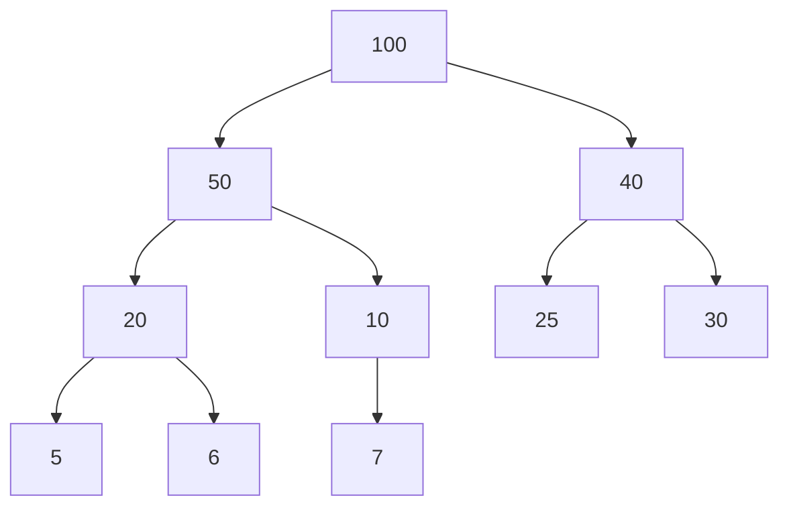
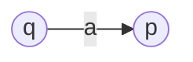
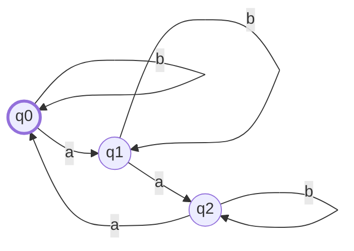

---
script:
  - content: "MathJax = { tex: { inlineMath: [ [''] ] } };"
  - url: https://cdn.jsdelivr.net/npm/mathjax@3/es5/tex-chtml.js
---

# Záróvizsga Tételek 2022

<script src="https://cdn.jsdelivr.net/npm/mermaid/dist/mermaid.min.js"></script>
# Záróvizsga Kidolgozások

## Források

[Farkas Richárd - Algoritmusok és adatszerkezetek I.](https://inf.u-szeged.hu/~rfarkas/Alga20/index.html)

[Iván Szabolcs - Bonyolultságelmélet előadásvázlat, 2020 (1.4MB PDF)](https://www.inf.u-szeged.hu/~szabivan/download/bonyelm/jegyzet.pdf)

[Fülöp Zoltán - Formális nyelvek előadások 2020. tavasz](https://www.youtube.com/playlist?list=PL-9rwKdRSoL32_5BS2N84XbvmtnHJ9YA4)

[Iván Szabolcs - Logika és informatikai alkalmazásai előadás, 2020](https://www.youtube.com/playlist?list=PLn83WpoA-HnbLEEu5RVz25gveJTMfs1D0)

[Iván Szabolcs - Logika és informatikai alkalmazásai előadás diák, 2022 (1.4MB PDF)](https://www.inf.u-szeged.hu/~szabivan/download/logika/slides2022.pdf)

Virágh János - Numerikus matematika, 2003.

[Csendes Tibor - Közelítő és szimbolikus számítások I. (514KB PDF)](https://www.inf.u-szeged.hu/~csendes/koszikicsi.pdf)

[Nagy Antal, Tanács Attila - Számítógépes Architektúrák 2019.](https://www.inf.u-szeged.hu/~tanacs/oktatas/okt_2019_osz_a.html#)

Gyimóthy Tibor, Kertész Attila, Vidács László - Rendszerfejlesztés I. 2020.

Nyékyné Gaizler Judit - Programozási nyelvek 2003.
## Algoritmusok és Adatszerkezetek I

### 1. Részproblémára bontható algoritmusok (mohó, oszd-meg-és-uralkodj, dinamikus programozás), rendező algoritmusok, gráfalgoritmusok (szélességi- és mélységi keresés, minimális feszítőfák, legrövidebb utak)

#### Mohó algoritmusok

A feladatot pontosan egy részfeladatra bontják, és azt tovább rekurzívan oldják meg. Mindig a legjobbnak tűnő megoldás irányába haladunk tovább.

**Nem minden problémára adható mohó megoldás!**

De ha létezik, akkor nagyon hatékony!

**Mohó választás**: Az adott problémát egyetlen részproblémára bontja. Ennek optimális megoldásából következik az eredeti feladat optimális megoldása is.

##### Mohó algoritmus tervezése

1. Fogalmazzuk meg a **mohó választást**.

2. Bizonyítsuk be, hogy az eredeti problémának mindig van olyan **optimális megoldása**, amely **tartalmazza a mohó választást**. Tehát hogy a mohó választás **biztonságos**.

3. Bizonyítsuk be, hogy a mohó választással olyan részprobléma keletkezik, amelynek egy **optimális megoldásához hozzávéve a mohó választást**, az eredeti probléma egy optimális megoldását kapjuk.

##### Példa: _Töredékes hátizsák feladat_

**Bemenet**: A hátizsák  kapacitása,  tárgy,  tárgy súlyok,  tárgy értékek

**Kimenet**: Mi a legnagyobb érték, ami  kapacitásba belefér?

Minden tárgyból 1db van, de az darabolható.

**Algoritmus**:

- Számoljuk ki minden tárgyra az  arányt

- Tegyünk bele a legnagyobb -vel rendelkező, még rendelkezésre álló tárgyból annyit a zsákba, amennyi belefér


Futás a fenti példán:

- Kiszámoljuk az  értékeket
  
  1. Tárgy: 6
  
  2. Tárgy: 5
  
  3. Tárgy: 4

- Végighaladunk a tárgyakon az  arányok szerint
  
  - Az első tárgy teljes egészében belefér, azt beválasztjuk.
  
  - A 2. tárgy is teljes egészében belefér, azt is beválasztjuk.
  
  - A 3. tárgy már nem fér be, beválasztunk annyit, amennyi kitölti a szabad helyet. Jelen esetben a tárgy -át.

> A probléma nem-törtedékes verziójára ez a mohó algoritmus nem mindig talál optimális megoldást.

> 

#### Oszd-meg-és-uralkodj algoritmusok

A feladatot több **részfeladatra** bontjuk, ezek hasonlóak az eredeti feladathoz, de méretük kisebb, tehát ugyan azt a feladatot akarjuk egy kisebb bemenetre megoldani.

**Rekurzív módon** megoldjuk ezeket a részfeladatokat (azaz ezeket is kisebb részfeladatokra bontjuk egészen addig, amíg elemi feladatokig jutunk, amelyekre a megoldás triviális), majd **összevonjuk őket**, hogy az eredeti feladatra megoldást adjanak.

> A részfeladatok ne legyenek átfedőek. Bár az algoritmus ettől még működhet, de nem hatékony.

##### Lépések

1. **Felosztás**: Hogyan osztjuk fel a feladatot több kisebb részfeladatra.

2. **Uralkodás**: A feladatokat rekurzív módon megoldjuk. Ha a részfeladatok mérete elég kicsi, akkor közvetlenül meg tudjuk oldani a részfeladatot, ilyenkor nem osztjuk tovább rekurzívan.

3. **Összevonás**: A részfeladatok megoldásait összevonjuk az eredeti feladat megoldásává.

##### Példa: _Összefésülő rendezés_

1. **Felosztás**: Az  elemű rendezendő sorozatot felosztja két  elemű részsorozatra.

2. **Uralkodás**: A két részsorozatra rekurzívan tovább hívjuk az összefésülő rendezés eljárást. Az elemi eset az egy elemű részsorozat, hiszen az már rendezett, ilyenkor csak visszatérünk vele.

3. **Összevonás**: Összefésüli a két rendezett részsorozatot, ezzel létrehozza az eredeti sorozat rendezett változatát.

```c
          [6, 5, 3, 1, 8, 7, 2, 4]
               /             \
        [6, 5, 3, 1]    [8, 7, 2, 4]
          /                      \
  [6, 5]    [3, 1]        [8, 7]    [2, 4]
  /  \       /   \        /   \      /   \
[6]  [5]    [3]  [1]    [8]  [7]    [2]  [4]

[6]  [5]    [3]  [1]    [8]  [7]    [2]  [4]
  \  /        \  /        \  /        \  /
 [5, 6]      [1, 3]      [7, 8]      [2, 4]
      \      /                \      /
    [1, 3, 5, 6]            [2, 4, 7, 8]
          \                       /
           [1, 2, 3, 4, 5, 6, 7, 8]
```

> Az összefésülés folyamata egyszerű, csak két mutatót vezetünk a két rendezett tömbön, lépkedünk, mindig a kisebbet fűzzük egy másik, kezdetben üres tömbhöz.

##### Példa: _Felező csúcskereső algoritmus_

Vizsgáljuk meg a középső elemet. Ha csúcs, térjünk vissza vele, ha nem csúcs, akkor az egyik szomszédja nagyobb, vizsgáljuk tovább a bemenet felét ezen szomszéd irányába. Azért megyünk ebbe az irányba, mert erre biztosan van csúcs. Ezt onnan tudjuk, hogy maga ez a nagyobbik szomszéd is egy potenciális csúcs. Ha mindkét szomszédja nagyobb, akkor mindegy melyik irányba haladunk tovább, egyszerűen azzal, amiről előbb megtudtuk, hogy nagyobb.

1. **Felosztás**:  elemű sorozatot felosztjuk két  elemű részsorozatra
2. **Uralkodás**: A megfelelő részsorozatban rekurzívan tovább keresünk csúcsot
3. **Összevonás**: Ha csúcsot találtunk, adjuk vissza

```c
// Kiindulási tömb:
[1, 3, 4, 3, 5, 1, 3]

// Középső elemet megkeressük, nem csúcs, így tovább haladunk:
[1, 3, 4, 3, 5, 1, 3]
          ^
// Középső elemet megkeressük, nem csúcs, így tovább haladunk:
[1, 3, 4][3, 5, 1, 3]
    ^
// A középső elem egy csúcs, visszaadjuk
[1, 3][4][3, 5, 1, 3]
       ^
```

Ez az algoritmus logaritmikus időigényű. Ezzel szemben az egyszerű megoldás amikor minden elemen végighaladva keresünk csúcsot, lineáris, azaz jelentősen rosszabb.

#### Dinamikus programozás

Olyan feladatok esetén alkalmazzuk, amikor a **részproblémák nem függetlenek**, azaz vannak közös részproblémák.

> **Optimalizálási feladatok** tipikusan ilyenek.

A megoldott **részproblémák eredményét memorizáljuk** (mondjuk egy táblázatban), így ha azok mégegyszer elő kerülnek, nem kell újra kiszámolni, csak elővenni memóriából az eredményt.

##### Iteratív megvalósítás

- Minden részmegoldást kiszámolunk.

- Alulról-felfelé építkező megközelítés, hiszen előbb a kisebb részproblémákat oldjuk meg, amiknek az eredményét felhasználjuk az egyre nagyobb részproblémák megoldásához.

##### Rekurzív megvalósítás

- Részmegoldásokat kulcs-érték formájában tároljuk.

- Felülről lefele építkező megközelítés.

- **Csak akkor használjuk, ha nem kell minden megoldást kiszámolni!**
  
  - Ha ki kell mindent számolni, érdemesebb az iteratív megköelítést választani a függvényhívások overhead-je miatt.

##### Példa: _Pénzváltás feladat_

Adott  érmékkel (mindből van végtelen sok) hogyan lehet a legkevesebb érmét felhasználva kifizetni  forint.

```c
// Input:
P1 = 1;
P2 = 5;
P3 = 6;
F  = 9;
```

###### Rekurzív megvalósítással a futás

```c
// Egy dimenziós tömbbel dolgozunk, egyes sorokban
// az egyes hívások állapota látszódik.
// Első sor a pénzérme indexét jelöli.

0  1  2  3  4  5  6  7  8  9
0  -  -  -  -  -  -  -  -  ? // penzvalt(9) = min( penzvalt(3), penzvalt(4), penzvalt(8) ) + 1
0  -  -  ?  -  -  -  -  -  ? // penzvalt(3) = min( penzvalt(2) ) + 1
0  -  ?  ?  -  -  -  -  -  ? // penzvalt(2) = min( penzvalt(1) ) + 1
0  ?  ?  ?  -  -  -  -  -  ? // penzvalt(1) = min( penzvalt(0) ) + 1
0  1  ?  ?  -  -  -  -  -  ? // penzvalt(0)-t ismertük már, kiindulástól kezdődően el volt mentve rá a triviális 0 megoldás, így penzvaltas(1) = 0 + 1
0  1  2  ?  -  -  -  -  -  ? // penzvalt(1) visszatér, kiadja penzvalt(2) eredményét
0  1  2  3  -  -  -  -  -  ? // penzvalt(2) visszatér, kiadja penzvalt(3) eredményét
0  1  2  3  -  -  -  -  -  ? // penzvalt(3) visszatér

// penzvalt(9) jelenleg itt tart: min( 3, penzvalt(4), penzvalt(8) ) + 1
0  1  2  3  4  -  -  -  -  ? // penzvalt(4) = min( penzvalt(3) ) + 1

// penzvalt(9) jelenleg itt tart: min( 3, 4, penzvalt(8) ) + 1
0  1  2  3  4  -  -  -  ?  ? // penzvalt(8) = min( penzvalt(2) = 2, penzvaltas(3) = 3, penzvaltas(7) ) + 1
0  1  2  3  4  -  -  ?  ?  ? // penzvalt(7) = min( penzvalt(1) = 1, penzvaltas(2) = 2, penzvaltas(6) ) + 1
0  1  2  3  4  -  ?  ?  ?  ? // penzvalt(6) -> mivel ilyen érménk van, így ezt nem kell kiszámolni, tujuk, hogy penzvalt(6) = 1
0  1  2  3  4  -  1  2  ?  ? // penzvalt(6) visszatér, kiadja penzvalt(7)-et
0  1  2  3  4  -  1  2  3  ? // penzvalt(7) visszatér, kiadja penzvalt(8)-at
0  1  2  3  4  -  1  2  3  4 // penzvalt(8) visszatér, kiadja penzvalt(9)-et
```

> Bár elmondható, hogy egy esetre, az 5-re nem kellett kiszámolnunk az értéket, de ez implementáció függő volt, ha `penzvalt(6)`-ot is ugyan úgy számoltuk volna, mint a többi értéket, akkor mindent kiszámoltunk volna, ás a rekurzív függvényhívűsok overhead-je miatt egyértelműen az iteratív megközelítés lenne a jobb.

###### Iteratív megvalósítással a futás

```c
// 0-tól F-ig (9-ig) építunk egy egy dimentziós tömböt
0  1  2  3  4  5  6  7  8  9

0  ?  ?  ?  ?  ?  ?  ?  ?  ?
0  1  ?  ?  ?  ?  ?  ?  ?  ? // penzvalt[1] = min( penzvalt[0] ) + 1
0  1  2  ?  ?  ?  ?  ?  ?  ? // penzvalt[2] = min( penzvalt[1] ) + 1
0  1  2  3  ?  ?  ?  ?  ?  ? // penzvalt[3] = min( penzvalt[2] ) + 1
0  1  2  3  4  ?  ?  ?  ?  ? // penzvalt[4] = min( penzvalt[3] ) + 1
0  1  2  3  4  1  ?  ?  ?  ? // penzvalt[5] = min( penzvalt[0], penzvalt[4] ) + 1
0  1  2  3  4  1  1  ?  ?  ? // penzvalt[6] = min( penzvalt[0], penzvalt[1], penzvalt[5] ) + 1
0  1  2  3  4  1  1  2  ?  ? // penzvalt[7] = min( penzvalt[1], penzvalt[2], penzvalt[6] ) + 1
0  1  2  3  4  1  1  2  3  ? // penzvalt[8] = min( penzvalt[2], penzvalt[3], penzvalt[7] ) + 1
0  1  2  3  4  1  1  2  3  4 // penzvalt[9] = min( penzvalt[3], penzvalt[4], penzvalt[8] ) + 1
```

#### Rendező algoritmusok

##### Rendezés

- **Input**: Egészek egy  hosszú tömbje (egy `<a1, a2, ..., an>` sorozat)

- **Output**:  hosszú, rendezett tömb (az input sorozat egy olyan `<a'1, a'2, ..., a'n>` permutációja, ahol `a'1 <= a'2 <= ... <= a'n`)

> Ez egy egyszerű eset, a gyakorlatban:
> 
> - Van valamilyen iterálható kollekciónk: `Iterálható<Objektum>`)
> 
> - Van egy függvényünk, ami megondja képt kollekció-elemről, hogy melyik a _nagyobb_: `(a: Objektum, b: Objektum) => -1 | 0 | 1`
> 
> Ezek együttesével már megfelelően absztrakt módon tudjuk használni az összehasonlító rendező algoritmusokat bármilyen esetben.

##### Beszúró rendezés

**Helyben rendező** módszer.

```ts
const beszuroRendezes = (A: number[]) => {
  for (let j = 1; j < A.length; j++) {
    const beillesztendo = A[j];
    let i = j - 1;
    for (; i >= 0 && A[i] > beillesztendo; i--) {
      A[i + 1] = A[i];
    }
    A[i + 1] = beillesztendo;
  }
  return A;
};
```


Végig haladunk a tömbön, és minden elemtől visszafelé elindulva megkeressük annak a helyét, és beszúrjuk oda. Amin áthaladtunk, az a részsorozat már rendezett lesz mindig.

| Futásidő | Tárigény ( össz ~ inputon kívül ) |
|:--------:|:---------------------------------:|
|  |  ~                    |

Legrosszabb eset: Teljesen fordítva rendezett tömb az input: `[5, 4, 3, 2, 1]`. Ekkor minden `beillesztendo` elemre vissza kell lépkedni a tömb elejéig.

##### Kupacrendezés

```ts
const kupacRendezes = (A: number[]) => {
    maximumKupacotEpit(A); // Helyben kupacosítja
    for (let i = A.length - 1, i >= 1; i--) {
        csere(A[1], A[i]);
        kupacMeret[A]--;
        maximumKupacol(A, 1);
    }

    return A;
}
```

Az input tömböt először **maximum-kupaccá** kell alakítani. Ekkor tudjuk, hogy a legnagyobb elem a gyökérben van, így ezt berakhatjuk az éppenvizsgált pozícióra (`csere(A[1], A[i])`). Ez után már csak csökkentenünk kell a kupac méterét, hiszen nem akarjuk mégegyszer a gyökérben az `A[i]`-t. Végezetül helyre kell állítanunk a kupac-tulajdonságot egy `maximumKupacol(A, 1)` hívással. (A 2. paraméter azt mondja meg, melyik csúcsbtól lefelé szeretnénk helyreállítani, jelen esetben az 1-es, hiszen pont azt a pozíciót rontottuk el, amikor cseréltünk. Tehát az egész kupacot helyreállítjuk.)


| Futásidő      | Tárigény ( össz ~ inputon kívül ) |
|:-------------:|:---------------------------------:|
|  |  ~                    |

##### Gyorsrendezés

Összefésülő rendezéshez hasonlóan oszd-meg-és-uralkodj algoritmus

- **Felosztás**: Az `A[p..r]` tömböt, két (esetleg üres) `A[p..q-1]` és `A[q+1..r]` résztömbre osztjuk, hogy az `A[p..q-1]` minden eleme kisebb, vagy egyenlő `A[q]`-nál, és `A[q]` kisebb vagy egyelő `A[q+1..r]` minden eleménél. A `q` index kiszámítása része ennek a felosztó eljárásnak.

- **Uralkodás**: Az `A[p..q−1]` és `A[q+1..r]` résztömböket a gyorsrendezés rekurzív hívásával rendezzük.

- **Összevonás**: Mivel a két résztömböt helyben rendeztük, nincs szükség egyesítésre: az egész `A[p..r]` tömb rendezett.

```ts
const feloszt = (A: number[], p: number, r: number) => {
  const x = A[r];
  let i = p - 1;
  for (let j = p; j <= r - 1; j++) {
    if (A[j] <= x) {
      i++;
      [A[i], A[j]] = [A[j], A[i]];
    }
  }
  [A[r], A[i + 1]] = [A[i + 1], A[r]];
  return i + 1;
};
```

```ts
const _gyorsRendezes = (A: number[], p: number, r: number) => {
  if (p < r) {
    const q = feloszt(A, p, r);
    _gyorsRendezes(A, p, q - 1);
    _gyorsRendezes(A, q + 1, r);
  }
  return A;
};

const gyorsRendezes = (A: number[]) => _gyorsRendezes(A, 0, A.length - 1);
```

| Futásidő | Tárigény |
| -------- |:--------:|
|  |    |

> Fontos, hogy az eljárás teljesítménye függ attól, hogy a felosztások mennyire ideálisak. Valószívűségi alapon a vátható rekurziós mályság , ami mivel egy hívás futásideje , így az átlagos futásidő . A gyakorlat azt mutatja, hogy ez az algoritmus jól teljesít.

> Lehet úgy implementálni, hogy  tárigénye legyen, ez egy helyben rendező, farok-rekurzív ejlárás.

##### Összehasonlító rendezések teljesítményének alsó korlátja

Minden összehasonlító rendező algoritmus legrosszabb esetben  összehasonlítást végez.

> Ez alapján pl. az összefésülő, vagy a kupac rendezés **aszimptotikusan optimális**.

> Eddigi algoritmusok mind összahasonlító rendezések voltak, a kövezkező már nem az.

Ezt döntési fával lehet bebizonyítani, aminek belső csúcsai meghatároznak két tömbelemet, amiket épp összehasonlítunk, a levelek pedig hogy az oda vezető összehasonlítások milyen sorrendhez vezettek. Nem konkrét inputra írható fel döntési fa, hanem az algoritmushoz. Így ennek a fának a legrosszabb esetben vett magassága lesz az algoritmus futásidejének felső korlátja.

##### Leszámoló rendezés

Feltételezzük, hogy az összes bemeneti elem  és  közé esik.

Minden lehetséges bemeneti elemhez megszámoljuk, hányszor fordul elő az inputban.

Majd ez alapján azt, hogy hány nála kisebb van.

Ez alapján már tudjuk, hogy az egyes elemeknek hova kell kerülni. Mert ha pl 5 elem van, ami kisebb, vagy egyenlő, mint 2, akkor tudjuk, hogy az 5. pozíción 2-es kell, hogy legyen.

```ts
const leszamoloRendezes = (A: number[], k: number) => {
  const C = [...new Array(k + 1)].map(() => 0);
  A.forEach((szam) => {
    C[szam]++;
  });
  // Itt a C-ben azon elemek száma van, aminek értéke i

  for (let i = 1; i < C.length; i++) {
    C[i] += C[i - 1];
  }
  // Itt C-ben i indexen azon elemek száma van, amik értéke kisebb, vagy egyenlő, mint i

  const B = [...new Array(A.length)]; // B egy A-val egyező hosszú tömb

  for (let i = A.length - 1; i >= 0; i--) {
    B[C[A[i]] - 1] = A[i];
    C[A[i]]--;
  }

  return B;
};
```

| Futásidő        | Tárigény     |
|:---------------:|:------------:|
|  |  |

> A gyakorlatban akkor használjuk, ha , mert ekkor a futásidő 

#### Gráfalgoritmusok

Gráfok ábrázolása: **éllista** vagy **szomszédsági mátrix**


##### Szélességi keresés

Gráf bejárására szolgál.

A bejárás során kijelöl egy "szélességi fát", ami egy kiindulási csúcsból indulva mindig az adott csúcsból elérhető csúcsokat reprezentálja.

Amilyen távol van a kiindulási csúcstól egy csúcs, az olyan mélységen helyezkedik el ebben a fában.

Irányított, irányítatlan gráfog esetén is alkalmazható.

A csúcsok távolsága alapján kalad a bejárás (a kijelölt kezdeti csúcstól), minden  távolságra levő csúcsot elérünk az előtt, hogy egy  távolságra levőt elérnénk.

Az algoritmus színezi a csúcsokat, ezek a színek a következőket jelentik:

- **fehér**: Kiindulási szín, egy ilyen színű csúcsot még nem értünk el.

- **szürke**: Elért csúcs, de még van fehér szomszédja.

- **fekete**: Elért csúcs, és már minden szomszédja is elért (vagy szürke vagy fekete).


```js
// A G a gráf, s a kiindulási csúcs
szelessegiKereses(G, s) {
    for G grás minden nem s csúcsára {
        szín[csucs] = "fehér"
    }
    szín[s] = "szürke"
    d[s] = 0 // Távolság s-től
    szülő[s] = null
    Q = [] // Üres SOR
    sorba(Q, s)
    while Q nem üres {
        u = sorból(Q)
        for u minden v szomszédjára {
            if (szín[v] === "fehér") {
                szín[v] = "szürke"
                d[v] = d[u] + 1
                szülő[v] = u
                sorba(Q, v) // Tovább feldolgozzuk majd neki a szomszédjait
            }
        }
        szín[u] = "fekete" // Itt már végigmentünk minden szomszédján
    }
}
```

###### Futásidő

- Minden csúcsot egyszer érintünk csak, ez  db csúcs.

- Sorba, és sorból , így a sorműveletek összesen 

- Szomszédsági listákat legfeljebb egyszer vizsgáljuk meg, ezek össz hossza , így összesen  időt fordítunk a szomszédsági listák vizsgálására.

- Az algoritmus elején a kezdeti értékadások ideje .

- Összesített futásidő: 

##### Mélységi keresés

Addig megy a kivezető élek mentén, ameddig tud, majd visszafele indulva minden érintett csúcs kivezető élein addig megy mélyre, amíg lehet.

Ugyan azokat a színekez használja a csúcsok színezésére, mint a szélességi keresés.

Minden csúcshoz feljegyzi, hogy mikor (hány lépés után) érte el, és hagyta el azt.

```js
melysegiKereses(G) {
    for G minden u csúcsára {
        szín[u] = "fehér"
        szülő[u] = null
    }
    idő = 0
    for G minden u csúcsára {
        if (szín[u] === "fehér") {
            melysegiBejaras(u)
        }
    }
}

melysegiBejaras(u) {
    szín[u] = "szürke"
    idő++
    d[u] = idő // Ekkor értük el
    for u minden v szomszédjára {
        if (szín[v] === "fehér") {
            szülő[v] = u
            melysegiBejaras(v) // Azonnal már indulunk is el a talált csúcsból
        }
    }
    szín[u] = "fehete"
    ido++
    f[u] = ido // Ekkor hafytuk el
}
```


###### Futásidő

A melysegiKereses() futásideje a melysegiBejaras() hívástól eltekintve . A melysegiBejaras() hívások össz futásideje , mert ennyi a szomszédsági listák összesített hossza. Így a futásidő 

> A futásidő azért lesz additív mingkét esetben, mert a szomszédsági listák össz hosszára tudjuk mondani, hogy . Lehet, hogy ezt egyszerre nézzük végig, lehet, hogy eloszlatva, de **összessen** ennyi szomszédot vizsgál meg például a mélységiBejárás().

##### Minimális feszítőfák

Cél: megtalálni éleknek azon **körmentes** részhalmazát, amely élek mentén **minden csúcs összeköthető,** és az élek **összesített súlya** legyen a **lehető legkisebb**.

Az így kiválasztott élek egy fát alkotnak, ez a **feszítőfa**.

Két **mohó** algoritmus: **Prim**, **Kruskal**

###### Kruskal

A gráf csúcsait diszjunkt halmazokba sorolja. Kezdetben minden csúcs 1-1 egy elemú csúcs.

> Erre van speciális diszjunkt-halmaz adatszerkezet

Minden iterációban beveszi a legkisebb súlyú élet, aminek végpontjai különböző halmazokban vannak.

Ez által egy erdőt kezel, mit a végére egy fává alakít. Ez lesz a feszítőfa.

```js
kruskal(G, w) { // Az élsúlyokat megadó függvény
    A = 0
    for minden v csúcsra {
        halmaztKeszit(v)
    }
    for minden (u, v) élre, az élsúlyok szerin növekvő sorrendben {
        if halmaztKeres(u) != halmaztKeres(v) {
            A = A unió { (u, v) }
            egyesít(u, v)
        }
    }
}
```

`halmaztKeszit`, `halmaztKeres` és `egyesít` a diszjunkt halmazokat kezelő függvények.


####### Futásidő

Az élek rendezése .

A halmaz műveletek a kezdeti értékadásokkal együtt . Ahol az  egy nagyon lassan növekvő függvény, a diszjunkt-halmaz adatszerkezet jasátossága. Mivek összefüggő gráf esetén , így a diszjunkt-halmaz műveletek  idejűek.  miatt .

Így a teljes futásidő .

##### Prim algoritmus

A Kruskallal ellentétben folyamatosan egy darab fát kezel, ezt növeli az iterációkban.

Egy megadott kiindulási csúcsból indulva minden iterációban hozzávesszük azt a csúcsot, amit a legkisebb súlyú él köt a meglévő fához.

```js
prim(G, w, r) { // Az élsúlyokat megadó függvény
    for minden v csúcsra {
        kulcs[v] = Végtelen
        szülő[v] = null
    }
    kulcs[r] = 0
    Q = G csúcsai // Prioritási sor kulcs[] szerint minimális
    while Q nem üres {
        u = kiveszMin(Q)
        for u minden v szomszédjára {
            if v eleme Q, és w(u, v) < kulcs[v] {
                szülő[v] = u
                kulcs[v] = w(u, v)
            }
        }
    }
}
```


####### Futásidő

Bináris minimum kupac megvalósítással:

Kezdeti értékadások: 

Egy db kiveszMin művelet: . Összesen: , mivel -szer fut le a ciklus.

Belső for ciklus -szer fut, mivel szomszédsági listák hosszainak összege: . (Ez megintcsak additív, nem kell a külső ciklussal felszorozni, mert a szomszédsági listák alapján tudjuk, hogy ennyiszer fog maximum összesen lefutni.) Ezen a cikulson belül a -hoz tartozás vizsgálata konstans idejű, ha erre fenntartunk egy jelölő bitet. A kulcs-nak való értékadás valójában egy kulcsotCsökkent művelet, ami  idejű.

Agy tehát az összesített futásidő: .

> Fibonacchi-kupaccal gyorsítható az algoritmus, ekkor a kiveszMin -s, kulcsotCsökkent -es, teljes futásidő: 

##### Legrövidebb utak

Lehetséges problémák:

- **Adott csúcsból induló legrövidebb utak problémája**: Egy adott kezdőcsúcsból meg szeretnénk találni minden másik csúcshoz vezető legrövidebb utat.

- **Adott csúcsba érkező legrövidebb utak problémája**: Minden csúcsból egy adott csúcsba. Ugyan az, mint az előbbi, ha az élek irányát megfordítjuk.

- **Adott csúcspár közti legrövidebb út problémája:** Ha az elsőt megoldjuk, ezt is megoldottuk. Nem ismert olyan algoritmus, ami aszimptotikusan gyorsabban megoldaná ezt a feladatot, de az elsőt nem.

- **Összes csúcspár közti legrövidebb utak problémája**: Ez persze megoldható lenne az elsővel, ha minden csúcsból elindítjuk, de ennél léteznek gyorsabb megoldások.

**Optimális részstruktúra**: Azt jelenti jelen esetben, hogy két csúcs közti legrövidebb út magában foglalja sokszor másik két csúcs közti legrövidebb utat. Az algoritmusok ezt használják ki.

**Negatív súlyú élek**: Lehetnek, de a gráf nem tartalmazhat **negatív összsúlyú kört**. Ugyanis ekkor nem definiált a legrövidebb út, hiszen a körön mégegyszer végig haladva mindig kisebb súlyú utat kapunk.

**Kör a legrövidebb útban**: Negatív összsúlyú tehát nem lehet, mert ekkor maga a feladat nem definiált. **Pozitív összsúlyú sem lehet**, hiszen ekkor jobban járnánk, ha nem járnánk be a kört. **Nulla összsúlyúnak pedig nincsen értelme**, hogy szerepeljen legrövidebb útban, hiszen ekkor ugyan annyi az összsúly a kör megtétele nélkül is. Tehát általánosságban feltételezhetjük, hogy a **legrövoidebb út nem tartalmaz kört**.

Két függvény, amit használni fognak az algoritmusok:

```js
egyForrasKezdoertek(G, s) { // Kezdőértékek beállítása, ha egy csúcsból indul
    for minden v csúcsra {
        f[v] = Végtelen
        szülő[v] = null
    }
    d[s] = 0
}


közelít(u, v, w) { // (u, v) él alapján v távolságának frissítése (ha u-ból jőve kisebb, akkor csökkentjük)
    if d[v] > d[u] + w(u, v) {
        d[v] = d[u] + w(u, v) // A d[v] becslést csökkenti
        szülő[v] = u
    }
}
```

###### Bellman-Ford algoritmus

**Lehetnek negatív élek**, ha van negatív összsúlyú él, azt felismeri az algoritmus, jelzi azzal, hogy hamissal tér vissza.

```js
bellmanFord(G, w, s) {
    egyForrasKezdoertek(G, s)
    for i = 1 to |V[G]| - 1 {
        for minden (u, v) élre {
            közelít(u, v, w)
        }
    }
    for minden (u, v) élre { // Itt ellenőrzi, hogy volt-e negatív kör
        if d[v] > d[u] + w(u, v) {
            return false
        }
    }
    return true
}
```


####### Futásidő

 hiszen a kezdőértékek beállítésa , az egymásba ágyazott for ciklus , a második ciklus pedig .

###### Dijkstra algoritmusa

**Nemnegatív élsúlyok** esetén működik.

**S halmaz**: Azon csúcsok kerülnek bele, amikhez már meghatározta a legrövidebb utat a kezdőcsúcsból.

```js
dijkstra(G, s) {
    egyForrasKezdoertek(G, s)
    S = üresHalmaz
    Q = V[G] // Q minimum prioritási sor
    while Q nem üres {
        u = kiveszMin(Q)
        S = S unió { u }
        for u minden v szomszádjára {
            közelít(u, v, w)
        }
    }
}
```

A Q sorban azok a csúcsok vannak, amik nincsenek S-ben, tehát még nem tudjuk a hozzájuk vezető legrövidebb utat. A sort a  érték szerint azaz az ismert legrövidebb út szerint indexeljük.


####### Futásidő

Minden csúcs pontosan egyszer kerül át az  halmazba, emiatt amikor szomszédokat vizsgálunk, azt minden csúcsra egyszer tesszük meg, ezen szomszédok vizsgálata összesen -szer fut le, mert ennyi a szomszédsági listák össz hossza. Így a közelít, és ez által a `kulcsotCsökkent` művelet legfejlebb -szer hívódik meg.

Az összesített futásidő nagyban függ a **prioritási sor implementációtól**, a legegyszerűbb eset, ha egy **tömbbel implementáljuk**. Ekkor a `beszúr` és `kulcsotCsokkent` műveletek -esek, a `kiveszMin` pedig , mivel az egész tömbön végig kell menni. Így a teljes futásidő .
**Ritkább gráfok esetén gyorsítható** az algoritmus **bináris kupac** implementációval, és látalánossagban gyorsítható fibonacchi kupaccal.

###### Floyd-Warshall algoritmus

**Dinamikus programozási** algoritmus legrövidebb utak **minden csúcspárra** problémára.

Lehetnek negatív élsúlyok, de negatív összsúlyú körök nem.

Az algoritmus lényege, hogy dinamikus programozással haladunk, egyre több csúcsot használunk fel, és azt figyeljük, hogy a két csúcs között vezető úton jobb eredményt érnénk-e el, ha az adott iteráció csúcsán keresztül mennénk.

Ez a következő rekurziós képlettel írható fel:


```js
floydWarshall(W) { // W szomszédsági mártix
    n = sorokSzama(W)
    D(0) = W
    for k = 1-től n-ig { // Ezt vizsgáljuk mindig majd, mint köztes csúcs
        for i = 1-től n-ig {
            for j = 1-től n-ig {
                d(k)[i, j] = min(
                    d(k - 1)[i, j],
                    d(k - 1)[i, k] + d(k - 1)[k, j]
                )
            }
        }
    }
}
```

A belső értékadás magyarázata: A k. iterációban a legrövidebb út, ami i-ből j-be vezet, az vagy a már megtalált k - 1-edik iterációbeli eredmény, vagy a az előzőz iterációbeli út i-ből k-ba, plusz k-ból j-be, azaz **felhasználjuk-e a k-t, mint egy köztesen érintett csúcsot**.

####### Futásidő

A három for ciklus határozza meg, mert annak a magja -es, így a futásidő , ahol  a sorok száma.

### 2. Elemi adatszerkezetek, bináris keresőfák, hasító táblázatok, gráfok és fák számítógépes reprezentációja

Az **adatszerkezet** adatok tárolására, és szervezésére szolgáló módszer, amely lehetővé teszi a hatékony hozzáférést és módosítést.

Algoritmushoz válasszuk ki az adatszerkezetet. Előfordulhat, hogy az algoritmus a megfelelő adatszerkezeten alapul.

**Absztrakt adatszerkezet**: műveletek által definiált adaszerkezet, nem konkrét implementáció.

**Adatszerkezetek**: Absztrakt adatszerkezetek konkrét megvalósításai. Általában egyes implementációk egyes műveleteket gyorsabban, míg másokat lassaban tudnak végrehajtani. Ez alapján kell az algoritmushoz kiválasztani a megfelelőt.

> Absztrakt adatszerkezetek olyanok, mint **interfészek**, az adatszerkezetek pedig azt implementáló **osztályok**.

#### Listák

Absztrakt adatszerkezet.

Benne az adatok lineárisan követik egymást, egy kulcs többször is előfordulhat benne.

| Művelet            | Magyarázat                                                        |
| ------------------ | ----------------------------------------------------------------- |
| `ÉRTÉK(H, i)`      | `i`. pozíción (index-en) a kulcs értékének visszaadása            |
| `ÉRTÉKAD(H, i, k)` | `i`. pozíción levő értéknek a `k` érték értéküladása              |
| `KERES(H, k)`      | A `k` kulcs (érték) megkerekéke a listában, indexének visszaadása |
| `BESZÚR(H, k, i)`  | Az `i`-edik pozíctó után a `k` beszúrása                          |
| `TÖRÖL(H, k)`      | Első `k` értékű elem törlése                                      |

##### Közvetlen elérésű lista

Összefüggő memóriaterületet foglalunk le, így minden index közvetlen elérésű.

| Művelet            | Futásidő |
| ------------------ | -------- |
| `ÉRTÉK(H, i)`      |    |
| `ÉRTÉKAD(H, i, k)` |    |
| `KERES(H, k)`      |    |
| `BESZÚR(H, k, i)`  |    |
| `TÖRÖL(H, k)`      |    |

> Beszúrásnál újra kellhet allokálni egyel nagyobb emmóriaterületet.

> Jellemzően úgy implementáljuk, hogy definiálunk egy **kapacitást**, és amikor kell, akkor eggyivel allokálunk többet az új memóriaterületen. Illetve jellemzően azt is definiáljuk, hogy mikor kell zsugorítani a területet, azaz hány üresen maradó cella esetén (nem lyukak! az nem lehet, csak a terület végén levő üres cellák) allokáljunk kevesebb területet.

**Előnye**: O(1)-es indexelés.

**Hártánya**: Módosító műveletek lassúal, egy nagy memóriablokk kell.

##### Láncolt lista

Minden kulcs mellett tárolunk egy mutatót a következő, és egy mutatót a megelőző elemre.

**Egyszeresen láncolt lista**: csak a következőre tárolunk mutatót.

**Kétszeresen láncolt lista**: Következőre, előzőre is tárolunk mutatót.

**Ciklikus lista**: Utolsó elem rákövetkezője az első elem, első megelőzője az uolsó elem.

**Őrszem / fej**: Egy NULL elem, ami mindig a lista eleje.

| Művelet            | Futásidő |
| ------------------ | -------- |
| `ÉRTÉK(H, i)`      |    |
| `ÉRTÉKAD(H, i, k)` |    |
| `KERES(H, k)`      |    |
| `BESZÚR(H, k, i)`  |    |
| `TÖRÖL(H, k)`      |    |

> Beszúrás, és törlés valójában . Csak akkor , ha már a megfelelő pozíción vagyunk, azaz már tudjuk, melyik mutatókat kell átírni.

**Előnye**: Nem egy nagy összefüggő memória blokk kell.

**Hártánya**: Nem lehet gyorsan indexelni. Tárigény szempontjából rosszabb, minden kulcs mellett tárolunk legalább egy mutatót.

#### Verem

Lista, amiben csak a legutoljára beszúrt elemet lehet kivenni. (**LIFO**)

Emiatt a speciális művelet végzés miatt gyorsabb, mint a sima lista.

Alkalmazásokra pl.: Függvényhívások veremben, undo-redo, böngésző előzmények.

##### Verem megvalósítás fix méretű tömbbel

Fenntartunk egy mutatót a verem tetejére, eddig van feltöltve a lefoglalt memóriaterület. (A verem alja a 0. index.)

```js
üresVerem(V) {
    return tető[V] == 0
}
```

```js
verembe(V, x) {
    tető[V]++ // Tető mutató frissítése, hiszen egyel több elem lesz
    V[tető[V]] = x
}
```

```js
veremből(V) {
    if üresVerem(V) {
        throw Error("alulcsordulás")
    } else {
        tető[V]--
        return V[tető[V] + 1] // Ez az index nincs felszabadítva, vagy átírva, egyszerűen a mutató van csökkentves
    }
}
```

Mind a 3 művelet -es, hiszen csak indexeléseket, értékadásokat tartalmaznak.

> Hasonlóan a tömbbel megvalósított listához, itt is érdemes lehet kapacitást meghatározni.

#### Sor

Mindig a legelőször beszúrt elemet lehet kivenni. (**FIFO**)

Lefoglalunk egy valamekkora egybefüggő memória szegmenst, de nem mindig használjuk az egészet. Két mutatót tartunk fent, a `fej` és a `vége` mutatókat, ezek jelölik, hogy éppen mekkora részét használjuk a lefoglalt területnek sorként.

```js
sorba(S, x) {
    S[vége[S]] = x // A vége egy üres pozícióra mutat alapból, ezért növeljük utólag.
    if vége[S] = hossz[S] {
        vége[S] = 1 // Ekkor "körvefordult" a sor a lefoglalt memóriaterületen.
    } else {
        vége[S]++
    }
}
```

```js
sorból(S) {
    x = S[fej[S]] // A fej mutat a sor "elejére", azaz a legrégebben betett elemre.
    if fej[S] == hossz[S] {
        fej[S] = 1 // Ekkor "körvefordult" a sor a lefoglalt memóriaterületen.
    } else {
        fej[S]++
    }
}
```

Mind a két művelet -es, hiszen csak indexeléseket, értékadásokat tartalmaznak.

#### Prioritási sor

Absztrakt adatszerketet.

Nem a kulcsok beszúrásának sorrendje határozza meg, mit lehet kivenni, hanem mindig a maximális (vagy minimális) kulcsú elemet tudjuk kivenni.

| Művelet         | Magyarázat                                      |
| --------------- | ----------------------------------------------- |
| `BESZÚR(H, k)`  | Új elem beszúrása a prioritási sorba            |
| `MAX(H)`        | Maximális kulcs értékének visszaadása           |
| `KIVESZ-MAX(H)` | Maximális kulcsú elem kivétele (vagy minimális) |

##### Kupac

Hatékony **prioritási sor megvalósítás**.

A kupac egy **majdnem teljes bináris fa**, amiben minden csúcs értéke legalább akkora, mint a gyerekeié, ezáltal a maximális (minimális) kulcsú elem a gyökérben van.

Majdnem teljes bináris fa alatt azt értjük, hogy a fa legmélyebb szintjén megengedett, hogy balról jobbra haladva egyszer csak már ne álljon fenn a bináris fa tulajdonság.

###### Tömbös megvalósítás

Egybefüggő memóriaterületen van a teljes kupac.

A **szülő**, a **bal gyerek**, és a **jobb gyerek** gyorsan számolható a tömb indexelésével.

```js
szülő(i) { // i indexő elem szülője
    return alsoEgeszResz(i / 2)
}
```

```js
balGyerek(i) { // i indexű elem bal gyereke
    return 2i
}
```

```js
jobbGyerek(i) { // i indexű elem jobb gyereke
    return 2i + 1
}
```



Ennek a kupacnak a tömbös reprezentációja:

```js
[100, 50, 40, 20, 10, 25, 30, 5, 6, 7];
```

####### Kupactulajdonság fenntartása

Garanálnunk kell, hogy az egyes beszúrások, kivételek után a kupacra jellemző tulajdonságok fennmaradnak.

A tulajdonság fenntartására ez a függvény fog felelni:

```js
maximumKupacol(A, i) {
    l = balGyerek(i)
    r = jobbGyerek(i)
    if l <= kupacMéret[A] és A[l] > A[i] { // l <= kupacMéret[A] ellenőrzés csak azért kell, hogy az A[l] indexelés biztonságos legyen.
        legnagyobb = l
    } else {
        legnagyobb = i
    }
    if r <= kupacMéret[A] és A[r] > A[i] { // r <= kupacMéret[A] ellenőrzés csak azért kell, hogy az A[r] indexelés biztonságos legyen.
        legnagyobb = r
    }
    if legnagyobb != i {
        csere(A[i], A[legnagyobb])
        maximumKupacol(A, legnagyobb)
    }
}
```

Tehát a vizsgált indexű elem et összehasonlítjuk a gyerekeivel, és ha valamelyik nagyobb, akkor azzal kicseréljük, és rekurzívan meghívjuk rá a `maximumKupacol()`-t, mert lehet, az új szülőjénél/gyerekénél is nagyobb.

`maximumKupacol()` futásideje , mert ennyi a majdnem teljes bináris fa mélysége, és legrosszabb esetben az egészen végig kell lépkedni.

####### Maximum lekérése

A prioritási sor `MAX(H)` függvényének megvalósítása egyszerű, csak vissza kell adnunk a tömb első elemét, ami a kupac gyökere.

```js
kupacMaximuma(A) {
    return A[1]
}
```

####### Maximum kivétele

Ilyenkor az történik, hogy a kupac utolsó elemét áthelyezzük a gyökérbe, és a gyökérből indulva helyreállítjuk a kupac tulajdonságot, "lekupacoljuk" az elemet.

```js
kupacbólKiveszMaximum(A) {
    if kupacMéret[A] < 1 {
        throw Error("kupacméter alulcsordulás")
    }
    max = A[1]
    A[1] = A[kupacMéret[A]]
    kupacMéret[A]-- // Méter csökkentése, az érték a memóriában marad, csak nem értelmezzük a kupac részeként.
    maxumimKupacol(A, 1) // Mivel beszúrtuk ide az utolsó elemet, helyre kell állítani ("lefelé kupacolni")
    return max
}
```

####### Beszúrás

Új elem beszúrása egyszerű, csak szúrjuk be a kupac végére, és onnan kiindulva végezzünk egy helyreállítást, ezzel az új elemet a helyére "felkupacolva".

```js
kupacbaBeszur(A, x) {
    kupacMéter[A]++
    A[kupacMéret[A]] = x
    maximumKupacol(A, kupacMéret[A])
}
```

####### Futásidők

| Művelet         | Futásidő    |
| --------------- | ----------- |
| `BESZÚR(H, k)`  |    |
| `MAX(H)`        |  |
| `KIVESZ-MAX(H)` |    |

#### Fák, és számítógépes reprezenzációjuk

##### Fa

- Összefüggő, körmentes gráf

- Bármely két csúcsát pontosan egy út köti össze

- Elsőfokú csúcsi: **levél**

- Nem levél csúcsai: **belső csúcs**

###### Bináris fa

- **Gyökeres fa**: Van egy kitűntetett gyökér csúcsa

- **Bináris fa**: Gyökeres fa, ahol minden csúcsnak legfeljebb két gyereke van.

##### Számítógépes reprezentáció

Csúcsokat, és éleket reprezentálunk.

Maga a fa objektumunk egy mutató a gyükérre.

###### Gyerek éllistás reprezentáció

```java
class Node {
    Object key;
    Node parent;
    List<Node> children; // Gyerekek éllistája
}
```

###### Első fiú - apa - testvér reprezentáció

```java
class Node {
    Object key;
    Node parent;
    Node firstChild;
    Node sibling;
}
```

###### Bináris fa reprezentációja

```java
class Node {
    Object key;
    Node parent;
    Node left;
    Node right;
}
```

> Mindegyik esetben, ha nincs Node, akkor NULL-al jelezhetjük. Pl. a gyökér szülője esetében.

#### Bináris keresőfák

Absztrakt adatszerkezet a következő műveletekkel:

| Művelet                           | Magyarázat                                                                        |
| --------------------------------- | --------------------------------------------------------------------------------- |
| `KERES(T, x)`                     | Megkeresi a fában az `x` kulcsot, és visszaadja azt a csúcsot                     |
| `BESZÚR(T, x)`                    | Fába az `x` kulcs beszúrása                                                       |
| `TÖRÖL(T, x)`                     | Fából az `x` kulcsú csúcs törlése                                                 |
| `MIN(T)` / `MAX(T)`               | A fa maximális, vagy minimális kulcsú csúcsának visszaadása                       |
| `KÖVETKEZŐ(T, x)` / `ELŐZŐ(T, x)` | A fában az `x` kulcsnál egyel nagyobb, vagy egyel kisebb értékű csúcs visszaadása |

> A `T` a fa gyökerére mutató mutató.

> Cél: Minden művelet legalább -es legyen

##### Bináris keresőfa tulajdonság

Egy  csúcs értéke annak a bal részfájában minden csúcsnál nagyobb vagy egyenlő, jobb részfájában minden csúcsnál kisebb vagy egyenlő.

##### Keresés

A bináris fa tulajdonságot kihasználva fa keresendő kulcsot hasonlítgatjuk a bal, jobb gyerekekhez, és ennek megfelelően lépünk jobbra / balra.

```js
fábanKeres(x, k) {
    while x != NULL és k != kulcs[x] {
        if k < kulcs[x] {
            x = bal[x]
        } else {
            x = jobb[x]
        }
    }
    return x
}
```

##### Minimum / Maximum keresés

A minimum elem a "legbaloldali" elem

```js
fábanMinimum(x) {
    while bal[x] != NULL {
        x = bal[x]
    }
    return x
}
```

A maximum elem a "legjobboldali" elem

```js
fábanMaximum(x) {
    while jobb[x] != NULL {
        x = jobb[x]
    }
    return x
}
```

##### Következő / Megelőző

```js
fábanKövetkező(x) {
    if jobb[x] == NULL {
        return fábanMinimum(jobb[x])
    }
    y = szülő[x]
    while y != NULL és x == jobb[y] {
        x = y
        y = szülő[y]
    }
    return y
}
```

Azaz, ha van jobb részfája a fának, amiben keresünk, akkor annak a mimimuma a rákövetkező, ha nincs, akkor pedig addig lépkedünk fel, amíg az aktuális csúcs a szülőjének bal gyereke nem lesz, ugyanis ekkor a szülő a rákövetkező.

TODO: Hasonlóan a megelőzőre.

##### Beszúr

```js
fábaBeszúr(T, z) {
    y = null
    x = gyökér[T]
    while x != null {
        y = x
        if kulcs[z] < kulcs[x] {
            x = bal[x]
        } else {
            x = jobb[x]
        }
    }
    szülő[z] = y
    if y = null {
        gyökér[T] = z
    } else if kulcs[z] < kulcs[y] {
        bal[y] = z
    } else {
        jobb[y] = z
    }
}
```

Tehát megkeressük az új elem helyét, az által, hogy jobbra, balra lépkedünk, majd beszúrjuk a megfelelő csúcs alá jobbra, vagy balra.

##### Töröl

```js
fábólTöröl(T, z) {
    if bal[z] == null vagy jobb[z] == null {
        y = z
    } else {
        y = fábanKövetkező(z)
    }

    if bal[y] != null {
        x = bal[y]
    } else {
        x = jobb[y]
    }

    if x != null { // x akkor null, ha y = fábanKövetkező(z)
        szülő[x] = szülő[y] // "átkötés"
    }

    if szülő[y] == null {
        gyökér[T] = x // Ha gyökérbe lett kötve az y, akkor ezt is frissítjük
    } else if y == bal[szülő[y]] {
        bal[szülő[y]] = x // "átkötés"
    } else {
        jobb[szülő[y]] = x // "átkötés"
    }

    if y != x {
        kulcs[z] = kulcs[y]
    }

    return y
}
```

###### Levél törlése

Ha a kitörlendő csúcs egy levél, akkor egyszerűen kitöröljük azt, a szülőkénél a rá mutató mutatót `null`-ra állítjuk.

###### Egy gyerekes belső csúcs

Ebben az esetben a törlendő csúcs helyére bekötjük annak a részfáját ()amiből, mivel egy gyereke van, csak egy van).

###### Két gyerekes belső csúcs

Ebben az esetben a csúcs helyére kötjük annak a rákövetkezőjét. Mivel ebben az esetben van biztosan jobb gyereke, így a jobb gyerekének a minimumát fogjuk a helyére rakni (ami mivel egy levél, csak egyszerűen törölhetjük az eredeti helyéről).

##### Futásidők

Az összes művelet (`KERES`, `MAX / MIN`, `BESZÚR`, `TÖRÖL`, `KÖVETKEZŐ / ELŐZŐ`) -s, azaz a fa magasságával arányos. Ez alap esetben nem feltétlen olyan jó, de kiegyensúlyozott fák esetén jó, hiszen akkor -es.

> Pl. AVL-fa, bináris kereső fa kiegyensúlyozott.

#### Halmaz

Absztrakt adatszerkezet.

Egy elem legfejlebb egyszer szerepelhet benne.

| Művelet                                | Magyarázat                         |
| -------------------------------------- | ---------------------------------- |
| `TARTALMAZ(k)` (lényegében `KERES(k)`) | Benne van-e egy e `k` a halmazban? |
| `BESZÚR(K)`                            | Elem behelyezése a halmazba.       |
| `TÖRÖL(K)`                             | Elem törlése a halmzból.           |

> Egyéb extra műveletek definiálhatóak, pl.: `METSZET`, `UNIÓ`

##### Közvetlen címzésű táblázat

Egy akkora tömb lefoglalása, mint amekkora a teljes érték univerzum mérete, és ha egy szám eleme a halmaznak, egyszerűen beírjuk ezt a megfelelő indexre.

Jó, mert nagyon gyors megoldás.

Viszont nagy probléma, hogy a tárigény az univerzum méretével arányos, nem pedig a ténylegesen felhasznált elemekkel.

Kis méretű univerzum esetén ajánlatos csak.

#### Szótár

Absztrakt adatszerkezet.

Egy halmaz elemeihez (kulcsok) egy-egy érték tartozik. Kulcs egyedi, érték ismétlődhet.

> dict, asszociatív tömb, map

#### Hasító tábla

Szótár, és halmaz hatékony megvalósítása.

Cél.: `TARTALMAZ`, `BESZÚR`, `TÖRÖL` műveletek legyenek gyorsak.

##### Hasító függvény

Kulcsok  univerzumának elemeit (lehetséges kulcsokat) képezi le a hasító táblázat **rés**eire.

Pl.: 

 a hasító táblázat mérete, azaz a **rések száma**.

Mivel az unicerzum, a lehetséges kulcsok száma nagyobb, mint réseké (különben csinálhatnánk tömbös megvalósítást), így elkerülhetetélen, hogy ürközések legyenek, azaz hogy a hasító függvény két kulcsot ugyan arra a résre képezzen le.

Ezeket az **ütközéseket fel kell oldani**.

##### Ütközésfeloldás láncolással

A résekben láncolt listák vannak.

Ha olyan helyre akarunk beszúrni, ahol már van elem, akkor a lista elejére szúrjuk be az újat (ez konstans idejű).

**Keresés, törlés valamivel romlik**, hiszen egy lsitán is végig kelhet menni.

Kitöltési tényező:  (**láncok átlagos hossza**)

: rések száma

: elemek a táblában

**Egyszerű egyenletes hasítási feltétel**: Minden elem egyforma valószínűséggel képződik le bármelyik résre.

Ha egy hasító függvény ezt biztosítja, akkor a keresések (mind sikeres, mind sikertelen) átlagos ideje (nem legrosszabb!) 

Ha tudjuk, mennyi elem lesz a táblában, akkor meg tudjuk választani a rések számát úgy, hogy az  egy konstans legyen, ekkor `KERES`, `TÖRÖL`, `BESZÚR` mind .

#### Gráfok számítógépes reprezentációja


- Csúcsok + élek halmaza

- Szomszédsági mártix

- Szomszédsági lista

|                        | Létezik (u, v) él?       | Összes él listázása | Egy csúcs szomszédainak listázása |
| ---------------------- |:------------------------:|:-------------------:|:---------------------------------:|
| Csúcsok + élek halmaza |           |      |                    |
| Szomszédsági mátrix    |               |    |                    |
| Szomszédsági lista     |  |      |           |

Érdemes mindig elgondolkodni, hogy milyen reprezentációt választunk, az alapján, hogy milyen gráfogkra számítunk, azaz várhatóan milyen az élek és csúcsok eloszlása, azaz mennyire ritka / sűrű a gráf. Ha az élek száma arányos a csúcsok számával, az egy sűrű gráf, ha az élek száma arányos a csúcsok számának négyzetével, az egy ritka gráf.
## Bonyolultságelmélet

### 1. Hatékony visszavezetés. Nemdeterminizmus. A P és NP osztályok. NP-teljes problémák.

### A P osztály

R az eldönthető problémák osztálya.

Polinomidőben eldönthető problémák osztálya.

Tehát minden olyan **eldöntési probléma** P-ben van, amire létezik  időigényű algoritmus, valamely konstans -ra.

> Ezeket a problémákat tartjuk **hatékonyan megoldhatónak**.

#### Elérhetőség

P-beli probléma.

**Input**: Egy  irányított gráf. Feltehető, hogy 

**Output**: Vezet-e -ben (irányított) út -ből -be?

Erre van algoritmus:

- Kiindulásnak veszünk egy  és  halmazt.

- Mindig kiveszünk egy elemet -ből, és annak szomszédait betesszük -be, és -ba is.

- Ez által -ban lesznek az -ből elérhető csúcsok.

Erre a konkrét implementációnk futásideje változó lehet, függhet például a gráf repretenzációtól, és a halmaz adatszerjezet megválasztásától. De a lényeg, hogy van-e polinom idejű algoritmus, és mivel általánosságban -el számolhatunk legrosszabb esetnek (előnytelen implementáció esetén is bele férünk), így -ös a futásideje az algoritmusnak (hiszen , mert biztosan kevesebb a csúcsok száma, mint a gráfot ábrázoló biteké).

#### Hatékony visszavezetés

##### Rekurzív visszavezetés

> A.K.A. Turing-visszavezetés

Az  eldöntési probléma **rekurzívan visszavezethető** a  eldöntési problémára, jelben , ha van olyan  **rekurzív függvény**, mely  inputjaiból  inputjait készíti **választartó** módon, azaz minden  inputra 

> Itt a _rekurzió_ azt jelenti, hogy kiszámítható, adható rá algoritmus.

Ebben az esetben ha  eldönthető, akkor  is eldönthető, illetve ha  eldönthetetlen, akkor  is eldönthetetlen.

Lényegében ez azt fejezi ki, hogy " legalább olyan nehéz, mint ".

**Probléma ezzel a megközelítéssel**: Ha  eldönthető probléma,  pedig nemtriviális, akkor .

- Tehát nehézség szempontjából nem mondtunk valójában semmit.

- Ennek oka, hogy ebben az esetben az  inputkonvertáló függvényben van lehetőségünk egyszerűen az  probléma megoldására, és ennek megfelelően  egy _igen_, vagy _nem_ példányának visszaadására.

- Ez alapján az összes nemtriviális probléma (azaz az olyanok, amik nem minden inputra ugyan azt adják) "ugyan olyan nehéznek" tűnik.

- Probléma oka: **Túl sok erőforrást engedünk meg az inputkonverzióhoz**, annyit, ami elég magának a problémának a megoldására.

- Megoldás: Hatékony visszavezetés.

##### Hatékony visszavezetés

> A.K.A. Polinomidejű visszavezetés

Az  eldöntési probléma **hatékonyan visszavezethető** a  eldöntési problémára, jelben , ha van olyan  **polinomidőben kiszámítható** függvény, mely  inputjaiból  inputjait készíti **választartó** módon.

Ekkor ha  **polinomidőben** eldönthető, akkor  is eldönthető **polinomidőben**, illetve ha -ra nincs polinomidejű algoritmus, akkor -re sincs.

##### Példa

Egy példa a hatékony visszavezetésre a 

###### PÁROSÍTÁS

**Input**: Egy **CNF** (konjunktív normálformájú formula)

**Output**: Kielégíthető-e?

> Azaz van-e olyan értékadás, ami mellett igaz a formula?

###### SAT

**Input**: Egy  gráf

**Output**: Van-e -ben teljes párosítás?

> Közös csúccsal nem rendelkező élek halmaza, amik lefednek minden csúcsot.

###### Visszavezetés

Tehát a cél egy  gráfból egy  CNF előállítása választartó módon, polinomidőben úgy, hogy **-ben pontosan akkor legyen teljes párosítás, ha  kielégíthető**.

- Minden élhez rendelünk egy logikai változót.

- Akkor lesz igaz a változó, ha beválasztjuk az élt a teljes párosításba.

- A cél egy olyan CNF előállítása, amiben a következőt formalizáljuk: Minden csúcsra felítjuk, hogy pontosan egy él illeszkedik rá, majd ezeket összeéseljük. Ha így egy csúcsra sikerül megfelelő CNF-et alkotni, akkor azok összeéselése is CNF, hiszen CNF-ek éselése CNF.

- Egy csúcshoz annak formalizálása, hogy pontosan egy él fedi: legalább egy él fedi ÉS legfeljebb egy él fedi.
  
  - Legalább egy: Egyetlen CNF kell hozzá: .
  
  - Legfeljebb egy: Négyzetesen sok klóz kell hozzá, minden csúcspárra megkötjük, hogy "nem ez a kettő egyszerre": 

>  az adott viszgált csúcsra illeszkedő élek.


#### Nemdeterminizmus

**Nemrealisztukus** számítási modell: Nem tudjuk hatékonyan szimulálni.

RAM gépen el lehet képzelni a következő utasításképp: `v := nd()`.

Ezzel nemdeterminisztikusan adunk értéket egy bitnek, amit úgy lehet elképzelni, mintha ezen a ponton a számítás elágazna, és az egyik szálon `v = 1`, a másikon `v = 0` értékkel számol. Egy ilyen elégazásnak konstans időben kellene történnie.


A fenti képen egy **számítási fa** van, minden elégazás egy nemdeterminisztikus bitgenerálás.

**Időigény**: A leghosszabb szál időigénye. Tehát a **számítási fa mélysége**.

**Eldöntési algoritmus** esetén a végeredmény akkor **true, ha legalább egy szál true,** akkor **false, ha minden szál false**.

##### Nemdeterminisztikus algoritmus a SAT-ra

Input formulánkban az  változók fordulnak elő.

1. Generáljunk minden -hez egy nemdeterminisztikus bitet, így kapunk egy értékadást.

2. Ha a generált értékadás kielégíti a formulát, adjunk vissza `true`-t, egyébként `false`-t.

Példa input: 

Ehhez az inputhoz a számítási fa:


Ennek az algoritmusnak a nemdeterminisztikus időigénye , hiszen  változónak adunk értéket, és a behelyettesítés, ellenőrzés is lineáris időigényű.

#### Az NP osztály

**Nemdeterminisztikus algoritmussal polinomidőben** eldönthető problémák osztálya.

A **SAT** a korábbi példa alapján például **NP-beli**.

 természetesen igaz, hiszen egy determinisztikusan polinom idejű algoritmus felfogható olyan nemdeterminisztikusnak, ami sosem ágazik el.  miatt .

Ennél többet nem tudunk, nem tudjuk, hogy  igaz-e. Széleskörben elfogadott sejtés, hogy nem. Hasonlóan az sem ismert, hogy  igaz-e, erről is az az elfogadtott álláspont, hogy nem.

Persze  is igaz, mert a nemdeterminisztikus számítás szimulálható determinisztikusan, bár ez exponenciálisan lassú.


#### NP-teljes problémák

**-teljesség definíciója**: Ha  problémák egy osztálya, akkor az  probléma

- **-nehéz**, ha minden -beli probléma visszavezethető -ra

- **-teljes**, ha  még ráadásul -ben is van

##### Polinomidőben verifikálhatóság

Az  probléma polinomidőben verifikálható, ha van egy olyan  reláció, **inputok**, és **tanúk** között, melyre:

- Ha  az  inputra és a  tanúsítványra, akkor  valamilyen  konstansra (azaz a tanúk "nem túl hosszúak")

- Ha kapunk egy  párt, arról determinisztikusan polinomidőben el tudjuk dönteni, hogy  fennáll-e, vagy sem (azaz egy tanú könnyen ellenőrizhető)

- Pontosan akkor létezik -hez olyan , melyre  igaz, ha  az -nak egy "igen" példánya (azaz  tényleg egy jó "tanúsítvány-rendszer" az  problémához)

> SAT esetében pl. lineáris időben tudjuk ellenőrizni, hogy egy adott értékadás kielégíti-e a CNF-et.

**Egy probléma pontosan akkor van NP-ben, ha polinomidőben verifikálható.**

##### SAT

Cook tétele kimondja, hogy a **SAT egy NP-teljes probléma**.

Variánsok: FORMSAT, 3SAT is NP-teljes (és minden kSAT -ra), DE 2SAT P-beli, visszavezethető ugyanis az elérhetőségre.

Horn-átnevezhető formulák kielégítése is polinomidőben eldönthető.

> Horn-formula, ha minden klózban legfeljebb egy pozitív literál, Horn-átnevezhető, ha bizonyos változók komplementálásával Horn-formulává alakítható.

##### NP-teljes gráfelméleti problémák

###### Független csúcshalmaz

**Input**: Egy  irányítatlan gráf, és egy  szám

**Output**: Van-e -ben  darab **független**, azaz páronként nem szomszédos csúcs?

###### Klikk

**Input**: Egy  gráf, és egy  szám.

**Output**: Van-e -ben  darab páronként szomszédos csúcs?

###### Hamilton-út

**Input**: Egy  gráf.

**Output**: Van-e -ben Hamilton-út?

##### Halmazelméleti NP-teljes problémák

###### Párosítás

**Input**: Két egyforma méretű halmaz, , és , és egy  reláció.

**Output**: Van-e olyan  részhalmaza a megengedett pároknak, melyben minden -beli elem pontosan egyszer van fedve?

>  halmaz: lányok,  halmaz: fiúk, reláció: ki hajlandó kivel táncolni. Kérdés: Párokba lehet-e osztani mindenkit?

###### Hármasítás

**Input**: Két egyforma méretű halmaz, , , és , és egy  reláció.

**Output**: Van-e olyan  részhalmaza a megengedett pároknak, melyben minden -beli elem pontosan egyszer van fedve?

> Hasonló példa áll,  halmaz házak, ahol táncolnak.

###### Pontos lefedés hármasokkal

**Input**: Egy   elemű halmaz, és háromelemű részhalmazainak egy  rendszere.

**Output**: Van-e az -k közt , amiknek uniója ?

###### Halmazfedés

**Input**: Egy  halmaz, részhalmazainak egy  rendszere, és egy  szám.

**Output**: Van-e az -k közt  darab, amiknek uniója ?

###### Halmazpakolás

**Input**: Egy  halmaz, részhalmazainak egy  rendszere, és egy  szám.

**Output**: Van-e az -k közt  darab páronként diszjunkt?

##### Számelméleti NP-teljes problémák

###### Egész értékű programozás

**Input**: Egy  egyenlőtlenség-rendszer, -ban és -ben egész számok szerepelnek.

**Output**: Van-e egész koordinátájú  vektor, mely kielégíti az egyenlőtlenségeket?

###### Részletösszeg

**Input**: Pozitív egészek egy  sorozata, és egy  célszám.

**Output**: Van-e ezeknek olyan részhalmaza, melynek összege épp ?

###### Partíció

**Input**: Pozitív egészek egy  sorozata.

**Output**: Van-e ezeknek egy olyan részhalmaza, melynek összege épp ?

###### Hátizsák

**Input**:  darab tárgy, mindegyiknek egy  súlya, és egy  értéke, egy  összkapacitás és egy  célérték.

**Output**: Van-e a tárgyaknak olyan részhalmaza, melynek összsúlya legfeljebb , összértéke pedig legalább ?

> TODO: erős-, gyenge NP-teljesség kell-e ide?

### 2. A PSPACE osztály. PSPACE-teljes problémák. Logaritmikus tárigényű visszavezetés. NL-teljes problémák.

#### A PSPACE osztály

Determinisztikusan (vagy nemdeterminisztikusan), polinomidőben megoldható problémák osztálya.

- : Az  tárban eldönthető problémák osztálya.

- : Az  tárban **nemdeterminisztikusan** eldönthető problémák osztálya.

- : Az  időben eldönthető problémák osztálya.

- : Az  időben **nemdeterminisztikusan** eldönthető problémák osztálya.

PSPACE-beli problémák még **nehezebbek, mint az NP-beliek**.

##### Fontos összefüggés NSPACE és SPACE között


Ebből következik ez is:


Hiszen a kettes hatványtól függetlenül  ugyan úgy csak egy **polinom**iális függvény.

> Ennek az összefüggésnek az oka, hogy a tár **újra felhasználható**. Emiatt viszonylag kevés tár is elég sok probléma eldöntésére. Az idő ezzel szemben sokkal problémásabb, nem tudjuk, hogy egy  időigényű nemdeterminisztikus algoritmust lehet-e -nél gyorsabban szimulálni.

##### Lineáris tárigény

Az előbb említett előny miatt elég sok probléma eldönthető  tárban.

Pl. **SAT**, **HAMILTON-ÚT,** és a **3-SZÍNEZÉS** mind eldönthető lineáris tárban. Csak lehetséges tanúkat kell generálni, fontos, hogy egyszerre csak egyet, ezt a tárat használjuk fel újra és újra. Ellenőrizzük a tanút, ha nem jó generáljuk a következőt.

#### _Offline_, vagy _lyukszalagos_ tárigény

Ha az algoritmus az inputot csak olvassa, és az outputot _stream-mód_-ban írja, akkor az input, output regisztereket nem kell beszámolni, csak a working regisztereket.

> A cél ezzel az, mert a korábbiak alapján jó lenne, ha lehetne értelme szublineáris tárigénynek. Márpedig ha pl. az inputot már beszámoljuk, akkor az már legalább lineáris.

#### Az NL-osztály

- : Determinisztikusan logaritmikus tárban eldönthető problémák osztálya.

- : Nemdeterminisztikusan logaritmikus tárban eldönthető problémák osztálya.

Immermann-Szelepcsényi tétel szerint: 

##### Mit nem szabad, hogy legyen esély NL-beli algoritmust készíteni?

- Az **inputot írni**.

-  méretű bináris tömböt felvenni.

##### Mit szabad?

- Olyan **változót létrehozni**, amibe  és  közti számokat írunk, hiszen ezek  tárat igényelnek.

- Nem csak -ig ér számolni, hanem bármilyen **fix fokszámú polinomig**. Pl. ha -ig számolunk, az is elfér  biten, tehát  a tárkorlátja.

- Az **input valamelyik elemére rámutatni** egy pointerrel, hiszen lényegében ez is egy -tól -ig értékeket felvevő változó.

##### Elérhetőség

**Determinisztikusan** Savitch tétele szerint az ELÉRHETŐSÉG eldönthető  tárban. Ennek oka a rekurzió, hiszen egy példányunk  táras, de ebből egyszerre akár  darab is lehet a memóriában.

**Nemdeterminisztikusan** bele férünk a logtárba. Ekkor "nemdeterminisztikusan bolyongunk" a gráfban, és ha  lépésben elértünk a csúcsig, akkor `true` amúgy `false`. Tehát minden iterációban átlépünk nemdeterminisztikusan minden szomszédra, ha megtaláltuk a cél csúcsot, `true`, ha nem tudunk már tovább lépni, vagy lefutott mind az  iteráció, akkor `false`.

Ezek alapján tehát:


#### Logtáras visszavezetés

-n belül ugye a polinomidejű visszavezetésnek nincs értelme. Hiszen ekkor az inputkonverziót végző függvényben meg tudjuk oldani a problémát, és csak visszaadni egy ismerten `true` vagy `false` inputot.

##### Definíció

Legyenek  és  eldöntési problémák. Ha  egy olyan függvény, mely

-  inputjaiból  inputjait készíti,

- választartó módon:  "igen" példányiból  "igen" példányait, "nem" példányaiból pedig "nem" példányt,

- és logaritmikus tárban kiszámítható,

akkor  egy logtáras visszavezetés -ról -re. Ha  és  közt létezik ilyen, akkor azt mondjuk, hogy  logtárban visszavezethető -re, jelben .

>  biztosan lyukszalagos, hiszen szublineárisnak kell lennie.

##### Tulajdonságok

A logaritmikus tárigényű algoritmusok polinom időben megállnak, hiszen  tárat  féleképp lehet teleírni, minden pillanatban a program  darab konstans utasítás egyikét hajtja éppen végre, így összesen -féle különböző konfigurációja lehet, ami polinom.

Ebből következik: 

> Azaz a logtáras visszavezetés formailag "gyengébb".

Valójában nem tudjuk, hogy ténylegesen gyengébb-e ez a visszavezetés, de azt tudjuk, hogy akkor lesz gyengébb, ha .

 pontosan akkor teljesül, ha 

Ha  és  logtáras függvények, akkor kompozíciójuk is az. Ez azért jó, mert akkor itt is be lehet vetni azt a trükköt, amit a polinomidejű visszavezetésnél, azaz a -nehézség bizonyításához elég egy már ismert -nehéz problémát visszavezetni az adott problémára. Hiszen ekkor tranzitívan minden -beli probléma visszavezethető lesz az aktuális problémára is.

#### NL-teljes problémák

Legyen  problémák egy osztálya. Azt mondjuk, hogy az  probléma -nehéz, ha  minden eleme **logtárban** visszavezethető -ra.

Ha ezen kívül  még ráadásul -beli is, akkor  egy -teljes probléma.

> Szóval ugyan az, mint -n kívül, csak logtárban, mivel -n belül a polinomidejű visszavezetésnek nincs értelme.

##### P-teljes problémák

- Input egy **változómentes** itéletkalkulus-beli formula, kiértékelhatő-e?

- HÁLÓZAT-KIÉRTÉKELÉS

##### NL-teljes problémák

- **ELÉRHETŐSÉG**

- **ELÉRHETŐSÉG** úgy, hogy az input irányított, **körmentes** gráf

- **ELÉRHETETLENSÉG** (mivel ez az ELÉRHETŐSÉG komplementere, igy -teljes, így -teljes, hiszen  az Immermann-Szelepcsényi tétel szerint)

- **2SAT** (, és annak a komplementere, megintcsak az Immermann-Szelepcsényi tétel miatt)

#### PSPACE-teljes problémák

##### QSAT

**Input**: Egy  alakú **kvantifikált ítéletlogikai** formula, melynek magja, a  konjunktív normálformájú, **kvantormentes** formula, melyben csak az  változók fordulnak elő.

**Output**: Igaz-e ?

> Ez nem első rendű logika, az  változók csak igaz / hamis értékeket vehetnek fel.

A QSAT egy **PSPACE-teljes** probléma.

Egy QSAT-ot megoldó rekurzív algoritmus rekurziós fája:


Tárigénye , mert a rekurziókor lemásoljuk az inputot, ami  méretű, és a mélység 

###### QSAT, mint kétszemélyes, zéró összegű játék

**Input**: Egy  alakú **kvantifikált ítéletlogikai** formula, melynek magja, a  konjunktív normálformájú, **kvantormentes** formula, melyben csak az  változók fordulnak elő.

**Output**: Az első játékosnak van-e nyerő stratégiája a következő játékban?

- A játékosok sorban értéket adnak a változóknak, előbb az első játékos -nek, majd a második -nek, megint az első stb., végül a második -nek.

- Ha a formula értéke igaz lesz, az első játékos nyert, ha hamis, a második.

##### FÖLDRAJZI JÁTÉK

**Input**: Egy  irányított gráf. és egy kijelölt "kezdő" csúcsa.

**Output**: Az első játékosnak van-e nyerő stratégiája a következő játékban?

- Először az első játékos kezd, lerakja az egyetlej bábuját a gráf kezdőcsúcsára.

- Ezután a második játékos lép, majd az első, stb., felváltva, mindketten a bábut az aktuális pozíciójából egy olyan csúcsba kell húzzák, ami egy lépésben elérhető, és ahol még nem volt a játék során. Aki először nem tud lépni, vesztett.

##### További PSPACE-teljes problémák

- Adott egy  determinisztikus RAM program, és egy  inputja. Igaz-e, hogy  elfogadja -t, méghozzá  tárat használva?

- Adott két reguláris kifejezés. Igaz-e hogy ugyan azokra a szavakra illeszkednek?

- Adott két nemdeterminisztikus automata. Ekvivalensek-e?

- -es SOKOBAN

- -es RUSH HOUR
## Formális Nyelvek

### 1. Véges automata és változatai, a felismert nyelv definíciója. A reguláris nyelvtanok, a véges automaták, és a reguláris kifejezések ekvivalenciája. Reguláris nyelvekre vonatkozó pumpáló lemma, alkalmazása és következményei.

#### Véges automata

Az  rendszert **determinisztikus automatának** nevezzük, ahol:

-  egy nem üres, véges halmaz, az **állapotok halmaza**

-  egy ábécé, au **input ábécé**

-  a **kezdő állapot**

-  a **végállapotok halmaza**

-  egy leképezés, az **átmenetfüggvény**

Példa:

- 

- 

- 

- 
  
  - 
  
  - 
  
  - 
  
  - 
  
  - 
  
  - 

##### Automata megadása irányított gráfként

Gráf csúcsai az automata állapotai

Ha , akkor a  csúcsból egy élet irányítunk a  csúcsba, és az élet ellátjuk az  címkével



> Itt az automata a  állapotból az  input szimbólum hatására átmegy a  állapotba.

A korább példa automata megadása gráffal:



> A  állapot jelen példában a végállapot is, amit a vastagított szél jelez.

##### Automata megadása táblázatként

Első sorban a kezdőállapot, végállapotokat meg kell jelölni (itt most csillag).

A korább példa automata megadása táblázattal:

|  |    |    |
|:--------:|:-----:|:-----:|
| \*  |  |  |
|     |  |  |
|     |  |  |

> Csillag jelzi, hogy az adott sor állapota végállapot.

##### Automata átmenetei

 **konfigurációinak halmaza**: 

A  **konfiguráció** azt jelenti, hogy  a  állapotban van ás az  szót kapja inputként.

###### Átmeneti reláció

 esetén , ha , valamely -ra, és .

> Azaz aminkor az automata átmegy -ból -be, akkor az ehhez "felhasznált" szimbólumot leveszi az input szó elejéről. Pl. itt  hatására ment, és , így az átmenet után az input szó már csak  az  nélkül. Mondhatni, hogy az -t felhasználta az átmenethez.

####### Átmeneti reláció fajtái

- : Egy lépés

- :  lépés

- : Legalább egy lépés

- : Valamennyi (esetleg 0) lépés

> Az  jelölés egy automatát azonosít, elhagyható, ha éppen csak 1 automatáról beszélünk, mert ilyenkor egyértelmű

> \*, és + itt is, és mindenhol ebben a tárgyban úgy működik, mint megszokott regexeknél

##### Felismert nyelv

Az  automata által felismert nyelven az  nyelvet értjük.

> Azaz -ból  hatására valamelyik  végállapotba jutunk

>  az üres szó

##### Nemdeterminisztikus automata

Az  rendszert **nemdeterminisztikus automatának** nevezzük, ahol:

-  egy nem üres, véges halmaz, az **állapotok halmaza**

-  egy ábécé, az **input ábécé**

-  a **kezdő állapot**

-  a **végállapotok halmaza**

-  egy leképezés, az **átmenetfüggvény\***

> Azaz ugyan az, mint a determinisztikus, csak egy input szimbólum hatására egy állapotból többe is átmehet.

A determinisztikus automata ezen általánosítása (hiszen ez egy általánosítás, a determinisztikus automata is lényehében olyan nemdeterminisztikus ami mindig állapotoknak egy egyelemű halmazába tér át) **nem növeli meg a felismerő kapacitást**, tehát egy nyelv akkor és csak akkor ismerhető fel nemdeterminisztikus automatával, ha felismerhető determinisztikus automatával.

> Ezt "hatvány halmaz módszerrel" lehet bebizonyítani, meg kell nézni, hogy  hatására milyen állapotokba tud kerülni a nemdeterminisztikus automata, és azonkah az uniója lesz egy állapot. Ez a "determinizálás", aminek a során az állapotok száma nagyban megnőhet (akár exponenciálisan).

###### Átmeneti reláció

 esetén , ha , valamely -ra, és .

###### Felismert nyelv

Az  (nemdeterminisztikus) automata által felismert nyelven az  nyelvet értjük.

> Azaz -ból a  hatására elérhető valamely  végállapot. DE! Nem baj, ha elérhetően nem-végállapotok is.

###### Teljesen definiált automata

Akkor teljesen definiált egy automat, ha minden szót végig tud olvasni.

Azaz nem tud pl. egy  átmenet miatt elakadni.

Azaz akkor teljesen definiált, ha minden  és  esetén  **legalább** egy elemű.

Determinisztikus automaták teljesen definiáltak, hiszen pontosan egy állapotba léphetünk tovább.

Nemdeterminisztikus automaták pedig teljesen definiálhatóvá tehetőek "csapda" állapot bevezetésével, anélkül, hogy a felismert nyelv megváltozna.

- Felveszünk egy  állapotot (ez a "csapda") állapot.

-  esetén legyen 

- Legyen  minden -ra.

> A 3. pont az, ami miatt ez egy "csapda", nem lehet már ebből az állapotból kijönni.

##### Nemdeterminisztikus -automata

Tartalmaz -átmeneteket.

Az  rendszert **nemdeterminisztikus -automatának** nevezzük, ahol:

-  egy nem üres, véges halmaz, az **állapotok halmaza**

-  egy ábécé, az **input ábécé**

-  a **kezdő állapot**

-  a **végállapotok halmaza**

-  egy leképezés, az **átmenetfüggvény**

> Azaz ugyan olyan, mint a nemdeterminisztikus, csak lehet olyan átmenete, ami "nem fogyasztja" az inputot. Ez az -átmenet.

**Ez sem bővíti a felismerő kapacitást**, egy nyelv akkor és csak akkor ismerhető fel nemdeterminisztikus -átmenetes automatával, ha felismerhető nemdeterminisztikus automatával.  automata -mentesítéssel átalakítható nemdeterminisztikus automatává, ekkor az automaza a  állapotból az  hatására azon állapotokba megy át, amelyekre  valamennyi (akár 0) -átmenettel, majd egy -átmenettel jut el, továbbá az automata végállapotai azon az állapotok, amikből valamennyi (akár 0) -átmenettel egy -beli állapotba jut.

###### Átmeneti reláció

 esetén , ha , valamely -ra, és .

> Ha , akkor éppen 

###### Felismert nyelv

Felismert nyelv definíciója ugyan az, mint a sima nemdeterminisztikus esetben.

#### Ekvivalencia tétel

Tetszőleges  nyelv esetén a következő három állítás ekvivalens:

1.  reguláris (generálható reguláris nyelvtannal).

2.  felismerhető automatával.

3.  reprezentálható reguláris kifejezéssel.

Ezt külön három párra lehet belátni.

##### \* Reguláris nyelvtan

Egy  nyelvtan reguláris (vagy jobblineáris), ja -ben minden szabály  vagy  alakú.

Egy  nyelvet reguláris nyelvnek hívunk, ha van olyan  reguláris nyelvtan, melyre  (azaz őt generálja).

Az összes reguláris nyelvek halmazát -el jelöljük.


> Azaz vannak olyan környezetfüggetlen nyelvek, amik nem regulárisak.

##### \* Reguláris kifejezések

Egy  ábécé feletti reguláris kifejezések halmaza a  halmaz legszűkebb olyan  részhalmaza, amelyre az alábbi feltételek teljesülnek:

1. Az  szimbólum eleme -nak

2. Az  szimbólum eleme -nak

3. Minden -ra az  szimbólum eleme -nak

4. Ha , akkor  és  is elemei -nak.

> -ban tehár maguk a kifejezések vannak.

Az  reguláris kifejezés által meghatározott (reprezentált) nyelvet -el jelöljük, és a következőképp definiáljuk:

- Ha , akkor  (üres nyelv)

- Ha , akkor 

- Ha , akkor 

- Ha:
  
  - , akkor 
  
  - , akkor 
  
  - , akkor 

##### Reprezentálható nyelvek regulárisak

>  az ekvivalencia tételben.

Ha  nyelv reprezentálható reguláris kifejezéssel, akkor generálható reguláris nyelvtannal.

Ez  struktúrája szerinti indukcióval belátható.

##### Reguláris nyelvek felismerhetők automatával

>  az ekvikalencia tételben.

Ha  nyelv reguláris, akkor felismerhető automatával.

Ennek bizonyítását ez a két lemma képezi, ezekkel fel tudunk írni egy automatát a nyelvtanból:

- Minden  reguláris nyelvtanhoz megadható vele ekvivalens  reguláris nyelvtan, úgy, hogy -ben minden szabály , vagy  alakú, ahol  és .
  
  > Ez az átalakítás EZ, csak láncolva új szabályokat kell felvenni, pl.  helyett 

- Minden olyan  reguláris nyelvtanhoz, melynek csak  vagy  alakú szabályai vannak, megadható olyan  nemdeterminisztikus -automata, amelyre .

> Ez is EZ, hiszen az  jellegű szabályok könnyen felírjatóak automataként, -ból megy  hatására -be

##### Automatával felismerhető nyelvek reprezentálhatók

>  az ekvivalencia tételben

Minden, automatával felismerhető nyelv reprezentálható reguláris kifejezéssel.

#### Pumpáló lemma reguláris nyelvekre

Minden  reguláris nyelv esetén megadható olyan (-től függő)  egész szám, hogy minden -re ha , akkor van olyan  felbontás, melyre  és , és minden -ra, 

> Ha egy  nyelvhez nem adható meg ilyen , akkor az nem reguláris. Így ezen lemma segítségével bebizonyítható nyelvekről, hogy azok nem regulárisak.

> A  szám az -et felismerő egyik determinisztikus automata (több is felismeri) állapotainak száma.

#### A pumpáló lemma alkalmazása

A lemma arra használható, hogy nyelvekről belássuk, hogy az nem reguláris.

**Példa**: Az  nyelv nem reguláris.

**Bizonyítás**: Tegyük fel, hogy  reguláris. Akkor megadható olyan  szám, ami teljesíti a pumpáló lemma feltételeit.
Vegyük az  szót, melynek hossza .
A pumpáló lemmában szereplő feltételek szerint létezik  felbontás, melyre ,  és minden -ra .
Mivel , a középső  szó csak  betűkből áll. Továbbá a  feltétel miatt a , , stb szavakban az -k száma nagyobb, mint a -k száma, tehát ezen szavak egyike sincs -ben. Ellentmondás, tehát nem létezik ilyen  szám. Akkor viszont az  nyelv nem reguláris.

> Tehát az a baj ezzel a nyelvvel, hogy csak -kat tudnánk bele pumpálni, de ez kivezet a nyelvből.

#### Következmények

- Egy automata nem képes számolni, hogy két betű ugyanannyiszor szerepel-e.

- Van olyan környezetfüggetlen nyelv, ami nem reguláris. Azaz . Például ilyen az előző  nyelv.

### 2. A környezetfüggetlen nyelvtan, és nyelv definíciója. Derivációk, és derivációs fák kapcsolata. Veremautomaták, és környezetfüggetlen nyelvtanok ekvivalenciája. A Bar-Hillel lemma és alkalmazása.

#### Környezetfüggetlen nyelvtan

Egy  négyes, ahol:

-  egy ábécé, a **nemterminális ábécé**

-  egy ábécé a **terminális ábécé**, amire 

-  a **kezdő szimbólum**

-  pedig  alakú ún. **átírási szabályok véges halmaza**, ahol , és 

##### Környezetfüggetlen nyelvek

Egy  nyelvet környezetfüggetlennek hívunk, ha van olyan  környezetfüggetlen nyelvtan, melyre .

Az összes környezetfüggetlen nyelvek halmazát -fel jelöljük.

Például az  nyelv környezetfüggetlen.

##### Deriváció

Tetszőleges  esetén , ha van olyan  szabály és vannak olyan  szavak, amelyekre fennállnak, hogy .

> Azaz, ha egy átírással (valamelyik P-beli szabály mentén) átvihető.

###### Fajtái

- : Egy lépés, közvetlen levezetés, közvetlen deriváció

- : n lépés (0 lépés önmagába viszi)

- : Legalább egy lépés

- : Valamennyi (akár 0) lépés

> A  alsó indexben elhagyható, ha 1 db nyelvtanról van éppen szó.

##### Generált (környezetfüggetlen) nyelv

A  környezetfüggetlen nyelvtan által generált nyelv:


> Azaz az összes olyan szó, ami -ből levezethető.

#### Derivációs fák, kapcsolatuk a derivációkkal

Az  gyökerű derivációs fák halmaza a legszűkebb olyan  halmaz, amelyre:

- Az a fa, amelynek egyetlen szögpontja (vagyis csak gyökere) az , eleme -nek.
- Ha , akkor az a fa, amelynek gyökere , a gyökerének egyetlen leszármazottja az , eleme -nek.
- Ha , továbbá , akkor az a fa, amelynek gyökere , a gyökeréből  él indul rendre a  fák gyökeréhez, eleme -nek.


 Legyen  egy  gyökerű derivációs fa. Akkor  magassságát -vel, a határát pedig -vel jelöljük és az alábbi módon definiáljuk:

- Ha  az egyetlen  szögpontból álló fa, akkor  és .

- Ha  gyökere , aminek egyetlen leszármazottja , akkor , és .

- Ha  gyökere , amiből  él indul rendre a  közvetlen részfák gyökeréhez, akkor  és .

> Azaz  a -ben levő olyan utak hosszának maximuma, amelyek  gyökeréből annak valamely leveléhez vezetnek.

> Azaz  azon -beli szó, amelyet  leveleinek balról jobbra (vagy: preorder bejárással) történő leolvasásával kapunk.

##### Az összefüggés derivációs fák, és derivációk közt

Tetszőleges  és  esetén  akkor, és csak akkor, ha van olyan  derivációs fa, amelyre .

##### Az összefüggés következményei

- Tetszőleges  esetén  akkor és csak akkor, ha van olyan  gyökerű derivációs fa, amelynek határa .

> Ez csak a korábbi tétel alkalmazása -re, és egy -re.

- Tetszőleges  esetén a következő állítások ekvivalensek:
  
  - 
  
  - 
  
  -  (ez bal oldali deriváció, mindig a legbaloldalibb nemterminálist lehet csak helyettesíteni)
  
  - van olyan  gyökerű derivációs fa, amelynek határa .

##### Generált nyelv definiálása derivációs fákkal


## Közelítő és szimbolikus számítások

> Numerikus stabilitás jelentése: A függvény argumantumainak megváltozása meggkora eltérést eredményez a függvényértékben. Ha nagyot akkor numerikusan nem stabilis.

### 1. Eliminációs módszerek, mátrixok trianguláris felbontásai. Lineáris egyenletrendszerek megoldása iterációs módszerekkel. Mátrixok sajátértékeinek, és sajátvektorainak numerikus meghatározása.

#### Eliminációs módszerek


Tegyük fel, hogy , és . Az  lineáris egyenletrendszernek pontosan akkor van egyetlen megoldása, ha  nem szinguláris (azaz ). Ekkor a megoldás . A megoldás . komponensét megadja a Cramer szabály is:


>  mátrixot úgy kapjuk, hogy az  mátrix . oszlopát kicseréljük a  vektorral.

> Gyakorlatban ez a tétel nem használatos, mert az inverz számolás nagy műveletigényű lehet, a Cramer szabály pedig numerikusan nem stabilis.

##### Lineáris egyenletrendszerek megoldási módjai

- Direkt módszerek: Véges sok, meghatározott számú lépésben megtalálják a megoldást.

- Iterációs módszerek: Minden iterációs lépésben jobb és jobb közelítést adják a megoldásnak.
  
  - Magát a megoldást általában nem érik el véges lépésben.

##### Egyenletrendszerek ekvivalenciája

Két egyenletrendszert akkor tekintünk ekvivalensnek, ha a megoldásaik halmaza megegyezik.

Megengedett transzformációk:

- Egy egyenletnek egy nem nulla számmal való beszorzássa.

- Egy egyenlet konstansszorosának hozzáadása egy másik egyenlethez.

##### Egyenletrendszerek megoldása

Ilyen átalakításokkal próbálunk háromszögmátrixot vagy diagonális mátrixot létrehozni. Ez azért jó, mert ilyen alakban az egyenletrendszer könnyen megoldható:


Ilyen az esetben a megoldás könnyen kifejezhető:


###### Matlab program

A fentebbi példa módszerének altalánosítása felső trianguláris mátrixokra.

```matlab
function x = UTriSol(U, b)
n = length(b);
x = zeros(n, 1);
for j = n : -1 : 2
    x(j) = b(j) / U(j, j);
    b(1:j - 1) = b(1:j - 1) - x(j) * U(1:j - 1, j);
end
x(1) = b(1) / U(1, 1);
```

> Műveletigénye 

##### Eliminációs mátrix

 A  **eliminációs mátrix**, ha felírható  alakban valamely -re egy olyan  vektorral, amelynek -dik komponense, 

###### Példa


 a mátrix 3. oszlopában látszódik is, csak ott tér el egy egységmátrixtól.

 komponensei:


 miatt a  harmadik sora nulla, illetve az  harmadik koordinátája is nulla.

###### Eliminációs mártix jelentősége

Egy  mátrixot a  eliminációs mátrixszal balról szorozva a  szorzatmátrix úgy áll elő, hogy  -dik sorához rendre hozzáadjuk  -dik sorának -szeresét.

Például a következő mátrixok esetén:


Az eredmény:


Az  mátrix első sorához valóban kétszer a másodikhoz háromszor a harmadikhoz pedig nullaszor lett hozzáadva az  mátrix harmadik sora.

Könnyen megadható olyan eliminációs mátrix, amivel egyadott oszlop (vagy egy önálló vektor) **egy adott koordináta alatti elemei kinullázhatóak**, például a fentebbi  mátrixhoz ( módosítottam -re, hogy szemléletesebb legyen a példa):


Az első oszlopban ténylegesen kinullázódott két sor, már csak a második oszlopban kellene az utolsó sort kinullázni, és egy könnyen megoldható egyenletrendszer együtthatómátrixát kapnánk.

#### Mátrixok trianguláris felbontásai

##### LU felbontás

Át akarjuk alakítani az  egyenletrendszert úgy, hogy a bal oldalon háromszögmátrix szerepeljen.

Ezt valamennyi eliminációs mátrix sorozatával meg tudjuk tenni:


> Hasonló felbontás megkezdése történt az előző példában.

Ekkor , 

> Könnyű számolni, mert az eliminációs mátrix inverze úgy számolható, hogy a főátlón kívüli elemeket negáljuk.

###### Egyenletrendszer megoldása LU felbontással

 helyett az  egyenletrendszert oldhatjuk meg. Ezt **két lépésben** elvégezve végig háromszögmátrixokkal dolgozhatunk.

Ezzel megkaptuk a **Gauss-elimináció** módszerét:

1. Az  mátrix  felbontása

2.  megoldása -ra (az  egy új, mesterséges változó)

3.  megoldása -re

```matlab
[L, U] = LU(A);
y = LTriSol(L, b);
x = UTriSol(U, y);
```

###### * LU felbontás Matlabban

```matlab
function [L, U] = LU(A)
[m, n] = size(A);
for k = 1:n-1
    A(k+1:n, k) = A(k+1:n, k) / A(k, k);
    A(k+1:n, k+1:n) = A(k+1:n, k+1:n) - A(k+1_n, k) * A(k, k+1_n);
end
L = eye(n, n) + tril(A, -1);
U = triu(A);
```

###### Főelemkiválasztás

Az LU felbontás csak akkor sikeres, ha az  mátrix nem szinguláris, és minden generáló elem (főátló-beli elemek) nullától különböző (mivel azokkal leosztunk). Ha az utóbbi nem teljesül, még lehet, hogy van felbontás, átrendezéssel, ami ekvivalens feladatot eredményez. Ezt az eljárást főelemkiválasztásnak hívjuk.

Ezeket a sorcseréket egy **permutációs mátrixszal** való beszorzással végezzük.

A  permutációs mátrix egy egységmátrix, melyben az -edik, és -edik sor fel van cserélve. Dimenziószáma megegyezik a "permutálandó" mátrixéval.

Az  mátrixot ezzel a -vel balról szorozva egy olyan mátrixot kapunk, ami az  mátrix, melyben az -edik, és -edik sor fel van cserélve.

Jobbról szorozva az oszlopok cserélődnek.

##### Cholesky felbontás

**Rirka mátrixok** esetén hatékonyabb, mint a Gauss-elimináció.

Ha az  mátrix szimmetrikus, és pozitív definit, akkor az LU felbontás  alakban létezik, tehát , ahol  alsó háromszögmátrix, amelynek diagonális elemei pozitív számok. Az ilyen felbontást **Cholesky-felbontásnak** hívjuk.

> Pozitív definit = minden sajátértéke pozitív

###### Matlab implementáció

```matlab
function [x] = LGPD(A, b);
R = chol(A);
y = R' \ b;
x = R \ y;
```

> A `'` operátor transzponál, a `\` pedig: `1R \ y := Az Rx = y egyenletrendszer megoldása`

A Cholesky felbontás numerikusan stabilis, műveletigénye . Feleannyi, mint egy általános mátrix LU felbontásáé.

##### QR ortogonális felbontás

Egy  négyzetes mátrix ortogonális, ha .

Az ortogonális transzformációk megtartják a kettes normát, így numerikusan stabilisak.

Lineáris egyenletrendszer megoldása az  felbontással:


Matlabban

```matlab
[Q, R] = qr(A, 0);
x = R \ (Q' * b);
```

Tetszőleges  négyzetes valós reguláris mátrixnak létezik az  felbontása ortogonális és felső háromszögmátrixra.

#### Lineáris egyenletrendszerek megoldása iterációs módszerekkel

A korábbi megoldási módok **direkt módszerek voltak**, véges lépésben megtalálták a megoldást. A következőek iterációs módszerek, minden iterációban egyre jobb közelítéseket adnak, de általában véges lépésben nem találják meg a megoldást. Mégis nagyobb méterű, sűrűbb mátrixok esetén előnyös a használatuk.

##### Jacobi iteráció

> Nem minden esetben konvergál a jacobi iteráció! (A megoldás felé)

A módszer:

1. Felírjuk az egyenleteket olyan formában, hogy a bal oldalra rendezünk 1-1 változót.

2. Választunk egy kiindulási  vektort.

3. Elkezdjük az iterációt, mindig a megkapott értékeket behelyettesítjük a kifejezett báltozó jobb oldalába (nulladik iterációban -t).

4. Ezt addig ismételgethetjük, amíg az eltérés két eredmény között megfelelően kicsi.

###### Példa


Ehhez tartozó **iterációs egyenletek**:


> Ez éppenséggel az  kezdővektorral divergál a megoldástól.

>  az **iterációs egyenleteknek** az általános, tömör felírása.

###### Jacobi iteráció konvergenciája

Az, hogy a  mátrix **diagonálisan domináns**, elegendő feltétele a Jacobi iteráció konvergenciájának.

> Egy mátrix akkor diagonálisan domináns, ha minden sorban a diagonális elem abszolútértékben nagyobb, mint az összes többi sor-beli elem abszolútértékben vett összege.

##### Iterációs módszerek konvergenciája

Vizsgáljuk meg az  iteráció által definiált  sorozat konvergenciáját. Jelöljük az eredeti egyenletrendszerünk megoldásár -al. Az  eltérésre a következő állítás érvényes:

Tetszőleges  kezdővektor, esetén a -adik közelítés eltérése az  megoldástól 

Következmény: Ha a  mátrix **nilpotens**, akkor , tehát az iterációs eljárás véges sok lépésben megtalálja  amegoldást.

> A nilpotens azt jelenti, hogy van olyan  index, amire 

**Globális konvergencia**: Akkor mondjuk, hogy egy iterációs sorozat globálisan konvergens, ha minden indulóvektorral ugyan azt a megoldást kapjuk.

Az   iteráció akkor és csak akkor globálisan konvergens, ha .

>  a  mátrix **spektrálrádiusz**-át jelenti, ami a sajátértékeinek abszolút értékben vett maximuma.

##### Gauss-Seidel iteráció

Annyiban tér el a Jacobi-iterációtól, hogy az iterációs egyenletek jobb oldalán felhasználjuk az adott iterációban már megtalált közelítő értékeket.

Például ha  már ismert, akkot a továbbiakban  helyett -et használjunk.

Ez valamivel gyorsítja a konvergenciát.

> Jacobi, Gauss-Seidel matlab kódok kellenek?

#### Mátrixok sajátértékeinek, és sajátvektorainak numerikus meghatározása

Legyen adott egy  négyzetes mátrix. Adjuk meg a  számot, és az  vektort úgy, hogy .

Ekkor  az  sajátértéke, és  az  sajátvektora.

> Baloldali sajátérték, sajátvektor: 

Mátrix **spektruma**: Sajátértékeinek halmaza, jele: .

Mátrix **spektrálrádiusza**: , jele: 

##### Sajátvektor, sajátérték jelentősége

A sajátvektorok irányába eső vektorokat az  mátrix megnyújtja az adott sajátvektorhoz tartozó sajátértéknek megfelelően.

##### Sajátértékek, sajátvektorok nem egyértelműek

- Egységmátrixnak az 1 -szeres sajátértéke

- Egy sajátvektorral együtt annak minden nem nulla számmal szorzottja is ugyanahhoz a sajátértékhez tartozó sajátvektora

##### Sajátértékek, sajátvektorok meghatározása

Megkaphatjuk a  homogén lineáris egyenletrendszerből. Ennek pontosan akkor van nulla vektortól különböző megoldása, ha az  mátrix szinguláris.

Emiatt a sajátértékeket leírja a  egyenlet. Ennek baloldalán levő -edfokú polinomot az  mátrix **karakterisztikus polinomjának** nevezzük.

##### * Sajátértékek korlátai

Tetszőleges  mátrixra és bármely mátrixnormára .

A mátrix összes sajátértéke benne van a 


##### Hatványmódszer

> A.K.A. *von Mieses vektoriterációja*

A legnagyobb abszolútértékű sajátérték meghatározására szolgál.

Az algoritmus iterációs képlete:


Kiindulási vektor:

- , és

-  nem merőleges a legnagyobb abszolút értékű sajátértékhez tartozó sajátvektorra.

###### Matlabban

```matlab
function lambda = hatv(A);
x = [rand(1) rand(1) rand(1)];
for i = 1:100
    y = A * x;
    lambda = y ./ x;
    r = (x' * y) / (x' * x);
    x = y / norm(y);
end
```

> A `./` komponensenként való osztás.

Az egyes iterációban kapott eredmények:

- `r`: Rayleigh-féle hányadossal kapott eredmény.

- `x`: Komponensenkénti becsléssel kapott eredmény.

### 2. Érintő, szelő, és húr módszer, a konjugált gradiens eljárás. Lagrange interpoláció. Numberikus integrálás.

#### Érintő módszer

> A.K.A. Newton-módszer

Tegyük fel, hogy az  egyenlet  egyszeres, izolált zérushelyét akarjuk meghatározni, és hogy ennek a környezetében  differenciálható.

Válasszunk ki ebből egy  kezdőértéket, majd képezzük az


iterációs sorozatot.

##### A módszer geometriai jelentése

Az aktuális  pontban meghatározzuk az  függvény és deriváltja értékét, ezekkel képezzük az adott ponthoz húzott érintőt, és következő iterációs pontnak azt határozzuk meg, amelyben az érintő zérushelye van.

##### Megoldás garantálása

Ha az  függvény kétszer folytonosan differenciálható az  zérushely egy környezetében, akkor van olyan pont, ahonnan indulva a Newton-módszer kvadratikusan konvergens sorozatot ad meg:


valamely pozitív  konstanssal.

#### Szelő módszer

Legyen  az  egyenlet egyszeres gyöke. Válasszunk alkalmas  és  kezdőértékeket, és ezekből kiindulva hajtsuk végre azt az iterációt, amit a következő képlet definiál:


Valójában annyiban tér el a Newton-módszertől, hogy  helyett annak közelítéseként a **numerikus derivált**,


szerepel.

> Így tehát ez az eljárás csak egy  függvényt kiszámoló szubrutinra (függvényre) támaszkodik.

##### A módszer geometriai jelentése

 nem más, mint az  és az  pontokon átmenő egyenes és az  tengely metszéspontjának  koordinátája.

##### Tulajdonságok

- Szokás a szelő módszert olyan kezdőértékekkel indítani, amik **köztefogják** a  gyököt.

- Ha , és , akkor -nál nagyobb, de ahhoz közeli kezdőértékekkel **szigorúan monoton konvergencia** érhető el.

#### Húr módszer

A szelő módszer a következő módosításokkal:

- A kezdeti  pontokban az  függvény **ellentétes előjelű**.

-  előjelétől függően a megelőző két pontból **azt választja** a következő iterációs lépéshez, amelyikkel ez a **tulajdonság fennmarad**.

> Például ha  pozitív, és  negatív,  pozitív, akkor a következő iterációban  mellett -t használja a módszer az  helyett.

#### Konjugált gradiens eljárás

Optimalitálás elvein alapuló módszer.

Szimmetrikus pozitív definit mátrixú lineáris egyenletrendszerek megoldására alkalmas.

Pontos aritmetikával ugyan váges sok lépésben megtalálná a megoldást, de a kerekítési hibák miatt mégis iterációs eljárásnak kell tekinteni.

Legyen  egy szimmetrikus, pozitív definit mátrix, akkor a 


kvadratikus függvénynek egyetlen  minimumpontja van, és erre  teljesül.

Azaz az  lineáris egyenletrendszer megoldása ekvivalens a  kvadratikus függvény minimumpontjának meghatározásával.

A többdimenziós optimalizálási eljárások rendszerint az  alakban keresik az új közelítő megoldást, ahol  egy keresési irány, és  a lépésköz.

##### Kvadratikus függvényekkel kapcsolatos összefüggések

1. A negatív gradiens a rezudiális vektor: 

2. Adott keresési itány mentén nem kell adaptív módon meghatározni a lépésközt, mert az optimális  közvetlenül megadható. A keresési irány mentén ott lesz a célfüggvény minimális, ahol a rezudiális vektor merőleges -ra.
   

##### A módszer

Adott  kezdőpontra legyen , és iteráljuk  értékekre az alábbi lépéseket, amíg a megállási feltételek nem teljesülnek:

1. : A **lépéshossz** meghatározása

2. : Iterált **közelítő megoldás**

3. : Új **rezudiális vektor**

4. : Segédváltozó

5. : Új **keresési irány**

> Korábbi gradiensmódszerek esetén egyszerűen a negatív gradienst követik minden iterációs lépésben, de felismerték hogy ez a meredek falú, enyhén lejtő völgyszerű függvények esetén szükségtelenül sok iterációs lépést eredményez a völgy két oldalán való oda-vissza ugrálás miatt. A kisebb meredekséggel rendelkező irányban viszont lényegesen gyorsabban lehetett volna haladni.
> A konjugált gradiens módszer a lépésenkénti megfelelő irányváltoztatással kiküszöböli ezt a hibát.

A megállási feltétel szokás szerint az, hogy a felhasználó előírja, hogy az utolsó néhány iterált közelítés eltérése és a lineáris egyenletrendszer két oldala különbsége normája ezekben a pontokban adott kis pozitív értékek alatt maradjanak.

##### Matlabban

```matlab
function x = kg(A, b, x);
s = b - A * x;
r = s;
for k = 1:20
    a = (r' * r) = (s' * A * s);
    x = x + a * s;
    rr = r - a * A * s;
    s = rr + s * ((rr' * rr) / (r' * r));
    r = rr
end
```

> Az `rr` valójában , csak mivel `s` kiszámolásához -ra is szükség van, így csak az után adjuk ártákül `r`-nek (`rr`-t).

#### Lagrange interpoláció

**Interpoláció**: Az a feladat, amikor adott  pontsorozaton állítunk elő egy függvényt, amely egy adott függvényosztályba tartozik, és minden ponton átmegy.

> Azaz  helyeken a megfelelő  értékeket vegye fel a függvény.

> Ha a keresett  függvény polinom, akkor **polinominterpolációról** beszélünk.

**Interpoláció másik jelentése**: A közelítő függvény segítségével az eredeti  függvény értékét egy olyan  pontban becsüljük az interpoláló  polinom  helyettesítési értékével, amelyre:


Ezzel szemben ha


teljesül, akkor **extrapolációról** van szó.

**Spline interpoláció**: Több alacsony fokszámú polinomból összerakott függvényt keres úgy, hogy az adott pontokon való áthaladás megkövetelése mellett az is elvárás, hogy a szomszédos polinomok a csatlakozási pontokban **előírt derivált értékeket** vegyenek föl.

##### Polinomok fokszáma

Polinom interpoláció esetén a polinom fokszáma,  egyenlő -el.

Spline alkalmazásakor a fokszám lényegesen kisebb, mint az alappontok száma.

Amennyiben egy olyan polinomot illesztünk, amelynek fokszáma kisebb, mint , akkor **görbeillesztésről** beszélünk.

> Görbeillesztéskor a polinom persze nem feltétlen megy át minden alapponton.

##### Lagrange interpoláció

> Lagrange interpolációkor feltesszük, hogy az alappontok különbözőek, de ez nem egy túl erős feltétel, hiszen nem is lehet azonos  koordinátán két különböző  értéket érinteni egy függvénnyel.

A Lagrange interpoláció az interpoláló polinomokat


alakban adja meg, ahol


Legyenek adottak az  páronként különböző alappontok. Ekkor az  függvényértékekhez egyértelműen létezik olyan legfeljebb -edfokú interpoláló polinom, amely megegyezik a Lagrange interpolációs polinommal.

##### Matlabban

```matlab
function [C, L] = lagran(X, Y)
w = length(X);
n = w - 1;
L = zeros(w, w);
for k = 1:n+1
    V = 1;
    for j = 1:n+1
        if k ~= j
            V = conv(V, poly(X(j))) / (X(k) - X(j));
        end
    end
end
C = Y * L;
```

> `conv(u, v)`: Konvolúció, `u` a maszk, amit keresztül tol `v`-n.
> 
> `poly(A)`: Karakterisztikus polinom-ot számol ki mátrixból, vagy sajátértékekből.
> 
> `~=`: Nem-egyenlő operátor.

#### Numerikus integrálás

A kvadratúra a numerikus integrálás szinonimája, amikor a


határozott integrál közelítése a feladat. Itt  az  integrálandó függvény primitív függvénye. Ez utóbbi nem minden esetben áll rendelkezésre, sőt sokszor nem is elemi függvény, nem adható meg zárt alakban.

##### Kvadratúra-formula

A határozott integrálokat szokás


alakban közelíteni, ahol -et **kvadratúra-formulának** nevezzük.

Általában feltesszük, hogy  teljesül az  **alappontokra**, és ezek **páronként különbözőek**.

A  számokat **súlyoknak** hívjuk.

##### Integrál, és kvadratúra-formula tulajdonságai


##### Kvadratúra-formula képlethibája


Ha , akkor a **kvadratúra-formula pontos** -re.

Kvadratúra-formula pontossági rendje az  természetes szám, ha az pontos az  hatványfüggvényekre, azaz  minden -re, de nem pontos -re.

A ,  alappontos kvadratúra-formula rendje legfejlebb  lehet.

##### Interpolációs kvadratúra-formulák

Azt mondjuk, hogy  egy interpolációs kvadratúra-formula, ha az előáll az alappontokra felírt Lagrange polinom integrálásával:


ahonnan .

> Az alappont az interpolációra, és a kvadratúrára is vonatkozik.

Minden  alappontra épülő  interpolációs kvadratúra-formula rendje legalább .

Ha egy  kvadratúra-formula rendje legalább , akkor az interpolációs kvadratúra-formula.

##### Véges differenciák

Ekvidisztáns alappontokat adunk meg.

Szomszédos alappontok **távolsága állandó**: .

Az interpolációs alappontok: 

Az adott  alappontokhoz és  függvény értékekhez tartozó  *i-edrendű véges differenciákat* a következő kettős rekurzióval definiáljuk:


Természetes számokra értelmezett binomiális együtthatók általánostásaként vezessük be a:


jelölést a  transzformációhoz.

A véges differenciákkal felírt Lagrange interpolációs polinom:


##### Newton-Cotes formulák

Az interpolációs kvadratúra-formulák egy régi osztálya.

Ekvidisztáns alappontokat használnak.

> Azaz a szomszédosak közt ugyan annyi a távolság.

Ha az integrál határai szerepelnek az alappontok közt, akkor *zárt-,* ha a határok nem alappontok, akkor *nyitott formuláról* beszélünk.

###### Zárt formulákra összefüggések


###### Nyitott formulákra összefüggések


###### -edik Newton-Cotes formula

 új változó mellett az -edig Newton-Cotes formula:


> A  lényegében az adott változó eltolását fejezi ki az -tól.

> A  véges differenciál.

Ha a formula zárt:


Ha a formula nyitott:


###### Első négy zárt Newton-Cotes formula

1. : **Trapéz szabály**

2. : **Simpson-szabály**

3. : **Simpson -os szabálya**

4. : **Bool-szabály**

##### Matlabban

```matlab
function f = fxlog(x)
f = x .* log(x);
```

A fentebbi függvény az  függvényértéket kiszámoló eljárás, ennek numerikus integrálása a  intervallumon:

```matlab
quad(@fxlog, 2, 4);
```

> Eredményül 6.7041-et logol az interpreter.
## Logika és informatikai alkalmazásai

### 1. Normálformák az ítéletkalkulusban, Boole-függvények teljes rendszerei. Következtető módszerek: Hilbert-kalkulus és rezolúció, ezek helyessége és teljessége.

#### Normálformák az ítéletkalkulusban

##### * Ítéletkalkulus-beli formulák

- Minden **változó**, és minden **logikai konstans** formula

- Ha  formula, akkor  is formula

- Ha  és  formulák, akkor  is formulák

- **Más formula nincs**

##### Konjunktív normálforma (CNF)

- **Literál**: CNF legkisebb eleme, lehet egy **válzotó**, vagy egy **változó negáltja**.
  
  - **Negatív literál**: Ha egy változó negáltja alkotja.
  
  - **Pozitív literál**: Ha egy nem negált változó alkotja.

- **Klóz**: Véges sok **literál diszjunkciója** (vagyolása).
  
  - **Egységklóz**: 1db változóból álló klóz.
  
  - **Üres klóz**: 0db változóból álló klóz.
    
    - Értéke minden értékadás mellett **hamis**.
    
    - Jele: 

- **CNF**: **Klózok konjunkciója** (éselése).
  
  - **Üres CNF**: 0db klózt tartalmaz.
    
    - Értéke minden értékadás mellett **igaz**.
    
    - Jele: 

> Üres klóz az inputban jellemzően nincs, de az algoritmusok generálhatnak.

###### Minden formula ekvivalens CNF alakra hozható.

1.  és  konnektívák eliminálása.

2. -k bevitele változók mellé deMorgan azonosságokkal.

3.  jelek bevitele a  jelek alá disztributivitás alkalmazásával.

> Disztributivitás szabályai:
> 
> 

> A "konnektíva" azt jelenti, hogy az operátor formulákat vár (köt össze), nem változókat (az a Boole-függvény).

###### CNF-ek reprezentálása

Nem stringként, hanem:

- egy klózt a benne szereplő literálok halmazaként,

- egy CNF-et pedig a klózainak halmazaként.

> Ezt azért tehetjük meg, mert sem a vagyolás, sem az éselés esetén nem számít a sorrend, illetve az érintett változók multiplicitása sem, pl.  ugyan az, mint  (sorrend fordult, multiplicitás eltűnt).

##### Diszjunktív normálforma

Ugyan az, mint a CNF, csak nem "vagyolások éselése", hanem "éselések vagyolása".

##### Negációs normálforma

Ha  csak változó előtt szerepel, és -en kívül csak  és  szerepel.

> Ilyet kapunk ha a CNF-re hozást csak a 2. lépésig csináljuk.

#### Boole-függvények teljes rendszerei

##### * Boole függvény (-változós)

Bitvektort egy bitbe képező függvény: 

 egy -változós függvény jelölése: 

A  unáris, egyváltozós Boole-függvény

A többi 4 megadható 4 soros igazságtáblával.

##### * Indukált Boole-függvény

Ha az  formulában csak a  változók szerepelnek, akkor  indukál egy -változós Boole-függvényt, melyet szintén -el jelölünk:

-  (ez **projekció** / tömbelem kiválasztás)

- 

- 

- ...

> A Boole-függvénynek átadott bitvektor tulajdonképpen a formula egy értékadása. A visszaadott bit pedig a formula kiértékelésének eredménye.

##### * Boole-függvények megszorítása

Legyen  a Boole-függvény, . Ha  igazságérték, úgy  jelöli azt az  változós Boole-függvényt, melyet úgy kapunk, hogy  inputjában  értékét rögzítjük -re.

Azaz: 

Például:

-  a konstans 1 függvény.

-  a konstans 0 függvény.

> Bármenyik koordinátát lehet rögzíteni, nem csak az utolsót.

##### Teljes rendszerek

Boole-függvények egy  rendszere teljes, vagy adekvált, ha minden -változós Boole-függvény előáll

- a **projekcióból**

- és  elemeiből

- alkalmas **kompozícióval**.

###### Kompozíció

Ha  és  Boole-függvények, akkor az  az a -változós Boole-függvény, melyre: 

> Azaz egy függvényt úgy hívunk meg, hogy az inputjai függvényhívások eredményei.

##### Shannon expanzió


> Lényegében ezzel azt írtuk le, hogy az  értéke vagy úgy igaz a formula, hogy , vagy úgy, hogy .

Ennek a következménye: Minden Boole függvény előáll a projekciók, és a  alkalmas kompozíciójaként. (Hiszen az előző összefüggésben csak ezeket használjuk fel, és ez ismételhető amíg nem kötöttünk le minden változót.)

Ezt úgy is lehet mondani, hogy a  **rendszer teljes**.

Ebből az is következik, hogy minden Boole-függvény indukálható olyan formulával, melyben csak a  konnektívák szerepelnek.

##### További teljes rendszerek

- : Mivel 

-  `// Hilbert rendszere`

- 

- 

> A NAND-on, és NOR-on kívül nincs másik olyan  Boole-függvény, ami egyedül is teljes rendszert alkot.

#### Hilbert rendszere

Egy input  **formulahalmaz** összes következményét (és csak a következményeket) lehet vele levezetni.

Az ítéletváltozókon kívül ebben a rendszerben csak a  konnektívát, és a  logikai konstanst használhatjuk.

> Minden formula ilyan alakra hozható, mert  teljes rendszer.

##### A Hilbert rendszer axiómái

- 

- 

- 

> EZen a formulák **tautológiák**. Azaz minden értékadás mellett igazak.

##### Az axiómák példányai

A 3 axióma egy **példánya**: valamelyik axiómában szereplő  helyére **tetszőleges formulát** írunk.

Ennek van jelölése is: Ha  egy formula, melyben a  változók szerepelnek, és  formulák, akkor  jelöli azt a formulát, melyet úgy kapunk -ből, hogy benne minden  helyére az  formulát írjuk.

##### Leválasztási következtetés, avagy modus ponens


> Ha -et, és -t már levezettük, azaz az eredeti formulánknak ők logikai következményei, akkor felvehetjük -t is, mert ő is logikai következmény.

##### Levezetés Hilbert rendszerében

Legyen  formulák egy halmaza,  pedig egy formula. Azt mondjuk, hogy  **levezethető** -ból **Hilbert rendszerében**, jelben , ha van olyan  formula-sorozat, melynek minden eleme

- -beli vagy

- **axiómapéldány** vagy

- előáll két korábbiból **modus ponenssel**

és melyre . (Ha  üres, akkor  helyett -et is írhatunk) 

##### Helyesség, teljesség

###### Tautológia példányai is tautológiák

Tehát a Hilbert-rendszer **axióma-példányai tautológiák**.

Ez egy általánosabb összefüggés következménye:

Legyenek az  formulában szereplő változók , és  további formulák (melyekben más változók is előfordulhatnak).
Legyen  egy tetszőleges értékadás.
Definiáljuk  értékadást a következőképpen: 
(a  értéke -ben legyen az az érték, ami  értéke -ban)
Ekkor: 

###### Helyesség

Ha , akkor .

> Azaz, ha egy formulát le lehet vezetni -ból Hilbert rendszerében, akkor az következménye is -nak.

**Bizonyítás**:

- Legyen  egy  fölötti levezetése -nek. Teljes indukcióval megmutatjuk, hogy minden -re 

- Ha , akkor 

- Ha  axiómapéldány, akkor  (tautológiák minden elméletben szerepelnek, és az axiómapéldányok a korábbi szabály miatt tautológiák), így a monotonitás miatt  is igaz (nyílván ha az -nak következménye, akkor egy bővebb halmaznak, a -nak is).

- Ha pedig  a  indexekre, akkor
  
  - Az indukciós feltevés szerint  és  (feltételezzük, hogy a korábban felvett formulák már logikai következmények)
  
  - Tehát 
  
  - MP def miatt 
  
  - A leválasztási következtetés: 
  
  - A tranzitivitás miatt tehát  (tranzitivitást kihasználjuk, mivel )

Így a **Hilbert-rendszer egy helyes következtető rendszer**.

###### Teljesség

**Dedukciós tétel**: Tetszőleges  formulahalmazra, és ,  formulákra  

**H-konzisztens halmazok**: Egy  formulahalmazt H-konzisztensnek nevezünk, ha **nem igaz**, hogy 

> Csak simán az, hogy **konzisztens** formulahalmaz, az azt jelenti, hogy **kielégíthető**.

Ekvikalens állítások tetszőleges  formulahalmazra:

- Van olyan  formula, melyre  és  is igaz.

-  **nem** H-kozisztens.

-  minden  formulára.

**Maximális H-konzisztens halmazok**: Egy  formulahalmazt maximális H-konzisztensnek nevezünk, ha

-  H-konzisztens, és

- minden -ra  már nem H-konzisztens.

> Minden  H-konzisztens halmazhoz van  maximális H-konzisztens halmaz. "A halmmazt fel lehet fújni."

Ha  maximális H-konzisztens halmaz, akkor tetszőleges  formulára vagy , vagy , de nem mindkettő.

> Azaz minden **formulát, vagy a negáltját** tartalmazzák, de csak az egyiket.

Tetszőleges  formulahalmaz pontosan akkor kielégíthető, ha H-konzisztens.

**A Hilbert-rendszer helyessége és teljessége**:

Ezt kell belátni: 

> Most itt egyszerre van belátva mindkettő, de a helyesség fentebbi alapján külön is belátható.

Sorban minden ekvivalenciát tovább feltünk ekvivalencia mentén:


> Ennek az alapja egy tétel:  pontosan akkor igaz, ha  kielégíthetetlen. Ez van itt felírva Hilbert-rendszerében.


> Itt a bal oldal azt jelenti, hogy az a halmaz kielágíthetetlen (az összeuniózott). Akkor ez a halmaz nem H-konzisztens, és ekkor levezethető belőle Hilbert-rendszerében az azonosan hamis.


> Dedukciós tétel alkalmazása.


Ennek a legutolsó lépésnek a belátása kicsit nehezebb:

- Egyik irány: 
  
  - 
  
  - > A 3. axióma példányosítása
  
  - 
  
  - > Modus ponens alkalmazása

- Másik irány: 
  
  - 
  
  - > Az 1. axióma példányosítása
  
  - 
  
  - > Ilyet ér felvenni, hiszen  alakú, és erre volt példa, hogy az ilyenek az -nak is logikai következményei.
  
  - 
  
  - > Előző kettő MP-el
  
  - 
  
  - > A 2. axióma példánya
  
  - 
  
  - > Előző formula, és feltevés miatt  MP-e
  
  - 
  
  - > Előző, és az előtt kettővel levő formulák MP-je

Az ekvivalenciák mentén beláttuk, hogy **Hilbert-rendszere helyes, és teljes**. Azaz tetszőleges  halmazból Hilbert rendszerében **pontosan**  következményei vezethetőek le.

#### Rezolúció

##### Rezolúciós következtetés


> Nyílván, mert ha az  igaz, akkor  igaz kell, hogy legyen, ha  hamis, akkor  igaz kell, hogy legyen.

> Emlékeztető: Logikai következmény jelentése: Bármely értékadás mellett ha a bal oldal igaz (jelen esetben bal oldalon minden igaz, mert egy halmaz áll ott), akkor a jobb is.

##### Rezolvens

Ha  és  klózok,  és , akkor  és  ( menti) rezolvense a  klóz.

> Egy új, harmadik klóz keletkezik.

##### Rezolúciós algoritmus

**Input**: Klózok  halmaza.

**Output**: Kielégíthetetlen-e ?

**Algoritmus**: Listát vezetünk klózokról. Egy klózt felveszünk, ha 

- -beli, vagy

- két, a listán már szereplő klóz rezolvense.

Ha az  üres klóz rákerül a listára, a  kielégíthetetlen.

Ha már nem tudunk új klózt felvenni és  nincs köztük,  kielégíthető.

> Kielégíthető formulahalmazra nem feltétlen áll meg az algoritmus. Ezért kérdezzük inkább, hogy kielégíthetetlen-e.

> Egyszerre több literál mentén nem ér rezolválni!!

###### Helyesség

Ha az algoritmus "kielégíthetetlen" válasszal áll meg, akkor az input  valóban kielégíthetetlen.

Azt látjuk be, hogy minden klóz, ami a listára kerül, az logikai következménye -nak. Ezt indukcióval tesszük: ha a  klóz . elemként kerül a listára, akkor:

- Ha , akkor  mindig teljesül.

- Ha  a korábban felvett  és  klózok **rezolvense**, akkor
  
  - indukciós feltevés szerint  és 
  
  - tehát  (nyílván, összevagyolni ér őket)
  
  - a **rezolúciós következtetés** szerint pedig  (rezolúciós rész eleje) (onnan tudjuk, hogy  a rezolvense -nek, és -nek, hogy ez a feltevés ebben a második esetben)
  
  - így a  tranzitivitása miatt .

Így tehát ha , akkor  valóban kielégíthetetlen, mert kövezketménye a *hamis*. (, nincs őt kielégítő értékadás)

###### Teljesség

Ha  kielégíthetetlen, akkor az algoritmus mindig a "kielégíthetetlen" válasszal áll meg.

**Minimális kielégíthetetlen részhalmaz**:
A  kielégíthetetlen klózhalmaznak a  egy **minimális kielégíthetetlen részhalmaza**, ha  is kielégíthetetlen, de  bármelyik valódi részhalmaza már kielégíthető. 

**Lineáris rezolúció**:
**Input**:  klózhalmaz.
**Output**: Kielégíthetetlen-e ?
**Algoritmus**: Listát vezetünk klózokról:

- Az első lépésben felvehetjük  **bármelyik elemét**, ez lesz a levezetés **bázisa**.

- Minden további lépésben felvehetjük az előző lépésben felvett klóznak, és egy vagy már a listán szereplő, vagy -beli klóznak a rezolvensét. Ezt a másik klózt hívjuk ennek a lépésnek az **oldalklózának**.

**Lineáris rezolúció teljessége**:

Ha  kielégíthetetlen, és  benne van a  egy **minimális kielégíthetetlen részhalmazában**, akkor -ból levezethető az üres klóz olyan **lineáris rezolúciós** levezetéssel, melynek **bázisa** .

**Bizonyítás**:

Az állítást a -beli változók  száma szerinti indukcióval látjuk be.

- Ha , azaz -ban nincs változó, akkor vagy  (ekkor nincsen benne klóz), vagy  (ekkor van benn egy klóz, az üres klóz)
  
  - A kettő közül  a kielégíthetetlen.
  
  - Ennek  az egyetlen eleme, ez egy minimális kielégíthetetlen részhalmazának is eleme.
  
  - Ha felvesszük bázisként, már le is vezettük az üres klózt.

- Ha , akkor vegyünk egy  klózt, mely szerepel  egy minimális kielégíthetetlen részhalmazában. Legyen ez a részhalmaz .
  
  - Ha , kész vagyunk: vegyük fel bázisnak.
  
  - Különben legyen  egy -beli literál.
  
  - Vegyük észre: minimális kielégíthetetlen részhalmazban nincs pure literál, hiszen ha  pure literál lenne, akkor -nak egy valódi részhalmaza  is kielágíthetetlen lenne. Tehát -ben  is szerepel valahol.

- Vegyük a  és  klózhalmazokat.

- Mivel  kielégíthetetlen, ezek is azok.

- Bennük csak legfeljebb  változó szerepel (mert  változója kiesik), így alkalmazhatjuk az indukciós feltevést.

- A  klózhalmaznak  is eleme, sőt egy minimális kielégíthetetlen részhalmazának is eleme (mert különben  is kielégíthetetlen lenne).

- Tehát -ból az indukciós feltevés szerinte van -nak egy  lineáris rezolúciós levezetése, melynek  a bázisa.

- "Visszaemelve" a  cáfolatot  fölötti levezetéssé, az új levezetésben minden klózba bekerül az  literál.

- Ez igaz a bázisra, és minden lépésben az eredeti  és  klózok rezolvense helyett a  és  vagy  klózok rezolvensét kapjuk, ami rezolvens, plusz 

- Tehát a konstrukciónak a végén az  egységklóznál jár a lineáris rezolúciós levezetés.

- Mivel  minimális kielégíthetetlen, kell legyen benne olyan  klóz is, mely -t tartalmazza.

- Akkor -nek egy minimális kielégíthetetlen részhalmazában szerepel 

- Ebből a klózból indulva az indukciós feltevés szerint van -nek lineáris rezolúciós cáfolata

- Az előző fázisban kapott  egységklózt tudjuk rezolválni ezzel a  klózzal, tehát a  cáfolatát "fel tudjuk emelni"  fölötti levezetéssé.

- A felemelt levezetés végén vagy -t, vagy -t kapunk. Utóbbi esetben még egyszer rezolválunk -lel mint oldalklózzal, és kész vagyunk

### 2. Normálformák az elsőrendű logikában. Egyesítési algoritmus. Következtető módszerek: Alap rezolúció, és elsőrendű rezolúció, ezek helyessége és teljessége.

#### * Elsőrendű logika alapfogalmak

Függvényjelek, predikátumjelek **aritása / rangja**: Hány változósak

**Alapterm**: Olyan term, amiben nincs változó

##### * Struktúra

Egy  hármas, ahol

-  egy nemüres halmaz, az **univerzum**

- > A változók ebből vehetnek fel értékeket

-  a változóknak egy "default" **értékadása**, minde  változóhoz egy  objektumot rendel

-  az **interpretációs függvény**, ez rendel a függvény és predikárumjelekhez szemantikát, "értelmet" az adott struktúrában:
  
  - ha  **függvényjel**, akkor  egy  függvény
  
  - > Objektum(ok)ból objektumot csinál
  
  - ha  **predikátumjel**, akkor  egy  predikárum
  
  - > Objektum(ok)ból igazságértéket csinál

> Az  bináris predikátumjelet minden struktúrában ténylegesen az egyenlőséggel kell interpretálnunk!

###### * Term kiértékelése

- Ha  változó, akkor 

- Ha , akkor 

> Emlékeztető, a term lehet egy változó, vagy egy függvény, aminek paraméterei termek.

> Egy struktúra megadásakor **elég csak azon változókat specifikálni**, amik **ténylegesen használtak** (szerepelnek a termekben).

###### * Formulák kiértékelése

: Az a struktúra, ami az  struktúrát úgy változtatja, hogy benne a  

Ha  formula,  pedig struktúra, akkor az  értéke -ban egy igazságérték, amit  jelöl, és az  felépítése szerinti indukcióval adunk meg:

- Logikai konstansok: 

- Konnektívák: , , , ...

- Atomi formulák: 

> Azaz -ban elöször kiértékeljük  termeket, majd a kapott  objektumokat befejettesítjük abba a predikátumba, amit ebben a struktúrában  jelöl.

- Kvantorok:
  
  - : , ha van olyan , melyre , különben 
  
  - : , ha minden -ra igaz, hogy , különben 0

#### Normálformák az elsőrendű logikában

##### Zárt Skolem alak

1. **Nyilak eliminálása** ()

2. **Kiigazítás**: Ne legyen **változónév-ütközés**

3. **Prenex alak**ra hozás: Összes **kvantor előre** kerül

> Idáig volt ekvivalens az átalakítás

1. **Skolem alak**ra hozás: Összes kvantor elöl, és mind 

2. **Lezárás**: Ne maradjon **szabad változó-előfordulás**

###### Kiigazítás

- Különböző helyeken levő kvantorok **különböző változókat kötnek** és

- Nincs olyan változó, mely **szabadon is és kötötten is** előfordul.

> Gyakorlatban annyi ez a lépés, hogy a kötött változókat átnevezzük, jellemzően indexeléssel.

> **Átnevezni csak kötött** változókat ér, szabad változót nem, akkor marad ekvivalens.

###### Prenex alak

Egy formula **Prenex alak**ú, ha  alakú, ahol  **kvantormentes** formula, és mindegyik  egy **kvantor**.

Minden formula ekvivalens Prenex alakra hozható.

Első lépésként **ki kell igazítani a formulát** (előző lépés).

- Ha egy negálást áthúzunk egy kvantoron, megfordul a kvantor: 

- 
  
  - Ha  nem szerepel -ben szabadon, ezért kell előtte kiigazírani!

###### Skolem alak

Egy formula **Skolem alakú**, ha , ahol -ben (a formula magjában) már nincs kvantor.

Skolem alak értelme: 

> Tehát termeket lehet a változók helyére helyettesíteni.

A Skolem-alakra hozás **nem ekvivalens, csak s-ekvivalens**: Minden  formulához konstruálható eg yolyan  Skolem alakú formula, ami pontosan akkor kielégíthatő, ha  is az. Ennek jele: 

- Prenex alakra hozzuk a formulát

- Skolem-függvényekkel eltűntetjük a  kvantorokat:
  
  - Minden -lekötött változót a formula magjában cseréljünk le egy  termre, ahol:
    
    -  egy teljesen új függvényszimbólum,
    
    -  pedig az  előtt szereplő -kötött vűétozók.

###### Zárt Skolem alak

- Minden  szabad előfordulás helyett egy új  konstansjelet vezetünk be

- ezt úgy, hogy minden formulában az összes szabad  helyére ugyanazt a -et írjuk

> Ez is s-ekvivalens átalakítás

##### CNF elsőrendű logikában

- **Literál**: Atomi formula (ekkor pozitív), vagy negáltja (ekkor negatív), pl.: 

- **Klóz**: Literálok véges diszjunkciója, pl.: 

- **CNF**: Klózok konjukciója, pl.: 

**Kvantormentes** elsőrendű logikai formulát az ítéletkalkulusban megszokott módon hozhatunk CNF-re.

#### Alap rezolúció

> Alap, mert alaptermek szerepelnek benne

Input: Elsőrendű formulák egy  halmaza

Ha  kielégíthetetlen, akkor az algoritmus ezt véges sok lépésben levezeti

Ha kielégíthető, akkor vagy ezt vezeti le, vagy végtelen ciklusba esik

##### Módszer

-  elemeit zárt Skolem alakra hozzuk, a kapott formulák magját CNF-re.
  
  - Jelölje  a kapott klóz halmazt

- Ekkor  a klózok **alap példányainak halmaza**

> Ez annyit takar, hogy a klózban a változók helyére ízlés szerint alaptermeket helyettesítünk, minden ilyennek a halmaza

- Az  halmazon futtatjuk az ítéletkalkulus-beli rezolúciós algoritmust

Mivel  általában végtelen, így az algoritmus (mondjuk)

- Egy lépésben legenerálja, és felveszi  egy elemét

- az eddigi klózokkal rezolvenst képez, amíg csak lehet

- ha közben megkapjuk az üres klózt,  kielégíthetetlen

- különben generáljuk a következő elemet.

##### Helyesség, és teljesség

- A zárt Skolem alakra hozás s-ekvivalens átalakítás, tehát  pontosan akkor kielégíthetetlen, ha  az

- A Herbrand-tétel következménye szerint  pontosan akkor kielégíthetetlen, ha  az

> Mert a Herbrand-kiterjesztés s-ekvivalens transzformáció

- Az ítéletkalkulus kompaktsági tétele szerint  pontosan akkor kielégíthetetlen, ha van egy véges  kielégíthetetlen részhalmaza

> Azaz elég véges sokat legyártani

- A rezolúciós algoritmus teljessége szerinte ha a  véges klózhalmaz kielégíthetetlen, akkor az algoritmus ezt levezeti

- Tehát ha  kielégíthetetlen, akko az aalgoritmus leáll ezzel a válasszal akkor, amikor egy ilyen  halmaznak már legenerálta az összes elemét (és rezolvenseit, köztük -t) 

> Az alap rezolúcióval az lehet a probléma, hogy nagy a keresési tere azáltal, hogy a változókat alaptermekkel helyettesítgetjük

#### Elsőrendű rezolúció

##### Elsőrendű rezolvensképzés

Két elsőrendű logikai klóz,  és  elsőrendű rezolvensét így kapjuk:

- Átnevezzük a klózokban a változókat úgy (legyenek a változóátnevezések  és ), hogy a kapott  és  klózok ne tartalmazzanak közös változót.

- Kiválasztunk -ből és -ből  literálokat, mindkettőből legalább egyet-egyet.

- Futtatjuk az egyesítési algoritmust a  klózon.

> Emiatt az egyesítési lépés miatt a korábbi literál kiválasztást érdemes úgy csinálni, hogy csak egy féle predikátumjeleket választunk ki, és az egyik klózból csak pozitív előfordulásokat, a másikból csak negatívakat. Így lesz esély arra, hogy egyesíthető legyen.

- Ha  egyesíthető az  legáltalánosabb egyesítővel, akkor -et végrehajtjuk a nem kiválasztott literálok halmazán: 

A kapott  klóz a  és  egy elsőrendű rezolvense.

##### Algoritmus

**Input**: Elsőrendű klózok egy  halmaza. Úgy tekintjük, mintha a -beli klózok változói univerzálisan lennének kvantálva.

> Atért tekinthetjük így, mert 

**Output**:

- Ha , akkor "kielégíthetetlen"

- Különben "kielégíthető", vagy végtelen cikus

Listát vezetünk klózokról, egy klózt felveszünk, ha

- -beli, vagy

- két, már a listán szereplő klóz rezolvense.

Ha  rálerül a listára, akkor  kielégíthetetlen.

Különben, ha már nem tudunk több klózt lebezetni,  kielégíthető.

>  jelöli azt a halmazt, amely tartalmazza  elemeit, és a belőlök egy rezolvensképzéssel levezethető klózokat.

>  pedig a -ból rezolúcióval levezethető összes klóz halmazát jelöli.

##### Helyesség

- A helyesség a rezolvensképzés helyességéből következik

- Mivel a klózik univerzálisan kvantáltak (a Skolem alakból), így tetszőleges  klózra, és  helyettesítésre 

- Tehát a rezolvensképzésnél felírt -nek , -nek pedig  egy-egy logikai következménye

- Tehát 

- Ennek a két klóznak pedig a rezolvens következménye (az "eredeti" rezolúciós következtetés szerint)

##### Teljesség

- A teljességi irányhoz felhasználjuk az alap rezolúció teljességét

- Tehát: Ha  kielégíthetetlen, akkor az üres klóznak van egy  alaprezolúciós levezetése.

- Ebből az alaprezolúciós levezetésből fogunk készíteni egy  elsőrendű rezolúciós levezetést.

- A klózokat úgy fogjuk elkészíteni indukcióval  szerint, hogy minden -re a -nek a  egy (alap) példánya lesz.
  
  - Ha , azaz  egy -beli  klóz (alap) példánya, akkor legyen 
  
  - A másik lehetőség, hogy  a  és  klózok, , egy rezolvense.
    
    - Ennek az esetnek a belátásához felítjuk az ún. lift lemmát:
    
    - Ha -nek , -nek pedig  alap példányai, melyeknek  rezolvense, akkor van -nek, és -nek olyan elsőrendű  rezolvense, melynek  alap példánya.

> Lift lemma bizonyítása kell?

- Mivel a  üres klóz csak önmagának példánya, így  kell legyen.
# Programozási nyelvek

## A programozási nyelvek csoportosítása (paradigmák), az egyes csoportokba tartozó nyelvek legfontosabb tulajdonságai.

### Nyelvcsoportok (paradigmák)

- Imperatív, procedurális (pl.: C, C++, Pascal)

- Objektum orientált (pl.: C++, Java, Smalltalk)

- Applikatív, funkcionális (pl.: Haskell, ML)

- Szabály alapú, logikai (pl.: Prolog, HASL)

- Párhuzamos (pl.: Occam, PVM, MPI)

### Imperatív programozás

- Az imperatív programozás olyan programozási paradigma, amely utasításokat használ, hogy egy program állapotát megváltoztassa.

- A kifejezést gyakran használják a deklaratív programozással ellentétben, amely arra összpontosít, hogy a program *mit* érjen el, anélkül, hogy meghatározná, hogy a program *hogyan* érje el az eredményt.

- Azok a nyelvek, melyek az imperatív paradigmákba esnek két fő jellemzőjük van: meghatározzák a műveletek sorrendjét olyan konstrukciókkal, amelyek kifejezetten ellenőrzik ezt a sorrendet, és lehetővé tesznek olyan mellékhatásokat, amelyben az állapot módosítható egy időben, egy kód egységben, majd később egy másik időpontban olvasható egy másik kód egységén belül.

- A legkorábbi imperatív nyelvek az eredeti számítógépek gépnyelvei voltak (assembly)
  
  - egyszerű utasítások -> könnyebb hardwares megvalósítás, de az összetett programok létrehozása nehezebb

**Procedurális programozás**

- A megoldandó programozási feladatot kisebb egységekből, avagy eljárásokból (angolul: procedure) építi fel

- Ezek az eljárások a programnyelv kódjában általában jól körülhatárolt egységek (függvény, rutin, szubrutin, metódus – az elnevezés az adott programozási nyelvtől függ), amelyeknek van elnevezésük és jellemezhetik őket paraméterek és a visszatérési értékük.

- A programok futtatása során gyakorlatilag a főprogramból ezek az eljárások kerülnek sorozatosan meghívásra. Meghíváskor meghatározott paraméterek átadására kerül sor, az eljárás pedig a benne meghatározott logika eredményeként általában valamilyen visszatérési értéket ad vissza, aminek függvényében a főprogram további eljáráshívásokat végezhet.

- Az objektum orientált paradigmával szemben itt háttérbe szorulnak a komplex adatszerkezetek

- Moduláris tervezés
  
  - Dekompozíció: adott feladat több egyszerűbb részfeladatra bontása
  
  - Kompozíció: meglévő programegységek újrafelhasználása
  
  - Érthetőség: a modulok önmagukba is egy értelmes egységet alkossanak
  
  - Folytonosság: a specifikáció kis változása esetén is csak kis változás legyen szükséges a programban
  
  - Védelem: egy hiba csak egy (vagy maximum egy pár), modul működésére legyen hatással, ezzel védve a program egészét

- Modularitás alapelvei:
  
  - Nyelvi támogatás: a modulok külön-kölün legyenek lefordíthatók
  
  - Kevés kapcsolat: a modulok keveset kommunikáljanak egymással
  
  - Gyenge kapcsolat: ha két modulnak kommunikálnia kell egymással, akkor csak annyi információt cseréljenek, amennyi szükséges
  
  - Explicit interfészek: ha két modul kommunikál, akkor legalább az egyikük szövegéből ki kell hogy derüljön
  
  - Információ-elrejtés: egy modulnak csak az explicit módon nyilvánossá tett információit használhatjuk fel
  
  - Nyitott és zárt modulok
    
    - Zárt modul: csak változatlan formában kerülhet felhasználásra
    
    - Nyitott modul: kiterjeszthető, más szóval bővíthető az általa nyújtott szolgáltatások száma
  
  - Újrafelhasználhatóság: ugyanazokat a programeleket ne kelljen többször elkészíteni, ügyeljünk viszonylag általánosítható modulok készítésére
  
  - Típus változatossága: modulok működjenek többféle típusra
  
  - Adatszerkezetek és algoritmusok változatossága: például egy lineáris kereső eljárás működjön több féle adatszerkezetre (ezeken belül persze más-más algoritmusokkal)
  
  - Egy típus - egy modul: egy típus műveletei kerüljenek egy modulba
  
  - Reprezentáció függetlenség: egy adattípus reprezentációjának a megváltozása ne okozzon modulon kívüli változást

- Procedurális programozási nyelvek pédául a *C*, *Pascal*, *FORTRAN*

**Objektum orientált programozás**

- Az objektum orientált programozás az objektumok fogalmán alapuló programozási paradigma

- Az objektumok egységbe foglalják az adatokat és a hozzájuk tartozó műveleteket (egységbe zárás).

- A program egymással kommunikáló objektumok összességéből áll.

- A legtöbb objektumorientált nyelv osztály alapú, azaz az objektumok osztályok példányai, és típusuk az osztály.

- Objektumok és osztályok
  
  - Osztályok: 
    
    - Az adatformátum és az elérhető metódusok definíciója az adott típus vagy a típushoz tartozó objektumok számára.
    - Tartalmazhatnak adattagokat és metódusokat, amelyek műveleteket végeznek az osztály adattagjain. 
    - Összetartozó adatok és függvények, eljárások egysége.
  
  - Objektumok: 
    
    - Az osztály példányai.
    
    - Gyakran megfeleltethetők a való élet objektumainak vagy egyedeinek.

- Pár fontos fogalom:
  
  - Osztályváltozók: az osztályhoz tartoznak, elérhetők az osztályon, de példányokon keresztül is. Minden példány számára ugyanaz.
  
  -  Attribútumok: az egyedi objektumok jellemzői, minden objektumnak sajátja van.
  
  - Tagváltozók: az osztály- és a példányváltozók együttese
  
  - Osztálymetódusok: osztály szintű metódusok, csak az osztályváltozókhoz és paramétereikhez férhetnek hozzá, példányváltozókhoz nem.
  
  - Példánymetódusok: példány szintű metódusok, hozzáférnek az adott példány összes adatához és metódusához, és paramétereik is lehetnek.

- Kompozíció, öröklődés, interfészek
  
  - Kompozíció: az objektumok lehetnek más objektumok mezői
  
  - Öröklődés:
    
    - Osztályok közötti alárendeltségi  viszony, majdnem minden osztály alapú nyelv támogatja
    
    - Ha az A osztályból örökldődik a B osztály, akkor B egyben az A osztály példánya is lesz, ezért megakpja az A osztály összes adattagját és metódusát
    
    - Több programozási nyelv megengedi a többszörös öröklődést
    
    - Egyes nyelvekben, mint a Java és a C# megtiltható a leszármazás egyes osztályokból (Javában final, C#-ban sealed a kulcsszó)
  
  - Interfészek:
    
    - Nem tartalmazhatnak megvalósítási részleteket, csak előírhatják bizonyos metódusok jelenlétét, illetve konstansokat definiálhatnak.
    
    - Olyan nyelvekben, ahol nincs a megvalósítások többszörös öröklődése, interfészekkel érhető el a többszörös öröklés korlátozott formája

- Objektum orientált nyelvek például a *Java*, *C#*, *Python*, *Smalltalk*

### Dekleratív programozás

- A specifikáción van a hangsúly, funkcionális esetben a program egy függvény kiszámítása, logikai esetben a megoldás megkeresését a futtató környezetre  bízzuk

- Azok a nyelvek, amely ezt a programozást használják, megpróbálják minimalizálni vagy kiküszöbölni a mellékhatásokat, úgy, hogy leírják, hogy a programnak mit kell elérnie a probléma tartományában, ahelyett, hogy a programozási nyelv primitívjeinek sorozataként írná le, hogyan kell azt megvalósítani

- Deklaratív nyelvek közé tartoznak az adatbázis-lekérdezési nyelvek (pl. SQL, XQuery), a reguláris kifejezések, a logikai programozás, a funkcionális programozás és a konfigurációkezelő rendszerek

**Funkcionális (applikatív)  programozás**

- A funkcionális programnyelvek a programozási feladatot egy függvény kiértékelésének tekintik

- Ugyanannak a feladatnak a megoldására funkcionális nyelven írt programkód általában lényegesen rövidebb, olvashatóbb és könnyebben módosítható, mint az imperatív nyelven kódolt programszöveg, mivel nem léteznek benne változók

- A *rekurzió* a funkcionális programozás egyik fontos eszköze, az ismétlések és ciklusok helyett rekurziót alkalmazhatjuk.

- Rekurziós függvény:
  
  - Rekurzív hívás mindig feltételvizsgálat  mögött
  
  - Rekuzív függvényt két esetre kell felkészíteni
    
    - Bázis eset: nem kell újra meghívnia magát
    
    - Rekurzív eset: Meghívja magát újra
  
  - Biztosítani kell, hogy mindig elérjük a bázis esetet
  
  - Rekurzió speciális esete: iteráció

- Alapjául a Church által kidolgozott lambda-kalkulus szolgál, a tisztán funkcionális nyelvek a matematikában megszokott függvényfogalmat valósítják meg.
  
  - Az ilyen programozás során a megoldandó feladatnál az eredményhez vezető út nem is biztosan ismert, a program végrehajtásához csupán az eredmény pontos definíciója szükséges.
  
  - Tisztán funkcionális programozás esetén tehát nincs állapot és nincs értékadás.

- Funkcionális nyelvek például a *Haskell* és *Scala*

**Logikai programozás**

- A logikai program egy modellre vonatkozó állítások (*axiómák*) egy sorozata

- Az állítások a modell objektumainak tulajdonságait és kapcsolatait, szaknyelven *relációit* írják le

- Az állítások egy adott relációt meghatározó részhalmazát predikátumnak nevezzük
  
  - A program futása minden esetben egy az állításokból következő tétel konstruktív bizonyítása, azaz a programnak feltett *kérdés* vagy más néven *cél* megválaszolása

- Az első logikai programozási nyelv a Prolog volt
  
  - Egy Prolog program csak az adatokat és az összefüggéseket tartalmazza. 
    Kérdések hatására a  “programvégrehajtást” beépített  következtető-rendszer végzi
  
  - Programozás Prologban:
    
    - Objektumok és azokon értelmezett relációk megadása
    
    - Kérdések megfogalmazása a relációkkal kapcsolatban
  
  - A programnak meg kell adnunk egy célformulát (célklózt), ezután a program ellenőrzi, hogy a célklóz a logikai (forrás)program logikai következményei közt van-e
  
  - Gyakran használják mesterségesintelligencia-alkalmazások megvalósítására, illetve a számítógépes nyelvészet eszközeként

### Párhuzamos programozás

- Egyszerre több szálon történik a  végrehajtás

- Végrehajtási szál: folyamat (process)

- Előnyei:
  
  - Természetes kifejezésmód
  
  - Sebességnövekedés megfelelő hardver  esetén

- Hátrányai
  
  - Bonyolultabb a szekvenciálisnál

- A párhuzamos programok alapvetően nem determinisztikusak

- Sokféle párhuzamos programozási  modell van

- Közös problémák:
  
  - Adathozzáférés folyamatokból
    
    - Közös memória (shared memory)
    
    - Osztott memória (distributed memory) +  kommunikáció
  
  - Folyamatok létrehozása, megszüntetése,  kezelése
  
  - Folyamatok együttműködése (interakciója)
    
    - Független
    
    - Erőforrásokért versengő

- A párhuzamos program:
  
  - Sebességfüggő: a folyamatok relatív  sebessége minden futáskor más lehet
  
  - Nemdeterminisztikus: ugyanarra az  inputra különböző output
  
  - Holtpont (deadlock): kölcsönös  egymásra várakozás
  
  - Éhezés (starvation): Nincs holtpont,  egy folyamat mégsem jut hozzá az  erőforrásokhoz

- Occam
  
  - Imperatív, folyamatok saját  memóriával rendelkeznek,  üzenetküldéssel kommunikálnak
  
  - Occam program részei:
    
    - Változók
    
    - Folyamatok
      
      - Elindul -> csinál valamit -> befejeződik (terminál)
      
      - Befejeződés helyett holtpontba is kerülhet, erre különös figyelmet kell 
        fordítani
      
      - Elemi és összetett folyamato
    
    - Csatornák: két folyamat közötti adatátvitelre szolgál
# Rendszerfejlesztés 1.

## 1. Szoftverfejlesztési folyamat és elemei; a folyamat különböző modelljei.

### A szoftverfejlesztés folyamata

- **_A szofverfolyamat_**: tevékenységek és kapcsolódó eredmények, amely során elkészítjük a szoftvert

- A folyamat összetett, kreatív munka kell hozzá

- Csak korlátozott automatizálás

- Nincs ideális folyamat, viszont modellek léteznek

- Minden folyamat egyedi, sokszor kombinációkat használnak

**Folyamat szerepe**:

- Szoftverfejlesztés = folyamat +menedzsment + technikai módszerek + eszközök használata

- Minőségi szoftver biztosítéka

- Folyamat meggátolja hogy elveszítsük az uralmat a projekt felet

- Adaptálás adott projekthez és környezethez

**Folyamat elemek:**

- Fő elemek
  
  - Feladatok, termékek
  
  - Határidők, átadandók

- Kiegészítő elemek
  
  - Projektmenedzsment
  
  - Konfigurációmenedzsment
  
  - Dokumentáció
  
  - Minőségbiztosítás, kockázatmenedzsment
  
  - Mérés

**Folyamat fejlettsége**

- Egy szervezetnél alkalmazott folyamat minősítése meghatározhatja a megrendelők bizalmát

- SEI CMM(I) (Capability Maturity Model Integration)

- _Szintjei:_
  
  - Kezdeti
  
  - Reprodukálható
  
  - Definiált
  
  - Ellenőrzöt
  
  - Optimalizált


**A szoftverfolyamat fázisai**

- Minden folyamatnak elemei:
  
  - **Specifikáció**: szoftver funkcionalitása, megszorítások („mit”)
  
  - **Fejlesztés**: tervezés és implementáció specifikáció alapján („hogyan”)
  
  - **Verifikáció és Validáció**: fejlesztés megfelel-e a specifikációnak és a követelményeknek
  
  - **Evolúció**: változás kezelése, szoftver „utóélete”

- **Specifikáció**
  
  - Szoftver definiálása
    
    - Milyen funkciókat, szolgáltatásokat követelünk meg a rendszertől
    
    - Követelménytervezés
  
  - Kritikus szakasz: itt a legkisebb a változtatások költsége
  
  - Eredmény: követelményspecifikáció dokumentum, esetleg prototípusok
    
    - Végfelhasználónak: magas szintű
    
    - Fejlesztőknek: részletes, technikai

- **Követelménytervezés fázisai**
  
  - Megvalósíthatósági tanulmány (feasibility study)
  
  - Költséghatékonyság ellenőrzése
  
  - Követelmények feltárása és elemzése:
    
    - Rendszermodellek, prototípusok
  
  - Követelményspecifikáció: Egységes dokumentum
  
  - Követelmény validáció

- **Tervezés**
  
  - Szoftver struktúrája, adatok, interfészek
  - Rendszermodellek különböző absztrakciós szinteken
  - _Tevékenységei:_
    - Architektúra tervezés: alrendszerek meghatározása
    - Absztrakt specifikáció: alrendszerek szolgáltatásai
    - Interfész tervezés: alrendszerek között
  - Komponens tervezése
  - Részletek: adatszerkezetek, algoritmusok
  - Gyakorlati folyamatok speciálisan definiálják ezeket

- **Tervezési módszerek**
  
  - Ad hoc (átfogó rendezés nélkül)
  
  - Strukturált
    
    - Structured Design (SD)
    
    - SSADM
    
    - Jackson
  
  - Objektumorientált
    
    - pl.: UML (Unified Modeling Language, szabványos, általános célú modellező nyelv, üzleti elemzők, rendszertervezők, szoftvermérnökök számára)
  
  - Közös: grafikus rendszermodellek, szabványos jelölésrendszer, CASE (Computer Aided Software Engineering) támogatás

- **Implementáció**
  
  - Programozás és nyomkövetés
  
  - kritikus rendszereknél részletes tervezés alapján
  
  - Programozás (kódolás): adottság kell hozzá, személyes technikák, stílusok
  
  - Minőségbiztosítás érdekében kódolási stílust lehet megkövetelni
  
  - Nyomkövetés (debugging): hiba lokalizálás, eltávolítás, újratesztelés, programszöveg manuális vizsgálata, eszköztámogatás

- **Szoftver validáció**
  
  - Verifikáció és validáció (V & V): Rendszer megfelel-e a specifikációnak, és a megrendelő elvárásainak
  
  - Tesztelés különböző szinteken történik, inkrementálisan
    
    - Egység tesztelése (unit test): komponensek független tesztelése, programozó feladata
    
    - Modul tesztelése: függő és kapcsolódó komponenseket együtt, szintén a programozó feladata
    
    - Alrendszer tesztelése: például interfészek illeszkedése, független tesztelő csapat feladata
    
    - Rendszer tesztelése: előre nem várt kölcsönhatások felfedezése, validáció
      specifikációhoz tesztadatokon, független tesztelő csapat
    
    - Átvételi tesztelés: megrendelő adataival, valós környezetben, alfa tesztelés (fejlesztő vagy teszt csapat végzi)
    
    - Béta tesztelés: potenciális vásárlók által tesztelt, előre nem látható hibák keresése

- **Evolúció**
  
  - Szoftver flexibilitás miatt nagy, összetett rendszerek születnek
  
  - Változás bár költséges, de
    
    - Eredményesebb meglévő rendszerekből kialakítani az újat
    
    - Kevés a teljesen új szoftver
    
    - Egy szoftver sosincs kész
  
  - Követelményspecifikáció után a meglévő rendszereket kiértékeljük
    
    - Manuális vizsgálat
    
    - Automatikus elemzés (reverse engineering)
    
    - Kimenet: dokumentáció, magasabb szintű rendszermodell
  
  - Rendszermódosítások után jön létre az „új” rendszer
    
    - Újratervezés (re-engineering)
    
    - Folyamatos evolúció (roundtrip engineering)

### A folyamat modelljei

#### Kategóriák

- Triviális: lineáris, vízesés
  
  - Tevékenységek különálló fázisok
  
  - Iteratív modellek: prototípus, vízesés, RAD

- Evolúciós: prototípusok gyors gyártása, finomítása

- Formális módszerek: matematikai rendszer, transzformációk

- Újrafelhasználható, komponens alapú

#### **Vízesés modell**

- Első publikált, „klasszikus” modell (életciklus modell)

- Lényegében egy szekvenciális modell
  
  - Fázisok lépcsősen kapcsolódnak
  
  - Visszacsatolás is van

- Fázisok kimenetei teljesen el kell, hogy készüljenek, mielőtt továbbmegyünk
  
  - A hibákat összegyűjtik a fázisok végén
  
  - Javításra a folyamat végén van lehetőség
  
  - Iteráció közvetve van jelen

- Ha jó a specifikáció, akkor működőképes


- Problémái
  
  - Ritkán van egyszerű lineáris fejlesztés
  
  - Követelményeket nehéz pontosan specifikálni a legelején
  
  - A megrendelő csak a legvégén látja meg először a terméket
    
    - Sok hiba ekkor derül ki, melyek javítási költsége nagy

- Előnye: megrendelő könnyebben tud megállapodni, mert a specifikáció pontos (Viszont nehezen módosítható szoftver alakul ki)

#### **_Iteráció, inkrementalitás_**

- Folyamat iterációja elkerülhetetlen
  
  - Ha a követelmények változnak, akkor a folyamat bizonyos részeit is változtatni kell

- Iteráció szélsőséges esetei:
  
  - Vízesés modellnél minimális lehetőség
  
  - Prototípus (vagy evolúciós) modellnél minimális a specifikáció, fejlesztésben sok iteráció van, és menet közben alakul ki a végleges specifikáció

#### _Evolúciós fejlesztés_

- Prototípus modell: az evolúciós fejlesztés egy szélsőséges iteratív+inkrementális példája
  
  - Durva specifikáció megrendelő részéről
  
  - Ezután gyors fejlesztés, eredménye prototípus
  
  - Prototípus kiértékelése után követelményspecifikáció újraíródik
  
  - Sok-sok iteráció a végtermékig

- Nagy dilemma: a prototípusból lesz-e a végtermék, vagy az csak eldobható

- Intenzív kapcsolat kell a megrendelővel

- Kész komponensek alkalmazása előnyös

- Prototípus modell problémái:
  
  - A megrendelő azt gondolja, hogy a prototípus kész rendszer, nehéz ellenállni, hogy ne használja
  
  - Gyors fejlesztés miatt minőség romolhat, kevésbé hatékony megoldások alkalmazása miatt, amik beépülhetnek a végső rendszerbe
  
  - Megrendelő sokszor vállalja a rizikókat, mert:ű
    
    - Szeret „belelátni” a fejlesztésbe
    
    - Kezdetben pontosan tudja, hogy mit szeretne, de a részletekről fogalma sincs
  
  - Hibrid megoldások kellenek, vízesés modellel

#### Inkrementális modell

- Vízesés és evolúciós fejlesztés kombinációja (robosztusság és felxibilitás)

- Nagy körvonalakban specifikáljuk a rendszert
  
  - „Inkremensek” meghatározása
  
  - Funkcionalitásokhoz prioritásokat rendelünk
  
  - Magasabbakat előbb kell biztosítani

- Architektúrát meg kell határozni

- További inkremensek pontos specifikálása menet közben történik

- Egyes inkremensek kifejlesztése történhet akár különböző folyamatokkal is (vízesés vagy evolúciós, amelyik jobb)

- Az elkészült inkremenseket akár szolgálatba is lehet állítani
  
  - Tapasztalatok alapján lehet meghatározni a következő inkremenseket

- Az új inkremenseket integrálni kell a már meglévőkkel

- Előnyei:
  
  - A szoftver már menet közben használható
  
  - Korábbi inkremensek prototípusként használhatók, a későbbi követelmények pontosítása érdekében
  
  - Ha határidő csúszás van kilátásban, inkrementális modell bevethető
    
    - Teljes projekt nem lesz kudarcra ítélve, esetleg csak egyes inkremensek
  
  - A legfontosabb inkremensek lesznek többször tesztelve (mivel azokkal kezdtük a megvalósítást)

- Hátrányai:
  
  - Megfelelő méretű inkremensek meghatározása nem triviális feladat
    
    - Ha túl kicsi: nem működőképes
    
    - Ha túl nagy: elveszítjük a modell lényegét
  
  - Bizonyos esetekben számos alapvető funkcionalitást kell megvalósítani
    
    - Egész addig nincs működő inkremens
    
    - Csak akkor pörög be a rendszer, ha minden összeállt

#### eXtreme Programming (XP)

- Szélsőséges inkrementális modell
  
  - Nagyon kis funkcionalitású inkremensek
  
  - Megrendelő intenzív részvétele

- Programozás csoportos tevékenység (többen ülnek egy képernyő előtt)

- Az utóbbi időben sok kiegészítés készül, sajnos kezdi kinőni az eredeti elképzelést

- Sok támadója van

#### RAD

- Rapid Application Development

- Extrém rövid életciklus (Működő rendszer 60-90 nap alatt)

- Vízesés modell „nagysebességű” adaptálása
  
  - Párhuzamos fejlesztés
  
  - Komponens alapú fejlesztés

- Fázisok:
  
  - Üzleti modellezés: milyen információk áramlanak funkciók között
  
  - Adatmodellezés: finomítás adatszerkezetekre
  
  - Adatfolyam processzus: adatmodell megvalósítása
  
  - Alkalmazás generálás: 4GT (negyedik generációs technikák) alkalmazása, automatikus generálás, komponensek
  
  - Tesztelés: csak komponens tesztelés

- Problémái:
  
  - Nagy emberi erőforrásigény
  
  - Fejlesztők és megrendelők intenzív együttműködése
  
  - Nem minden típusú fejlesztésnél alkalmazható
    
    - Modularizálhatóság hiánya problémát jelenthet

#### Spirális modell

- Olyan evolúciós modell, amely kombinálja a prototípus modellt a vízesés modellel

- Inkrementális modellhez hasonló, csak általánosabb megfogalmazásban

- Nincsenek rögzített fázisok, mindig egyedi modellek

- Más modelleket ölelhet fel, pl.:
  
  - Prototípuskészítés pontatlan követelmények esetén
  
  - Vízesés modell egy későbbi körben
  
  - Kritikus részek esetén formális módszerek

- A spirál körei a folyamat egy-egy fázisát reprezentálják

- Minden körben a kimenet egy „release” (modell vagy szoftver)

- Körök céljai pl.:
  
  - Megvalósíthatóság (elvi prototípusok)
  
  - Követelmények meghatározása (prototípusok)
  
  - Tervezés (modellek és inkremensek)
  
  - (javítás, karbantartás, stb.)

- A körök szektorokra oszthatók (3-6 db)
  
  - 4 szektorral:
    
    - Célok kijelölése
    
    - Kockázat becslése és csökkentése
    
    - Fejlesztés és validálás
    
    - Következő spirálkör megtervezése
  
  - 6 szektorral:
    
    - Kommunikáció megrendelővel
    
    - Tervezés
    
    - Kockázatelemzés
    
    - Fejlesztés
    
    - Megvalósítás és telepítés
    
    - Kiértékelés megrendelő részéről

#### Újrafelhasználás-orientált

- Komponens alapú fejlesztés
  
  - Elérhető, újrafelhasználható komponensek
  
  - Ezek integrációja

- Hagyományos modellekkel megegyezik
  
  - Követelményspecifikáció és validáció

- Közte levő fázisok eltérnek
  
  - Komponens elemzés
  
  - Követelménymódosítás
  
  - Rendszertervezés újrafelhasználással
  
  - Fejlesztés és integráció

- Előnyök:
  
  - Kevesebb fejlesztendő komponens, csökken a költség
  
  - Gyorsabb leszállítás

- Hátrányok
  
  - Kompromisszumok követelményekkel szemben
  
  - Evolúció során a felhasznált komponensek új verziói már nem integrálhatók

- Objektumorientált paradigma jó alap
  
  - UML használata
  
  - Rational Unified Process (RUP) egy iteratív, inkrementális és komponens
    alapú folyamat

#### **_Formális módszerek_**

- Vízesés modellre hasonlít
  
  - Specifikáció: formális, matematikai apparátus
  
  - Kidolgozás: ekvivalens transzformációk
  
  - Verifikáció: hagyományos értelemben nem szükséges

- Kisebb lépésekből áll, amelyek finomítják az egyes formális modelleket, így könnyebb a formális bizonyítás

- Speciális területeken alkalmazható (Pl. kritikus (al)rendszereknél, ahol elvárt a bizonyítottság)

- Kölcsönhatások nem mindig formalizálhatók

#### Cleanroom módszer

- Fejlesszünk (bizonyítottan) hibátlanul és akkor nem kell tesztelni

- Csak rendszertesztelés kell, modulhelyesség bizonyított

- Az egyik legismertebb formális módszer

- Inkrementális fejlesztésen alapul

- Fejlesztőeszközök egyszerűbbek, szigorúbbak (Pl. csak strukturált programnyelvek)

- Dobozokkal reprezentálják a rendszert

- Képzett, elkötelezett tervezők

#### 4GT

- Negyedik generációs technikák

- Magas szintű reprezentáció (absztrakció)
  
  - 4G (vizuális) nyelvek, grafikus jelölés
  
  - Automatikus kódgenerálás

- Vizuális eszközök: adatbázis lekérés, riportgyártás, adatmanipuláció, GUI, táblázatkezelés, HTML-oldalak, web, stb.

- Előnyei:
  
  - Rövidebb fejlesztési idő
  
  - Jobb produktivitás
  
  - Kis és közepes alkalmazásoknál jó

- Hátrányai:
  
  - Vizuális nyelvet nem könnyebb használni
  
  - Generált kód nem hatékony
  
  - Karbantarthatóság rosszabb
  
  - Nagy alkalmazásoknál nem előnyös

- Komponens alapú technikával alkalmazva még jobb

#### **_Egyéb (aktuális) modellek_**

- Kliens/szerver modell
  
  - Kliens adatokat/szolgáltatást kér, szerver szolgáltatja

- Web fejlesztés
  
  - Hagyományos módszerek + kliens/szerver + 4GT + OO + komponensek
  
  - Web tartalom és design tervezés is ide tartozik

- Nyílt forráskódú fejlesztés
  
  - Ad hoc fejlesztés
  
  - Fejlesztési ütemezés, költségvetés nem definiált
  
  - Nem strukturált folyamat
  
  - Közösségi ellenőrzés
  
  - Bizalmatlanság megbízhatóság terén
    
    - Nyílt forráskód, bárki mérheti a minőséget és javíthat
    
    - Nem feltétlenül jobb a kereskedelmi termék
  
  - Sokszor ingyenes licensz

## 2. Projektmenedzsment. Költségbecslés, szoftvermérés

### Projektmenedzsment

#### **Tényezők (4P)**

- **Munkatársak (people)** – a sikeres projekt legfontosabb tényezői

- **Termék (product)** – a létrehozandó termék

- **Folyamat (process)** – a feladatok, tevékenységek halmaza a munka elvégzése során

- **Projekt** – minden olyan tevékenység, ami kell ahhoz, hogy a termék létrejöjjön

#### Projekt sikertelenségének okai

- Nem reális a határidők megválasztása

- A felhasználói követelmények változnak

- A szükséges ráfordítások alulbecslése

- Kockázati tényezők

- Technikai nehézségek

- A projekt csapatban nem megfelelő a kommunikáció

- A projekt menedzsment hibái

#### Emberek menedzselése

- Szoftverfejlesztő szervezet legnagyobb vagyona az emberek
  
  - Szellemi tőke
  
  - Lehető legjobban kamatozzon!

- Sok projekt bukásának legfőbb oka a rossz humánmenedzsment

- Egyik legfontosabb feladat az emberek motivációja
  
  - Szociális szükségletek, megbecsülés, önmegvalósítás igénye

**Csoportmunka**

- Valódi szoftvereket 2-1000 fős csapatok készítik (team)

- Hatékony együttműködés fontos
  
  - Csapatszellemet kell kialakítani (csoport sikere fontosabb mint az egyéné)
  
  - Csoportépítés (pl.: szociális tevékenységek)

- Munkakörnyezet fontos (közös és privát területek fontosak)

- Befolyásoló tényezők:
  
  - Csoport összetétele
    
    - egymást kiegészítő személyiségek
    
    - nemkívánatos vezető végzetes lehet
  
  - Csoportösszetartás (pl.: csoportos programozás)
  
  - Csoportkommunikáció
  
  - Csoport szerkezete
    
    - informális szervezés
    
    - vezető programozó-csoport: kell tartalék programozó és adminisztrátor is

**Csapatfelépítés szempontjai**

- A megoldandó probléma nehézsége

- A programok mérete (LOC vagy funkciópont)

- A team működésének időtartama

- A feladat modularizálhatósága

- A létrehozandó rendszer minőségi és megbízhatósági követelményei

- Az átadási határidők szigorúsága

- A projekt kommunikációs igénye

- Csapatfelépítés lehet,
  
  - **Zárt forma** – hagyományos strukturális felépítés
  
  - **Véletlenszerű forma** – laza szerkezet,egyedi kezdeményezések a döntőek
  
  - **Nyitott forma** – a zárt és a véletlenszerű paradigma előnyeinek kombinálás
  
  - **Szinkronizált forma** – az adott probléma felosztása szerint történik a team szervezése, egyes csoportok között kevés kommunikáció van

**Emberek kiválasztása**

- Különböző tesztekkel történhet
  
  - Programozási képesség
  
  - Pszichometrikus tesztek

- Sok tényező: alkalmazási terület, platform, programozási nyelv, kommunikációs készség, személyiség, stb.

- Szakmai karrier megállhat egy szinten, ha vezetői szerepkört kap
  
  - Azonos értékű kell hogy legyen a szakember és a vezető!

#### Termék (product)

- Szoftver hatásköre
  
  - Környezet
  
  - Input-output objektumok

- Probléma dekompozíció

#### Folyamat (process)

- A megfelelő folyamat kiválasztása

- Előzetes projekt terv

- 4CPF (common process framework)
  
  - Felhasználói kommunikáció
  
  - Tervezés
  
  - Kockázat analízis
  
  - Fejlesztés
  
  - Release
  
  - Felhasználói kiértékelés

### **Szoftverköltség becslése**

- Projekt tevékenységeinek kapcsolódása a munka-, idő- és pénzköltségekhez

- Becsléseket lehet és kell adni
  
  - Folyamatosan frissíteni

- Projekt összköltsége:
  
  - Hardver és szoftver költség karbantartással
  
  - Utazási és képzési költség
  
  - Munkaköltség

**Projekt**

- W5HH módszer
  
  - Miért fejlesztjük a rendszert? (why?)
  
  - Mit fog csinálni? (what?)
  
  - Mikorra? (when?)
  
  - Ki a felelős egy funkcióért? (who?)
  
  - Hol helyezkednek el a felelősök? (where?)
  
  - Hogyan megy a technikai és menedzsment munka? (how?)
  
  - Mennyi erőforrás szükséges? (how much?)

- Szoftver projekt tervezésénél meg kell becsülni:
  
  - Mennyi pénz?
  
  - Mennyi ráfordítás?
  
  - Mennyi idő?

**Munkaköltség**

- Legjelentősebb

- Fejlesztők fizetése, kisegító személyzet fizetése, bérleti díj, rezsi, infrastruktúra, szórakozás, adó, stb.

**Termelékenység**

- Ipari rendszerben a legyártott egységek száma / emberórák

- Szoftvernél nehézkes
  
  - Egyik kód hatékony, a másik karbantartható, stb.

- Ezért mérik a szoftver valamely jellemzőjét (metrika)

- Két típus:
  
  - Méret-alapú (pl. programsorok száma)
  
  - Funkció-alapú (funkciópont, objektumpont)

**Méret alapú mérés**

- LOC = Lines Of Code

- Több technika
  
  - Csak nem üres sorok
  
  - Csak végrehajtható sorok
  
  - Dokumentáció mérete

- Félrevezető lehet (különböző nyelveken ugyanaz a funkcionalítás mint)

**Funkciópont számítás**

- Jobb, de nehezebben határozható meg

- Nyelv független

- Rendszer funkcionalitásának „mennyisége”

- Több programjellemző súlyozott kombinációja
  
  - Külső bemenetek és kimenetek
  
  - Felhasználói interaktivitás
  
  - Külső interfészek
  
  - Használt állományok

- Vannak további módosító tényezők
  
  - Projekt összetettsége
  
  - Teljesítmény
  
  - Ezek nagyon szubjektívek

- Sorok átlagos száma
  
  - Assembly: 200-300 LOC/FP
  
  - 4GL(negyedik generációs prog nyelv): 22-40 LOC/FP

**Objektumpontok**

- Nem az osztályok vagy objektumok száma!

- 4GL nyelvekhez

- Súlyozott becslés:
  
  - Megjelenítendő képernyők száma (1-3 pont)
  
  - Elkészített jelentések száma (2-8 pont)
  
  - 3GL modulok száma (modulonként 10 pont)

**Dekompozíciós technikák**

- Szoftver méret (ennek meghatározása a legfontosabb)
  
  - Fuzzy-logic: approximációs döntési lépések
  
  - FP méret
  
  - Szabványos komponens méretek használata
  
  - Változás alapú méret (létező komponenseket módosítunk)

- Probléma alapú becslés
  
  - Funkciókra való bontás a lényeges
  
  - „Baseline” metrikák (alkalmazás specifikus)
  
  - LOC becslés - dekompozíció a funkciókra
  
  - FP becslés - dekompozíció az alkalmazás jellemzőire koncentrál

- 4Folyamat alapú becslés
  
  - Meghatározzuk a funkciókat
  
  - Minden funkcióhoz megadjuk a végrehajtandó feladatokat
  
  - A feladatokra becsüljük a feladatok költségeit

**Tapasztalati becslés modellek**

- Erősen alkalmazás-függő

- Több féle számítási modell, pl:
  
  

- COCOMO modell (Constructive Cost Model)
  
  - Iparban a COCOMO 2 használt
  
  - Regressziós modell, LOC-on alapul
  
  - Feladatok nehézsége be van sorolva, feladathoz szükséges idő megbecsülve

- Dinamikus modell


**A szoftverminőség**

- Mindenki célja: termék vagy szolgáltatás minőségének magas szinten tartása

- Nem egyszerű definiálni itt, a felhasználó igényeinek (a specifikációnak) és a fejlesztők igényeinek (pl.: karbantarthatóság) is eleget kell tennie

**CMM(I): a szoftver folyamat mérése**

- Capability Maturity Model (Integration)

- Cél: a szoftverfejlesztési folyamat hatékonyságának mérése

- Egy szervezet megkaphatja valamely szintű minősítését

- 5 besorolási szint (a fölsőbb szintek magába foglalják az alsókat)
  
  - Kezdeti: csak néhány folyamat definiált, a többségük esetleges (Alapszint)
  
  - Reprodukálható: az alapvető projekt menedzsment folyamatok definiáltak. Költség, ütemezés, funkcionalitás kezelése megoldott és megismételhető. (Bevésési szint)
  
  - Definiált: a menedzsment és a fejlesztés folyamatai is dokumentáltak és szabványosítottak az egész szervezetre. (Véglegesítési szint)
  
  - Ellenőrzött: a szoftver folyamat és termék minőségének részletes mérése, ellenőrzése. (Bevezetési szint)
  
  - Optimalizált:  a folyamatok folytonos javítása az új
    technológiák ellenőrzött bevezetésével (Optimalizálási szint)

- A nagyobb szinteknél teljesülni kell a korábbi szintek követelményeinek is

**Konfigurációkezelés**

- A rendszer változásainak kezelése
  
  - Változások felügyelt módon történjenek
  
  - Eljárások és szabványok fejlesztése és alkalmazása

- Fejlesztés, evolúció, karbantartás miatt van rá szükség

- Sokszor hiba-követéssel egybekötött

- Verziók kezelése

**Változások forrásai**

- Új piaci feltételek

- Vásárló, megrendelő új követelménye

- Szervezet újraszervezése (pl. felvásárlás)

- Új platform támogatása

**Hibamenedzsment**

- Hiba-követés
  
  - Fontos, mert sok hiba van/lesz: kategorizálás, prioritások
    felállítása, követés elengedhetetlen
  
  - Hibaadatbázis, minden hibának egyedi aonosító
  
  - Számon van tartva a hiba felvevője, a hiba súlyossága, meg van-e javítva stb.
  
  - Fontos a hiba életútjának rögzítése

- Általánosabb: változtatás-menedzsment
  
  - CR (change request) adatbázis nyilvántartása

### Szoftvermérés, metrikák

- **Szoftvermérés**: termék vagy folyamat valamely jellemzőjét numerikusan kifejezni (metrika)
  
  - Ezen értékekből következtetések vonhatók le a minőségre vonatkozóan

- Szisztematikus szoftvermérés még nem elterjedt
  
  - Mérési eredmény használata még nem kiforrott
  
  - Mérés szabványosításának (metrikák, eszközök) hiánya

- Metrikák két csoportja:
  
  - **Vezérlési metrikák**: Folyamattal kapcsolatosak, pl. egy hiba javításához szükséges átlagos idő
  
  - **Prediktor metrikák**: Termékkel kapcsolatosak, pl. LOC, ciklomatikus komplexitás, osztály metódusainak száma

- Mindkettő befolyásolja a vezetői döntéshozatalt

**Minőségi jellemzők mérése**

- Jellemzőket lehetetlen közvetlenül mérni
  
  - Magasabb szintű absztrakciók, sok mindentől függnek
  
  - Hierarchikus összetétel (jellemzők származtatása)
  
  - Sokszor szervezet- vagy termékfüggő
  
  - Több metrika együttes vizsgálata
  
  - Metrikák változása az idő függvényében
  
  - Statisztikai technikák alkalmazása

- Metrikák (belső jellemző) és (külső) jellemzők közötti kapcsolatokra fel kell állítani egy modellt (Sok projekt esettanulmányának vizsgálata)

- Példa jellemző származtatásra:
  
  

**Mérési folyamat**

1. Alkalmazandó mérések kiválasztása

2. Mérni kívánt komponensek kiválasztása

3. Mérés (metrika számítás)

4. Magasabb szintű jellemző meghatározása modell alapján

5. Rendellenes értékek összehasonlítása (korábbi mérésekkel szemben)

6. Rendellenes komponensek részletes vizsgálata

**Termékmetrikák**

- Dinamikus
  
  - Szorosabb kapcsolat egyes minőségi jellemzőkkel

- Statikus
  
  - Közvetett kapcsolat

- Fajták:
  
  - Méret
  
  - Komplexitás, csatolás, kohézió
  
  - Objektumorientáltsággal kapcsolatos metrikák
  
  - Rossz előjelek, tervezési, kódolási problémák száma

**Tesztelés „mérése” és fejlesztése**

- Tesztelési környezet is minőségvizsgálatra szorul

- Metrikák, amiket definiálhatunk:
  
  - Lefedettség: adott változtatás hány %-át érintik a tesztek
  
  - Regressziós teszt hatékonysága
  
  - Tesztesetek redundanciája

- Tesztelési/fejlesztési költségek becsülhetővé válnak

- Súlyos összegek takaríthatók meg

**Folyamat és projekt metrikák**

- Folyamat mutatók: az aktuálsi folyamat hatékonysága

- Projekt mutatók: a jelenlegi projekt státusza

- A mérések alapján becsléseket készíthetünk (költség, ütemezés, minőség)

- A metrika olyan mutató, ami bepillantást nyújt a szoftver folyamatba (projektbe)

**Szoftverfolyamat javítása**

- Az alapvető cél a minőség és a hatékonyság növelése

- A technológia és a termékek bonyolultsága is befolyásoló tényező

- A minőség és hatékonyság szempontjából a legfontosabb tényező a munkatársak képzettsége és motiváltsága

- Személyes metrikák
  
  - Hiba riportok
  
  - Sorok száma modulonként
  
  - PSP (Personal Software Process) – személyre szabott folyamat

- Publikus metrikák: projekt szinten összegzett metrikák

- Hiba analízis
  
  - hibák forrása, javítási költségeik, kategórizálásuk stb.

**Projekt metrikák**

- Régi projektek mérési adatait használjuk új projektek költség- és időbecslésére

- Hatékonyság (funkció pontok, dokumentációs oldalak, LOC)

- Minőség (hibák szoftverfejlesztési feladatonként)

- Egy másik modell
  
  - Input(az erőforrások mérése)
  
  - funcOutput(a létrejött termék mérése)
  
  - Eredmény(a létrejött termék ‘átadandó’ használhatósága)

- Projekt menedzser használja ezeket a metrikákat

**Méret alapú metrikák**

- Széleskörűen használják ezeket a metrikákat, de nagyon sok vita van alkalmazásokról (könnyű szűmolni, de prog nyelveknél eltérő)

- PL.: Költség / LOC, Hibák / KLOC, Költség / dokumentációs oldal

**Funkció alapú metrikák**

- Felhasználói inputok száma - alkalmazáshoz szükséges adatok

- Felhasználói outputok száma-riportok,képernyők,hibaüzenetek

- Felhasználói kérdések száma - on-line input és output

- Fájlok száma- adatok logikai csoportja

- Külső interfészek száma -  az összes gépi interfész (pl.adatfájlok), ami adatokat továbbít

- Az aktuális szoftver bonyolultsági kategorizálása szubjektív

- Funkció pont számítása: FP=Count total x [0.65+0.01 x Σ (Fj)]

- Az Fj (j=1 … 13) a bonyolultságot befolyásoló tényezők

- A tényezők számításához kérdések (minden kérdést 0-5 skálán pontozunk):
  
  - A rendszer megköveteli-e a biztonsági mentéseket és helyreállításokat?
  
  - Adatkommunikáció szükséges-e?
  
  - Kritikus-e a hatékonyság?
  
  - A rendszer intenzíven használt környezetben működik?
  
  - Van on-line adatbevitel?
  
  - Az on-line adatbevitelhez szükség van összetett képernyő kezelésre?
  
  - A fájlok aktualizálása on-line módon történik?
  
  - Bonyolultak az inputok,outputok,fájlok vagy lekérdezések?
  
  - Bonyolult a belső feldolgozás?
  
  - A forráskód újrafelhasználhatóra lett tervezve?
  
  - A konverzió és az installáció a tervezés része?
  
  - A rendszer többszöri installációra lett tervezve különböző szervezeteknél?
  
  - Változások támogatása lett tervezve?

- FP programozási nyelv független

- Hátránya, hogy sok szubjektív elemet tartalmaz, nincs konkrét fizikai jelentése

**Kiterjesztett FP metrikák**

- Az eredeti FP mérték információs rendszerekre lett tervezve, egyéb rendszereknél kiegészítésekre van szükség

- 3D Funkció pont mérték
  
  - Adat dimenzió
  
  - Funkcionális dimenzió – a belső műveletek (transzformációk) száma
  
  - Vezérlési dimenzió – átmenetek állapotok között. Pl telefonnál automatikus hívás állapotba pihenő állapotból
  
  - Számítás: Index=input+output+lekérdezés+fájlok+külső interfész +transzformáció+átmenetek
    
    

**Metrikák alkalmazása szoftver-minőség mérésére**

- Elsődleges a hibák és hiányosságok mérése

- A minőség mérése:
  
  - Helyesség (hiányosság/KLOC)
  
  - Karbantarthatóság (nincs mérőszám)
  
  - Integritás: külső támadások elleni védelem
    
    - Fenyegetettség: annak valószínűsége, hogy egy adott típusú támadás bekövetkezik egy adott időszakban
    
    - Biztonság: annak valószínűsége, hogy egy adott típusú támadást visszaver a rendszer
    
    - Integritás = Σ [1-(fenyegetettség x (1-biztonság))] (Összegzés a különböző támadás típusokra történik)
  
  - Használhatóság – a felhasználó barátság mérése (milyen könnyű használni stb.)
  
  - DRE (defect removal efficiency)
    
    - DRE = E/(E+D), ahol E olyan hibák száma, amelyeket még az átadás előtt felfedezünk, D pedig az átadás után a felhasználó által észlelt hiányosságok száma
    
    - Cél a DRE növelése(minél több hiba megtalálása az átadás előtt)
    
    - Fontos, hogy a hibákat a fejlesztés minél korábbi fázisában találjuk meg (analízis, tervezés)

- Néhány tipikus kérdés, amikre metrikákkal tudunk válaszolni:
  
  - Milyen felhasználói igények változnak a leggyakrabban?
  
  - A rendszer melyik komponensében várható a legtöbb hiba?
  
  - Mennyi tesztelést tervezzünk a komponensekre?
  
  - Mennyi és milyen típusú hibát várhatunk el a tesztelés kezdetekor?

**Metrikus baseline**

- Kell egy hosszabb idejű, több projekten alapuló összehasonlítási alap (baseline)

- Korábbi projektek adatai alapján

- Metrikák gyűjtésének folyamata:


**Statisztikai folyamat vezérlés**

- Statisztikailag érvényes trendek megállapítása

- Vezérlési diagramm(metrikák stabilitásának mérése)
  
  - ER=hibák száma/ellenőrzésre fordított idő

- A változási tartomány mérése
  
  - mR bar – középvonal,UCL – felső vezérlési korlát
  
  

**Összegzés**

- A metrika alapú mutatók fontosak a menedzsment és a technikai vezetők számára

- Folyamat metrikákat stratégia szempontok alapján kell kiértékelni

- Méret-és funkció pont alapú metrikákat széleskörűen használnak az iparban.

- A szoftver minőség javításának alapja a metrika alapú „baseline”
# **Számítógép architektúra**

## **1. Neumann-elvű gép egységei. CPU, adatút, utasítás-végrehajtás, utasítás- és processzorszintű párhuzamosság. Korszerű számítógépek tervezési elvei. Példák RISC (UltraSPARC) és CISC (Pentium 4) architektúrákra, jellemzőik.**

### Neumann-elvű gép sematikus váza


**Központi memória:** a program kódját és adatait tárolja, számokként

**Központi feldolgozóegység (CPU):** A központi memóriában tárolt program utasításainak beolvasása és végrehajtása

- **_Vezérlőegység:_** utasítások beolvasása a memóriából és típusának megállapítása

- **_Aritmetikai és logikai egység (ALU):_** Utasítások végrehajtásához szükséges aritmetikai és logikai műveletek elvégzése

- **_Regiszterek:_** kisméretű, gyors elérésű memóriarekeszek, részeredmények tárolása, vezérlőinformációk

**Külső sín:** részegységek összekötése (kábel, huzalozás), adatok, címek, vezérlőjelek továbbítása különböző buszokkal

**Belső sín:** CPU részegységei közötti kommunikáció (vezérlőegység, ALU, regiszterek)

**Beviteli és kiviteli eszközök:** felhasználóval való kapcsolat, adattárolás háttértárakon, nyomtatás stb.

(Működést biztosító járulékos eszközök: gépház, tápellátás, stb.)

### Adatút


### Utasítás végrehajtás

**Betöltő-dekódoló-végrehajtó ciklus**

1. Soron következő utasítás beolvasása a memóriából az utasításregiszterbe az utasításszámláló regiszter mutatta helyről

2. Utasításszámláló beállítása a következő címre

3. Utasításszámláló beállítása a következő címre

4. A beolvasott utasítás típusának meghatározása

5. Ha az utasítás memóriára hivatkozik, annak lokalizálása

6. Ha szükséges, adat beolvasása a CPU egy regiszterébe

7. Az utasítás végrehajtása

**Probléma:** A memória olvasása lassú, az utasítás és az adatok beolvasása közben a CPU többi része kihasználatlan

**Gyorsítási lehetőségek:**

- Órajel frekvenciájának emelése (korlátozott)

- Utasításszintű párhuzamosság
  
  - Csővezeték
  
  - Szuperskaláris architektúrák

- Processzorszintű párhuzamosság
  
  - Tömbszámítógépek
  
  - Multiprocesszorok
  
  - Multiszámítógépek

**Késleltetés:** utasítás végrehajtásának időigénye

**Áteresztőképesség:** MIPS (millió utasítás mp-enként)

### Utasításszintű párhuzamosság

#### Párhuzamos csővezetékek

- Közös utasítás-beolvasó egységgel

- A csővezetékek saját ALU-val rendelkeznek (párhuzamos végrehajtás, ha nincs erőforrás-használat ütközés)

- Általában 2 vagy 4 csővezeték


- Pentium hasonlót alkalmaz
  
  - Fő csővezeték: tetszőleges Pentium utasítás
  
  - Második csővezeték: csak egész műveletek

**Szuperskaláris architektúrák**

- Egy csővezeték, de több funkcionális egységgel

- Feltételezzük hogy S1-S3 fázis sokkal gyorsabb, mint S4

- Funkcionális egységek ismétlődhetnek, pl. több ALU is lehet


- Hasonló a Pentium 4 architektúrája

### Processzorszintű párhuzamosság

- **Tömbszámítógépek**
  
  - Ugyanazon műveletek elvégzése különböző adatokon → párhuzamosítás

- **Multiprocesszorok (szorosan kapcsolt CPU-k)**
  
  - Több CPU, közös memória → együttműködés vezérlése szükséges
  
  - Sínrendszer
    
    - 1 közösen használt (lassíthat)
    
    - Emellett a CPU-k akár saját lokális memóriával is rendelkezhetnek
  
  - Jellemzően max. pár száz CPU-t építenek össze

- **Multiszámítógépek (lazán kapcsolt CPU-k)**
  
  - Nincs közös sín, processzor-kommunikáció üzenetküldéssel
  
  - Általában nincs minden gép összekötve egymással (pl. fa-struktúra)
  
  - Több ezer gép is összeköthető

### RISC és CISC

- **RISC (Reduced Instruction Set Computer)**
  
  - Csökkentett utasításkészletű számítógép
  
  - Csak olyan utasítások legyenek, amelyek az adatút egyszeri bejárásával végrehajthatók
  
  - Tipikusan kb. 50 utasítás

- **CISC (Complex Instruction Set Computer)**
  
  - Összetett utasításkészletű számítógép
  
  - Sok utasítás (akár több száz), mikroprogram interpretálással
  
  - Lassabb végrehajtás

Intel: A kezdeti CISC felépítésbe integráltak egy RISC magot (80486-tól)
a leggyakoribb utasításoknak

### Korszerű számítógépek tervezési elvei

- **Minden utasítást közvetlenül a hardver hajtson végre**
  
  - A gyakran használtakat mindenképpen
  
  - Interpretált mikroutasítások elkerülése

- **Maximalizálni az utasítások kiadási ütemét**
  
  - Párhuzamos utasításkiadásra törekedni

- **Az utasítások könnyen dekódolhatók legyenek**
  
  - Kevés mezőből álljanak, szabályosak, egyforma hosszúak
    legyenek, …

- **Csak a betöltő és a tároló utasítások hivatkozzanak a
  memóriára**
  
  - Egyszerűbb utasításforma, párhuzamosítást segíti

- **Sok regiszter legyen**
  
  - Számítások során ne kelljen a lassú memóriába írni

## 2. Számítógép perifériák: Mágneses és optikai adattárolás alapelvei, működésük (merevlemez, Audio CD, CD-ROM, CD-R, CD-RW, DVD, Bluray). SCSI, RAID. Nyomtatók, egér, billentyűzet. Telekommunikációs berendezések (modem, ADSL, KábelTV-s internet).

### Mágneslemezek

**Részei:**

- Mágnesezhető felületű, forgó alumínium**korong**
  
  - Átmérő kezdetben 50 cm, jelenleg 3-12 cm

- Indukciós tekercset tartalmazó **fej**
  
  - Lebeg vagy érinti a felszínt

- **Kar**
  
  - Sugárirány mentén a fej egyvonalú mozgatása

**Írás:** Pozitív vagy negatív áram azindukciós tekercsben, alemez adott helyen mágneseződik

**Olvasás:** Mágnesezett terület felettelhaladva pozitív vagynegatív áram indukálódik a mágneses polarizációnak megfelelően

**Adattárolás:**

- **Sáv**
  
  - Koncentrikus körök mentén
  
  - Egy teljes körülfordulás alatt felírt bitsorozat
  
  - Centiméterenként 5-10 ezer sáv (szélesség)

- **Szektor**
  
  - 1 sávon több szektor
    
    - Fejléc: fej szinkronizálásához
    
    - Adat (pl. 512 bájt)
    
    - Ellenőrző kód
    
    - Hamming vagy Reed-Solomon
    
    - Szektorrés

- **Lineáris adatsűrűség**
  
  - Kerület mentén, 50-100 ezer bit/cm

- **Merőleges rögzítés**
  
  - Tárolás hosszirány helyett „befelé” történik

- **Kapacitás**
  
  - Formázott és formázatlan


**Felépítés:**

- Fontos a tisztaság és a pormentesség → zárt merevlemezek

- **Lemezegység**
  
  - Közös tengelyen több lemez (6-12), azonos fej pozíció!
  
  - Cilinder: adott sugárpozíción lévő sávok összessége

- **Teljesítmény**
  
  - Keresés (seek): fej megfelelő sugárirányba állítása (kar)
    
    - 1 ms: egymás utáni sávok
    
    - 5-10 ms: átlagos (véletlenszerű)
  
  - Forgási késleltetés
    
    - A kerület mentén a fej alá fordul a kívánt terület
    
    - Fél fordulat ideje, 3-6 ezredmásodperc (5400, 7200, 10880 fordulat / perc mellett)


**Jellemzők:**

- Mechanikai sérülés előfordulhat (Fizikai behatásra a fej megsértheti a lemezt)

- Lemezvezérlő lapka
  
  - Sokszor saját CPU-t is tartalmaz
  
  - Szoftverből érkező parancsok fogadása
    
    - READ, WRITE, FORMAT
  
  - Kar mozgatása
  
  - Hibák felismerése és javítása
    
    - Javíthatatlan hiba esetén fizikai áthelyezés
  
  - Bájtok oda- és visszaalakítása bitek sorozatává
  
  - Pufferelés (gyorsítás)

**Típusok:**

**_<mark>SCSI</mark>_**

- Small Computer System Interface
  
  - „kis számítógép-rendszerek interfésze”, kiejtése „szkazi”

- Olyan szabványegyüttes, melyet számítógépek és perifériák közötti adatátvitelre terveztek

- A SCSI szabványok definiálják a parancsokat, protokollokat, az elektromos és optikai csatolófelületek definícióit

- A SCSI merevlemezek fizikai mérete ugyanakkora, mint az ATA és SATA winchestereké – lemezeinek átmérője 3,5 inch –, viszont percenkénti fordulatszáma azokénál nagyobb, haladóbb eszközök

**<mark>RAID</mark>**

- Redundant Array of Inexpensive Disks - Olcsó lemezek redundáns tömbje

- Ellentéte: SLED (Single Large Expensive Disk), egyetlen nagy drága lemez

- Több merevlemez egységbe foglalása (SCSI alkalmazása a párhuzamossága miatt)

- A rendszer felé egy nagy lemezként jelenik meg

- Az adatok a lemezeken szétosztásra kerülnek

- redundancia javítja a megbízhatóságot

- Többféle szervezési mód (RAID 0 - RAID 6), megvalósítása lehet hardveres vagy szoftveres

- **RAID 0**
  
  - Adatok párhuzamos tárolása a lemezeken
    
    - k darab szektorból álló csíkok (stripes)
    
    - Csíkok egy-egy lemezen tárolódnak
  
  - Nincs hibajavítási képessége, nem „igazi” RAID (így gyorsabb)
  
  - Nagyméretű blokkokkal működik legjobban
  
  - 

- **RAID 1**
  
  - Adatok írása két példányban (két különböző lemezre) csíkozással (4 elsődleges és 4 tartalék lemez)
  
  - Olvasás párhuzamosítható, egyes szektorok az elsődleges, mások a tartalék lemezekről
  
  - Hibás lemezegység cserélhető, csak rá kell másolni a „párja” tartalmát
  
  - 

- **RAID 2**
  
  - Bájt- vagy szó-alapú tárolás (szektorcsoportok helyett)
  
  - A lemezeknek és a karoknak szinkronban kell mozogniuk
  
  - Adat + Hamming kód bitjeinek egyidejű tárolása külön
    lemezeken (4 adatbit + 3 paritásbit = 7 tárolandó bit; 7 szinkron lemez kell)
    
    - Hamming távolság: két azonos hosszúságú bináris jelsorozat eltérő bitjeinek a száma
    
    - minimális hamming távolság segítségével detektálja és javítja a hibákat (ha d a minimális Hamming távolság, akkor d-1 hibát tud detektálni és ⌊(_d_-1)/2⌋ hibát tud javítani)
  
  - Sok merevlemez esetén használható jól
  
  - Vezérlőnek plusz munka a Hamming kód kezelése!
  
  - Hamming kóddal pótolható a kieső lemez tartalma -> hibatűrő
  
  - 

- **RAID 3**
  
  - A RAID 2 egyszerűsített változata
  
  - Minden adatszóhoz egyetlen paritásbit
  
  - Paritásbit tárolása dedikált lemezegységen
  
  - Itt is szükséges a lemezek szinkron kezelése
  
  - Javításra is alkalmas, ha tudjuk, hogy melyik lemezegység romlott
    el, de egyszerre maximum 1, tehát cseréljük gyorsan!


- **RAID 4**
  
  - Csíkozással dolgozik -> nem szükséges a lemezegységek szinkron kezelése, Csíkonkénti paritást felírja egy dedikált paritás lemezegységre
  
  - Kieső meghajtó tartalma előállítható a paritásmeghajtó segítségével
  
  - Probléma: Íráshoz olvasni is kell minden lemezről, nagyon leterheli a paritásmeghajtót


- **RAID 5**
  
  - RAID 4-hez hasonló elv, de nincs dedikált paritásmeghajtó
  
  - A paritásbiteket körbejárásos módszerrel szétosztja a lemezegységek között
  
  - Legalább 3 lemezegység kell, legalább 4 ajánlott

### Optikai lemezek

**CD írás folyamata:**

- Üveg mesterlemez: írás nagy energiájú lézerrel

- A mesterlemezről negatív öntőforma készül

- A negatív öntőformába olvadt polikarbonát gyantát öntenek

- Megszilárdulás után tükröző alumínium réteget visznek rá

- Védő lakk réteggel vonják be és rányomtatják a címkét

**CD olvasás folyamata**

- Olvasás kis energiájú infravörös lézerrel

- Az üregből visszavert fény fél hullámhossznyival rövidebb utat tesz
  meg, mint az üreg pereméről visszavert, ezért gyengíteni fogják
  egymást

**Audio CD adattárolása**

- Spirál alakban, belülről kifelé haladva, kb. 5,6 km hosszú

- A jel sűrűsége állandó a spirál mentén

- Állandó kerületi sebesség biztosítása, változó forgási sebesség

- nincs hibajavítás, de mivel audio ezért nem gond

**CD-ROM**

- Digitális adattárolásra

- Többszintű hibajavítás bevezetése (a hanggal ellentétben itt nem lehet adatvesztés!)

- nehezebb az olvasó fejet pozícionálni mint a merevlemezeknél (koncentrikus körök helyett spirál)

- Meghajtó szoftvere nagyjából a célterület fölé viszi az olvasófejet, Fejlécet keres, abban ellenőrzi a szektor sorszámot

**CD-R**

- CD-ROM-okhoz hasonló polikarbonát felépítés

- Saját író berendezéssel rögzíthető az adat

- _Újdonság_
  
  - Író lézernyaláb
  
  - Alumínium helyett arany felület
  
  - Üregek és szintek helyett festékréteg alkalmazása
    
    - Írás: a nagy energiájú lézer roncsol → sötét folt marad véglegesen
    
    - Olvasás: az ép és a roncsolt területek detektálása

**CD-RW**

- Újraírható optikai lemez

- _Újdonság_
  
  - Más adattároló réteg
    
    - Ezüst, indium, antimon és tellúr ötvözet
    
    - Kétféle stabil állapot: kristályos és amorf (más fényvisszaverő képesség)
  
  - 3 eltérő energiájú lézer
    
    - Legmagasabb energia: megolvad az ötvözet → amorf
    
    - Közepes energia: megolvad → kristályos állapot
    
    - Alacsony energia: anyag állapotnak érzékelése, de meg nem változik

**DVD**

- CD koronggal egyező méret

- Nagyobb jelsűrűség (kisebb üreg, szorosabb spirál)

- Vörös lézer

- Több adat (egy/két oldalas, egy/két rétegű (4,7 GB – 17 GB))

- Új filmipari funkciók:Szülői felügyelet, hatcsatornás hang, képarány dinamikus választása (4:3 vagy 16:9), régiókódok

**Blu-Ray**

- Kék lézer használata a vörös helyett
  
  - Rövidebb hullámhossz, jobban fókuszálható, kisebb mélyedések
  
  - 25 GB (egyoldalas) és 50 GB (kétoldalas) adattárolási képesség
  
  - 4,5 MB/mp átviteli sebesség

### Kimenet/bemenet

**Nyomtatók**

- Mátrixnyomtatók
  
  - Monokróm nyomat
  
  - Tintaszalag + elektromágnesesen irányítható tűk
  
  - Olcsó technika, elsősorban cégeknél (volt) jellemző
  
  - Pontmátrix karakterek

- Tintasugaras nyomtatók
  
  - Elsősorban otthoni használatra
  
  - Lassú, de relatíve olcsó
  
  - Tintapatront tartalmazó, mozgatható fej, lapra tintát permetez
  
  - Fajtái
    
    - Piezoelektromos: Tintapatron mellett kristály, amely feszültség hatására deformálódik → tintacseppet présel ki
    
    - Hővezérlésű vagy festékbuborékos:Fúvókákban kis ellenállás, amely feszültség hatására felhevül, a festék felforr és elpárolog, túlnyomás keletkezik, papírra kerül, fúvókát lehűtik, a keletkező vákuum újabb tintacseppet szív be a tartályból

- Lézernyomtatók
  
  - Kiváló minőségű kép, gyors működés
  
  - Saját CPU, memória
  
  - Elsősorban monokróm, de van színes változata is

- 3D nyomtatás
  
  - Digitális tervrajzokból → 3D tárgy
  
  - Porréteg + ragasztó komponens
  
  - jelenleg még drága
  
  - Prototípusok gyors készítése, egyedi tárgyak, objektumok készítése
  
  - Tárgyak helyett tervek küldése nagy távolságokra

**Egér**

- Grafikus felületen egy mutató mozgatása

- Egy, kettő vagy akár több nyomógomb vagy görgő

- Típusai
  
  - Mechanikus: Kerekek vagy gumi golyó, potenciométerek
  
  - Optikai: LED fény, visszaverődés elemzése
  
  - Optomechanikus: Golyó, két tengelyt forgat (merőlegesek), résekkel ellátott tárcsák, LED fény, mozgás hatására fényimpulzusok

- Működése: Bizonyos időnként (pl. 0,1 sec) vagy esemény hatására 3 adatos (általában 3 bájtos) üzenetet küld a soros vonalon (PS-2 vagy USB) a számítógépnek

**Billentyűzet**

- Egy-egy billentyű leütése áramkört zár

- Megszakítás generálódik
  
  - Az operációs rendszer kezeli és továbbítja a programoknak

### Telekommunikációs berendezések

**Modem**

- Adatkommunikáció analóg telefonvonalon
  
  - Az analóg vonalat hangátvitelre találták ki
  
  - Adatátvitelhez: vivőhullám (1000-2000 Hz-es szinusz hullám)
  
  - A bitek csak sorosan, egymás után vihetők át
    
    - 1 bájt átvitele: start bit + 8 adatbit + stop bit = 10 bit


- Modulációk
  
  - amplitúdó, frekvencia módosítása
  
  - Fázis: dibit kódolás
    
    - 45, 135, 225 és 315 fokos fáziseltolódások az időintervallumok elején
    
    - 2 bit átvitele egységnyi idő alatt (45 fok: 00, 135 fok: 01, …)
  
  - Kombinálva is használhatók

- Definíciók
  
  - Baud: Jelváltás / másodperc
    
    - 1 jelváltás több bitnyi információt is hordozhat (lásd dibit kódolás)
  
  - Adatátviteli sebesség: bit / másodperc
    
    - Jellemzően 28800 vagy 57600 bit / mp, jóval alacsonyabb baud értékkel!
  
  - Kommunikációs vonal típusa
    
    - Full-duplex (kétirányú kommunikáció egyidőben)
    
    - fél-duplex (egyszerre csak 1 irányban)
    
    - szimplex (egyirányú kommunikáció lehetséges csak)

**ADSL (Asymmetric Digital Subscriber Line)**

- Szélessávú adatforgalom analóg telefonvonalon

- Hangátvitel: 3000 Hz-es szűrő alkalmazása a vonalon

- DSL technika: 1,1 MHz méretű tartomány használata
  
  - 256 darab 4 kHz-es csatorna
  
  - Szétválasztó (splitter)
    
    - Az alsó tartomány leválasztása hangátvitelre: 0. csatorna
    
    - A felső tartomány az adatátvitelé: 4-8 Mbps sebesség
    
    - 1-5. csatornák nem használtak (ne zavarja a hangátvitelt)
    
    - Két vezérlő csatorna a le- és feltöltés vezérlésére, a többi az adatátvitelre


**Kábeltévés internet**

- Kábeltévé társaságok
  
  - Fő telephely + fejállomások
  
  - Fejállomások üvegkábelen a fő telephelyhez kapcsolódnak
  
  - A felhasználók felé induló vonalakon sok eszköz osztozik
    
    - Kábelek sávszélessége 750 MHz körüli
    
    - A sávszélesség függ a felhasználók pillanatnyi számától!
    
    - Bonyolultabb kommunikáció a fejállomás és az előfizetői eszközök között
  
  - Sávkiosztás
    
    - 54 – 550 MHz: TV, rádió (lejövő frekvenciák)
    
    - 5 – 42 MHz: felmenő frekvenciák adatfeltöltésre és vezérlésre
    
    - 550 – 750 MHz: lejövő frekvenciák adatletöltésre
    
    - Aszimmetrikus adatkommunikáció
  
  - Szükséges eszköz: kábelmodem
null